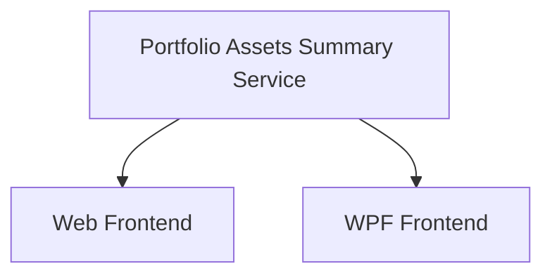

# Portfolio Summary — Per-Asset Breakdown

## 1. Executive Summary

The Portfolio Summary — Per-Asset Breakdown feature extends the existing Portfolio Navigator in both the WPF desktop application and the React web application. When a portfolio node is selected in the investment tree, the Summary tab is enhanced to display a table of all assets in that portfolio alongside their key performance metrics: date of first investment, current quantity held, total amount invested (net of sell proceeds), portfolio weight (each asset's share of total invested capital), current market value, and profit/loss percentage.

This builds on the aggregated totals already shown for portfolio selections (Total Bought, Total Sold, Total Credits from F04) by adding per-asset visibility into the portfolio composition. The feature replicates the "total" summary sheet the user currently maintains manually in a spreadsheet, bringing this overview directly into the application interface for both UIs.

The backend introduces a new Application-layer service and API endpoint that returns static per-asset data. Live current prices are fetched automatically on portfolio selection using the same Google Finance scraping mechanism already used by the individual asset summary view (F03) and the bulk price fetch feature. Failed price fetches are handled gracefully per row — the affected asset shows a dash in Current Value and % Profit while the rest of the table remains usable.

---

## 2. Problem and Opportunity

### The Problem

**Missing portfolio-level asset breakdown**
- When a portfolio is selected, the Summary tab shows only three aggregate totals (Total Bought, Total Sold, Total Credits); no breakdown of individual asset contributions is available
- Reviewing portfolio composition — which assets are largest positions, which are in profit or loss — requires switching to a separate spreadsheet maintained outside the application
- The WPF Summary tab currently renders asset-specific fields (ISIN, Country, Local Type, Asset Class, Quantity, Average Price, Current Value section) when a portfolio is selected; these fields are meaningless at portfolio level, occupying space that could show useful portfolio data

### The Opportunity

Each problem maps to a concrete deliverable:
- Missing asset breakdown → F01: Portfolio Assets Summary Service and Endpoint computes per-asset static data server-side; F02 and F03 surface it in the respective UIs
- Spreadsheet dependency → F02 and F03 together eliminate the need for a manual "total tab" by showing First Investment Date, Quantity, Total Invested, % Portfolio, Current Value, and % Profit in the Summary tab
- Misleading WPF fields → F03 introduces a portfolio-specific layout that hides asset-only fields when a portfolio node is selected

---

## 3. Target Audience

### Primary Users

**Personal Investor**
- Manages a multi-broker portfolio spanning UK (GBP) and Brazil (BRL) markets with assets across equities, real estate funds, ETFs, and fixed income
- Currently cross-references a manually maintained spreadsheet "total tab" to review portfolio composition — which positions are largest and whether each is in profit or loss
- Uses both the WPF desktop application and the React web application interchangeably and expects consistent information across both interfaces

---

## 4. Objectives

**Replace the spreadsheet summary sheet** with an in-app per-asset breakdown on the portfolio Summary tab
- Metric: Selecting any portfolio node in the investment tree shows the per-asset breakdown table with Asset Name, Total Invested, % Portfolio, and % Profit populated within 5 seconds of portfolio selection

**Remove misleading asset-specific fields** from the WPF portfolio-level Summary tab
- Metric: Selecting a Portfolio node in WPF shows no Quantity, Average Price, ISIN, Country, Local Type, or Asset Class fields; only the three aggregated totals and the per-asset breakdown table are visible in the Summary tab

**Provide automatic current value enrichment** without a manual refresh step
- Metric: Current Value and % Profit columns populate automatically on portfolio selection for all assets whose price fetch succeeds; failed fetches display "—" without blocking data for other assets

---

## 5. User Stories

### F01. Portfolio Assets Summary Service and Endpoint

- As the system, I want to compute per-asset summary data for a portfolio so that both frontends can display the breakdown without duplicating business logic
- As the system, I want to return assets sorted alphabetically by name so that the order matches the navigation tree

### F02. Portfolio Summary Tab — Web Frontend

- As a user, I want to see a per-asset breakdown table when I select a portfolio so that I can review each position's size, cost, and performance in one place
- As a user, I want the three portfolio totals (Total Bought, Total Sold, Total Credits) to remain visible at the top of the tab so that I retain the aggregated view I already had
- As a user, I want Current Value and % Profit to populate automatically on portfolio selection so that I do not have to click a Refresh button
- As a user, I want assets whose price cannot be fetched to show a dash instead of blocking the rest of the table so that I can still see data for all other assets
- As a user, I want % Profit to be colour-coded green for gains and red for losses so that I can scan the table quickly

### F03. Portfolio Summary Tab — WPF

- As a user, I want the WPF Summary tab to show the per-asset breakdown table when a portfolio is selected so that the WPF and web experiences are consistent
- As a user, I want the WPF Summary tab to hide asset-specific fields (ISIN, Country, Quantity, etc.) when a portfolio is selected so that I see only relevant portfolio-level information
- As a user, I want current prices to load automatically in the WPF table on portfolio selection so that Current Value and % Profit populate without manual interaction
- As a user, I want failed price fetches to show "—" in the affected row without impacting the rest of the table so that I can still read all other rows

---

## 6. Functionalities

### F01. Portfolio Assets Summary Service and Endpoint

**Provides:**
- Portfolio asset summary items: per-asset records containing AssetName, Ticker, Exchange, FirstInvestmentDate (nullable), CurrentQuantity, TotalBought, TotalSold, TotalInvested, PortfolioWeight (used by F02, F03)

**Capabilities:**
- Returns all assets in the specified portfolio regardless of active status (Quantity = 0 or > 0); this covers both active positions and fully sold assets that may exist in edge-case portfolios
- Assets are sorted alphabetically by AssetName, matching the navigation tree order
- `FirstInvestmentDate` is the date of the earliest Buy transaction for the asset; null when the asset has no Buy transactions
- `CurrentQuantity` is the net quantity held as tracked by the Asset entity (sum of Buy quantities minus sum of Sell quantities)
- `TotalBought` = sum of `TotalPrice` for all Buy transactions; `TotalSold` = sum of `TotalPrice` for all Sell transactions; `TotalInvested` = `TotalBought − TotalSold`
- `PortfolioWeight` = `TotalInvested / portfolioTotalInvested × 100`, where `portfolioTotalInvested` = sum of all assets' TotalInvested; returns 0 for all assets when the denominator is 0
- Returns an empty list when the portfolio has no assets (valid response, not an error)
- Returns HTTP 400 when `brokerName` or `portfolioName` is null or whitespace
- New service interface: `IPortfolioAssetSummaryQueryService` with method `GetPortfolioAssetsSummary(string brokerName, string portfolioName)` returning `IReadOnlyList<PortfolioAssetSummaryItemDTO>`
- New DTO `PortfolioAssetSummaryItemDTO` in the Application layer with properties: `AssetName`, `Ticker`, `Exchange`, `FirstInvestmentDate` (`DateTime?`), `CurrentQuantity`, `TotalBought`, `TotalSold`, `TotalInvested`, `PortfolioWeight` (all decimal where applicable)
- New API endpoint `GET /api/v1/financial/summary/portfolio/{brokerName}/{portfolioName}/assets` under the existing `/summary` route prefix in `SummaryController`

**Experience:**
- Endpoint responds within 200 ms (data is in-memory JSON repository; no external calls)
- Empty portfolio returns `[]` with HTTP 200
- HTTP 400 response includes standard problem details body

---

### F02. Portfolio Summary Tab — Web Frontend

**Consumes:**
- F01: portfolio asset summary items (AssetName, Ticker, Exchange, FirstInvestmentDate, CurrentQuantity, TotalBought, TotalSold, TotalInvested, PortfolioWeight)

**Capabilities:**
- New `PortfolioSummaryTab` component is rendered in `DetailPanel.tsx` for Portfolio nodes; `AggregatedSummaryTab` is still rendered for Broker nodes without modification; `AssetSummaryTab` is still rendered for Asset nodes without modification
- `PortfolioSummaryTab` contains two sections: (1) the aggregated totals section reusing `useAggregatedSummary` hook unchanged, and (2) the per-asset table driven by a new `usePortfolioAssetSummary` hook
- `usePortfolioAssetSummary` calls `GET /summary/portfolio/{brokerName}/{portfolioName}/assets`, then fires one `GET /prices/current?exchange={exchange}&ticker={ticker}` request per asset in parallel
- Prices are fetched once automatically on portfolio selection; there is no Refresh button
- A failed price fetch for an individual asset (network error or scraper error) sets that row's Current Value to unavailable; other rows are unaffected
- `CurrentValue` = `CurrentPrice × CurrentQuantity` (client-side computation)
- `% Profit` = `(CurrentValue − TotalInvested) / TotalInvested × 100` (client-side computation); displays `"—"` when TotalInvested is 0 or CurrentValue is unavailable
- `PortfolioWeight` displayed as a percentage with one decimal place (e.g. `23.4%`)
- `FirstInvestmentDate` displayed as a short date (e.g. `01/03/2021`); empty string when null
- `CurrentQuantity` formatted N8 to match existing transaction quantity display
- Monetary values (`TotalInvested`, `CurrentValue`) formatted N2
- `% Profit` formatted N2 with `%` suffix; positive values styled green, negative values styled red
- Table columns in fixed order: Asset Name | First Investment | Quantity | Total Invested | % Portfolio | Current Value | % Profit

**Experience:**
1. User selects a Portfolio node in the investment tree
2. `PortfolioSummaryTab` renders; the three totals section shows a loading indicator while `useAggregatedSummary` resolves; the table section shows a loading indicator while the F01 fetch resolves
3. Once static data arrives, the table rows render with Current Value and % Profit cells showing a per-cell loading indicator (`...`) while parallel price fetches are in flight
4. As each price resolves, the corresponding row's Current Value and % Profit update in place; rows whose price fetch fails show `"—"` in those two cells
5. If the F01 fetch itself fails, the table area shows an `ErrorState` component with a Retry button; the three totals section above is unaffected and continues to display normally

**Error Handling:**
- F01 endpoint failure: table area shows `ErrorState` with Retry; the `useAggregatedSummary` totals section operates independently and is not affected
- Individual price fetch failure: affected row's Current Value and % Profit display `"—"`; no error state or banner is shown for the row

---

### F03. Portfolio Summary Tab — WPF

**Consumes:**
- F01: portfolio asset summary items (AssetName, Ticker, Exchange, FirstInvestmentDate, CurrentQuantity, TotalBought, TotalSold, TotalInvested, PortfolioWeight)

**Capabilities:**
- When a Portfolio node is selected, the WPF Summary tab renders a portfolio-specific layout containing: (1) three colour-coded total labels (Total Bought in green, Total Sold in red, Total Credits in blue) and (2) a read-only DataGrid with one row per asset
- All fields currently shown in the WPF Summary tab that are only meaningful for assets (Quantity, Average Price, ISIN, Country, Local Type, Asset Class, Current Value section with Refresh button, Status) are hidden when a Portfolio node is selected; these fields remain visible and unchanged when an Asset node is selected
- The Credits tab behaviour is unchanged for all node types
- The Transactions tab behaviour is unchanged for all node types
- A new `LoadPortfolioSummary(string brokerName, string portfolioName)` method on `IAssetDetailsViewModel` replaces the existing `LoadPortfolioCredits` call when a Portfolio node is selected, or alternatively `LoadPortfolioCredits` is extended to also invoke the portfolio asset summary service and populate the new DataGrid rows
- Row view model properties: AssetName, FirstInvestmentDate (DateTime?, displayed as short date or empty), CurrentQuantity (N8), TotalInvested (N2), PortfolioWeight (one decimal %, e.g. `23.4%`), CurrentValue (N2 or `"—"` when unavailable), ProfitPercent (N2 % or `"—"` when unavailable), IsLoadingPrice (bool), PriceFetchFailed (bool)
- For each asset row, `IAssetPriceService` is called asynchronously; on success `CurrentValue = CurrentPrice × CurrentQuantity` and `ProfitPercent = (CurrentValue − TotalInvested) / TotalInvested × 100`; on failure or when TotalInvested is 0, the respective cell shows `"—"`
- `ProfitPercent` is coloured green when positive, red when negative, and default foreground when unavailable
- DataGrid columns in fixed order: Asset Name | First Investment | Quantity | Total Invested | % Portfolio | Current Value | % Profit
- DataGrid rows are read-only (no selection action, no double-click action)

**Experience:**
1. User selects a Portfolio node
2. WPF Summary tab switches to the portfolio layout: three colour-coded totals appear, DataGrid rows load synchronously from `IPortfolioAssetSummaryQueryService`
3. Each row's Current Value cell shows a loading indicator (e.g. `...`) while `IAssetPriceService` fetches in background per asset
4. As each price resolves, the row's Current Value and % Profit update in place via property change notification; failed price fetches update the row to show `"—"` in those cells
5. When the user selects a different node (asset, broker, or clears selection), the portfolio summary state is cleared from the ViewModel

---

## 7. Out of Scope

**Broker-level per-asset breakdown**
- The per-asset table is shown only for Portfolio nodes; selecting a Broker node continues to show only the three aggregated totals (Total Bought, Total Sold, Total Credits) from F04 in both UIs

**Column sorting and filtering**
- The table uses a fixed alphabetical sort; column header sorting and row filtering are not included in this release

**Clicking an asset row to navigate**
- Row selection in the per-asset table produces no navigation and loads no detail panel; the table is purely read-only

**Currency conversion**
- No cross-currency conversion is applied; all amounts are displayed in the portfolio's native currency as stored in transactions

**Overall portfolio % Profit**
- A total/footer row showing aggregate profit across all assets in the portfolio is not included; only individual asset rows are shown

**WPF Broker-node Summary tab changes**
- The WPF Summary tab layout change (hiding asset-specific fields) applies only when a Portfolio node is selected; the Broker node layout in WPF is not changed by this feature

**Manual price refresh**
- There is no per-asset or per-table Refresh button; prices are fetched once automatically on portfolio selection

---

## 8. Dependency Graph

| # | Feature | Priority | Dependencies |
|---|---------|----------|--------------|
| F01 | Portfolio Assets Summary Service and Endpoint | 1 | None |
| F02 | Portfolio Summary Tab — Web Frontend | 1 | F01 |
| F03 | Portfolio Summary Tab — WPF | 1 | F01 |

### Execution Waves
Features within the same wave can be built in parallel. A wave starts only after every feature in earlier waves is complete.

- **Wave 1**: F01
- **Wave 2**: F02, F03

### Priority levels
- **1** = Essential — product does not work without it
- **2** = Important — significant value addition
- **3** = Desirable — incremental improvement

---

## 9. Acceptance Criteria

### F01. Portfolio Assets Summary Service and Endpoint

- [ ] `GET /api/v1/financial/summary/portfolio/{brokerName}/{portfolioName}/assets` returns HTTP 200 with a JSON array
- [ ] Each item in the array contains `assetName`, `ticker`, `exchange`, `firstInvestmentDate` (nullable), `currentQuantity`, `totalBought`, `totalSold`, `totalInvested`, `portfolioWeight`
- [ ] `totalInvested` equals `totalBought − totalSold` for each item
- [ ] `portfolioWeight` values sum to 100 (within floating-point rounding tolerance) when at least one asset has a positive TotalInvested; all values are 0 when portfolioTotalInvested is 0
- [ ] Assets are returned sorted alphabetically by `assetName`
- [ ] `firstInvestmentDate` is the date of the earliest Buy transaction for that asset; null when the asset has no Buy transactions
- [ ] Endpoint returns HTTP 400 when `brokerName` or `portfolioName` is null or whitespace
- [ ] Endpoint returns an empty array (`[]`) with HTTP 200 when the portfolio has no assets

### F02. Portfolio Summary Tab — Web Frontend

- [ ] Selecting a Portfolio node renders `PortfolioSummaryTab` in the Summary tab
- [ ] Selecting a Broker node still renders `AggregatedSummaryTab` without the per-asset table (regression check)
- [ ] Selecting an Asset node still renders `AssetSummaryTab` (regression check)
- [ ] Three totals (Total Bought in green, Total Sold in red, Total Credits in blue) appear at the top of the Portfolio Summary tab
- [ ] Per-asset table appears below the totals with columns: Asset Name, First Investment, Quantity, Total Invested, % Portfolio, Current Value, % Profit
- [ ] Current Value and % Profit populate automatically without a Refresh button
- [ ] A failed price fetch for one asset shows `"—"` in that row's Current Value and % Profit; other rows are unaffected
- [ ] `% Profit` is displayed in green when positive and red when negative
- [ ] When the F01 endpoint call fails, an error state with a Retry button is shown in the table area; the three totals section above continues to display normally
- [ ] `CurrentValue = CurrentPrice × CurrentQuantity` verified with known test data
- [ ] `% Profit = (CurrentValue − TotalInvested) / TotalInvested × 100` verified with known test data
- [ ] `"—"` is shown in % Profit when TotalInvested is 0

### F03. Portfolio Summary Tab — WPF

- [ ] Selecting a Portfolio node in WPF shows the three colour-coded totals and the per-asset DataGrid in the Summary tab
- [ ] Selecting a Portfolio node in WPF shows no Quantity, Average Price, ISIN, Country, Local Type, Asset Class, or Current section fields in the Summary tab
- [ ] Selecting an Asset node in WPF still shows all asset-specific Summary tab fields (regression check)
- [ ] DataGrid rows load immediately from the Application service on portfolio selection (no async wait for the initial data)
- [ ] Current Value column populates automatically as price fetches complete; no Refresh button is present
- [ ] A failed price fetch shows `"—"` in that row's Current Value and % Profit; other rows update normally
- [ ] `% Profit` is green when positive, red when negative, and default foreground when null
- [ ] DataGrid rows are read-only; no double-click or selection action occurs
- [ ] Credits tab behaviour is unchanged when a Portfolio node is selected (regression check)
- [ ] Transactions tab behaviour is unchanged when a Portfolio node is selected (regression check)

### Cross-Feature Integration

- [ ] The `ticker` and `exchange` values returned by F01's endpoint are used without modification in F02's `GET /prices/current?exchange={exchange}&ticker={ticker}` calls, producing correct price lookups
- [ ] The `ticker` and `exchange` values from F01's Application service are used without modification in F03's `IAssetPriceService` calls, producing correct price lookups
- [ ] The `totalInvested` and `currentQuantity` values from F01's endpoint are used without transformation in F02's client-side computation of `CurrentValue` and `% Profit`
- [ ] The `totalInvested` and `currentQuantity` values from F01's Application service are used without transformation in F03's ViewModel computation of `CurrentValue` and `% Profit`
