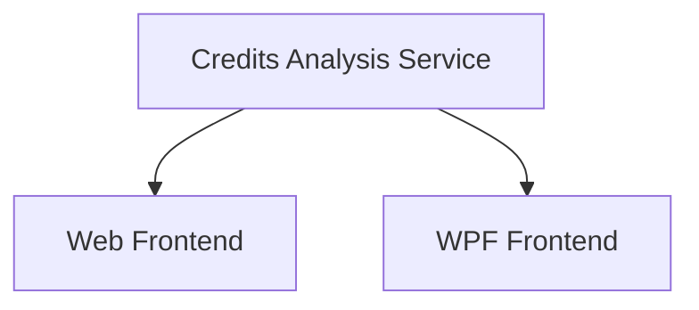

# Portfolio Credits Analysis Enhancement

## 1. Executive Summary

The Portfolio Credits Analysis Enhancement (P03) extends the per-asset breakdown table introduced in P02 in both the WPF desktop application and the React web application. When a portfolio node is selected, the Summary tab's per-asset table gains a visually separated credits-analysis column group positioned after the XIRR column, plus a summary footer panel rendered below the table.

The five new columns surface income-focused metrics that are not available anywhere else in the application: the total credits received in the most recent payment month for each asset, the month and year of that payment period, those credits expressed as a percentage of total amount invested, estimated annual credits (derived from automatic payment-frequency detection against the asset's credit history), and the corresponding estimated annual yield percentage. A thick column-group separator after XIRR makes the boundary between performance metrics and income-analysis metrics visually clear.

A summary footer panel beneath the grid provides portfolio-level totals for all key monetary columns. The credits total in the footer is scoped explicitly to the current calendar month and labelled accordingly (e.g., "Credits Jul 2026"), so the user can see at a glance how much income has arrived this month across the whole portfolio without confusing it with the all-time total already shown in the table.

---

## 2. Problem and Opportunity

### The Problem

**No visibility into recent credit income per asset**
- The per-asset table introduced in P02 shows only the lifetime total of credits received (Total Credits column); there is no way to see how much an individual asset paid last month or which payment period that corresponds to
- The user cannot quickly compare which assets paid most recently or identify positions that have not produced income in several months

**No forward income estimate**
- There is no projected annual dividend or rent yield per asset; evaluating expected annual income from a position requires manual calculation outside the application
- Payment frequency varies by asset class (real estate funds pay monthly, some shares pay quarterly or every four months); without frequency detection the user must recall or look up each asset's schedule separately

**No portfolio-level monetary summary**
- The existing table has no footer; comparing the sum of all invested capital, current value, and current-month credits requires mental arithmetic or a spreadsheet
- The current-month credits total — a common checkpoint for income investors — is not visible anywhere in the interface

### The Opportunity

Each problem maps to a concrete deliverable:

- No recent credit visibility → new Last Month Credits, Last Credit Month, and Last Month % columns give per-asset income context for the most recent payment period
- No forward income estimate → automatic frequency detection from credit history feeds the Est. Annual Credits and Est. Annual % columns, eliminating manual calculation
- No portfolio-level summary → a footer panel below the table aggregates Total Invested, Total Credits, Current Value, current-month credits (clearly labelled), and Est. Annual Credits into a single at-a-glance strip

---

## 3. Target Audience

### Primary Users

**Personal Investor**
- Manages a multi-broker portfolio spanning UK (GBP) and Brazil (BRL) markets with assets across equities, real estate funds, ETFs, and fixed income
- Monitors dividend and rent income regularly and wants to see, per position, how much was received last payment month and what the projected annual yield is
- Uses both the WPF desktop application and the React web application interchangeably and expects consistent information across both interfaces

---

## 4. Objectives

**Surface last-payment-month credits per asset** so the user can identify recent income without leaving the application
- Metric: Every portfolio asset row displays Last Month Credits, Last Credit Month, and Last Month % immediately when the portfolio summary loads, before price fetches complete

**Provide estimated annual income per asset** based on automatically detected payment frequency
- Metric: Assets with at least 2 distinct credit months in history display Est. Annual Credits and Est. Annual %; assets with undetectable frequency display "—" in those two columns

**Provide a portfolio-level monetary summary footer** that aggregates key columns including a clearly labelled current-month credits total
- Metric: A summary footer panel is visible below the per-asset table showing Total Invested, Total Credits, Current Value, Credits [Month Year] (current calendar month), and Est. Annual Credits; the credits total label includes the month and year so it is unambiguous

---

## 5. User Stories

### F01. Credits Analysis — Service Enhancement

- As the system, I want to compute the last-payment-month credits per asset so that both frontends can display recent income without re-fetching the credit history separately
- As the system, I want to detect the payment frequency of an asset from its credit history so that an estimated annual credit amount can be derived without manual configuration
- As the system, I want to compute current-calendar-month credits per asset so that the frontend can sum them for the portfolio footer without having to distinguish credits from sell transactions in the existing CashFlows list
- As the system, I want to return null for frequency-dependent fields when the payment pattern cannot be reliably detected so that frontends display "—" instead of misleading estimates

### F02. Credits Analysis Columns and Footer — Web Frontend

- As a user, I want to see a visual separator after the XIRR column so that the credits-analysis columns are clearly grouped and distinct from the performance metrics
- As a user, I want to see Last Month Credits per asset so that I know how much each position paid in its most recent payment period
- As a user, I want to see the month and year of the last credit payment per asset so that I can tell at a glance whether an asset paid recently or has not paid in some time
- As a user, I want to see last-month credits as a percentage of total invested per asset so that I can compare the monthly yield across different positions
- As a user, I want to see estimated annual credits and annual yield percentage per asset so that I can evaluate forward income without manual calculation
- As a user, I want a summary footer panel below the table showing total invested, total credits, current value, current-month credits, and estimated annual credits so that I have a portfolio-level income summary in one place
- As a user, I want the current-month credits total in the footer to be labelled with the month and year so that I can distinguish it from the all-time total credits figure

### F03. Credits Analysis Columns and Footer — WPF

- As a user, I want the WPF DataGrid to show the same credits-analysis columns as the web application so that both interfaces provide consistent information
- As a user, I want a visual column-group separator after XIRR in the WPF DataGrid so that the credits-analysis section is visually distinct
- As a user, I want a summary footer panel below the WPF DataGrid showing the same aggregated totals as the web footer so that the WPF experience is consistent
- As a user, I want the current-month credits total in the WPF footer to be labelled with the month and year so that its scope is unambiguous

---

## 6. Functionalities

### F01. Credits Analysis — Service Enhancement

**Provides:**
- Per-asset credits-analysis fields: LastMonthCredits, LastCreditMonth, LastMonthCreditsPercent, EstimatedAnnualCredits, EstimatedAnnualPercent, CreditFrequencyPerYear, CurrentMonthCredits (used by F02, F03)

**Capabilities:**
- Extends the existing `PortfolioAssetSummaryItemDTO` (introduced in P02-F01) with seven new nullable fields; no breaking change to existing fields
- New DTO fields per asset item:
  - `LastMonthCredits` (decimal): sum of `Value` for all Credit records whose date falls in the most recent month where at least one credit date is ≤ today; 0 when the asset has no credits at all
  - `LastCreditMonth` (string, nullable): the year-month of the last credit period formatted as `"YYYY-MM"` (e.g., `"2026-06"`); null when the asset has no credits
  - `LastMonthCreditsPercent` (decimal, nullable): `LastMonthCredits / TotalInvested × 100`; null when `TotalInvested` is 0 or `LastCreditMonth` is null
  - `CreditFrequencyPerYear` (int, nullable): detected number of payment periods per year — 12 (monthly), 4 (quarterly), or 3 (four-month); null when fewer than 2 distinct credit months exist in history or when the average gap does not fall within a recognised range
  - `EstimatedAnnualCredits` (decimal, nullable): `LastMonthCredits × CreditFrequencyPerYear`; null when `CreditFrequencyPerYear` is null
  - `EstimatedAnnualPercent` (decimal, nullable): `EstimatedAnnualCredits / TotalInvested × 100`; null when `EstimatedAnnualCredits` is null or `TotalInvested` is 0
  - `CurrentMonthCredits` (decimal): sum of `Value` for all Credit records whose date falls in the current calendar month (year and month matching today); 0 when no credits exist in the current month
- **Frequency detection algorithm:**
  1. Collect all distinct (Year, Month) combinations from the asset's credit history, sorted ascending
  2. Require at least 2 distinct months; if fewer, `CreditFrequencyPerYear` = null
  3. Compute the average gap in months between consecutive distinct credit months: `averageGap = totalMonths / (distinctMonthCount − 1)`
  4. Map average gap to frequency: ≤ 1.5 months → 12; 1.6–3.5 months → 4; 3.6–5.0 months → 3; outside all ranges → null
- **Last credit month rule:** the last credit month is the most recent `(Year, Month)` pair from the asset's credit history where at least one credit has `Date ≤ today`; credits with future dates are excluded
- The endpoint responds within 200 ms (data is in-memory; no external calls)

**Experience:**
- Endpoint response is structurally identical to P02-F01's response with additional fields; clients that ignore unknown fields are unaffected
- Null fields in the JSON response are serialised as `null` (not omitted)

---

### F02. Credits Analysis Columns and Footer — Web Frontend

**Consumes:**
- F01: per-asset credits-analysis fields (LastMonthCredits, LastCreditMonth, LastMonthCreditsPercent, EstimatedAnnualCredits, EstimatedAnnualPercent, CreditFrequencyPerYear, CurrentMonthCredits)

**Capabilities:**
- The existing `PortfolioSummaryTab` component is extended; no new top-level component is introduced
- **Column group separator:** a thick left border (3 px, using the table's accent colour) is applied to the "Last Month Credits" column header and every cell in that column, visually separating the credits-analysis group from the XIRR column to its left; no additional separator column is inserted into the DOM
- **Five new columns appended after XIRR** (in this order):

  | Column | Source | Format | Unavailable |
  |---|---|---|---|
  | Last Month Credits | `LastMonthCredits` | N2 | "—" when no credits |
  | Last Credit Month | `LastCreditMonth` | "MMM YYYY" (e.g., "Jun 2026") | "—" when null |
  | Last Month % | `LastMonthCreditsPercent` | N2 with "%" suffix | "—" when null |
  | Est. Annual Credits | `EstimatedAnnualCredits` | N2 | "—" when null |
  | Est. Annual % | `EstimatedAnnualPercent` | N2 with "%" suffix | "—" when null |

- Last Month Credits, Est. Annual Credits display in the same neutral style as other monetary columns; no colour coding
- **Footer panel:** a styled `
` rendered immediately below the `<table>` element (not a `<tfoot>` or `<tr>`); always visible once the F01 data has loaded; not affected by price fetch status
- Footer panel items (labelled value pairs, left-to-right):
  1. **Total Invested** — sum of `TotalInvested` across all assets
  2. **Total Credits** — sum of `TotalCredits` (all-time) across all assets
  3. **Current Value** — sum of resolved `CurrentValue` across all assets; shows a partial sum with an asterisk (`*`) and footnote "excludes assets with pending prices" while price fetches are still in progress; updates in place as prices resolve
  4. **Credits [Mon YYYY]** — sum of `CurrentMonthCredits` across all assets, where `[Mon YYYY]` is the current calendar month formatted as "Jul 2026"; label updates each calendar month automatically
  5. **Est. Annual Credits** — sum of `EstimatedAnnualCredits` across all assets for which the value is non-null; shows "—" when no asset has a detectable frequency
- Footer panel background is visually distinct from the table rows (e.g., light grey or the card's header colour); footer is not scrollable with the table — it stays anchored below the table's scroll area if the table overflows
- Columns with no meaningful total (First Investment, Quantity, % Portfolio, % Profit, % Profit w/ Credits, XIRR, Last Credit Month, Last Month %, Est. Annual %) are not represented in the footer

**Experience:**
1. User selects a Portfolio node; `PortfolioSummaryTab` renders as before (P02 behaviour unchanged)
2. F01 data loads; all five new columns populate immediately (Last Month Credits, Last Credit Month, Last Month %, Est. Annual Credits, Est. Annual % are available before price fetches complete); the footer panel appears with Total Invested, Total Credits, Credits [Mon YYYY], and Est. Annual Credits populated; Current Value footer shows "Calculating…" 
3. Price fetches resolve per row; Current Value footer updates incrementally; once all prices are resolved the asterisk and footnote are removed
4. Assets with no credits show "—" in Last Month Credits, Last Credit Month, and Last Month %; assets with fewer than 2 distinct credit months or undetectable frequency show "—" in Est. Annual Credits and Est. Annual %

**Error Handling:**
- F01 endpoint failure: existing `ErrorState` with Retry is shown (P02 behaviour); footer panel is not rendered until data is available
- Individual price fetch failure: no change to footer behaviour; that asset's CurrentValue is excluded from the footer sum with the asterisk notation

---

### F03. Credits Analysis Columns and Footer — WPF

**Consumes:**
- F01: per-asset credits-analysis fields (LastMonthCredits, LastCreditMonth, LastMonthCreditsPercent, EstimatedAnnualCredits, EstimatedAnnualPercent, CreditFrequencyPerYear, CurrentMonthCredits)

**Capabilities:**
- The existing WPF `PortfolioSummaryView` and its `PortfolioSummaryViewModel` are extended; no new top-level view is introduced
- **Column group separator in DataGrid:** the "Last Month Credits" DataGrid column has its `CellStyle` and `HeaderStyle` overridden to apply a thick left border (3 px, accent brush) that visually separates the credits-analysis group from the XIRR column; no additional separator column is inserted into the DataGrid
- **Five new DataGrid columns appended after XIRR** (in this order):

  | Column Header | VM Property | Format | Unavailable |
  |---|---|---|---|
  | Last Month Credits | `LastMonthCredits` | N2 | "—" when no credits |
  | Last Credit Month | `LastCreditMonth` | "MMM yyyy" (e.g., "Jun 2026") | "—" when null |
  | Last Month % | `LastMonthCreditsPercent` | N2 "%" | "—" when null |
  | Est. Annual Credits | `EstimatedAnnualCredits` | N2 | "—" when null |
  | Est. Annual % | `EstimatedAnnualPercent` | N2 "%" | "—" when null |

- Row view model adds: `LastMonthCredits` (decimal), `LastCreditMonthDisplay` (string, e.g. "Jun 2026" or "—"), `LastMonthCreditsPercentDisplay` (string, e.g. "1.25%" or "—"), `EstimatedAnnualCredits` (decimal?), `EstimatedAnnualCreditsDisplay` (string), `EstimatedAnnualPercentDisplay` (string)
- No colour coding on credits-analysis columns (neutral foreground)
- **Footer panel:** a `WrapPanel` or `UniformGrid` rendered in the same parent container as the DataGrid, positioned below it via `StackPanel` layout; it is a separate XAML element, not a DataGrid row or `DataGrid.FooterTemplate`
- Footer panel items (labelled `TextBlock` pairs):
  1. **Total Invested** — sum of `TotalInvested` across all row view models
  2. **Total Credits** — sum of `TotalCredits` (all-time) across all row view models
  3. **Current Value** — sum of resolved `CurrentValue` across all row view models; shows "Calculating…" while any `IsLoadingPrice` is true; updates via `INotifyPropertyChanged` as prices resolve
  4. **Credits [Mon yyyy]** — sum of `CurrentMonthCredits` across all row view models, formatted N2; label derived from `DateTime.Today` at load time (e.g., "Credits Jul 2026")
  5. **Est. Annual Credits** — sum of non-null `EstimatedAnnualCredits` across all row view models; "—" when no row has a non-null value
- Footer panel background uses `SystemColors.ControlBrush` or equivalent to visually distinguish it from the DataGrid rows; it is outside the DataGrid's scroll viewport

**Experience:**
1. User selects a Portfolio node; WPF Summary tab loads as per P02 behaviour
2. Application service response arrives; all row VMs are created with Last Month Credits, Last Credit Month, Last Month %, Est. Annual Credits, Est. Annual % populated immediately; footer panel appears with Total Invested, Total Credits, Credits [Mon yyyy], and Est. Annual Credits
3. Price fetches run asynchronously per row (P02 behaviour); footer Current Value updates via property-change notification as each price resolves; "Calculating…" indicator is replaced with the N2 sum once all IsLoadingPrice flags are false
4. Rows with no credits show "—" in Last Month Credits, Last Credit Month, Last Month %; rows with undetectable frequency show "—" in Est. Annual Credits and Est. Annual %

---

## 7. Out of Scope

**Manual frequency override**
- Payment frequency is detected automatically from history; there is no UI or configuration for the user to override the detected frequency per asset

**Broker-level credits analysis**
- The new columns and footer apply only to the Portfolio node Summary tab; selecting a Broker node continues to show only the three aggregated totals (P02 behaviour unchanged)

**Credits trend chart or history view**
- No chart, sparkline, or history panel for credits over time is included

**Sorting and filtering on new columns**
- The new columns follow the same fixed alphabetical sort as the existing table; interactive column sorting is not added

**Notification or alert when credits arrive**
- No push notification, badge, or email is triggered when a credit is added to the data

**Cross-currency credits aggregation**
- Footer totals are in the portfolio's native currency; no cross-currency conversion is applied in the footer or the new columns

**Credit frequency detection for assets with fewer than 2 credit months**
- Assets with 0 or 1 distinct credit months in history always show "—" in Est. Annual Credits and Est. Annual %; no partial estimation is attempted

---

## 8. Dependency Graph

| # | Feature | Priority | Dependencies |
|---|---------|----------|--------------|
| F01 | Credits Analysis — Service Enhancement | 1 | None |
| F02 | Credits Analysis Columns and Footer — Web Frontend | 1 | F01 |
| F03 | Credits Analysis Columns and Footer — WPF | 1 | F01 |

### Execution Waves
Features within the same wave can be built in parallel. A wave starts only after every feature in earlier waves is complete.

- **Wave 1**: F01
- **Wave 2**: F02, F03

### Priority levels
- **1** = Essential — product does not work without it
- **2** = Important — significant value addition
- **3** = Desirable — incremental improvement

---

## 9. Acceptance Criteria

### F01. Credits Analysis — Service Enhancement

- [x] `GET /api/v1/financial/summary/portfolio/{brokerName}/{portfolioName}/assets` response includes `lastMonthCredits`, `lastCreditMonth`, `lastMonthCreditsPercent`, `creditFrequencyPerYear`, `estimatedAnnualCredits`, `estimatedAnnualPercent`, `currentMonthCredits` for every item
- [x] `lastMonthCredits` equals the sum of all credit `Value` fields whose date falls in the most recent credit month ≤ today; is 0 when the asset has no credits
- [x] `lastCreditMonth` is formatted `"YYYY-MM"`; is null when the asset has no credits
- [x] `lastMonthCreditsPercent` equals `lastMonthCredits / totalInvested × 100`; is null when `totalInvested` is 0 or `lastCreditMonth` is null
- [x] `currentMonthCredits` equals the sum of credit `Value` fields whose date falls in the current calendar month (year + month matching today); is 0 when no such credits exist
- [x] **Frequency detection — monthly:** an asset with credits in Jan, Feb, Mar (gaps = 1, 1) returns `creditFrequencyPerYear = 12`
- [x] **Frequency detection — quarterly:** an asset with credits in Jan, Apr, Jul (gaps = 3, 3) returns `creditFrequencyPerYear = 4`
- [x] **Frequency detection — four-month:** an asset with credits in Jan, May, Sep (gaps = 4, 4) returns `creditFrequencyPerYear = 3`
- [x] **Frequency detection — undetectable:** an asset with only 1 distinct credit month returns `creditFrequencyPerYear = null`; an asset with gaps averaging outside 0–5 months also returns null
- [x] `estimatedAnnualCredits` equals `lastMonthCredits × creditFrequencyPerYear`; is null when `creditFrequencyPerYear` is null
- [x] `estimatedAnnualPercent` equals `estimatedAnnualCredits / totalInvested × 100`; is null when `estimatedAnnualCredits` is null or `totalInvested` is 0
- [x] Credits with a future date (after today) are excluded from `lastCreditMonth` and `lastMonthCredits` calculations
- [x] Existing fields (`assetName`, `totalInvested`, `totalCredits`, `cashFlows`, etc.) are unchanged and pass all P02 acceptance criteria without regression

### F02. Credits Analysis Columns and Footer — Web Frontend

- [x] Five new columns appear after XIRR in the web per-asset table: Last Month Credits, Last Credit Month, Last Month %, Est. Annual Credits, Est. Annual %
- [x] A thick left border visually separates the "Last Month Credits" column from the XIRR column; no additional column is inserted between them
- [x] Last Month Credits, Last Credit Month, Last Month %, Est. Annual Credits, and Est. Annual % are populated immediately on F01 data load, before any price fetches complete
- [x] An asset with no credits shows "—" in Last Month Credits, Last Credit Month, and Last Month %
- [x] An asset with fewer than 2 distinct credit months shows "—" in Est. Annual Credits and Est. Annual %
- [x] Last Credit Month displays in "MMM YYYY" format (e.g., "Jun 2026")
- [x] Last Month % displays as N2 with "%" suffix (e.g., "1.25%"); "—" when null
- [x] Est. Annual % displays as N2 with "%" suffix (e.g., "5.00%"); "—" when null
- [x] Footer panel is visible below the table once F01 data has loaded
- [x] Footer shows: Total Invested (sum), Total Credits (sum), Current Value (sum), Credits [Mon YYYY] (current month sum), Est. Annual Credits (sum of non-null values)
- [x] Footer "Credits" label includes the current month and year (e.g., "Credits Jul 2026") matching the current calendar month
- [x] Current Value footer shows "Calculating…" while price fetches are in progress and updates as prices resolve
- [x] Footer is not a `<tr>` inside the table; it is a separate DOM element rendered below the table
- [x] All existing columns (Asset Name through XIRR) and the three portfolio totals above the table are unaffected (P02 regression check)

### F03. Credits Analysis Columns and Footer — WPF

- [ ] Five new DataGrid columns appear after XIRR in the WPF DataGrid: Last Month Credits, Last Credit Month, Last Month %, Est. Annual Credits, Est. Annual %
- [ ] The "Last Month Credits" DataGrid column has a visually distinct thick left border separating it from XIRR
- [ ] New columns are populated immediately when the Application service response arrives, before any price fetches complete
- [ ] An asset with no credits shows "—" in Last Month Credits, Last Credit Month, and Last Month %
- [ ] An asset with fewer than 2 distinct credit months shows "—" in Est. Annual Credits and Est. Annual %
- [ ] Last Credit Month displays as "MMM yyyy" (e.g., "Jun 2026"); "—" when null
- [ ] Footer panel is a separate XAML element below the DataGrid (not a DataGrid row)
- [ ] WPF footer shows: Total Invested, Total Credits, Current Value, Credits [Mon yyyy] (current month), Est. Annual Credits — consistent with the web footer
- [ ] WPF footer "Credits" label includes the current month and year (e.g., "Credits Jul 2026")
- [ ] Current Value in the WPF footer shows "Calculating…" while any row has `IsLoadingPrice = true`; updates via property-change notification as prices resolve
- [ ] All existing DataGrid columns (Asset Name through XIRR) and the three colour-coded totals above the DataGrid are unaffected (P02 regression check)

### Cross-Feature Integration

- [x] The `lastMonthCredits`, `lastCreditMonth`, `lastMonthCreditsPercent`, `estimatedAnnualCredits`, `estimatedAnnualPercent`, and `currentMonthCredits` values returned by F01's endpoint are used without transformation in F02's column rendering
- [ ] The same fields from F01's Application service are used without transformation in F03's row view model properties
- [x] The `currentMonthCredits` values from F01 are summed by F02 to produce the footer "Credits [Mon YYYY]" total, verified with a portfolio containing assets with credits in the current month and assets without
- [ ] The `currentMonthCredits` values from F01 are summed by F03 to produce the WPF footer total, verified with the same test portfolio
