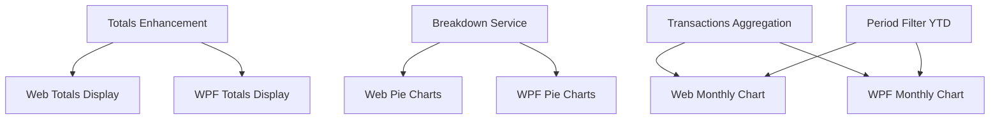

# Broker-Level View Improvements

## 1. Executive Summary

Broker-Level View Improvements extends the Financial application's Broker Summary and Transactions views, in both the WPF desktop application and the React web application, with corrected totals, visual portfolio/asset breakdowns, and a monthly investment trend chart. Today, selecting a Broker node shows only three aggregate totals (Total Bought, Total Sold, Total Credits) in the web app, but in WPF it incorrectly falls back to the individual-asset layout, displaying a cluttered set of zeroed, meaningless fields (Quantity, ISIN, Country, Current Value section, and more). Neither platform currently shows a net "Total Invested" figure, nor any visual breakdown of how a broker's capital is distributed across its portfolios and assets.

This feature set fixes the WPF layout bug, adds a Total Invested total (Total Bought − Total Sold) at both Broker and Portfolio levels, and introduces pie chart visualizations on the Broker Summary screen: one chart showing each active portfolio's share of the broker's total invested capital, and one additional chart per portfolio showing its own assets' share within that portfolio. The "Encerradas" (closed) portfolio and any fully-sold asset (zero quantity) are excluded from all of these totals and charts, since they no longer represent live capital allocation.

Separately, the Transactions tab — currently available only for individual assets — is extended to Broker and Portfolio levels and gains a new monthly investment chart (Bought − Sold per calendar month), rendered as bars by default with an optional line view, filterable by six time periods (This Month, Last 3 Months, Last 6 Months, Last 12 Months, YTD, All Time). This same expanded period-filter set is also applied to the existing Credits tab chart for consistency across the two features.

---

## 2. Problem and Opportunity

### The Problem

**Misleading WPF Broker-level display**
- Selecting a Broker node in WPF reuses the individual-asset layout, showing Quantity (0.00000000), Average Price (0.00), ISIN, Country, Local Type, Asset Class, a Current Value section with a Refresh button, and a Status field — none of which have any meaning at the broker level
- The three real aggregate totals (Total Bought, Total Sold, Total Credits) are visually buried among this irrelevant clutter, making the Broker Summary screen harder to read than the Portfolio Summary screen, which was already fixed for this exact problem in a prior feature

**No net investment figure**
- Total Bought and Total Sold are shown side by side, but the user must mentally subtract them to know how much capital is actually still deployed; there is no single "Total Invested" number at either Broker or Portfolio level

**No visual breakdown of capital allocation**
- Reviewing how capital is distributed across portfolios, or across assets within a portfolio, requires manually reading and comparing individual numbers in a table; there is no chart that shows relative weight at a glance
- Historical/closed activity (the Encerradas portfolio, fully-sold assets) has no way to be excluded from view when the user only cares about live capital allocation

**No visibility into investment pace over time**
- The Transactions tab shows only a flat list of individual Buy/Sell rows for a single asset; there is no way to see how much net capital was deployed per month, whether spending is accelerating or slowing, or to view this at the Broker or Portfolio level at all (the tab does not support those node types today)

### The Opportunity

Each problem maps to a concrete deliverable:
- Misleading WPF display → F06 replaces the individual-asset fallback with a dedicated Broker totals-only layout, mirroring the fix already applied to the Portfolio level
- No net investment figure → F01 introduces a Total Invested total, surfaced in both UIs by F05 (Web) and F06 (WPF)
- No visual breakdown → F02 computes an Encerradas-and-inactive-asset-excluded breakdown of portfolios and assets by Total Invested; F07 (Web) and F08 (WPF) render it as pie charts on the Broker Summary screen
- No investment-pace visibility → F03 provides aggregated transaction data for Broker and Portfolio scopes; F09 (Web) and F10 (WPF) render the monthly Bought-minus-Sold chart with period filtering, extending the Transactions tab beyond its current Asset-only scope; F04 extends the period-filter options (adding YTD) consistently across both the Credits and Transactions charts

---

## 3. Target Audience

### Primary Users

**Personal Investor**
- Manages a multi-broker portfolio spanning UK (GBP) and Brazil (BRL) markets with assets across equities, real estate funds, ETFs, and fixed income
- Maintains a "Encerradas" portfolio to archive positions that have been fully exited, and wants broker-level views to reflect only live, active capital allocation by default
- Uses both the WPF desktop application and the React web application interchangeably and expects consistent totals, charts, and behavior across both interfaces
- Wants to understand, at a glance, how much of their capital sits in each portfolio and each asset, and how their monthly investment pace has trended over time

---

## 4. Objectives

**Correct the WPF Broker-level display** to show only relevant aggregate information
- Metric: Selecting a Broker node in WPF shows zero asset-specific fields (Quantity, ISIN, Country, Local Type, Asset Class, Current Value section, Status); only the four totals are visible

**Provide an accurate, consistent net investment figure** at both Broker and Portfolio levels
- Metric: Total Invested (`Total Bought − Total Sold`) is displayed alongside the existing three totals in 100% of Broker and Portfolio selections, in both UIs, and always equals `Total Bought − Total Sold` for that scope

**Exclude closed/inactive capital from broker-level totals and charts**
- Metric: Total Bought, Total Sold, Total Credits, and Total Invested at the Broker level never include transactions or credits belonging to the Encerradas portfolio or to any asset with zero quantity, verified by automated tests

**Deliver an at-a-glance visual breakdown of capital allocation**
- Metric: Selecting a Broker node renders one portfolio-breakdown pie chart and one asset-breakdown pie chart per eligible portfolio within 3 seconds, in both UIs

**Surface monthly investment pace with flexible time filtering**
- Metric: The Transactions tab renders a monthly Bought-minus-Sold chart for Asset, Portfolio, and Broker selections, supporting 6 period filters and a Bar/Line display toggle, in both UIs

---

## 5. User Stories

### F01. Aggregated Totals Enhancement — Application Layer

- As the system, I want to compute Total Invested as Total Bought minus Total Sold at both Broker and Portfolio scope so that both frontends can display it without duplicating the subtraction logic
- As the system, I want Broker-level totals to exclude the Encerradas portfolio so that closed/archived capital never inflates the live broker view
- As the system, I want Broker and Portfolio totals to continue excluding assets with zero quantity so that fully-exited positions do not distort current totals

### F02. Broker Portfolio & Asset Breakdown Service — Application Layer

- As the system, I want to compute each eligible portfolio's share of a broker's Total Invested so that the web and WPF frontends can render a portfolio breakdown pie chart without recomputing aggregation logic
- As the system, I want to compute each eligible asset's share of its portfolio's Total Invested so that both frontends can render a per-portfolio asset breakdown pie chart
- As the system, I want to exclude the Encerradas portfolio and non-positive Total Invested slices from the breakdown so that both frontends receive only chart-ready, meaningful data

### F03. Broker & Portfolio Transactions Aggregation Service — Application Layer

- As the system, I want to return the combined list of Buy/Sell transactions for every asset under a given broker so that frontends can compute a broker-level monthly investment chart
- As the system, I want to return the combined list of Buy/Sell transactions for every asset under a given portfolio so that frontends can compute a portfolio-level monthly investment chart

### F04. Chart Period Filter — YTD Extension

- As a user, I want a "Year to Date" period option on the Credits tab chart so that I can see this calendar year's activity without manually approximating it with "Last 12 Months"
- As a user, I want the Transactions tab's new monthly chart to offer the same period options as the Credits tab (This Month, Last 3 Months, Last 6 Months, Last 12 Months, YTD, All Time) so that I have a consistent filtering experience across both charts

### F05. Broker & Portfolio Totals Display — Web Frontend

- As a user, I want to see a Total Invested figure alongside Total Bought, Total Sold, and Total Credits when I select a Broker or Portfolio node so that I know my net deployed capital without doing mental math
- As a user, I want Total Invested to be colour-coded (green when non-negative, red when negative) so that I can tell at a glance whether a scope has net positive or net negative deployed capital

### F06. Broker & Portfolio Totals Display — WPF

- As a user, I want selecting a Broker node in WPF to show only the four aggregate totals, with no leftover asset-specific fields, so that the screen is as clean as the Portfolio-level view
- As a user, I want to see Total Invested alongside Total Bought, Total Sold, and Total Credits for both Broker and Portfolio selections in WPF so that the desktop app matches the web app's information

### F07. Broker Breakdown Pie Charts — Web Frontend

- As a user, I want to see a pie chart showing each of my active portfolios' share of my broker's total invested capital so that I can quickly see where my money is concentrated
- As a user, I want to see a separate pie chart for each portfolio showing its assets' relative weight so that I can review composition without opening each portfolio individually
- As a user, I want to hover a pie slice to see its exact name, value, and percentage so that I can get precise figures without leaving the broker screen
- As a user, I want the Encerradas portfolio and any fully-exited position to be excluded from these charts so that closed capital doesn't distort my view of active allocation

### F08. Broker Breakdown Pie Charts — WPF

- As a user, I want the same portfolio and per-portfolio asset breakdown pie charts available in WPF as in the web app so that both interfaces show consistent visual information
- As a user, I want to hover a pie slice in WPF to see its name, value, and percentage so that I have the same detail available as in the web app

### F09. Transactions Monthly Investment Chart — Web Frontend

- As a user, I want to see a chart of my net monthly investment (Bought minus Sold) so that I can see whether my investment pace is increasing or decreasing over time
- As a user, I want to select a Broker or Portfolio node and still see a Transactions view (previously unavailable) showing this monthly chart so that I'm not limited to reviewing investment pace one asset at a time
- As a user, I want to filter the chart by This Month, Last 3 Months, Last 6 Months, Last 12 Months, YTD, or All Time so that I can focus on the timeframe I care about
- As a user, I want to switch the chart between bar and line display, with bars shown by default, so that I can pick the visual style I find clearest

### F10. Transactions Monthly Investment Chart — WPF

- As a user, I want the same monthly investment chart, period filters, and Bar/Line toggle available in WPF as in the web app so that both interfaces offer the same investment-pace insight
- As a user, I want selecting a Broker or Portfolio node in WPF to show this chart instead of the current "transactions only available for individual assets" message so that the desktop app matches the web app's capability

---

## 6. Functionalities

### F01. Aggregated Totals Enhancement — Application Layer

**Provides:**
- Total Invested figure and Encerradas/inactive-asset-excluded Total Bought, Total Sold, and Total Credits, for both Broker and Portfolio scope (used by F05, F06)

**Capabilities:**
- `AggregatedSummaryDTO` gains a new property `TotalInvested` (decimal), computed as `TotalBought − TotalSold`, at both Broker and Portfolio scope
- `SummaryQueryService.GetBrokerSummary` is modified to exclude all assets belonging to the portfolio whose name matches the existing `IsEncerradas` check (case-insensitive, trimmed match against "Encerradas"), in addition to the existing exclusion of assets where `Active` is `false` (`Quantity == 0`)
- `SummaryQueryService.GetPortfolioSummary` continues to exclude only inactive assets (`Active == false`); no portfolio-level exclusion applies here since a single portfolio selection is never the Encerradas portfolio's siblings — if the selected portfolio IS Encerradas itself, its own totals are still computed and displayed unfiltered (Encerradas exclusion only applies when aggregating a broker's set of portfolios, not when Encerradas is the direct selection)
- `TotalInvested` can be negative (e.g., partial sells exceeding the remaining position's cost basis); no clamping is applied at this layer — display-layer colour coding is handled by F05/F06
- Returns `TotalInvested = 0` when both `TotalBought` and `TotalSold` are 0 (no transactions in scope)

**Experience:**
- No new endpoint; existing `GET /summary/broker/{brokerName}` and `GET /summary/portfolio/{brokerName}/{portfolioName}` responses gain the `totalInvested` field
- Endpoint response time is unaffected (same in-memory aggregation, no new I/O)

**Error Handling:**
- If a broker has zero eligible portfolios after Encerradas exclusion (e.g., a broker that only ever had a single, now-fully-closed portfolio), `GetBrokerSummary` returns all totals as 0 rather than throwing
- Existing HTTP 400 behaviour for a null/whitespace `brokerName` or `portfolioName` is unchanged

---

### F02. Broker Portfolio & Asset Breakdown Service — Application Layer

**Consumes:**
- F01: the same active-asset and Encerradas-exclusion rules

**Provides:**
- Broker breakdown: eligible portfolios with their Total Invested value, and each eligible portfolio's eligible assets with their own Total Invested value (used by F07, F08)

**Capabilities:**
- New endpoint `GET /summary/broker/{brokerName}/breakdown` returning a `BrokerBreakdownDTO`: a list of `PortfolioBreakdownItemDTO { PortfolioName, TotalInvested, Assets: List<AssetBreakdownItemDTO { AssetName, TotalInvested }> }`
- The Encerradas portfolio is always excluded from the returned list
- Within each remaining portfolio, only assets with `Active == true` (`Quantity > 0`) and individual `TotalInvested > 0` are included in that portfolio's `Assets` list
- A portfolio's `TotalInvested` in the response equals the sum of its included assets' `TotalInvested` (i.e., the sum of only the positive-slice assets, not the portfolio's raw net which could include a negative-invested asset) — this keeps a portfolio's top-level slice size consistent with the sum of its own asset breakdown slices
- A portfolio is included in the response only if it has at least one included asset (i.e., its computed `TotalInvested > 0`); portfolios with no qualifying assets are omitted entirely, not returned with an empty `Assets` list
- Portfolios and assets within each portfolio are returned sorted alphabetically by name
- Returns an empty list (`[]`) when the broker has no eligible portfolios (valid response, not an error)
- Returns HTTP 400 when `brokerName` is null or whitespace

**Experience:**
- Endpoint responds within 200 ms (in-memory aggregation, no external calls)
- Percentage calculation (slice ÷ sum of sibling slices in the same chart) is left to the frontend, consistent with how `PortfolioWeight` is computed client-side elsewhere; the endpoint returns raw `TotalInvested` values only

---

### F03. Broker & Portfolio Transactions Aggregation Service — Application Layer

**Provides:**
- Combined Buy/Sell transaction list (asset name, date, transaction type, total price) for a broker or portfolio scope (used by F09, F10)

**Capabilities:**
- New endpoint `GET /transactions/broker/{brokerName}` returning a flat, date-ascending list of `TransactionSummaryItemDTO { AssetName, Date, Type ("Buy"|"Sell"), TotalPrice }` covering every transaction of every asset under the given broker, across all of its portfolios (including Encerradas — no exclusion is applied here, since this is raw historical transaction history, not a live-capital total)
- New endpoint `GET /transactions/portfolio/{brokerName}/{portfolioName}` returning the same shape, scoped to a single portfolio's assets
- No date-range filtering is applied server-side; the full history is returned in one call and period filtering (F04) happens client-side, consistent with the existing Credits tab pattern where the full credit history is fetched once
- Returns an empty list (`[]`) when the scope has no transactions (valid response, not an error)
- Returns HTTP 400 when `brokerName` (or `brokerName`/`portfolioName`) is null or whitespace

**Experience:**
- Endpoint responds within 300 ms for typical personal-portfolio transaction volumes (in-memory aggregation, no external calls)

---

### F04. Chart Period Filter — YTD Extension

**Provides:**
- Period filter option set and date-range computation rules: This Month, Last 3 Months, Last 6 Months, Last 12 Months, YTD, All Time (used by F09, F10)

**Capabilities:**
- The existing Credits tab period filter (web `FILTER_OPTIONS`, WPF `CreditsFilter` enum) is extended from 5 to 6 options; the existing "Last Year" option is relabelled "Last 12 Months" with unchanged date-range behaviour, the existing "All" option is relabelled "All Time" with unchanged behaviour, and a new "YTD" option is added
- Date-range rules: **This Month** = 1st day of the current calendar month through today; **Last 3 Months** / **Last 6 Months** / **Last 12 Months** = rolling window of that many months ending today (inclusive); **YTD** = January 1st of the current year through today; **All Time** = entire available history, no lower bound
- The same six-option set and date-range rules are reused, not reimplemented, by the new Transactions monthly chart (F09, F10) — both charts share one canonical definition per platform (a shared TypeScript type/util on web, a shared enum/helper on WPF)
- Existing Credits chart behaviour (Stacked/Grouped toggle, chart type, colours) is otherwise unchanged by this feature

**Experience:**
- Changing the period filter re-renders the affected chart(s) immediately using already-fetched data; no new network request is triggered by a filter change (data for the full history is already in memory)

---

### F05. Broker & Portfolio Totals Display — Web Frontend

**Consumes:**
- F01: Total Invested (Broker and Portfolio scope)

**Capabilities:**
- `AggregatedSummaryTab` (rendered for Broker node selection) adds a fourth total, **Total Invested**, after the existing Total Bought, Total Sold, and Total Credits, in that fixed order
- The totals section reused inside `PortfolioSummaryTab` (rendered for Portfolio node selection) receives the same fourth total, in the same position
- `Total Invested` is formatted N2 with the scope's currency symbol, consistent with the other three totals
- `Total Invested` is styled green when `≥ 0` and red when `< 0`, using the same colour classes already applied to `% Profit` elsewhere in the app
- No other change to `AggregatedSummaryTab` or `PortfolioSummaryTab`'s existing loading/error behaviour

**Experience:**
- `Total Invested` appears at the same time as the other three totals, since all four come from the same API response; there is no separate loading state for it

---

### F06. Broker & Portfolio Totals Display — WPF

**Consumes:**
- F01: Total Invested (Broker and Portfolio scope)

**Capabilities:**
- New `BrokerSummaryTemplate` `DataTemplate` in `NavigationView.xaml`, selected via a new `IsBrokerView` boolean on `AssetDetailsViewModel`, shown when a Broker node is selected; it contains ONLY four colour-coded total labels: Total Bought (green), Total Sold (red), Total Credits (blue), Total Invested (green when `≥ 0`, red when `< 0`) — no DataGrid, no asset-specific fields of any kind
- `AssetDetailsViewModel`'s existing broker-loading path (currently `LoadBrokerCredits` → `LoadAggregateCredits`, which calls `ClearAssetContext()` and leaves the `AssetSummaryTemplate` active) is replaced with a new `LoadBrokerSummary` method that sets `IsBrokerView = true`, `IsPortfolioView = false`, and populates the four totals directly, without touching or referencing any asset-specific field
- The existing `PortfolioSummaryTemplate` (Portfolio node selection) is extended with a fourth total label, **Total Invested**, alongside its existing Total Bought/Sold/Credits totals, using the same colour rule as above
- Selecting an Asset node continues to set `IsBrokerView = false` and `IsPortfolioView = false`, showing the unchanged `AssetSummaryTemplate`
- The Credits tab and Transactions tab behaviour for Broker node selection is unchanged by this feature (addressed separately by F04/F08/F10)

**Experience:**
1. User selects a Broker node
2. `NavigationView.xaml` switches to `BrokerSummaryTemplate` via `DataTrigger` on `IsBrokerView = True`
3. The four totals populate synchronously from `IPortfolioAssetSummaryQueryService`/`ISummaryQueryService`'s existing broker summary call, now including `TotalInvested`
4. Selecting a different node (Portfolio, Asset, or clearing selection) resets `IsBrokerView` to `false`

---

### F07. Broker Breakdown Pie Charts — Web Frontend

**Consumes:**
- F02: eligible portfolios with Total Invested, and each eligible portfolio's eligible assets with Total Invested

**Capabilities:**
- New `BrokerBreakdownCharts` component renders below the four totals in `AggregatedSummaryTab`, only for Broker node selection
- Renders one `recharts` `PieChart` titled "Portfolio Breakdown": one slice per eligible portfolio, sized by `TotalInvested`, percentage computed as `portfolio.TotalInvested / sum(all eligible portfolios' TotalInvested) × 100`
- Renders one additional `recharts` `PieChart` per eligible portfolio, titled with the portfolio's name: one slice per eligible asset in that portfolio, sized by `TotalInvested`, percentage computed as `asset.TotalInvested / sum(that portfolio's eligible assets' TotalInvested) × 100`
- Each pie uses a categorical colour palette (a fixed set of distinct hues, repeating if the slice count exceeds the palette size); the same palette instance is not required to assign identical colours to the same portfolio/asset across separate pies
- Hovering a slice shows a tooltip with the portfolio/asset name, its `TotalInvested` value formatted N2 with currency, and its percentage formatted with one decimal place (e.g. `23.4%`)
- Slices are not clickable; no navigation occurs on click or hover
- When F02 returns an empty list (zero eligible portfolios), the component renders a text empty-state ("No active portfolios to display") instead of an empty chart area
- Selecting a Portfolio or Asset node does not render this component (no per-node pie chart outside the Broker screen)

**Experience:**
1. User selects a Broker node; the four totals render immediately from the existing summary call
2. `BrokerBreakdownCharts` independently fetches from `GET /summary/broker/{brokerName}/breakdown`, showing a loading indicator in its own section while the totals above remain interactive
3. On success, the "Portfolio Breakdown" pie renders first, followed by one pie per eligible portfolio, in the same alphabetical order returned by F02
4. On failure, the breakdown section shows an `ErrorState` with a Retry button; the totals section above is unaffected

---

### F08. Broker Breakdown Pie Charts — WPF

**Consumes:**
- F02: eligible portfolios with Total Invested, and each eligible portfolio's eligible assets with Total Invested

**Capabilities:**
- `BrokerSummaryTemplate` (introduced in F06) is extended with an `ItemsControl` bound to a new `PortfolioBreakdownPieViewModel` collection on `AssetDetailsViewModel`, plus one top-level `OverallBreakdownPieViewModel`
- Each pie is rendered using `OxyPlot.Wpf`'s `PieSeries`, one `PieSlice` per portfolio (top pie) or per asset (per-portfolio pie), with the same sizing and percentage rules as F07
- Hovering a slice shows OxyPlot's built-in tracker (`TrackerFormatString`) displaying name, `TotalInvested` value (N2, currency), and percentage (one decimal place)
- No slice click behaviour is wired; the DataGrid pattern of read-only, non-interactive rows used elsewhere in the app is followed here for consistency
- When the breakdown service returns zero eligible portfolios, a `TextBlock` empty-state message is shown in place of the pie charts

**Experience:**
1. User selects a Broker node; `BrokerSummaryTemplate` shows the four totals immediately
2. `IPortfolioAssetSummaryQueryService` (or a new dedicated breakdown service interface) is called asynchronously; while pending, the breakdown area shows a loading indicator
3. On success, the overall pie and each portfolio's asset pie render in alphabetical order
4. On failure, the breakdown area shows an inline error message; the four totals remain visible and unaffected

---

### F09. Transactions Monthly Investment Chart — Web Frontend

**Consumes:**
- F03: combined transaction list for Broker/Portfolio scope
- F04: period filter option set and date-range rules

**Capabilities:**
- `TransactionsTab` is extended to handle Broker and Portfolio node selection: instead of the current "Transactions are only available for individual assets" placeholder, it fetches from `GET /transactions/broker/{brokerName}` or `GET /transactions/portfolio/{brokerName}/{portfolioName}` (F03) and renders ONLY the new monthly investment chart — no combined transaction table at these two levels
- For Asset node selection, the existing transaction table is retained unchanged, and the same monthly investment chart is added above it, computed client-side from the asset's already-loaded transaction list (no new fetch for this case)
- Monthly aggregation: transactions are grouped by calendar month; each month's plotted value = `sum(Buy.TotalPrice) − sum(Sell.TotalPrice)` for that month; months within the selected period range with zero transactions still appear on the chart with a value of 0, so the timeline has no gaps
- Chart is rendered with `recharts`, reusing the `BarChart`/`LineChart` components already used by `CreditsTab`; X-axis = month label (`MMM yyyy`), Y-axis = net invested amount (currency, N2 on hover)
- A Bar/Line toggle control (mirroring `CreditsTab`'s existing Stacked/Grouped toggle button styling) switches the chart type; default on load is Bar
- The six period-filter buttons from F04 (This Month, Last 3 Months, Last 6 Months, Last 12 Months, YTD, All Time) filter which months are plotted; default selected period on load is **Last 12 Months**
- Months with a negative net value (Sold > Bought that month) render as bars/points extending below the zero axis, using a single neutral series colour (no green/red sign colouring, since the bar's position below/above zero already conveys sign)

**Experience:**
1. User selects a Broker, Portfolio, or Asset node
2. For Broker/Portfolio: `TransactionsTab` shows a loading indicator, then renders the chart with filter buttons and Bar/Line toggle above it (no table)
3. For Asset: the existing table loads as today, with the new chart and its controls appearing above the table
4. Changing the period filter or the Bar/Line toggle re-renders the chart instantly from already-fetched data, no new network call
5. If the F03 fetch fails (Broker/Portfolio scope), an `ErrorState` with Retry is shown in place of the chart

---

### F10. Transactions Monthly Investment Chart — WPF

**Consumes:**
- F03: combined transaction list for Broker/Portfolio scope
- F04: period filter option set and date-range rules

**Capabilities:**
- `AssetDetailsViewModel` gains `LoadBrokerTransactions` and `LoadPortfolioTransactions` methods, invoked by `MainNavigationViewModelBase` on Broker/Portfolio node selection, replacing the current placeholder text shown in the Transactions tab for those node types
- A new `TransactionsChartBuilder` (mirroring the existing `CreditsChartBuilder`) builds an `OxyPlot.PlotModel` from the monthly-aggregated net-invested series, using the same grouping and zero-fill rules as F09
- A `ChartTypeModes` collection (Bar/Line) mirrors the existing `CreditsTypeModes` (Stacked/Grouped) binding pattern; default selection is Bar
- The `CreditsFilters` binding pattern (F04) is reused for the Transactions chart's own period selection, independent from the Credits tab's currently-selected period
- For Asset node selection, the existing `Transactions` collection and DataGrid remain unchanged, with the same chart added above it, built from the already-loaded `Transactions` collection

**Experience:**
1. User selects a Broker, Portfolio, or Asset node
2. For Broker/Portfolio: the Transactions tab shows the chart, period filter buttons, and Bar/Line toggle, with no DataGrid
3. For Asset: the existing DataGrid remains, with the chart and its controls above it
4. Changing period or chart type updates the `PlotModel` synchronously from in-memory data
5. Selecting a different node rebuilds the chart for the new scope

---

## 7. Out of Scope

**Pie charts outside the Broker screen**
- No dedicated pie chart is added to a Portfolio's own Summary tab or an Asset's Summary tab; the per-portfolio asset breakdown pie (F07/F08) is shown only on the Broker screen, alongside all its sibling portfolios' pies

**Combined transaction table at Broker/Portfolio level**
- Broker and Portfolio Transactions views show only the monthly chart; a full list of every underlying transaction across assets is not included in this release

**Encerradas exclusion configurability**
- The "Encerradas" portfolio name remains a fixed constant, consistent with existing code; there is no settings UI to rename it or to mark other portfolios as excluded

**Chart export or sharing**
- Pie charts and the monthly investment chart cannot be exported as an image, PDF, or CSV in this release

**Slice or bar click navigation**
- Clicking a pie slice or a chart bar/point does not navigate to the corresponding portfolio/asset/month; all new charts are read-only visualizations, consistent with the existing per-asset table's read-only rows

**Currency conversion across charts**
- All totals and charts display amounts in the broker/portfolio's native currency as stored in transactions; no cross-currency aggregation or conversion is introduced

**Real-time or live-updating charts**
- Charts reflect data as of the moment they were fetched; there is no polling, websocket, or auto-refresh behaviour

**New chart types for the Credits tab**
- F04 only adds the YTD period option and relabels two existing options; the Credits tab's existing Stacked/Grouped bar chart type is not changed

**Manual data refresh controls**
- None of the new charts include a manual Refresh button; they load automatically on node selection, consistent with how Total Invested and the breakdown data are fetched

---

## 8. Dependency Graph

| # | Feature | Priority | Dependencies |
|---|---------|----------|--------------|
| F01 | Aggregated Totals Enhancement — Application Layer | 1 | None |
| F02 | Broker Portfolio & Asset Breakdown Service — Application Layer | 2 | None |
| F03 | Broker & Portfolio Transactions Aggregation Service — Application Layer | 2 | None |
| F04 | Chart Period Filter — YTD Extension | 2 | None |
| F05 | Broker & Portfolio Totals Display — Web Frontend | 1 | F01 |
| F06 | Broker & Portfolio Totals Display — WPF | 1 | F01 |
| F07 | Broker Breakdown Pie Charts — Web Frontend | 2 | F02 |
| F08 | Broker Breakdown Pie Charts — WPF | 2 | F02 |
| F09 | Transactions Monthly Investment Chart — Web Frontend | 2 | F03, F04 |
| F10 | Transactions Monthly Investment Chart — WPF | 2 | F03, F04 |

### Execution Waves
Features within the same wave can be built in parallel. A wave starts only after every feature in earlier waves is complete.

- **Wave 1**: F01, F02, F03, F04
- **Wave 2**: F05, F06, F07, F08, F09, F10

### Priority levels
- **1** = Essential — product does not work without it
- **2** = Important — significant value addition
- **3** = Desirable — incremental improvement

---

## 9. Acceptance Criteria

### F01. Aggregated Totals Enhancement — Application Layer
- [ ] `GET /summary/broker/{brokerName}` response includes `totalInvested`, equal to `totalBought − totalSold`
- [ ] `GET /summary/portfolio/{brokerName}/{portfolioName}` response includes `totalInvested`, equal to `totalBought − totalSold`
- [ ] Broker-level totals exclude all transactions and credits from assets in the Encerradas portfolio
- [ ] Broker-level and Portfolio-level totals continue to exclude assets with `Quantity == 0`
- [ ] Selecting the Encerradas portfolio directly still returns its own unfiltered totals
- [ ] A broker with zero eligible portfolios after exclusion returns all totals as 0, not an error
- [ ] Existing HTTP 400 behaviour for missing/whitespace names is unchanged

### F02. Broker Portfolio & Asset Breakdown Service — Application Layer
- [ ] `GET /summary/broker/{brokerName}/breakdown` returns HTTP 200 with a list of portfolios, each with `portfolioName`, `totalInvested`, and an `assets` array
- [ ] The Encerradas portfolio never appears in the response
- [ ] Assets with `Quantity == 0` or `totalInvested <= 0` never appear in a portfolio's `assets` array
- [ ] A portfolio's `totalInvested` equals the sum of its included assets' `totalInvested`
- [ ] A portfolio with zero qualifying assets is omitted entirely from the response
- [ ] Portfolios and assets are sorted alphabetically by name
- [ ] Returns `[]` with HTTP 200 when the broker has no eligible portfolios
- [ ] Returns HTTP 400 when `brokerName` is null or whitespace

### F03. Broker & Portfolio Transactions Aggregation Service — Application Layer
- [ ] `GET /transactions/broker/{brokerName}` returns every transaction (Buy and Sell) for every asset under the broker, across all portfolios including Encerradas
- [ ] `GET /transactions/portfolio/{brokerName}/{portfolioName}` returns every transaction for every asset under that portfolio only
- [ ] Both endpoints return results sorted ascending by date
- [ ] Returns `[]` with HTTP 200 when the scope has no transactions
- [ ] Returns HTTP 400 when required route parameters are null or whitespace

### F04. Chart Period Filter — YTD Extension
- [ ] Credits tab (web and WPF) offers exactly 6 period options: This Month, Last 3 Months, Last 6 Months, Last 12 Months, YTD, All Time
- [ ] Selecting YTD filters to transactions/credits dated January 1st of the current year through today
- [ ] The relabelled "Last 12 Months" and "All Time" options produce identical date ranges to the previous "Last Year" and "All" options
- [ ] Changing the period filter does not trigger a new network request (filtering happens on already-fetched data)

### F05. Broker & Portfolio Totals Display — Web Frontend
- [ ] Selecting a Broker node shows 4 totals in order: Total Bought, Total Sold, Total Credits, Total Invested
- [ ] Selecting a Portfolio node shows the same 4 totals in the same order
- [ ] Total Invested is styled green when `>= 0` and red when `< 0`
- [ ] Total Invested value matches `totalBought − totalSold` from the API response exactly

### F06. Broker & Portfolio Totals Display — WPF
- [ ] Selecting a Broker node in WPF shows only 4 colour-coded totals (Total Bought, Total Sold, Total Credits, Total Invested) and no Quantity, Average Price, ISIN, Country, Local Type, Asset Class, Current Value section, or Status fields
- [ ] Selecting a Portfolio node in WPF shows the existing per-asset DataGrid plus 4 totals including Total Invested
- [ ] Selecting an Asset node in WPF is unaffected (regression check): all asset-specific fields still render as before
- [ ] Total Invested is styled green when `>= 0` and red when `< 0`

### F07. Broker Breakdown Pie Charts — Web Frontend
- [ ] Selecting a Broker node renders a "Portfolio Breakdown" pie chart below the 4 totals, with one slice per eligible portfolio
- [ ] One additional pie chart renders per eligible portfolio, showing that portfolio's eligible assets
- [ ] Hovering a slice shows its name, Total Invested value, and percentage
- [ ] The Encerradas portfolio and any asset with `totalInvested <= 0` never appear as a slice
- [ ] Selecting a Portfolio or Asset node does not render this component (regression check)
- [ ] Zero eligible portfolios renders an empty-state message instead of an empty chart
- [ ] A failed breakdown fetch shows an `ErrorState` with Retry; the 4 totals above remain visible and functional

### F08. Broker Breakdown Pie Charts — WPF
- [ ] Selecting a Broker node in WPF renders the overall portfolio breakdown pie and one pie per eligible portfolio
- [ ] Hovering a slice in WPF shows its name, value, and percentage via OxyPlot's tracker
- [ ] Zero eligible portfolios shows an empty-state message
- [ ] A failed breakdown fetch shows an inline error; the 4 totals remain visible

### F09. Transactions Monthly Investment Chart — Web Frontend
- [ ] Selecting a Broker or Portfolio node in the Transactions tab shows the monthly chart instead of the previous placeholder message, with no transaction table
- [ ] Selecting an Asset node shows the existing transaction table plus the new chart above it
- [ ] Each month's plotted value equals `sum(Buy.totalPrice) − sum(Sell.totalPrice)` for that month
- [ ] Months with no transactions within the selected period still appear on the chart with a value of 0
- [ ] The chart defaults to Bar display; toggling to Line re-renders the same data as a line
- [ ] The 6 period filter buttons correctly narrow the plotted months; default period on load is Last 12 Months
- [ ] A failed Broker/Portfolio transaction fetch shows an `ErrorState` with Retry

### F10. Transactions Monthly Investment Chart — WPF
- [ ] Selecting a Broker or Portfolio node in WPF's Transactions tab shows the monthly chart with no DataGrid
- [ ] Selecting an Asset node shows the existing DataGrid plus the new chart above it
- [ ] Chart values and zero-fill behaviour match the web frontend's computation for the same underlying data
- [ ] Bar is the default chart type; toggling to Line updates the `PlotModel` accordingly
- [ ] All 6 period filters are available and correctly filter the plotted months

### Cross-Feature Integration
- [ ] `totalInvested` computed by F01 for Broker scope is displayed without transformation in F05's and F06's fourth total
- [ ] `totalInvested` computed by F01 for Portfolio scope is displayed without transformation in F05's and F06's fourth total for Portfolio selection
- [ ] Portfolio and asset `totalInvested` values from F02's breakdown endpoint are used without transformation to size and label slices in F07 and F08
- [ ] The Encerradas exclusion and non-positive-slice omission rules defined in F02 are reflected exactly in what F07 and F08 render (no additional or missing slices)
- [ ] The transaction list returned by F03 for a Broker or Portfolio scope is used without transformation by F09 and F10 to compute each month's net-invested value
- [ ] The period options and date-range rules defined by F04 are applied identically by F09 and F10 when filtering the monthly chart, and continue to be applied identically by the existing Credits chart
