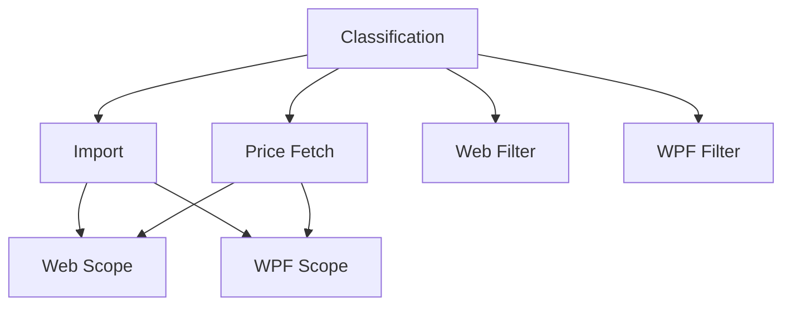

# Cryptocurrency Asset Type

## 1. Executive Summary

Cryptocurrency Asset Type extends the Financial application's asset model to properly classify and price cryptocurrency holdings, starting with Bitcoin held at the Coinbase broker. Today, the Bitcoin asset already imports through the standard Google Spreadsheet pipeline and is already assigned to a "Cryptocurrency" portfolio label under Coinbase, but it is misclassified under the generic `Unknown` asset class, and its current price cannot be fetched at all — the existing Google Finance price-fetch logic only knows how to build stock-style URLs (`ticker:exchange`), which do not exist for cryptocurrencies.

This feature introduces a dedicated `Cryptocurrency` value to the application's `GlobalAssetClass` classification, updates the existing Bitcoin entry in the spreadsheet-import classification data to use it, and teaches the price-fetch logic to build the cryptocurrency-specific Google Finance URL format (`https://www.google.com/finance/beta/quote/{TICKER}-{CURRENCY}`, e.g. `BTC-GBP`) whenever an asset is classified as Cryptocurrency. The asset's broker currency (already GBP for Coinbase) supplies the currency portion of the URL, so no new currency configuration is needed.

With classification and price-fetch in place, the feature also surfaces Cryptocurrency as a selectable asset-class filter in both the WPF desktop app and the React web app, and extends the existing fixed-portfolio scope used by the Current Values (price refresh) page in both UIs to include the Coinbase/Cryptocurrency portfolio — so Bitcoin's current price is fetched, refreshed, and displayed exactly like any other holding.

## 2. Problem and Opportunity

### The Problem

**Bitcoin is misclassified**
- The existing `AssetClassifications.json` entry for "Bitcoin" resolves to `GlobalAssetClass.Unknown`, the same bucket used for genuinely unrecognized assets
- Reports, filters, and breakdowns that group or filter by asset class cannot distinguish Bitcoin holdings from any other unclassified data — it is indistinguishable from a data error

**No way to fetch Bitcoin's current price**
- The single existing price-fetch implementation builds Google Finance URLs as `{ticker}:{exchange}`, a format that assumes a stock exchange
- Cryptocurrencies have no exchange in this sense; Google Finance instead serves crypto quotes at a different path and URL shape (`/finance/beta/quote/{TICKER}-{CURRENCY}`)
- As a result, Bitcoin's current value can never be refreshed through the existing "Refresh" action — the field is permanently stale or blank

**Cryptocurrency is invisible in the Current Values workflow**
- The Current Values page (WPF and Web) is intentionally scoped to a fixed, hardcoded list of portfolios; the Coinbase/Cryptocurrency portfolio is not on that list
- Even once price-fetch works technically, Bitcoin would still never appear on the one screen designed for reviewing and refreshing current prices

**No filter to isolate cryptocurrency holdings**
- Both the WPF and Web asset-class filter dropdowns are hardcoded lists matching the 8 existing `GlobalAssetClass` values; there is no way to filter the investment tree down to cryptocurrency holdings specifically

### The Opportunity

Each problem maps to a concrete deliverable:
- Misclassification → F01 adds `Cryptocurrency` to `GlobalAssetClass` and updates the Bitcoin classification entry to use it
- No price-fetch support → F02 confirms the import pipeline correctly produces a classified, ticker-populated Bitcoin asset; F03 introduces class-based branching in the price-fetch logic to build the correct Google Finance beta URL
- Invisible in Current Values → F06 (Web) and F07 (WPF) add the Coinbase/Cryptocurrency portfolio to each platform's fixed scope list
- No filter → F04 (Web) and F05 (WPF) add a "Cryptocurrency" option to each platform's asset-class filter

## 3. Target Audience

### Primary Users

**Self-Managed Multi-Asset Investor**
- Runs a personal, single-user install of Financial to track holdings across multiple brokers and countries (currently UK and Brazil), including a Coinbase account holding Bitcoin
- Regularly opens the Current Values page to refresh and review up-to-date prices across all holdings before making allocation decisions
- Wants asset-class filters and classifications to be accurate so portfolio breakdowns and totals reflect reality, without needing to manually correct or work around misclassified data

## 4. Objectives

**Product Objectives**
- **Classify** Bitcoin holdings under Coinbase with the correct `Cryptocurrency` asset class instead of `Unknown`
- **Enable** on-demand current-price fetching for Bitcoin via Google Finance's cryptocurrency quote format
- **Surface** Bitcoin in the same Current Values refresh workflow used for all other holdings
- **Preserve** all existing price-fetch behavior for non-cryptocurrency assets with zero regressions

**Success Metrics**
- 100% of Bitcoin assets imported from the Coinbase sheet resolve to `GlobalAssetClass.Cryptocurrency`, verified by inspecting imported asset records after a spreadsheet import run
- The Current Values "Refresh" action returns a non-empty GBP price for the Bitcoin asset in at least 9 out of 10 attempts under normal network conditions (allowing for Google Finance transient failures)
- 0 regressions in existing price-fetch behavior for non-cryptocurrency assets, verified by existing price-fetch tests continuing to pass unmodified
- The "Cryptocurrency" filter option is present and functional in both WPF and Web asset-class dropdowns, verified by manual selection filtering the tree to exactly the Bitcoin asset

## 5. User Stories

### F01. Cryptocurrency Asset Classification
- As the system, I want a dedicated `Cryptocurrency` value in the `GlobalAssetClass` enum so that cryptocurrency holdings can be distinguished from unclassified data
- As the system, I want the Bitcoin entry in the classification data to resolve to `Cryptocurrency` so that future imports classify it correctly

### F02. Cryptocurrency Spreadsheet Import
- As the system, I want to import the Bitcoin asset from the Coinbase sheet with its ticker populated and ISIN/Exchange left blank so that the asset record accurately reflects a cryptocurrency with no stock exchange
- As a user, I want my Bitcoin holding to appear in the investment tree under the Coinbase broker after import, same as any other asset

### F03. Cryptocurrency Price Fetch Strategy
- As a user, I want to fetch Bitcoin's current price so that I can see its up-to-date GBP value alongside my other holdings
- As the system, I want to build the correct Google Finance beta quote URL for Cryptocurrency-class assets so that the price lookup succeeds instead of failing on a stock-style URL
- As the system, I want non-cryptocurrency assets to keep using the existing stock-style URL format unchanged so that no existing price fetch behavior regresses

### F04. Cryptocurrency Filter — Web Frontend
- As a user, I want to select "Cryptocurrency" in the Web app's asset-class filter so that I can view only my cryptocurrency holdings in the investment tree

### F05. Cryptocurrency Filter — WPF Desktop
- As a user, I want to select "Cryptocurrency" in the WPF app's asset-class filter so that I can view only my cryptocurrency holdings in the investment tree

### F06. Current Values Portfolio Scope — Web Frontend
- As a user, I want the Coinbase/Cryptocurrency portfolio included on the Web Current Values page so that I can refresh and review Bitcoin's current price alongside my other scoped holdings

### F07. Current Values Portfolio Scope — WPF Desktop
- As a user, I want the Coinbase/Cryptocurrency portfolio included on the WPF Current Values page so that I can refresh and review Bitcoin's current price alongside my other scoped holdings

## 6. Functionalities

### F01. Cryptocurrency Asset Classification

**Provides:**
- `GlobalAssetClass.Cryptocurrency` enum value and the updated Bitcoin classification entry (used by F02, F03, F04, F05)

**Capabilities:**
- Add `Cryptocurrency` as a new value appended to the end of the `GlobalAssetClass` enum (`Financial.Domain/Entities/AssetClassification.cs`), after the existing `Unknown, Equity, RealEstate, Bond, Fund, ETF, Cash, Pension, Other` values, so existing integer values are preserved and no downstream serialization breaks
- Update the existing `"Bitcoin"` entry in the embedded `AssetClassifications.json` resource (`Integrations/GoogleFinancialSupport`) so its `assetClass` field changes from `"Unknown"` to `"Cryptocurrency"`; the `country` (`"UK"`) and `localTypeCode` (empty) fields are unchanged
- No changes to the `GlobalAssetClassMapping` (Country/LocalTypeCode) dictionary — Bitcoin continues to resolve through the existing name-based `AssetClassificationLookup`, which this dictionary does not affect
- Scoped to the single existing "Bitcoin" name entry only; no other cryptocurrency names are added or classified by this feature

**Experience:**
- This is a domain/data-only change with no direct UI surface of its own; its effect is observed through F02 (import produces a correctly classified asset) and F04/F05 (the new class becomes selectable as a filter)
- When `AssetClassificationLookup.TryGet("Bitcoin", ...)` is called during import, it now returns `GlobalAssetClass.Cryptocurrency` instead of `Unknown`

### F02. Cryptocurrency Spreadsheet Import

**Consumes:**
- F01: `GlobalAssetClass.Cryptocurrency` value and the updated Bitcoin classification entry

**Provides:**
- Imported Bitcoin asset record: Ticker ("BTC"), blank ISIN/Exchange, `Cryptocurrency` class, UK country code, linked to the Coinbase broker and its "Cryptocurrency" portfolio (used by F06, F07)

**Capabilities:**
- `GoogleSheetsAssetReader` continues reading ISIN, Exchange, and Ticker from the existing fixed cell range (`Q2:S2`) on the Bitcoin sheet under the Coinbase broker tab; for this asset, the ISIN and Exchange cells are expected to be blank, while the Ticker cell contains `"BTC"`
- `AssetMetadataResolver` resolves the Coinbase broker's currency via the existing `BrokerCurrencyMap` entry (Coinbase → GBP), which in turn resolves `CountryCode.UK` via the existing `CountryCodeResolver.FromCurrency("GBP")` mapping — no new broker or currency configuration is introduced
- `AssetClassificationLookup.TryGet("Bitcoin", ...)` returns `GlobalAssetClass.Cryptocurrency` (per F01), stored on the created/updated `Asset.Class` field
- The persisted `Asset` entity has `Exchange` empty/null, `Ticker` = `"BTC"`, `Class` = `Cryptocurrency`, `Country` = UK, and remains linked to the Coinbase broker's existing default "Cryptocurrency" portfolio name
- Transaction (buy/sell) rows for Bitcoin under Coinbase continue to import through the existing generic, asset-type-agnostic transaction-import pipeline; no changes are needed there

**Experience:**
- Running the existing spreadsheet import against the Coinbase/Bitcoin sheet behaves exactly as it does today for any other asset sheet; the only observable difference is the resulting `Asset.Class` being `Cryptocurrency` instead of `Unknown`, and `Exchange` being blank instead of a stock exchange code
- Once imported, the Bitcoin asset appears in the investment tree under Coinbase like any other asset

**Error Handling:**
- Ticker cell blank or unreadable on the Bitcoin sheet → import logs an error identifying the Coinbase/Bitcoin sheet and skips creating/updating that asset, since Ticker is required for later price lookups
- Broker "Coinbase" missing or removed from `BrokerCurrencyMap` (misconfiguration) → import fails for the affected sheet with an error naming the unmapped broker, matching existing behavior for any other unmapped broker
- Unexpected non-blank values in the ISIN/Exchange cells → import proceeds using whatever raw values are present, consistent with the existing best-effort behavior applied to other asset types; no cryptocurrency-specific validation blocks the import

### F03. Cryptocurrency Price Fetch Strategy

**Consumes:**
- F01: `GlobalAssetClass.Cryptocurrency` value

**Provides:**
- Current price for Cryptocurrency-class assets, fetched via the Google Finance beta quote URL (used by F06, F07)

**Capabilities:**
- Introduce class-based branching in the price-fetch flow (`Financial.Infrastructure/Services/AssetPriceService`, `Integrations/WebPageParser/GoogleFinance`): when the requested asset's `GlobalAssetClass` is `Cryptocurrency`, the request URL is built as `https://www.google.com/finance/beta/quote/{TICKER}-{CURRENCY}` (e.g. `https://www.google.com/finance/beta/quote/BTC-GBP`)
- `{CURRENCY}` is resolved from the asset's `Broker.Currency` (Coinbase → `GBP`); no new currency field is added to `Asset`
- For every other `GlobalAssetClass` value, the existing `https://www.google.com/finance/quote/{TICKER}:{EXCHANGE}` format is used unchanged — this is a pure addition, not a replacement
- The existing `HtmlAgilityPack`-based scraping/parsing logic is reused where the beta page's price markup matches the current extraction; where the beta page's structure differs, parsing is adapted to extract the same current-price data point from the beta page
- `IAssetPriceService.GetCurrentPrice` and `IAssetSnapshotSource.GetSnapshot` keep their existing public behavior from the caller's perspective; the asset's `GlobalAssetClass` is used internally to select the URL-building strategy, with no breaking change to either interface's contract

**Experience:**
- From the caller's perspective — the `/prices/current` API endpoint, or the Current Values page's "Refresh" action — fetching Bitcoin's price works identically to fetching a stock's price: same trigger, same response shape (a current price value), same loading/refreshed states in the UI
- The URL format difference and class-based branching are entirely internal to the Infrastructure layer

**Error Handling:**
- Google Finance beta page unreachable or returns a non-200 response → price fetch fails for that asset and surfaces the same generic "price unavailable" state the UI already shows for standard price-fetch failures; no crash
- Beta page HTML does not contain the expected price element (page layout changed) → parsing returns no price, treated as a fetch failure and reported the same way as a missing quote element for other asset types
- Ticker+currency combination not recognized by Google Finance (e.g. an invalid pair) → treated as a normal not-found/unavailable price result, consistent with how an invalid ticker/exchange pair is handled for other asset types today

### F04. Cryptocurrency Filter — Web Frontend

**Consumes:**
- F01: `GlobalAssetClass.Cryptocurrency` value and its underlying integer value (9)

**Capabilities:**
- Add a new entry `{ value: 9, label: 'Cryptocurrency' }` to the `ASSET_CLASS_OPTIONS` array in `Financial.Web/src/components/InvestmentTree.tsx`, alongside the existing 8 options

**Experience:**
- In the Investment Tree's "Asset class" filter dropdown, "Cryptocurrency" appears as a new selectable option, in the same list style and position (appended after the existing 8) as the current options
- Selecting it filters the tree to show only assets whose `Class` is `Cryptocurrency` (the Bitcoin asset, once imported per F02); behaves identically to the existing filter options, including any multi-select interaction the dropdown already supports

### F05. Cryptocurrency Filter — WPF Desktop

**Consumes:**
- F01: `GlobalAssetClass.Cryptocurrency` value

**Capabilities:**
- Add a new `AssetClassFilterOptionViewModel` entry (label "Cryptocurrency", `GlobalAssetClass.Cryptocurrency`) to the existing filter list used by the investment tree navigation, mirroring the pattern of the other 8 entries

**Experience:**
- In the WPF desktop app's asset-class filter dropdown, "Cryptocurrency" appears as a new selectable option with the same single-click filter interaction as the existing options

### F06. Current Values Portfolio Scope — Web Frontend

**Consumes:**
- F02: Bitcoin asset under the Coinbase broker
- F03: Cryptocurrency price-fetch capability

**Capabilities:**
- Add the Coinbase "Cryptocurrency" portfolio to the fixed portfolio scope list in `Financial.Web/src/config/portfolioScopeConfig.ts`, alongside the existing scoped entries (e.g. XPI/Default, XPI/Acoes)

**Experience:**
- The Current Values page now lists the Bitcoin asset under the Coinbase/Cryptocurrency portfolio section, with the same "Refresh" current-price action available as for other scoped assets
- Clicking Refresh triggers the price fetch described in F03 and displays the returned GBP price using the same formatting and loading states as other assets on the page

### F07. Current Values Portfolio Scope — WPF Desktop

**Consumes:**
- F02: Bitcoin asset under the Coinbase broker
- F03: Cryptocurrency price-fetch capability

**Capabilities:**
- Add the Coinbase "Cryptocurrency" portfolio to the equivalent fixed portfolio scope configuration used by the WPF Current Values page, alongside the existing scoped portfolios

**Experience:**
- The WPF Current Values page now lists the Bitcoin asset under the Coinbase/Cryptocurrency portfolio, with the same Refresh action and GBP price display as other scoped assets

## 7. Out of Scope

**Additional cryptocurrencies**
- Support for cryptocurrencies other than Bitcoin (e.g. Ethereum) is not included; adding another coin would require its own named entry in `AssetClassifications.json` as a separate future change

**Additional cryptocurrency brokers**
- Support for brokers other than Coinbase reporting cryptocurrency assets is not included
- Automatic classification of any cryptocurrency asset based on broker alone (broker-based auto-classification) was explicitly considered and rejected in favor of the existing name-based classification approach

**Currency handling**
- No per-asset currency override or multi-currency support beyond the broker's existing single currency mapping

**Price data depth**
- No historical/backfilled crypto-specific price charts beyond what already exists generically for other asset classes
- No real-time or streaming price updates (websocket, live ticking); price fetch remains the existing on-demand "Refresh" action, same as other asset types

**Transactions and credits**
- No cryptocurrency-specific tax or cost-basis rules (e.g. differing capital gains treatment); transactions continue to use the existing generic buy/sell/credits model
- No new Credits (dividend-style) types specific to crypto (e.g. staking rewards, airdrops); the Credits tab continues to use only its existing credit types

## 8. Dependency Graph

| # | Feature | Priority | Dependencies |
|---|---------|----------|--------------|
| F01 | Cryptocurrency Asset Classification | 1 | None |
| F02 | Cryptocurrency Spreadsheet Import | 1 | F01 |
| F03 | Cryptocurrency Price Fetch Strategy | 1 | F01 |
| F04 | Cryptocurrency Filter — Web Frontend | 2 | F01 |
| F05 | Cryptocurrency Filter — WPF Desktop | 2 | F01 |
| F06 | Current Values Portfolio Scope — Web Frontend | 1 | F02, F03 |
| F07 | Current Values Portfolio Scope — WPF Desktop | 1 | F02, F03 |

### Execution Waves
Features within the same wave can be built in parallel. A wave starts only after every feature in earlier waves is complete.

- **Wave 1**: F01
- **Wave 2**: F02, F03, F04, F05
- **Wave 3**: F06, F07

### Priority levels
- **1** = Essential — product does not work without it
- **2** = Important — significant value addition
- **3** = Desirable — incremental improvement

## 9. Acceptance Criteria

### F01. Cryptocurrency Asset Classification
- [ ] `GlobalAssetClass` enum contains a `Cryptocurrency` value appended after the existing 9 values, with no existing values renumbered
- [ ] `AssetClassifications.json`'s "Bitcoin" entry has `assetClass` set to `"Cryptocurrency"`
- [ ] `AssetClassificationLookup.TryGet("Bitcoin", ...)` returns `GlobalAssetClass.Cryptocurrency`
- [ ] No other entries in `AssetClassifications.json` are modified

### F02. Cryptocurrency Spreadsheet Import
- [ ] After running the spreadsheet import, the Bitcoin asset under Coinbase has `Class = Cryptocurrency`, `Ticker = "BTC"`, and blank `Exchange`/`ISIN`
- [ ] The imported Bitcoin asset is linked to the Coinbase broker and its existing "Cryptocurrency" portfolio
- [ ] Buy/sell transactions for Bitcoin under Coinbase import successfully through the existing generic transaction pipeline, unaffected by the classification change
- [ ] If the Ticker cell is blank, import logs an error and does not create/update the Bitcoin asset
- [ ] If the Coinbase broker is missing from `BrokerCurrencyMap`, import fails for that sheet with an error naming the broker

### F03. Cryptocurrency Price Fetch Strategy
- [ ] Fetching the current price for the Bitcoin asset builds the URL `https://www.google.com/finance/beta/quote/BTC-GBP`
- [ ] Fetching the current price for a non-cryptocurrency asset continues to build the existing `{TICKER}:{EXCHANGE}` URL, unchanged
- [ ] A successful fetch returns a current price value for Bitcoin in GBP
- [ ] A network failure or unreachable beta page results in the same "price unavailable" failure state used for other asset types, without an unhandled exception
- [ ] Existing price-fetch tests for non-cryptocurrency assets continue to pass unmodified

### F04. Cryptocurrency Filter — Web Frontend
- [ ] The Web asset-class filter dropdown includes a "Cryptocurrency" option with value `9`
- [ ] Selecting "Cryptocurrency" filters the investment tree to show only assets with `Class = Cryptocurrency`
- [ ] The 8 pre-existing filter options remain unchanged in label, value, and order

### F05. Cryptocurrency Filter — WPF Desktop
- [ ] The WPF asset-class filter dropdown includes a "Cryptocurrency" option
- [ ] Selecting "Cryptocurrency" filters the investment tree to show only assets with `Class = Cryptocurrency`
- [ ] The 8 pre-existing filter options remain unchanged in label, value, and order

### F06. Current Values Portfolio Scope — Web Frontend
- [ ] The Coinbase/Cryptocurrency portfolio appears on the Web Current Values page
- [ ] The Bitcoin asset's "Refresh" action successfully triggers the price fetch and displays a GBP price
- [ ] The existing scoped portfolios (e.g. XPI/Default, XPI/Acoes) remain present and unaffected

### F07. Current Values Portfolio Scope — WPF Desktop
- [ ] The Coinbase/Cryptocurrency portfolio appears on the WPF Current Values page
- [ ] The Bitcoin asset's "Refresh" action successfully triggers the price fetch and displays a GBP price
- [ ] The existing scoped portfolios remain present and unaffected

### Cross-Feature Integration
- [ ] The `Cryptocurrency` enum value and updated Bitcoin classification from F01 are correctly consumed during import in F02, producing a Bitcoin asset with `Class = Cryptocurrency`
- [ ] The `Cryptocurrency` enum value from F01 is correctly reflected as a selectable option in both the Web filter (F04) and WPF filter (F05)
- [ ] The Bitcoin asset record produced by F02 (Ticker "BTC", Coinbase broker) and the price-fetch capability from F03 are both correctly consumed when the Bitcoin asset appears in the Web Current Values page (F06) and the WPF Current Values page (F07), in both cases returning a GBP price on Refresh
