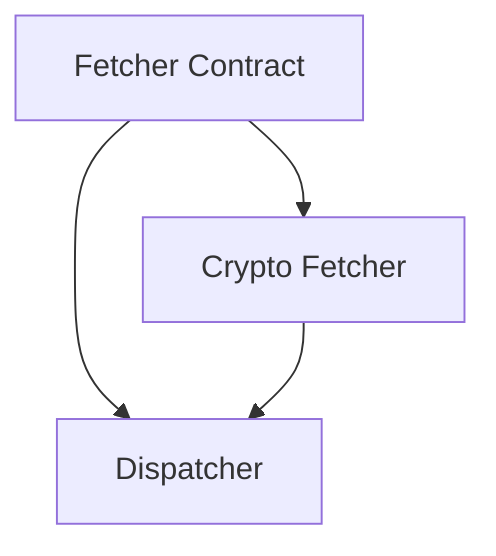

# Asset Snapshot Fetch Strategy

## 1. Executive Summary

Asset Snapshot Fetch Strategy is an internal architecture refactor of the Financial application's price-fetch pipeline (`Financial.Infrastructure/Services/AssetPriceService`). Today, choosing how to fetch a current price for an asset is a single hardcoded conditional: `Cryptocurrency` goes down one path, every other `GlobalAssetClass` value goes down another. This works for the two asset classes the system currently understands, but the enum already defines seven more (`Equity`, `RealEstate`, `Bond`, `Fund`, `ETF`, `Cash`, `Pension`, `Other`), and at least one of them — `Bond`, destined for Brazilian Tesouro Direto government bonds sourced from statusinvest.com.br — is a concretely planned future addition that would otherwise mean editing this same conditional a second time.

This feature replaces the conditional with a strategy pattern: a new `IAssetPriceFetcher` contract that any asset-class-specific fetch strategy implements, resolved by `AssetPriceService` from an injected collection instead of a hardcoded branch. The existing two behaviors — the default Google Finance stock-quote path and the Cryptocurrency broker-currency-resolved path — become the first two concrete fetchers (`StandardAssetPriceFetcher`, `CryptocurrencyAssetPriceFetcher`), each independently testable exactly as their logic is today. `AssetPriceService` itself shrinks to a thin dispatcher with no asset-class-specific knowledge of its own.

This is a maintainability investment, not a user-facing change: no API contract, DTO, database, WPF screen, or Web page changes as a result of this feature. Its entire value is that the next asset class to need a different fetch strategy — such as the planned Tesouro Direto bonds — is added by writing one new class and one DI registration line, with zero edits to already-shipped, already-tested code.

---

## 2. Problem and Opportunity

### The Problem

**Open/Closed violation in price-fetch dispatch**
- `AssetPriceService.GetCurrentPrice` selects its fetch strategy with a single ternary comparing `request.AssetClass` against `GlobalAssetClass.Cryptocurrency`
- Adding support for a third asset class means editing this same method, its two private helper methods, and its existing test file — all already shipped and passing today
- `GlobalAssetClass` already defines 9 values; the conditional only distinguishes 2 of them, treating the other 7 as an undifferentiated fallback

**Fetch strategy and infrastructure dependency are conflated**
- `AssetPriceService` takes an `IRepository` constructor dependency solely to resolve `Broker.Currency` for the Cryptocurrency branch
- Every non-cryptocurrency request — the large majority of price fetches — carries this dependency without ever using it, and any future non-currency-dependent asset class would inherit the same unused coupling

**Growing regression risk with each new asset class**
- Each new class added to the conditional increases the chance that an edit to one branch's validation or fetch logic accidentally changes another branch's behavior, since all branches live in the same method
- The pattern already repeated once (Standard → +Cryptocurrency); a second repetition (+Bond, for Tesouro Direto) would keep growing the same shared surface

### The Opportunity

- Open/Closed violation → introduce `IAssetPriceFetcher`, an interface implemented once per asset-class-specific strategy; `AssetPriceService` resolves the matching fetcher from an injected collection, so a new asset class is a new class plus one DI registration line, with zero edits to `AssetPriceService`
- Conflated dependency → move `IRepository` out of `AssetPriceService` and into `CryptocurrencyAssetPriceFetcher`, the only strategy that actually needs broker-currency resolution; the default path carries no dependency it doesn't use
- Growing regression risk → each fetcher becomes independently unit-testable in its own test file, exactly as today's `ResolveBrokerCurrency` and `BuildCryptocurrencyQuoteUrl` seams already are, so a future asset class's tests cannot accidentally break another class's tests

---

## 3. Target Audience

### Primary Users

**Developer-Maintainer**
- Sole developer and sole end user of this personal-use financial application, responsible for extending it with new asset classes over time (Cryptocurrency shipped in P07; Tesouro Direto bonds are a concretely planned next step)
- Values low-friction extension points over upfront generality — CLAUDE.md explicitly directs this codebase to avoid over-engineering, so the bar is "cheap to add the next class," not "infinitely generic"
- Reads and re-reads `AssetPriceService` and its tests each time a new asset class is added; wants that file to stop growing with every addition

---

## 4. Objectives

**Eliminate the Open/Closed violation in price-fetch dispatch**
- Metric: `AssetPriceService.GetCurrentPrice` contains zero `GlobalAssetClass`-specific conditional logic; strategy selection reads exclusively from an injected `IEnumerable<IAssetPriceFetcher>`

**Decouple broker-currency resolution from the default path**
- Metric: `AssetPriceService`'s constructor no longer declares an `IRepository` parameter; only `CryptocurrencyAssetPriceFetcher` depends on it

**Preserve 100% of existing price-fetch behavior**
- Metric: every existing `AssetPriceServiceTests` scenario (blank ticker, blank exchange, blank broker name, unknown broker, successful standard/crypto dispatch) has an equivalent passing test after the refactor, with unchanged expected outcomes, and `AssetPriceEndpointsTests` passes unmodified

**Make the next asset class cheap to add**
- Metric: adding a hypothetical new `IAssetPriceFetcher` implementation requires creating exactly one new class and one DI registration line, with zero modifications to `AssetPriceService`, `StandardAssetPriceFetcher`, or `CryptocurrencyAssetPriceFetcher`

---

## 5. User Stories

### F01. Asset Snapshot Fetcher Contract & Standard Fetcher
- As the system, I want a common `IAssetPriceFetcher` contract so that any future asset-class-specific fetch strategy can be added without modifying existing dispatch code
- As the developer, I want today's non-cryptocurrency price-fetch logic (the Google Finance stock-quote path) extracted into a `StandardAssetPriceFetcher` implementing that contract, so today's default behavior becomes one strategy among many instead of being hardwired into `AssetPriceService`

### F02. Cryptocurrency Asset Price Fetcher
- As the system, I want the cryptocurrency-specific price-fetch logic (broker-currency resolution plus the Google Finance beta-quote URL) extracted into a `CryptocurrencyAssetPriceFetcher` implementing the same contract, so its logic is fully independent of the standard strategy and of any future asset class
- As the developer, I want the existing `ResolveBrokerCurrency` logic and the crypto branch's `BrokerName`-required validation moved into this fetcher unchanged, so behavior stays identical to today, only relocated

### F03. Strategy Dispatch in AssetPriceService
- As the developer, I want `AssetPriceService` to resolve the correct fetcher for a request's `GlobalAssetClass` from an injected collection of fetchers, so adding a new asset class never requires editing `AssetPriceService` again
- As the developer, I want an asset class with no matching fetcher to keep silently falling back to the Standard fetcher, so every existing Equity, ETF, Bond, Unknown, and other non-cryptocurrency asset keeps working exactly as it does today
- As the developer, I want the old inline `GetStandardSnapshot`, `GetCryptocurrencySnapshot`, and `ResolveBrokerCurrency` methods removed from `AssetPriceService` once their logic has moved to dedicated fetchers, so no duplicate or dead code is left behind

---

## 6. Functionalities

### F01. Asset Snapshot Fetcher Contract & Standard Fetcher

**Provides:**
- Asset value snapshot (ticker, display name, price, as-of timestamp) for the default/non-cryptocurrency fetch strategy (used by F03)

**Capabilities:**
- New `IAssetPriceFetcher` interface in `Financial.Application/Interfaces/`, with `bool Supports(GlobalAssetClass assetClass)` and `AssetValueSnapshot GetSnapshot(AssetPriceRequestDTO request)` members
- New `StandardAssetPriceFetcher` in `Financial.Infrastructure/Services/` implementing `IAssetPriceFetcher`: `Supports` returns `true` for every `GlobalAssetClass` value except `Cryptocurrency` (today's default/fallback behavior), `false` for `Cryptocurrency`
- `GetSnapshot` validates that `Exchange` is non-blank (throwing `ArgumentException` otherwise, matching today's `GetStandardSnapshot` message) and calls `GoogleFinance.GetFinancialInfoSnapshot(exchange, ticker)` unchanged
- Registered in DI (`InfrastructureServiceCollectionExtensions`) as one of the `IAssetPriceFetcher` implementations resolvable via `IEnumerable<IAssetPriceFetcher>`
- `AssetPriceService` is not modified by this feature — its existing branching logic stays in place until F03 wires the dispatcher in, so F01 introduces the contract and first implementation without a big-bang cutover

**Experience:**
- No caller-visible change: this feature only introduces new types and DI registrations that nothing consumes yet
- Once consumed by F03, a request whose asset class is not `Cryptocurrency` produces the exact same Google Finance stock-quote fetch, response shape, and failure behavior as today

### F02. Cryptocurrency Asset Price Fetcher

**Provides:**
- Asset value snapshot (ticker, display name, price, as-of timestamp) for `Cryptocurrency`-class assets, using the currency resolved from the asset's broker (used by F03)

**Capabilities:**
- New `CryptocurrencyAssetPriceFetcher` in `Financial.Infrastructure/Services/` implementing `IAssetPriceFetcher`, taking `IRepository` as a constructor dependency (moved here from `AssetPriceService`)
- `Supports` returns `true` only for `GlobalAssetClass.Cryptocurrency`
- `GetSnapshot` validates that `BrokerName` is non-blank (throwing `ArgumentException` otherwise, matching today's crypto-branch message), resolves the broker's currency via the existing `ResolveBrokerCurrency(IEnumerable<Broker>, string)` logic relocated here unchanged (including its `InvalidOperationException` when the broker name has no match), then calls `GoogleFinance.GetCryptocurrencyFinancialInfoSnapshot(currency, ticker)`
- Registered in DI alongside `StandardAssetPriceFetcher` as another `IAssetPriceFetcher`

**Experience:**
- No caller-visible change: this feature only introduces a new type and DI registration that nothing consumes yet
- Once consumed by F03, a request with `AssetClass = Cryptocurrency` produces the exact same broker-currency resolution, beta-quote URL fetch, response shape, and failure behavior as today

### F03. Strategy Dispatch in AssetPriceService

**Consumes:**
- F01: asset value snapshot for the default/non-cryptocurrency fetch strategy
- F02: asset value snapshot for `Cryptocurrency`-class assets

**Capabilities:**
- `AssetPriceService`'s constructor changes from `IRepository` to `IEnumerable<IAssetPriceFetcher>` — the repository dependency moves entirely into `CryptocurrencyAssetPriceFetcher` (F02)
- `GetCurrentPrice` keeps its existing `request`-null and blank-`Ticker` validation unchanged, then selects the fetcher via `fetchers.FirstOrDefault(f => f.Supports(request.AssetClass))`
- If no registered fetcher's `Supports` matches the request's asset class, dispatch falls back to the `StandardAssetPriceFetcher` instance rather than throwing — preserving today's "any unrecognized/non-crypto class defaults to standard" behavior exactly, including for `GlobalAssetClass.Bond` until a dedicated bond fetcher is added in a future feature
- The resolved fetcher's `AssetValueSnapshot` is mapped into `AssetPriceDTO` exactly as today (`Exchange` from the request, `Ticker`/`Name`/`Price`/`AsOf` from the snapshot)
- The old `GetStandardSnapshot`, `GetCryptocurrencySnapshot`, and `ResolveBrokerCurrency` methods are removed from `AssetPriceService`
- DI registration for `AssetPriceService` is updated so its constructor resolves the `IEnumerable<IAssetPriceFetcher>` collection populated by F01 and F02

**Experience:**
- From every caller's perspective — the `/prices/current` API endpoint, the WPF "Current Values" refresh, the WPF Asset Details "Refresh" action — fetching a price works identically before and after this feature: same trigger, same request shape, same response shape, same loading/failure states
- The strategy-resolution mechanism is entirely internal to `Financial.Infrastructure`; no Presentation-layer code changes as a result of this feature

---

## 7. Out of Scope

**Building the Tesouro Direto (Bond) fetcher**
- Implementing an actual `GlobalAssetClass.Bond` fetcher, or any statusinvest.com.br integration, is not part of this PRD — this PRD only makes the architecture ready to receive it as a future, self-contained addition

**`IAssetSnapshotSource` / dividend and credit lookups**
- `IAssetSnapshotSource` and `AssetSnapshotSourceAdapter` (consumed by `DividendService`) are not touched, extended, or unified with `IAssetPriceFetcher` — they remain a separate, single-strategy interface, consistent with P07's decision to keep crypto/other-class dividend lookups out of scope

**API, DTO, and UI contract changes**
- `AssetPriceRequestDTO`, the `/prices/current` endpoint's request/response contract, and every WPF/Web call site are unchanged — this refactor is entirely internal to `Financial.Infrastructure`

**Fail-loud validation for unmapped asset classes**
- Asset classes without a dedicated fetcher continue to silently fall back to `StandardAssetPriceFetcher`; this PRD does not introduce a mode that fails or warns when a class has no explicit fetcher

**Changes to `GoogleFinance.cs`'s URL-building or scraping logic**
- `GoogleFinance.GetFinancialInfoSnapshot` and `GoogleFinance.GetCryptocurrencyFinancialInfoSnapshot` are reused as-is by the two fetchers; their internal URL-building, HTML parsing, and selector logic are not modified

**Performance or caching of price fetches**
- Not addressed by this feature; each fetch remains a live, uncached network call exactly as today

---

## 8. Dependency Graph

| # | Feature | Priority | Dependencies |
|---|---------|----------|--------------|
| F01 | Asset Snapshot Fetcher Contract & Standard Fetcher | 1 | None |
| F02 | Cryptocurrency Asset Price Fetcher | 1 | F01 |
| F03 | Strategy Dispatch in AssetPriceService | 1 | F01, F02 |

### Execution Waves
Features within the same wave can be built in parallel. A wave starts only after every feature in earlier waves is complete.

- **Wave 1**: F01
- **Wave 2**: F02
- **Wave 3**: F03

### Priority levels
- **1** = Essential — product does not work without it
- **2** = Important — significant value addition
- **3** = Desirable — incremental improvement

---

## 9. Acceptance Criteria

### F01. Asset Snapshot Fetcher Contract & Standard Fetcher
- [ ] `IAssetPriceFetcher` exists in `Financial.Application/Interfaces/` with `Supports(GlobalAssetClass)` and `GetSnapshot(AssetPriceRequestDTO)` members
- [ ] `StandardAssetPriceFetcher.Supports` returns `true` for every `GlobalAssetClass` value except `Cryptocurrency`, and `false` for `Cryptocurrency`
- [ ] `StandardAssetPriceFetcher.GetSnapshot` throws `ArgumentException` when `Exchange` is blank
- [ ] `StandardAssetPriceFetcher.GetSnapshot` calls `GoogleFinance.GetFinancialInfoSnapshot(exchange, ticker)` and returns its result unmodified
- [ ] `StandardAssetPriceFetcher` is registered in DI as an `IAssetPriceFetcher`

### F02. Cryptocurrency Asset Price Fetcher
- [ ] `CryptocurrencyAssetPriceFetcher.Supports` returns `true` only for `GlobalAssetClass.Cryptocurrency`, `false` for every other value
- [ ] `CryptocurrencyAssetPriceFetcher.GetSnapshot` throws `ArgumentException` when `BrokerName` is blank
- [ ] `CryptocurrencyAssetPriceFetcher.GetSnapshot` throws `InvalidOperationException` when `BrokerName` matches no broker returned by `IRepository.GetBrokerList()`
- [ ] `CryptocurrencyAssetPriceFetcher.GetSnapshot` resolves the matching broker's `Currency` and calls `GoogleFinance.GetCryptocurrencyFinancialInfoSnapshot(currency, ticker)`
- [ ] `CryptocurrencyAssetPriceFetcher` is registered in DI as an `IAssetPriceFetcher`

### F03. Strategy Dispatch in AssetPriceService
- [ ] `AssetPriceService`'s constructor takes `IEnumerable<IAssetPriceFetcher>` and no longer takes `IRepository`
- [ ] `GetCurrentPrice` still throws `ArgumentNullException` for a null request and `ArgumentException` for a blank `Ticker`, unchanged
- [ ] A request with `AssetClass = Cryptocurrency` and a valid `BrokerName` dispatches to `CryptocurrencyAssetPriceFetcher` and returns its snapshot mapped into `AssetPriceDTO`
- [ ] A request with any non-`Cryptocurrency` `AssetClass` (including `Unknown`, `Equity`, `Bond`, `ETF`) dispatches to `StandardAssetPriceFetcher`
- [ ] If no registered fetcher's `Supports` returns `true` for the request's `AssetClass`, dispatch falls back to `StandardAssetPriceFetcher` instead of throwing
- [ ] `GetStandardSnapshot`, `GetCryptocurrencySnapshot`, and `ResolveBrokerCurrency` no longer exist on `AssetPriceService`
- [ ] All pre-existing `AssetPriceServiceTests` scenarios have an equivalent passing test after the refactor, with unchanged expected outcomes
- [ ] `AssetPriceEndpointsTests` passes unmodified, proving the public `/prices/current` contract is unaffected

### Cross-Feature Integration
- [ ] A request with `AssetClass = Cryptocurrency` and a valid `BrokerName` produces the same `AssetPriceDTO` shape as today's crypto branch, proving `AssetPriceService` (F03) correctly dispatches to the snapshot provided by `CryptocurrencyAssetPriceFetcher` (F02)
- [ ] A request with `AssetClass = Equity` (or any other non-crypto value) produces the same `AssetPriceDTO` shape as today's standard branch, proving `AssetPriceService` (F03) correctly dispatches to the snapshot provided by `StandardAssetPriceFetcher` (F01)
- [ ] Registering both `StandardAssetPriceFetcher` (F01) and `CryptocurrencyAssetPriceFetcher` (F02) in DI and resolving `IEnumerable<IAssetPriceFetcher>` in `AssetPriceService` (F03) yields exactly two fetchers, both reachable by the dispatcher
