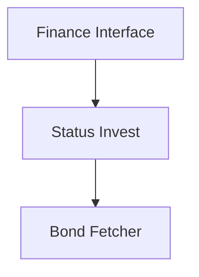

# BR Bond Finance Service Integration

## 1. Executive Summary

BR Bond Finance Service Integration closes a gap explicitly left open by the P08 Asset Snapshot Fetch Strategy refactor: `GlobalAssetClass.Bond` assets — Brazilian Tesouro Direto government bonds — currently fall through to `StandardAssetPriceFetcher` and are priced via Google Finance, a source that does not list these instruments. Every Bond-class asset in the application today either fails to resolve a price or resolves one that has nothing to do with its actual value.

This feature fixes that by adding statusinvest.com.br's per-bond page as a new public data source and wiring it into a dedicated Bond fetcher that plugs into the existing `IAssetPriceFetcher` strategy dispatch from P08. Tesouro Direto's own site (tesourodireto.com.br) was evaluated as the authoritative source first, per this feature's original scope, but its rendimento-dos-titulos page serves a Cloudflare JavaScript challenge to any non-browser HTTP client — the application's HTML-scraping approach (`HtmlAgilityPack`) cannot execute JavaScript, so that page is not reachable by this codebase regardless of request headers. Status Invest is used as the sole bond price source instead. Getting there also means paying down a piece of technical debt the current architecture wasn't yet asked to solve: `GoogleFinance` is a static class called directly by fetchers, with no shared shape a second scraping source could reuse. This feature introduces a common `IFinanceService` contract, refactors `GoogleFinance` behind it with no behavior change, and gives Status Invest the same first-class, independently-testable shape Google Finance now has.

The result: Bond assets get a real, live current price from Status Invest instead of a meaningless Google Finance lookup, and the next website-based finance source after this one is a new class plus a DI registration line, not a rewrite of existing fetchers.

---

## 2. Problem and Opportunity

### The Problem

**Bond assets resolve to the wrong price source**
- `StandardAssetPriceFetcher.Supports` returns `true` for every `GlobalAssetClass` except `Cryptocurrency` — including `Bond` — so every Tesouro Direto bond today is priced via `GoogleFinance.GetFinancialInfoSnapshot`, a source that has no listing for these instruments
- This was a known, documented trade-off: P08 explicitly locked in "Bond assets dispatch to Standard" as today's guarantee and called out Tesouro Direto integration as its own future feature
- Every Bond asset the user tracks today either fails to fetch a price or silently returns an unrelated value

**Website-scraping logic has no shared contract**
- `GoogleFinance` is a static class in `Integrations/WebPageParser/`, called directly by `StandardAssetPriceFetcher` and `CryptocurrencyAssetPriceFetcher` — there is no interface a fetcher depends on, only a concrete static type
- Adding a second scraping source today means inventing its shape from scratch, with no shared seam for injecting a fake in tests the way `IAssetPriceFetcher` already allows for asset-class strategies

**Tesouro Direto's own site cannot be scraped**
- tesourodireto.com.br's rendimento-dos-titulos page is protected by a Cloudflare JavaScript challenge ("Enable JavaScript and cookies to continue"), served to any client that isn't a real browser
- This codebase's scraping approach (`HtmlAgilityPack`) has no JavaScript engine, so no request header or retry strategy makes that page reachable — confirmed by actually running a scraper against it, not just inferred from a status code
- Adding a headless browser (e.g., Playwright) to pass the challenge was considered and rejected as disproportionate — a much heavier, more fragile dependency for a personal application than relying on a second public source

### The Opportunity

- Wrong price source → introduce a dedicated `IAssetPriceFetcher` implementation for `Bond` that is tried before falling back to Standard, so Bond assets stop being priced via Google Finance entirely
- No shared scraping contract → introduce `IFinanceService`, implemented first by a refactored `GoogleFinanceService` (zero behavior change), then by `StatusInvestFinanceService` — sources sharing one contract, one testing pattern, one DI convention
- Tesouro Direto unreachable → treat Status Invest as the sole bond price source rather than building a heavier workaround for a site that actively blocks non-browser clients

---

## 3. Target Audience

### Primary Users

**Developer-Maintainer**
- Sole developer and sole end user of this personal-use financial application, who holds Brazilian Tesouro Direto bonds and currently sees them priced incorrectly (or not at all) in the portfolio view
- Values low-friction extension points over upfront generality — per this project's standing architecture rules, the bar is "cheap to add the next source," not "infinitely generic"
- Directly benefits from this feature every time the app refreshes current values: the difference between a real bond price and a meaningless Google Finance lookup is the entire point

---

## 4. Objectives

**Resolve real current prices for Tesouro Direto bond assets**
- Metric: 100% of `GlobalAssetClass.Bond` price requests are dispatched to the new Bond fetcher, and zero are dispatched to `StandardAssetPriceFetcher`/Google Finance

**Unify website-scraping sources behind one contract**
- Metric: no fetcher or service calls `GoogleFinance`'s static methods directly; `StandardAssetPriceFetcher` and `CryptocurrencyAssetPriceFetcher` depend on an injected `IFinanceService`-shaped dependency instead

**Make Status Invest the bond price source**
- Metric: every Bond-class price request resolves its price via `StatusInvestFinanceService`, wired through the shared `IFinanceService` contract established by F01

**Preserve 100% of existing Equity and Cryptocurrency price-fetch behavior**
- Metric: every existing `AssetPriceServiceTests`, `StandardAssetPriceFetcherTests`, and `CryptocurrencyAssetPriceFetcherTests` scenario still passes with unchanged expected outcomes, except the one test locking in "Bond dispatches to Standard," which is intentionally flipped by this feature

**Make the next website-based finance source cheap to add**
- Metric: adding a hypothetical third `IFinanceService` implementation requires exactly one new class and one DI registration line, with zero edits to `GoogleFinanceService` or `StatusInvestFinanceService`

---

## 5. User Stories

### F01. Finance Service Common Interface
- As the developer, I want a common `IFinanceService` contract so that Google Finance and any future website-based price source share one shape, testable and injectable the same way
- As the developer, I want today's Google Finance scraping logic wrapped in a `GoogleFinanceService` implementing that contract, with zero change to its URL-building or HTML-parsing logic, so today's Equity and Cryptocurrency price fetching keeps working exactly as it does now

### F02. Status Invest Finance Service
- As the system, I want to derive a Status Invest URL slug from a bond's title and fetch that bond's page, so its current unit value ("Valor Unitário") is available as the bond's current price
- As the system, I want a bond whose derived slug doesn't resolve to a valid page to fail the same way any other unresolvable asset does, so the caller sees a consistent failure rather than a silent wrong price

### F03. BR Bond Price Fetcher
- As the system, I want `Bond`-class price requests to be dispatched to a dedicated fetcher instead of falling through to Google Finance, so Tesouro Direto bonds get an accurate price
- As the developer, I want `StandardAssetPriceFetcher` to stop claiming `Bond` in its `Supports` check once this fetcher exists, so dispatch ordering can't accidentally route bonds back to Google Finance

---

## 6. Functionalities

### F01. Finance Service Common Interface

**Capabilities:**
- New `IFinanceService` interface in `Financial.Infrastructure/Interfaces/`, with a single `AssetValueSnapshot GetAssetValue(AssetValueRequest request)` member. This interface — like the existing `IAssetPriceFetcher` (relocated here from `Financial.Application/Interfaces/` as part of this feature) — is referenced exclusively within `Financial.Infrastructure`, never by Application or Presentation, so it is placed in Infrastructure rather than following this codebase's default convention of declaring every interface in Application regardless of consumer
- New `AssetValueRequest` type carrying every field a website-based source might need to resolve a current asset value: `Ticker`, `Exchange`, `Currency`, and `Name` (the last added specifically so title-keyed sources like Status Invest don't need a ticker/exchange pair at all); each concrete service reads only the fields relevant to it and ignores the rest
- New `GoogleFinanceService` in `Financial.Infrastructure/Services/` implementing `IFinanceService`: `GetAssetValue` inspects the request and calls `GoogleFinance.GetFinancialInfoSnapshot(exchange, ticker)` when `Exchange` is populated, or `GoogleFinance.GetCryptocurrencyFinancialInfoSnapshot(currency, ticker)` when `Currency` is populated — the existing static `GoogleFinance` class's URL-building, HTML parsing, and selectors are not modified
- `StandardAssetPriceFetcher` and `CryptocurrencyAssetPriceFetcher` are updated to take `GoogleFinanceService` (via `IFinanceService`) as a constructor dependency instead of calling the static `GoogleFinance` class directly; the request they build for it carries exactly the `Exchange`/`Ticker` or `Currency`/`Ticker` pair each already builds today
- Registered in DI (`InfrastructureServiceCollectionExtensions`) as a singleton, resolved by the two existing fetchers through the constructor change above

**Experience:**
- No caller-visible change: every existing Equity and Cryptocurrency price fetch produces the exact same request, scrape, and response shape as before this feature — only the internal call path (through `IFinanceService` instead of a static class reference) changes

### F02. Status Invest Finance Service

**Provides:**
- Current unit value ("Valor Unitário") and as-of date for a bond matched by derived slug (used by F03)

**Capabilities:**
- New `StatusInvestFinanceService` in `Financial.Infrastructure/Services/` (backed by a new `Integrations/WebPageParser/StatusInvest.cs` scraper), implementing `IFinanceService`
- `GetAssetValue` derives a URL slug from `request.Name` using a generic rule: lowercase the title, strip accents, remove `+` and other punctuation, collapse whitespace, and join words with hyphens (e.g., "TESOURO IPCA+ 2029" → "tesouro-ipca-2029")
- Fetches `https://statusinvest.com.br/tesouro/{slug}` and extracts the "Valor Unitário" field as the price, with the page's displayed reference date (or the fetch time, if none is shown) as the as-of timestamp
- If the derived slug's page returns a 404, or the page loads but has no "Valor Unitário" element, `GetAssetValue` throws, consistent with how `GoogleFinanceService` fails today when Google Finance cannot resolve a ticker — no special not-found signal is introduced, since there is no second bond source to fall back to
- Registered in DI as a singleton `StatusInvestFinanceService`

**Experience:**
- No caller-visible change on its own: this feature introduces a new type and DI registration that only `F03` consumes

### F03. BR Bond Price Fetcher

**Consumes:**
- F02: current unit value and as-of date for a bond matched by derived slug

**Capabilities:**
- New `BondAssetPriceFetcher` in `Financial.Infrastructure/Services/` implementing `IAssetPriceFetcher`; `Supports` returns `true` only for `GlobalAssetClass.Bond`
- `AssetPriceRequestDTO` gains a `Name` field, populated from the requested asset's `Asset.Name`; this field is used only by the Bond dispatch path — Equity and Cryptocurrency call sites leave it unpopulated, and `StandardAssetPriceFetcher`/`CryptocurrencyAssetPriceFetcher` ignore it, so no behavior change for non-Bond requests
- `GetSnapshot` validates that `Name` is non-blank (throwing `ArgumentException` otherwise, matching the existing validation style of the other fetchers), builds an `AssetValueRequest` with `Name` set, and calls `StatusInvestFinanceService.GetAssetValue`, returning its result directly
- If Status Invest cannot resolve the bond, `GetSnapshot` fails in the same manner `StandardAssetPriceFetcher` does today when Google Finance cannot resolve a ticker — no bond-specific silent fallback price is introduced
- `StandardAssetPriceFetcher.Supports` is updated to also exclude `GlobalAssetClass.Bond` (alongside its existing `Cryptocurrency` exclusion), so dispatch ordering can't route a Bond request back to Google Finance even as a fallback
- Registered in DI alongside the existing two fetchers as another `IAssetPriceFetcher`

**Experience:**
- From every caller's perspective — the `/prices/current` API endpoint, the WPF "Current Values" refresh, the WPF Asset Details "Refresh" action — fetching a Bond asset's price now returns its real Status Invest value instead of a Google Finance lookup; the request/response shape (`AssetPriceDTO`) is unchanged

---

## 7. Out of Scope

**Scraping tesourodireto.com.br directly**
- Evaluated and rejected: the site serves a Cloudflare JavaScript challenge to non-browser clients, which `HtmlAgilityPack` cannot pass. Adding a headless browser to work around it is not part of this feature — Status Invest is used as the sole bond price source instead

**Persisting or caching bond prices**
- Not addressed by this feature; every price fetch remains a live, uncached network call to Status Invest, exactly as Google Finance fetches work today

**Historical prices, yield curves, or indexer metadata**
- Only the current unit value ("Valor Unitário") is fetched; historical prices, indicative rates, indexer type (IPCA/Selic/Prefixado), and maturity yield are not part of this feature

**Authenticated Tesouro Direto purchase, sale, or redemption flows**
- This feature only reads public price data from statusinvest.com.br; it does not integrate with any brokerage or authenticated Tesouro Direto account action

**Additional finance sources beyond Google Finance and Status Invest**
- The `IFinanceService` contract is designed to make a future third source cheap to add, but no other source (e.g., other countries' government bond sites, alternative BR data providers) is built as part of this feature

**UI changes to show price provenance**
- The application does not indicate in the UI that a Bond's price came from Status Invest specifically; it's surfaced identically to any other asset through the existing `AssetPriceDTO` shape

**Automatic detection of source page structure changes**
- Consistent with today's Google Finance convention, if statusinvest.com.br changes its page structure, the break is caught by manual verification/code review, not by an automated alerting mechanism

**Changes to `GoogleFinance.cs`'s internal scraping logic**
- `GoogleFinance.GetFinancialInfoSnapshot` and `GoogleFinance.GetCryptocurrencyFinancialInfoSnapshot` are wrapped, not modified; their URL-building, HTML parsing, and selector logic stay exactly as they are today

---

## 8. Dependency Graph

| # | Feature | Priority | Dependencies |
|---|---------|----------|--------------|
| F01 | Finance Service Common Interface | 1 | None |
| F02 | Status Invest Finance Service | 1 | F01 |
| F03 | BR Bond Price Fetcher | 1 | F02 |

### Foundation Features
These features set up shared project infrastructure. In a greenfield project they must be implemented sequentially before or alongside any feature that depends on them:
- **F01 Finance Service Common Interface** — introduces the `IFinanceService` contract and `AssetValueRequest` shape every website-based price source (existing and new) implements, and refactors Google Finance behind it

### Execution Waves
Features within the same wave can be built in parallel. A wave starts only after every feature in earlier waves is complete.

**Note:** Foundation features (see "Foundation Features" above) cannot run in parallel in a greenfield project even if they appear together in a wave — they share scaffolding files and must be implemented sequentially until the base is in place.

- **Wave 1**: F01
- **Wave 2**: F02
- **Wave 3**: F03

### Priority levels
- **1** = Essential — product does not work without it
- **2** = Important — significant value addition
- **3** = Desirable — incremental improvement

---

## 9. Acceptance Criteria

### F01. Finance Service Common Interface
- [x] `IFinanceService` exists in `Financial.Infrastructure/Interfaces/` with a `GetAssetValue(AssetValueRequest)` member returning `AssetValueSnapshot`
- [x] `IAssetPriceFetcher` is relocated to `Financial.Infrastructure/Interfaces/`, with no change to its members
- [x] `AssetValueRequest` carries `Ticker`, `Exchange`, `Currency`, and `Name` fields
- [x] `GoogleFinanceService.GetAssetValue` calls `GoogleFinance.GetFinancialInfoSnapshot(exchange, ticker)` when `Exchange` is populated, and `GoogleFinance.GetCryptocurrencyFinancialInfoSnapshot(currency, ticker)` when `Currency` is populated
- [x] `StandardAssetPriceFetcher` and `CryptocurrencyAssetPriceFetcher` no longer reference the static `GoogleFinance` class directly; both depend on `GoogleFinanceService` via `IFinanceService`
- [x] Every existing `StandardAssetPriceFetcherTests` and `CryptocurrencyAssetPriceFetcherTests` scenario (other than the Bond-dispatch test flipped by F03) still passes with unchanged expected outcomes
- [x] `GoogleFinanceService` is registered in DI as a singleton

### F02. Status Invest Finance Service
- [ ] `StatusInvestFinanceService` derives the correct slug for representative bond titles (e.g., "TESOURO IPCA+ 2029" → "tesouro-ipca-2029")
- [ ] `StatusInvestFinanceService.GetAssetValue` returns the page's "Valor Unitário" value and an as-of date when the derived slug resolves to a valid page
- [ ] `StatusInvestFinanceService.GetAssetValue` throws when the derived slug's page 404s or has no "Valor Unitário" element
- [ ] `StatusInvestFinanceService` is registered in DI as a singleton

### F03. BR Bond Price Fetcher
- [ ] `BondAssetPriceFetcher.Supports` returns `true` only for `GlobalAssetClass.Bond`
- [ ] `AssetPriceRequestDTO` has a `Name` field, and `BondAssetPriceFetcher.GetSnapshot` throws `ArgumentException` when it is blank
- [ ] A request whose bond title resolves via Status Invest returns that source's price
- [ ] A request not found by Status Invest fails the same way `StandardAssetPriceFetcher` fails today when Google Finance can't resolve a ticker
- [ ] `StandardAssetPriceFetcher.Supports` returns `false` for `GlobalAssetClass.Bond` (in addition to its existing `Cryptocurrency` exclusion)
- [ ] `BondAssetPriceFetcher` is registered in DI as another `IAssetPriceFetcher`
- [ ] A request with `AssetClass = Cryptocurrency` and a request with any other non-Bond, non-Cryptocurrency `AssetClass` still dispatch to `CryptocurrencyAssetPriceFetcher` and `StandardAssetPriceFetcher` respectively, unchanged

### Cross-Feature Integration
- [ ] A bond resolved via Status Invest (F02) is correctly returned as the price by `BondAssetPriceFetcher` (F03)
- [ ] A bond not resolvable via Status Invest (F02) causes `BondAssetPriceFetcher` (F03) to fail rather than return a partial or default price
