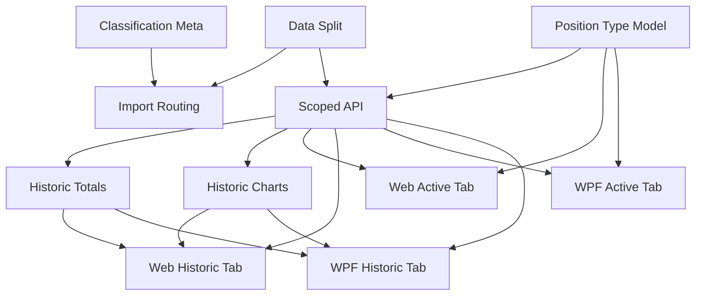

# Historic Investments Separation

## 1. Executive Summary

Historic Investments Separation restructures the Financial application's investment tracking so that closed positions are no longer mixed into the active portfolio view. Today, a closed asset simply lives inside a portfolio conventionally named `"Encerradas"`, detected during spreadsheet import by matching a hex tab color, and every downstream summary/chart feature has to remember to filter both that portfolio name and `Asset.Active` out by hand. This project replaces that convention with a structural split: two independent collections, `activeInvestments` and `historicInvestments`, each holding the same Broker → Portfolio → Asset hierarchy, stored side by side in the existing `data.json`.

The product is used by a single developer-maintainer who tracks UK and Brazilian brokerage holdings across both a WPF desktop app and a React web app. After this change, both apps gain a second top-level tab, "Historic Investments," mirroring the existing "Active Investments" tab (the renamed "Portfolio Navigator") with its own Broker/Portfolio/Asset tree, its own totals, and its own charts — computed from realized cash flows (bought, sold, credits) rather than current market value, since a closed position's current value is always zero. Position type inside Active Investments becomes a genuine three-state signal driven purely by quantity sign — Green (long), Black (flat), Red (short) — replacing today's two-color Active/Inactive convention that could not distinguish a closed position from an open short.

At the import layer, the spreadsheet importer keeps its existing tab-colour-based closed-position detection unchanged — a sheet coloured to signal "closed" (e.g. `"222222"`) is still recognized the same way it is today. What changes is where that asset ends up: instead of landing in an `"Encerradas"` portfolio inside the broker's active data, it is routed into that same broker's entry in Historic Investments, under a portfolio name resolved from a new `historicPortfolio` field in `AssetClassification.json`, falling back to that broker's own `"Uncategorized"` portfolio when no classification exists. This stops erasing an asset's original portfolio identity the moment it closes, without touching the detection signal itself.

## 2. Problem and Opportunity

### The Problem

**Closed positions distort active portfolio analysis**
- Closed assets sit inside a normal `Portfolio` named `"Encerradas"`, indistinguishable at the data-model level from any other portfolio
- Every summary and chart feature must remember to apply the same two filters — `NavigationMapper.IsEncerradas(portfolio.Name)` and `asset.Active` — or a closed position silently pollutes a total or a pie slice
- Sort order even has to special-case it (`NavigationMapper.OrderByNameWithEncerradasLast`) just to push it to the bottom of every tree view

**The Active/Inactive concept is binary and hides short positions**
- `Asset.Active => Quantity > 0` (`Financial.Domain/Entities/Asset.cs:26`) collapses "flat" (quantity = 0) and "short" (quantity < 0) into the same `false` value
- `BoolToActiveColorConverter` (WPF) renders both as red — a closed position and an open short look identical today, even though they mean opposite things

**Closing a position erases its original portfolio identity**
- The moment a user recolors a spreadsheet tab to signal "closed," `ResolvePortfolioName` maps it straight to `"Encerradas"`, overwriting whatever real grouping it had (`"Acoes"`, `"Previdencia"`, `"Fantastic Five Divid"`, etc.)
- There is no way today to later ask "how did my closed dividend-strategy positions perform," because that grouping information is gone by the time a position closes

### The Opportunity

- Filtering-by-convention → **structural separation**: `activeInvestments` and `historicInvestments` become two independent top-level collections (F02), so every scoped query (F05) is correct by construction instead of by remembered filter
- Same-collection closed bucket → **structurally separate historic home** (F04): the import's existing tab-colour closed-detection is kept exactly as is, but a closed match now routes into the correct broker's `historicInvestments` collection instead of an `"Encerradas"` portfolio sitting inside that broker's active data
- Binary Active/Inactive → **three-state position type** (F01): Green/Black/Red map directly to `Quantity > 0` / `= 0` / `< 0`, shown only where it's meaningful — inside Active Investments
- Lost portfolio identity → **`AssetClassification.json` historic portfolio metadata** (F03): a `historicPortfolio` field captures an asset's original grouping at classification time, independent of the generic closed-colour bucket it would otherwise fall into, with a per-broker fallback portfolio when that information isn't available

## 3. Target Audience

### Primary Users

**Developer-Maintainer**
- Sole developer and sole end user of this personal-use financial application, tracking brokerage holdings across UK (Trading 212, FreeTrade) and Brazilian (XPI) brokers plus Coinbase
- Currently loses the ability to analyze a strategy once it closes, because closing a position today means recoloring its spreadsheet tab and having its portfolio identity overwritten by `"Encerradas"`
- Values a data model correct by construction over remembering to add another `.Where()` filter to every new summary or chart feature, consistent with this project's "no over-engineering, but no shortcuts either" standing rule

## 4. Objectives

**Separate active and historic investment data structurally**
- Metric: every asset lives in exactly one of `activeInvestments`/`historicInvestments` as determined by import, with zero assets appearing in both collections after any import run

**Give colour-detected closed positions a structural home**
- Metric: every asset whose tab colour resolves to a broker's closed marker (the detection mechanism itself is unchanged) lands in that broker's `historicInvestments`, under a classification-resolved or per-broker `"Uncategorized"` fallback portfolio; zero `Portfolio` instances literally named `"Encerradas"` remain inside `activeInvestments` after import

**Keep totals and charts scope-pure**
- Metric: for 100% of brokers/portfolios, an Active Investments total or chart never includes a historic asset's data, and a Historic Investments total or chart never includes an active asset's data

**Deliver accurate three-state position type**
- Metric: every asset shown in Active Investments displays Green/Black/Red exactly matching `Quantity > 0` / `= 0` / `< 0`, with no asset ever rendered with the wrong color across existing and new test fixtures

**Reach full WPF/Web parity for Historic Investments**
- Metric: Historic Investments in both apps expose the same tree hierarchy, the same totals fields, the same chart types, and the same transaction/credit editing capability as Active Investments

## 5. User Stories

### F01. Position Type Domain Model
- As the system, I want to derive an asset's position type directly from its quantity (Long if `> 0`, Flat if `= 0`, Short if `< 0`) so that position type always reflects the real position with no separately stored flag to fall out of sync
- As a user, I want a Green/Black/Red indicator matching Long/Flat/Short so that I can tell at a glance whether I'm currently invested, flat, or short an asset

### F02. Active/Historic Investments Data Model & Storage
- As the system, I want active and historic investments stored as two independent Broker → Portfolio → Asset collections in the same `data.json` so that historic data can never leak into an active calculation by accident
- As the developer, I want one repository abstraction that can be scoped to either collection so that Application-layer services don't duplicate query logic per scope

### F03. AssetClassification Historic Portfolio Metadata
- As a user, I want to record which portfolio a now-closed asset originally belonged to in `AssetClassification.json` so that historic analysis can still reflect my original strategy grouping instead of a generic bucket
- As the system, I want a per-broker fallback historic portfolio name when no classification exists so that every closed asset still lands somewhere sensible within its own broker

### F04. Spreadsheet Import — Closed Position Routing to Historic
- As the system, I want an asset whose spreadsheet tab colour resolves to a broker's closed marker to be routed into that broker's Historic Investments instead of an `"Encerradas"` portfolio inside Active Investments, so closed positions get a structurally separate home without changing today's detection signal
- As the system, I want a historic asset's portfolio name resolved from `AssetClassification.json`'s `historicPortfolio` field, falling back to that broker's own `"Uncategorized"` portfolio when no classification exists, so closed assets keep a meaningful grouping instead of one generic shared bucket
- As the system, I want a sheet that no longer resolves to the closed marker (e.g., recoloured back to an active grouping) to route into Active Investments on the next import, so reopened positions are tracked correctly

### F05. Scoped Navigation & Summary API
- As a user, I want the navigation tree and asset-detail endpoints to accept an Active/Historic scope so that each tab only ever receives its own data
- As a user, I want position type included in Active-scoped asset data so that the tree can render the correct color

### F06. Historic Realized Totals Service
- As a user, I want to see total bought, total sold, total credits, and realized gain/loss for each historic asset and portfolio so that I can evaluate how a closed strategy actually performed

### F07. Historic Broker Breakdown Charts Service
- As a user, I want a breakdown chart of my historic portfolios by realized invested amount so that I can visualize how capital was historically distributed across closed strategies

### F08. Web — Active Investments Tab Update
- As a user, I want the existing Portfolio Navigator page relabeled "Active Investments" and scoped to only active data so that a closed position never appears in it again
- As a user, I want the Green/Black/Red indicator shown in the Active Investments tree so that I can see each asset's position type at a glance

### F09. Web — Historic Investments Tab
- As a user, I want a new "Historic Investments" tab with the same Broker/Portfolio/Asset tree, totals, and charts structure as Active Investments so that I can review closed positions the same way I review open ones
- As a user, I want to edit transactions and credits for a historic asset so that I can correct or complete its record after it has closed

### F10. WPF — Active Investments Tab Update
- As a user, I want the WPF "Active Investments" tab to show only active positions with the correct Green/Black/Red position type indicator so that the desktop app matches the web app's behavior

### F11. WPF — Historic Investments Tab
- As a user, I want a new "Historic Investments" tab in the WPF app with the same hierarchy, totals, and charts as Active Investments so that I have full parity with the web app
- As a user, I want to edit transactions and credits for a historic asset in the WPF app so that desktop editing matches the web app

## 6. Functionalities

### F01. Position Type Domain Model

**Provides:**
- Position type (`Long` / `Flat` / `Short`) derived from an asset's quantity sign (used by F05, F08, F10)

**Capabilities:**
- New `PositionType` enum (`Long`, `Flat`, `Short`) as a top-level type in `Financial.Domain.Entities` (not nested inside `Asset` — C# does not allow a class to declare both a nested type and a property with the identical name)
- `Asset` exposes a computed `PositionType` property (`Quantity > 0` → `Long`, `< 0` → `Short`, otherwise `Flat`); the existing `Active` bool property stays exactly as it is today, since it is load-bearing filtering logic in other Application services (not merely a display flag) — `PositionType` is additive, not a replacement
- DTOs that currently carry `IsActive` (`AssetNodeDTO`, `AssetDetailsDto`/`AssetDetailsDTO`, TS `AssetNodeDto`/`AssetDetailsDto`) gain a `PositionType`/`positionType` field carrying the three-state value; `NavigationMapper.MapAsset` and related mapping methods populate it from `asset.PositionType`

**Experience:**
- No independent UI in this feature; F08/F10 consume `PositionType` to render the three-color indicator inside Active Investments only — Historic Investments never displays this indicator, since every historic asset is by definition flat

### F02. Active/Historic Investments Data Model & Storage

**Provides:**
- Active investments collection (Broker → Portfolio → Asset) and Historic investments collection (Broker → Portfolio → Asset), each independently queryable (used by F04, F05)

**Capabilities:**
- `Financial.Domain/Entities/Investments.cs` changes from a single `Brokers` collection to two: `ActiveBrokers` and `HistoricBrokers` (or equivalent names), each `IReadOnlyCollection<Broker>`; `Broker`/`Portfolio`/`Asset` entities are unchanged — the split happens one level up
- `data.json` root shape changes from a flat broker array to:
  ```json
  { "activeInvestments": [ /* Broker[] */ ], "historicInvestments": [ /* Broker[] */ ] }
  ```
- `InvestmentsSerializerAdapter.cs` / `InvestmentsTypeInfoResolver.cs` updated to (de)serialize both top-level arrays; `InvestmentsLoader.cs` loads both into the two `Investments` collections
- `Financial.Application/Interfaces/IRepository.cs` gains a scope concept — every existing query method (`GetAssetsByBroker`, `GetAssetsByBrokerPortfolio`, `GetBrokerList`, `GetAsset`) is parameterized by an `InvestmentScope { Active, Historic }` value (or the interface is duplicated as two thin scoped repositories backed by the same implementation) so Application services can request either collection through one abstraction
- `NavigationMapper.IsEncerradas` / `OrderByNameWithEncerradasLast`'s "push last" special-casing is deleted — with historic data physically absent from the active collection, no portfolio ever needs to be sorted last for that reason again

**Experience:**
- No direct UI; this is the storage/repository foundation F04 writes into and F05 reads from

**Error Handling:**
- If `data.json` is missing either top-level key (`activeInvestments`/`historicInvestments`) on load, the missing collection deserializes to an empty list rather than throwing — so a `data.json` written before this feature (once regenerated by import) or a partially hand-edited file doesn't crash the app on startup
- A malformed/unparseable `data.json` continues to surface the existing load failure the same way it does today (no new silent-failure path is introduced)
- `SaveChangesAsync` failures (e.g., disk write error) surface the same way today's save failures do — no new error path specific to the two-collection shape

### F03. AssetClassification Historic Portfolio Metadata

**Provides:**
- Historic portfolio name resolution for a given asset name (classification-based, or that broker's `"Uncategorized"` fallback) (used by F04)

**Capabilities:**
- `Integrations/GoogleFinancialSupport/AssetClassifications.json` entries gain an optional `historicPortfolio` string field, e.g. `{ "name": "AGNC INVESTMENT CORP. (AGNC)", "country": "UK", "localTypeCode": "REIT", "assetClass": "RealEstate", "historicPortfolio": "Dividend Portfolio" }`; existing entries without it are valid (field is optional, defaults to absent/null)
- `AssetClassificationEntry` / the internal JSON model gains the corresponding `HistoricPortfolio` (nullable string) member; `AssetClassificationLookup` exposes it alongside the existing country/localTypeCode/assetClass lookup
- New constant `UncategorizedHistoricPortfolioName = "Uncategorized"` used whenever an asset has no classification entry or the entry has no `historicPortfolio` value; this fallback portfolio is created **per broker** — each broker gets its own `"Uncategorized"` historic portfolio, not one bucket shared across all brokers

**Experience:**
- No direct UI; this is metadata consumed only by F04 at import time

### F04. Spreadsheet Import — Closed Position Routing to Historic

**Consumes:**
- F02: active/historic investment collection structure to import into
- F03: historic portfolio name resolution (classification-based or per-broker fallback) for closed assets

**Capabilities:**
- The existing tab-colour-based closed-position detection is **unchanged**: `GoogleGeneratorConfiguration.PortfolioNameMap`'s per-broker closed-colour entries (`"XPI_222222"`, `"FreeTrade_222222"`, `"Trading 212_222222"`, each currently resolving to `"Encerradas"`) continue to identify a sheet as closed exactly as they do today; every other broker/colour → portfolio-name entry (`"Acoes"`, `"Previdencia"`, `"Renda Fixa"`, `"Reserva"`, `"Fantastic Five Divid"`, `"Almost Daily Dividen"`) is untouched
- What changes is what `AssetMetadataResolver`/`GoogleGenerator` do once a sheet resolves to the closed marker: instead of adding the asset to an `"Encerradas"` `Portfolio` inside the broker's active data, the asset is added to that same broker's entry in `HistoricInvestments`, under a `Portfolio` named via `AssetClassificationLookup`'s `historicPortfolio` value for that asset (F03), or that broker's own `"Uncategorized"` portfolio (created on demand) when no classification value exists
- A sheet whose tab colour does **not** resolve to the closed marker is written into `ActiveInvestments` exactly as today, under its normal colour-resolved portfolio name — quantity is not consulted as an import-time routing signal at all; it remains purely a display/status concern (F01) computed after the asset is stored
- Reopening: if a sheet previously resolving to the closed marker is recoloured so it no longer does, the next import writes it into `ActiveInvestments` instead, using the same asset-identity match (name/ticker within broker) that already governs re-import updates today — no additional "move" logic is required beyond normal per-import resolution
- Sheets still ignored via `IgnoreSheetNames` are unaffected by this feature

**Experience:**
- No direct UI; import remains a manual run of the `ImportGoogleSpreadSheets` tool. Its user-facing behavior for marking a position closed is unchanged (recolour the tab); only where that asset ends up afterward changes

**Error Handling:**
- An asset resolving to the closed marker with no classification entry still imports successfully into that broker's `"Uncategorized"` historic portfolio — a missing classification is not a failure condition
- If routing to Historic requires a broker entry that doesn't exist yet in `HistoricInvestments`, it is created with the same currency as its Active counterpart (mirroring `BrokerCurrencyMap`) rather than failing
- Any existing import failure behavior (unresolvable ticker/exchange, sheet read errors) is unchanged by this feature

### F05. Scoped Navigation & Summary API

**Consumes:**
- F01: position type per asset
- F02: active/historic investment collections

**Provides:**
- Broker/Portfolio/Asset tree data scoped to Active or Historic, including position type for Active-scoped assets (used by F06, F07, F08, F09, F10, F11)

**Capabilities:**
- `NavigationController` endpoints (`GET /navigation/tree`, `GET /navigation/brokers`) gain a scope selector (e.g. `scope=active|historic` query parameter, defaulting to `active` for backward compatibility with any existing caller); `NavigationService`/`NavigationMapper` build the tree from the repository's Active or Historic collection accordingly
- `TreeNodeDTO`/`AssetNodeDTO` metadata for Active-scoped trees includes `PositionType` (`Long`/`Flat`/`Short`); Historic-scoped trees omit or fix it to `Flat` since every historic asset is closed by definition
- `SummaryController` endpoints (`/summary/broker/{name}`, `/summary/portfolio/{broker}/{portfolio}`, `/summary/portfolio/{broker}/{portfolio}/assets`, `/summary/broker/{name}/breakdown`) each gain the same scope selector, delegating to the scoped repository from F02
- `BrokerBreakdownService`'s existing `.Where(p => !NavigationMapper.IsEncerradas(...))` and `.Where(a => a.Active)` filters are deleted — scope purity now comes from which repository collection was queried, not from a runtime filter

**Experience:**
- No direct UI; this is the API surface F08/F09/F10/F11 call, and F06/F07 build on

### F06. Historic Realized Totals Service

**Consumes:**
- F05: broker/portfolio/asset tree data scoped to Historic

**Capabilities:**
- New service (parallel to `PortfolioAssetSummaryService`) computing, per historic asset: `TotalBought`, `TotalSold`, `TotalCredits` (reusing `NavigationMapper.CalculateTotals`), `RealizedGainLoss = TotalSold - TotalBought + TotalCredits`, and `PortfolioWeight` (this asset's `TotalBought` as a percentage of the historic portfolio's total bought, mirroring today's weight-by-invested calculation)
- No current price is fetched and no XIRR is calculated for this scope — every input is a historical cash flow already stored on the asset (transactions, credits)
- Exposed via a new endpoint (or the existing summary endpoint family under the `scope=historic` selector from F05), e.g. `GET /summary/portfolio/{broker}/{portfolio}/assets?scope=historic`

**Experience:**
- No direct UI; consumed by F09/F11's Summary tab for Historic Investments

### F07. Historic Broker Breakdown Charts Service

**Consumes:**
- F05: broker/portfolio/asset tree data scoped to Historic

**Capabilities:**
- The existing `BrokerBreakdownService` is renamed `ActiveBrokerBreakdownService` and a new sibling `HistoricBrokerBreakdownService` is introduced, both sharing a common breakdown-building helper; `HistoricBrokerBreakdownService` builds `PortfolioBreakdownItemDTO`/`AssetBreakdownItemDTO` for the Historic scope, sizing each slice by `TotalBought` (gross capital historically committed) rather than a current-value figure, since a closed position's current value is always zero
- Exposed via the existing breakdown endpoint under `scope=historic` (F05) through the existing `IBrokerBreakdownService` facade, returning the same DTO shape the Active breakdown already returns so `BrokerBreakdownCharts.tsx`/`BrokerBreakdownChartBuilder.cs` can render it unmodified

**Experience:**
- No direct UI; consumed by F09/F11's charts tab for Historic Investments

### F08. Web — Active Investments Tab Update

**Consumes:**
- F01: position type per asset
- F05: broker/portfolio/asset tree data scoped to Active

**Capabilities:**
- `App.tsx`'s `NavLink` for "Portfolio Navigator" is relabeled "Active Investments" (route can stay `/portfolio-navigator` or be renamed to `/active-investments` — either way, exactly one route serves this tab)
- `PortfolioNavigatorPage.tsx`/`InvestmentTree.tsx`/`useAggregatedSummary.ts`/`useBrokerBreakdown.ts` calls are updated to pass `scope=active` (or rely on the API default) so no historic asset can appear
- Position type color rendering in the tree/detail panel switches from a boolean isActive check to a three-way mapping on the new `positionType` field: `Long` → green, `Flat` → black/neutral, `Short` → red

**Experience:**
- Functionally identical to today's Portfolio Navigator, just relabeled and guaranteed scope-pure; a user closing a position (via re-import) sees it disappear from this tab on next data refresh

### F09. Web — Historic Investments Tab

**Consumes:**
- F05: broker/portfolio/asset tree data scoped to Historic
- F06: realized totals for Historic scope
- F07: breakdown chart data for Historic scope

**Capabilities:**
- New route (e.g. `/historic-investments`) and `NavLink` "Historic Investments" added to `App.tsx`, rendering a page reusing `InvestmentTree`/`SplitPanel`/`DetailPanel` components (per the existing `DetailPanel.tsx` tab pattern: `TabId` union + `TABS` array) scoped to `scope=historic`
- The Summary tab within this page's `DetailPanel` shows F06's realized fields (`TotalBought`, `TotalSold`, `TotalCredits`, `RealizedGainLoss`, `PortfolioWeight`) instead of the current-value/XIRR-based summary shown for Active
- The Charts/breakdown view reuses `BrokerBreakdownCharts.tsx` fed by F07's historic breakdown data
- Transactions and Credits tabs within `DetailPanel` are fully reused unmodified — the same add/edit/delete flows available for an Active asset are available for a Historic one, since both operate on the same `Asset` shape

**Experience:**
- A user clicks "Historic Investments" in the nav, sees the same Broker → Portfolio → Asset tree as Active Investments (no status color, since everything here is closed), selects an asset to see realized totals in place of current-value totals, and can add/edit/delete a transaction or credit exactly as in Active Investments

**Error Handling:**
- Transaction/credit create/update/delete on a Historic asset reuses the exact validation and failure messaging already implemented for Active assets (no new error paths introduced)

### F10. WPF — Active Investments Tab Update

**Consumes:**
- F01: position type per asset
- F05: broker/portfolio/asset tree data scoped to Active

**Capabilities:**
- The `MainWindow.xaml` tab hosting `NavigationView.xaml` is relabeled "Active Investments"; its data-loading path is scoped to Active (F05)
- `BoolToActiveColorConverter` is replaced with a `PositionTypeToColorConverter` (or extended) mapping `Long`/`Flat`/`Short` to green/black/red brushes, bound wherever the tree/detail view currently binds the boolean active indicator

**Experience:**
- Functionally identical to today's single Investments tab, just relabeled, scope-pure, and showing the correct three-state color

### F11. WPF — Historic Investments Tab

**Consumes:**
- F05: broker/portfolio/asset tree data scoped to Historic
- F06: realized totals for Historic scope
- F07: breakdown chart data for Historic scope

**Capabilities:**
- New `TabControl` tab "Historic Investments" in `MainWindow.xaml`, hosting a `NavigationView`/`AssetDetailsViewModel` pairing scoped to Historic data, mirroring F10's structure
- Summary view shows F06's realized fields in place of current-value/XIRR fields; chart views (`BrokerBreakdownChartBuilder`, `CreditsChartBuilder`, `TransactionsChartBuilder`) are reused, fed by F07's historic breakdown data
- Transactions and Credits editing views are reused unmodified from the Active tab's implementation

**Experience:**
- A user opens the new "Historic Investments" tab, sees the same tree/summary/transactions/credits/charts structure as Active Investments, with realized totals instead of current-value totals, and can edit a historic asset's transactions/credits exactly as in Active Investments

**Error Handling:**
- Transaction/credit create/update/delete on a Historic asset reuses the exact validation and failure messaging already implemented for Active assets (no new error paths introduced)

## 7. Out of Scope

**A script that transforms the existing `data.json` in place**
- No separate migration tool is written; re-running the updated Google Sheets import regenerates `data.json` from the spreadsheet source of truth, which naturally produces the new `activeInvestments`/`historicInvestments` split — including correctly routing already-closed (tab-coloured) positions into Historic via F04

**Quantity-based closed-position detection during import**
- The importer keeps its existing tab-colour-based closed marker (e.g. `"222222"`) to decide whether a sheet is closed; this feature does not replace that signal with a quantity check. Only the destination (that broker's Historic Investments) and the resulting portfolio name (classification-based or per-broker `"Uncategorized"` fallback) change

**Multiple "stints" per reopened asset**
- When a historic asset is bought again, it moves back into Active Investments as a single ongoing record; this feature does not track or display separate historic closed-period records per open/close cycle

**Current-value or XIRR-based metrics for Historic Investments**
- Historic totals and charts show only realized cash-flow metrics (bought, sold, credits, realized gain/loss); no live price fetch or XIRR calculation is added for the historic scope

**Changes to price-fetching strategies or finance data sources**
- `IAssetPriceFetcher`/`IFinanceService` implementations (Google Finance, Status Invest, Cryptocurrency) are untouched by this feature

**New asset classes, currencies, or brokers**
- This feature only restructures how existing assets are categorized as active/historic; it adds no new `GlobalAssetClass`, `CountryCode`, or broker configuration

**Changes to color-name mapping in `GoogleGeneratorConfiguration`**
- Every existing broker/color → portfolio-name entry, including the closed-position ones (`"222222" → "Encerradas"`), stays exactly as configured today; this feature changes what happens once a sheet resolves to `"Encerradas"`, not the mapping table itself

**Multi-user or authentication concerns**
- This remains a single-user personal application; no access-control changes are introduced

## 8. Dependency Graph

| # | Feature | Priority | Dependencies |
|---|---------|----------|--------------|
| F01 | Position Type Domain Model | 1 | None |
| F02 | Active/Historic Investments Data Model & Storage | 1 | None |
| F03 | AssetClassification Historic Portfolio Metadata | 2 | None |
| F04 | Spreadsheet Import — Closed Position Routing to Historic | 1 | F02, F03 |
| F05 | Scoped Navigation & Summary API | 1 | F01, F02 |
| F06 | Historic Realized Totals Service | 1 | F05 |
| F07 | Historic Broker Breakdown Charts Service | 2 | F05 |
| F08 | Web — Active Investments Tab Update | 1 | F01, F05 |
| F09 | Web — Historic Investments Tab | 1 | F05, F06, F07 |
| F10 | WPF — Active Investments Tab Update | 1 | F01, F05 |
| F11 | WPF — Historic Investments Tab | 1 | F05, F06, F07 |

### Execution Waves
Features within the same wave can be built in parallel. A wave starts only after every feature in earlier waves is complete.

- **Wave 1**: F01, F02, F03
- **Wave 2**: F04, F05
- **Wave 3**: F06, F08, F10, F07
- **Wave 4**: F09, F11

### Priority levels
- **1** = Essential — product does not work without it
- **2** = Important — significant value addition
- **3** = Desirable — incremental improvement



## 9. Acceptance Criteria

### F01. Position Type Domain Model
- [x] An asset with `Quantity > 0` reports `PositionType = Long`
- [x] An asset with `Quantity = 0` reports `PositionType = Flat`
- [x] An asset with `Quantity < 0` reports `PositionType = Short`
- [x] `PositionType` is present on Active-scoped `AssetNodeDTO`/`AssetDetailsDto` (backend and TS types)

### F02. Active/Historic Investments Data Model & Storage
- [x] `data.json` round-trips with both `activeInvestments` and `historicInvestments` top-level arrays
- [x] A repository query scoped to Active never returns an asset from `historicInvestments`, and vice versa
- [x] Loading a `data.json` missing one of the two top-level keys succeeds with that collection empty, rather than throwing
- [x] `NavigationMapper.IsEncerradas`/its "sort last" special-casing no longer exists in the codebase

### F03. AssetClassification Historic Portfolio Metadata
- [x] An `AssetClassifications.json` entry with a `historicPortfolio` value resolves to that value when looked up
- [x] An asset with no classification entry, or an entry without `historicPortfolio`, resolves to that broker's own `"Uncategorized"` portfolio (not a bucket shared across brokers)
- [x] Existing entries without `historicPortfolio` remain valid (no deserialization failure)

### F04. Spreadsheet Import — Closed Position Routing to Historic
- [x] An asset whose tab colour resolves to a broker's closed marker (e.g. `"222222"`) is written to that broker's entry in `historicInvestments`, under its `historicPortfolio` (or that broker's `"Uncategorized"` fallback) — not to an `"Encerradas"` portfolio inside `activeInvestments`
- [x] An asset whose tab colour does not resolve to the closed marker is written to `activeInvestments` under its normal colour-resolved portfolio, unchanged from today
- [x] No `Portfolio` literally named `"Encerradas"` exists inside `activeInvestments` after import
- [x] Re-importing a sheet previously resolving to the closed marker, now recoloured to a normal active grouping, results in the asset appearing only in `activeInvestments`

### F05. Scoped Navigation & Summary API
- [x] `GET /navigation/tree?scope=active` returns only assets from `activeInvestments`, including their `PositionType`
- [x] `GET /navigation/tree?scope=historic` returns only assets from `historicInvestments`
- [x] Each `SummaryController` endpoint respects the same scope selector
- [x] Omitting the scope parameter preserves today's Active-only behavior (no breaking change for any existing caller)

### F06. Historic Realized Totals Service
- [x] A historic asset's summary returns `TotalBought`, `TotalSold`, `TotalCredits`, and `RealizedGainLoss = TotalSold - TotalBought + TotalCredits`
- [x] No current price fetch or XIRR field is present in the historic summary response
- [x] Portfolio weight sums to 100% across a historic portfolio's assets (by `TotalBought`)

### F07. Historic Broker Breakdown Charts Service
- [x] A historic broker's breakdown returns one entry per historic portfolio with assets, sized by `TotalBought`
- [x] A historic portfolio with no assets is excluded from the breakdown, consistent with today's Active behavior

### F08. Web — Active Investments Tab Update
- [x] The nav item previously labeled "Portfolio Navigator" reads "Active Investments"
- [x] The Active Investments tree never displays a historic asset
- [x] Each asset's tree node shows green/black/red matching `Long`/`Flat`/`Short`

### F09. Web — Historic Investments Tab
- [x] A new "Historic Investments" nav item renders a tree scoped to historic data only
- [x] The Summary tab for a historic asset shows realized totals, not current-value/XIRR fields
- [x] The Charts tab renders historic breakdown data
- [x] A transaction or credit can be added, edited, and deleted for a historic asset through the same UI flow as an active asset

### F10. WPF — Active Investments Tab Update
- [x] The existing investments tab is relabeled "Active Investments" and shows only active data
- [x] Each asset's status indicator shows green/black/red matching `Long`/`Flat`/`Short`

### F11. WPF — Historic Investments Tab
- [x] A new "Historic Investments" tab shows a tree, summary, transactions, credits, and charts scoped to historic data only
- [x] The summary view shows realized totals, not current-value/XIRR fields
- [x] A transaction or credit can be added, edited, and deleted for a historic asset through the same UI flow as an active asset

### Cross-Feature Integration
- [x] Data written by import (F04) into `activeInvestments`/`historicInvestments` (F02's structure) is correctly returned by the scoped navigation API (F05)
- [x] Position type computed by F01 appears correctly on every Active-scoped asset returned by F05
- [x] Historic tree/asset data served by F05 is correctly consumed by both the realized totals service (F06) and the breakdown charts service (F07)
- [x] Realized totals from F06 render correctly in both the Web (F09) and WPF (F11) Historic Investments summary views
- [x] Breakdown data from F07 renders correctly in both the Web (F09) and WPF (F11) Historic Investments charts views
- [x] Active-scoped data and position type from F01/F05 render correctly in both the Web (F08) and WPF (F10) Active Investments tabs
