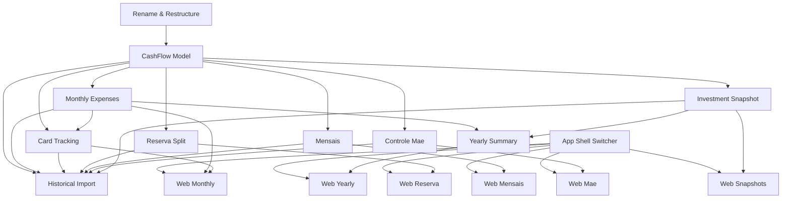

# CashFlow Tracking

## 1. Executive Summary

CashFlow Tracking introduces Financial.CashFlow, a new bounded context that replaces a personal finance spreadsheet (`Despesas.xlsx`, 115 monthly tabs spanning February 2017-2026) with a fully independent domain inside the existing Financial solution. It is used by a single developer-maintainer who today tracks every expense, bank/credit-card balance, recurring bill, family cash-flow, and a monthly investment snapshot by hand across a spreadsheet layout that has evolved over 9 years. The core value is twofold: a one-time historical import normalizes 9 years of evolving layouts into one canonical model, and from that point forward every new entry — expenses, reserve movements, card charges, recurring bills, family transfers, investment snapshots — is created and edited directly in the app, fully retiring the spreadsheet as source of truth.

The scope is intentionally bounded to the UK-resident, GBP-denominated period. Everything from `Julho 2014` through `Janeiro 2017` was recorded while living in Brazil, denominated in Reais (BRL), and using a distinct full-Portuguese-month-name sheet layout; that period is out of scope for this PRD and is not imported. The automated Resumo/Year summary for 2017 itself only starts at Fevereiro, confirming that boundary in the source data.

Before CashFlow can be added, the existing Investments code needs an explicit identity of its own. Today's `Financial.Domain`/`Financial.Application`/`Financial.Infrastructure` projects carry no domain name, and a domain-agnostic JSON/Google-Drive storage engine lives entangled inside the Investments infrastructure project. This PRD's first feature renames those three projects to `Financial.Investment.Domain`/`.Application`/`.Infrastructure`, grouped under a new `DDD/Investment` solution folder alongside a new `DDD/CashFlow` folder for the projects this PRD adds, and extracts the shared storage engine into its own `Financial.Shared.Infrastructure` project inside a third `DDD/Shared` solution folder, so neither domain depends on the other's code.

Functionally, the product covers: categorized monthly expense tracking; the Reserva reserve pool with its automated tithe-then-split logic; five credit cards with a statement-paid reconciliation mechanic; Brasil/UK recurring bills generated from templates; a BRL/GBP family cash-flow ledger with automatic historical exchange-rate lookup; an 11-account monthly investment snapshot; and an automated yearly summary with month-over-month diffs. The Web app (React) ships first, presented through a new top-level Investments/CashFlow domain switcher that keeps the two bounded contexts visually and functionally separate; WPF parity is deferred to a follow-up PRD.

## 2. Problem and Opportunity

### The Problem

**The Investments code has no explicit domain identity**
- `Financial.Domain`, `Financial.Application`, and `Financial.Infrastructure` carry no domain name, even though the context file already refers to this code as "Financial.Investments"
- The domain-agnostic JSON/Google-Drive storage engine (`IJsonStorage`, `LocalJsonStorage`, `GoogleDriveJsonStorage`, `IRemoteFileClient`/`Factory`) is entangled inside the Investments infrastructure project, so a second domain would either duplicate it or depend on the first domain's project — violating the "no cross-domain references" rule before CashFlow even starts

**Manual reserve-split arithmetic is error-prone**
- Dizimo (the 10% tithe) is computed from a mixed income base — combined net-of-tax salary for both spouses plus gross Lottery and Dividendo/Juros — then the remaining net salary alone splits 1/3 / 1/3 / 1/6 / 1/6 across Investimento, house-treats, Ariana, and Gleison; all of this is computed by hand every month across four separate income fields
- This math has already gone wrong once — the split was previously documented as 33%/33%/16.5%/16.5%, which doesn't sum to 100%
- There is no bucket ledger separate from spreadsheet cells, so a bucket's running balance can't be trusted without re-deriving it from formulas

**Credit card cash-flow timing is manually reconciled**
- A charge counts toward its category total immediately but must not reduce the bank balance until its statement is paid, tracked today via a coincidental "Ajuste" cell whose row shifts per month depending on transaction-row count
- Five cards (Barclays Platinum Visa 8003, Barclays Platinum Visa 6007, Chase Master 4023, BA Amex, Paypal credit) have no structured paid/unpaid state — it's implicit in whether a charge row has "moved" into the normal transaction list

**9 years of evolving spreadsheet formats resist analysis**
- 115 monthly tabs from February 2017 through 2026, all sharing one consistent abbreviated naming convention (e.g., `Fev2017`, `Jul2026`) but with column counts still ranging from 11 to 18 depending on the year
- Categories have changed over the years — some historical categories no longer exist today, and some current categories didn't exist historically — making cross-year comparison unreliable without a canonical mapping

**Recurring bills and family cash flows are tracked ad hoc**
- Mensais (Brasil/UK recurring bills) and Controle mae (BRL/GBP family ledger) are plain lists with no automation: no auto-generated monthly bill instances, no automatic currency conversion
- Pre-2019 Controle mae rows inconsistently fill both currency columns, some carrying only a rate note embedded in free text

**Yearly reporting depends on fragile spreadsheet formulas**
- Resumo/Year previously had `#REF!` errors from a deleted column reference, showing how easily formula-based reporting breaks
- Every new year requires copying and adjusting the same totals/diff formulas forward by hand

### The Opportunity

- No domain identity → **F01 renames and restructures first**: `Financial.Investment.*` under `DDD/Investment`, a new `DDD/CashFlow` folder ready for this PRD's projects, and a `Financial.Shared.Infrastructure` project holding only the domain-agnostic storage engine, referenced by both domains without either depending on the other
- Manual reserve math → **F05's automated split**: entering the month's four income fields (Salario Gleison, Salario Ariana, Lottery, Dividendo/Juros) computes and posts the full Dizimo-then-Limpo-thirds/sixths split across all 5 buckets atomically
- Manual card reconciliation → **F04's structured per-card adjustment**: each card carries its own outstanding total and an explicit "mark statement paid" action, replacing the coincidental Ajuste cell
- 9 years of evolving formats → **F10's format-tolerant importer**, built to parse every layout variant from February 2017 through 2026 into one canonical schema, preserving retired categories rather than dropping them
- Ad hoc recurring/family tracking → **F06's template-driven Mensais generation** and **F07's automatic historical FX lookup** for Controle mae
- Fragile yearly formulas → **F09's computed yearly totals and month-over-month diffs**, generated in code with no formula maintenance required as years are added

## 3. Target Audience

### Primary Users

**Developer-Maintainer**
- Sole developer and sole end user of this personal-use financial application, now extending it beyond brokerage holdings into full household cash-flow tracking
- Currently re-derives reserve splits, card adjustments, and yearly totals by hand every month across a spreadsheet whose format has evolved for 9 years
- Values a data model correct by construction over spreadsheet formulas that silently break (per the `#REF!` incident), consistent with this project's "no over-engineering, but no shortcuts either" standing rule

## 4. Objectives

**Establish explicit, symmetric domain identity before CashFlow exists**
- Metric: zero references to the `Financial.Domain`/`Financial.Application`/`Financial.Infrastructure` namespaces remain anywhere in the solution after F01, and the JSON/Google-Drive storage engine exists in exactly one project shared by both domains, with zero duplicated copies

**Consolidate 9 years of cash-flow history into one queryable system**
- Metric: 100% of the 115 monthly tabs (February 2017-2026) import successfully across every legacy layout, with every unresolved row captured in an error report rather than silently dropped

**Eliminate manual reserve-split arithmetic**
- Metric: every month's income entry (Salario Gleison, Salario Ariana, Lottery, Dividendo/Juros) produces a Dizimo/Investimento/house-treats/Ariana/Gleison split matching the exact 10%-then-thirds/sixths math in 100% of test fixtures, with zero manual calculation required

**Make credit card cash-flow impact accurate without manual reconciliation**
- Metric: for 100% of the 5 tracked cards, the bank-balance-relevant adjustment figure reflects only unpaid tagged charges, with zero manual cell-based math required monthly

**Deliver yearly financial reporting automatically**
- Metric: yearly totals and month-over-month diffs are computed with zero manual spreadsheet formulas, matching the corrected 2026 Resumo/Year baseline for the reconciled period

**Fully retire the spreadsheet as source of truth**
- Metric: 100% of new entries (expenses, reserve movements, card charges, bills, mae ledger, snapshots) are created in-app from go-live, with zero further edits made to `Despesas.xlsx`

## 5. User Stories

### F01. Investments Projects Rename & Domain Folder Restructuring
- As the developer, I want the existing Investments code renamed to `Financial.Investment.*` and grouped under a `DDD/Investment` solution folder so that it reads as one of two symmetric bounded contexts instead of an unnamed default
- As the developer, I want the domain-agnostic JSON/Google-Drive storage engine extracted into its own `Financial.Shared.Infrastructure` project so that CashFlow can reuse it without duplicating file I/O code or depending on the Investments project

### F02. CashFlow Domain Model & Storage
- As the developer, I want a new `Financial.CashFlow.Domain`/`.Application`/`.Infrastructure` project set, mirroring the Investments layering, so that CashFlow follows the same Clean Architecture rules from day one
- As the system, I want a dedicated `data-cashflow.json` persisted through the same repository-abstraction pattern (LocalJson/GoogleDrive) already used for Investments so that CashFlow data is never mixed with Investments data

### F03. Monthly Expense Tracking
- As a user, I want to record an expense with a date, description, value, category, and payment source so that it's reflected in that month's category totals immediately
- As a user, I want to edit or delete an existing expense so that I can correct mistakes without re-entering the whole month

### F04. Credit Card Charge Tracking & Statement Reconciliation
- As a user, I want to tag an expense to one of my 5 credit cards so that it counts toward its category immediately but doesn't reduce my bank balance until the statement is paid
- As a user, I want to mark a card's statement as paid so that its outstanding total clears and the combined adjustment figure updates accordingly

### F05. Reserva Reserve Pool & Automated Split
- As a user, I want to enter each month's Salario Gleison, Salario Ariana, Lottery, and Dividendo/Juros and have the app automatically compute Dizimo and the Limpo split (Investimento/house-treats/Ariana/Gleison) so that I never do this math by hand
- As a user, I want to record a manual withdrawal from a single reserve bucket so that money moved out to a bank account is reflected in that bucket's balance

### F06. Mensais Recurring Bills
- As a user, I want each recurring bill defined once (day, description, value, area, note) so that a new instance is generated automatically every month
- As a user, I want to update a single month's bill instance status (scheduled/paid) or value without affecting the underlying template or other months

### F07. Controle Mae Ledger
- As a user, I want to enter a family cash-flow expense in one currency and a date and have the app fetch that day's historical exchange rate so that I no longer look it up manually
- As a user, I want to manually adjust either currency value after the automatic conversion so that I can correct a rate that doesn't match my records

### F08. Monthly Investment Snapshot
- As a user, I want to enter each of my 11 tracked account values once a month so that I can see my overall position trend over time, independent of the Financial.Investments domain

### F09. Yearly Summary & Month-over-Month Reporting
- As the system, I want yearly totals per expense category computed automatically from the 12 monthly totals so that no formula needs to be maintained as years are added
- As a user, I want to see month-over-month change per investment account, and for my combined net position, so that I can tell whether my accounts moved in the right direction without building a comparison myself

### F10. Historical Spreadsheet Import
- As the system, I want to read all 115 monthly tabs from `Despesas.xlsx` (February 2017-2026) across every legacy layout so that 9 years of history become queryable in the app
- As the developer, I want a per-sheet error report for any row that can't be resolved to a known category, payment source, or card so that no historical data is silently dropped

### F11. Web — App Shell: Investments/CashFlow Domain Switcher
- As a user, I want a top-level switcher between Investments and CashFlow so that each domain's tabs stay visually and functionally separate
- As a user, I want the existing Investments tabs to keep working unchanged once nested under the Investments selection so that this restructuring doesn't disrupt my current workflow

### F12. Web — Monthly View
- As a user, I want to see a selected month's categorized expenses and my 5 cards' outstanding/adjustment totals together so that I can review a month exactly as I do in today's single monthly tab
- As a user, I want to add, edit, or delete an expense and mark a card statement paid from this same view

### F13. Web — Reserva View
- As a user, I want to see all 5 reserve bucket balances and their movement history so that I can track my reserve pool over time
- As a user, I want to enter that month's income fields and immediately see the resulting split reflected in each bucket

### F14. Web — Mensais View
- As a user, I want to see this month's Brasil and UK recurring bills grouped separately so that I can update their status as they're scheduled or paid

### F15. Web — Controle Mae View
- As a user, I want to see the family ledger with both currencies displayed so that I can review the full history of transfers with my mother

### F16. Web — Investment Snapshots View
- As a user, I want to see and update all 11 tracked account values for a selected month so that my snapshot history stays current

### F17. Web — Yearly Summary View
- As a user, I want to select a year and see monthly totals and a yearly total per expense category, plus month-over-month change per investment account, so that I can review my finances the way I do today's Resumo/Year sheet, without maintaining any formulas

## 6. Functionalities

### F01. Investments Projects Rename & Domain Folder Restructuring

**Capabilities:**
- `Financial.Domain`, `Financial.Application`, and `Financial.Infrastructure` are renamed to `Financial.Investment.Domain`, `Financial.Investment.Application`, and `Financial.Investment.Infrastructure`; every namespace, using-statement, and project reference is updated across the solution (`Financial.Api`, `Financial.Web` build config, `Financial.App`, `Tests`)
- The three renamed projects move into a new solution folder `DDD/Investment`; a new, initially empty solution folder `DDD/CashFlow` is created to hold the projects F02 adds
- The domain-agnostic storage engine currently inside `Financial.Infrastructure/Persistence` (`IJsonStorage`, `LocalJsonStorage`, `GoogleDriveJsonStorage`, `IRemoteFileClient`, `IRemoteFileClientFactory`) is extracted into a new `Financial.Shared.Infrastructure` project, placed inside a third solution folder `DDD/Shared` (a sibling of `DDD/Investment`/`DDD/CashFlow` under the same top-level `DDD` folder), with zero knowledge of Investments or CashFlow types; `Financial.Investment.Infrastructure` references it instead of containing it directly
- Every other file currently in `Financial.Infrastructure` (`JSONRepository`, `RepositoryFactory`, `RepositoryProvider`, `RepositorySelectionOptions`, `InvestmentsLoader`, `InvestmentsSerializerAdapter`, `InvestmentsTypeInfoResolver`, `IInvestmentsSerializer`, `IAssetPriceFetcher`, `IFinanceService`, and the pricing/finance services) moves unchanged, aside from namespace, into `Financial.Investment.Infrastructure`, since each is bound to Investments-domain types
- `Financial.slnx` is updated to reflect the new project names, paths, and solution folders; `.csproj` file names and file-system folder names for the three renamed projects are updated to match

**Experience:**
- No user-facing behavior change; this is a structural/naming-only refactor. Existing WPF and Web functionality is identical before and after.

### F02. CashFlow Domain Model & Storage

**Provides:**
- Expense storage/repository abstraction (used by F03, F10)
- Credit card statement storage abstraction (used by F04, F10)
- Reserve bucket ledger storage abstraction (used by F05, F10)
- Recurring bill template storage abstraction (used by F06, F10)
- Mae ledger storage abstraction (used by F07, F10)
- Investment snapshot storage abstraction (used by F08, F10)

**Capabilities:**
- New `Financial.CashFlow.Domain`/`.Application`/`.Infrastructure` projects are added inside the `DDD/CashFlow` solution folder (created by F01), layered identically to Investments (Domain has no framework/DB code; Application coordinates use cases; Infrastructure implements repository interfaces and references `Financial.Shared.Infrastructure` for its storage engine rather than duplicating it)
- A new `data-cashflow.json` file (separate from the Investments `data.json`) is persisted via the same repository-abstraction pattern (LocalJson/GoogleDrive, selectable via config)
- The root schema holds six top-level collections: expenses, reserve ledger, card statements, recurring bill templates/instances, mae ledger, investment snapshots
- `Category` is a hardcoded enum assembled as the superset of every category label observed across all 115 historical sheets (February 2017-2026) plus the current 14 (Ariana, Carro, Casa, Estudo, Extras, Familia, Gleison, Mercado, Samuel, Saude, Viagem, Dizimo, Investimento, Reserva); a category retired from current use remains valid for display on historical records already tagged with it, but is not offered when creating a new entry post-cutover
- `PaymentSource` is a hardcoded 3-value enum: Barclays (blank in the spreadsheet), Trading212 (`T`), Chase (`C`)
- `CreditCard` is a hardcoded 5-value enum: Barclays Platinum Visa 8003, Barclays Platinum Visa 6007, Chase Master 4023, BA Amex, Paypal credit

**Experience:**
- No direct UI; this is the storage/repository foundation every other CashFlow feature reads and writes through.

**Error Handling:**
- If `data-cashflow.json` is missing on first run, it is created with all six collections empty rather than the app failing to start
- A malformed/unparseable `data-cashflow.json` surfaces a load failure the same way the existing Investments `data.json` load failure is surfaced today
- A save failure (e.g., disk write error) is surfaced to the caller rather than silently discarding the in-memory change

### F03. Monthly Expense Tracking

**Consumes:**
- F02: expense storage/repository abstraction

**Provides:**
- Categorized expense records (date, description, value, category, payment source, optional card tag) and monthly category totals for a given month (used by F04, F09, F10, F12)

**Capabilities:**
- An expense entry has: date, free-text description (up to 200 characters), value (decimal, GBP), category (one of the current-use categories from F02), payment source, and an optional credit-card tag
- Monthly category totals are computed by summing all expenses in that month per category, matching the 14 current-use category rows shown at the top of today's monthly tabs
- Negative values are supported and mean a return or a transfer out of the Reserva pool into a bank account, matching today's spreadsheet convention

**Experience:**
- A user viewing a given month sees that month's expense list plus a running per-category total; adding an expense requires date, description, value, and category at minimum; editing or deleting an existing expense is available inline

**Error Handling:**
- Saving an expense with a value of zero or a missing category is rejected with a specific validation message before it reaches storage
- Deleting an expense that no longer exists (e.g., already deleted in another session) returns a not-found message rather than silently succeeding
- A save failure leaves the previously stored list intact and surfaces an error rather than leaving a half-written entry

### F04. Credit Card Charge Tracking & Statement Reconciliation

**Consumes:**
- F02: credit card statement storage abstraction
- F03: expense records to tag with a card

**Provides:**
- Per-card outstanding-charge totals and statement-paid state (adjustment figure) (used by F10, F12)

**Capabilities:**
- Any expense tagged to one of the 5 cards counts toward its category total immediately (via F03) but is excluded from reducing the relevant bank account's balance until its statement is marked paid
- A per-card outstanding total accumulates every tagged, unpaid charge; the sum across all 5 cards forms the month's adjustment figure, replacing today's coincidental Ajuste cell
- A "mark statement paid" action, run per card per month, zeroes that card's outstanding total and reduces the adjustment figure by the same amount

**Experience:**
- A user viewing a month's cards sees each of the 5 cards with its current outstanding total and paid/unpaid state; marking a statement paid is a single explicit action requiring the card and month

**Error Handling:**
- Marking a statement paid when its outstanding total is already zero is a no-op with a confirmation message, not an error
- An expense tagged to a card cannot be saved without a valid payment-source/card combination consistent with F03's validation
- A statement-paid action failure (e.g., save error) leaves the card's outstanding total unchanged rather than partially clearing it

### F05. Reserva Reserve Pool & Automated Split

**Consumes:**
- F02: reserve bucket ledger storage abstraction

**Provides:**
- Reserve bucket balances (Dizimo, Investimento, house-treats, Ariana, Gleison) and their movement history (used by F10, F13)

**Capabilities:**
- A month's income is entered as four distinct fields, matching the source spreadsheet's own structure: Salario Gleison (gross and net-of-tax), Salario Ariana (gross and net-of-tax), Lottery (gross), and Dividendo/Juros (gross)
- Dizimo is computed as exactly 10% of (combined net-of-tax salary for both spouses + gross Lottery + gross Dividendo/Juros)
- The remaining "Limpo" pool is the combined net-of-tax salary only, minus Dizimo — Lottery and Dividendo/Juros feed only the Dizimo calculation and are not part of the 1/3/1/3/1/6/1/6 split
- Limpo splits into exactly 1/3 Investimento, 1/3 house-treats (the bucket labeled "Viagem" in the source spreadsheet, functioning as the general house/treats bucket), 1/6 Ariana, 1/6 Gleison
- Each of the 5 buckets (Dizimo, Investimento, house-treats, Ariana, Gleison) maintains its own running balance, updated atomically by every month's income entry and by any manual reserve movement (e.g., a withdrawal from a bucket back to a bank account, recorded as a negative value)
- A withdrawal from any bucket is recorded as a negative movement against that bucket only, mirroring the monthly tab's Reserva category convention where negative values represent money moved out of Reserva into a bank account

**Experience:**
- A user enters that month's four income fields (Salario Gleison, Salario Ariana — both gross and net-of-tax, Lottery, Dividendo/Juros); the app immediately computes and shows Dizimo and the resulting Limpo split, and updates each bucket's running balance; a user can also record a manual withdrawal from a single named bucket

**Error Handling:**
- A negative value for any of the four income fields is rejected with a validation message before any bucket is touched
- If posting the Dizimo/Limpo split partially fails (e.g., a save error after 3 of 5 buckets are updated), the entire split is rolled back so no bucket ends up partially updated
- A withdrawal exceeding a bucket's current balance is still allowed (mirroring the spreadsheet, which does not enforce non-negative bucket balances) but is flagged for confirmation before saving

### F06. Mensais Recurring Bills

**Consumes:**
- F02: recurring bill template storage abstraction

**Provides:**
- Monthly recurring bill instances with due day, description, value, area, and status (used by F10, F14)

**Capabilities:**
- A recurring bill template holds: due day of month (1-31), description, value, area (Brasil or UK), free-text note, and — for Brasil-area rows that carry it — an optional NIT number and minimum-wage value (e.g., the INSS row)
- Each calendar month, every active template generates exactly one instance carrying that month's status, defaulting to unset (nothing done yet)
- Status is one of 3 values: unset (nothing done), scheduled (agendado), or paid, matching today's blank/`a`/`x` column convention

**Experience:**
- A user viewing a month's Mensais list sees Brasil and UK bills as two grouped sections, each row showing due day, description, value, and status; updating a single instance's status or value (e.g., a changed bill amount) does not affect the underlying template or other months' instances

### F07. Controle Mae Ledger

**Consumes:**
- F02: mae ledger storage abstraction

**Provides:**
- Mae ledger entries with BRL/GBP dual values and conversion date (used by F10, F15)

**Capabilities:**
- An entry holds: description (including the date or month/year context), a value in one currency (BRL or GBP) as entered by the user, the expense date used for conversion, and a free-text annotation
- On save, the app fetches that date's historical BRL/GBP exchange rate from an external FX-rate lookup and computes and stores the equivalent value in the other currency, replacing today's manual currency-search lookup
- A manual override is available: a user can directly edit either currency value after the automatic conversion, in case the fetched rate needs correction

**Experience:**
- A user enters one currency value, a date, and a description; the app displays both currency values once the rate is fetched, and the user can adjust either before saving

**Error Handling:**
- If the FX-rate lookup is unavailable or returns no data for the given date, the entry still saves with only the entered currency populated, and the user is prompted to fill in the converted value manually
- An entry with a future date (later than today) is rejected, since no historical rate exists yet for a date that hasn't occurred
- A save failure after a successful rate fetch does not persist a partially-completed entry

### F08. Monthly Investment Snapshot

**Consumes:**
- F02: investment snapshot storage abstraction

**Provides:**
- Monthly account value snapshots for the 11 tracked accounts (used by F09, F10, F16)

**Capabilities:**
- Exactly 11 tracked accounts, matching the canonical list: Blue Rewards Saver, Platinum Visa 8003 (liability), Platinum Visa 6007 (liability), Chase Master 4023 (liability), BA Amex (liability), Paypal credit (liability), Chip Cash ISA (Gleison), Chase save, Chip Cash ISA (Ariana), Trading 212 Invested, Reservas pessoais
- One snapshot per account per month, entered manually as of the first day of that month, independent of any Financial.Investment data (including for the Trading 212 Invested account, which is intentionally duplicated across the two domains)
- A liability account's value is stored as a positive magnitude with its liability nature carried on the account definition, not inferred from a sign convention

**Experience:**
- A user viewing a month's snapshot sees all 11 accounts with their current entered value and can edit any single account's value for that month without affecting other months' snapshots

### F09. Yearly Summary & Month-over-Month Reporting

**Consumes:**
- F03: monthly expense/category totals
- F08: monthly investment account snapshots

**Provides:**
- Yearly totals per expense category and month-over-month investment-account diff figures (used by F17)

**Capabilities:**
- Yearly totals are computed per expense category by summing that category's 12 monthly totals (F03) for the selected year, matching the structure of today's Resumo/Year totals block (the per-category "Totais" column)
- Month-over-month change is computed per investment account (each of F08's 11 accounts) as thisMonth minus prevMonth, matching today's Resumo/Year per-account diff block; the same subtraction is also computed for the combined total across all 11 accounts (the aggregate net position), matching today's equivalent aggregate diff row
- A full-year net change for the aggregate net position (December's combined total minus January's) is computed, matching today's equivalent Resumo/Year figure
- Expense-category totals and investment-account diffs are two independent outputs of this feature — the current-year spreadsheet format's diff block covers investment accounts only, not expense categories, so no month-over-month expense-category comparison is produced

**Experience:**
- A user selects a year and sees a table of 12 monthly columns plus a yearly total column per expense category, and a second table showing month-over-month change per investment account plus the combined net position; no manual formula entry or maintenance is required when a new month is added

### F10. Historical Spreadsheet Import

**Consumes:**
- F02: storage schema for all six collections
- F03: expense record shape
- F04: card tag/adjustment shape
- F05: reserve bucket ledger shape
- F06: recurring bill shape
- F07: mae ledger shape
- F08: investment snapshot shape

**Capabilities:**
- Reads the local `Despesas.xlsx` workbook (not Google Sheets) across all 115 monthly tabs spanning February 2017 through 2026, tolerating column counts ranging from 11 to 18 depending on the year, all sharing the same abbreviated Portuguese month-year naming convention (e.g., `Fev2017`, `Jul2026`)
- Explicitly excludes every tab from `Julho 2014` through `Janeiro 2017` (the BRL-denominated, Brazil-resident period, using a distinct full-Portuguese-month-name layout) — these are out of scope and are never read by this importer
- Recognizes the E-column payment-source tag (blank/`T`/`C`) and the Reserva category's net-movement convention (negative values = return or transfer out) identically across all supported years
- Imports the Reservas sheet's per-bucket running ledger, the Mensais sheet's Brasil/UK recurring rows (tolerating the historical NIT/minimum-wage column present only on some Brasil rows), the Controle mae sheet (tolerating pre-2019 rows that carry only one currency plus a rate note in the description, per F07's manual-override path), and the Resumo/Year totals and diff blocks for validation against F09's computed output
- Every imported row is attributed to exactly one of the F02 storage collections; a row that cannot be resolved to a known category, payment source, or card is imported with its original raw category/label preserved (per F02's retired-category rule) rather than being dropped

**Experience:**
- Import is a manual, one-time run of a console tool (mirroring the existing `ImportGoogleSpreadSheets` pattern), producing a fully populated `data-cashflow.json`; it is not a recurring sync

**Error Handling:**
- A sheet whose layout cannot be parsed by any known legacy format is skipped with a per-sheet error report at the end of the run, rather than aborting the entire import
- A row with an unrecognized category or payment-source tag is imported with its raw label preserved and flagged in the error report, rather than being silently dropped or miscategorized
- The import is re-runnable from scratch (it does not partially append on top of a previous run) so a failed or corrected run can simply be repeated against a freshly emptied `data-cashflow.json`

### F11. Web — App Shell: Investments/CashFlow Domain Switcher

**Capabilities:**
- The Web app's top-level navigation gains a domain switcher with exactly 2 options: Investments and CashFlow; selecting one shows only that domain's tab set below it
- The existing Investments tabs (Active Investments, Historic Investments, etc.) move under the Investments selection, unchanged in behavior; CashFlow's 6 tabs (Monthly, Reserva, Mensais, Controle Mae, Investment Snapshots, Yearly Summary) appear under the CashFlow selection
- The last-selected domain is remembered for the session so switching tabs within one domain doesn't require reselecting the domain

**Experience:**
- A user opens the app, picks Investments or CashFlow from the top-level switcher, and only sees that domain's own tabs and content; switching domains is a single click away at all times

### F12. Web — Monthly View

**Consumes:**
- F03: categorized expense records for the month
- F04: per-card charge totals and adjustment figure

**Capabilities:**
- Shows the selected month's expense list grouped with per-category totals, plus the 5 cards' outstanding totals and the combined adjustment figure
- Supports creating, editing, and deleting an expense, and marking a card statement paid, from this single view

**Experience:**
- A user picks a month (defaulting to the current month), sees categorized expenses and card totals together as in today's single monthly tab, and can add or edit an expense inline

**Error Handling:**
- Validation and failure messaging for expense create/edit/delete and statement-paid actions reuse exactly what F03/F04 already define; no new error paths are introduced at the UI layer

### F13. Web — Reserva View

**Consumes:**
- F05: reserve bucket balances and movement history

**Capabilities:**
- Shows the 5 bucket balances and their movement history; supports entering a month's four income fields to trigger the automated split, and recording a manual withdrawal from a single bucket

**Experience:**
- A user enters that month's income fields once and immediately sees the resulting split reflected in each bucket's balance

**Error Handling:**
- Validation and failure messaging for the income-split and withdrawal actions reuse exactly what F05 already defines

### F14. Web — Mensais View

**Consumes:**
- F06: monthly recurring bill instances

**Capabilities:**
- Shows Brasil and UK recurring bills as two grouped sections for the selected month, each row showing due day, description, value, and status; supports updating a single instance's status or value

**Experience:**
- A user picks a month and sees that month's auto-generated bill instances ready to update as bills are scheduled or paid

### F15. Web — Controle Mae View

**Consumes:**
- F07: mae ledger entries

**Capabilities:**
- Shows the mae ledger as a chronological list with both BRL and GBP values and the free-text annotation; supports creating a new entry with automatic FX conversion and editing an existing entry's converted value

**Experience:**
- A user enters one currency value and a date, sees both currency values populate automatically, and can adjust either before saving

**Error Handling:**
- Validation and failure messaging for entry creation/edit, including the FX-lookup-unavailable fallback, reuse exactly what F07 already defines

### F16. Web — Investment Snapshots View

**Consumes:**
- F08: monthly account value snapshots

**Capabilities:**
- Shows all 11 tracked accounts for the selected month with their entered value; supports editing any single account's value for that month

**Experience:**
- A user picks a month, sees all 11 accounts, and updates any account's value as of the first day of that month

### F17. Web — Yearly Summary View

**Consumes:**
- F09: yearly expense-category totals and month-over-month investment-account diffs

**Capabilities:**
- Shows a year selector, a table of monthly totals per expense category plus a yearly total column, and a second table showing month-over-month change per investment account plus the combined net position

**Experience:**
- A user picks a year and sees both tables update to that year's data, matching the structure of today's Resumo/Year sheet without needing any spreadsheet formula maintenance

## 7. Out of Scope

**The pre-UK, BRL-denominated period (`Julho 2014` through `Janeiro 2017`)**
- These 31 tabs were recorded while living in Brazil, in Reais, using a distinct full-Portuguese-month-name layout; F10 never reads them, and this period's history is not represented anywhere in Financial.CashFlow

**WPF desktop app for CashFlow**
- CashFlow ships on Web only in this release; WPF parity (matching how Financial.Investment already works on both platforms) is deferred to a follow-up PRD

**Bank/Open Banking API integration**
- No automatic transaction import from real bank accounts; all entries are manual or via the one-time historical spreadsheet import

**Budgeting/forecasting features**
- No budget targets, spend limits, or future cash-flow projections; this release is tracking/reporting only, not planning

**Charts/visualizations beyond the yearly summary tables**
- No pie charts, trend graphs, etc. for CashFlow, unlike Financial.Investment; the yearly summary is tabular, matching Resumo/Year

**Receipt/photo attachments**
- No ability to attach a receipt image or PDF to an expense entry

**Category/payment-source/card management UI**
- Categories, payment sources, and credit cards are hardcoded lists (F02); no add/rename/remove UI is provided in this release

**A real database or ORM**
- CashFlow persists via the same JSON-based repository pattern as Investments (through the shared `Financial.Shared.Infrastructure` storage engine), consistent with this project's "no over-engineering" standing rule

**Reconciliation between the CashFlow investment snapshot and Financial.Investment's live data**
- The two domains never read each other's data; duplication (e.g., Trading 212 appearing in both) is accepted, not reconciled

**Spreadsheet tabs already out of scope**
- Pagamento apartamento, Viagem, Casa, Media Anual, Morando com a mae, Viagem Gabriel e mae remain unautomated, consistent with the source context

**Multi-user or authentication concerns**
- This remains a single-user personal application; no access-control changes are introduced

## 8. Dependency Graph

| # | Feature | Priority | Dependencies |
|---|---------|----------|--------------|
| F01 | Investments Projects Rename & Domain Folder Restructuring | 1 | None |
| F11 | Web — App Shell: Investments/CashFlow Domain Switcher | 1 | None |
| F02 | CashFlow Domain Model & Storage | 1 | F01 |
| F03 | Monthly Expense Tracking | 1 | F02 |
| F05 | Reserva Reserve Pool & Automated Split | 1 | F02 |
| F06 | Mensais Recurring Bills | 2 | F02 |
| F07 | Controle Mae Ledger | 2 | F02 |
| F08 | Monthly Investment Snapshot | 2 | F02 |
| F04 | Credit Card Charge Tracking & Statement Reconciliation | 1 | F02, F03 |
| F09 | Yearly Summary & Month-over-Month Reporting | 1 | F03, F08 |
| F13 | Web — Reserva View | 1 | F05, F11 |
| F14 | Web — Mensais View | 2 | F06, F11 |
| F15 | Web — Controle Mae View | 2 | F07, F11 |
| F16 | Web — Investment Snapshots View | 2 | F08, F11 |
| F10 | Historical Spreadsheet Import | 1 | F02, F03, F04, F05, F06, F07, F08 |
| F12 | Web — Monthly View | 1 | F03, F04, F11 |
| F17 | Web — Yearly Summary View | 1 | F09, F11 |

### Foundation Features
These features set up shared project infrastructure. In a greenfield project they must be implemented sequentially before or alongside any feature that depends on them:
- **F01 Investments Projects Rename & Domain Folder Restructuring** — renames and regroups the existing Investments projects, and extracts the shared JSON/Google-Drive storage engine into its own project, so a second domain can be added without duplication or cross-domain references
- **F11 Web — App Shell: Investments/CashFlow Domain Switcher** — restructures the Web app's top-level navigation/routing so every CashFlow view has a place to render, and every Investments view keeps working unchanged
- **F02 CashFlow Domain Model & Storage** — scaffolds the new `Financial.CashFlow.Domain`/`.Application`/`.Infrastructure` projects, `data-cashflow.json`, and the repository abstraction every other CashFlow feature builds on

### Execution Waves
Features within the same wave can be built in parallel. A wave starts only after every feature in earlier waves is complete.

**Note:** Foundation features (see "Foundation Features" above) cannot run in parallel with each other in a greenfield sense — F01 must fully land before F02 starts (F02 depends on the `DDD/CashFlow` folder and `Financial.Shared.Infrastructure` project F01 creates), even though F01 and F11 appear together in Wave 1 since they don't depend on each other.

- **Wave 1**: F01, F11
- **Wave 2**: F02
- **Wave 3**: F03, F05, F06, F07, F08
- **Wave 4**: F04, F09, F13, F14, F15, F16
- **Wave 5**: F10, F12, F17

### Priority levels
- **1** = Essential — product does not work without it
- **2** = Important — significant value addition
- **3** = Desirable — incremental improvement

## 9. Acceptance Criteria

### F01. Investments Projects Rename & Domain Folder Restructuring
- [x] `Financial.Domain`, `Financial.Application`, and `Financial.Infrastructure` no longer exist under those names; `Financial.Investment.Domain`, `Financial.Investment.Application`, and `Financial.Investment.Infrastructure` exist in their place with all types under the corresponding renamed namespaces
- [x] `Financial.slnx` shows a top-level `DDD` solution folder containing `DDD/Investment` (the three renamed projects), an empty `DDD/CashFlow`, and `DDD/Shared` (containing `Financial.Shared.Infrastructure`)
- [x] `IJsonStorage`, `LocalJsonStorage`, `GoogleDriveJsonStorage`, `IRemoteFileClient`, and `IRemoteFileClientFactory` live in a new `Financial.Shared.Infrastructure` project with no reference to any Investments type
- [x] `Financial.Investment.Infrastructure` references `Financial.Shared.Infrastructure` for storage rather than containing its own copy
- [x] The full existing test suite passes unmodified in behavior after only namespace/using-statement updates
- [x] `Financial.Api`, `Financial.Web`, and `Financial.App` build and run with no behavior change

### F02. CashFlow Domain Model & Storage
- [ ] `data-cashflow.json` round-trips with all six top-level collections (expenses, reserve ledger, card statements, recurring bill templates/instances, mae ledger, investment snapshots)
- [ ] A missing `data-cashflow.json` on first run is created with all six collections empty rather than failing to start
- [ ] `Financial.CashFlow.Infrastructure` references `Financial.Shared.Infrastructure` for its storage engine rather than duplicating it
- [ ] A category retired from current use still displays correctly on a historical record but is not offered when creating a new entry

### F03. Monthly Expense Tracking
- [ ] An expense with a valid date, description, value, category, and payment source saves and appears in that month's category total
- [ ] Saving an expense with a zero value or missing category is rejected with a validation message
- [ ] Editing or deleting an existing expense updates that month's category totals accordingly

### F04. Credit Card Charge Tracking & Statement Reconciliation
- [ ] An expense tagged to a card counts toward its category total immediately but does not reduce the bank balance until the statement is marked paid
- [ ] Marking a card's statement paid zeroes its outstanding total and reduces the combined adjustment figure by the same amount
- [ ] Marking a statement paid when the outstanding total is already zero is a no-op with a confirmation message, not an error

### F05. Reserva Reserve Pool & Automated Split
- [ ] Entering Salario Gleison, Salario Ariana (net-of-tax), Lottery, and Dividendo/Juros for a month computes Dizimo as exactly 10% of (combined net-of-tax salary + gross Lottery + gross Dividendo/Juros)
- [ ] The Limpo pool (combined net-of-tax salary minus Dizimo) splits into exactly 1/3 Investimento, 1/3 house-treats, 1/6 Ariana, 1/6 Gleison — Lottery and Dividendo/Juros contribute only to Dizimo, not to this split
- [ ] A negative value for any of the four income fields is rejected before any bucket is touched
- [ ] A manual withdrawal from a single bucket updates only that bucket's running balance

### F06. Mensais Recurring Bills
- [ ] Every active recurring bill template generates exactly one instance per calendar month, defaulting to unset status
- [ ] Updating one month's instance status or value does not change the underlying template or any other month's instance
- [ ] Brasil-area rows can carry an optional NIT number and minimum-wage value; UK-area rows do not require them

### F07. Controle Mae Ledger
- [ ] Entering a value in one currency and a valid past date auto-populates the converted value in the other currency using that date's historical exchange rate
- [ ] An entry with a future date is rejected
- [ ] If the FX lookup is unavailable, the entry still saves with the entered currency populated and prompts for manual entry of the converted value

### F08. Monthly Investment Snapshot
- [ ] All 11 canonical accounts can each have exactly one value entered per month
- [ ] Editing one month's snapshot value for an account does not change any other month's value for that account
- [ ] A liability account's value is stored and displayed as a positive magnitude

### F09. Yearly Summary & Month-over-Month Reporting
- [ ] A year's total per expense category equals the sum of that category's 12 monthly totals
- [ ] A month-over-month diff for a given investment account equals thisMonth minus prevMonth for every consecutive month pair in the year
- [ ] The combined net position across all 11 investment accounts has its own month-over-month diff row, plus a full-year net change (December total minus January total)

### F10. Historical Spreadsheet Import
- [ ] Every one of the 115 monthly tabs (February 2017-2026) is either successfully imported or reported with a specific per-sheet error, with none silently skipped
- [ ] No tab from `Julho 2014` through `Janeiro 2017` is read or imported by this feature
- [ ] A row with an unrecognized category or payment-source tag is imported with its raw label preserved and flagged in the error report
- [ ] Re-running the import against a freshly emptied `data-cashflow.json` produces the same result as the first run

### F11. Web — App Shell: Investments/CashFlow Domain Switcher
- [ ] The top-level switcher shows exactly 2 options: Investments and CashFlow
- [ ] Selecting Investments shows only the existing Investments tabs, unchanged in behavior
- [ ] Selecting CashFlow shows only the 6 CashFlow tabs (Monthly, Reserva, Mensais, Controle Mae, Investment Snapshots, Yearly Summary)

### F12. Web — Monthly View
- [ ] The view shows the selected month's categorized expenses and all 5 cards' outstanding totals and combined adjustment figure together
- [ ] An expense can be created, edited, and deleted from this view
- [ ] A card statement can be marked paid from this view

### F13. Web — Reserva View
- [ ] The view shows all 5 bucket balances and their movement history
- [ ] Entering a month's income fields immediately reflects the resulting split in each bucket's displayed balance

### F14. Web — Mensais View
- [ ] The view shows Brasil and UK bills as two separate grouped sections for the selected month
- [ ] A bill instance's status or value can be updated from this view without affecting other months

### F15. Web — Controle Mae View
- [ ] The view shows both BRL and GBP values for every ledger entry
- [ ] A new entry can be created with automatic FX conversion, and either currency value can be manually adjusted before saving

### F16. Web — Investment Snapshots View
- [ ] The view shows all 11 tracked accounts for the selected month with their current values
- [ ] Editing one account's value for a month does not affect other months or other accounts

### F17. Web — Yearly Summary View
- [ ] Selecting a year shows a monthly-totals-per-expense-category table with a yearly total column
- [ ] The same view shows a month-over-month diff table per investment account, plus the combined net position, for the selected year

### Cross-Feature Integration
- [ ] The `Financial.Investment.Infrastructure` project created by F01 builds and runs correctly referencing `Financial.Shared.Infrastructure`, and F02's `Financial.CashFlow.Infrastructure` references the same shared project without duplication
- [ ] Expense data written through F02's storage abstraction (F01/F02) is correctly read back by F03 as categorized expense records
- [ ] A card tag on an F03 expense correctly feeds F04's per-card outstanding total and combined adjustment figure
- [ ] Reserve bucket movements posted by F05 persist and reload correctly through F02's storage abstraction
- [ ] Recurring bill instances generated by F06, mae ledger entries from F07, and investment snapshots from F08 all persist and reload correctly through F02's storage abstraction
- [ ] F09's yearly expense-category totals correctly reflect the underlying monthly expense totals (F03), and its month-over-month investment-account diffs correctly reflect F08's monthly snapshots
- [ ] F10's historical import correctly populates every one of F02's six storage collections, matching the shapes defined by F03, F04, F05, F06, F07, and F08
- [ ] F12's Web Monthly View correctly displays expense data from F03 and card data from F04, and its Investments-domain content is correctly scoped by F11's domain switcher
- [ ] F13, F14, F15, and F16 each correctly display data from F05, F06, F07, and F08 respectively, all nested inside F11's CashFlow selection
- [ ] F17's Web Yearly Summary View correctly displays the totals and diffs computed by F09
