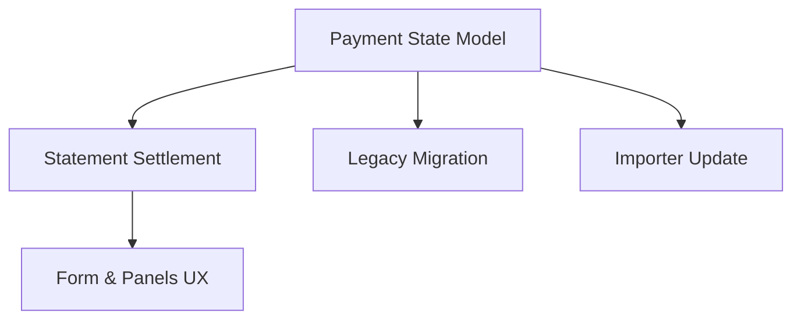

# Expense Payment State Model

## 1. Executive Summary

The Expense Payment State Model introduces a formal payment-state field to `Financial.CashFlow`'s expense tracking, replacing today's implicit "a card-tagged expense also always carries a bank tag" convention with three explicit states: Immediate Payment, Credit Card Charge, and Credit Card Settled. It is used by the same single developer-maintainer that PRD P11 (CashFlow Tracking) serves, extending the app they now use in place of their retired spreadsheet. The core value is correctness: today, tagging an expense to one of the 5 tracked credit cards still forces a bank (`PaymentSource`) tag onto it, so the Banks panel counts that charge against a bank balance the instant it's entered — before the card statement is ever paid. This PRD removes that double-count and makes settling a card statement an explicit, auditable transition that records which bank account paid the bill and when.

At a high level, an expense's payment state — Immediate Payment, Credit Card Charge, or Credit Card Settled — is fully determined by two fields already on `Expense` (`PaymentSource`, now nullable, and `CardTag`) plus a new `SettledAt` date; the state itself is never stored, only computed from those fields on read, so it can never drift out of sync with the data it's derived from — the same "derive, don't store" convention this codebase already applies to `CardStatement.OutstandingTotal`. `ImmediatePayment` expenses keep today's behavior (a bank tag, no card, counted against that bank immediately); `CreditCardCharge` expenses carry a card tag only, with no bank tag, so they never touch a bank total until settled; `CreditCardSettled` expenses are `CreditCardCharge` expenses that a "mark statement paid" action has cascaded forward, stamping them with the paying bank and a settlement date. Settlement stays at the per-card-per-month statement level (as it is today), not per-expense — marking a statement paid now requires picking which bank paid it, and a new "unmark paid" action (which does not exist today) reverses the cascade if a statement was marked paid by mistake. Because this is a change to an already-shipped, actively-used feature rather than a greenfield addition, the PRD also covers a one-time backfill of the live dataset and an update to the historical spreadsheet importer so both existing and newly imported data conform to the same rule.

## 2. Problem and Opportunity

### The Problem

**A credit card charge falsely reduces a bank balance immediately**
- `Expense.PaymentSource` is a required field today even when `Expense.CardTag` is also set, so every card-tagged expense carries a bank tag by construction
- The Web app's Banks panel sums `PaymentSource` across every expense in the month, including card-tagged ones — a charge to Chase Master 4023 today still reduces the displayed Barclays (or whichever bank was picked) total the moment it's entered, weeks before that statement is actually paid
- There is no field or state that distinguishes "this expense already left a bank account" from "this expense is only a card liability so far"

**Settling a card statement has no auditable trail**
- `CardStatement.IsPaid` is a bare boolean per card per month; marking it paid records nothing about which bank account covered the bill or when the payment happened
- Individual `Expense` records tagged to a settled card never change state — they remain indistinguishable from unsettled charges except by cross-referencing the statement's `IsPaid` flag
- If a statement is marked paid by mistake, there is no way to undo it: the `MarkUnpaid()` domain method exists but is only ever invoked internally to roll back a failed save, never as a user-facing action

**Existing data and the historical importer both encode the old, conflated rule**
- Every `Expense` already stored in the live `data-cashflow.json` (via direct app entry since P11 shipped, and via the one-time spreadsheet import) carries both a `PaymentSource` and, when applicable, a `CardTag`, so introducing a stricter state model would leave every existing card-tagged record inconsistent with the new invariants unless it is explicitly reclassified
- `MonthlyExpenseSheetImporter` resolves a `PaymentSource` for every row independently of whether a `CreditCard` tag was also resolved for that row, so re-running the importer today would keep reproducing the same conflated shape for any future historical corrections

### The Opportunity

- Card charges falsely hitting bank totals → **F01 makes `PaymentSource` nullable** and derives the `CreditCardCharge`/`ImmediatePayment` distinction directly from whether `PaymentSource`/`CardTag` are set, instead of forcing both to be populated together, and **F05's Banks panel update** excludes unsettled card charges from bank totals entirely
- No auditable settlement trail → **F02's statement settlement flow** requires a `PaymentSource` to mark a statement paid, cascades that bank tag and a settlement date onto every charge it covers, and adds the previously-missing "unmark paid" action to reverse a mistaken settlement
- Existing data encodes the old rule → **F03's one-time backfill** reclassifies every stored `Expense` against the new states using each card's current `IsPaid` status, and **F04's importer update** makes future historical corrections produce data in the new shape from the start

## 3. Target Audience

### Primary Users

**Developer-Maintainer**
- The same sole developer and sole end user as PRD P11, who has already retired their spreadsheet in favor of this app for ongoing expense entry
- Currently sees an inaccurate bank total the moment they tag an expense to a card, and has no way to correct a card statement mistakenly marked paid
- Values a data model correct by construction — consistent with this project's "no over-engineering, but no shortcuts either" standing rule — over a convenient but misleading shortcut like today's always-populated bank tag

## 4. Objectives

**Eliminate the bank-total double-count from unsettled card charges**
- Metric: for any month, the Banks panel total for every bank equals the sum of `ImmediatePayment` expenses tagged to that bank plus `CreditCardSettled` expenses whose settling `PaymentSource` is that bank — zero `CreditCardCharge` expenses (no `PaymentSource`) are included, in 100% of test fixtures

**Make card statement settlement an explicit, reversible, auditable action**
- Metric: marking a statement paid requires selecting one of the 3 `PaymentSource` values in 100% of cases, and cascades a `SettledAt` date to every `CreditCardCharge` expense it covers; unmarking a statement paid reverses the cascade with zero residual `PaymentSource`/`SettledAt` values on the affected expenses

**Bring existing data into conformance with the new state model without manual re-entry**
- Metric: 100% of `Expense` records in `data-cashflow.json` have a valid `PaymentSource`/`CardTag`/`SettledAt` combination after the one-time backfill, with zero records where both `PaymentSource` and `CardTag` are null, and zero records where `SettledAt` is set inconsistently with the other two fields

**Keep the historical importer consistent with the new rule going forward**
- Metric: 100% of card-tagged rows imported after this change resolve to `CreditCardCharge` with a null `PaymentSource`, regardless of what the source spreadsheet's column E contains for that row

## 5. User Stories

### F01. Expense Payment State Model
- As the system, I want every expense's `PaymentSource`/`CardTag`/`SettledAt` combination constrained to exactly one of three valid shapes (Immediate Payment, Credit Card Charge, Credit Card Settled) so that its bank-balance impact is always computable and never ambiguous
- As a user, I want an expense's fields to be validated against those three valid shapes (a bank tag when immediate, a card tag with no bank tag when charged, both a bank tag and a settlement date when settled) so that I can't save an expense in a contradictory state

### F02. Credit Card Statement Settlement with Payment Source
- As a user, I want to pick which bank account paid a card's statement when I mark it paid so that the settlement is tied to a real bank account instead of just clearing a flag
- As a user, I want every charge on that statement to automatically become settled, carrying that bank account and today's date, so that I don't have to update each expense by hand
- As a user, I want to unmark a statement I marked paid by mistake so that its charges revert to unsettled without me having to re-enter them

### F03. Legacy Data Migration
- As the developer, I want every existing expense in `data-cashflow.json` reclassified into the new payment-state model in one pass so that historical data doesn't violate the new invariants
- As the developer, I want the reclassification to use each card statement's current paid/unpaid status to decide whether a historical charge becomes settled or stays a charge, so that the result reflects what I actually know about each statement

### F04. Historical Import Update
- As the system, I want a row that resolves to a credit card tag during import to be classified as an unsettled Credit Card Charge with no bank tag, so that future historical corrections produce data consistent with the new rule
- As the developer, I want to mark statements paid in-app after a historical import if I know they were, so that I don't need the importer itself to guess settlement history

### F05. Expense Form & Panels UX Update
- As a user, I want the expense form to let me choose either "pay immediately from a bank" or "charge to a card," never both, so that I can't create a contradictory expense from the UI
- As a user, I want the Cards panel's outstanding total to reflect only unsettled charges so that it matches what I still owe on each card
- As a user, I want the Banks panel to exclude unsettled card charges so that it shows only money that has actually left each bank account

## 6. Functionalities

### F01. Expense Payment State Model

**Provides:**
- Nullable `PaymentSource` and a new `SettledAt` field on `Expense`, plus the validation rule constraining which `PaymentSource`/`CardTag`/`SettledAt` combinations are valid; a payment status (`ImmediatePayment`/`CreditCardCharge`/`CreditCardSettled`), computed from those fields rather than stored, is exposed wherever an expense is read (used by F02, F03, F04, F05)

**Capabilities:**
- `PaymentSource` becomes nullable and a new nullable `SettledAt` date field is added to `Expense`; no new stored status field is introduced — the payment state is fully determined by whether `PaymentSource` and `CardTag` are set, so it is computed on read rather than persisted, mirroring this codebase's existing "derive, don't store" convention already used for `CardStatement.OutstandingTotal`
- Exactly 3 `PaymentSource`/`CardTag` combinations are valid and each maps 1:1 to a computed status: `PaymentSource` set + `CardTag` null → `ImmediatePayment`; `PaymentSource` null + `CardTag` set → `CreditCardCharge`; `PaymentSource` set + `CardTag` set → `CreditCardSettled`. Both null is the one invalid combination and is rejected.
- `SettledAt` is required exactly when both `PaymentSource` and `CardTag` are set (the `CreditCardSettled` combination), and must be null in the other two valid combinations
- Creating or editing an expense with both `PaymentSource` and `CardTag` set is rejected when it doesn't come from F02's settlement cascade — that combination (and its required `SettledAt`) is only ever produced by marking a statement paid, never directly through the expense form or API
- Existing expense fields (date, description, value, category) and their limits (200-character description, non-zero value) are unchanged

**Experience:**
- No direct UI of its own; this is the validated data shape and derivation rule every other feature in this PRD reads and writes through

**Error Handling:**
- Saving an expense with neither `PaymentSource` nor `CardTag` set is rejected with a validation message before it reaches storage
- Saving an expense with both `PaymentSource` and `CardTag` set outside of F02's settlement cascade is rejected with a validation message directing the user to the statement settlement action
- Saving an expense whose `SettledAt` is inconsistent with its `PaymentSource`/`CardTag` combination (set when either is null, or null when both are set) is rejected with a validation message

### F02. Credit Card Statement Settlement with Payment Source

**Consumes:**
- F01: nullable `PaymentSource`, `SettledAt`, and the validation rule constraining which combinations of `PaymentSource`/`CardTag`/`SettledAt` are valid

**Provides:**
- Statement paid/unpaid state together with the cascade outcome (which expenses became settled or reverted, with which `PaymentSource` and `SettledAt`) (used by F05)

**Capabilities:**
- Marking a card's statement paid now requires selecting one of the 3 `PaymentSource` values (Barclays/Trading212/Chase); on confirmation, every `CreditCardCharge` expense tagged to that card for that statement's year/month transitions to `CreditCardSettled`, receiving that `PaymentSource` and a `SettledAt` value of the current date
- A new "unmark statement paid" action reverses a paid statement to unpaid; on confirmation, every `CreditCardSettled` expense tagged to that card for that statement's year/month that was settled by this statement reverts to `CreditCardCharge`, with `PaymentSource` and `SettledAt` cleared back to null
- Both the settle and unsettle cascades are all-or-nothing: if any expense in the cascade fails to save, the statement's paid/unpaid flag and every expense already updated in that cascade are rolled back to their pre-action state
- Marking an already-paid statement paid again remains a no-op with a confirmation message (unchanged from today); unmarking an already-unpaid statement is likewise a no-op with a confirmation message, not an error
- The outstanding-total calculation continues to be derived on read (never stored), now summing `CreditCardCharge` expenses for that card/month instead of all card-tagged expenses regardless of state

**Experience:**
- A user marking a statement paid now picks a bank account from a dropdown before confirming, alongside the card and month already shown; the same panel gains an "Unmark Paid" action next to an already-paid statement, requiring a confirmation click since it reverts multiple expenses at once

**Error Handling:**
- Marking a statement paid without selecting a `PaymentSource` is rejected with a validation message before any expense is touched
- A save failure partway through either cascade (settle or unsettle) leaves every expense in that statement's cascade — and the statement's own paid/unpaid flag — unchanged from before the action was attempted, rather than partially applying it
- Unmarking a statement that has no currently-settled expenses tagged to it (e.g., all were deleted after settlement) still flips the statement back to unpaid, with no cascade to apply

### F03. Legacy Data Migration

**Consumes:**
- F01: nullable `PaymentSource`, `SettledAt`, and the validation rule constraining which combinations of `PaymentSource`/`CardTag`/`SettledAt` are valid

**Capabilities:**
- A one-time backfill script reclassifies every `Expense` currently stored in the live `data-cashflow.json`, run directly against that file (not by reimporting the source spreadsheet, since a full reimport would discard any expense entered directly in the app since go-live)
- The script only ever writes `PaymentSource` and `SettledAt` (`CardTag` is left untouched) — there is no separate status field to write; per F01, the resulting `ImmediatePayment`/`CreditCardCharge`/`CreditCardSettled` classification is simply the computed read of those fields afterward
- An expense with no `CardTag` is left as-is (computes to `ImmediatePayment`, with its existing `PaymentSource` unchanged)
- An expense with a `CardTag` whose matching `CardStatement` (same `CreditCard`, `Year`, `Month`) has `IsPaid == true` keeps its existing `PaymentSource` as the settling bank (the true settling bank was never recorded historically) and gets `SettledAt` defaulted to the last day of that statement's month (the exact historical settlement date was never recorded) — computing to `CreditCardSettled`
- An expense with a `CardTag` whose matching `CardStatement` has `IsPaid == false` has its `PaymentSource` cleared to null (computing to `CreditCardCharge`)
- The script is re-runnable: running it again against an already-migrated file reclassifies every record from its current fields using the same 3 rules, producing the same result as a single run (idempotent, not cumulative)

**Experience:**
- Manual, one-time console run against the live data file, producing a summary count of how many expenses were reclassified into each of the 3 states; not a recurring or automatic process

**Error Handling:**
- The script reads a full backup of `data-cashflow.json` before writing (mirroring the existing backup/write discipline of the app's JSON storage layer) so a failed or interrupted run can be recovered from
- An expense with a `CardTag` but no matching `CardStatement` record for its year/month (should not occur given `CardStatementService`'s lazy generation, but is handled defensively) is treated as unpaid and becomes `CreditCardCharge`, and is listed in the run summary for manual review

### F04. Historical Import Update

**Consumes:**
- F01: nullable `PaymentSource` and the `CreditCardCharge` combination's field requirements (card tag present, `PaymentSource` null)

**Capabilities:**
- When `MonthlyExpenseSheetImporter` resolves a `CreditCard` tag for a row (via the column-E "T"/"C" tag or the fixed-row-section heuristic for the months that use it), the row is imported with that `CardTag` set and `PaymentSource = null` — computing to `CreditCardCharge` per F01 — regardless of what column E contains for that row
- A row with no resolved `CreditCard` tag continues to import with `PaymentSource` resolved from column E exactly as today (blank → Barclays, "T" → Trading212, "C" → Chase), computing to `ImmediatePayment`
- No row is imported with both `PaymentSource` and `CardTag` set (which would compute to `CreditCardSettled`) — settlement for imported historical months is applied afterward in-app via F02, if and when the developer confirms a given statement was actually paid

**Experience:**
- No direct UI change; this changes the output shape of the existing manual, one-time import console tool

**Error Handling:**
- No new error paths beyond the importer's existing per-sheet/per-row error report (unparseable value, unrecognized category)

### F05. Expense Form & Panels UX Update

**Consumes:**
- F01: nullable `PaymentSource`/`CardTag` validation rules and the payment status computed from them, for the form's mode enforcement
- F02: statement mark-paid/unmark-paid actions and their cascade outcome, for the Cards panel's controls and totals

**Capabilities:**
- The expense create/edit form offers exactly 2 mutually exclusive modes: "Pay immediately" (bank picker shown, card picker hidden, saves as `ImmediatePayment`) and "Charge to card" (card picker shown, bank picker hidden, saves as `CreditCardCharge`); switching modes clears the field made irrelevant by the switch
- `CreditCardSettled` is never an option on this form — an expense already in that state is shown read-only for its payment fields, with a note that it was settled via its card statement, and can only be reverted by unmarking that statement (F02)
- The Cards panel's outstanding total per card is computed by summing that card's `CreditCardCharge` expenses for the selected month (replacing today's card-tag-plus-statement-flag computation), still derived on read
- The Banks panel's per-bank total for the selected month sums `ImmediatePayment` expenses tagged to that bank plus `CreditCardSettled` expenses whose settlement `PaymentSource` is that bank; `CreditCardCharge` expenses are excluded entirely, since they have no `PaymentSource`
- The Cards panel's "Mark Paid" control now opens a bank picker (the 3 `PaymentSource` values) that must be selected before confirming; a paid statement additionally shows an "Unmark Paid" control

**Experience:**
- A user adding or editing an expense picks a mode first, then fills in only the fields relevant to that mode; the Cards and Banks panels update immediately after any expense save or statement mark-paid/unmark-paid action, using the same month-selection already in place today

**Error Handling:**
- Validation and failure messaging for expense create/edit/delete and statement mark-paid/unmark-paid reuse exactly what F01 and F02 already define; no new error paths are introduced at the UI layer

## 7. Out of Scope

**A per-expense settle action**
- Settlement remains at the card-statement level only, matching today's granularity; there is no way to mark a single expense settled independently of its statement

**New entities or persisted running totals**
- No new entity/table, and no stored status field either — only nullable `PaymentSource` and a new `SettledAt` field are added to the existing `Expense` entity; the payment status, like outstanding and bank totals, remains derived on read, not stored

**Editing `PaymentSource` or `SettledAt` directly on a settled expense**
- A `CreditCardSettled` expense's settlement bank and date are set only by the F02 mark-paid cascade and cleared only by the F02 unmark-paid cascade; there is no direct edit path for these two fields once an expense is settled

**Changes to the `CreditCard` or `PaymentSource` enums**
- The 5 tracked cards and 3 tracked banks are unchanged; this PRD only changes how `Expense` and `CardStatement` relate to them

**Settlement history beyond the current state**
- No audit log of prior settle/unsettle cycles for an expense; only the current `PaymentSource` and `SettledAt` are retained (status is computed from them, not stored), matching this project's "no over-engineering" standing rule

**Bank/Open Banking integration, budgeting/forecasting, receipt attachments**
- Unchanged from PRD P11's existing out-of-scope boundaries — this PRD does not revisit them

## 8. Dependency Graph

| # | Feature | Priority | Dependencies |
|---|---------|----------|--------------|
| F01 | Expense Payment State Model | 1 | None |
| F02 | Credit Card Statement Settlement with Payment Source | 1 | F01 |
| F03 | Legacy Data Migration | 1 | F01 |
| F04 | Historical Import Update | 2 | F01 |
| F05 | Expense Form & Panels UX Update | 1 | F01, F02 |

### Execution Waves
Features within the same wave can be built in parallel. A wave starts only after every feature in earlier waves is complete.

- **Wave 1**: F01
- **Wave 2**: F02, F03, F04
- **Wave 3**: F05

### Priority levels
- **1** = Essential — product does not work without it
- **2** = Important — significant value addition
- **3** = Desirable — incremental improvement

## 9. Acceptance Criteria

### F01. Expense Payment State Model
- [x] An expense saved with a `PaymentSource` set and no `CardTag` saves successfully and computes to `ImmediatePayment`
- [x] An expense saved with a `CardTag` set and no `PaymentSource` saves successfully and computes to `CreditCardCharge`
- [x] Saving an expense with neither `PaymentSource` nor `CardTag` set is rejected with a validation message
- [x] Saving an expense with both `PaymentSource` and `CardTag` set outside of F02's settlement cascade is rejected with a validation message
- [x] Saving an expense whose `SettledAt` is inconsistent with its `PaymentSource`/`CardTag` combination is rejected with a validation message

### F02. Credit Card Statement Settlement with Payment Source
- [ ] Marking a statement paid without a `PaymentSource` selected is rejected before any expense changes
- [ ] Marking a statement paid with a `PaymentSource` selected sets that `PaymentSource` and today's date as `SettledAt` on every `CreditCardCharge` expense on that card/month, computing each to `CreditCardSettled`
- [ ] Unmarking a paid statement clears `PaymentSource` and `SettledAt` on every `CreditCardSettled` expense on that card/month, computing each back to `CreditCardCharge`
- [ ] A save failure partway through either cascade leaves the statement's paid/unpaid flag and every expense in that cascade unchanged from before the action
- [ ] Marking an already-paid statement paid again, or unmarking an already-unpaid statement, is a no-op with a confirmation message, not an error

### F03. Legacy Data Migration
- [ ] Running the backfill script against `data-cashflow.json` leaves every expense with no `CardTag` unchanged (computing to `ImmediatePayment` with its existing `PaymentSource`)
- [ ] Every expense with a `CardTag` whose matching statement is `IsPaid == true` keeps its existing `PaymentSource` and gets `SettledAt` defaulted to that statement month's last day, computing to `CreditCardSettled`
- [ ] Every expense with a `CardTag` whose matching statement is `IsPaid == false` has `PaymentSource` cleared to null, computing to `CreditCardCharge`
- [ ] Running the script a second time against its own output produces the same result as the first run (idempotent)
- [ ] A backup of the pre-migration file exists after the run, independent of whether the run succeeded or failed partway through
- [ ] No status field is added to `data-cashflow.json`'s expense records — only `PaymentSource` and `SettledAt` values change; `CardTag` is untouched

### F04. Historical Import Update
- [ ] A row that resolves a `CreditCard` tag during import produces an expense with that `CardTag` set and `PaymentSource = null`, regardless of its column-E value
- [ ] A row with no resolved `CreditCard` tag continues to import with `PaymentSource` resolved from column E exactly as before this change
- [ ] No row is imported with both `PaymentSource` and `CardTag` set

### F05. Expense Form & Panels UX Update
- [ ] The expense form's "Pay immediately" mode shows only the bank picker and saves the expense as `ImmediatePayment`
- [ ] The expense form's "Charge to card" mode shows only the card picker and saves the expense as `CreditCardCharge`
- [ ] A `CreditCardSettled` expense's payment fields are shown read-only on the form, with no way to edit them directly
- [ ] The Cards panel's outstanding total for a card equals the sum of that card's `CreditCardCharge` expenses for the selected month
- [ ] The Banks panel's total for a bank equals the sum of that bank's `ImmediatePayment` expenses plus `CreditCardSettled` expenses settled by that bank for the selected month, excluding all `CreditCardCharge` expenses
- [ ] The Cards panel's "Mark Paid" control requires a bank selection before it can be confirmed, and a paid statement shows an "Unmark Paid" control

### Cross-Feature Integration
- [ ] F02's mark-paid/unmark-paid cascades correctly read and write the `PaymentSource` and `SettledAt` fields defined by F01, and reject the action if the resulting `PaymentSource`/`CardTag`/`SettledAt` combination would violate F01's validation rule
- [ ] F03's backfill correctly writes expenses into the `PaymentSource`/`CardTag`/`SettledAt` shape defined by F01, with zero resulting records violating F01's validation rule
- [ ] F04's updated importer produces expenses in the `PaymentSource`/`CardTag` shape defined by F01, with zero imported card-tagged rows carrying a non-null `PaymentSource`
- [ ] F05's Cards and Banks panels correctly reflect the field changes produced by F02's mark-paid/unmark-paid cascade immediately after each action
- [ ] F05's expense form correctly enforces F01's validation rule for both create and edit, with no path in the UI that can produce a rejected combination
- [ ] The computed payment status is derived identically everywhere it's exposed (API responses consumed by F05, the F03 migration's own classification logic) — there is no second, independently-maintained derivation that could disagree with F01's rule
