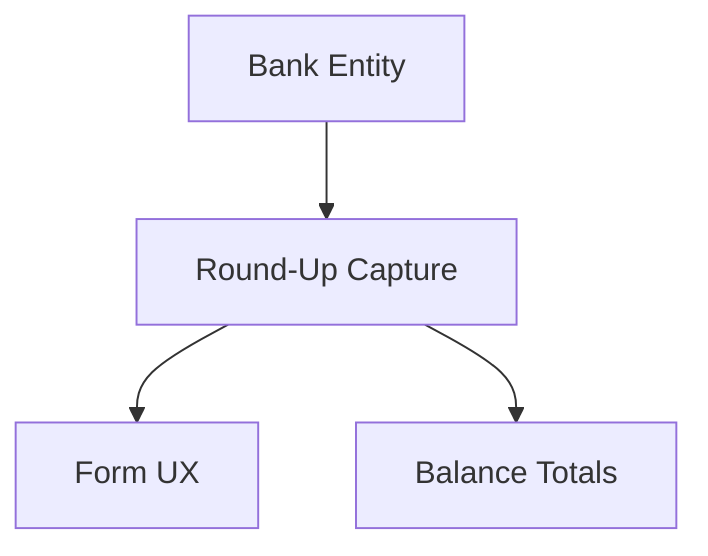

# Bank Round-Up Tracking

## 1. Executive Summary

Bank Round-Up Tracking teaches `Financial.CashFlow` that some bank accounts round card payments up to the next whole £1 and sweep the difference into savings, while others don't — and lets the app suggest, store, and edit that round-up per expense instead of leaving it untracked. It is used by the same single developer-maintainer that PRD P11 and P12 already serve, replacing the last piece of their retired spreadsheet workflow: a manual daily total, hand-summed into a running formula, entered separately from the expenses it was supposed to relate to. The core value is accuracy — a bank's displayed balance today is just the sum of its expenses, silently ignoring the money that already left the account through round-up sweeps, and there is nowhere in the data model to even say which of the 3 tracked banks support round-up in the first place.

At a high level, the 3 fixed bank tags an expense can carry today (`Barclays`, `Trading212`, `Chase`) stop being a bare enum and become a real `Bank` entity, each with a `RoundUpEnabled` flag (`false` for Barclays, `true` for Trading212 and Chase, matching their real-world behavior). Every expense paid directly from a round-up-enabled bank (not a credit card charge — round-up is a debit-card feature, not a credit-statement one) gets a suggested round-up amount computed as the difference to the next whole £1, which the user can accept, edit, or zero out — both at the moment they enter the expense and at any later point. That suggestion is a one-time computation, not a live formula: once a round-up amount is saved on an expense, editing that expense's value afterward never recalculates it, mirroring what actually happens when a bank like TfL authorizes a provisional amount, rounds up against it, and only corrects the real charge a day later — the round-up the bank already took stays what it was. Each bank's balance then becomes its expense total minus its accumulated round-up total, with that round-up total also shown on its own so the user can see both figures at a glance, the same way their spreadsheet kept a separate balance column and round-up column side by side.

This PRD does not touch how the round-up money is actually invested — the user tracks that manually today in the Investment area (via existing periodic snapshots) and will continue to do so; nothing here creates a transfer, and the `InvestmentAccount` enum and Investment module are entirely untouched. It also leaves the `CreditCard` enum as-is: promoting it to reference `Bank` would require inventing bank rows for card issuers (Amex, PayPal) that were never real bank accounts, for a feature (round-up) that never applies to credit-card charges anyway.

## 2. Problem and Opportunity

### The Problem

**There is nowhere to record which bank supports round-up**
- `PaymentSource` (`Barclays`, `Trading212`, `Chase`) is a bare enum with zero attributes — there is no field anywhere that can say "this bank rounds up card payments and this one doesn't"
- Chase and Trading 212 round up card spending today; Barclays does not — a fact the developer currently has to remember and apply manually every time they touch their spreadsheet, with no system enforcement
- Any future bank the developer adds would need the same manual, error-prone mental bookkeeping unless the round-up capability is attached to the bank itself

**Round-up money is invisible to the app's bank balances**
- A bank's balance today is purely `sum(Expense.Value)` for that bank — money the bank has already swept into round-up savings on the developer's behalf isn't subtracted anywhere, so the displayed balance overstates what's actually left in the account
- There is no per-expense record of how much, if anything, was rounded up on that specific purchase — only a manually-maintained aggregate in the spreadsheet, disconnected from the expenses it relates to

**Bank round-up behavior is inconsistent and sometimes provisional**
- Some banks (Chase, Trading 212) round up automatically but not on every transaction — which expenses get rounded up is entirely the bank's discretion, not something the developer controls or can predict from the expense alone
- Transit operators like TfL/London Underground authorize a small provisional amount, round up against that provisional figure, then correct the charge to its real final amount a day or more later — but the round-up the bank already took does not change to match the correction, so a system that recalculates round-up from an edited value would silently produce a wrong number
- Correcting an expense's value today (e.g., TfL's provisional-to-final correction) has no way to leave a previously-recorded round-up untouched, because no round-up is recorded at all

**The current process is a disconnected manual aggregate**
- The developer's spreadsheet tracks round-up as a single running-total cell per bank per month, built from a hand-typed formula chain of daily figures (e.g. `1.2+2.54+0.66+...`), entered separately from the expense list itself
- This aggregate has no link to which specific expense triggered which round-up amount, making it impossible to audit or correct a single mistaken entry without re-deriving the whole chain

### The Opportunity

- No way to record round-up capability per bank → **F01 promotes the bank tag to a `Bank` entity** with a `RoundUpEnabled` flag, seeded to match each bank's real behavior (Barclays: off; Trading 212 and Chase: on)
- Round-up money invisible to balances → **F04's Banks panel update** subtracts each bank's accumulated round-up total from its balance and shows the round-up total on its own
- Round-up behavior is inconsistent, provisional, and discretionary → **F02's per-expense round-up field** suggests a value only for eligible expenses, is always user-editable (including to 0) at any time, and — critically — is never recalculated once saved, so a later value correction can't silently overwrite a round-up the bank already took
- The process is a disconnected manual aggregate → **F03's expense form update** captures the round-up amount right where the expense itself is entered or edited, tying it directly to the specific purchase instead of a separate running total

## 3. Target Audience

### Primary Users

**Developer-Maintainer**
- The same sole developer and sole end user as PRD P11/P12, who has already retired their spreadsheet for expense entry and now wants its last manual routine — daily round-up totals — replaced too
- Currently has to remember which of their 3 banks round up at all, compute the difference by hand, and keep it in a formula chain disconnected from the expense list
- Values a balance that reflects reality (money the bank already swept away) over a convenient but stale figure — consistent with this project's "no over-engineering, but no shortcuts either" standing rule

## 4. Objectives

**Attach round-up capability directly to a bank**
- Metric: all 3 seeded banks (Barclays, Trading212, Chase) carry a `RoundUpEnabled` value matching their real-world behavior (`false`/`true`/`true`) immediately after the seed migration runs, verified against 100% of seeded rows

**Auto-suggest an accurate round-up amount for every eligible expense**
- Metric: for any `ImmediatePayment` expense tagged to a `RoundUpEnabled` bank, the suggested round-up equals `ceil(Value) − Value` to the penny in 100% of test fixtures, and no suggestion is offered for expenses on a non-round-up bank or for credit-card-tagged expenses

**Keep a saved round-up amount stable once set, while remaining freely editable**
- Metric: editing an expense's `Value` after its `RoundUpAmount` is saved never changes that `RoundUpAmount` in 100% of test fixtures; the user can still directly edit `RoundUpAmount` — including setting it to exactly 0 — at expense creation or at any later time, in 100% of cases

**Make each bank's balance reflect money already swept away by round-up**
- Metric: each bank's displayed balance equals `sum(Expense.Value) − sum(Expense.RoundUpAmount)` for that bank, matching to the penny in 100% of test fixtures, with the bank's accumulated round-up total also displayed as its own figure

## 5. User Stories

### F01. Bank Entity & Payment-Source Migration
- As the system, I want each of the 3 tracked banks to carry a `RoundUpEnabled` flag so that later features know which banks support round-up without hardcoding bank names
- As the developer, I want my existing expenses' bank tags migrated to reference the new `Bank` entity in one pass so that historical data keeps working under the new model without manual re-entry
- As the developer, I want card statement settlement to keep working exactly as before, now referencing a bank instead of the old enum, so that P12's settlement flow isn't broken by this change

### F02. Expense Round-Up Capture
- As a user, I want the system to suggest a round-up amount when I add an expense paid directly from a round-up-enabled bank so that I don't have to compute the difference to the next £1 by hand
- As a user, I want to override or clear that suggestion — including setting it to exactly 0 — so that I can match what the bank actually did, since not every eligible expense gets rounded up
- As a user, I want a saved round-up amount to stay exactly as I set it even if I later correct the expense's value, so that a provisional-to-final correction (like TfL's) doesn't silently change money the bank already swept away
- As a user, I want to be blocked from setting a round-up amount on a credit-card-tagged expense or on a bank that doesn't support round-up, so that I can't record a round-up that couldn't have actually happened

### F03. Expense Form Bank Picker & Round-Up UX
- As a user, I want the bank picker in the expense form to list the actual tracked banks so that adding a new bank in the future doesn't require a form rewrite
- As a user, I want a round-up field to appear, pre-filled with the suggested amount, only when I've picked a bank that supports round-up, so that I'm not shown an irrelevant field for Barclays
- As a user, I want to edit an existing expense's round-up amount later, not just at the moment I create it, so that I can correct it whenever I actually find out what the bank did

### F04. Bank Balance & Round-Up Totals
- As a user, I want each bank's displayed balance to subtract its accumulated round-up total so that the figure reflects money the bank has actually swept away
- As a user, I want to see each bank's round-up total on its own, separate from its balance, so that I know how much has been set aside without having to do the subtraction myself

## 6. Functionalities

### F01. Bank Entity & Payment-Source Migration

**Provides:**
- A `Bank` identity (name, `RoundUpEnabled` flag) resolvable for any tracked bank, and an expense's bank reference expressed against that identity instead of the old fixed enum (used by F02, F03, F04)

**Capabilities:**
- A new `Bank` concept replaces the `PaymentSource` enum, carrying a name and a `RoundUpEnabled` flag; exactly 3 banks are seeded — Barclays (`RoundUpEnabled = false`), Trading212 (`true`), Chase (`true`) — matching their real-world round-up behavior
- Every expense's existing bank tag is converted, in a one-time migration against the live data file, from the old enum value to a reference to the matching seeded bank; the migration is idempotent (re-running it against already-migrated data produces the same result) and takes a backup of the pre-migration file first, matching the backup-before-write discipline already used by P12's legacy data migration
- Card statement settlement (marking a statement paid, and unmarking it) keeps its existing behavior and validation rules exactly as shipped in P12, now expressed against the new bank reference instead of the old enum value — no functional change to settlement itself
- The `CreditCard` and `InvestmentAccount` enums are left completely unchanged — neither references the new `Bank` concept
- No screen is added to create, edit, or list banks; adding a bank beyond the 3 seeded ones is a follow-up change outside this feature's scope, not a runtime capability

**Experience:**
- No end-user-facing screen of its own; this is the migrated data shape every other feature in this PRD, and P12's existing settlement flow, reads and writes through. The bank picker the user already uses today (in the expense form and the statement settlement action) continues to work exactly as before, now backed by the new data.

**Error Handling:**
- The migration reads and writes a full backup of the data file before making changes, so a failed or interrupted run can be recovered from
- Any expense whose old bank tag can't be resolved to one of the 3 seeded banks (should not occur, since only those 3 values were ever valid) is left unmigrated and listed in the migration's run summary for manual review, rather than silently dropped or guessed at

### F02. Expense Round-Up Capture

**Consumes:**
- F01: bank identity and `RoundUpEnabled` flag, and an expense's bank reference

**Provides:**
- A stored round-up amount and a computed round-up suggestion, exposed wherever an expense is read or written (used by F03, F04)

**Capabilities:**
- An expense gains an optional round-up amount, settable only when the expense is paid directly from a bank (not credit-card-tagged) whose `RoundUpEnabled` is `true`; setting it on any other expense (credit-card-tagged, or a bank with round-up disabled) is rejected
- When an eligible expense is created or edited without an explicit round-up amount, the system computes and offers a suggested amount equal to the difference between the expense's value and the next whole £1 (e.g. a £9.40 expense suggests £0.60); the suggestion is available for any eligible expense at any time, not stored until the user accepts or overrides it
- A round-up amount, once saved on an expense, is never recalculated automatically — editing that expense's value afterward leaves its saved round-up amount exactly as it was; only an explicit user edit to the round-up amount itself changes it
- A round-up amount can be set to any value from £0.00 up to £0.99 inclusive (the maximum possible difference to the next whole £1); it can be explicitly set to £0.00 to record that the bank did not round up that particular expense, and it can be cleared back to "not yet decided" (no value recorded)
- A round-up amount is editable at the moment the expense is created and at any later time by editing the expense, with no time limit or lock beyond the eligibility rule above

**Experience:**
- No screen of its own; this is a field on the expense, surfaced through F03's form. The suggested amount is presented as a starting value the user can accept, type over, or clear — never silently saved without the user seeing it first.

**Error Handling:**
- Saving a round-up amount on a credit-card-tagged expense is rejected with a validation message explaining that round-up only applies to expenses paid directly from a bank
- Saving a round-up amount on an expense whose bank does not have `RoundUpEnabled` is rejected with a validation message naming the bank
- Saving a round-up amount outside the £0.00–£0.99 range is rejected with a validation message

### F03. Expense Form Bank Picker & Round-Up UX

**Consumes:**
- F01: the list of banks and each bank's `RoundUpEnabled` flag, for the bank picker and for deciding whether to show the round-up field
- F02: the suggested round-up amount and the stored round-up amount's read/write contract

**Capabilities:**
- The expense form's "pay immediately" mode bank picker lists the banks from F01 instead of a fixed set of options, so it reflects whatever banks are seeded without a form code change
- When the selected bank has `RoundUpEnabled = true`, a round-up field appears alongside the bank picker, pre-filled with F02's suggested amount and directly editable, including clearing it to £0.00; the field does not appear at all when the selected bank has round-up disabled, or in "charge to card" mode
- Editing an existing expense re-opens the same round-up field (pre-filled with its currently saved amount, not a freshly recomputed suggestion) so the user can change it independently of the expense's value, at any time after creation

**Experience:**
- Adding or editing an expense in "pay immediately" mode against a round-up-enabled bank shows the round-up field automatically once that bank is picked, with the suggested amount already filled in; the user types over it or accepts it as-is, and can leave it blank if they don't yet know whether the bank rounded that expense up. Picking a non-round-up bank, or switching to "charge to card" mode, hides the field entirely.

### F04. Bank Balance & Round-Up Totals

**Consumes:**
- F01: bank identity, for grouping expenses and round-up amounts by bank
- F02: each expense's stored round-up amount

**Capabilities:**
- Each bank's displayed balance for the selected month changes from `sum(Expense.Value)` to `sum(Expense.Value) − sum(Expense.RoundUpAmount)` across that bank's expenses, so expenses with no recorded round-up amount contribute their full value unchanged
- Each bank also displays its accumulated round-up total for the selected month (`sum(Expense.RoundUpAmount)`) as its own figure, alongside its balance, rather than folded invisibly into the balance calculation
- Banks with `RoundUpEnabled = false` (Barclays) always show a round-up total of £0.00, since no expense on that bank can carry a round-up amount

**Experience:**
- The Banks panel the user already checks after entering expenses shows, per bank, both the adjusted balance and the round-up total side by side, updating immediately after any expense is saved — the same immediacy as every other panel figure in this app.

## 7. Out of Scope

**Automatic transfer or investment of round-up money**
- No transfer entity or automatic Investment-module entry is created when a round-up amount is saved; the developer continues to record any actual investment growth manually via the existing periodic Investment snapshots, entirely independent of this feature

**Changes to `CreditCard` or `InvestmentAccount`**
- Neither enum is migrated to reference the new `Bank` entity; `CreditCard` keeps its 5 fixed members exactly as-is, and the Investment module is untouched by this PRD

**A Bank management screen**
- Banks are seeded by migration only (Barclays, Trading212, Chase); there is no in-app way to add, rename, or toggle a bank's round-up capability. Adding a bank beyond the 3 seeded ones requires a follow-up code change, not a user-facing action.

**Historical round-up backfill**
- Existing expenses recorded before this feature keep no round-up amount (null); the spreadsheet's years of manually-tracked daily round-up totals are not imported or reconciled against historical expenses

**Configurable rounding granularity**
- The round-up suggestion is always "round up to the next whole £1" for every round-up-enabled bank; there is no per-bank setting for a different rounding unit (e.g. nearest £0.50)

**Round-up on credit-card charges or settled statements**
- Round-up never applies to `CreditCardCharge` or `CreditCardSettled` expenses, matching how real round-up programs apply only to debit spending, not credit card bills

**Bank/Open Banking integration**
- Unchanged from PRD P11/P12's existing out-of-scope boundaries — round-up amounts remain manually entered or overridden by the developer, with no live bank API sync

## 8. Dependency Graph

| # | Feature | Priority | Dependencies |
|---|---------|----------|--------------|
| F01 | Bank Entity & Payment-Source Migration | 1 | None |
| F02 | Expense Round-Up Capture | 1 | F01 |
| F03 | Expense Form Bank Picker & Round-Up UX | 1 | F01, F02 |
| F04 | Bank Balance & Round-Up Totals | 1 | F01, F02 |

### Execution Waves
Features within the same wave can be built in parallel. A wave starts only after every feature in earlier waves is complete.

- **Wave 1**: F01
- **Wave 2**: F02
- **Wave 3**: F03, F04

### Priority levels
- **1** = Essential — product does not work without it
- **2** = Important — significant value addition
- **3** = Desirable — incremental improvement

## 9. Acceptance Criteria

### F01. Bank Entity & Payment-Source Migration
- [x] The 3 seeded banks carry `RoundUpEnabled` values of `false` (Barclays), `true` (Trading212), and `true` (Chase) immediately after migration
- [x] Every expense's bank tag correctly resolves to the matching new `Bank` reference after the one-time migration runs
- [x] Running the migration a second time against already-migrated data produces the same result (idempotent)
- [x] A backup of the pre-migration data file exists after the run, independent of whether the run succeeded or failed partway through
- [x] Card statement settlement (mark paid / unmark paid) continues to function exactly as it did before this change, now referencing a bank instead of the old enum

### F02. Expense Round-Up Capture
- [x] An eligible expense (paid directly from a `RoundUpEnabled` bank) with value £9.40 is offered a suggested round-up of £0.60
- [x] Saving a round-up amount on a credit-card-tagged expense is rejected with a validation message
- [x] Saving a round-up amount on an expense whose bank has `RoundUpEnabled = false` is rejected with a validation message
- [x] Saving a round-up amount outside the £0.00–£0.99 range is rejected with a validation message
- [x] A round-up amount can be explicitly saved as £0.00
- [x] Editing an expense's value after its round-up amount is saved leaves that round-up amount unchanged
- [x] A previously saved round-up amount can be directly edited to a new value at any time after the expense was created

### F03. Expense Form Bank Picker & Round-Up UX
- [ ] The expense form's bank picker lists the banks resolved from F01 rather than a fixed set of options
- [ ] Selecting a `RoundUpEnabled` bank in "pay immediately" mode shows a round-up field pre-filled with the suggested amount
- [ ] Selecting a non-round-up bank, or switching to "charge to card" mode, hides the round-up field entirely
- [ ] Editing an existing expense shows its currently saved round-up amount in the field, not a freshly recomputed suggestion
- [ ] Editing an existing expense's round-up amount and saving persists the new value without altering the expense's value

### F04. Bank Balance & Round-Up Totals
- [ ] A bank's displayed balance for the selected month equals `sum(Expense.Value) − sum(Expense.RoundUpAmount)` across that bank's expenses
- [ ] A bank's round-up total for the selected month equals `sum(Expense.RoundUpAmount)` across that bank's expenses, displayed separately from its balance
- [ ] Barclays (a non-round-up bank) always shows a round-up total of £0.00
- [ ] The Banks panel's balance and round-up total both update immediately after an expense is saved

### Cross-Feature Integration
- [x] F02's round-up suggestion and eligibility check correctly read each bank's `RoundUpEnabled` flag as defined by F01, offering a suggestion only for banks where it is `true`
- [ ] F03's bank picker and round-up field correctly reflect the bank list and `RoundUpEnabled` flags from F01, and correctly read and write the round-up amount contract defined by F02
- [ ] F04's balance and round-up total calculations correctly group expenses by the bank identity defined by F01 and correctly sum the round-up amounts defined by F02
