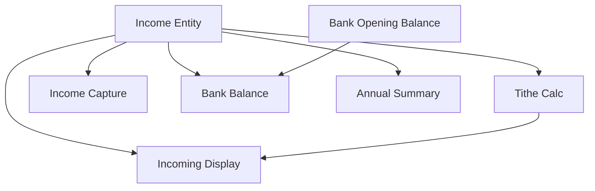

# Monthly Income Tracking and Real Bank Balance

## 1. Executive Summary

Monthly Income Tracking and Real Bank Balance gives `Financial.CashFlow`'s Monthly tab the income side of cash flow it has never had, and fixes the bank figure that has been mislabeled since P13. It is used by the same single developer-maintainer that PRD P11, P12, and P13 already serve, replacing the last surviving piece of their retired spreadsheet: an income block (J2:L5), a tithe calculation (J6:L6), and a manually-maintained tithe balance (K7) that today only exists as hand-typed spreadsheet formulas, disconnected from the expenses the tithe balance depends on. The core value is completeness and accuracy — without an income side, the Monthly tab can only ever show half the picture, and without a real bank balance, the figure the developer checks after every expense entry silently ignores every pound that ever came in.

At a high level, a new `Income` entity captures one entry per pay event — date, source (`Gleison`, `Ariana`, `Lottery`, or `DividendoJuros`), gross value (where applicable), net value, and destination bank — with no limit on how many entries exist per month per source. This one shape handles Gleison's single monthly paycheck, Ariana's 4-5 weekly paychecks, and the roughly 8 (but variable) Dividendo/Juros entries the developer currently tracks, without special-casing any of them. From these entries, the tithe (a fixed 10% of the month's total net income) is calculated automatically, and the tithe balance — the calculated tithe minus whatever the developer has already recorded as `Dizimo`-category expenses that month — replaces the manual subtraction they do today. Separately, each `Bank` (from P13) gains a one-time opening balance and effective date, turning its displayed figure from a single month's net expense total into a real, running balance: opening balance plus every pound of income and minus every pound of expense recorded against that bank from the opening date forward.

This PRD does not touch how the developer actually pays their tithe — recording a `Dizimo` expense stays exactly as manual as it is today; this feature only calculates the balance against it. It also does not add a bank management screen, backfill historical income, or make the tithe percentage configurable — all deliberate simplifications consistent with this project's no-over-engineering standing rule for a single-user personal tool.

## 2. Problem and Opportunity

### The Problem

**The Monthly tab has no income side at all**
- Every figure on the Monthly page today — Category Totals, Cards, Banks — is derived purely from expenses; there is no field, entity, or screen anywhere that records money coming in
- The developer's retired spreadsheet always tracked 4 income sources (Salario Gleison, Salario Ariana, Lottery, Dividendo/Juros) side by side with the tithe they generate; none of that exists in the app today

**The tithe balance is a manual, disconnected calculation**
- The tithe itself (a tenth of net salaries, lottery, and dividends/interest) is computed by hand in the spreadsheet today
- The tithe balance — tithe owed minus what's already been paid via `Dizimo`-category expenses — requires the developer to manually look up that month's Dizimo expenses and subtract them from the calculated tithe every time either figure changes
- This manual step is exactly the kind of disconnected, error-prone aggregate that P11-P13 already eliminated for expenses, round-up, and card settlement

**The bank balance figure is not a real balance**
- Per P13, a bank's displayed balance is `sum(Expense.Value) − sum(Expense.RoundUpAmount)` for the selected month only — it has no opening balance, doesn't carry forward between months, and (until this PRD) has no way to add money in at all
- The panel is effectively labeled as a running total ("Balance") but behaves like a single month's net spend, which is not what the developer means when they say "bank balance"

**The Annual Summary has no income visibility**
- `AnnualSummaryPage` today shows only expense Category Totals and Investment Diffs; salary, taxes withheld, and dividends/interest — figures the developer's spreadsheet has always summarized per month across the year — aren't represented anywhere

### The Opportunity

- No income side on the Monthly tab → **F01's `Income` entity** and **F04's capture UI** give the developer a place to enter every pay event, with no limit on entries per source per month
- Tithe balance is a manual, disconnected calculation → **F03's tithe calculation** computes both the tithe and the tithe balance automatically from `Income` and existing `Dizimo`-category expenses, and **F05** surfaces both on the Monthly page
- Bank balance isn't a real balance → **F02's opening balance** and **F06's balance recalculation** turn the Banks panel into a running account balance that includes income and carries forward month to month
- No income visibility in the Annual Summary → **F07** adds a per-month Income Summary table alongside the existing Category Totals and Investment Diffs tables

## 3. Target Audience

### Primary Users

**Developer-Maintainer**
- The same sole developer and sole end user as PRD P11, P12, and P13, who has already retired their spreadsheet for expenses, round-up, and card settlement, and now wants its last surviving piece — the income and tithe block — replaced too
- Currently re-derives the tithe balance by hand every time they check it, and reads a "bank balance" that they already know undercounts reality because it ignores income entirely
- Values a figure that reflects real money over a convenient but incomplete one — the same standing rule that drove P13's round-up work

## 4. Objectives

**Give the Monthly tab a real income side matching the retired spreadsheet**
- Metric: all 4 income sources (Gleison, Ariana, Lottery, DividendoJuros) are capturable with an unlimited number of entries per source per month, verified against representative fixtures (a single Gleison entry, 4-5 Ariana entries, ~8 DividendoJuros entries) in 100% of test cases

**Automate the tithe balance calculation**
- Metric: the calculated tithe (10% of the month's total net income) and the tithe balance (tithe minus that month's `Dizimo`-category expenses) match a manually-computed reference value to the penny in 100% of test fixtures

**Make bank balance reflect real money**
- Metric: each bank's displayed balance equals `OpeningBalance + Σ(Income.NetValue) − Σ(Expense.Value − Expense.RoundUpAmount)` for that bank from its `OpeningBalanceDate` forward, matching to the penny in 100% of test fixtures

**Surface income in the Annual Summary**
- Metric: the Income Summary table's rows 2 (Salary), 3 (Salary after taxes), 4 (Tax difference), and 6 (Dividendo/Juros) compute correctly for every month with income data, matching a manually-computed reference to the penny in 100% of test fixtures

## 5. User Stories

### F01. Income Entity and Migration
- As the system, I want a single `Income` entity that can hold any number of entries per source per month so that Gleison's one paycheck, Ariana's weekly paychecks, and the variable count of Dividendo/Juros entries are all handled the same way without special-casing
- As the developer, I want the migration that adds the `Income` collection to back up the data file first so that a failed run can be recovered from

### F02. Bank Opening Balance
- As the developer, I want to set each bank's real balance as of a known date so that the app's running balance starts from reality instead of zero
- As the developer, I want to correct a bank's opening balance or its effective date later if I got it wrong, so that a mistake doesn't require a data migration to fix

### F03. Tithe Calculation
- As the system, I want to calculate the month's tithe as 10% of total net income so that the developer never has to compute it by hand
- As the system, I want to calculate the tithe balance as the tithe minus that month's `Dizimo`-category expenses so that the developer can see at a glance whether they've paid enough

### F04. Monthly Income Capture UI
- As the developer, I want to add an income entry with a date, source, gross/net value, and bank so that I can record a paycheck, lottery win, or dividend payment the same way I already record an expense
- As the developer, I want to add as many entries as I need for the same source in the same month so that Ariana's weekly paychecks and multiple Dividendo/Juros payments don't need to be pre-summed by hand
- As the developer, I want to edit or delete an income entry after saving it so that I can correct a mistake

### F05. Monthly Incoming and Tithe Display
- As the developer, I want to see each income source's monthly total, the calculated tithe, and the tithe balance on the Monthly page so that I have the same at-a-glance view my spreadsheet's income block used to give me

### F06. Real Bank Balance
- As the developer, I want each bank's displayed balance to include income, not just expenses, so that the figure reflects money actually available in the account
- As the developer, I want that balance to carry forward from a real opening balance rather than resetting to a single month's net spend, so that it behaves like an actual account balance

### F07. Annual Summary Income Rows
- As the developer, I want to see salary (gross and net), the tax difference, and Dividendo/Juros totals per month across the year so that I can review my income the same way I already review expense category totals

## 6. Functionalities

### F01. Income Entity and Migration

**Provides:**
- Income entries (date, income source, gross value, net value, destination bank), queryable by month and year (used by F03, F04, F05, F06, F07)

**Capabilities:**
- A new `Income` entity is introduced with 5 fields: `Date`, `IncomeSource` (a new enum distinct from the expense `Category` enum, with members `Gleison`, `Ariana`, `Lottery`, `DividendoJuros`), `GrossValue` (nullable, only meaningful for `Gleison`/`Ariana` entries), `NetValue` (always required), and `Bank` (a required reference to the existing `Bank` entity from P13)
- Any number of `Income` entries can exist for the same month and the same `IncomeSource` — there is no one-per-category-per-month limit, so Ariana's 4-5 weekly paychecks and a variable count of Dividendo/Juros entries are each just multiple dated `Income` rows
- `GrossValue`, when provided, must be greater than or equal to `NetValue`
- A one-time migration adds the new, initially-empty `Income` collection to the live data file, following the same backup-before-write, idempotent pattern used by P12 and P13's migrations
- No historical income backfill is performed; the developer enters past months manually if they choose to

**Experience:**
- No screen of its own; this is the data shape F04 reads and writes and every other feature in this PRD consumes.

**Error Handling:**
- The migration takes a full backup of the data file before writing, so a failed or interrupted run can be recovered from
- Running the migration a second time against already-migrated data is a no-op (idempotent)

### F02. Bank Opening Balance

**Provides:**
- Each bank's opening balance and opening balance effective date (used by F06)

**Capabilities:**
- The existing `Bank` entity gains two fields: `OpeningBalance` (decimal, defaults to £0.00) and `OpeningBalanceDate` (date, defaults to the migration run date)
- A one-time migration adds these fields to all existing banks with the defaults above; the developer is expected to manually correct each bank's `OpeningBalance` and `OpeningBalanceDate` afterward to match its real-world balance as of a known date
- Both fields remain editable at any time after migration, not just once, so a wrong initial value can be corrected without another migration
- No screen is added to create a new bank; this feature only adds the two fields to the 3 banks already seeded by P13

**Experience:**
- The Banks panel gains a small edit affordance per bank to set or update its opening balance and effective date; editing takes effect immediately in F06's balance calculation.

**Error Handling:**
- The migration takes a full backup of the data file before writing
- Setting `OpeningBalance` to a negative value is rejected with a validation message

### F03. Tithe Calculation

**Consumes:**
- F01: income entries' net values for the selected month

**Provides:**
- Calculated tithe and tithe balance for the selected month (used by F05)

**Capabilities:**
- The tithe base for a month is the sum of `NetValue` across every `Income` entry dated that month, regardless of `IncomeSource`
- The calculated tithe is a fixed 10% of the tithe base, computed on demand — not stored — whenever the selected month, its income, or its expenses change
- The tithe balance is the calculated tithe minus the sum of `Expense.Value` for that month's expenses tagged `Category.Dizimo`
- The tithe balance can be negative (more paid via Dizimo expenses than the calculated tithe) or positive (owed but not yet paid); both are valid and shown as-is, with no clamping

**Experience:**
- No screen of its own; this is the calculation F05 displays.

### F04. Monthly Income Capture UI

**Consumes:**
- F01: income entry create/edit/delete contract (date, income source, gross value, net value, bank)

**Capabilities:**
- The Monthly page gains an income entry form, structurally mirroring the existing `ExpenseForm`: a date picker (defaulting to the selected month), an `IncomeSource` dropdown, a gross value field (shown only when the source is `Gleison` or `Ariana`), a net value field, and a bank picker reusing the existing Bank list
- Saved income entries for the selected month appear in a list below the form (mirroring `ExpensesSection`), each editable or deletable inline
- Deleting an income entry is a hard delete with no undo, consistent with expense deletion

**Experience:**
- The developer adds an income entry the same way they add an expense: fill the form, save, see it appear in the list immediately, edit or delete inline. Adding Ariana's next weekly paycheck, or an additional Dividendo/Juros entry for the month, works exactly the same way as the first one — there is no separate "add another" step.

**Error Handling:**
- Saving an entry with `GrossValue < NetValue` is rejected with a validation message
- Saving an entry with no `Bank` selected is rejected with a validation message
- Saving an entry with a negative `NetValue` is rejected with a validation message

### F05. Monthly Incoming and Tithe Display

**Consumes:**
- F01: income entries for the selected month, grouped by `IncomeSource`
- F03: calculated tithe and tithe balance for the selected month

**Capabilities:**
- The Monthly page gains an "Incoming" card, alongside the existing Category Totals, Cards, and Banks cards, showing one row per `IncomeSource` with that category's summed `NetValue` for the month (Gleison and Ariana rows also show summed `GrossValue`), plus a total incoming row
- The card also shows the calculated tithe and the tithe balance, clearly labeled, so the developer can see at a glance whether that month's Dizimo expenses cover the tithe owed

**Experience:**
- The Incoming card updates immediately whenever an income entry is added, edited, or deleted, and whenever a Dizimo-category expense changes — the same immediacy as every other panel figure on this page.

### F06. Real Bank Balance

**Consumes:**
- F01: income entries' net values and destination bank, dated on or after each bank's opening balance date
- F02: each bank's opening balance and opening balance date

**Capabilities:**
- Each bank's displayed balance changes from P13's `sum(Expense.Value) − sum(Expense.RoundUpAmount)` for the selected month only, to: `OpeningBalance + Σ(Income.NetValue) − Σ(Expense.Value − Expense.RoundUpAmount)`, both sums running over that bank's income and expenses dated from `OpeningBalanceDate` through the end of the selected month
- Activity dated before a bank's `OpeningBalanceDate` never contributes to its balance, since it is already reflected in the opening balance itself
- The Banks panel's balance label is renamed to "Bank Balance" to reflect that it is now a real, running account balance rather than a single month's net expense total

**Experience:**
- The Banks panel the developer already checks after entering expenses now also updates when income is entered, and the balance carries forward month to month instead of resetting.

### F07. Annual Summary Income Rows

**Consumes:**
- F01: income entries' gross and net values by category, across all 12 months of the selected year

**Capabilities:**
- The Annual Summary page gains a new Income Summary table, laid out like the existing Category Totals table (one row per metric, 12 monthly columns plus a annual total column):
  - Row 1: section header ("Income"), no numeric value
  - Row 2 "Salary": sum of `GrossValue` for that month's `Gleison` and `Ariana` entries
  - Row 3 "Salary after taxes": sum of `NetValue` for that month's `Gleison` and `Ariana` entries
  - Row 4 "Tax difference": row 2 minus row 3 for that month
  - Row 5: intentionally left blank
  - Row 6 "Dividendo/Juros": sum of `NetValue` for that month's `DividendoJuros` entries
- Lottery, the calculated tithe, and the tithe balance are not shown in the Annual Summary — they remain Monthly-page-only

**Experience:**
- The Income Summary table appears on the Annual Summary page alongside the existing Category Totals and Investment Diffs tables, using the same per-month column layout.

## 7. Out of Scope

**Configurable tithe percentage**
- The tithe is always a fixed 10%; there is no settings screen or per-install configuration for a different rate

**Bank management screen**
- Unchanged from P13: no in-app way to add, rename, or remove a bank. This feature only adds an editable opening balance and effective date to the 3 already-seeded banks

**Historical income backfill**
- No import or reconciliation of past months' income against the spreadsheet's history; the migration only adds an empty `Income` collection, and the developer enters historical data manually if they choose to

**Automatic tithe payment or expense creation**
- Recording that a tithe was actually paid still means manually adding a `Dizimo`-category expense, exactly as today; this feature only calculates the balance against whatever `Dizimo` expenses already exist

**Lottery and tithe rows in the Annual Summary**
- Per the developer's explicit scope, the Annual Summary's Income Summary table only carries rows 2, 3, 4, and 6 — Lottery, tithe, and tithe balance are not represented there

**Multi-currency income**
- All income amounts are in the same currency as the rest of `Financial.CashFlow` (£); no currency selection or conversion is introduced

**Bank/Open Banking integration**
- Unchanged from PRD P11-P13's existing out-of-scope boundary — all income and opening balances remain manually entered, with no live bank API sync

## 8. Dependency Graph

| # | Feature | Priority | Dependencies |
|---|---------|----------|--------------|
| F01 | Income Entity and Migration | 1 | None |
| F02 | Bank Opening Balance | 1 | None |
| F03 | Tithe Calculation | 1 | F01 |
| F04 | Monthly Income Capture UI | 1 | F01 |
| F05 | Monthly Incoming and Tithe Display | 1 | F01, F03 |
| F06 | Real Bank Balance | 1 | F01, F02 |
| F07 | Annual Summary Income Rows | 2 | F01 |

### Execution Waves
Features within the same wave can be built in parallel. A wave starts only after every feature in earlier waves is complete.

- **Wave 1**: F01, F02
- **Wave 2**: F03, F04, F06, F07
- **Wave 3**: F05

### Priority levels
- **1** = Essential — product does not work without it
- **2** = Important — significant value addition
- **3** = Desirable — incremental improvement

## 9. Acceptance Criteria

### F01. Income Entity and Migration
- [x] An `Income` entry can be created with `Date`, `IncomeSource`, `NetValue`, and `Bank`; `GrossValue` is optional
- [x] Multiple `Income` entries can exist for the same month and the same `IncomeSource` with no upper limit enforced
- [x] Creating an entry with `GrossValue` less than `NetValue` is rejected
- [x] The migration adds an empty `Income` collection to the data file and takes a backup before writing
- [x] Running the migration a second time against already-migrated data produces the same result (idempotent)

### F02. Bank Opening Balance
- [x] Each existing bank has `OpeningBalance` and `OpeningBalanceDate` fields populated with default values immediately after migration
- [x] `OpeningBalance` and `OpeningBalanceDate` can be edited after migration, and the new values are reflected in the next balance calculation
- [x] Setting `OpeningBalance` to a negative value is rejected with a validation message
- [x] The migration takes a backup of the data file before writing

### F03. Tithe Calculation
- [x] The calculated tithe for a month equals 10% of the sum of `NetValue` across all that month's `Income` entries, matching a manual reference calculation to the penny
- [x] The tithe balance equals the calculated tithe minus the sum of that month's `Dizimo`-category expenses, matching a manual reference calculation to the penny
- [x] A tithe balance can display as a negative value without error when Dizimo expenses exceed the calculated tithe

### F04. Monthly Income Capture UI
- [x] An income entry can be added via the form with all required fields and appears in the month's list immediately after saving
- [x] The gross value field is shown only when `Gleison` or `Ariana` is selected as the source
- [x] An existing income entry can be edited and the change is reflected in the list and in any dependent totals
- [x] An existing income entry can be deleted and is removed from the list immediately
- [x] Saving an entry with no bank selected, a negative net value, or gross less than net is rejected with a validation message

### F05. Monthly Incoming and Tithe Display
- [x] The Incoming card shows one row per `IncomeSource` with the correct summed value for the selected month
- [x] The Incoming card shows the calculated tithe and tithe balance for the selected month
- [x] The Incoming card updates immediately after an income entry or a Dizimo-category expense is added, edited, or deleted

### F06. Real Bank Balance
- [x] A bank's displayed balance equals `OpeningBalance + Σ(Income.NetValue) − Σ(Expense.Value − Expense.RoundUpAmount)` for that bank from its `OpeningBalanceDate` through the selected month, matching a manual reference calculation to the penny
- [x] Income or expenses dated before a bank's `OpeningBalanceDate` do not affect its displayed balance
- [x] The Banks panel label reads "Bank Balance" instead of the prior expense-only label
- [x] The displayed balance updates immediately after an income entry or expense is saved

### F07. Annual Summary Income Rows
- [x] The Income Summary table's Salary row (row 2) equals the sum of Gleison and Ariana gross values for each month, matching a manual reference calculation
- [x] The Salary after taxes row (row 3) equals the sum of Gleison and Ariana net values for each month
- [x] The Tax difference row (row 4) equals row 2 minus row 3 for each month
- [x] The Dividendo/Juros row (row 6) equals the sum of that month's DividendoJuros net values
- [x] Row 5 renders with no numeric value
- [x] Lottery, tithe, and tithe balance do not appear anywhere in the Annual Summary page

### Cross-Feature Integration
- [x] F03's tithe calculation correctly reads the net income totals produced by F01 for the selected month
- [x] F04's create/edit/delete actions correctly read and write through F01's `Income` entity contract
- [x] F05 correctly displays the income totals from F01 and the tithe/tithe balance from F03 for the selected month
- [x] F06 correctly combines F01's income data with F02's opening balance and date to produce each bank's balance
- [x] F07 correctly aggregates F01's income data across all 12 months of the selected year into the Annual Summary's Income Summary table
