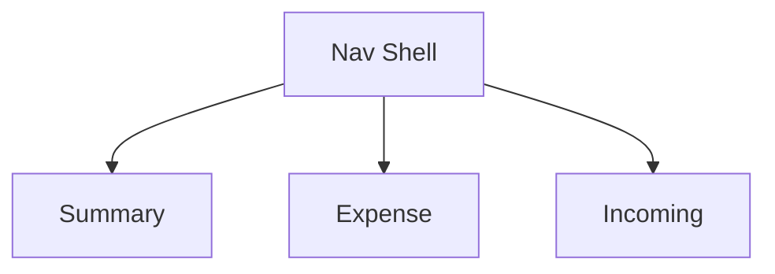

# Monthly Tab Sub-Tab Redesign

## 1. Executive Summary

Monthly Tab Sub-Tab Redesign reorganizes `Financial.CashFlow`'s Monthly tab, which since P11-P14 has accumulated four total grids (Category Totals, Cards, Banks, Incoming) plus the full Expense list and full Income list on a single scrolling page. It is used by the same single developer-maintainer that all prior CashFlow PRDs serve. The core value is legibility: today's page mixes an at-a-glance overview with two full transactional lists, forcing the developer to scroll past everything just to check one figure or find one line item.

At a high level, the page is split into three sub-tabs — **Summary**, **Expense**, and **Incoming** — sharing a single month/year picker that sits above the sub-tab row and applies to all three. Summary holds the four existing total grids, now arranged as two visually separated groups (Category Totals + Cards, then Banks + Incoming) instead of one crowded row of four. Expense holds the existing full expense list with its create/edit/delete flows. Incoming holds the existing full income list with its create/edit/delete flows. Switching sub-tabs never changes the selected month/year and never triggers a data refetch — the developer picks a period once and moves freely between views.

This is a UI-only reorganization. No entity, calculation, API endpoint, or business rule introduced by P11-P14 changes — every figure, form, validation, and action available today remains available, simply regrouped into a clearer layout.

## 2. Problem and Opportunity

### The Problem

**The Monthly tab shows too much at once**
- A single page today renders 4 total grids, the full expense list, and the full income list all in one continuous scroll
- There is no separation between "at a glance" figures (totals) and "detailed" data (line-item lists), so reviewing one kind of information means visually filtering out the other

**The 4 total grids compete for space**
- Category Totals, Cards, Banks, and Incoming render in a single flex row that wraps under the developer's typical viewport width, producing an uneven, cramped arrangement with no visual relationship between related grids

**Reaching the Income list requires scrolling past everything else**
- The Income list sits at the very bottom of the page, below the 4 grids and the entire Expense list, making it the easiest section to overlook during a routine monthly review

**Grid grouping conveys no relationships**
- Category Totals (spending by category) and Cards (spending settled via card) are both spending-side figures, while Banks and Incoming are both account-side figures, but nothing in today's layout reflects that

### The Opportunity

- Too much shown at once → **F01's** sub-tab shell isolates Summary, Expense, and Incoming into separate views, so each visit shows only the relevant kind of information
- Grids compete for space → **F02's** two-group layout (Spending: Category Totals + Cards; Accounts: Banks + Incoming) gives each pair its own row
- Income list buried at the bottom → **F04** gives Incoming its own dedicated sub-tab, one click away regardless of Expense list length
- No visual relationship between grids → **F02's** grouping makes the spending/accounts relationship explicit through layout alone, no new labels needed

## 3. Target Audience

### Primary Users

**Personal Finance Developer-Maintainer**
- The sole user and maintainer of this self-hosted personal finance tool, already familiar with every grid, form, and field on today's Monthly tab
- Reviews the Monthly tab regularly (day-to-day expense/income entry, periodic totals review) and wants faster access to whichever kind of information they currently need
- Values a simple, uncluttered layout over configurability — a single fixed grouping and tab order is preferable to any customization

## 4. Objectives

**Product Objectives**

- **Reduce** information density on the initial view so the Summary sub-tab shows only the 4 total grids, with no expense or income line items competing for space.
  Metric: on a 1366×768 or larger viewport, all 4 Summary grids are visible with at most one vertical scroll action, down from requiring scrolling past two full transactional lists today.

- **Preserve** all existing functionality without regression — every create/edit/delete/mark-paid/round-up interaction available today remains available and behaviorally unchanged after the split.
  Metric: 100% of the existing Monthly tab test assertions pass once relocated to their respective sub-tab, with zero functional regressions.

- **Maintain** period continuity across views so the developer never re-selects the month/year when moving between sub-tabs.
  Metric: switching sub-tabs never resets the month/year picker's value and never triggers a new data fetch, verified by an automated test asserting the picker's value and fetch count are unchanged across a tab switch.

- **Clarify** grid relationships through grouping so the 4 Summary grids read as two related pairs.
  Metric: Category Totals + Cards render as one row and Banks + Incoming as a second row, with a consistent vertical gap between the two rows at all supported viewport widths.

## 5. User Stories

### F01. Monthly Tab Navigation Shell
- As the developer, I want a single month/year picker at the top of the Monthly tab that applies to all sub-tabs so I never have to re-select the period when switching views
- As the developer, I want three clearly labeled sub-tabs — Summary, Expense, Incoming — so I can focus on one kind of information at a time
- As the developer, I want the Summary sub-tab selected by default whenever I open the Monthly tab so I see the month's overview first
- As the developer, I want switching sub-tabs to be instant and never reset my selected month/year or refetch data, so I can move between views without waiting

### F02. Monthly Summary Sub-Tab
- As the developer, I want Category Totals and Cards grouped together in one row so I can review spending-side figures at a glance
- As the developer, I want Banks and Incoming grouped together in a second row so I can review account-side figures at a glance
- As the developer, I want to keep marking card statements as paid directly from the Summary sub-tab so I don't lose that shortcut in the new layout

### F03. Monthly Expense Sub-Tab
- As the developer, I want a dedicated Expense sub-tab showing the full list of expenses for the selected month so I can review, add, edit, or delete entries without Summary grids taking up space
- As the developer, I want to add a new expense from the Expense sub-tab using the same form and validations as today so nothing about entering an expense changes
- As the developer, I want to edit or delete an existing expense from the Expense sub-tab exactly as I could before the redesign

### F04. Monthly Incoming Sub-Tab
- As the developer, I want a dedicated Incoming sub-tab showing the full list of income entries for the selected month so I can review them without Summary grids taking up space
- As the developer, I want to add a new income entry from the Incoming sub-tab using the same form and validations as today
- As the developer, I want to edit or delete an existing income entry from the Incoming sub-tab exactly as before

## 6. Functionalities

### F01. Monthly Tab Navigation Shell

**Provides:**
- Selected month and year for the currently viewed period (used by F02, F03, F04)
- Active sub-tab identifier and tab-switching capability, so exactly one sub-tab's content is mounted/visible at a time (used by F02, F03, F04)

**Capabilities:**
- Exactly 3 sub-tabs — Summary, Expense, Incoming — in that fixed left-to-right order; no reordering or hiding
- One month/year selector, rendered once, positioned above the sub-tab row; it is never duplicated per sub-tab
- Default active sub-tab on every entry to the Monthly tab (initial load or navigating back from another CashFlow view) is Summary
- Switching the active sub-tab never triggers a data refetch and never resets the selected month/year
- Changing the month/year never resets the active sub-tab back to Summary — the developer stays on whichever sub-tab they were viewing

**Experience:**
- Developer opens the Monthly tab → sees the month/year picker at top, the three sub-tab buttons below it (Summary visually highlighted as active), and Summary content beneath
- Clicking "Expense" or "Incoming" immediately swaps the visible content and highlights the clicked tab; no loading indicator appears if the underlying data is already loaded
- Changing the month/year value while on any sub-tab triggers the existing data refetch and loading state; once loaded, the currently active sub-tab reflects the new period without the developer needing to reselect it
- If data fails to load, the existing error/retry state displays regardless of which sub-tab is active, since data loading is shared across all three

### F02. Monthly Summary Sub-Tab

**Consumes:**
- F01: selected month/year for the period; active sub-tab state to know when Summary content should be visible

**Capabilities:**
- Displays exactly the 4 existing read-only grids — Category Totals, Cards, Banks, Incoming — with unchanged data, columns, and per-grid total footer
- Grids arranged as two rows: Row 1 ("Spending") = Category Totals, Cards; Row 2 ("Accounts") = Banks, Incoming; left-to-right order within each row unchanged from today
- No visible row labels or titles — the grouping is conveyed only by a vertical gap between the two rows
- The Cards grid's inline "Mark Paid" / "Unmark Paid" controls remain fully interactive, unchanged from current behavior

**Experience:**
- On entering Summary (by default or via tab click), the two rows render top-to-bottom, each showing its two grids side by side (wrapping to stacked on narrower viewports, consistent with today's responsive behavior)
- Marking or unmarking a card statement as paid behaves exactly as before: selecting a paying bank, confirming, and seeing the status/adjustment total update in place
- No new empty states are introduced — each grid keeps its existing "no rows" appearance when a category, card, bank, or income source has no data for the period

**Error Handling:**
- Marking a statement paid fails (e.g., network/API error) → existing inline error handling is preserved unchanged; the statement remains "Unpaid" and the developer can retry
- Unmarking a statement fails → existing inline error handling is preserved unchanged; the statement remains "Paid" and the developer can retry

### F03. Monthly Expense Sub-Tab

**Consumes:**
- F01: selected month/year for the period; active sub-tab state to know when Expense content should be visible

**Capabilities:**
- Displays the full expense list for the selected month, with New Expense, Edit, and Delete actions unchanged from current behavior and validations
- The create/edit expense form renders within this sub-tab only, opened via "New Expense" or a row's Edit action; it is never visible while another sub-tab is active
- Switching to a different sub-tab while the create/edit form is open closes the form and discards any unsaved input without prompting; no partial state is retained on return to Expense

**Experience:**
- Developer clicks "New Expense" → the same form (date, description, category, value, payment mode, payment source/card, round-up) appears above the expense list, exactly as today
- Saving, canceling, editing, or deleting an expense behaves exactly as before, including the existing settled-expense restriction (fields locked once settled via a card statement)
- If the developer switches to Summary or Incoming with the form open, the form simply closes; reopening "New Expense" afterward starts from a blank form as usual

**Error Handling:**
- Save fails (validation or network/API error) → existing inline error message under the form is preserved unchanged; entered values remain in the form so the developer can retry or cancel
- Delete fails → existing inline error handling is preserved unchanged; the expense remains in the list
- Switching sub-tabs while a form is open discards unsaved input silently — this is the intended behavior (not a failure state), matching this app's no-draft-persistence convention elsewhere

### F04. Monthly Incoming Sub-Tab

**Consumes:**
- F01: selected month/year for the period; active sub-tab state to know when Incoming content should be visible

**Capabilities:**
- Displays the full income list for the selected month, with New Income, Edit, and Delete actions unchanged from current behavior and validations
- The create/edit income form renders within this sub-tab only, opened via "New Income" or a row's Edit action; it is never visible while another sub-tab is active
- Switching to a different sub-tab while the create/edit form is open closes the form and discards any unsaved input without prompting; no partial state is retained on return to Incoming

**Experience:**
- Developer clicks "New Income" → the same form (date, source, gross value where applicable, net value, bank) appears above the income list, exactly as today
- Saving, canceling, editing, or deleting an income entry behaves exactly as before
- If the developer switches to Summary or Expense with the form open, the form simply closes; reopening "New Income" afterward starts from a blank form as usual

**Error Handling:**
- Save fails (validation or network/API error) → existing inline error message under the form is preserved unchanged; entered values remain in the form so the developer can retry or cancel
- Delete fails → existing inline error handling is preserved unchanged; the income entry remains in the list
- Switching sub-tabs while a form is open discards unsaved input silently — this is the intended behavior (not a failure state), matching this app's no-draft-persistence convention elsewhere

## 7. Out of Scope

**Data and business logic**
- No changes to the `Income`, `Expense`, `Bank`, or `CardStatement` entities, or to any API endpoint
- No changes to category totals, tithe calculation, round-up suggestion, or bank balance formulas established in P11-P14

**Layout and navigation**
- No new grids, fields, or metrics beyond the 4 existing Summary grids and the 2 existing lists
- No persistence of the active sub-tab across page reloads or navigation away from and back to the Monthly tab — it always resets to Summary
- No URL-based deep-linking or bookmarking of a specific sub-tab
- No user-configurable grouping or sub-tab order — the Spending/Accounts grouping and Summary/Expense/Incoming order are fixed

**Other CashFlow views**
- No changes to the Mensais, Reserva, Controle Mãe, Yearly Summary, or any other CashFlow tab

## 8. Dependency Graph

| # | Feature | Priority | Dependencies |
|---|---------|----------|--------------|
| F01 | Monthly Tab Navigation Shell | 1 | None |
| F02 | Monthly Summary Sub-Tab | 1 | F01 |
| F03 | Monthly Expense Sub-Tab | 1 | F01 |
| F04 | Monthly Incoming Sub-Tab | 1 | F01 |

### Execution Waves
Features within the same wave can be built in parallel. A wave starts only after every feature in earlier waves is complete.

- **Wave 1**: F01
- **Wave 2**: F02, F03, F04

### Priority levels
- **1** = Essential — product does not work without it
- **2** = Important — significant value addition
- **3** = Desirable — incremental improvement

## 9. Acceptance Criteria

### F01. Monthly Tab Navigation Shell
- [x] Opening the Monthly tab shows the month/year picker, the three sub-tab buttons (Summary, Expense, Incoming), and Summary content by default
- [x] Exactly one sub-tab's content is visible/mounted at any time
- [x] Clicking a sub-tab button switches the visible content and marks that button as active
- [x] Switching sub-tabs does not change the month/year picker's value and does not trigger a new data fetch
- [x] Changing the month/year value refetches data and updates the currently active sub-tab's content without changing which sub-tab is active
- [x] If data loading fails, the error/retry state is shown regardless of the active sub-tab

### F02. Monthly Summary Sub-Tab
- [ ] Summary sub-tab renders exactly 4 grids: Category Totals, Cards, Banks, Incoming
- [ ] Category Totals and Cards render in the first row; Banks and Incoming render in the second row
- [ ] No text label or heading appears above either row — only a vertical gap separates them
- [ ] Each grid's totals/footer values match the values shown before the redesign for the same period
- [ ] Marking a card statement paid (selecting a bank and confirming) updates its status and the adjustment total, identically to pre-redesign behavior
- [ ] Unmarking a paid card statement reverts its status, identically to pre-redesign behavior

### F03. Monthly Expense Sub-Tab
- [ ] Expense sub-tab renders the full expense list for the selected month
- [ ] Clicking "New Expense" opens the create form within the Expense sub-tab; the form is not visible when Summary or Incoming is active
- [ ] Creating an expense with valid data adds it to the list and closes the form, identically to pre-redesign behavior
- [ ] Editing an expense pre-fills the form with its current values and saves changes identically to pre-redesign behavior
- [ ] Deleting an expense removes it from the list identically to pre-redesign behavior
- [ ] Switching to another sub-tab while the create/edit form is open closes the form and discards unsaved input

### F04. Monthly Incoming Sub-Tab
- [ ] Incoming sub-tab renders the full income list for the selected month
- [ ] Clicking "New Income" opens the create form within the Incoming sub-tab; the form is not visible when Summary or Expense is active
- [ ] Creating an income entry with valid data adds it to the list and closes the form, identically to pre-redesign behavior
- [ ] Editing an income entry pre-fills the form with its current values and saves changes identically to pre-redesign behavior
- [ ] Deleting an income entry removes it from the list identically to pre-redesign behavior
- [ ] Switching to another sub-tab while the create/edit form is open closes the form and discards unsaved input

### Cross-Feature Integration
- [ ] Selecting a different month/year while Summary is active re-scopes all 4 grids to the new period (F01 → F02)
- [ ] Selecting a different month/year while Expense is active re-scopes the expense list to the new period (F01 → F03)
- [ ] Selecting a different month/year while Incoming is active re-scopes the income list to the new period (F01 → F04)
- [ ] Switching from Summary to Expense or Incoming and back displays each sub-tab's content without re-triggering a network refetch, confirming the shared period from F01 is reused rather than reset (F01 → F02, F03, F04)
- [ ] At every point in the flow, exactly one of Summary/Expense/Incoming content is visible, confirming F01's active-tab state correctly gates F02, F03, and F04 (F01 → F02, F03, F04)
