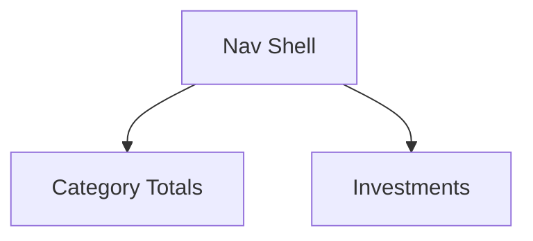

# Yearly Summary Tab Sub-Tab Redesign

## 1. Executive Summary

Yearly Summary Tab Sub-Tab Redesign reorganizes `Financial.CashFlow`'s Yearly Summary tab, which today stacks three separate tables — Category Totals, Investment Diffs, and Income Summary — on a single scrolling page sharing one year picker. It is used by the same single developer-maintainer that all prior CashFlow PRDs serve. The core value is legibility: today's page mixes spending-by-category, income, and investment-account tracking into one dense view, forcing the developer to scroll past unrelated tables just to check one figure.

At a high level, the page is split into two sub-tabs — **Category Totals** and **Investments** — sharing a single year picker that sits above the sub-tab row and applies to both. Category Totals merges the existing Income Summary and Category Totals tables into one combined table (Salary, Salary After Taxes, Tax Difference, Dividendo/Juros, all 14 expense categories, then two new derived rows — Resultado (R-D-Inv) and Total despesas), with a new Average column added next to the existing Yearly Total column on every row. Investments replaces the current diff-only account table with a table showing each account's full 12-month balance history, followed by a Total row and a new Month Result row, plus three new summary figures (Year Progress, Average Month Result, Sum of Month Results).

This is a UI-only reorganization. No entity, enum, or API endpoint changes are introduced — every figure the redesign shows either already exists in the three current API responses or is a simple sum/average computed client-side from data already fetched, following the same pattern this app already uses elsewhere for on-screen totals.

## 2. Problem and Opportunity

### The Problem

**The Yearly Summary page shows too much at once**
- A single page today renders 3 full tables (Category Totals, Investment Diffs, Income Summary) in one continuous scroll, with no separation between spending/income figures and investment-account figures
- There is no way to focus on one kind of yearly information without scrolling past the other two tables

**Income and category data are artificially split**
- Salary, Salary After Taxes, and Dividendo/Juros live in a separate "Income Summary" table below Category Totals, even though reviewing yearly financial results means looking at income and expenses together

**Key derived figures are missing, forcing manual calculation**
- There is no "Total despesas" row summing all categories per month, and no "Resultado" row showing the true monthly surplus after expenses — the developer must add these up by hand today
- There is no per-row Average column, so seeing a "typical month" value requires mentally dividing the Yearly Total by 12

**The investment table only shows differences, not balances**
- Each account row today shows only the January balance plus 11 month-over-month deltas — the actual monthly balance history per account isn't visible, and there's no month-over-month "Month Result" summary row or full-year progress figures

### The Opportunity

- Too much shown at once → the new sub-tab shell isolates Category Totals and Investments into separate views, so each visit shows only the relevant kind of yearly information
- Income and category data artificially split → the Category Totals sub-tab merges both into one table in a single fixed row order, so income and spending are reviewed together
- Missing derived figures → Total despesas, Resultado (R-D-Inv), and a per-row Average column are added, computed client-side from data the app already fetches, eliminating manual math
- Investment table only shows diffs → the Investments sub-tab shows each account's full monthly balance history plus a Total row, a Month Result row, and three new summary figures (Year Progress, Average Month Result, Sum of Month Results)

## 3. Target Audience

### Primary Users

**Personal Finance Developer-Maintainer**
- The sole user and maintainer of this self-hosted personal finance tool, already familiar with every category, account, and figure on today's Yearly Summary tab
- Reviews yearly totals periodically to check spending trends, income totals, and investment account progress across a full calendar year
- Values a simple, uncluttered layout over configurability — a single fixed row order and sub-tab order is preferable to any customization

## 4. Objectives

**Product Objectives**

- **Reduce** information density on each sub-tab so Category Totals and Investments each show only their own table, with no unrelated table competing for space.
  Metric: on a 1366×768 or larger viewport, each sub-tab's table is reachable without scrolling past the other sub-tab's content, down from all 3 tables sharing one continuous page today.

- **Eliminate** manual calculation of yearly derived figures by adding Total despesas, Resultado (R-D-Inv), a per-row Average column, and the three new investment summary figures (Year Progress, Average Month Result, Sum of Month Results) directly to the page.
  Metric: 100% of the derived figures listed above render correctly for every month/year combination with existing data, verified by unit tests on the computation functions.

- **Preserve** all existing figures and data without regression — every category, account, and income figure shown today remains available and numerically unchanged after the split.
  Metric: 100% of existing Yearly Summary test assertions pass once relocated to their respective sub-tab, with zero numeric regressions.

- **Maintain** year continuity across views so the developer never re-selects the year when moving between sub-tabs.
  Metric: switching sub-tabs never resets the year picker's value and never triggers a new data fetch, verified by an automated test asserting the picker's value and fetch count are unchanged across a tab switch.

## 5. User Stories

### F01. Yearly Summary Navigation Shell
- As the developer, I want a single year picker at the top of the Yearly Summary tab that applies to both sub-tabs so I never have to re-select the year when switching views
- As the developer, I want two clearly labeled sub-tabs — Category Totals, Investments — so I can focus on one kind of yearly information at a time
- As the developer, I want the Category Totals sub-tab selected by default whenever I open the Yearly Summary tab
- As the developer, I want switching sub-tabs to be instant and never reset my selected year or refetch data, so I can move between views without waiting

### F02. Category Totals Sub-Tab
- As the developer, I want Salary, Salary After Taxes, and the Tax Difference between them shown together at the top of the table so I can see gross vs. net income at a glance
- As the developer, I want Dividendo/Juros shown right after the salary rows so I see all my income sources together before the expense categories
- As the developer, I want every expense category's monthly totals in the same table as income, instead of a separate section, so I can compare income and spending without switching views
- As the developer, I want a Total despesas row so I can see total monthly spending across all categories without adding it up myself
- As the developer, I want a Resultado (R-D-Inv) row so I can see my true monthly disposable surplus after expenses, excluding money moved into investments
- As the developer, I want an Average column next to the Yearly Total column on every row so I can see a typical month's value at a glance without doing the division myself

### F03. Investments Sub-Tab
- As the developer, I want to see each investment/bank account's balance for every month of the year, not just January, so I can track how each account actually moved over the year
- As the developer, I want liability accounts (credit cards, personal reserve) clearly marked so I don't mistake them for assets when scanning the table
- As the developer, I want a Total row showing my net position (assets minus liabilities) for every month
- As the developer, I want a Month Result row showing how my net position changed from the previous month, so I can see at a glance which months improved or worsened my finances
- As the developer, I want to see my full-year progress (December's total vs. January's), my average monthly result, and the sum of all monthly results, so I can evaluate my overall investment performance for the year in one place

## 6. Functionalities

### F01. Yearly Summary Navigation Shell

**Provides:**
- Selected year for the currently viewed period (used by F02, F03)
- Active sub-tab identifier and tab-switching capability, so exactly one sub-tab's content is mounted/visible at a time (used by F02, F03)

**Capabilities:**
- Exactly 2 sub-tabs — Category Totals, Investments — in that fixed left-to-right order; no reordering or hiding
- One year selector (numeric input), rendered once, positioned above the sub-tab row; it is never duplicated per sub-tab
- Default active sub-tab on every entry to the Yearly Summary tab (initial load or navigating back from another CashFlow view) is Category Totals
- Switching the active sub-tab never triggers a data refetch and never resets the selected year — both sub-tabs render from the same already-fetched year data
- Changing the year never resets the active sub-tab back to Category Totals — the developer stays on whichever sub-tab they were viewing

**Experience:**
- Developer opens the Yearly Summary tab → sees the year picker at top, the two sub-tab buttons below it (Category Totals visually highlighted as active), and Category Totals content beneath
- Clicking "Investments" immediately swaps the visible content and highlights the clicked tab; no loading indicator appears if the underlying data is already loaded
- Changing the year value while on either sub-tab triggers the existing data refetch and loading state; once loaded, the currently active sub-tab reflects the new year without the developer needing to reselect it
- If data fails to load, the existing error/retry state displays regardless of which sub-tab is active, since data loading is shared across both

### F02. Category Totals Sub-Tab

**Consumes:**
- F01: selected year; active sub-tab state to know when Category Totals content should be visible

**Capabilities:**
- Single table with rows in this fixed order: Salary, Salary After Taxes, Tax Difference, Dividendo/Juros, then one row per `Category` enum value in declaration order (Ariana, Carro, Casa, Estudo, Extras, Familia, Gleison, Mercado, Samuel, Saude, Viagem, Dizimo, Investimento, Reserva), then Resultado (R-D-Inv), then Total despesas
- Each row has 12 month columns (Jan–Dec), followed by an Average column, followed by a Yearly Total column
- Salary = sum of Gleison + Ariana gross values per month (existing `SalaryMonthly`); Salary After Taxes = sum of Gleison + Ariana net values per month (existing `SalaryAfterTaxesMonthly`); Tax Difference = Salary − Salary After Taxes per month (existing `TaxDifferenceMonthly`); Dividendo/Juros = existing `DividendoJurosMonthly`
- The 14 category rows use the existing `CategoryYearlyTotalDTO.MonthlyTotals` per category, unchanged from today's values
- Total despesas[month] = sum of all 14 categories' `MonthlyTotals[month]` for that month, including Investimento and Reserva
- Resultado (R-D-Inv)[month] = `SalaryAfterTaxesMonthly[month] + DividendoJurosMonthly[month] − Total despesas[month] + Investimento.MonthlyTotals[month]` — i.e., net income minus every category except Investimento, since money moved into investing is not treated as a loss
- Average column, for every row without exception, = arithmetic mean of that row's 12 monthly values
- Yearly Total column: for rows sourced directly from the API (Salary, Salary After Taxes, Tax Difference, Dividendo/Juros, each category) uses the API's existing yearly total field; for the two new derived rows (Total despesas, Resultado) it is the sum of that row's 12 monthly values
- All monthly, average, and yearly-total figures use the existing 2-decimal numeric formatting (`formatN2`) used throughout the Yearly Summary tab today

**Experience:**
- On entering Category Totals (default, or via tab click), the combined table renders top-to-bottom in the fixed row order above, replacing today's separate Category Totals table and Income Summary table with one
- A visual separator (blank spacer row, matching today's existing spacer convention) appears between Dividendo/Juros and the first category row, and again before Resultado, so the four logical groups (income, categories, result, total) remain visually distinguishable without needing text labels
- Resultado and Total despesas rows are visually emphasized (bold), consistent with the existing yearly-total emphasis styling used elsewhere on this tab
- Loading and error states behave exactly as today, shared with F01

### F03. Investments Sub-Tab

**Consumes:**
- F01: selected year; active sub-tab state to know when Investments content should be visible

**Capabilities:**
- Table with one row per `InvestmentAccount` enum value (11 rows, declaration order: Blue Rewards Saver, Platinum Visa 8003, Platinum Visa 6007, Chase Master 4023, BA Amex, Paypal credit, Chip Cash ISA Gleison, Chase save, Chip Cash ISA Ariana, Trading 212 Invested, Reservas pessoais), each showing its full 12-month balance history using the existing `InvestmentAccountYearlyDiffDTO.MonthlyValues` array (all 12 entries, not just January as shown today)
- Liability accounts (`IsLiability = true`: Platinum Visa 8003, Platinum Visa 6007, Chase Master 4023, Paypal credit, Reservas pessoais) display a "(-)" suffix next to the account name, matching the source spreadsheet's own notation; asset accounts show no suffix
- A "Total" row follows the 11 account rows, showing the net position for each of the 12 months using the existing `NetPositionYearlyDiffDTO.MonthlyValues` (assets minus liabilities, already computed server-side)
- A "Month Result" row follows the Total row, showing the existing `NetPositionYearlyDiffDTO.MonthlyDiffs` (11 values, Feb through Dec month-over-month change of the Total row); the January column under Month Result is empty, since there is no prior month to diff against
- Three summary figures render below the table, in this order: Year Progress (existing `NetPositionYearlyDiffDTO.FullYearNetChange`, i.e. December's total minus January's), Average Month Result (arithmetic mean of the 11 Month Result values), Sum of Month Results (sum of the 11 Month Result values)
- Sum of Month Results is mathematically always equal to Year Progress (a telescoping sum of month-over-month changes equals the total change from January to December) — both are shown together as a built-in cross-check rather than removing the apparent redundancy
- All monthly and summary figures use the existing 2-decimal numeric formatting (`formatN2`) used throughout the Yearly Summary tab today

**Experience:**
- On clicking the Investments tab, the account table renders top-to-bottom: 11 account rows with full monthly balances, then the bold Total row, then the bold Month Result row
- The three summary figures (Year Progress, Average Month Result, Sum of Month Results) render as a small labeled block beneath the table, each with its own label and value
- Loading and error states behave exactly as today, shared with F01

## 7. Out of Scope

**Data and business logic**
- No changes to the `Category`, `InvestmentAccount`, or `IncomeSource` enums, or to any other CashFlow entity
- No changes to any Yearly Summary API endpoint or DTO — all three existing endpoints (`expense-categories`, `investment-diffs`, `income-summary`) remain unchanged; every new figure (Resultado, Total despesas, per-row Average, Month Result row reuse, Year Progress, Average/Sum of Month Results) is computed client-side from data already returned today
- No changes to how liability accounts are classified (`InvestmentAccountClassification`) or how net position is calculated server-side

**Layout and navigation**
- No new investment accounts, categories, or income sources beyond the 14 categories and 11 accounts confirmed against the current domain model
- No persistence of the active sub-tab across page reloads or navigation away from and back to the Yearly Summary tab — it always resets to Category Totals
- No URL-based deep-linking or bookmarking of a specific sub-tab
- No user-configurable row order, grouping, or column set — the fixed row order and column set defined in Section 6 are the only supported layout

**Other CashFlow views and other years' spreadsheets**
- No changes to the Monthly, Reserva, Controle Mãe, or any other CashFlow tab
- No accommodation for `Resumo/xxxx` spreadsheet years whose format or available data differs from `Resumo/2026` — this redesign targets the current app's data model, which already matches `Resumo/2026`'s structure

## 8. Dependency Graph

| # | Feature | Priority | Dependencies |
|---|---------|----------|--------------|
| F01 | Yearly Summary Navigation Shell | 1 | None |
| F02 | Category Totals Sub-Tab | 1 | F01 |
| F03 | Investments Sub-Tab | 1 | F01 |

### Execution Waves
Features within the same wave can be built in parallel. A wave starts only after every feature in earlier waves is complete.

- **Wave 1**: F01
- **Wave 2**: F02, F03

### Priority levels
- **1** = Essential — product does not work without it
- **2** = Important — significant value addition
- **3** = Desirable — incremental improvement

## 9. Acceptance Criteria

### F01. Yearly Summary Navigation Shell
- [ ] Opening the Yearly Summary tab shows the year picker, the two sub-tab buttons (Category Totals, Investments), and Category Totals content by default
- [ ] Exactly one sub-tab's content is visible/mounted at any time
- [ ] Clicking a sub-tab button switches the visible content and marks that button as active
- [ ] Switching sub-tabs does not change the year picker's value and does not trigger a new data fetch
- [ ] Changing the year value refetches data and updates the currently active sub-tab's content without changing which sub-tab is active
- [ ] If data loading fails, the error/retry state is shown regardless of the active sub-tab

### F02. Category Totals Sub-Tab
- [ ] The table renders rows in the fixed order: Salary, Salary After Taxes, Tax Difference, Dividendo/Juros, the 14 categories in enum order, Resultado (R-D-Inv), Total despesas
- [ ] Salary, Salary After Taxes, Tax Difference, Dividendo/Juros, and each category row's monthly and yearly-total values match the values shown before the redesign for the same year
- [ ] Total despesas for each month equals the sum of that month's 14 category values, including Investimento and Reserva
- [ ] Resultado (R-D-Inv) for each month equals Salary After Taxes + Dividendo/Juros − Total despesas + Investimento for that month
- [ ] Every row displays an Average column equal to the arithmetic mean of its 12 monthly values, positioned between the Dec column and the Yearly Total column
- [ ] Total despesas and Resultado rows render visually emphasized (bold), consistent with existing yearly-total styling

### F03. Investments Sub-Tab
- [ ] Each of the 11 account rows shows all 12 monthly balance values (not just January)
- [ ] Liability accounts (Platinum Visa 8003, Platinum Visa 6007, Chase Master 4023, Paypal credit, Reservas pessoais) display a "(-)" suffix; asset accounts do not
- [ ] The Total row's 12 monthly values match the existing net position values for the same year
- [ ] The Month Result row's 11 values (Feb–Dec) match the existing net position month-over-month diffs for the same year, and the Jan column under Month Result is empty
- [ ] Year Progress equals December's Total minus January's Total
- [ ] Average Month Result equals the arithmetic mean of the 11 Month Result values
- [ ] Sum of Month Results equals the sum of the 11 Month Result values, and is numerically equal to Year Progress

### Cross-Feature Integration
- [ ] Selecting a different year while Category Totals is active re-scopes the entire combined table, including Resultado and Total despesas, to the new year (F01 → F02)
- [ ] Selecting a different year while Investments is active re-scopes the account table, Total row, Month Result row, and the three summary figures to the new year (F01 → F03)
- [ ] Switching from Category Totals to Investments and back displays each sub-tab's content without re-triggering a network refetch, confirming the shared year from F01 is reused rather than reset (F01 → F02, F03)
- [ ] At every point in the flow, exactly one of Category Totals/Investments content is visible, confirming F01's active-tab state correctly gates F02 and F03 (F01 → F02, F03)
