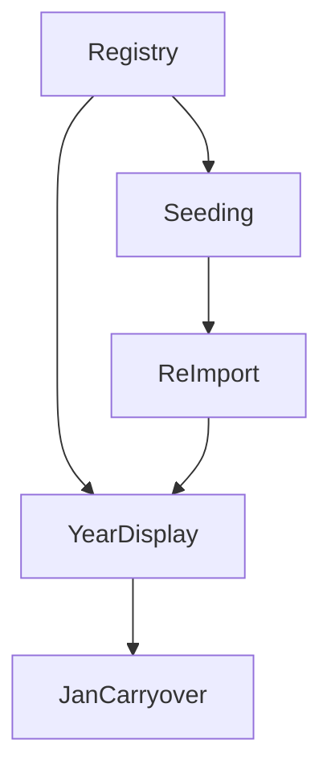

# Investment Account Lifecycle

## 1. Executive Summary

Investment Account Lifecycle is a data and calculation correctness fix for the Financial app's investment tracking, replacing a fixed, always-on list of 11 investment accounts with a persisted, data-driven account registry that knows which accounts existed in which years. It is built for the single household user of this personal finance tool, who has tracked income, expenses, and investment/savings balances in a spreadsheet since 2017 and expects the app's historical views to match reality for every year, not just the current one.

Today, the app's `InvestmentAccount` list is a fixed 11-value enum, and every year from 2017 through 2026 shows exactly those same 11 accounts — including accounts that did not open until 2025 or 2026, while silently omitting 8 real accounts that existed in earlier years and were never even importable from the source spreadsheet. This feature replaces the enum with a persisted registry carrying an active/disabled status per account, reworks the spreadsheet import to recognize historical account labels, backfills eight years of previously-inaccessible balance history, and updates every year-scoped view (Investment Snapshots page, Yearly Summary Investments sub-tab) to show only the accounts that genuinely existed in the selected year. It also fixes the Yearly Summary's January "Month Result," which today is always blank, by carrying over the prior year's December balance.

At a high level: a one-time migration seeds the new registry with all 19 known accounts (11 currently active, 8 historical/disabled) and their known spreadsheet label variants, a reworked importer resolves rows dynamically against that registry instead of a hardcoded list, a full re-import of the source spreadsheet (2017-2026) populates real historical values for the newly-recognized accounts, and the display and yearly-diff logic are updated to be year-aware.

## 2. Problem and Opportunity

**The Problem**

- **Inaccurate historical account representation** — Every year from 2017-2025 currently displays the same fixed 11 accounts that only became the true list in 2026. For example, 2023's Investment Snapshots wrongly include accounts like "BA Amex," "Trading 212 Invested," and "Reservas Pessoais" that did not open until 2025 or 2026, while omitting 8 accounts that genuinely existed during some or all of that period.
- **Unimportable historical data** — The spreadsheet importer only recognizes the current 11 account labels. 8 real historical accounts, covering up to 8 years of balance history (2017-2024), have never been captured in the app at all; importing older Resumo sheets silently drops those rows with no error or warning.
- **Misleading Yearly Summary totals** — Because closed/historical accounts are invisible and phantom "future" accounts show zero-value rows for years before they existed, the Yearly Summary Investments sub-tab's net position and per-account totals for any year other than 2026 do not reflect the user's real financial position in that year.
- **Broken monthly change tracking for January** — The "Month Result" row in the Yearly Summary Investments sub-tab always shows a blank cell for January, every year, because the diff calculation has no way to reference the prior year's December balance — masking the real month-over-month change for the first month of every year.

**The Opportunity**

- A persisted, data-driven investment account registry (replacing the fixed enum) lets each account carry an active/disabled status, so year-scoped display logic can show exactly the accounts that existed in a given year, solving the historical representation problem directly.
- Reworking the importer to resolve against the registry's label aliases makes every historical account label already present in the source spreadsheet since 2017 importable, and a one-time full re-import recovers 8 years of previously-inaccessible balance history.
- Year-scoped display, driven by real imported presence data rather than a hardcoded list, makes every year's Investments sub-tab and Investment Snapshots page accurately reflect what accounts existed that year, fixing the misleading totals.
- Extending the diff calculation to look up the prior year's December net position gives January a real Month Result for every year except the earliest tracked year (2017), where none exists to reference.

## 3. Target Audience

### Primary Users

**The Household Financial Tracker (Gleison)**
- Maintains a 10-year personal/household spreadsheet (`Despesas.xlsx`) of income, expenses, and investment/savings account balances, and has migrated this tracking into the Financial app.
- Needs the app's historical views (Yearly Summary, Investment Snapshots) to match the true state of his accounts in each year, not just today's account list, since he reviews multi-year trends and does not want to manually cross-reference the spreadsheet to sanity-check numbers.
- Periodically opens or closes real bank/investment accounts (roughly once a year) and expects the app to be extended for this via a small one-off backfill, not a self-service UI, consistent with how this personal project already handles rare structural changes.

## 4. Objectives

**Product Objectives**
1. **Eliminate** the misrepresentation of investment accounts in historical years by making account existence year-scoped instead of globally fixed.
2. **Recover** previously unimportable historical account balance data by reworking the spreadsheet import to resolve dynamically against a full account registry.
3. **Preserve** all currently-recorded investment snapshot data unchanged in value while migrating its underlying account reference from enum to registry entity.
4. **Correct** the January Month Result gap in the Yearly Summary by carrying over the prior year's December net position.

**Success Metrics**
1. For objective 1: 100% of the 8 confirmed historical accounts (Everyday Saver, Instant ISA Issue 1, Ariana ISA, Barclays Blue Rewards, Help to Buy ISA GGS, Help to Buy ISA AACS, Chip Easy access, Chip Easy access Ariana) are hidden from the Yearly Summary Investments sub-tab and Investment Snapshots page for every year outside their confirmed active range, verified by manual review of each year 2017-2026 after the migration runs.
2. For objective 2: The full 2017-2026 re-import completes with 0 unmatched investment account rows across all 10 Resumo sheets (Resumo2017-Resumo2026), measured by the migration command's completion log.
3. For objective 3: 100% of pre-migration InvestmentSnapshot values are identical (same year, month, account, value) after the registry migration, measured by comparing a pre-migration and post-migration export of the CashFlow JSON data store for the 11 currently-active accounts.
4. For objective 4: Every year from 2018-2026 (9 years) shows a non-blank January Month Result value in the Yearly Summary Investments sub-tab, equal to January's net position minus the prior year's December net position; only 2017 remains blank.

## 5. User Stories

### F01. Investment Account Registry
- As the system, I want to store each investment account as a persisted registry entry with a name, active status, and liability flag so that account existence is no longer limited to a fixed enum
- As the system, I want to migrate every existing InvestmentSnapshot's account reference from the retired enum value to the corresponding registry entry so that no previously recorded balance data is lost or altered

### F02. Historical Account Seeding and Import Alias Resolution
- As the system, I want the registry seeded with all 19 known investment accounts (11 active, 8 historical/disabled) including their known label variants so that every account name ever used in the source spreadsheet can be resolved
- As the system, I want the spreadsheet importer to resolve each Resumo sheet's account row against the registry's aliases instead of a fixed alias dictionary so that historical account labels are recognized

### F03. Full Historical Re-Import (2017-2026)
- As the system, I want to re-run the spreadsheet import across every Resumo2017-Resumo2026 sheet so that historical balance values for newly-recognized accounts are populated
- As the system, I want to write an explicit snapshot value (0 if the source cell is blank) for every month of a matched account-year so that an account's existence in a given year can be determined purely from persisted snapshot data afterward

### F04. Year-Scoped Investment Account Display
- As a user, I want the Investment Snapshots page for a past year to show only the accounts that existed that year so that I don't see accounts that hadn't been opened yet or had already closed
- As a user, I want the Yearly Summary Investments sub-tab for a past year to show only the accounts that existed that year so that the net position total reflects my real accounts for that year
- As a user, I want the current, in-progress year to keep showing all active accounts immediately, even before that year's spreadsheet has been imported, so that I can keep manually tracking balances month by month as I do today

### F05. Prior-Year December Carryover for January
- As a user, I want January's Month Result in the Yearly Summary Investments sub-tab to show the change from the prior year's December net position so that I can see my real month-over-month change for the first month of the year
- As a user, I want the earliest year tracked by the app (2017) to keep showing a blank January Month Result so that the app doesn't fabricate a change against a year it has no data for

## 6. Functionalities

### F01. Investment Account Registry

**Provides:**
- Investment account registry entries (id, name, active status, liability flag) (used by F02, F04)

**Capabilities:**
- Registry entry fields: internal Id (Guid), Name (the canonical display label, e.g. "Chip Cash ISA Gleison"), IsActive (bool), IsLiability (bool).
- The retired `InvestmentAccount` enum's 11 members map one-to-one to 11 new registry entries with IsActive = true, preserving each account's current IsLiability value from `InvestmentAccountClassification` unchanged (including any pre-existing misclassification, which this PRD does not correct).
- Every existing persisted `InvestmentSnapshot` record (all years, all months, all 11 currently-active accounts) is migrated in place to reference its corresponding registry entry by Id, with Year, Month, and Value fields unchanged.
- Migration runs once, as a dedicated one-off command matching the existing `BankMigrator`/`IncomeBackfillImporter` pattern, and is idempotent: running it again when the registry already exists performs no changes.

**Experience:**
- This feature has no direct UI; it is a backend data-model change plus a one-time migration.
- On first run, the migration logs a summary (accounts created, snapshots migrated) to the console/application log, consistent with existing migration tooling output.

**Error Handling:**
- If the migration finds an `InvestmentSnapshot` record referencing an enum value with no corresponding seeded registry entry (not expected, since F02 seeds all 19 known historical names), it logs a clear error identifying the orphaned value, year, and month, and aborts without partially migrating, so no data is silently dropped.
- If the migration is interrupted mid-run, the JSON data store is left in its pre-migration state (the full migration is computed in memory before any write, following the existing repository's whole-file write pattern), so a retry starts clean.
- If the migration is run a second time after already completing successfully, it detects the registry already exists and exits without modifying data, logging that migration was already applied.

### F02. Historical Account Seeding and Import Alias Resolution

**Consumes:**
- F01: investment account registry entries to seed and extend with aliases

**Provides:**
- Seeded registry of 19 accounts with import label aliases, and an alias-resolving lookup for the importer (used by F03)

**Capabilities:**
- Seeds 8 additional registry entries, all with IsActive = false and IsLiability = false: Everyday Saver, Instant ISA Issue 1, Ariana ISA, Barclays Blue Rewards, Help to Buy ISA GGS, Help to Buy ISA AACS, Chip Easy access, Chip Easy access Ariana.
- Each registry entry carries one or more import label aliases, extending the existing normalized (whitespace-collapsed, case-insensitive) matching approach:
  - Instant ISA Issue 1: aliases "Instant ISA Issue 1" and "Instant ISE Issue 1" (2017 spreadsheet typo).
  - Chip Cash ISA Gleison (existing active entry): aliases extended to include "Chip Cash ISA Gleison" and "Chip Cash ISA" (2024 spreadsheet label, same account).
  - All other 17 accounts: a single alias matching their canonical spreadsheet label exactly (e.g. "Everyday Saver," "Barclays Blue Rewards," "Help to Buy ISA GGS").
- `ResumoValidationReader` is reworked to build its row-label-to-account lookup dynamically from the registry's aliases at import time, instead of the static `AccountLabelAliases` dictionary keyed by the retired enum.
- Rows whose label matches no registry alias continue to be skipped, unchanged from current behavior.

**Experience:**
- No direct UI; this is an internal import-engine capability consumed by F03's migration run.
- When the import encounters a row label that doesn't match any registry alias, it is skipped silently as it is today.

### F03. Full Historical Re-Import (2017-2026)

**Consumes:**
- F02: seeded registry with import aliases, and the alias-resolving importer

**Provides:**
- Complete investment snapshot data (explicit, per-month values) for 2017-2026 across all 19 accounts (used by F04)

**Capabilities:**
- One-time migration command that reads `C:\Users\ggibe\Downloads\Despesas.xlsx` and processes Resumo2017 through Resumo2026 (10 sheets) using F02's importer.
- For each sheet, for every account whose label matches a registry alias, writes an `InvestmentSnapshot` for all 12 months of that year, using 0 for any month whose source cell is blank — a change from current behavior, which only wrote a snapshot for non-blank cells.
- Applies the existing liability sign-inversion rule unchanged (IsLiability accounts have their imported value negated).
- Re-running the command is idempotent: matched values overwrite any existing snapshot for the same account/year/month with the spreadsheet's current value, treating the spreadsheet as the source of truth.

**Experience:**
- No direct UI; invoked the same way as existing one-off migration tools (command-line entry point).
- On completion, logs a per-year summary: sheet name, accounts matched, accounts unmatched (expected to be 0 per objective 2's success metric), total snapshots written.

**Error Handling:**
- If `Despesas.xlsx` is not found at the expected path, the command fails immediately with a clear "source file not found" message and performs no writes.
- If a `Resumo{Year}` sheet is missing entirely for a year in the 2017-2026 range, the command logs a warning for that year and continues processing the remaining sheets rather than aborting the whole run.
- If a matched account row contains a malformed (non-numeric, non-blank) cell in a given month, the command logs the specific cell reference and skips writing a snapshot for that single month only, continuing with the rest of the row.
- If the command is interrupted mid-run, snapshots already written for completed sheets remain persisted (each sheet's writes commit independently), so a re-run only needs to reprocess incomplete years; because writes are idempotent, this is safe.

### F04. Year-Scoped Investment Account Display

**Consumes:**
- F01: registry entries with active status
- F03: complete per-year snapshot data

**Provides:**
- Year-filtered account list and per-account net position values, queryable per year (used by F05)

**Capabilities:**
- For any year strictly before the current calendar year, an account is included in that year's display if and only if it has at least one persisted `InvestmentSnapshot` for that year (any month) — this reliably reflects true existence since F03 guarantees full-month coverage for matched account-years.
- For the current, in-progress calendar year, every registry account with IsActive = true is included, regardless of whether any snapshot exists yet for that year, preserving today's workflow of starting a new month with a blank zero row.
- Applies identically to both the Investment Snapshots page (monthly manual entry) and the Yearly Summary Investments sub-tab.
- Disabled (IsActive = false) accounts never appear for the current year, even though the same underlying store still holds their historical data from a prior active period.

**Experience:**
- On the Investment Snapshots page, selecting a past year shows rows only for accounts that existed that year; selecting the current year shows all 11 active accounts as it does today.
- On the Yearly Summary Investments sub-tab, the account rows and the Total/Net Position row for a selected past year include only accounts present in that year's filtered list; totals are computed only over the accounts shown.
- No visual indicator distinguishes "hidden because disabled" from "never existed" — both simply don't render a row for that year, per the confirmed decision to hide disabled accounts entirely rather than show a closed/disabled badge.

### F05. Prior-Year December Carryover for January

**Consumes:**
- F04: year-filtered account list and net position values, for the selected year and the prior year

**Capabilities:**
- `YearlySummaryService.GetInvestmentDiffsForYear(year)` is updated so `MonthlyDiffs` for January is computed as January's net position in `year` minus December's net position in `year - 1`, for both the aggregate `NetPositionYearlyDiffDTO` and each per-account `InvestmentAccountYearlyDiffDTO`.
- February-December diffs are unchanged (each month minus the prior month within the same year).
- For year 2017 (the app's earliest tracked year, with no prior year of data at all), January's diff remains null/blank, unchanged from today's behavior.
- For an account that is active in `year` but did not exist in `year - 1` (e.g., an account opened partway through history), December's net position for `year - 1` is treated as 0 for that account's January diff, so a newly-opened account's first January correctly shows its full opening balance as the change.
- This explicitly supersedes the P16-F03 acceptance criterion stating January's Month Result is intentionally blank; that acceptance criterion is amended by this PRD.

**Experience:**
- The Yearly Summary Investments sub-tab's "Month Result" row shows a real, non-blank value in the January column for every year from 2018 onward, formatted identically to the other 11 months (same currency formatting, same color coding for positive/negative).
- For year 2017, the January cell in "Month Result" remains blank, matching today's rendering for that one case.
- `YearlySummaryPage.tsx` no longer hardcodes `null` for the January position in the `monthlyValues` array passed to `InvestmentRow`; it renders whatever the API returns for that month.

## 7. Out of Scope

**Account Management**
- No screen for users to add, rename, or toggle active/disabled status on investment accounts. All account registry changes (new accounts, closures) are handled via one-off migration/code changes, consistent with the project's personal-project scope.

**Historical Range**
- `Despesas.xlsx` contains Resumo sheets back to 2014, but the app's tracked range remains 2017 onward; sheets from 2014-2016 are not imported or represented.

**Liability Classification Corrections**
- Any pre-existing inaccuracy in which of the 11 active accounts are flagged as liabilities (e.g., BA Amex not currently included in the liability set) carries over unchanged; this PRD does not audit or correct that classification.

**Account Grouping**
- No new capability to group accounts by bank/institution or currency; the flat account list structure is preserved, just made data-driven and year-aware.

**Other Yearly Summary Data**
- The Category and IncomeSource enums, and their historical representation, are unaffected. The Category Totals and Historical Averages sub-tabs (P16-F02, P17) are not modified by this PRD.

## 8. Dependency Graph

| # | Feature | Priority | Dependencies |
|---|---------|----------|--------------|
| F01 | Investment Account Registry | 1 | None |
| F02 | Historical Account Seeding and Import Alias Resolution | 1 | F01 |
| F03 | Full Historical Re-Import (2017-2026) | 1 | F02 |
| F04 | Year-Scoped Investment Account Display | 1 | F01, F03 |
| F05 | Prior-Year December Carryover for January | 1 | F04 |

### Execution Waves
Features within the same wave can be built in parallel. A wave starts only after every feature in earlier waves is complete.

- **Wave 1**: F01
- **Wave 2**: F02
- **Wave 3**: F03
- **Wave 4**: F04
- **Wave 5**: F05

### Priority levels
- **1** = Essential — product does not work without it
- **2** = Important — significant value addition
- **3** = Desirable — incremental improvement

## 9. Acceptance Criteria

### F01. Investment Account Registry
- [x] All 11 currently-active `InvestmentAccount` enum values have a corresponding registry entry with IsActive = true and the correct IsLiability value carried over from `InvestmentAccountClassification`
- [x] Every `InvestmentSnapshot` record present before migration (all years, months, accounts) exists after migration with identical Year, Month, and Value, now referencing its account by registry Id
- [x] Running the migration a second time makes no further changes and logs that migration was already applied
- [ ] If an unmigrated enum value with no seeded registry entry is encountered, the migration aborts without partial writes and logs the specific value, year, and month

### F02. Historical Account Seeding and Import Alias Resolution
- [x] The registry contains exactly 19 entries after seeding: 11 with IsActive = true and 8 with IsActive = false (Everyday Saver, Instant ISA Issue 1, Ariana ISA, Barclays Blue Rewards, Help to Buy ISA GGS, Help to Buy ISA AACS, Chip Easy access, Chip Easy access Ariana)
- [x] A Resumo sheet row labeled "Instant ISE Issue 1" resolves to the same registry entry as a row labeled "Instant ISA Issue 1"
- [x] A Resumo sheet row labeled "Chip Cash ISA" resolves to the same registry entry as "Chip Cash ISA Gleison"
- [x] A row label matching no registry alias is skipped, with no snapshot written and no error raised

### F03. Full Historical Re-Import (2017-2026)
- [ ] After running the migration, every one of the 10 Resumo2017-Resumo2026 sheets reports 0 unmatched account rows
- [ ] For every matched account-year, exactly 12 `InvestmentSnapshot` records exist (one per month), with a value of 0 for any month whose source cell was blank
- [ ] Liability accounts' imported values are negated, matching the existing sign-inversion rule
- [ ] Running the command twice in a row produces the same final snapshot values, with the second run overwriting rather than duplicating
- [ ] If `Despesas.xlsx` is not found at the expected path, the command fails immediately with no snapshots written

### F04. Year-Scoped Investment Account Display
- [ ] For year 2023, the Investment Snapshots page and the Yearly Summary Investments sub-tab show exactly the accounts confirmed present in Resumo2023 (Everyday Saver, Blue Rewards Saver, Platinum Visa 8003, Platinum Visa 6007, Paypal Credit, Help to Buy ISA GGS, Help to Buy ISA AACS, Chip Easy access, Chase Save) and no others
- [ ] For the current calendar year, all 11 active registry accounts appear immediately, including any month with no snapshot yet (shown as zero), regardless of import status
- [ ] A disabled account with historical data (e.g., Everyday Saver) does not appear in the current year's display
- [ ] The Yearly Summary Investments sub-tab's Total/Net Position row for a past year sums only the accounts shown for that year

### F05. Prior-Year December Carryover for January
- [ ] For year 2024, January's Month Result equals January 2024's net position minus December 2023's net position
- [ ] For year 2017, January's Month Result remains blank
- [ ] For an account that opened partway through history (e.g., Trading 212 Invested, first active 2026), its January diff for the year it opened treats the prior year's December value as 0
- [ ] February-December Month Result values for every year are unchanged from current behavior

### Cross-Feature Integration
- [x] Registry entries created by F01 are correctly consumed by F02 when seeding the 8 historical accounts and their aliases
- [ ] The seeded registry and alias-resolving importer produced by F02 are what F03's full re-import invokes across all 10 Resumo sheets
- [ ] Snapshot data written by F03, together with F01's active-status flag, is what F04 queries to determine year-scoped account existence
- [ ] The year-filtered account list and net position values produced by F04 are exactly what F05 consumes for its January diff calculation
