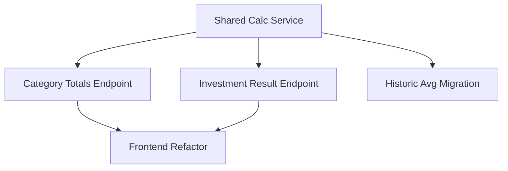

# Annual Summary Category Totals & Investment Annual Result Server-Side Computation

## 1. Executive Summary

This is a targeted architecture correction to the Annual Summary page of the Financial personal finance tool. Today, the Category Totals tab computes two genuine business rules — "Total despesas" (total expenses) and "Resultado (R-D-Inv)" (the year's net result) — inside a React hook in the Presentation layer, and assembles the tab's data from three separate backend calls. This product change moves that computation into the Application and Domain layers, behind two purpose-specific endpoints, so the frontend becomes a pure renderer of server-computed values with zero business logic.

For whom: the single user (owner) of this self-hosted personal finance application, and future-maintainer-self reading the codebase.

Core value: architectural correctness, consistency, and a single canonical implementation of shared arithmetic. The Historic Summary Average sub-tab, added previously (P17), already implements the target "build pieces, then merge" server-aggregation pattern — but its own average and Resultado (R-D-Inv) arithmetic is reimplemented locally in `AnnualSummaryService`, disconnected from any shared component. This change introduces two Domain-layer building blocks — a `MonthlySeries` value object (monthly summing, averaging, and diffing) and an `AnnualResultCalculator` (the Resultado formula) — that together become the single source of truth for these calculations, consumed by all three annual-summary computations, including a migrated Historic Summary Average. While auditing the two existing implementations of "Resultado (R-D-Inv)" for this consolidation, a real discrepancy was found: the Historic Summary Average's server-side formula omits the Dividendo/Juros term that the not-yet-migrated client-side formula includes. This PRD treats the Historic Summary Average's formula as the correct one and standardizes on it everywhere, intentionally changing the Category Totals tab's Resultado values to match.

At a high level: the three existing endpoints (`expense-categories`, `investment-diffs`, `income-summary`) are replaced by two new purpose-specific endpoints — `GET /annual-summary/{year}/category-totals` (category totals, income summary, and the computed Total despesas/Resultado figures) and `GET /annual-summary/{year}/investment-annual-result` (per-account investment diffs and net position, renamed from `investment-diffs` to reflect that it already returns computed results, not raw diffs). Combined with the untouched-in-contract `historic-summary-averages` endpoint, the Annual Summary page ends up with exactly three APIs. The frontend hook drops its client-side `useMemo` computations entirely and simply reads the values the backend already computed.

## 2. Problem and Opportunity

**The Problem**

- **Business logic in the wrong layer.** `useAnnualSummary.ts` (a React hook, Presentation layer) computes `Total despesas` and `Resultado (R-D-Inv)` — real financial business rules — directly in TypeScript. CLAUDE.md's Clean Architecture rules are explicit that the Presentation layer must not contain business logic, and today it does.
- **No single source of truth for a core domain concept — and it has already drifted.** "Resultado" is a fundamental figure in this application's financial model, yet it is independently implemented twice in two different languages: `AnnualSummaryService.AddCategoryTotal` (C#, powering Historic Summary Average) computes `salaryAfterTaxes - totalCategory + investmentCategory`, while `useAnnualSummary.ts` (TypeScript, powering Category Totals) computes `salaryAfterTaxes + dividendoJuros - totalDespesas + investimento`. These two implementations of the same-named figure disagree by the Dividendo/Juros term — concrete proof that duplicated business rules drift apart over time.
- **Unnecessary network chattiness.** Loading the Annual Summary page fires 4 parallel HTTP requests for a single page view (`expense-categories`, `investment-diffs`, `income-summary`, `historic-summary-averages`), when the data these represent could be assembled server-side and returned in fewer, purpose-aligned round trips.
- **Inconsistent pattern within the same page.** The same page mixes two different architectures: the Historic Summary Average tab does correct server-side aggregation (with its own duplicated formula), while the Category Totals and Investments tabs do client-side aggregation from raw per-category/per-account data. A maintainer reading this codebase has no single pattern, and no single formula, to trust.

**The Opportunity**

- Introducing two complementary Domain-layer building blocks — `MonthlySeries` (Financial.CashFlow.Domain.ValueObjects), an immutable 12-month value object owning summing/averaging/diffing, and `AnnualResultCalculator` (Financial.CashFlow.Domain.Rules), owning the Resultado formula — resolves the layering violation and the drift problem in one move: together they become the single place this arithmetic is implemented, called by every Application-layer method that needs it.
- This consolidation is also the natural point to fix the discovered discrepancy: the Historic Summary Average's formula (without Dividendo/Juros) is adopted as the one correct formula everywhere, including the newly server-computed Category Totals tab.
- Splitting the non-historic data into two endpoints — `category-totals` and `investment-annual-result` — rather than one mega-combined endpoint keeps each endpoint aligned 1:1 with the tab that consumes it, matching the existing `historic-summary-averages` endpoint's shape and making each independently testable, while still cutting page-load requests from 4 to 3.
- Renaming `investment-diffs` to `investment-annual-result` corrects a naming mismatch: the endpoint has always returned computed results (`AverageMonthResult`, `SumOfMonthResults`, `FullYearNetChange`), not just raw diffs.
- Because the three old endpoints have exactly one consumer each (`useAnnualSummary`, confirmed with no other callers in the codebase), they can be removed outright rather than deprecated — avoiding unused code without any compatibility risk, consistent with this being a single-installer personal project (per CLAUDE.md) rather than a multi-consumer API.

## 3. Target Audience

### Primary Users

**Personal Finance Tool Owner**
- The sole user of this self-hosted application, reviewing their own annual income, expenses, and investment activity.
- Cares that the numbers displayed (Total despesas, Resultado) are correct and consistent across every tab that shows them — including the corrected Resultado value on Category Totals.
- Not directly affected by this change's internal architecture — the Category Totals and Investments tabs must look and behave identically after the refactor, except for the intentionally corrected Resultado figure.

**Maintainer (future self)**
- Returns to this codebase periodically to add features or fix bugs, referencing CLAUDE.md's Clean Architecture rules.
- Needs the Resultado/Total despesas/average formulas to live in exactly one, correctly-layered place, so that future changes to any of these formulas require touching exactly one Domain-layer component instead of hunting through multiple services and a React hook.
- Benefits from the Category Totals and Investments endpoints following the exact same "combine-and-compute-server-side" pattern already established (and now internally correct) by Historic Summary Average, reducing the number of distinct patterns to remember.

## 4. Objectives

**Product Objectives**

- **Relocate** Total despesas and Resultado (R-D-Inv) computation from the Presentation layer (`useAnnualSummary.ts`) into the Application and Domain layers.
- **Centralize** the Resultado formula, monthly averaging, and monthly-diff sequencing into shared Domain-layer building blocks (`AnnualResultCalculator` for Resultado, `MonthlySeries` for averaging and diffing), consumed by the Category Totals, Investment Annual Result, and Historic Summary Average computations.
- **Correct** the Resultado (R-D-Inv) formula so that exactly one definition exists everywhere — the Historic Summary Average's existing formula (no Dividendo/Juros term) — resolving the drift found between it and the client-side formula.
- **Split** the page's non-historic data sources into two purpose-specific endpoints — `category-totals` and `investment-annual-result` — replacing the three prior single-purpose endpoints (`expense-categories`, `investment-diffs`, `income-summary`).
- **Preserve** the Category Totals and Investments tabs' visible output exactly — same rows, same values, same formatting — with the single intentional exception of the Category Totals tab's Resultado (R-D-Inv) row, whose values change to reflect the corrected formula.
- **Match** the "build pieces, then merge" architectural pattern already established by Historic Summary Average, applying it consistently across all three Annual Summary endpoints.

**Success Metrics**

- Zero occurrences of Total despesas/Resultado arithmetic in `useAnnualSummary.ts` or `AnnualSummaryPage.tsx`, verified by code review after the refactor.
- Exactly one implementation of the Resultado (R-D-Inv) formula exists in the C# codebase (in `AnnualResultCalculator`), called from both the Category Totals and Historic Summary Average code paths, verified by code review.
- Loading the Annual Summary page for a given year issues exactly 3 HTTP requests (`category-totals`, `investment-annual-result`, `historic-summary-averages`), down from 4, verified via network inspection or a hook-level test asserting call count.
- `GET /annual-summary/{year}/expense-categories`, `/investment-diffs`, and `/income-summary` return 404 (routes no longer exist) after the refactor.
- The Investments tab's and Historic Summary Average tab's values for a fixed test year are byte-identical (to two decimal places) to their pre-refactor values. The Category Totals tab's values are byte-identical for every row except Resultado (R-D-Inv), whose new values reflect the corrected (Dividendo/Juros-excluded) formula, verified by comparing rendered output before and after the change.

## 5. User Stories

### F01. Shared Annual Calculation Domain Service
- As the system, I want one Domain-layer component that computes the Resultado (R-D-Inv) formula so that this business rule has exactly one implementation instead of being reimplemented per endpoint.
- As the system, I want a shared value object to compute monthly averages (with rounding and elapsed-month handling) and monthly-diff sequences so that any annual-summary computation needing these operations reuses identical, tested arithmetic.
- As a maintainer, I want the Category Totals, Investment Annual Result, and Historic Summary Average computations to all call this one component so that a future change to any of these formulas requires editing exactly one place.

### F02. Category Totals Endpoint (Server-Side Computation)
- As the system, I want to compute category totals, income summary, Total despesas, and Resultado (R-D-Inv) for a given year and return them from one endpoint so that the Category Totals tab has a single, correctly-layered data source.
- As the system, I want the Resultado (R-D-Inv) figure to use the corrected, shared formula (no Dividendo/Juros term) so that it matches the value the Historic Summary Average tab has always shown for the equivalent figure.
- As a maintainer, I want the old `expense-categories` and `income-summary` endpoints removed once this endpoint exists so that there is exactly one backend entry point for the Category Totals tab.

### F03. Investment Annual Result Endpoint (Server-Side Computation)
- As the system, I want to compute each investment account's monthly values and diffs, plus the combined net position's monthly diffs, full-year net change, average month result, and sum of month results for a given year, so that the Investments tab has a single data source that already reflects computed results.
- As a maintainer, I want this endpoint named `investment-annual-result` so that its name reflects that it returns computed results, not raw diffs, and I want the old `investment-diffs` endpoint removed once this endpoint exists.

### F04. Historic Summary Average Migration to Shared Calculation Service
- As the system, I want the Historic Summary Average computation to call the shared `AnnualResultCalculator` for its Resultado (R-D-Inv) and monthly-average arithmetic instead of its own locally duplicated logic, so that this formula is not implemented twice in the codebase.
- As a maintainer, I want this migration to produce output identical to the pre-migration implementation (same route, same response shape, same values) so that the Historic Summary Average tab is completely unaffected by this internal refactor.

### F05. Category Totals & Investments Tabs Consume New Endpoints
- As a user, I want the Category Totals and Investments tabs to load from their own dedicated endpoints so that the page loads with fewer round trips and each tab's data source is easy to reason about.
- As a user, I want the Resultado (R-D-Inv) and Total despesas rows to display the exact values computed by the backend, using the corrected formula, so that this figure is finally consistent with the equivalent figure on the Historic Summary Average tab.
- As a maintainer, I want the frontend hook to store and expose both responses without recomputing any business logic so that the Total despesas/Resultado/average formulas exist in exactly one place going forward.

## 6. Functionalities

### F01. Shared Annual Calculation Domain Service

**Capabilities:**
- New static Domain-layer component `AnnualResultCalculator` in `Financial.CashFlow.Domain.Rules`, alongside the existing `YearScopedInvestmentAccountResolver`, containing no framework or database code, per CLAUDE.md's Domain layer rules.
- `ComputeResultado(salaryAfterTaxes, totalDespesas, investimentoCategoryValue)` returns `salaryAfterTaxes - totalDespesas + investimentoCategoryValue` — the corrected formula, with no Dividendo/Juros term, matching today's Historic Summary Average implementation exactly. A second overload, `ComputeResultado(MonthlySeries salaryAfterTaxes, MonthlySeries totalDespesas, MonthlySeries investimento)`, applies the same formula element-wise across a 12-month series for a future per-month Resultado (e.g. F02's `resultadoMonthly`).
- New immutable Domain-layer value object `MonthlySeries` in `Financial.CashFlow.Domain.ValueObjects`, wrapping a 12-element decimal series (January = index 0). `Average(monthsElapsed, decimalPlaces)` returns `Math.Round(Sum() / monthsElapsed, decimalPlaces)` — the same rounding and division behavior currently inlined in `GetAnnualAverageIncomeByGroupIncome`/`NumberOfMonthsForAverage`, now reusable. `DiffsFrom(priorClosingValue)` returns a 12-element sequence of month-over-month diffs, with the first element computed against `priorClosingValue` (nullable) — the same behavior currently inlined as `ComputeDiffs` in `AnnualSummaryService.GetInvestmentDiffsForYear`. `Sum()` and `Add(other)` support building totals (e.g. Total despesas, net position) from per-category/per-account series.
- Both components expose pure functions/methods: given the same inputs, they return the same outputs, with no repository access and no year-scoping or account-resolution policy — those business policies (which months count as "elapsed," which accounts apply to a year) remain in the calling Application-layer service methods, which pass already-resolved values in.
- Consumed internally by F02, F03, and F04's Application-layer service methods; has no HTTP surface of its own.
- *Related, out of P19's original scope but delivered alongside this work:* Domain-layer income/expense classification — `IncomeGroup` enum (`Salary`/`DividendoJuros`/`NonReportable`), `IncomeClassifier`/`CategoryClassifier` in `Rules`, exposed as computed `Income.Group`/`Expense.IsInvestment` properties. `GetIncomeSummaryForYear` already uses `income.Group`; F02's future implementation should reuse it (and `category.IsInvestment()`) rather than re-deriving salary/dividend/non-reportable grouping or Investimento detection.

**Experience:**
- This is a backend-only, system-facing capability with no direct UI. Its "experience" is a correctness guarantee: any two annual-summary computations that need the same arithmetic (a monthly average, a Resultado figure, a diff sequence) produce identical results because they call the same function, not two independently maintained copies.

### F02. Category Totals Endpoint (Server-Side Computation)

**Provides:**
- Category totals (per-category monthly totals across all 14 categories), income summary (Salary, Salary after taxes, Tax difference, Dividendo/Juros monthly figures), Total despesas (monthly array of 12 values plus annual total), and Resultado R-D-Inv (monthly array of 12 values plus annual total) (used by F05)

**Capabilities:**
- New endpoint `GET /annual-summary/{year}/category-totals` returns one JSON object combining the shapes previously returned separately by `expense-categories` and `income-summary`, plus four new computed fields: `totalDespesasMonthly` (12 values), `totalDespesasAnnualTotal`, `resultadoMonthly` (12 values), `resultadoAnnualTotal`.
- `totalDespesasMonthly[m]` equals the sum, across all 14 category rows, of that category's monthly total for month `m` — identical arithmetic to the client-side computation it replaces.
- `resultadoMonthly[m]` is computed via F01's `ComputeResultado(incomeSummary.salaryAfterTaxesMonthly[m], totalDespesasMonthly[m], categoryTotals["Investimento"].monthlyTotals[m])` — the corrected formula (no Dividendo/Juros term), intentionally different from the pre-refactor client-side formula.
- `totalDespesasAnnualTotal` and `resultadoAnnualTotal` equal the sum of their respective 12 monthly values.
- The service composes this response by calling its existing category-totals and income-summary computations as internal (private) steps and merging their results, the same "build pieces, then merge" structure already used by `GetHistoricSummaryAverageFromYear`.
- The `expense-categories` and `income-summary` endpoints and their controller actions are removed; their underlying response DTOs (`CategoryAnnualTotalDTO`, `IncomeAnnualSummaryDTO`) are retained and reused as nested properties of the new combined response, since their internal field shapes and computation logic (other than Resultado) do not change.
- A year with no recorded expenses or income returns all-zero series (category rows, monthly totals, Resultado) rather than an error, consistent with existing zero-fill behavior for category totals.

**Experience:**
- This is a backend-only, system-facing capability with no direct UI of its own — its "experience" is the JSON contract consumed by F05. A valid year returns `200 OK` with the combined body; the underlying data-retrieval and zero-fill behavior for categories and income is unchanged from today's individual endpoints, only the response shape and the corrected computed fields are new.

### F03. Investment Annual Result Endpoint (Server-Side Computation)

**Provides:**
- Per-account monthly investment values and diffs, and combined net-position monthly values, monthly diffs, full-year net change, average month result, and sum of month results (used by F05)

**Capabilities:**
- New endpoint `GET /annual-summary/{year}/investment-annual-result` returns the same response shape currently returned by `investment-diffs`: `accounts[]` (account name, `isLiability`, `monthlyValues[12]`, `monthlyDiffs[12]` nullable) and `netPosition` (`monthlyValues[12]`, `monthlyDiffs[12]`, `fullYearNetChange`, `averageMonthResult`, `sumOfMonthResults`).
- The underlying computation — year-scoped account resolution via `YearScopedInvestmentAccountResolver`, prior-year December carryover for the January diff, per-account and net-position diff sequences — is unchanged from today's `investment-diffs` endpoint; only the route/name change, and the diff-sequence and averaging steps now call F01's `MonthlySeries.DiffsFrom`/`MonthlySeries.Average` instead of the locally inlined `ComputeDiffs` helper and inline `.Average()` call.
- The `investment-diffs` endpoint and its controller action are removed; `InvestmentDiffsAnnualDTO` is renamed to `InvestmentAnnualResultDTO` (and its nested `InvestmentAccountAnnualDiffDTO`/`NetPositionAnnualDiffDTO` types retained with unchanged field shapes) to match the new endpoint name.
- A year with no investment accounts or snapshots returns an empty `accounts` array and an all-zero `netPosition`, consistent with existing zero-fill behavior.

**Experience:**
- This is a backend-only, system-facing capability with no direct UI of its own — its "experience" is the JSON contract consumed by F05. A valid year returns `200 OK` with the response body; values, rounding, and zero-fill behavior are unchanged from today's `investment-diffs` endpoint.

### F04. Historic Summary Average Migration to Shared Calculation Service

**Capabilities:**
- `GetHistoricSummaryAverageFromYear` continues to be served at the unchanged route `GET /annual-summary/{year}/historic-summary-averages`, returning the unchanged `IReadOnlyList<CategoryAnnualGroupValueDTO>` shape.
- The private `AddCategoryTotal` step's Resultado (R-D-Inv) arithmetic (`salaryAfterTaxes - totalCategory + investmentCategory`) is replaced with a call to F01's `ComputeResultado`, passing the same three values it already computes locally.
- The per-income-group average computation in `GetAnnualAverageIncomeByGroupIncome` (rounding to 2 decimal places via `NumberOfMonthsForAverage`'s elapsed-month rules) is replaced with a call to F01's `MonthlySeries.Average(monthsElapsed, decimalPlaces)`, built per (year, income group) pair, passing the same `monthsElapsed` value `NumberOfMonthsForAverage` already computes.
- Going slightly further than originally scoped, the category-side counterpart `GetHistoricCategoriesAverageFromYear` (same method family, not separately named above) was migrated the same way — built per (year, category) pair and averaged via `MonthlySeries.Average`.
- No route, request, or response contract changes result from this migration — output for a fixed test year is byte-identical to the pre-migration implementation, since `ComputeResultado`/`MonthlySeries.Average` are extracted from (not changed from) this method's own pre-existing logic.
- This is a pure internal implementation swap: the year-scoping, month-count-exception rules (current year, year 2017), and category/income assembly logic in `GetHistoricSummaryAverageFromYear` and its private helpers are otherwise unchanged.

**Experience:**
- This is a backend-only, internal refactor with no user-facing or contract change. The Historic Summary Average tab renders identically before and after this migration.

### F05. Category Totals & Investments Tabs Consume New Endpoints

**Consumes:**
- F02: category totals, income summary, Total despesas monthly/annual, Resultado monthly/annual
- F03: per-account monthly investment values/diffs, net-position monthly values/diffs, full-year net change, average month result, sum of month results

**Capabilities:**
- The Annual Summary page's data-fetching hook (`useAnnualSummary`) issues exactly 3 HTTP requests per year load: one to `GET /annual-summary/{year}/category-totals`, one to `GET /annual-summary/{year}/investment-annual-result`, and one to the existing `GET /annual-summary/{year}/historic-summary-averages` — replacing today's 4 requests.
- No client-side arithmetic recomputes Total despesas, Resultado, or any investment average/diff; these values are read directly from the two new endpoints' response fields.
- The Category Totals tab and Investments tab render identically to their pre-refactor output from the user's perspective — same rows, same value formatting, same column order — with the single exception of the Category Totals tab's Resultado (R-D-Inv) row, whose displayed values change to reflect the corrected formula.

**Experience:**
- On initial page load or when the user changes the selected year, the hook fires all three requests concurrently, matching today's loading-state and error-state behavior (a request failure surfaces the existing error/retry UI, unchanged by this feature).
- The Category Totals tab renders the income rows (Salary, Salary after taxes, Tax difference, Dividendo/Juros), then the 14 category rows, then the emphasized `Resultado (R-D-Inv)` and `Total despesas` rows, using the values exactly as returned by the `category-totals` endpoint and formatted with the existing `formatN2` helper — no calculation occurs in the component.
- The Investments tab renders per-account monthly diffs and net position exactly as before, now sourced from the `investment-annual-result` endpoint's response instead of the old `investment-diffs` endpoint.

## 7. Out of Scope

**Historic Summary Average tab's contract and UI**
- The Historic Summary Average endpoint's route, request, and response shape, and its rendering component, are not modified — F04 only replaces its internal Resultado/average arithmetic with calls to the shared F01 component, producing byte-identical output. This is an internal implementation swap, not a behavior change.

**Request timing / lazy loading**
- All three endpoints continue to be fetched eagerly on every page load, even when their tab is not the active one. Making tab data fetch lazily (only when a tab becomes active) is a separate performance concern, noted for a future cleanup pass, not addressed here.

**Unrelated Monthly-page functionality**
- The Monthly page's category totals grid (`CategoryTotalsGrid.tsx`, backed by `getCategoryTotalsByMonth`) is a distinct feature with its own single-month endpoint and is not touched by this change.

**Visual and UX changes**
- No changes to the Annual Summary page's layout, table structure, column order, row grouping, or number formatting. The single intentional value change is the Category Totals tab's Resultado (R-D-Inv) figures, corrected per F02; no other row's values change.

**Data recording and import**
- No changes to how expenses, income, or investment snapshots are recorded, imported, or persisted — only to how already-stored data is aggregated, computed, and served for this page.

## 8. Dependency Graph

| # | Feature | Priority | Dependencies |
|---|---------|----------|--------------|
| F01 | Shared Annual Calculation Domain Service | 1 | None |
| F02 | Category Totals Endpoint (Server-Side Computation) | 1 | F01 |
| F03 | Investment Annual Result Endpoint (Server-Side Computation) | 1 | F01 |
| F04 | Historic Summary Average Migration to Shared Calculation Service | 2 | F01 |
| F05 | Category Totals & Investments Tabs Consume New Endpoints | 1 | F02, F03 |

### Foundation Features
These features set up shared project infrastructure. In a greenfield project they must be implemented sequentially before or alongside any feature that depends on them:
- **F01 Shared Annual Calculation Domain Service** — introduces the reusable Domain-layer building blocks (`AnnualResultCalculator`, `MonthlySeries`) that F02, F03, and F04 all call internally without naming them as a data dependency; they carry no business data of their own, only shared arithmetic.

### Execution Waves
Features within the same wave can be built in parallel. A wave starts only after every feature in earlier waves is complete.

**Note:** When the "Foundation Features" part is present, foundation features cannot run in parallel in a greenfield project even if they appear together in a wave — they share scaffolding files and must be implemented sequentially until the base is in place.

- **Wave 1**: F01
- **Wave 2**: F02, F03, F04
- **Wave 3**: F05

### Priority levels
- **1** = Essential — product does not work without it
- **2** = Important — significant value addition
- **3** = Desirable — incremental improvement

## 9. Acceptance Criteria

### F01. Shared Annual Calculation Domain Service
- [x] `AnnualResultCalculator` exists in `Financial.CashFlow.Domain.Rules`, contains no repository, framework, or database references
- [x] `ComputeResultado(salaryAfterTaxes, totalDespesas, investimentoCategoryValue)` returns `salaryAfterTaxes - totalDespesas + investimentoCategoryValue`, verified with a known test dataset including a non-zero Investimento category value
- [x] `MonthlySeries.Average(monthsElapsed, decimalPlaces)` returns the sum of the series divided by `monthsElapsed`, rounded to `decimalPlaces`, verified against a known test dataset
- [x] `MonthlySeries.DiffsFrom(priorClosingValue)` returns a 12-element sequence where each element (after the first) is the current month's value minus the prior month's value, and the first element is `series[0] - priorClosingValue` when `priorClosingValue` is provided, or `null` when it is not
- [x] Unit tests cover each method independently, including edge cases (empty/zero input, `null` `priorClosingValue`) — see `MonthlySeriesTests`, `AnnualResultCalculatorTests`, `IncomeClassifierTests`, `CategoryClassifierTests` in `Tests\Financial.CashFlow.Domain.Tests`

### F02. Category Totals Endpoint (Server-Side Computation)
- [x] `GET /annual-summary/{year}/category-totals` returns `200 OK` with a single JSON object containing `categoryTotals`, `incomeSummary`, `totalDespesasMonthly`, `totalDespesasAnnualTotal`, `resultadoMonthly`, `resultadoAnnualTotal`
- [x] `totalDespesasMonthly[m]` equals the sum of all category rows' monthly totals for month `m`, verified for every month 0-11 against a known test dataset
- [x] `resultadoMonthly[m]` equals `salaryAfterTaxesMonthly[m] - totalDespesasMonthly[m] + Investimento category's monthlyTotals[m]` (no Dividendo/Juros term), verified for every month against a known test dataset, including a case where Dividendo/Juros is non-zero to confirm it is correctly excluded
- [x] `totalDespesasAnnualTotal` equals the sum of `totalDespesasMonthly`, and `resultadoAnnualTotal` equals the sum of `resultadoMonthly`
- [x] A year with no recorded data returns all-zero series rather than an error or missing fields
- [x] `GET /annual-summary/{year}/expense-categories` and `/income-summary` return `404 Not Found` (routes removed)
- [x] Unit tests cover the Total despesas/Resultado formulas, including an all-zero-data year and a year including a non-zero Investimento category value

### F03. Investment Annual Result Endpoint (Server-Side Computation)
- [x] `GET /annual-summary/{year}/investment-annual-result` returns `200 OK` with `accounts[]` and `netPosition`, matching the field shapes previously returned by `investment-diffs`
- [x] Values (`monthlyValues`, `monthlyDiffs`, `fullYearNetChange`, `averageMonthResult`, `sumOfMonthResults`) for a fixed test year are byte-identical to the pre-refactor `investment-diffs` output
- [x] `GET /annual-summary/{year}/investment-diffs` returns `404 Not Found` (route removed)
- [x] A year with no investment accounts or snapshots returns an empty `accounts` array and an all-zero `netPosition`
- [x] Unit tests confirm `averageMonthResult` and diff sequences are produced via F01's `MonthlySeries.Average`/`MonthlySeries.DiffsFrom`

### F04. Historic Summary Average Migration to Shared Calculation Service
- [x] `GET /annual-summary/{year}/historic-summary-averages` continues to return `200 OK` with its existing response shape, unchanged
- [x] Output values for a fixed test year are byte-identical to the pre-migration implementation
- [x] `AnnualSummaryService`'s historic-average code path contains no local reimplementation of the Resultado formula or the average rounding/division logic — delegated to `AnnualResultCalculator` (Resultado) and `MonthlySeries` (averaging)
- [x] Existing Historic Summary Average unit tests continue to pass unmodified (aside from any internal refactor of test setup, not test expectations) — every `GetHistoricSummaryAverageFromYear_*` test in `AnnualSummaryServiceTests.cs` passed unmodified across both migrating PRs

### F05. Category Totals & Investments Tabs Consume New Endpoints
- [x] Loading the Annual Summary page for a given year issues exactly 3 HTTP requests (`category-totals`, `investment-annual-result`, `historic-summary-averages`)
- [x] The Category Totals tab displays values identical to its pre-refactor output for a fixed known test year/dataset, except the Resultado (R-D-Inv) row, whose values match the corrected server-computed figures
- [x] The Investments tab displays values identical to its pre-refactor output for a fixed known test year/dataset
- [x] `useAnnualSummary.ts` and `AnnualSummaryPage.tsx` contain no arithmetic computing Total despesas, Resultado, or investment averages/diffs after the refactor
- [x] Existing hook and page tests are updated to mock the two new endpoints and pass

### Cross-Feature Integration
- [x] Category totals, income summary, Total despesas, and Resultado data from F02 are correctly received by F05's hook and rendered by the Category Totals tab without any client-side recomputation beyond number formatting
- [x] Per-account and net-position investment data from F03 is correctly received by F05's hook and rendered by the Investments tab without any client-side recomputation beyond number formatting
