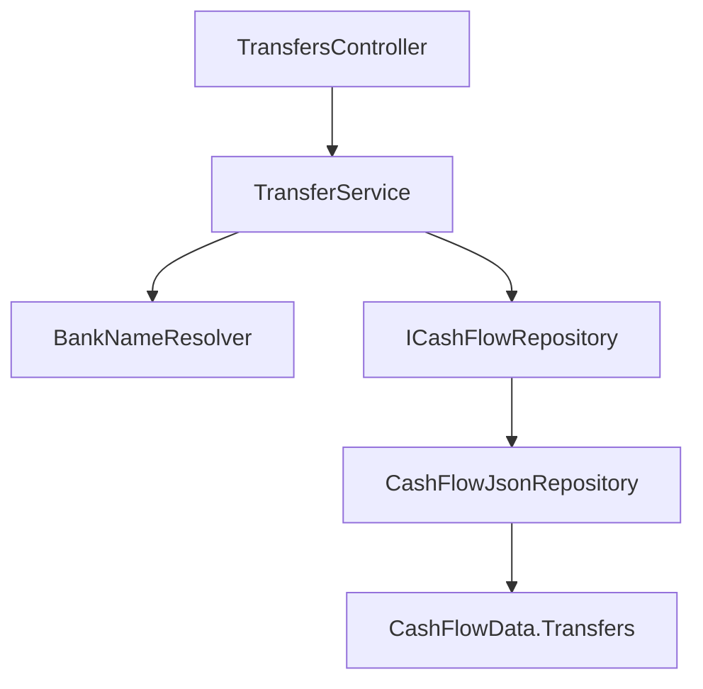

# F01. Bank Transfer Domain & API

## 1. Technical Overview

**What:** Introduce a new `Transfer` entity (`Date`, `SourceBank`, `DestinationBank`, `Amount`, optional `Note`) to the CashFlow domain, together with the full create/edit/delete/query contract (Application service, DTOs, and API endpoints) that F03's balance engine, F04's web form, and F06's history view will all consume. A transfer represents money moving between two of the user's own bank accounts and is deliberately excluded from expense/income category totals.

**Why:** `Transfer` is a brand-new concept with no prior representation in the codebase — today moving money between accounts has no correct home in `Expense` or `Income`. Establishing the entity, persistence, and full CRUD contract in one feature (rather than splitting the contract across F01 and F04) mirrors how `Income` shipped as a complete CRUD surface from its own foundational feature (P14-F01) — F04 then only has to build a form and list UI against an API that already exists, exactly as `IncomesController` predates `Income`'s frontend form.

**Scope:**
- Included: `Transfer` domain entity; `CashFlowData.Transfers` collection with add/update/remove; `ICashFlowRepository` additions (`GetTransfers`, `AddTransfer`, `UpdateTransfer`, `DeleteTransfer`); `ITransferService`/`TransferService` (add, update, delete, get-by-month, get-by-bank); `TransferDTO`/`TransferCreateDTO`/`TransferUpdateDTO`; `TransfersController` (POST, PUT, DELETE, GET by month, GET by bank); serializer wiring for the new entity; DI registration.
- Excluded: any frontend UI (F04); balance calculation using transfer data (F03 — this feature only persists and exposes transfers, it does not compute balances); the history/balances view (F06).

## 2. Architecture Impact

**Affected components:**
- `Financial.CashFlow.Domain/Entities/Transfer.cs` — new entity
- `Financial.CashFlow.Domain/Entities/CashFlowData.cs` — new `Transfers` collection + `AddTransfer`/`UpdateTransfer`/`RemoveTransfer`
- `Financial.CashFlow.Application/Interfaces/ICashFlowRepository.cs` — `GetTransfers()`, `AddTransfer(Transfer)`, `UpdateTransfer(Transfer)`, `DeleteTransfer(Guid)` added
- `Financial.CashFlow.Application/Interfaces/ITransferService.cs` — new
- `Financial.CashFlow.Application/Services/TransferService.cs` — new
- `Financial.CashFlow.Application/DTOs/TransferDTO.cs`, `TransferCreateDTO.cs`, `TransferUpdateDTO.cs` — new
- `Financial.CashFlow.Application/DependencyInjection/CashFlowApplicationServiceCollectionExtensions.cs` — registers `ITransferService`
- `Financial.CashFlow.Infrastructure/Persistence/CashFlowTypeInfoResolver.cs` — `Transfer` added to `ManagedTypes`
- `Financial.CashFlow.Infrastructure/Repositories/CashFlowJsonRepository.cs` — implements the 4 new repository members
- `Financial.Api/Controllers/TransfersController.cs` — new



## 3. Technical Decisions

| Decision | Chosen Approach | Alternative Considered | Trade-off |
|----------|-----------------|-------------------------|-----------|
| Where source/destination bank existence is validated | `TransferService` resolves both names against `_repository.GetBanks()` via the existing `BankNameResolver`, mirroring `ExpenseService.ValidateFields`'s resolution of `PaymentSource` | Resolve inside `Transfer.Create` | `Transfer` (like `Expense`/`Income`) has no repository access in the domain layer; every existing bank-name reference in this codebase is resolved at the Application layer, not inside the entity. Keeping this pattern avoids introducing a new precedent. |
| Where same-bank and positive-amount validation live | `Transfer.Create`/`UpdateDetails` validate `SourceBank != DestinationBank` (string equality, post-resolution to canonical bank names) and `Amount > 0` as self-contained domain invariants | Validate exclusively in `TransferService` | These two checks require no external data (no repository lookup), matching `Income.Create`'s self-validation of `NetValue >= 0` and `Expense`'s `ValidatePaymentShape`. The service still performs bank-name resolution first and passes the canonical resolved names into `Transfer.Create`, so the domain check runs against normalized values regardless of the casing the caller submitted. |
| `CashFlowData` gains an explicit `UpdateTransfer` | Added as `UpdateTransfer(Transfer transfer)`, replacing the stored instance by matching `Id` (find-index-and-replace in the backing list) | Rely on in-place mutation through the shared object reference, as `Expense`/`Income` do today (no `CashFlowData.UpdateExpense`/`UpdateIncome` exists) | The PRD (Section 6, F01 Capabilities) explicitly calls out `AddTransfer`/`UpdateTransfer`/`RemoveTransfer` as the three `CashFlowData` operations for this entity — a direct PRD requirement, not an open decision. Implementing it as an explicit replace (rather than a no-op wrapper around mutation) keeps `CashFlowData`'s public surface honest about what happens on update and avoids depending on reference-identity behavior that the JSON deserializer's `CreateObject`/`Set` wiring does not guarantee is preserved across a full reload. |
| Repository update semantics | `CashFlowJsonRepository.UpdateTransfer` calls `_data.UpdateTransfer(transfer)` then the caller (service) triggers `SaveChangesAsync()`, matching the create/delete pattern exactly | Have the service mutate the existing entity and skip a dedicated repository call | Consistent with the previous decision — the repository contract exposes `UpdateTransfer` per the PRD, so the service calls it explicitly (find existing transfer, apply `UpdateDetails`, then call `_repository.UpdateTransfer`) rather than relying on implicit reference sharing. |

## 4. Component Overview

**Backend:**

| File Path | New/Modified | Purpose | Key Responsibilities |
|-----------|--------------|---------|-----------------------|
| `Financial.CashFlow.Domain/Entities/Transfer.cs` | New | Transfer identity | Private ctor + `Create(date, sourceBank, destinationBank, amount, note)` factory; `UpdateDetails(...)`; `Id`, `Date`, `SourceBank`, `DestinationBank`, `Amount`, `Note` (all private-set); validates `SourceBank != DestinationBank` and `Amount > 0` |
| `Financial.CashFlow.Domain/Entities/CashFlowData.cs` | Modified | Transfer collection | `_transfers`/`Transfers` (`IReadOnlyCollection<Transfer>`) following the existing private-list-plus-readonly-property pattern; `AddTransfer(Transfer)`; `UpdateTransfer(Transfer)` (find-by-id-and-replace); `RemoveTransfer(Guid id)` |
| `Financial.CashFlow.Application/Interfaces/ICashFlowRepository.cs` | Modified | Repository contract | `IEnumerable<Transfer> GetTransfers(); void AddTransfer(Transfer transfer); void UpdateTransfer(Transfer transfer); void DeleteTransfer(Guid id);` added |
| `Financial.CashFlow.Application/Interfaces/ITransferService.cs` | New | Service contract | `AddTransferAsync`, `UpdateTransferAsync`, `DeleteTransferAsync`, `GetTransfersByMonth(int year, int month)`, `GetTransfersByBank(string bankName)` |
| `Financial.CashFlow.Application/Services/TransferService.cs` | New | Transfer CRUD | Resolves `SourceBank`/`DestinationBank` via `BankNameResolver` against `_repository.GetBanks()`; throws `ArgumentException` on an unresolved bank name (before the domain's same-bank/amount checks run, so the error message names the specific bank, matching `ExpensesController`'s convention); throws `KeyNotFoundException` on update/delete of a missing id; `ToDto` maps entity to `TransferDTO` |
| `Financial.CashFlow.Application/DTOs/TransferDTO.cs` | New | Read model | `Id`, `Date`, `SourceBank`, `DestinationBank`, `Amount`, `Note` |
| `Financial.CashFlow.Application/DTOs/TransferCreateDTO.cs` | New | Create request | `Date`, `SourceBank`, `DestinationBank`, `Amount`, `Note` |
| `Financial.CashFlow.Application/DTOs/TransferUpdateDTO.cs` | New | Update request | Same shape as create; id comes from the route |
| `Financial.CashFlow.Application/DependencyInjection/CashFlowApplicationServiceCollectionExtensions.cs` | Modified | DI registration | `services.AddSingleton<ITransferService, TransferService>();` added |
| `Financial.CashFlow.Infrastructure/Persistence/CashFlowTypeInfoResolver.cs` | Modified | Serializer wiring | `typeof(Transfer)` added to `ManagedTypes` |
| `Financial.CashFlow.Infrastructure/Repositories/CashFlowJsonRepository.cs` | Modified | Repository impl | `GetTransfers() => _data.Transfers;`, `AddTransfer`, `UpdateTransfer`, `DeleteTransfer` delegating to `CashFlowData` |
| `Financial.Api/Controllers/TransfersController.cs` | New | HTTP surface | `POST /transfers`, `PUT /transfers/{id}`, `DELETE /transfers/{id}`, `GET /transfers/month/{year}/{month}`, `GET /transfers/bank/{name}` — mirrors `ExpensesController`'s status codes and `Problem()` error shape exactly |

## 5. API Contracts

**Endpoint: Add Transfer**
- **Method:** POST
- **Path:** `/transfers`
- **Authentication:** None (matches every other endpoint in this single-user app)

**Request:**

| Field | Type | Required | Validation | Description |
|-------|------|----------|------------|--------------|
| `date` | `date` | Yes | — | Transfer date |
| `sourceBank` | `string` | Yes | must resolve against the live `Bank` list; must differ from `destinationBank` | Bank the money leaves |
| `destinationBank` | `string` | Yes | must resolve against the live `Bank` list; must differ from `sourceBank` | Bank the money enters |
| `amount` | `decimal` | Yes | `> 0` | Amount moved |
| `note` | `string` | No | — | Free-text note |

**Request Example:**
```json
{
  "date": "2026-07-25",
  "sourceBank": "Barclays",
  "destinationBank": "Trading212",
  "amount": 500.00,
  "note": "Round-up top-up"
}
```

**Response (Success - 200):**

| Field | Type | Description |
|-------|------|--------------|
| `id` | `uuid` | Generated identifier |
| `date` | `date` | Transfer date |
| `sourceBank` | `string` | Bank the money leaves |
| `destinationBank` | `string` | Bank the money enters |
| `amount` | `decimal` | Amount moved |
| `note` | `string?` | Free-text note, if provided |

**Response Example:**
```json
{
  "id": "9c1b1e2a-1234-4a11-9abc-0f1e2d3c4b5a",
  "date": "2026-07-25",
  "sourceBank": "Barclays",
  "destinationBank": "Trading212",
  "amount": 500.00,
  "note": "Round-up top-up"
}
```

**Error Codes:**

| Code | HTTP Status | Description |
|------|-------------|--------------|
| — | 400 | `"Bank '{name}' was not found."` (unresolved `sourceBank`/`destinationBank`), `"A transfer must move money between two different banks."`, or `"Transfer amount must be greater than zero."` (via `Problem()` with the exception message) |

**Endpoint: Update Transfer**
- **Method:** PUT
- **Path:** `/transfers/{id}`
- Same request/response shape as Add, plus a 404 (`Problem()`, `"Transfer '{id}' was not found."`) when `id` does not resolve to an existing transfer.

**Endpoint: Delete Transfer**
- **Method:** DELETE
- **Path:** `/transfers/{id}`
- **Response (Success - 200):** empty body. **Error:** 404 (`Problem()`, `"Transfer '{id}' was not found."`) when `id` does not resolve.

**Endpoint: Get Transfers by Month**
- **Method:** GET
- **Path:** `/transfers/month/{year}/{month}`
- **Response (Success - 200):** `TransferDTO[]` — every transfer dated within that year/month, same shape as the Add response.

**Endpoint: Get Transfers by Bank**
- **Method:** GET
- **Path:** `/transfers/bank/{name}`
- **Response (Success - 200):** `TransferDTO[]` — every transfer where `name` matches `sourceBank` or `destinationBank` (case-insensitive), regardless of month; consumed by F06's per-bank history list, which applies its own month filtering client-side against F01's other endpoints as needed. No 404 for an unrecognized bank name — returns an empty array, matching the read-only, filter-style semantics of `GetExpensesByMonth`.

## 6. Data Model

`data-cashflow.json` gains one new top-level array, `Transfers`, empty until the first transfer is created (no migration tool needed — `CashFlowData.Transfers` default-initializes to an empty list and a normal save adds the JSON key automatically, the same mechanism already used for `CashFlowData.Incomes` after its collection was introduced):

```json
{
  "Transfers": []
}
```

Each entry created afterward through the API takes this shape:

```json
{
  "Id": "9c1b1e2a-1234-4a11-9abc-0f1e2d3c4b5a",
  "Date": "2026-07-25",
  "SourceBank": "Barclays",
  "DestinationBank": "Trading212",
  "Amount": 500.00,
  "Note": "Round-up top-up"
}
```

No other top-level collection's shape changes.

## 7. Testing Strategy

| Test File | Test Type | Target | Coverage |
|-----------|-----------|--------|----------|
| `Tests/Financial.CashFlow.Domain.Tests/Entities/TransferTests.cs` | Unit | `Transfer` | `Create` sets all fields and assigns a new id; two `Create` calls produce different ids; rejects `SourceBank == DestinationBank`; rejects `Amount <= 0`; accepts a null `Note`; `UpdateDetails` re-validates and updates all fields |
| `Tests/Financial.CashFlow.Domain.Tests/Entities/CashFlowDataTests.cs` | Unit | `CashFlowData` | `AddTransfer` appends to `Transfers`; `Transfers` starts empty on `Create()`; `UpdateTransfer` replaces the matching entry by id; `RemoveTransfer` removes by id and no-ops on an unknown id |
| `Tests/Financial.CashFlow.Application.Tests/Services/TransferServiceTests.cs` | Unit | `TransferService` | Valid create/update/delete round-trip; unresolved `sourceBank`/`destinationBank` throws `ArgumentException` with the bank-not-found message; same source and destination throws `ArgumentException`; `amount <= 0` throws `ArgumentException`; update/delete of an unknown id throws `KeyNotFoundException`; `GetTransfersByMonth` filters by year and month; `GetTransfersByBank` returns transfers where the bank is either source or destination, and an empty list for an unrecognized bank name |
| `Tests/Financial.CashFlow.Infrastructure.Tests/Persistence/CashFlowSerializerAdapterTests.cs` | Unit | Serializer | `Transfer` round-trips through `CashFlowTypeInfoResolver`'s private-setter wiring |
| `Tests/Financial.Api.Tests/TransfersEndpointsTests.cs` | Integration | `TransfersController` | POST creates and returns 200; POST with an unresolvable bank, same source/destination, or non-positive amount returns 400 with the expected message; PUT updates and returns 200; PUT on unknown id returns 404; DELETE removes and returns 200; DELETE on unknown id returns 404; GET by month returns only that month's entries; GET by bank returns transfers where the bank is source or destination |

**Acceptance tests (PRD Section 9, F01):**
- Creating a transfer with two distinct, existing banks, a positive amount, and a date succeeds and is retrievable via `GET /transfers/month/{year}/{month}` → `TransferServiceTests`, `TransfersEndpointsTests`
- Creating a transfer with the same bank as source and destination fails with a 400 error → `TransferTests`, `TransferServiceTests`, `TransfersEndpointsTests`
- Creating a transfer with an amount of 0 or less fails with a 400 error → `TransferTests`, `TransferServiceTests`, `TransfersEndpointsTests`
- Creating a transfer with an unresolvable bank name fails with a 400 error → `TransferServiceTests`, `TransfersEndpointsTests`
- Editing a transfer's amount, date, or note persists the change and is reflected on the next `GET` → `TransferServiceTests`, `TransfersEndpointsTests`
- Deleting a transfer removes it from `data-cashflow.json` and from all subsequent `GET` responses → `TransferServiceTests`, `TransfersEndpointsTests`

**Cross-Feature Integration criteria touching F01 (PRD Section 9):**
- "A transfer created via F01 is included in F03's balance computation for both its source and destination banks" — depends on `ICashFlowRepository.GetTransfers()` exposing every `Transfer.Amount`/`SourceBank`/`DestinationBank` correctly, guaranteed here by `TransferServiceTests` and `CashFlowDataTests`; the balance computation itself is verified in F03's own spec
- "A transfer created through F04 is persisted via F01 and appears correctly in F06's history list and balance display" — the entire Section 5 API contract and `TransfersEndpointsTests` suite (including `GET /transfers/bank/{name}`) is the direct guarantee this criterion depends on; F04's and F06's own specs verify the consuming UI
