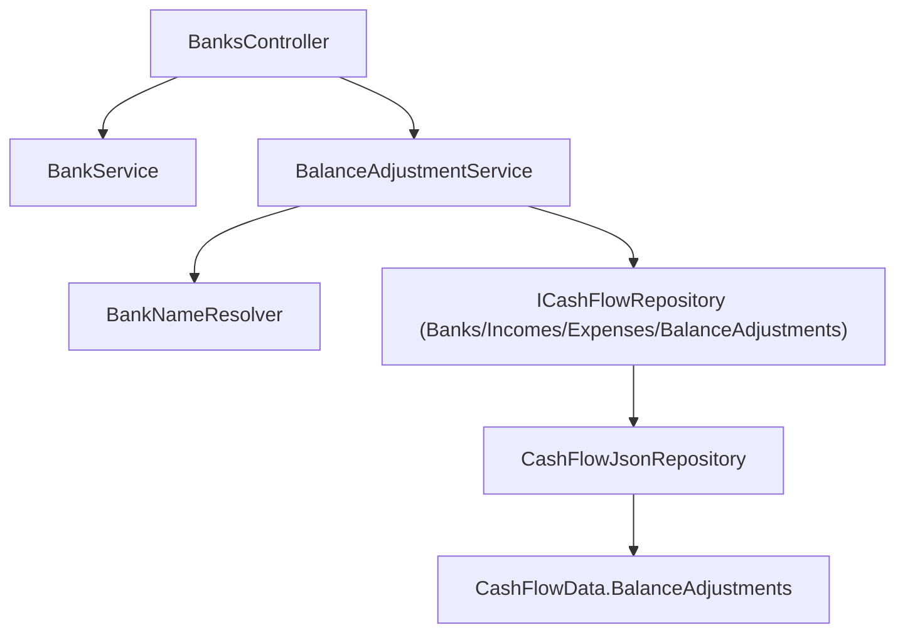

# F02. Balance Adjustment Domain & API

## 1. Technical Overview

**What:** Introduce a new `BalanceAdjustment` entity (`Date`, `Bank`, `TargetBalance`, `Delta`, optional `Note`) to the CashFlow domain, together with the full create/edit/delete/query contract (Application service, DTOs, and API endpoints folded into `BanksController`) that F05's web form and F06's history view will consume. A balance adjustment lets the user reconcile a bank's computed balance to the figure their real bank statement shows, storing the computed correction (`Delta`) as a stable, auditable value rather than recomputing it on every read.

**Why:** `BalanceAdjustment` is a brand-new concept, following the same "ship the full CRUD contract in its foundational feature" precedent established by F01 (this PRD) and P14-F01 (`Income`) — F05 then only builds a form against an API that already exists.

**Scope:**
- Included: `BalanceAdjustment` domain entity; `CashFlowData.BalanceAdjustments` collection with add/update/remove; `ICashFlowRepository` additions (`GetBalanceAdjustments`, `AddBalanceAdjustment`, `UpdateBalanceAdjustment`, `DeleteBalanceAdjustment`); `IBalanceAdjustmentService`/`BalanceAdjustmentService` (add, update, delete, get-by-bank); `BalanceAdjustmentDTO`/`BalanceAdjustmentCreateDTO`/`BalanceAdjustmentUpdateDTO`; new endpoints on the existing `BanksController`; serializer wiring; DI registration.
- Excluded: any frontend UI (F05); the canonical, shared bank-balance-as-of-date calculation that folds in transfers (F03 — see the Technical Decisions table for how this feature bridges that gap); the history/balances view (F06).

## 2. Architecture Impact

**Affected components:**
- `Financial.CashFlow.Domain/Entities/BalanceAdjustment.cs` — new entity
- `Financial.CashFlow.Domain/Entities/CashFlowData.cs` — new `BalanceAdjustments` collection + `AddBalanceAdjustment`/`UpdateBalanceAdjustment`/`RemoveBalanceAdjustment`
- `Financial.CashFlow.Application/Interfaces/ICashFlowRepository.cs` — `GetBalanceAdjustments()`, `AddBalanceAdjustment(BalanceAdjustment)`, `UpdateBalanceAdjustment(BalanceAdjustment)`, `DeleteBalanceAdjustment(Guid)` added
- `Financial.CashFlow.Application/Interfaces/IBalanceAdjustmentService.cs` — new
- `Financial.CashFlow.Application/Services/BalanceAdjustmentService.cs` — new
- `Financial.CashFlow.Application/DTOs/BalanceAdjustmentDTO.cs`, `BalanceAdjustmentCreateDTO.cs`, `BalanceAdjustmentUpdateDTO.cs` — new
- `Financial.CashFlow.Application/DependencyInjection/CashFlowApplicationServiceCollectionExtensions.cs` — registers `IBalanceAdjustmentService`
- `Financial.CashFlow.Infrastructure/Persistence/CashFlowTypeInfoResolver.cs` — `BalanceAdjustment` added to `ManagedTypes`
- `Financial.CashFlow.Infrastructure/Repositories/CashFlowJsonRepository.cs` — implements the 4 new repository members
- `Financial.Api/Controllers/BanksController.cs` — modified: new adjustment endpoints, second constructor dependency



## 3. Technical Decisions

| Decision | Chosen Approach | Alternative Considered | Trade-off |
|----------|-----------------|-------------------------|-----------|
| Where the "balance as of date" figure for delta computation comes from, given F03 (the canonical calculation engine) isn't built yet | `BalanceAdjustmentService` computes it with a private helper that mirrors `BankService.GetBankBalancesByMonth`'s existing formula (`OpeningBalance + Σ Income.NetValue − Σ(Expense.Value − RoundUpAmount)`, scoped to `[OpeningBalanceDate, asOfDate]`), extended to also add every *other* `BalanceAdjustment.Delta` for that bank dated on/before `asOfDate` so adjustments stack correctly | Block F02 until F03 ships, or have F02 call a stub `IBankService.GetBankBalanceAsOf` that F03 later fills in | The PRD's own Dependency Graph (Section 8) puts F02 in Wave 1 with no dependency on F03, and F03 explicitly depends on F02 (it must read `BalanceAdjustment.Delta`) — so the PRD's intended build order has F02 ship first. This private helper is deliberately written to become dead code once F03 lands: F03's spec must replace it with a call to the new shared `IBankService.GetBankBalanceAsOf`, which will additionally fold in `Transfer` amounts. This is flagged here so F03's implementation removes the duplication rather than leaving two balance formulas. |
| Service placement | New `IBalanceAdjustmentService`/`BalanceAdjustmentService`, injected into `BanksController` alongside the existing `IBankService`, rather than extending `BankService` itself | Add adjustment methods directly onto `IBankService` | `BankService` owns `Bank` entity CRUD and balance reads; `BalanceAdjustment` is a distinct entity with its own validation and CRUD lifecycle. A second service keeps each class single-responsibility, matching how `TransferService` (F01) was kept separate from `BankService` even though transfers also touch bank balances. The PRD only mandates the endpoints live on `BanksController` (Section 6, F02 Capabilities), not that the service layer merge — routing and service layering are independent concerns here. |
| Where `TargetBalance >= 0` is validated | `BalanceAdjustment.Create`/`UpdateDetails` validate it as a self-contained domain invariant, mirroring `Bank.SetOpeningBalance`'s identical non-negative check | Validate only in `BalanceAdjustmentService` | No repository access is needed for this check, matching the precedent of every other self-contained domain invariant in this codebase (`Income.NetValue >= 0`, `Transfer.Amount > 0`). |
| `Delta` computation and storage | `BalanceAdjustmentService` computes `Delta` before calling `BalanceAdjustment.Create`/`UpdateDetails`, passing it in as a plain value; the entity stores whatever `Delta` it's given without re-deriving it | Compute `Delta` inside the entity | `Delta` requires repository access (bank balance, other adjustments) that the domain layer cannot have. The entity storing a pre-computed value, without re-validating it against a formula it can't evaluate, is consistent with how `Expense.RoundUpAmount` is set from outside via `SetRoundUpAmount` rather than derived internally. |

## 4. Component Overview

**Backend:**

| File Path | New/Modified | Purpose | Key Responsibilities |
|-----------|--------------|---------|-----------------------|
| `Financial.CashFlow.Domain/Entities/BalanceAdjustment.cs` | New | Balance adjustment identity | Private ctor + `Create(date, bank, targetBalance, delta, note)` factory; `UpdateDetails(date, targetBalance, delta, note)` (bank is immutable after creation — an adjustment belongs to one bank); `Id`, `Date`, `Bank`, `TargetBalance`, `Delta`, `Note`, all private-set; validates `TargetBalance >= 0` |
| `Financial.CashFlow.Domain/Entities/CashFlowData.cs` | Modified | Balance adjustment collection | `_balanceAdjustments`/`BalanceAdjustments` (`IReadOnlyCollection<BalanceAdjustment>`) following the existing private-list-plus-readonly-property pattern; `AddBalanceAdjustment(BalanceAdjustment)`; `UpdateBalanceAdjustment(BalanceAdjustment)` (find-by-id-and-replace, matching F01's `UpdateTransfer`); `RemoveBalanceAdjustment(Guid id)` |
| `Financial.CashFlow.Application/Interfaces/ICashFlowRepository.cs` | Modified | Repository contract | `IEnumerable<BalanceAdjustment> GetBalanceAdjustments(); void AddBalanceAdjustment(BalanceAdjustment adjustment); void UpdateBalanceAdjustment(BalanceAdjustment adjustment); void DeleteBalanceAdjustment(Guid id);` added |
| `Financial.CashFlow.Application/Interfaces/IBalanceAdjustmentService.cs` | New | Service contract | `AddAdjustmentAsync(string bankName, BalanceAdjustmentCreateDTO request)`, `UpdateAdjustmentAsync(string bankName, Guid id, BalanceAdjustmentUpdateDTO request)`, `DeleteAdjustmentAsync(string bankName, Guid id)`, `GetAdjustmentsByBank(string bankName)` |
| `Financial.CashFlow.Application/Services/BalanceAdjustmentService.cs` | New | Balance adjustment CRUD | Resolves `bankName` via `BankNameResolver`; computes `Delta` via the private balance-as-of helper described in Section 3 (excluding the adjustment being created/edited from the "other adjustments" sum); throws `ArgumentException` on an unresolved bank or negative target balance; throws `KeyNotFoundException` on update/delete of a missing id, or when the resolved bank doesn't match the adjustment's stored bank; `ToDto` maps entity to `BalanceAdjustmentDTO` |
| `Financial.CashFlow.Application/DTOs/BalanceAdjustmentDTO.cs` | New | Read model | `Id`, `Date`, `Bank`, `TargetBalance`, `Delta`, `Note` |
| `Financial.CashFlow.Application/DTOs/BalanceAdjustmentCreateDTO.cs` | New | Create request | `Date`, `TargetBalance`, `Note` (bank comes from the route) |
| `Financial.CashFlow.Application/DTOs/BalanceAdjustmentUpdateDTO.cs` | New | Update request | Same shape as create; id and bank come from the route |
| `Financial.CashFlow.Application/DependencyInjection/CashFlowApplicationServiceCollectionExtensions.cs` | Modified | DI registration | `services.AddSingleton<IBalanceAdjustmentService, BalanceAdjustmentService>();` added |
| `Financial.CashFlow.Infrastructure/Persistence/CashFlowTypeInfoResolver.cs` | Modified | Serializer wiring | `typeof(BalanceAdjustment)` added to `ManagedTypes` |
| `Financial.CashFlow.Infrastructure/Repositories/CashFlowJsonRepository.cs` | Modified | Repository impl | `GetBalanceAdjustments() => _data.BalanceAdjustments;`, `AddBalanceAdjustment`, `UpdateBalanceAdjustment`, `DeleteBalanceAdjustment` delegating to `CashFlowData` |
| `Financial.Api/Controllers/BanksController.cs` | Modified | HTTP surface | Constructor gains `IBalanceAdjustmentService`; `POST /banks/{name}/adjustments`, `PUT /banks/{name}/adjustments/{id}`, `DELETE /banks/{name}/adjustments/{id}`, `GET /banks/{name}/adjustments` — mirrors the existing `UpdateOpeningBalance` action's status codes and `Problem()` error shape |

## 5. API Contracts

**Endpoint: Add Balance Adjustment**
- **Method:** POST
- **Path:** `/banks/{name}/adjustments`
- **Authentication:** None (matches every other endpoint in this single-user app)

**Request:**

| Field | Type | Required | Validation | Description |
|-------|------|----------|------------|--------------|
| `date` | `date` | Yes | — | Reconciliation date |
| `targetBalance` | `decimal` | Yes | `>= 0` | The real balance from the bank statement |
| `note` | `string` | No | — | Free-text note |

**Request Example:**
```json
{
  "date": "2026-07-25",
  "targetBalance": 2340.17,
  "note": "Matched against July statement"
}
```

**Response (Success - 200):**

| Field | Type | Description |
|-------|------|--------------|
| `id` | `uuid` | Generated identifier |
| `date` | `date` | Reconciliation date |
| `bank` | `string` | Bank name (from the route) |
| `targetBalance` | `decimal` | The real balance entered |
| `delta` | `decimal` | Computed correction: `targetBalance − balance as of date (excluding this adjustment)` |
| `note` | `string?` | Free-text note, if provided |

**Response Example:**
```json
{
  "id": "3f2a1c4e-1234-4a11-9abc-0f1e2d3c4b5a",
  "date": "2026-07-25",
  "bank": "Barclays",
  "targetBalance": 2340.17,
  "delta": -4.20,
  "note": "Matched against July statement"
}
```

**Error Codes:**

| Code | HTTP Status | Description |
|------|-------------|--------------|
| — | 400 | `"Bank '{name}' was not found."` (unresolved bank in the route) or `"Balance cannot be negative."` (via `Problem()` with the exception message) |

**Endpoint: Update Balance Adjustment**
- **Method:** PUT
- **Path:** `/banks/{name}/adjustments/{id}`
- Same request/response shape as Add; recomputes and re-stores `Delta` using the request's `date`/`targetBalance`. 404 (`Problem()`, `"Balance adjustment '{id}' was not found."`) when `id` does not resolve to an existing adjustment for that bank.

**Endpoint: Delete Balance Adjustment**
- **Method:** DELETE
- **Path:** `/banks/{name}/adjustments/{id}`
- **Response (Success - 200):** empty body. **Error:** 404 (`Problem()`, `"Balance adjustment '{id}' was not found."`) when `id` does not resolve.

**Endpoint: Get Balance Adjustments by Bank**
- **Method:** GET
- **Path:** `/banks/{name}/adjustments`
- **Response (Success - 200):** `BalanceAdjustmentDTO[]` — every adjustment for that bank, same shape as the Add response. No 404 for an unrecognized bank name — returns an empty array, matching F01's `GET /transfers/bank/{name}` read-only filter semantics.

## 6. Data Model

`data-cashflow.json` gains one new top-level array, `BalanceAdjustments`, empty until the first adjustment is created (no migration tool needed — same mechanism as F01's `Transfers` collection):

```json
{
  "BalanceAdjustments": []
}
```

Each entry created afterward through the API takes this shape:

```json
{
  "Id": "3f2a1c4e-1234-4a11-9abc-0f1e2d3c4b5a",
  "Date": "2026-07-25",
  "Bank": "Barclays",
  "TargetBalance": 2340.17,
  "Delta": -4.20,
  "Note": "Matched against July statement"
}
```

No other top-level collection's shape changes.

## 7. Testing Strategy

| Test File | Test Type | Target | Coverage |
|-----------|-----------|--------|----------|
| `Tests/Financial.CashFlow.Domain.Tests/Entities/BalanceAdjustmentTests.cs` | Unit | `BalanceAdjustment` | `Create` sets all fields and assigns a new id; two `Create` calls produce different ids; rejects negative `TargetBalance`; accepts `TargetBalance` of exactly 0; accepts a null `Note`; `UpdateDetails` re-validates and updates `Date`/`TargetBalance`/`Delta`/`Note` without changing `Id` or `Bank` |
| `Tests/Financial.CashFlow.Domain.Tests/Entities/CashFlowDataTests.cs` | Unit | `CashFlowData` | `AddBalanceAdjustment` appends to `BalanceAdjustments`; `BalanceAdjustments` starts empty on `Create()`; `UpdateBalanceAdjustment` replaces the matching entry by id; `RemoveBalanceAdjustment` removes by id and no-ops on an unknown id |
| `Tests/Financial.CashFlow.Application.Tests/Services/BalanceAdjustmentServiceTests.cs` | Unit | `BalanceAdjustmentService` | Valid create returns the computed `Delta` (`targetBalance - (openingBalance + incomes - expenses)`); create with prior incomes/expenses in range computes the correct delta; create with an existing adjustment for the same bank correctly stacks (`Delta` accounts for the prior adjustment's own `Delta`); unresolved bank throws `ArgumentException`; negative `targetBalance` throws `ArgumentException`; update recomputes and persists a new `Delta`; update/delete of an unknown id throws `KeyNotFoundException`; `GetAdjustmentsByBank` returns only that bank's adjustments and an empty list for an unrecognized bank name |
| `Tests/Financial.CashFlow.Infrastructure.Tests/Persistence/CashFlowSerializerAdapterTests.cs` | Unit | Serializer | `BalanceAdjustment` round-trips through `CashFlowTypeInfoResolver`'s private-setter wiring |
| `Tests/Financial.Api.Tests/BalanceAdjustmentsEndpointsTests.cs` | Integration | `BanksController` (adjustment actions) | POST creates and returns 200 with the computed `Delta`; POST with an unresolvable bank or negative `targetBalance` returns 400 with the expected message; PUT updates and returns 200 with a recomputed `Delta`; PUT on unknown id returns 404; DELETE removes and returns 200; DELETE on unknown id returns 404; GET returns only that bank's adjustments |

**Acceptance tests (PRD Section 9, F02):**
- Creating a balance adjustment with a valid bank, non-negative target balance, and date succeeds and returns the computed `Delta` → `BalanceAdjustmentServiceTests`, `BalanceAdjustmentsEndpointsTests`
- The returned `Delta` equals `TargetBalance` minus the balance computed as of the adjustment's date (excluding the new adjustment itself) → `BalanceAdjustmentServiceTests`
- Creating an adjustment with a negative target balance fails with a 400 error → `BalanceAdjustmentTests`, `BalanceAdjustmentServiceTests`, `BalanceAdjustmentsEndpointsTests`
- Creating an adjustment with an unresolvable bank name fails with a 400 error → `BalanceAdjustmentServiceTests`, `BalanceAdjustmentsEndpointsTests`
- Editing an adjustment's target balance or date recomputes and persists a new `Delta` → `BalanceAdjustmentServiceTests`, `BalanceAdjustmentsEndpointsTests`
- Deleting an adjustment removes it and its `Delta` no longer contributes to that bank's computed balance → `BalanceAdjustmentServiceTests` (verified here as removal from the repository and exclusion from subsequent delta-stacking computations; the end-to-end effect on `GetBankBalancesByMonth` is verified in F03's own spec once that formula exists)

**Cross-Feature Integration criteria touching F02 (PRD Section 9):**
- "A balance adjustment created via F02, whose delta depends on F03's computed balance as of its date, produces a delta that brings F03's subsequent computed balance to exactly the entered target balance" — F02 ships its own interim balance-as-of-date computation (Section 3) since F03 doesn't exist yet at this point in the build order; this criterion becomes fully verifiable once F03 replaces the interim helper with the shared, transfer-aware formula — F03's own spec owns that verification
- "An adjustment created through F05, using F03's current-balance reference and F02's create endpoint, appears correctly in F06's history list and balance display" — depends on F05/F06, not yet built; F02's contribution (the create/edit/delete/list endpoint contract) is fully covered by `BalanceAdjustmentsEndpointsTests`
