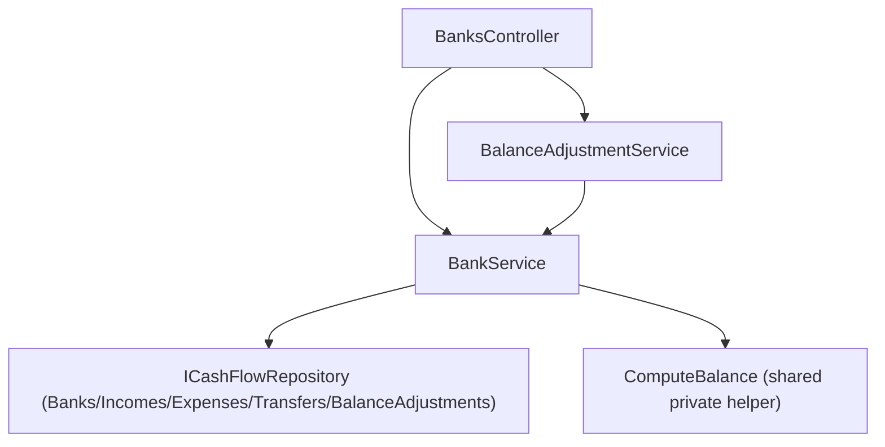

# F03. Bank Balance Calculation Engine

## 1. Technical Overview

**What:** Extends `BankService.GetBankBalancesByMonth`'s balance formula to fold in transfers (F01) and balance adjustments (F02) alongside the existing income/expense terms, and adds a new `IBankService.GetBankBalanceAsOf(bankName, date)` method that computes a single bank's balance as of an arbitrary date. `BalanceAdjustmentService` (F02) is refactored to call this shared method instead of its own interim, duplicate formula — collapsing the balance calculation down to the single place the PRD requires.

**Why:** F02's spec explicitly shipped an interim balance-as-of-date helper inside `BalanceAdjustmentService` because F03 didn't exist yet at that point in the PRD's build order (Section 8 puts F02 in Wave 1, F03 in Wave 2, with F03 depending on F02). That interim helper was flagged as dead code to be removed once F03 lands. This feature both extends the formula (the net-new capability) and performs that removal (closing out the duplication F02 knowingly left behind), so there is exactly one implementation of balance arithmetic across the whole product — the PRD's explicit, named requirement (Section 4 Objectives: "Guarantee all balance arithmetic executes exclusively on the backend").

**Scope:**
- Included: extending `BankService.GetBankBalancesByMonth`'s formula with transfer and adjustment terms; adding `IBankService.GetBankBalanceAsOf(bankName, date, excludingAdjustmentId)`; refactoring `BalanceAdjustmentService` to consume it, deleting its interim formula; a shared private calculation helper inside `BankService` so both public methods use the exact same code path.
- Excluded: any new HTTP endpoint (the PRD's Experience section is explicit — `GET /banks/month/{year}/{month}/balances` and its `BankBalanceDTO` shape are unchanged at the contract level); any frontend UI (F04/F05/F06 own that).

## 2. Architecture Impact

**Affected components:**
- `Financial.CashFlow.Application/Interfaces/IBankService.cs` — adds `GetBankBalanceAsOf(string bankName, DateOnly asOfDate, Guid? excludingAdjustmentId = null)`
- `Financial.CashFlow.Application/Services/BankService.cs` — extracts a shared `ComputeBalance` helper used by both `GetBankBalancesByMonth` and the new `GetBankBalanceAsOf`; adds the transfer and adjustment terms
- `Financial.CashFlow.Application/Services/BalanceAdjustmentService.cs` — constructor gains an `IBankService` dependency; deletes its own `ComputeBalanceAsOf` helper, calling `IBankService.GetBankBalanceAsOf` instead
- `Financial.CashFlow.Application/DependencyInjection/CashFlowApplicationServiceCollectionExtensions.cs` — no change needed (both services already registered; DI resolves the new constructor parameter automatically)

## 3. Technical Decisions

| Decision | Chosen Approach | Alternative Considered | Trade-off |
|----------|-----------------|-------------------------|-----------|
| `GetBankBalanceAsOf` gains an optional `excludingAdjustmentId` parameter beyond the PRD's literal `(bankName, date)` signature | `GetBankBalanceAsOf(string bankName, DateOnly asOfDate, Guid? excludingAdjustmentId = null)` | Keep the exact 2-argument PRD signature; have `BalanceAdjustmentService.UpdateAdjustmentAsync` "add back" the adjustment's old `Delta` to the freshly computed balance instead of excluding it | The add-back approach is only correct when the adjustment's date doesn't move across the as-of-date boundary during an edit. If a user edits an adjustment and changes its date to something earlier than it was, the add-back arithmetic silently produces a wrong `Delta` (verified by hand-tracing both cases). An optional exclusion parameter, defaulted to `null` for every other caller, fixes this for all cases without adding a second formula — it stays the single, sole place balance arithmetic lives, just with one more filter condition. This is the one deliberate deviation from the PRD's literal signature in this spec, called out here per that expectation. |
| Where the shared formula code lives | A single private `ComputeBalance(Bank bank, DateOnly asOfDate, Guid? excludingAdjustmentId)` method inside `BankService`, called by both `GetBankBalancesByMonth` (once per bank, `asOfDate` = end of month) and `GetBankBalanceAsOf` (once, for the requested bank and date) | Duplicate the formula inline in both public methods | The PRD names this "the single, sole place balance arithmetic is implemented" — one private helper backing both entry points is the only way two public methods share one formula without either duplicating it or one calling the other in a way that doesn't fit their different shapes (all banks vs. one bank). |
| `BalanceAdjustmentService`'s new `IBankService` dependency | Constructor-injected alongside the existing `ICashFlowRepository`, both resolved by the existing DI container registration (`AddSingleton<IBankService, BankService>()` from F01/F02, unchanged) | Have `BankService` depend on `BalanceAdjustmentService` instead, or merge the two services | `BalanceAdjustmentService` needs to *read* a computed balance to derive `Delta`; `BankService` has no reason to know about adjustments beyond summing their already-stored `Delta` values via the repository. A one-directional dependency (`BalanceAdjustmentService` → `IBankService`) avoids a cycle and matches which service actually needs the other's output. |
| Date-window lower bound on transfer and adjustment sums | Both scoped to `[Bank.OpeningBalanceDate, asOfDate]` inclusive, matching Income/Expense exactly, per the PRD's explicit formula text ("every sum scoped to... the same date-window rule already applied to Income/Expense") | Leave adjustments unbounded below (matching F02's interim helper, which only checked `Date <= asOfDate`) | The PRD's formula text is explicit and unambiguous on this point — F02's interim helper's missing lower bound was a known simplification of a formula being replaced by this feature, not a precedent to preserve. |

## 4. Component Overview

**Backend:**

| File Path | New/Modified | Purpose | Key Responsibilities |
|-----------|--------------|---------|-----------------------|
| `Financial.CashFlow.Application/Interfaces/IBankService.cs` | Modified | Service contract | `decimal GetBankBalanceAsOf(string bankName, DateOnly asOfDate, Guid? excludingAdjustmentId = null);` added |
| `Financial.CashFlow.Application/Services/BankService.cs` | Modified | Balance calculation | `GetBankBalancesByMonth` and the new `GetBankBalanceAsOf` both call a shared private `ComputeBalance` helper; formula extended with `Σ Transfer.Amount` (destination minus source) and `Σ BalanceAdjustment.Delta` (excluding one adjustment id when provided), all scoped to `[OpeningBalanceDate, asOfDate]`; `GetBankBalanceAsOf` resolves `bankName` via `BankNameResolver`, throwing `KeyNotFoundException` if unresolvable |
| `Financial.CashFlow.Application/Services/BalanceAdjustmentService.cs` | Modified | Delta computation | Constructor gains `IBankService bankService`; `AddAdjustmentAsync`/`UpdateAdjustmentAsync` call `_bankService.GetBankBalanceAsOf(bank.Name, request.Date, excludingAdjustmentId)` (`null` on create, the adjustment's own id on update) instead of the deleted interim helper |

## 5. API Contracts

No new or changed endpoints. `GET /banks/month/{year}/{month}/balances` keeps its existing route, request shape, and `BankBalanceDTO { Bank, Balance }` response shape exactly as-is — only the value `Balance` now includes transfer and adjustment contributions in addition to income/expense.

## 6. Data Model

No changes. This feature reads `Transfer` and `BalanceAdjustment` records already persisted by F01/F02; it introduces no new collections or fields.

## 7. Testing Strategy

| Test File | Test Type | Target | Coverage |
|-----------|-----------|--------|----------|
| `Tests/Financial.CashFlow.Application.Tests/Services/BankServiceTests.cs` | Unit | `BankService` | A transfer with `DestinationBank` = the queried bank adds its `Amount` to the balance; a transfer with `SourceBank` = the queried bank subtracts its `Amount`; a transfer touching neither role for the bank is ignored; a `BalanceAdjustment` for the bank adds its `Delta`; a transfer or adjustment dated after the as-of date (end of month for `GetBankBalancesByMonth`) is excluded; a transfer or adjustment dated before `OpeningBalanceDate` is excluded; a bank with no transfers or adjustments in the period returns the same balance as the pre-existing income/expense-only formula (regression check against F01/F02's addition); `GetBankBalanceAsOf` returns the correct balance for an arbitrary date, independent of month boundaries; `GetBankBalanceAsOf` with `excludingAdjustmentId` omits that one adjustment's `Delta` from the sum while still including every other adjustment and the transfer terms; `GetBankBalanceAsOf` with an unresolvable bank name throws `KeyNotFoundException` |
| `Tests/Financial.CashFlow.Application.Tests/Services/BalanceAdjustmentServiceTests.cs` | Unit | `BalanceAdjustmentService` | Existing delta-computation tests (create, stacking, update) still pass unchanged now that they run through `BankService.GetBankBalanceAsOf` instead of the deleted interim helper — this is the direct regression guard that the refactor preserved behavior; a new test confirms editing an adjustment's `Date` to a value earlier than the adjustment's own previous date still produces a correct `Delta` (the scenario the interim "add-back" approach would have gotten wrong, now covered because `excludingAdjustmentId` sidesteps it entirely) |
| `Tests/Financial.Api.Tests/BanksEndpointsTests.cs` (new file — no prior endpoint test file existed for `BanksController`'s balance action) | Integration | `GET /banks/month/{year}/{month}/balances` | A transfer between two seeded banks is reflected in both banks' balances in the same request; a balance adjustment is reflected in its bank's balance; the response shape (`BankBalanceDTO[]`) is unchanged |

**Acceptance tests (PRD Section 9, F03):**
- A transfer's amount is subtracted from the source bank's computed balance and added to the destination bank's computed balance, both for any as-of date on or after the transfer's date → `BankServiceTests`, `BanksEndpointsTests`
- A balance adjustment's stored `Delta` is added to its bank's computed balance for any as-of date on or after the adjustment's date → `BankServiceTests`, `BanksEndpointsTests`
- A transfer or adjustment dated after the requested as-of date has no effect on the computed balance for that request → `BankServiceTests`
- The computed balance for a bank with no transfers or adjustments in the period is unchanged from the pre-existing Income/Expense-only formula → `BankServiceTests`

**Cross-Feature Integration criteria touching F03 (PRD Section 9):**
- "A transfer created via F01 is included in F03's balance computation for both its source and destination banks" → `BankServiceTests`, `BanksEndpointsTests` directly verify this; F01's own `TransferServiceTests`/`TransfersEndpointsTests` already guarantee the transfer data itself is persisted and readable correctly
- "A balance adjustment created via F02, whose delta depends on F03's computed balance as of its date, produces a delta that brings F03's subsequent computed balance to exactly the entered target balance" → covered by `BalanceAdjustmentServiceTests`' create/update tests once they run through the real `BankService.GetBankBalanceAsOf`: asserting that a fresh `GetBankBalanceAsOf` call after creating/updating an adjustment equals the adjustment's `TargetBalance` exactly
- "F06's displayed balances and history are consistent with the raw data returned directly by F01, F02, and F03's endpoints" — depends on F06, not yet built; F03's contribution (a correct, single-source `Balance` value from the existing endpoint) is fully covered here
