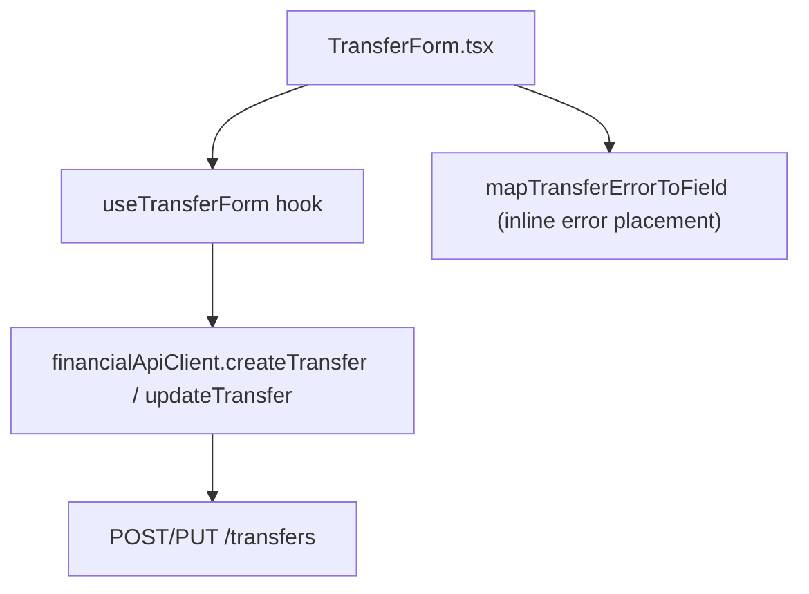

# F04. Web Transfer Entry Form

## 1. Technical Overview

**What:** A new `TransferForm` React component (source/destination bank pickers, amount, date, optional note) plus a dedicated `useTransferForm` hook that owns its create/edit state and talks to F01's `/transfers` endpoints. Together they are a fully working, independently testable feature — creating and editing a transfer, with inline field-level validation for both the client-side same-bank check and backend validation errors.

**Why:** The PRD attributes the *trigger* ("Move money" button, mounting location) to F06 (Section 6: "Extends the existing `BanksGrid` component... each bank row gains 'Move money' (opens F04)"), which isn't built yet — F06 is Wave 4, F04 is Wave 2 (PRD Section 8). Everything else — the form itself, its validation, and its API orchestration — is squarely F04's own scope per its Capabilities and Experience blocks. Building the form and its state management now, decoupled from any specific host, means F06 only has to render `<TransferForm>` and wire a trigger button when its own turn comes, exactly as F04 consumes F01's already-complete API instead of building it inline.

**Scope:**
- Included: `TransferForm.tsx` (presentational, controlled component); `useTransferForm.ts` (create/edit state + API calls); `TransferDto`/`CreateTransferDto`/`UpdateTransferDto` types; `financialApiClient` methods for `POST /transfers`, `PUT /transfers/{id}`; inline field-level validation for both the client-side same-bank check and backend error messages.
- Excluded: any trigger button or mounting into `BanksGrid`/`MonthlyPage` (F06's job); the transfer history list (F06); `DELETE /transfers/{id}` wiring (F06, per PRD Experience: "Delete is triggered from F06's history list, not from this form").

## 2. Architecture Impact

**Affected components:**
- `Financial.Web/src/api/types.ts` — adds `TransferDto`, `CreateTransferDto`, `UpdateTransferDto`
- `Financial.Web/src/api/financialApiClient.ts` — adds `createTransfer`, `updateTransfer` methods
- `Financial.Web/src/hooks/useTransferForm.ts` — new hook
- `Financial.Web/src/components/TransferForm.tsx` — new component
- `Financial.Web/src/components/TransferForm.css` — new (or appended to existing shared form styles, see Decisions)

## 3. Technical Decisions

| Decision | Chosen Approach | Alternative Considered | Trade-off |
|----------|-----------------|-------------------------|-----------|
| State ownership | A dedicated `useTransferForm(banks, onSaved)` hook, not an extension of the existing `useMonthly` reducer | Add Transfer's create/edit slice to `useMonthly`, matching how Expense and Income state lives there | `useMonthly` is already a single ~1,100-line reducer covering fetch + Expense CRUD + Income CRUD. Transfer's state is small and self-contained (no "list" concern of its own yet — that's F06's history view). A small dedicated hook keeps F04 decoupled from `useMonthly` and from presuming how F06 will structure its own state; F06 can call `useTransferForm` directly when it builds the page wiring. Matches CLAUDE.md's anti-over-engineering guidance better than growing an already-large reducer for a feature whose host doesn't exist yet. |
| Per-field inline error placement | A pure `mapTransferErrorToField(message, sourceBank, destinationBank)` function pattern-matches F01's known, fixed error strings ("Bank '{name}' was not found.", "...different banks.", "...greater than zero.") to decide which field to show the error under; falls back to a general error banner (matching `IncomeForm`/`ExpenseForm`'s existing pattern) when no field can be determined (e.g. a network failure) | Have the backend return a structured field name alongside the message | The PRD explicitly requires backend errors "displayed inline under the relevant field" (Error Handling) while F01's contract (already shipped) only returns a message string via `Problem()`. Changing F01's response shape now would touch a already-complete, tested feature for a frontend-only requirement. Pattern-matching the known, stable error strings is pragmatic and self-contained to this feature; if F01's messages ever change, this mapping and its tests catch the drift immediately (they assert against the exact strings). |
| Client-side same-bank check | Computed at render time in `TransferForm` from the `sourceBank`/`destinationBank` props (`sourceBank === destinationBank`, both non-empty) — no dedicated hook state, submit button disabled while true | Validate only in the hook's `submit()`, surfaced after a submit attempt like Expense/Income's field checks | The PRD calls for "immediate feedback" specifically for this check (Capabilities), unlike the required-field checks which validate at submit time following the established `useMonthly` pattern. A derived render-time value updates on every selection change without an extra dispatch/round trip, and disabling submit satisfies "blocks submission" without needing the user to click first. |
| Destination bank dropdown options | Filters `banks` to exclude whichever bank is currently selected as `sourceBank` (PRD Capabilities: "destination bank dropdown (excludes whatever is currently selected as source)") | Show all banks and rely solely on the inline error | Direct PRD requirement — the dropdown itself narrows the choice, and the inline same-bank message is a defense-in-depth backstop for the moment `sourceBank` changes to match an already-selected `destinationBank`. |
| Date defaults to today on open | `openCreateForm()` initializes `date` to today's date (`new Date().toISOString().slice(0, 10)`) | Leave blank like `ExpenseForm`/`IncomeForm`'s create date | Direct PRD requirement (Capabilities: "date picker (defaults to today)") — a deliberate deviation from the existing Expense/Income create-date pattern (which starts blank), not an oversight. |

## 4. Component Overview

**Frontend:**

| File Path | New/Modified | Purpose | Key Responsibilities |
|-----------|--------------|---------|-----------------------|
| `Financial.Web/src/api/types.ts` | Modified | DTO shapes | `TransferDto { id, date, sourceBank, destinationBank, amount, note }`; `CreateTransferDto`/`UpdateTransferDto { date, sourceBank, destinationBank, amount, note }` (note optional/nullable) |
| `Financial.Web/src/api/financialApiClient.ts` | Modified | HTTP calls | `createTransfer: (request: CreateTransferDto) => Promise<TransferDto>` → `POST /transfers`; `updateTransfer: (id: string, request: UpdateTransferDto) => Promise<TransferDto>` → `PUT /transfers/{id}`, following the exact `createIncome`/`updateIncome` pattern |
| `Financial.Web/src/hooks/useTransferForm.ts` | New | State + orchestration | `useState`-based (not `useReducer` — see Decisions); exposes `isOpen`, `isEditing`, field values, `isSaving`, `saveError`, `saveErrorField`; `openCreateForm()` (defaults date to today, banks[0] as source), `openEditForm(transfer)` (pre-fills from a `TransferDto`), `cancel()`, `setField(field, value)`, `submit()` (validates required fields, calls create or update, calls `onSaved()` and closes on success) |
| `Financial.Web/src/components/TransferForm.tsx` | New | Presentational form | Mirrors `IncomeForm`'s prop-driven structure exactly; source/destination bank `<select>`s, amount `<input type="number" step="0.01">`, date `<input type="date">`, optional note `<input type="text">`; computes and displays the same-bank inline error; renders `saveError` either under the field `saveErrorField` identifies or as a general banner when `saveErrorField` is null |
| `Financial.Web/src/hooks/mapTransferErrorToField.ts` | New | Error-to-field mapping | Pure function; exported separately from the hook for direct unit testing |

## 5. API Contracts

No new backend endpoints — F01 already provides `POST /transfers` and `PUT /transfers/{id}` (see `docs/prd/P20-prd-bank-transfers-and-balance-reconciliation/features/P20-F01-bank-transfer-domain-api/spec.md` for the full contract). This feature only adds the frontend client methods calling them:

**`createTransfer`**
- **Calls:** `POST /transfers` with `CreateTransferDto` body
- **Returns:** `TransferDto`
- **Error surfaced verbatim from:** F01's `Problem()` responses — `"Bank '{name}' was not found."`, `"A transfer must move money between two different banks."`, `"Transfer amount must be greater than zero."`

**`updateTransfer`**
- **Calls:** `PUT /transfers/{id}` with `UpdateTransferDto` body
- **Returns:** `TransferDto`
- **Error surfaced verbatim from:** same 400 messages as create, plus 404 `"Transfer '{id}' was not found."`

## 6. Data Model

No changes — this feature is a pure frontend consumer of F01's existing `Transfer` persistence.

## 7. Testing Strategy

| Test File | Test Type | Target | Coverage |
|-----------|-----------|--------|----------|
| `Financial.Web/src/components/__tests__/TransferForm.test.tsx` | Component (RTL) | `TransferForm` | Renders create/edit titles and pre-filled values; destination dropdown excludes the selected source bank; shows the same-bank inline error and disables submit when source equals destination; calls `onSave`/`onCancel`; renders `saveError` under the field named by `saveErrorField`, or as a general banner when `saveErrorField` is null; shows "Saving..." and disables the button while `isSaving` |
| `Financial.Web/src/hooks/__tests__/useTransferForm.test.ts` | Hook (`renderHook`) | `useTransferForm` | `openCreateForm` defaults date to today and source to `banks[0]`; `openEditForm` pre-fills every field from a `TransferDto`; `submit` blocks on required-field gaps with a `saveError`; `submit` calls `createTransfer`/`updateTransfer` (mocking `financialApiClient` per project convention), sets `isSaving` during the call, calls `onSaved` and closes the form on success, and sets `saveError`/`saveErrorField` on failure |
| `Financial.Web/src/hooks/__tests__/mapTransferErrorToField.test.ts` | Unit | `mapTransferErrorToField` | Each of the three known F01 error strings maps to the correct field (`sourceBank`, `destinationBank`, `amount`); an unresolvable-bank message maps to whichever field's current value matches the named bank; an unrecognized message returns `null` |
| `Financial.Web/src/api/financialApiClient.test.ts` | Unit | `createTransfer`/`updateTransfer` | Success path returns the parsed `TransferDto`; non-ok response throws `ApiError` with the server's message, following the existing `createIncome`/`updateIncome` test pattern |

**Acceptance tests (PRD Section 9, F04):**
- Submitting the form with a valid source bank, destination bank, amount, and date creates a transfer visible in F06's history list → `useTransferForm.test.ts` (submit calls `createTransfer` and succeeds); the "visible in F06's history list" half is F06's own responsibility once built
- Selecting the same bank for source and destination shows an inline validation error and blocks submission → `TransferForm.test.tsx`
- Editing an existing transfer via the form updates it, reflected in F06's balances and history after save → `useTransferForm.test.ts` (submit in edit mode calls `updateTransfer` and calls `onSaved`); the balances/history refresh is F06's own responsibility once it calls this hook
- A backend validation error (e.g. amount ≤ 0) is displayed inline under the amount field → `mapTransferErrorToField.test.ts`, `TransferForm.test.tsx`

**Soft-fail note (documented up front, not discovered late):** this feature has no host page to mount into until F06 ships (PRD Wave 4). A live-browser smoke test of the open → fill → submit flow is not possible in this run; behavior is instead verified exhaustively at the hook and component test layers described above, which exercise every user-facing interaction `TransferForm` supports.
