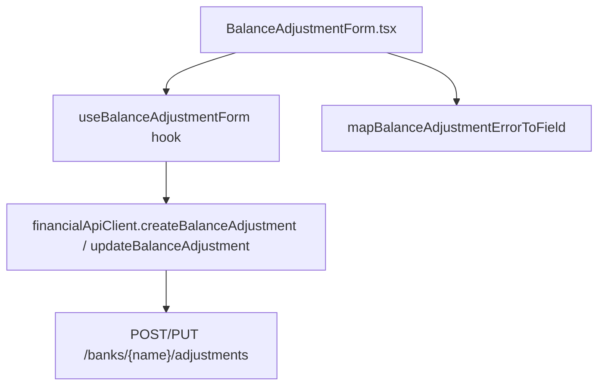

# F05. Web Balance Adjustment Entry Form

## 1. Technical Overview

**What:** A new `BalanceAdjustmentForm` React component plus a dedicated `useBalanceAdjustmentForm` hook, following the exact structural pattern F04 established for `TransferForm`/`useTransferForm`: a presentational, controlled component; a small `useState`-based hook owning create/edit state and F02's API calls; a pure error-to-field mapping function. It shows a read-only reference balance, lets the user enter a target balance, and displays the backend-computed delta after a successful save.

**Why:** F05's dependencies (F02, F03) are both complete; its host (F06, "Correct balance" action on each bank row) is not — same Wave-2-vs-Wave-4 gap F04 had with F01/F06. F04's spec already worked out the right shape for a form-without-a-host-yet in this codebase (dedicated small hook, not the `useMonthly` reducer; soft-failed browser smoke check documented up front); F05 reuses that shape rather than re-deriving it.

**Scope:**
- Included: `BalanceAdjustmentForm.tsx` (presentational component); `useBalanceAdjustmentForm.ts` (create/edit state + F02 API orchestration); `mapBalanceAdjustmentErrorToField.ts`; `BalanceAdjustmentDto`/`CreateBalanceAdjustmentDto`/`UpdateBalanceAdjustmentDto` types; `financialApiClient` methods for `POST /banks/{name}/adjustments` and `PUT /banks/{name}/adjustments/{id}`; the post-save delta confirmation display.
- Excluded: any trigger button or mounting into `BanksGrid`/`MonthlyPage` (F06's job); the adjustment history list (F06); `DELETE /banks/{name}/adjustments/{id}` wiring (F06, per PRD Experience — deletion happens from F06's history list in every other form in this PRD).

## 2. Architecture Impact

**Affected components:**
- `Financial.Web/src/api/types.ts` — adds `BalanceAdjustmentDto`, `CreateBalanceAdjustmentDto`, `UpdateBalanceAdjustmentDto`
- `Financial.Web/src/api/financialApiClient.ts` — adds `createBalanceAdjustment`, `updateBalanceAdjustment`
- `Financial.Web/src/hooks/mapBalanceAdjustmentErrorToField.ts` — new
- `Financial.Web/src/hooks/useBalanceAdjustmentForm.ts` — new
- `Financial.Web/src/components/BalanceAdjustmentForm.tsx` — new

## 3. Technical Decisions

| Decision | Chosen Approach | Alternative Considered | Trade-off |
|----------|-----------------|-------------------------|-----------|
| Bank selection | The hook takes the target bank name and its current reference balance as arguments to `openCreateForm(bankName, currentBalance)`/`openEditForm(bankName, currentBalance, adjustment)`, not a bank picker field | A `banks: BankDto[]` prop with a `<select>`, matching `TransferForm`'s source/destination pickers | The PRD's Experience is explicit: this form opens from a specific bank row ("Correct balance" action **on each bank row**) — the bank is already fixed by the time the form opens, unlike a transfer which always needs two banks chosen. No picker is needed or asked for. |
| Reference balance sourcing | `currentBalance` is passed in by the caller (already available from the existing `GET /banks/month/{year}/{month}/balances` fetch a host page like `MonthlyPage` already performs via `useMonthly`) rather than fetched inside this hook | Have `useBalanceAdjustmentForm` call `getBankBalancesByMonth` itself | PRD Capabilities is explicit: "read-only... line sourced from the **existing** balances endpoint" and F03's spec confirms no new endpoint was added for this. The figure is already fetched once by whatever page hosts the balances view; re-fetching inside this form would be a redundant network call for a value the host already has in memory. |
| Displaying the post-save delta | On a successful save, the hook does **not** immediately reset to the closed state. It stores the response's `delta` in `savedDelta` and keeps the form open in a "saved" state; the component renders a confirmation ("Adjustment of −£4.20 recorded") with a "Close" button. `onSaved()` still fires immediately on success (so a future host can refetch balances/history right away) — only the visual close is deferred to the user's dismissal | Close immediately and call `onSaved()`, matching `TransferForm`'s exact close-on-success behavior | F04's Experience explicitly said "the form closes" on success; F05's Experience instead dedicates its own bullet to displaying the delta ("displays the resulting delta... using the value returned in the backend response") — a deliberate difference, not an omission. Firing `onSaved()` at save time (not at dismissal) still satisfies "reflected in F06 after save" as soon as the save completes, independent of when the user closes the confirmation. |
| Target balance validation | Client-side: required + must parse as a non-negative number (immediate feedback on blur/submit, matching the "≥ 0" requirement in Capabilities). Backend's `"Balance cannot be negative."` message maps to the `targetBalance` field via `mapBalanceAdjustmentErrorToField`, mirroring `mapTransferErrorToField`'s pattern from F04 | — | Direct PRD requirement; same inline-error mechanism F04 already established for exactly this reason (F02's `Problem()` responses carry only a message, no field indicator). |

## 4. Component Overview

**Frontend:**

| File Path | New/Modified | Purpose | Key Responsibilities |
|-----------|--------------|---------|-----------------------|
| `Financial.Web/src/api/types.ts` | Modified | DTO shapes | `BalanceAdjustmentDto { id, date, bank, targetBalance, delta, note }`; `CreateBalanceAdjustmentDto`/`UpdateBalanceAdjustmentDto { date, targetBalance, note }` (bank comes from the route, matching F02's actual endpoint shape) |
| `Financial.Web/src/api/financialApiClient.ts` | Modified | HTTP calls | `createBalanceAdjustment: (bankName: string, request: CreateBalanceAdjustmentDto) => Promise<BalanceAdjustmentDto>` → `POST /banks/{name}/adjustments`; `updateBalanceAdjustment: (bankName: string, id: string, request: UpdateBalanceAdjustmentDto) => Promise<BalanceAdjustmentDto>` → `PUT /banks/{name}/adjustments/{id}` |
| `Financial.Web/src/hooks/mapBalanceAdjustmentErrorToField.ts` | New | Error-to-field mapping | Pure function; `"...cannot be negative."` → `'targetBalance'`; an unresolvable-bank message (no field to attach it to, since this form has no bank picker) and anything unrecognized → `null` (general banner) |
| `Financial.Web/src/hooks/useBalanceAdjustmentForm.ts` | New | State + orchestration | `useState`-based; exposes `isOpen`, `isEditing`, `bankName`, `currentBalance`, field values, `isSaving`, `saveError`, `saveErrorField`, `savedDelta`; `openCreateForm(bankName, currentBalance)` (defaults date to today); `openEditForm(bankName, currentBalance, adjustment)` (pre-fills `targetBalance`/`date`/`note`); `cancel()` (resets to closed, clearing `savedDelta`); `setField(field, value)`; `submit()` (validates, calls create or update, sets `savedDelta` and calls `onSaved()` on success, keeping the form open in the saved state) |
| `Financial.Web/src/components/BalanceAdjustmentForm.tsx` | New | Presentational form | Read-only "Current calculated balance: £X" line (from the `currentBalance` prop, never recomputed); target balance input; date input; optional note; renders the saved-state confirmation (`savedDelta` formatted with sign, e.g. "Adjustment of −£4.20 recorded") with a Close button when `savedDelta !== null`, otherwise the editable form; backend errors rendered under the field `saveErrorField` identifies or as a general banner |

## 5. API Contracts

No new backend endpoints — F02 already provides `POST /banks/{name}/adjustments` and `PUT /banks/{name}/adjustments/{id}` (see `docs/prd/P20-prd-bank-transfers-and-balance-reconciliation/features/P20-F02-balance-adjustment-domain-api/spec.md`). This feature only adds the frontend client methods calling them.

**`createBalanceAdjustment`**
- **Calls:** `POST /banks/{name}/adjustments` with `CreateBalanceAdjustmentDto` body
- **Returns:** `BalanceAdjustmentDto` (including the server-computed `delta`)
- **Error surfaced verbatim from:** F02's `Problem()` responses — `"Bank '{name}' was not found."`, `"Balance cannot be negative."`

**`updateBalanceAdjustment`**
- **Calls:** `PUT /banks/{name}/adjustments/{id}` with `UpdateBalanceAdjustmentDto` body
- **Returns:** `BalanceAdjustmentDto` with a recomputed `delta`
- **Error surfaced verbatim from:** same 400 messages as create, plus 404 `"Balance adjustment '{id}' was not found."`

## 6. Data Model

No changes — this feature is a pure frontend consumer of F02's existing `BalanceAdjustment` persistence.

## 7. Testing Strategy

| Test File | Test Type | Target | Coverage |
|-----------|-----------|--------|----------|
| `Financial.Web/src/components/__tests__/BalanceAdjustmentForm.test.tsx` | Component (RTL) | `BalanceAdjustmentForm` | Renders "Current calculated balance: £X" from the `currentBalance` prop unconditionally (create and edit); renders create/edit titles and pre-filled edit values; shows the saved-state confirmation with the formatted `savedDelta` (positive and negative) and a Close button when `savedDelta` is set, hiding the editable fields; calls `onSave`/`onCancel`/close callback; renders `saveError` under the field `saveErrorField` names, or as a general banner; shows "Saving..." and disables the button while `isSaving` |
| `Financial.Web/src/hooks/useBalanceAdjustmentForm.test.ts` | Hook (`renderHook`) | `useBalanceAdjustmentForm` | `openCreateForm` defaults date to today, stores `bankName`/`currentBalance`, `savedDelta` is `null`; `openEditForm` pre-fills `targetBalance`/`date`/`note` from a `BalanceAdjustmentDto`; `submit` blocks on a missing or negative target balance with `saveErrorField: 'targetBalance'`; `submit` calls `createBalanceAdjustment`/`updateBalanceAdjustment` (mocking `financialApiClient`), sets `isSaving` during the call, sets `savedDelta` from the response and calls `onSaved()` on success while `isOpen` stays `true`; sets `saveError`/`saveErrorField` on failure; `cancel` clears `savedDelta` and closes |
| `Financial.Web/src/hooks/mapBalanceAdjustmentErrorToField.test.ts` | Unit | `mapBalanceAdjustmentErrorToField` | `"Balance cannot be negative."` maps to `'targetBalance'`; an unresolvable-bank message and an unrecognized message both map to `null` |
| `Financial.Web/src/api/financialApiClient.test.ts` | Unit | `createBalanceAdjustment`/`updateBalanceAdjustment` | Success path returns the parsed `BalanceAdjustmentDto` including `delta`; request URL/method/body match the endpoint contract, following the existing `createTransfer`/`updateTransfer` test pattern |

**Acceptance tests (PRD Section 9, F05):**
- Opening the form for a bank displays the current calculated balance exactly as returned by the backend → `BalanceAdjustmentForm.test.tsx` (renders `currentBalance` prop verbatim, no arithmetic)
- Submitting a target balance creates an adjustment and displays the backend-returned delta, not a client-computed one → `useBalanceAdjustmentForm.test.ts` (`savedDelta` comes from the response), `BalanceAdjustmentForm.test.tsx` (confirmation renders it)
- Submitting a negative target balance shows an inline validation error and blocks submission → `useBalanceAdjustmentForm.test.ts`, `BalanceAdjustmentForm.test.tsx`
- Editing an existing adjustment's target balance updates its stored delta, reflected in F06 after save → `useBalanceAdjustmentForm.test.ts` (submit in edit mode calls `updateBalanceAdjustment` and calls `onSaved`); the "reflected in F06" half is F06's own responsibility once it calls this hook, same documented gap as F04's equivalent criteria

**Soft-fail note (documented up front):** same as F04 — no host page exists to mount into until F06 ships. A live-browser smoke test isn't possible in this run; hook and component tests exercise every interaction this form supports instead.
