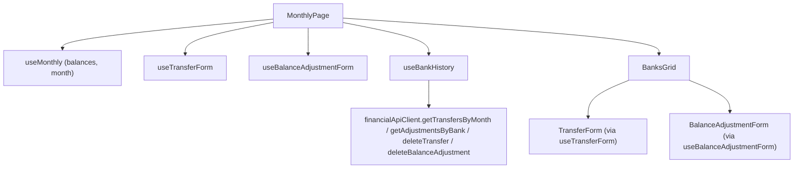

# F06. Web Bank Balances & History View

## 1. Technical Overview

**What:** Extends `BanksGrid` with per-row "Move money"/"Correct balance" actions and an expandable, reverse-chronological history of transfers and adjustments touching that bank; wires `TransferForm` (F04) and `BalanceAdjustmentForm` (F05) into `MonthlyPage`; adds a new `useBankHistory` hook that fetches and combines F01/F02 data, month-scoped, with delete support.

**Why:** This is the final feature in the PRD (Wave 4) and the first one with a real host page. F01–F05 all shipped complete, independently-tested, but disconnected pieces — a backend API + calculation engine, and two forms with no way to open them. F06's entire job is composition: nothing here introduces new business logic (the PRD is explicit — "the component performs no arithmetic on income, expense, transfer, or adjustment data"), it wires already-correct pieces together and, for the first time in this PRD, closes the "no host page" gap that forced F04 and F05 to soft-fail their browser smoke tests.

**Scope:**
- Included: `BanksGrid.tsx` extension (actions, expandable history rows); new `useBankHistory` hook (fetch transfers by month + adjustments by bank, combine, sort, delete); `financialApiClient` additions (`getTransfersByMonth`, `getAdjustmentsByBank`, `deleteTransfer`, `deleteBalanceAdjustment` — the two delete methods F04/F05 explicitly deferred here); `MonthlyPage.tsx` wiring (renders `TransferForm`/`BalanceAdjustmentForm`, passes handlers to `BanksGrid`, composes refresh across `useMonthly`/`useTransferForm`/`useBalanceAdjustmentForm`/`useBankHistory`); a small, backward-compatible extension to `useTransferForm.openCreateForm` to accept a preselected source bank (see Decisions).
- Excluded: any change to the balance calculation itself (F03 already produces the correct number; this feature only renders it) — F04/F05's requirement to render backend errors verbatim already covers the create/edit paths this feature triggers.

## 2. Architecture Impact

**Affected components:**
- `Financial.Web/src/api/financialApiClient.ts` — adds `getTransfersByMonth`, `getAdjustmentsByBank`, `deleteTransfer`, `deleteBalanceAdjustment`
- `Financial.Web/src/hooks/useBankHistory.ts` — new
- `Financial.Web/src/hooks/useTransferForm.ts` — modified (`openCreateForm` gains an optional preselected bank)
- `Financial.Web/src/hooks/useMonthly.ts` — modified (exposes raw `year`/`month` alongside the existing `monthInputValue`, so `useBankHistory` can be driven by the same selected month without re-parsing it)
- `Financial.Web/src/components/BanksGrid.tsx` — modified (actions, expandable history)
- `Financial.Web/src/components/BanksGrid.css` — new (expand/collapse and history row styling; the first CSS file this PRD adds — F04/F05 reused existing `monthly-page__*` classes for the form panel itself, but the history table needs new, dedicated styling)
- `Financial.Web/src/pages/MonthlyPage.tsx` — modified (renders `TransferForm`/`BalanceAdjustmentForm`, wires `BanksGrid`'s new props, composes cross-hook refresh)

## 3. Technical Decisions

| Decision | Chosen Approach | Alternative Considered | Trade-off |
|----------|-----------------|-------------------------|-----------|
| Where combined history state lives | A new, dedicated `useBankHistory(year, month, banks, onChanged)` hook, not folded into `useMonthly` | Add transfer/adjustment history fetching directly into `useMonthly` | Continues the precedent F04/F05 already set (small dedicated hooks instead of growing the already-large `useMonthly` reducer). History has its own fetch/combine/sort/delete lifecycle distinct from `useMonthly`'s create/edit-form state pattern. |
| Sourcing adjustment history per bank | `GET /banks/{name}/adjustments` (F02's only list endpoint — unscoped by month) called once per bank (3 banks), then filtered client-side to entries whose `date` falls in the selected year/month | Add a new month-scoped adjustments endpoint to the backend | F02 already shipped and is complete; changing its contract now to add a query parameter is out of proportion for a personal, single-user app with only 3 banks (3 small requests, not a scaling concern). Client-side date filtering is a display filter, not arithmetic — it doesn't touch the "no calculation in the frontend" guarantee, which is about the *balance figure*, not about which rows are visible. |
| Sourcing transfer history | `GET /transfers/month/{year}/{month}` (F01's existing month-scoped endpoint), filtered client-side to entries where the row's bank is `sourceBank` or `destinationBank` | `GET /transfers/bank/{name}` (F01's other list endpoint, unscoped by month) called per bank | The month-scoped endpoint already returns exactly the window this feature needs in one call instead of three, and F01's spec explicitly designed the bank-scoped endpoint for a different consumer shape ("no 404 for an unrecognized bank name — returns an empty array, matching read-only filter semantics" language suggests broader use, but the month endpoint is the natural fit when the page is already month-scoped, as `MonthlyPage` is for every other list). |
| `useTransferForm.openCreateForm` signature | Adds an optional second parameter, `openCreateForm(preselectedSourceBank?: string)`; when provided, it's used instead of `banks[0]` | Leave the hook unchanged and have `MonthlyPage` call `openCreateForm()` then immediately `setField('sourceBank', bankName)` | F04's spec anticipated this hook would eventually be driven by a specific bank row ("Move money" appears per-row in F06's own PRD text) but didn't have a caller yet to confirm the exact shape. A single optional parameter is a minor, backward-compatible extension — F04's own tests (`openCreateForm defaults date to today and source to the first bank`) still pass unchanged when called with no argument. |
| `useMonthly` exposing raw `year`/`month` | Adds `year: number` and `month: number` to the returned `MonthlyData`, alongside the existing formatted `monthInputValue` | Have `MonthlyPage` re-derive year/month by parsing `monthInputValue` itself | `useMonthly` already tracks `state.year`/`state.month` internally; exposing them is a one-line additive change versus duplicating `parseMonthInputValue` logic in the page for a value the hook already has. |
| Delete confirmation | `useBankHistory`'s `deleteTransfer`/`deleteAdjustment` call `window.confirm(...)` before deleting, matching `useMonthly.deleteExpense`/`deleteIncome`'s exact pattern | Confirm in the component | Matches the established convention in this codebase precisely — the hook layer owns confirmation, not the presentational component. |
| History entry type classification | Each combined entry carries a `kind: 'transferIn' | 'transferOut' | 'adjustment'` computed once when the entry is built (comparing `sourceBank`/`destinationBank` to the row's bank for transfers), not recomputed at render time | Compute the label inline in `BanksGrid` | Keeps `BanksGrid` a pure renderer of already-classified data, consistent with "the component performs no arithmetic" — classification by bank role isn't a balance calculation, but keeping it out of the render path all the same avoids any doubt. |

## 4. Component Overview

**Frontend:**

| File Path | New/Modified | Purpose | Key Responsibilities |
|-----------|--------------|---------|-----------------------|
| `Financial.Web/src/api/financialApiClient.ts` | Modified | HTTP calls | `getTransfersByMonth: (year, month) => Promise<TransferDto[]>` → `GET /transfers/month/{year}/{month}`; `getAdjustmentsByBank: (bankName) => Promise<BalanceAdjustmentDto[]>` → `GET /banks/{name}/adjustments`; `deleteTransfer: (id) => Promise<void>` → `DELETE /transfers/{id}`; `deleteBalanceAdjustment: (bankName, id) => Promise<void>` → `DELETE /banks/{name}/adjustments/{id}` |
| `Financial.Web/src/hooks/useBankHistory.ts` | New | Fetch, combine, delete | On `[year, month, banks]` change: fetches `getTransfersByMonth(year, month)` once and `getAdjustmentsByBank(bank.name)` for every bank in parallel; combines into `BankHistoryEntry[]` per bank (transfers classified `transferIn`/`transferOut` by comparing to the bank; adjustments filtered to the selected month), sorted by date descending; exposes `historyByBank: Record<string, BankHistoryEntry[]>`, `isLoading`, `error`, `retry()`, `deleteTransfer(id)`, `deleteAdjustment(bankName, id)` (each confirms via `window.confirm`, calls the client, refetches history, and calls `onChanged()`) |
| `Financial.Web/src/hooks/useTransferForm.ts` | Modified | Preselected source bank | `openCreateForm(preselectedSourceBank?: string)` — uses `preselectedSourceBank ?? banks[0]?.name ?? ''` |
| `Financial.Web/src/hooks/useMonthly.ts` | Modified | Expose raw month | Returned `MonthlyData` gains `year: number` and `month: number` |
| `Financial.Web/src/components/BanksGrid.tsx` | Modified | Actions + history | Each row gains "Move money"/"Correct balance" buttons and an expand toggle; the expanded row renders a nested table of that bank's `BankHistoryEntry[]` (date, type label, counterpart bank or delta, note, edit/delete actions) |
| `Financial.Web/src/components/BanksGrid.css` | New | Styling | Expand/collapse chevron, nested history table, type-label badges |
| `Financial.Web/src/pages/MonthlyPage.tsx` | Modified | Composition | Instantiates `useTransferForm`/`useBalanceAdjustmentForm`/`useBankHistory` alongside the existing `useMonthly`; each form's `onSaved` and `useBankHistory`'s delete completions call both `useMonthly`'s `retry()` (refresh balances) and `useBankHistory`'s `retry()` (refresh history); renders `TransferForm`/`BalanceAdjustmentForm` conditionally on `isOpen`, positioned near `BanksGrid` on the Summary subtab |

## 5. API Contracts

No new backend endpoints — this feature only adds frontend client methods for endpoints F01/F02 already ship:
- `GET /transfers/month/{year}/{month}` (F01) — new client method `getTransfersByMonth`
- `GET /banks/{name}/adjustments` (F02) — new client method `getAdjustmentsByBank`
- `DELETE /transfers/{id}` (F01) — new client method `deleteTransfer`
- `DELETE /banks/{name}/adjustments/{id}` (F02) — new client method `deleteBalanceAdjustment`

`GET /banks/month/{year}/{month}/balances` (F03) is already consumed by `useMonthly` — unchanged.

## 6. Data Model

No changes — this feature only reads and deletes data F01/F02 already persist.

## 7. Testing Strategy

| Test File | Test Type | Target | Coverage |
|-----------|-----------|--------|----------|
| `Financial.Web/src/api/financialApiClient.test.ts` | Unit | New client methods | Each of the 4 new methods constructs the correct URL/method, following the existing pattern |
| `Financial.Web/src/hooks/useBankHistory.test.ts` | Hook (`renderHook`) | `useBankHistory` | Combines transfers (classified `transferIn`/`transferOut` per bank) and adjustments (filtered to the selected month) into `historyByBank`, sorted descending by date; `deleteTransfer`/`deleteAdjustment` confirm via `window.confirm`, skip the call when the user cancels, call the client and `onChanged()` on confirm; `isLoading`/`error`/`retry()` behave like `useMonthly`'s existing fetch lifecycle |
| `Financial.Web/src/hooks/useTransferForm.test.ts` | Hook | `openCreateForm` extension | A new test: `openCreateForm('Trading212')` sets `sourceBank` to `'Trading212'` instead of `banks[0]`; the existing no-argument test still passes unchanged |
| `Financial.Web/src/components/__tests__/BanksGrid.test.tsx` | Component (RTL) | `BanksGrid` | Renders "Move money"/"Correct balance" buttons per row, calling the corresponding callback with that row's bank (and current balance, for adjustments); expand toggle shows/hides the history table; history rows render date, type label, counterpart/delta, and note; edit/delete buttons call their callbacks with the right entry |
| `Financial.Web/src/pages/__tests__/MonthlyPage.test.tsx` (existing file, extended if present, or new) | Component (RTL) | `MonthlyPage` composition | Opening "Move money" from a bank row renders `TransferForm` pre-filled with that bank as source; a successful save refreshes both balances and history (asserted via re-fetch mock call counts) |

**Acceptance tests (PRD Section 9, F06):**
- Each bank row displays the balance figure exactly as returned by the balances endpoint, with no client-side recalculation → already true of the existing `BanksGrid`/`useMonthly` data flow (unchanged by this feature); reconfirmed by the existing `BanksGrid.test.tsx` balance-rendering test plus F03's own backend coverage
- The history section for a bank lists both transfers (in and out) and adjustments touching that bank, in reverse-chronological order → `useBankHistory.test.ts`, `BanksGrid.test.tsx`
- Deleting a transfer or adjustment from the history list removes it after confirmation and refreshes the displayed balance → `useBankHistory.test.ts` (delete + `onChanged`), `MonthlyPage.test.tsx` (refresh propagates to balances)
- Editing a transfer or adjustment from the history list opens the corresponding form (F04 or F05) pre-filled with its current values → `MonthlyPage.test.tsx` (wires `openEditForm` from a history row's edit button), reusing F04/F05's own pre-fill coverage for the form's behavior once opened

**Cross-Feature Integration criteria touching F06 (PRD Section 9):**
- "A transfer created through F04 is persisted via F01 and appears correctly in F06's history list and balance display" → `MonthlyPage.test.tsx` end-to-end test plus the live-browser smoke check (Section 6.4 of the implement-feature process) now possible for the first time in this PRD
- "An adjustment created through F05... appears correctly in F06's history list and balance display" → same, for the adjustment path
- "F06's displayed balances and history are consistent with the raw data returned directly by F01, F02, and F03's endpoints" → the same `MonthlyPage.test.tsx` coverage, since every value rendered traces directly to a mocked client response with no intermediate transformation beyond sorting/classification
