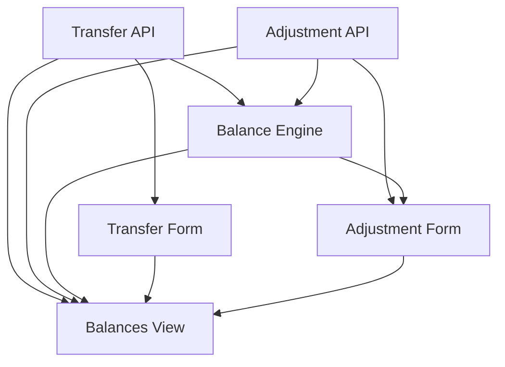

# Bank Transfers and Balance Reconciliation

## 1. Executive Summary

This product adds two capabilities to the CashFlow domain of the Financial app: recording an internal **transfer** of money between two of the user's own bank accounts, and **reconciling** a bank's computed balance against what the real bank statement shows. Both are for a single user managing their own personal finances after retiring their spreadsheet as the source of truth.

Today the CashFlow domain tracks money leaving a bank as an `Expense` and money entering as an `Income`, and computes a running per-bank balance from `Bank.OpeningBalance` plus the sum of incomes minus expenses. Neither concept fits moving money between two of the user's own accounts (it is not spending and not earning), and there is no way to correct that running balance when it drifts from reality — whether because the user is starting fresh from the spreadsheet and needs an initial figure, or because months of use have accumulated small untracked differences (bank fees, interest, cash movements) that the app has no way to see.

At a high level, this product introduces two new backend entities — `Transfer` (source bank, destination bank, amount, date) and `BalanceAdjustment` (bank, date, target balance, computed delta) — both feeding into the same server-side balance formula that already powers the existing bank-balances view. The web frontend gains a way to record either from that view, and a history list to audit and correct past entries. All balance arithmetic remains exclusively on the backend; the frontend only ever displays numbers the API already computed.

## 2. Problem and Opportunity

**The Problem**

- **No way to represent internal money movement.** Moving £500 from Barclays to Trading212 has no correct home today — recording it as an `Expense` would incorrectly reduce total spending totals shown in category/annual reports, and recording it as an `Income` would incorrectly inflate them. The two operations most personal-finance users perform constantly (paying a card, topping up savings, moving to a round-up account) currently cannot be captured at all.
- **No onboarding path off the spreadsheet.** `Bank.OpeningBalance` exists but is a single fixed starting point set once; there is no dedicated, auditable way to say "as of today, Barclays actually holds £2,340.17" without manually reverse-engineering what opening balance and date would produce that figure through the existing formula.
- **Balance drift has no correction mechanism.** Small amounts the app never sees (bank interest, a fee, a cash withdrawal) will accumulate over months of real use, and the computed balance will silently diverge from the real one — with nothing in the domain to close that gap short of re-deriving a new opening balance by hand.
- **Risk of balance logic leaking into the frontend.** Without an explicit backend-only calculation contract, it would be easy for a "preview the new balance" UI feature to reimplement the balance formula in JavaScript, creating two sources of truth that can silently disagree.

**The Opportunity**

- A dedicated `Transfer` entity closes the "money movement" gap without touching category/expense/income totals — solving the mis-classification problem directly.
- A `BalanceAdjustment` entity gives a first-class, auditable way to reconcile — usable both once (onboarding) and repeatedly (ongoing drift correction) — closing both the onboarding and drift problems with one concept instead of two.
- Extending the existing single balance-calculation service (rather than adding a second one) keeps the "balance is only ever computed on the backend" guarantee intact, directly addressing the leakage risk.

## 3. Target Audience

### Primary Users

**The App Owner**
- A single user managing their own personal finances across 3 UK bank accounts (Barclays, Trading212, Chase), transitioning off a long-maintained spreadsheet.
- Regularly moves money between their own accounts (e.g. funding a round-up savings account, paying off a linked card) and wants that reflected without distorting spending reports.
- Wants confidence that the balance shown in the app matches their real bank app, and a low-friction way to fix it when it doesn't.

## 4. Objectives

**Product Objectives**

- **Capture** internal bank-to-bank money movement without affecting expense/income category totals.
- **Reconcile** any bank's computed balance to a real-world figure the user enters, with the correction stored as an auditable entry rather than a silent overwrite.
- **Guarantee** all balance arithmetic executes exclusively on the backend, with the frontend acting as a pure display layer.
- **Preserve** full editability (create, edit, delete) of transfers and adjustments, matching the existing Expense/Income UX.

**Success Metrics**

- 100% of transfer and adjustment amounts are computed and returned by backend endpoints — zero balance arithmetic present in `Financial.Web` source, verified by code review at completion.
- A transfer between two existing banks is reflected in both banks' computed balances within the same request/response cycle (no separate recompute step needed).
- A balance adjustment brings the computed balance for its bank to exactly the entered target balance as of its date, verified against `GetBankBalancesByMonth`/equivalent for that date.
- Every transfer and adjustment created through the UI can be edited and deleted through the UI, with 0 orphaned entries left in `data-cashflow.json` after a delete.

## 5. User Stories

### F01. Bank Transfer Domain & API
- As the system, I want to persist a transfer between two banks with a date, amount, and optional note so that the money movement is recorded without being treated as an expense or income.
- As a user, I want the system to reject a transfer where the source and destination bank are the same so that I can't create a meaningless entry.
- As a user, I want to edit a transfer I entered incorrectly so that my records stay accurate without deleting and re-creating it.
- As a user, I want to delete a transfer I entered by mistake so that it stops affecting both banks' balances.

### F02. Balance Adjustment Domain & API
- As a user, I want to enter the balance shown on my real bank statement for a given date so that the app computes the correction needed to match it.
- As the system, I want to store the computed delta at the moment the adjustment is created so that the correction remains a stable, auditable entry rather than a value that silently shifts if unrelated computations change later.
- As a user, I want to edit a balance adjustment's target balance or date so that I can fix a mistake without deleting and re-entering it.
- As a user, I want to delete a balance adjustment so that its correction no longer applies.

### F03. Bank Balance Calculation Engine
- As the system, I want to add a transfer's amount to the destination bank's balance and subtract it from the source bank's balance so that transfers are reflected correctly on both sides.
- As the system, I want to apply a balance adjustment's stored delta to its bank's balance from the adjustment's date forward so that the computed balance matches what the user reconciled it to.
- As a user, I want every balance figure I see to have been computed entirely by the backend so that the frontend can never show a number that disagrees with the API.

### F04. Web Transfer Entry Form
- As a user, I want to open a "Move money" form from a bank's row so that I can record a transfer without leaving the balances view.
- As a user, I want to pick a source bank, a destination bank, an amount, a date, and an optional note so that I can fully describe the transfer.
- As a user, I want a clear error if I pick the same bank as source and destination so that I notice the mistake before submitting.
- As a user, I want to edit or delete an existing transfer from the same view so that corrections don't require a different screen.

### F05. Web Balance Adjustment Entry Form
- As a user, I want to open a "Correct balance" form from a bank's row and see the app's currently computed balance so that I know what I'm reconciling against.
- As a user, I want to type the real balance from my bank statement and have the app compute the correction so that I never have to do the subtraction myself.
- As a user, I want to see the resulting adjustment amount after saving so that I understand how large the correction was.

### F06. Web Bank Balances & History View
- As a user, I want to see each bank's current computed balance on the Monthly Summary subtab so that I know where I stand without opening my banking app.
- As a user, I want to see a combined, reverse-chronological history of transfers and adjustments for a bank so that I can audit what changed its balance beyond income and expenses.
- As a user, I want to edit or delete a past transfer or adjustment directly from the history list so that I can fix mistakes in place.

## 6. Functionalities

### F01. Bank Transfer Domain & API

**Provides:**
- Transfer records (id, date, source bank name, destination bank name, amount, note) (used by F03, F04, F06)

**Capabilities:**
- New `Transfer` entity in `Financial.CashFlow.Domain.Entities`: `Id` (Guid), `Date` (DateOnly), `SourceBank` (string), `DestinationBank` (string), `Amount` (decimal, must be strictly greater than 0), `Note` (string?, optional, no length limit — consistent with `Expense.Description`).
- `SourceBank` and `DestinationBank` must each resolve to an existing `Bank` via the existing `BankNameResolver` (case-insensitive match against the 3 seeded banks), and must differ from each other.
- Persisted following the exact pattern established for `Bank`/`Expense`/`Income`: `CashFlowData` gains a private `List<Transfer>` with `AddTransfer`/`UpdateTransfer`/`RemoveTransfer`; `Transfer` is registered in `CashFlowTypeInfoResolver.ManagedTypes`; `ICashFlowRepository`/`CashFlowJsonRepository` gain `GetTransfers`/`AddTransfer`/`UpdateTransfer`/`DeleteTransfer`; persisted under a new `"Transfers"` array in `data-cashflow.json`.
- New `TransfersController` (`[Route("transfers")]`): `POST /transfers` (create), `PUT /transfers/{id:guid}` (update), `DELETE /transfers/{id:guid}` (delete), `GET /transfers/month/{year:int}/{month:int}` (month-scoped list), `GET /transfers/bank/{name}` (all transfers touching a given bank, either as source or destination, for history display).
- Same error-handling convention as `ExpensesController`/`IncomesController`: `ArgumentException` → 400, `KeyNotFoundException` → 404.

**Experience:**
- API-only feature; no direct UI. Consumed by F04 (form) and F06 (history/balances view).

**Error Handling:**
- Creating a transfer with an unresolvable bank name → 400 "Bank '{name}' was not found."
- Creating a transfer with `SourceBank == DestinationBank` → 400 "A transfer must move money between two different banks."
- Creating a transfer with `Amount <= 0` → 400 "Transfer amount must be greater than zero."
- Updating or deleting a transfer with an unknown id → 404 "Transfer '{id}' was not found."
- Save failure (JSON write error) → surfaced as a 500 by the existing repository save path, unchanged from `Expense`/`Income`.

### F02. Balance Adjustment Domain & API

**Consumes:**
- F03: computed balance for a bank as of a given date (used to derive the delta at creation/edit time)

**Provides:**
- Balance adjustment records (id, bank name, date, target balance, delta, note) (used by F03, F05, F06)

**Capabilities:**
- New `BalanceAdjustment` entity: `Id` (Guid), `Date` (DateOnly), `Bank` (string), `TargetBalance` (decimal, must be greater than or equal to 0 — mirrors the existing non-negative rule on `Bank.OpeningBalance`), `Delta` (decimal, computed and persisted at creation/edit time), `Note` (string?, optional).
- `Bank` must resolve to an existing `Bank` via `BankNameResolver`.
- `Delta` is computed server-side as `TargetBalance − (balance computed by F03's engine as of Date, excluding this adjustment)`, then stored — it is never recomputed on read. This keeps the correction stable and auditable: editing `TargetBalance` or `Date` recomputes and re-stores `Delta` at that moment; unrelated later changes elsewhere do not silently shift a past adjustment's recorded delta.
- Persisted following the same pattern as F01 (`CashFlowData` list, repository methods, `CashFlowTypeInfoResolver` registration, new `"BalanceAdjustments"` array).
- New endpoints folded into the existing `BanksController`, matching the precedent that balance reads already live there rather than a separate controller: `POST /banks/{name}/adjustments` (create), `PUT /banks/{name}/adjustments/{id:guid}` (update), `DELETE /banks/{name}/adjustments/{id:guid}` (delete), `GET /banks/{name}/adjustments` (history list).

**Experience:**
- API-only feature; no direct UI. Consumed by F05 (form) and F06 (history/balances view).

**Error Handling:**
- Unresolvable bank name → 400 "Bank '{name}' was not found."
- `TargetBalance < 0` → 400 "Balance cannot be negative."
- Unknown adjustment id on update/delete → 404 "Balance adjustment '{id}' was not found."

### F03. Bank Balance Calculation Engine

**Consumes:**
- F01: transfer records (source bank, destination bank, amount, date)
- F02: balance adjustment records (bank, date, delta)

**Provides:**
- Per-bank computed balance as of a given date (used by F02, F05, F06)

**Capabilities:**
- Extends the existing `IBankService.GetBankBalancesByMonth` (and adds a companion `GetBankBalanceAsOf(bankName, date)` used internally by F02 to compute a new adjustment's delta) so the formula becomes:
  `Balance = OpeningBalance + Σ Income.NetValue − Σ(Expense.Value − RoundUpAmount) + Σ Transfer.Amount (DestinationBank = this bank) − Σ Transfer.Amount (SourceBank = this bank) + Σ BalanceAdjustment.Delta`,
  every sum scoped to `[Bank.OpeningBalanceDate, as-of date]` inclusive — the same date-window rule already applied to Income/Expense.
- This is the single, sole place balance arithmetic is implemented across the whole product. No other backend service and no frontend code duplicates this formula, satisfying the requirement that all balance calculation happen exclusively on the backend.

**Experience:**
- No UI of its own. The existing `GET /banks/month/{year}/{month}/balances` endpoint and its `BankBalanceDTO { Bank, Balance }` shape are unchanged at the contract level — `Balance` simply now factors in transfers and adjustments in addition to income/expense.

### F04. Web Transfer Entry Form

**Consumes:**
- F01: create/update/delete transfer endpoints, and the existing bank list for the source/destination pickers

**Capabilities:**
- New `TransferForm` React component: source bank dropdown (the 3 existing banks), destination bank dropdown (excludes whatever is currently selected as source), amount input (GBP, 2 decimal places), date picker (defaults to today), optional single-line note field.
- Client-side validation is limited to required-field and source≠destination checks for immediate feedback; the backend (F01) remains the authoritative validator, and its error message is surfaced verbatim on a 400 response.

**Experience:**
- Opened via a "Move money" action on each bank row in F06's balances view.
- On submit, calls `POST /transfers` (create) or `PUT /transfers/{id}` (edit); the submit button shows a loading state; on success the form closes and F06's balances and history refresh.
- Edit mode pre-fills all fields from the selected transfer. Delete is triggered from F06's history list, not from this form.

**Error Handling:**
- Backend validation errors (unknown bank, same source/destination, amount ≤ 0) are displayed inline under the relevant field.
- A network or save failure shows a retry-capable error banner; the form retains the user's entered values so nothing is lost.

### F05. Web Balance Adjustment Entry Form

**Consumes:**
- F02: create/update/delete adjustment endpoints
- F03: current computed balance for the selected bank, shown as reference before the user enters the target

**Capabilities:**
- New `BalanceAdjustmentForm` React component: read-only "Current calculated balance: £X" line sourced from the existing balances endpoint (never computed in the browser), target balance input (GBP, 2 decimal places, ≥ 0), date picker (defaults to today), optional note field.
- After a successful save, displays the resulting delta (e.g. "Adjustment of −£4.20 recorded") using the value returned in the backend response, not a client-side calculation.

**Experience:**
- Opened via a "Correct balance" action on each bank row in F06's balances view.
- Edit mode pre-fills `TargetBalance`, `Date`, and `Note`; the backend recomputes `Delta` on save.

**Error Handling:**
- Negative target balance and unknown-bank backend errors surface inline, matching F04's pattern.
- A network or save failure shows a retry-capable error banner, preserving entered values.

### F06. Web Bank Balances & History View

**Consumes:**
- F01: transfer records, for the per-bank history list
- F02: balance adjustment records, for the per-bank history list
- F03: computed balance per bank

**Capabilities:**
- Extends the existing `BanksGrid` component (`Financial.Web/src/components/BanksGrid.tsx`) on the Monthly → Summary subtab: each bank row gains "Move money" (opens F04) and "Correct balance" (opens F05) actions, plus an expandable history section listing that bank's transfers and adjustments in reverse-chronological order — each row shows date, type (Transfer In / Transfer Out / Adjustment), counterpart bank (for transfers) or delta (for adjustments), note, and edit/delete actions.
- The balance figure shown per bank is rendered exactly as returned by the backend (F03) — the component performs no arithmetic on income, expense, transfer, or adjustment data.

**Experience:**
- The history list is scoped to the month currently selected in Monthly, consistent with how the Expense and Income lists already scope to month.
- Deleting a history entry shows a confirmation dialog before calling the corresponding `DELETE` endpoint (F01 or F02), then refreshes both the balance and the list.

**Error Handling:**
- A load failure for balances or history shows a retry action rather than a silent blank state, consistent with existing `MonthlyPage` error handling.

## 7. Out of Scope

**Bank management**
- Adding, renaming, or removing banks. There is still no bank management screen — consistent with the explicit exclusion in P13-F01 and P14-F02. Transfers and adjustments only work against the 3 existing banks (Barclays, Trading212, Chase).

**Other frontends**
- WPF desktop implementation. This PRD covers the React web app only; WPF parity is deferred to a future PRD.

**Money handling**
- Multi-currency or FX conversion on transfers — all 3 existing banks are single-currency GBP. The Controle Mãe BRL/GBP conversion flow is a separate, unrelated concern.
- Overdraft blocking or balance-sufficiency validation on transfers — transfers are allowed unrestricted, matching the fact that no such check exists anywhere else in the domain today.
- Transfers to or from the Reserva pool, credit cards, or investment accounts — those are separate existing flows/domains, not `Bank` entities, and are not touched by this PRD.

**Reporting**
- Category totals or Annual Summary visibility for transfers and adjustments — both stay a Monthly/bank-balance-only concern and never appear in category or annual reporting.

**History and migration**
- A "view all history" page beyond the currently selected month.
- Bulk import of historical transfers/adjustments from the spreadsheet — a future migration-tool concern following the same pattern as prior spreadsheet-import PRDs, not addressed here.

**Notifications**
- Alerts or reminders when a bank's computed balance drifts from a previously entered adjustment.

## 8. Dependency Graph

| # | Feature | Priority | Dependencies |
|---|---------|----------|--------------|
| F01 | Bank Transfer Domain & API | 1 | None |
| F02 | Balance Adjustment Domain & API | 1 | None |
| F03 | Bank Balance Calculation Engine | 1 | F01, F02 |
| F04 | Web Transfer Entry Form | 1 | F01 |
| F05 | Web Balance Adjustment Entry Form | 1 | F02, F03 |
| F06 | Web Bank Balances & History View | 1 | F01, F02, F03, F04, F05 |

### Execution Waves
Features within the same wave can be built in parallel. A wave starts only after every feature in earlier waves is complete.

- **Wave 1**: F01, F02
- **Wave 2**: F03, F04
- **Wave 3**: F05
- **Wave 4**: F06

### Priority levels
- **1** = Essential — product does not work without it
- **2** = Important — significant value addition
- **3** = Desirable — incremental improvement

## 9. Acceptance Criteria

### F01. Bank Transfer Domain & API
- [x] Creating a transfer with two distinct, existing banks, a positive amount, and a date succeeds and is retrievable via `GET /transfers/month/{year}/{month}`.
- [x] Creating a transfer with the same bank as source and destination fails with a 400 error.
- [x] Creating a transfer with an amount of 0 or less fails with a 400 error.
- [x] Creating a transfer with an unresolvable bank name fails with a 400 error.
- [x] Editing a transfer's amount, date, or note persists the change and is reflected on the next `GET`.
- [x] Deleting a transfer removes it from `data-cashflow.json` and from all subsequent `GET` responses.

### F02. Balance Adjustment Domain & API
- [x] Creating a balance adjustment with a valid bank, non-negative target balance, and date succeeds and returns the computed `Delta`.
- [x] The returned `Delta` equals `TargetBalance` minus the balance computed by F03 as of the adjustment's date (excluding the new adjustment itself).
- [x] Creating an adjustment with a negative target balance fails with a 400 error.
- [x] Creating an adjustment with an unresolvable bank name fails with a 400 error.
- [x] Editing an adjustment's target balance or date recomputes and persists a new `Delta`.
- [x] Deleting an adjustment removes it and its `Delta` no longer contributes to that bank's computed balance.

### F03. Bank Balance Calculation Engine
- [x] A transfer's amount is subtracted from the source bank's computed balance and added to the destination bank's computed balance, both for any as-of date on or after the transfer's date.
- [x] A balance adjustment's stored `Delta` is added to its bank's computed balance for any as-of date on or after the adjustment's date.
- [x] A transfer or adjustment dated after the requested as-of date has no effect on the computed balance for that request.
- [x] The computed balance for a bank with no transfers or adjustments in the period is unchanged from the pre-existing Income/Expense-only formula.

### F04. Web Transfer Entry Form
- [x] Submitting the form with a valid source bank, destination bank, amount, and date creates a transfer visible in F06's history list.
- [x] Selecting the same bank for source and destination shows an inline validation error and blocks submission.
- [x] Editing an existing transfer via the form updates it, reflected in F06's balances and history after save.
- [x] A backend validation error (e.g. amount ≤ 0) is displayed inline under the amount field.

### F05. Web Balance Adjustment Entry Form
- [x] Opening the form for a bank displays the current calculated balance exactly as returned by the backend.
- [x] Submitting a target balance creates an adjustment and displays the backend-returned delta, not a client-computed one.
- [x] Submitting a negative target balance shows an inline validation error and blocks submission.
- [x] Editing an existing adjustment's target balance updates its stored delta, reflected in F06 after save.

### F06. Web Bank Balances & History View
- [x] Each bank row displays the balance figure exactly as returned by the balances endpoint, with no client-side recalculation.
- [x] The history section for a bank lists both transfers (in and out) and adjustments touching that bank, in reverse-chronological order.
- [x] Deleting a transfer or adjustment from the history list removes it after confirmation and refreshes the displayed balance.
- [x] Editing a transfer or adjustment from the history list opens the corresponding form (F04 or F05) pre-filled with its current values.

### Cross-Feature Integration
- [x] A transfer created via F01 is included in F03's balance computation for both its source and destination banks.
- [x] A balance adjustment created via F02, whose delta depends on F03's computed balance as of its date, produces a delta that brings F03's subsequent computed balance to exactly the entered target balance.
- [x] A transfer created through F04 is persisted via F01 and appears correctly in F06's history list and balance display.
- [x] An adjustment created through F05, using F03's current-balance reference and F02's create endpoint, appears correctly in F06's history list and balance display.
- [x] F06's displayed balances and history are consistent with the raw data returned directly by F01, F02, and F03's endpoints (no divergence between what F06 shows and what the APIs return).
