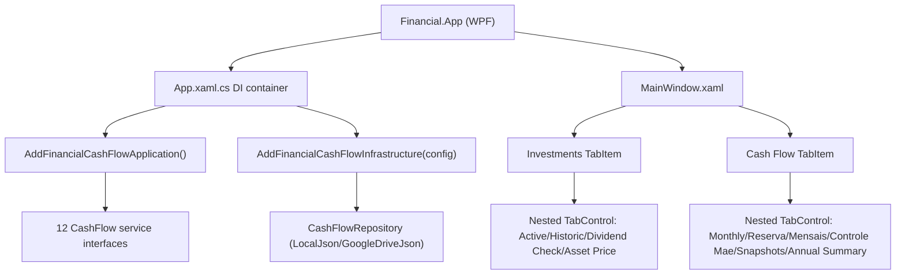

# F01. WPF CashFlow Foundation & Navigation Shell — Technical Specification

## 1. Technical Overview

**What:** Wire `Financial.App` (the WPF desktop app) to the already-complete `Financial.CashFlow.Application`/`Financial.CashFlow.Infrastructure` layers via the same in-process DI pattern the app already uses for `Financial.Investment.*`, and add a new "Cash Flow" tab to `MainWindow` containing a nested 6-tab navigation shell (Monthly, Reserva, Mensais, Controle Mãe, Investment Snapshots, Annual Summary). As part of establishing per-domain code organization for the growing CashFlow surface, existing Investment-only `Views/`/`ViewModels/` content is relocated into `Views/Investment/`/`ViewModels/Investment/` subfolders, mirrored by new (initially empty until F02+) `Views/CashFlow/`/`ViewModels/CashFlow/` subfolders for all future CashFlow UI code.

**Why:** `Financial.App` currently references only `Financial.Investment.*` — there is zero CashFlow surface in the desktop app. Every other CashFlow feature (F02–F08) needs (a) the CashFlow services resolvable from DI, (b) a tab destination to attach its view to, and (c) a settled naming/folder convention to land its files in. This feature exists purely to make those three things available; it introduces no new domain behavior.

**Scope:**
- Included: `Financial.App.csproj` project references to `Financial.CashFlow.Application`/`Financial.CashFlow.Infrastructure`; DI registration of all 12 CashFlow services; `CashFlow` configuration section in `appsettings.json`/`appsettings.Development.json` (mirroring the existing `Investment` section shape); the "Cash Flow" top-level tab with its nested 6-tab shell (all nested tabs empty at this stage); relocating existing Investment `Views/`/`ViewModels/` files into `Views/Investment/`/`ViewModels/Investment/` (namespace updated accordingly), leaving `ViewModelBase`/`RelayCommand` at the shared `ViewModels/` root; a DI-resolution test proving all 12 CashFlow service interfaces resolve.
- Excluded: any CashFlow view/dialog/grid content (F02–F08 own those); any change to `Financial.CashFlow.Domain/Application/Infrastructure` business logic; any change to `Financial.Api`/`Financial.Web`; moving `Components/` (`NavigationView`, `Totals`) or the root-level `TransactionDialog`/`CreditDialog` — these stay exactly where they are, since the requested reorganization was scoped to the `Views`/`ViewModels` folders specifically.

## 2. Architecture Impact

**Affected components:**
- `Financial.App/Financial.App.csproj` — new project references
- `Financial.App/App.xaml.cs` — new DI registrations, updated `using` directives for relocated Investment namespaces
- `Financial.App/SharedUsings.cs` — new global using for the relocated Investment ViewModels namespace
- `Financial.App/MainWindow.xaml` / `MainWindow.xaml.cs` — new "Cash Flow" tab + nested shell; updated `using` directive
- `Financial.App/appsettings.json`, `Financial.App/appsettings.Development.json` — new `CashFlow` section (Production already has one, unused until now)
- `Financial.App/Views/*` → `Financial.App/Views/Investment/*` (namespace `Financial.Presentation.App.Views` → `Financial.Presentation.App.Views.Investment`)
- `Financial.App/ViewModels/*` (all except `ViewModelBase.cs`, `RelayCommand.cs`) → `Financial.App/ViewModels/Investment/*` (namespace `Financial.Presentation.App.ViewModels` → `Financial.Presentation.App.ViewModels.Investment`)
- `Tests/Financial.Presentation.Tests/ViewModels/*.cs` — `using` directive updates to match the relocated namespace

## 3. Technical Decisions

| Decision | Chosen Approach | Alternative Considered | Trade-off |
|----------|-----------------|------------------------|-----------|
| Per-domain folder split | Move existing Investment `Views/`/`ViewModels/` content into `Views/Investment/`/`ViewModels/Investment/`; new CashFlow files land in `Views/CashFlow/`/`ViewModels/CashFlow/` | Keep flat folders, mixing both domains' files together | One-time mechanical rename/move now (touches ~40 existing files' namespace) vs. permanently mixed, harder-to-navigate folders as CashFlow grows to 6+ views across F02–F08 |
| Shared MVVM infra placement | `ViewModelBase.cs` and `RelayCommand.cs` stay at `ViewModels/` root (not moved into `Investment/`) since both domains consume them | Duplicate or move them under one domain | Keeps a single shared base for both domains; avoids CashFlow ViewModels reaching across into an `Investment` namespace for base infrastructure |
| Namespace resolution for relocated Investment types | Add `global using Financial.Presentation.App.ViewModels.Investment;` to `SharedUsings.cs` (alongside the existing `global using Financial.Presentation.App.ViewModels;`) | Add an explicit `using Financial.Presentation.App.ViewModels.Investment;` to every one of the ~10 consuming files (dialogs, `Components/NavigationView.xaml.cs`, `MainWindow.xaml.cs`, `App.xaml.cs`) | Minimizes the diff for this already-large mechanical move; CashFlow's new `ViewModels.CashFlow`/`Views.CashFlow` namespaces deliberately do NOT get a global using, so each new CashFlow file states its own dependency explicitly going forward |
| Top-level navigation structure | `MainWindow.xaml`'s outer `TabControl` becomes a 2-item domain switcher (`Investments`, `Cash Flow`), each hosting its own nested `TabControl` — the existing 4 Investment tabs move one level down into the `Investments` domain tab, matching the web app's `App.tsx` (domain switcher) → `InvestmentsLayout`/`CashFlowLayout` (per-domain nav) structure | Keep the 4 existing Investment tabs flat at the top level and add "Cash Flow" as a 5th sibling tab | The flat approach was tried first and is asymmetric (Investments' 4 areas are peers of a single "Cash Flow" tab, rather than peers of each other under a shared Investments domain) — corrected to mirror the web app's two-level domain/section hierarchy before this feature merged |
| Cash Flow tab shell structure | Nested `TabControl` declared directly inside the `Cash Flow` domain `TabItem` in `MainWindow.xaml`; each of the 6 nested `TabItem`s stays empty at this stage (no code-behind wiring needed since there is no content to assign yet) | A dedicated `CashFlowShellView`/`ViewModel` UserControl owning the nested `TabControl` | Matches the existing pattern (`MainWindow.xaml` already owns nested `TabControl`s directly, now for both domains); avoids a shell abstraction with no behavior of its own at this stage — F02–F08 will assign each nested `TabItem`'s `Content` from `MainWindow.xaml.cs`'s constructor exactly like `dividendCheckTab`/`assetPriceTab` are handled today (their `x:Name` fields resolve the same regardless of nesting depth) |
| CashFlow config section | Add `CashFlow` block to `appsettings.json` (empty `LocalJson` placeholders, matching `Investment`'s shape) and `appsettings.Development.json` (`DataJsonFile: "../../../../data/data-cashflow.json"`, matching `Investment`'s relative-path convention) | Rely solely on the `CashFlow` section already present in `appsettings.Production.json` | Local `dotnet run` / F5 debugging needs a working config; `Production.json`'s section is invisible until `Development`/base also define it, exactly mirroring how `Investment` already needs both |
| DI resolution verification | New xUnit test builds a minimal `ServiceCollection`, calls `AddFinancialCashFlowApplication()` + `AddFinancialCashFlowInfrastructure(configuration)` with an in-memory `IConfiguration` pointing `CashFlow:Repository:Provider` at `LocalJson` and a temp/example JSON file, then asserts `GetRequiredService<T>()` succeeds for all 12 interfaces | No dedicated test; rely on manual app launch | Directly and repeatably verifies the PRD's "all 12 services resolve" acceptance criterion in CI, without needing to launch the WPF app |

## 4. Component Overview

**New:**

| File Path | New/Modified | Purpose | Key Responsibilities |
|-----------|--------------|---------|----------------------|
| `Tests/Financial.Presentation.Tests/DependencyInjection/CashFlowServiceRegistrationTests.cs` | New | Verifies CashFlow DI wiring | Builds a `ServiceCollection` with `AddFinancialCashFlowApplication()` + `AddFinancialCashFlowInfrastructure()`, asserts all 12 `Financial.CashFlow.Application.Interfaces.I*Service` types resolve |

**Modified:**

| File Path | New/Modified | Purpose | Key Responsibilities |
|-----------|--------------|---------|----------------------|
| `Financial.App/Financial.App.csproj` | Modified | Project references | Add `ProjectReference` to `Financial.CashFlow.Application.csproj` and `Financial.CashFlow.Infrastructure.csproj` |
| `Financial.App/App.xaml.cs` | Modified | DI composition root | Add `services.AddFinancialCashFlowApplication()` and `services.AddFinancialCashFlowInfrastructure(context.Configuration)` alongside the existing Investment registrations; update `using` directives for relocated `Views.Investment`/`ViewModels.Investment` types referenced here (`DividendCheckView`, `AssetPriceView`, `AssetPriceFetchViewModel`, etc.) |
| `Financial.App/SharedUsings.cs` | Modified | Global usings | Add `global using Financial.Presentation.App.ViewModels.Investment;` |
| `Financial.App/MainWindow.xaml` | Modified | Main shell UI | Restructure the top-level `TabControl` into a 2-item domain switcher (`Investments`, `Cash Flow`); the 4 existing Investment tabs move into a nested `TabControl` under the `Investments` `TabItem` (unchanged content); the `Cash Flow` `TabItem` gets a nested `TabControl` with 6 empty `TabItem`s in order: Monthly, Reserva, Mensais, Controle Mãe, Investment Snapshots, Annual Summary |
| `Financial.App/MainWindow.xaml.cs` | Modified | Main shell code-behind | Update `using` directive for the relocated `Views.Investment` namespace; no new constructor parameters needed (nested tabs are empty until F02–F08 land) |
| `Financial.App/appsettings.json` | Modified | Base config | Add `CashFlow` section mirroring `Investment`'s shape (`Repository.Provider = LocalJson`, empty `DataJsonFile`/`GoogleDrive` placeholders) |
| `Financial.App/appsettings.Development.json` | Modified | Dev config | Add `CashFlow` section with `DataJsonFile: "../../../../data/data-cashflow.json"`, matching `Investment`'s relative-path convention |
| `Financial.App/Views/Investment/AssetPriceView.xaml`, `.xaml.cs` | Modified (moved) | Relocated view | Move from `Views/`; update `x:Class`/namespace to `Financial.Presentation.App.Views.Investment` |
| `Financial.App/Views/Investment/DividendCheckView.xaml`, `.xaml.cs` | Modified (moved) | Relocated view | Move from `Views/`; update `x:Class`/namespace to `Financial.Presentation.App.Views.Investment` |
| `Financial.App/ViewModels/Investment/*.cs` (35 files, e.g. `MainNavigationViewModel.cs`, `AssetDetailsViewModel.cs`, `TransactionDialogViewModel.cs`, `CreditDialogViewModel.cs`, `TreeNodeViewModel.cs`, …) | Modified (moved) | Relocated ViewModels | Move every file currently in `ViewModels/` except `ViewModelBase.cs`/`RelayCommand.cs`; update `namespace` declaration to `Financial.Presentation.App.ViewModels.Investment` |
| `Financial.App/ViewModels/ViewModelBase.cs`, `RelayCommand.cs` | Unmodified location | Shared MVVM infra | Stay at `ViewModels/` root; no namespace change |
| `Financial.App/Components/NavigationView.xaml.cs` | Modified | Investment tree/detail component | Update `using` directive if the added global using does not already cover a reference it needs (verify at build time) |
| `Financial.App/TransactionDialog.xaml.cs`, `CreditDialog.xaml.cs` | Modified | Investment dialogs (stay at project root) | No move; update `using` directive only if the added global using does not already cover the relocated ViewModel types they construct |
| `Tests/Financial.Presentation.Tests/ViewModels/*.cs` (24 files) | Modified | Existing Investment ViewModel/dialog tests | Update `using Financial.Presentation.App.ViewModels;` → `using Financial.Presentation.App.ViewModels.Investment;` wherever the tested type moved |

**Not moved (explicit exclusion):**

| File Path | Reason |
|-----------|--------|
| `Financial.App/Components/Totals.xaml`, `NavigationView.xaml` | Reorganization scoped to `Views`/`ViewModels` folders per interview decision; `Components/` is unaffected |
| `Financial.App/TransactionDialog.xaml`, `CreditDialog.xaml` | Same as above — these live at the project root today, not inside `Views/`, and stay there |

## 5. API Contracts

N/A — no HTTP API surface is touched. `Financial.App` consumes `Financial.CashFlow.Application` service interfaces directly via constructor injection, in-process, exactly as it already does for `Financial.Investment.Application`.

## 6. Data Model

N/A — no database/schema change. The CashFlow data store (`data-cashflow.json` via `ICashFlowRepository`) already exists and is unchanged by this feature; F01 only points `Financial.App`'s configuration at it.

## 7. Testing Strategy

| Test File | Test Type | Target | Coverage Goal |
|-----------|-----------|--------|----------------|
| `Tests/Financial.Presentation.Tests/DependencyInjection/CashFlowServiceRegistrationTests.cs` | Unit/Integration-style | `AddFinancialCashFlowApplication`/`AddFinancialCashFlowInfrastructure` registration | All 12 service interfaces resolve |

| Test Function | Description | Assertions |
|----------------|--------------|------------|
| `ResolvesAllTwelveCashFlowServices` | Builds a `ServiceCollection`, applies both extension methods with an in-memory `LocalJson` configuration, builds a `ServiceProvider` | `GetRequiredService<IExpenseService>()`, `IIncomeService`, `IBankService`, `ITransferService`, `IBalanceAdjustmentService`, `ICardStatementService`, `IReserveService`, `IMensaisService`, `IControleMaeService`, `IInvestmentSnapshotService`, `IAnnualSummaryService`, `ITitheService` all return non-null instances without throwing |
| `MissingRepositoryProvider_ThrowsDescriptiveError` (optional, mirrors existing `CashFlowRepositoryFactory` behavior) | Configures an invalid `Repository.Provider` value | Resolving `ICashFlowRepository` throws `InvalidOperationException` with the provider name in the message (existing behavior in `CashFlowInfrastructureServiceCollectionExtensions.BuildRepositoryOptions`, exercised here rather than newly implemented) |

**Manual verification (acceptance-level, not automated):**
- `dotnet build` succeeds for the whole solution (`Financial.App`, `Financial.Presentation.Tests`, and every other project — the move must not break any existing reference).
- `dotnet test` passes for `Financial.Presentation.Tests` (all pre-existing Investment tests continue to pass under their updated `using` directives, plus the new DI test).
- Launching `Financial.App` (via the `run` skill, against a temp copy of `data-cashflow.json` per the project's data-safety convention) shows the "Cash Flow" tab with its 6 empty nested tabs, and the existing 4 Investment tabs behave exactly as before.
