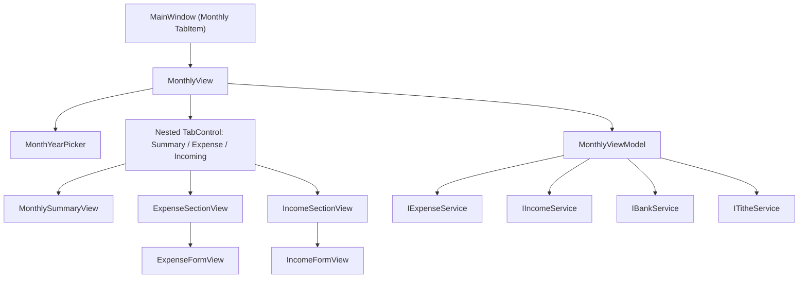

# F02. WPF Monthly View — Expenses & Income — Technical Specification

## 1. Technical Overview

**What:** Populates the "Monthly" nested tab (currently empty, created by F01) with a full CRUD surface for expenses and income, plus category totals and a tithe summary — matching `Financial.Web`'s `MonthlyPage.tsx` Summary/Expense/Incoming sub-tabs. Consumes the existing `IExpenseService`, `IIncomeService`, `IBankService`, `ITitheService` in-process via DI, exactly as the Investment area already consumes its services.

**Why:** F01 only scaffolded an empty "Monthly" `TabItem`; nothing in `Financial.App` can record an expense or income entry yet. This feature is the first real CashFlow data-entry surface, and establishes the `Views/CashFlow/`/`ViewModels/CashFlow/` folders (reserved but empty since F01) plus a reusable Month+Year picker control that F05 (Mensais) and F07 (Investment Snapshots) will reuse later.

**Scope:**
- Included: Monthly nested tab shell with Summary/Expense/Incoming sub-tabs; Month+Year period selection; Expense CRUD (bank-vs-card payment mode, 14 fixed categories, 5 fixed cards, conditional round-up field, settled-expense read-only state); Income CRUD (4 fixed sources, conditional gross value); Category Totals grid; tithe display; a reusable `MonthYearPicker` component.
- Excluded (F03's scope): Banks grid, Cards grid, transfer/balance-adjustment dialogs. F03 will extend `MonthlySummaryView`/`MonthlyViewModel` (the containers this feature creates) to add those — it does not replace them.

## 2. Architecture Impact

**Affected components:**
- `Financial.App/Components/MonthYearPicker.xaml`, `.xaml.cs` — new shared control
- `Financial.App/Views/CashFlow/MonthlyView.xaml`, `.xaml.cs` — new, Monthly tab shell
- `Financial.App/Views/CashFlow/MonthlySummaryView.xaml`, `.xaml.cs` — new, Summary sub-tab (Category Totals + Tithe)
- `Financial.App/Views/CashFlow/ExpenseSectionView.xaml`, `.xaml.cs` — new, Expense sub-tab
- `Financial.App/Views/CashFlow/ExpenseFormView.xaml`, `.xaml.cs` — new, inline expense create/edit form
- `Financial.App/Views/CashFlow/IncomeSectionView.xaml`, `.xaml.cs` — new, Incoming sub-tab
- `Financial.App/Views/CashFlow/IncomeFormView.xaml`, `.xaml.cs` — new, inline income create/edit form
- `Financial.App/ViewModels/CashFlow/MonthlyViewModel.cs` — new, the page's single cohesive ViewModel (mirrors `useMonthly.ts`)
- `Financial.App/ViewModels/CashFlow/ExpenseFormValidation.cs`, `IncomeFormValidation.cs` — new, static validation classes
- `Financial.App/MainWindow.xaml`, `.xaml.cs` — modified, wires `MonthlyView` into the Monthly `TabItem`
- `Financial.App/App.xaml.cs` — modified, registers the new view/viewmodel

## 3. Technical Decisions

| Decision | Chosen Approach | Alternative Considered | Trade-off |
|----------|-----------------|-------------------------|-----------|
| Summary/Expense/Incoming sub-tabs | A third nested `TabControl` inside `MonthlyView` (Cash Flow > Monthly > Summary/Expense/Incoming) | A custom 3-button toggle strip + `ContentControl`, closer to the web's non-native tab styling | Consistent with the app's existing TabControl-everywhere convention (confirmed in interview); avoids a bespoke tab-strip control for a 3-item switch |
| Inline expense/income forms | `ExpenseFormView`/`IncomeFormView` UserControls embedded in `ExpenseSectionView`/`IncomeSectionView`, `Visibility` bound through the existing `BoolToVisibilityConverter` to an `IsCreateFormOpen`/`EditingId != null`-style VM property | Reuse the `TransactionDialog`/`CreditDialog` modal-`Window` recipe | Matches the web's inline conditional-render panel UX (confirmed in interview) and reuses an existing converter already registered in `App.xaml` |
| Month+Year selection | New reusable `Components/MonthYearPicker.xaml` UserControl with `SelectedYear`/`SelectedMonth` dependency properties (two-way bindable), two `ComboBox`es (month name, year) | Inline `ComboBox` pair duplicated in `MonthlyView` only | Confirmed in interview: avoids F05/F07 each re-implementing the same Month+Year wiring; year range is generated as `[SelectedYear - 5, SelectedYear + 1]` recomputed around whatever year is bound in, so any persisted year stays selectable |
| ViewModel granularity | One `MonthlyViewModel` owns the whole Monthly page (year/month, expenses, incomes, category totals, tithe, both forms' state) — mirrors `useMonthly.ts`'s single ~1100-line reducer hook 1:1, and matches the Investment area's precedent of one large cohesive `AssetDetailsViewModel` (1262 lines) rather than fragmenting per sub-tab | Split into `ExpenseSectionViewModel`/`IncomeSectionViewModel`/`SummaryViewModel` composed by a parent | A single class is more consistent with both the web reference implementation and the existing WPF precedent; **F03 will add its Banks/Cards/Transfer/Adjustment properties and methods directly to this same `MonthlyViewModel.cs`** rather than creating a second Monthly VM — noted here so F03's spec doesn't re-litigate this |
| Category Totals data source | `IExpenseService.GetCategoryTotalsByMonth(year, month)` — already returns `IReadOnlyList<CategoryTotalDTO>` with `Category`/`TotalValue`, no client-side aggregation needed | Compute totals client-side from the fetched `ExpenseDTO` list | The service already does this server-side (unlike the old web `useMemo` approach P19 moved away from) — reuse it directly |
| Validation split | Two static classes (`ExpenseFormValidation`, `IncomeFormValidation`), each with a `BuildValidationMessage(...)` method returning `string.Empty` when valid, mirroring `TransactionDialogValidation`'s exact shape | One shared `MonthlyFormValidation` static class for both forms | Two focused classes (SRP) instead of one doing two unrelated jobs; matches the existing 1-validation-class-per-form-type precedent (`TransactionDialogValidation`, `CreditDialogValidation`) |

## 4. Component Overview

**New:**

| File Path | New/Modified | Purpose | Key Responsibilities |
|-----------|--------------|---------|------------------------|
| `Financial.App/Components/MonthYearPicker.xaml`, `.xaml.cs` | New | Reusable month/year selector | Two `ComboBox`es (month name Jan–Dec, year) exposed as `SelectedYear`/`SelectedMonth` dependency properties for two-way binding |
| `Financial.App/Views/CashFlow/MonthlyView.xaml`, `.xaml.cs` | New | Monthly tab shell | Hosts `MonthYearPicker` bound to `MonthlyViewModel.Year`/`Month`, the Summary/Expense/Incoming nested `TabControl`, and the page's loading/error state |
| `Financial.App/Views/CashFlow/MonthlySummaryView.xaml`, `.xaml.cs` | New | Summary sub-tab | Category Totals `DataGrid` + tithe summary text; leaves room (documented in XAML comments) for F03 to append Banks/Cards sections |
| `Financial.App/Views/CashFlow/ExpenseSectionView.xaml`, `.xaml.cs` | New | Expense sub-tab | Expense `DataGrid` (Date/Description/Category/Value/Payment, edit/delete actions), "New Expense" button, hosts `ExpenseFormView` |
| `Financial.App/Views/CashFlow/ExpenseFormView.xaml`, `.xaml.cs` | New | Expense create/edit form | Date/Description/Category/Value fields, payment-mode radio buttons, conditional Payment Source+Round-Up or Card fields, settled read-only message, Save/Cancel, validation message; `DecimalInputHelper` wiring on Value/Round-Up `TextBox`es |
| `Financial.App/Views/CashFlow/IncomeSectionView.xaml`, `.xaml.cs` | New | Incoming sub-tab | Income `DataGrid` (Date/Source/Gross/Net/Bank, edit/delete actions), "New Income" button, hosts `IncomeFormView` |
| `Financial.App/Views/CashFlow/IncomeFormView.xaml`, `.xaml.cs` | New | Income create/edit form | Date/Source/conditional Gross Value/Net Value/Bank fields, Save/Cancel, validation message; `DecimalInputHelper` wiring on Gross/Net Value `TextBox`es |
| `Financial.App/ViewModels/CashFlow/MonthlyViewModel.cs` | New | Page ViewModel | Year/Month state + refetch-on-change; Expenses/Incomes/CategoryTotals/TitheSummary/Banks collections; loading/error/retry; create/edit form state and Save/Delete commands for both Expense and Income |
| `Financial.App/ViewModels/CashFlow/ExpenseFormValidation.cs` | New | Expense form validation | Static `BuildValidationMessage(...)`: required Date/Description/Category/Value>0; Payment Source required in bank mode, Card required in card mode; round-up in £0.00–£0.99 when present |
| `Financial.App/ViewModels/CashFlow/IncomeFormValidation.cs` | New | Income form validation | Static `BuildValidationMessage(...)`: required Date/Source/Bank; Net Value ≥ 0 |

**Modified:**

| File Path | New/Modified | Purpose | Key Responsibilities |
|-----------|--------------|---------|------------------------|
| `Financial.App/MainWindow.xaml` | Modified | Main shell | Add `x:Name="monthlyTab"` to the existing empty Monthly `TabItem` under Cash Flow |
| `Financial.App/MainWindow.xaml.cs` | Modified | Main shell code-behind | Accept `MonthlyView` via constructor injection, assign `monthlyTab.Content = monthlyView` (same pattern as `dividendCheckTab`/`assetPriceTab`) |
| `Financial.App/App.xaml.cs` | Modified | DI composition root | `services.AddTransient<MonthlyViewModel>()`, `services.AddTransient<MonthlyView>()`; add `MonthlyView` to `MainWindow`'s constructor args |

**Tests:**

| File Path | New/Modified | Purpose |
|-----------|--------------|---------|
| `Tests/Financial.Presentation.Tests/ViewModels/CashFlow/MonthlyViewModelTests.cs` | New | Fetch orchestration, create/edit/delete flows for expense and income, category totals/tithe surfacing, payment-mode field toggling |
| `Tests/Financial.Presentation.Tests/ViewModels/CashFlow/ExpenseFormValidationTests.cs` | New | All validation branches (missing fields, round-up range, mode-specific required fields) |
| `Tests/Financial.Presentation.Tests/ViewModels/CashFlow/IncomeFormValidationTests.cs` | New | All validation branches |

## 5. API Contracts

N/A — no HTTP API. `MonthlyViewModel` calls the following in-process service methods directly (already implemented, unchanged by this feature):

| Method | Signature | Used for |
|--------|-----------|----------|
| `IExpenseService.GetExpensesByMonth` | `(int year, int month) -> IReadOnlyList<ExpenseDTO>` | Expense grid |
| `IExpenseService.GetCategoryTotalsByMonth` | `(int year, int month) -> IReadOnlyList<CategoryTotalDTO>` | Category Totals grid |
| `IExpenseService.AddExpenseAsync` | `(ExpenseCreateDTO) -> Task<ExpenseDTO>` | Create expense |
| `IExpenseService.UpdateExpenseAsync` | `(Guid id, ExpenseUpdateDTO) -> Task<ExpenseDTO>` | Edit expense |
| `IExpenseService.DeleteExpenseAsync` | `(Guid id) -> Task` | Delete expense |
| `IIncomeService.GetIncomesByMonth` | `(int year, int month) -> IReadOnlyList<IncomeDTO>` | Income grid |
| `IIncomeService.AddIncomeAsync` | `(IncomeCreateDTO) -> Task<IncomeDTO>` | Create income |
| `IIncomeService.UpdateIncomeAsync` | `(Guid id, IncomeUpdateDTO) -> Task<IncomeDTO>` | Edit income |
| `IIncomeService.DeleteIncomeAsync` | `(Guid id) -> Task` | Delete income |
| `IBankService.GetBanks` | `() -> IReadOnlyList<BankDTO>` | Payment Source / Bank `ComboBox` items; `BankDTO.RoundUpEnabled` gates the Round-Up field |
| `ITitheService.GetTitheSummary` | `(int year, int month) -> TitheSummaryDTO` | Tithe display |

`ExpenseDTO.PaymentStatus` (string) determines settled-read-only state: when it equals `"CreditCardSettled"` the expense form for that row renders read-only per the PRD's Capabilities (mirrors `useMonthly.ts`'s `SETTLED_STATUS` constant).

## 6. Data Model

N/A — no schema change. All DTOs (`ExpenseDTO`, `ExpenseCreateDTO`, `ExpenseUpdateDTO`, `IncomeDTO`, `IncomeCreateDTO`, `IncomeUpdateDTO`, `CategoryTotalDTO`, `BankDTO`, `TitheSummaryDTO`) already exist in `Financial.CashFlow.Application.DTOs`, unchanged by this feature.

## 7. Testing Strategy

| Test File | Test Type | Target | Coverage Goal |
|-----------|-----------|--------|-----------------|
| `Tests/Financial.Presentation.Tests/ViewModels/CashFlow/MonthlyViewModelTests.cs` | Unit | `MonthlyViewModel` | Fetch orchestration, CRUD flows, form field toggling |
| `Tests/Financial.Presentation.Tests/ViewModels/CashFlow/ExpenseFormValidationTests.cs` | Unit | `ExpenseFormValidation` | All branches |
| `Tests/Financial.Presentation.Tests/ViewModels/CashFlow/IncomeFormValidationTests.cs` | Unit | `IncomeFormValidation` | All branches |

| Test Function | Description | Assertions |
|----------------|--------------|------------|
| `LoadsExpensesIncomesCategoryTotalsAndTitheForCurrentMonth` | Constructs `MonthlyViewModel` with stub services returning fixed data | Properties populate; `IsLoading` becomes false |
| `ChangingYearOrMonth_RefetchesAllFour` | Sets `Year`/`Month` after initial load | Services called again with new year/month |
| `AddExpense_BankMode_CallsServiceAndRefreshes` | Fills create form in bank mode, calls save | `AddExpenseAsync` called with `PaymentSource` set, `CardTag` null; list refetched |
| `AddExpense_CardMode_CallsServiceAndRefreshes` | Fills create form in card mode | `AddExpenseAsync` called with `CardTag` set, `PaymentSource` null |
| `SelectingRoundUpEnabledBank_ShowsRoundUpField` | Selects a bank with `RoundUpEnabled = true` | `ShowRoundUpField` (or equivalent) becomes true |
| `SelectingNonRoundUpBank_HidesRoundUpField` | Selects a bank with `RoundUpEnabled = false` | Field hidden, round-up value cleared |
| `SettledExpense_IsReadOnlyAndOffersNoEdit` | Expense with `PaymentStatus = "CreditCardSettled"` | Edit does not open an editable form / read-only flag set |
| `DeleteExpense_CallsServiceAndRefreshes` | Confirms delete | `DeleteExpenseAsync` called; grid refetched |
| `AddIncome_GleisonSource_ShowsGrossValueField` / `AddIncome_LotterySource_HidesGrossValueField` | Toggles `IncomeSource` | Gross Value visibility matches `INCOME_SOURCES_WITH_GROSS_VALUE` equivalent (`Gleison`, `Ariana`) |
| `ExpenseFormValidation_MissingRequiredFields_ReturnsError` (`[Theory]`) | Each required field blank | Non-empty message |
| `ExpenseFormValidation_RoundUpOutOfRange_ReturnsError` (`[Theory]`, boundary + out-of-range) | `-0.01`, `1.00` vs. `0.00`, `0.99` | Out-of-range rejected, boundary values accepted |
| `IncomeFormValidation_MissingRequiredFields_ReturnsError` (`[Theory]`) | Each required field blank | Non-empty message |

**Acceptance criteria traceability (PRD Section 9, F02):** every listed AC maps to one of the tests above except the two purely visual ones ("Monthly view shows Summary, Expense, and Incoming sub-tabs with a Month+Year selector" and general grid-rendering ACs), which are verified manually per the plan's final phase, consistent with F01's precedent (no WPF UI automation tool available in this environment).

**Manual verification (acceptance-level, not automated):**
- `dotnet build` succeeds for the whole solution.
- `dotnet test` passes for `Financial.Presentation.Tests`.
- Launching `Financial.App` against a temporary copy of `data-cashflow.json` (never the live file) and exercising: switching Summary/Expense/Incoming sub-tabs, changing month/year, adding/editing/deleting an expense in both payment modes, adding/editing/deleting an income entry, confirming the round-up field and settled-read-only behavior.
