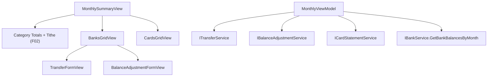

# F03. WPF Monthly View — Banks, Cards, Transfers & Balance Adjustments — Technical Specification

## 1. Technical Overview

**What:** Adds Banks and Cards grids into the Summary sub-tab that F02 built (the reserved `MonthlySummaryView.xaml` extension point), plus inline Transfer ("Move Money") and Balance Adjustment ("Correct Balance") entry forms, matching `Financial.Web`'s `BanksGrid.tsx`/`CardsGrid.tsx`/`TransferForm.tsx`/`BalanceAdjustmentForm.tsx`.

**Why:** F02 covers expenses/income but nothing in `Financial.App` yet shows where money actually sits (bank balances, card statements) or lets the user move money between banks or reconcile a balance against a real statement. This is the last Monthly-page feature; F04+ move on to the other 5 CashFlow areas.

**Scope:**
- Included: Banks grid (balance, round-up total, expandable per-bank transfer/adjustment history, Move Money / Correct Balance actions); Cards grid (outstanding total, paid/unpaid status, mark/unmark paid with bank picker); Transfer inline form (create/edit); Balance Adjustment inline form (create/edit); delete transfer/adjustment from a bank's expanded history.
- Excluded: everything already covered by F01 (shell)/F02 (Expense/Income/Category Totals/Tithe) — untouched by this feature except for `MonthlySummaryView.xaml`'s reserved extension point.

## 2. Architecture Impact

**Affected components:**
- `Financial.App/ViewModels/CashFlow/MonthlyViewModel.cs` — extended (per F02's recorded decision) with Banks/Cards/Transfer/Adjustment state, not a new ViewModel
- `Financial.App/ViewModels/CashFlow/BankTotalRow.cs` — new, per-bank grid row (balance, round-up total, merged history, expand state)
- `Financial.App/ViewModels/CashFlow/BankHistoryEntry.cs` — new, a transfer-in/transfer-out/adjustment history line
- `Financial.App/ViewModels/CashFlow/TransferFormValidation.cs`, `BalanceAdjustmentFormValidation.cs` — new, static validation classes
- `Financial.App/Views/CashFlow/MonthlySummaryView.xaml` — modified, Banks/Cards grids appended below Category Totals/Tithe
- `Financial.App/Views/CashFlow/BanksGridView.xaml`(.cs), `CardsGridView.xaml`(.cs) — new
- `Financial.App/Views/CashFlow/TransferFormView.xaml`(.cs), `BalanceAdjustmentFormView.xaml`(.cs) — new, inline forms (same recipe as F02's `ExpenseFormView`)

## 3. Technical Decisions

| Decision | Chosen Approach | Alternative Considered | Trade-off |
|----------|-----------------|-------------------------|-----------|
| Banks grid row shape | New `BankTotalRow` class (Bank, Balance, RoundUpTotal, `ObservableCollection<BankHistoryEntry>` History, `IsExpanded`) computed by `MonthlyViewModel` — `Balance` from `IBankService.GetBankBalancesByMonth`, `RoundUpTotal` summed client-side from `Expenses` where `PaymentSource == bank` (mirrors `useMonthly.ts`'s `bankTotals` computation exactly, including the client-side round-up aggregation) | Bind the grid directly to `BankDTO`/`BankBalanceDTO` | No single service returns "balance + round-up total" together; a small row-view-model matches the web's own `BankTotal` interface 1:1 |
| Bank history data | New `BankHistoryEntry` class (Kind: TransferIn/TransferOut/Adjustment, Date, counterpart/delta, Note, underlying DTO) built by merging `ITransferService.GetTransfersByMonth` (once) with `IBalanceAdjustmentService.GetAdjustmentsByBank` (once per bank) — fetched eagerly for all banks during `RefreshAsync`, same as `useBankHistory.ts`'s `Promise.all` | Fetch a bank's history lazily only when its row is expanded | Matches the web reference exactly; the extra per-bank adjustment calls are cheap (in-process, no network) and keep expand/collapse instant with no loading flicker |
| Expandable row UI | WPF `DataGrid.RowDetailsTemplate` + `RowDetailsVisibilityMode` bound per-row via a `DataGridRowDetailsVisibilityMode` `Style` `DataTrigger` on `BankTotalRow.IsExpanded`, toggled by a button in the row | Hand-rolled expand/collapse with a second inline `DataGrid` per row (closer to the web's literal DOM structure) | `RowDetailsTemplate` is WPF's purpose-built mechanism for this and integrates with the `DataGrid`'s existing virtualization/selection, instead of reimplementing it |
| Transfer/Adjustment form error display | A single form-level error message (matching F02's `ExpenseFormView`/`IncomeFormView` pattern), not per-field error attribution | Port the web's `mapTransferErrorToField.ts`/`mapBalanceAdjustmentErrorToField.ts` string-sniffing of the server error message to highlight a specific field | That string-matching is inherently fragile (keyed to the exact wording of backend error messages) and F02 already established a simpler, consistent form-level-error convention for this app; per-field highlighting is a cosmetic enhancement, not a functional requirement |
| Card "mark paid" bank selection | `Dictionary<Guid, string>` `MarkPaidSources` on `MonthlyViewModel` (statement id → selected bank name), mirrors `markPaidSources` in `useMonthly.ts` | Track selection in a per-row wrapper class (`CardStatementRow`) | A dictionary is sufficient since `CardStatementDTO` needs no other derived per-row state (unlike banks, which need `RoundUpTotal`/`History`) |

## 4. Component Overview

**New:**

| File Path | New/Modified | Purpose | Key Responsibilities |
|-----------|--------------|---------|------------------------|
| `Financial.App/ViewModels/CashFlow/BankTotalRow.cs` | New | Banks grid row | `Bank`, `Balance`, `RoundUpTotal`, `History` collection, `IsExpanded` (all `INotifyPropertyChanged`-backed since expand/collapse mutates `IsExpanded` post-construction) |
| `Financial.App/ViewModels/CashFlow/BankHistoryEntry.cs` | New | One history line | `Kind` (enum: `TransferIn`/`TransferOut`/`Adjustment`), `Date`, `CounterpartBank`/`Delta` (kind-dependent), `Note`, underlying `TransferDTO?`/`BalanceAdjustmentDTO?` for edit/delete |
| `Financial.App/ViewModels/CashFlow/TransferFormValidation.cs` | New | Transfer validation | Static `BuildValidationMessage(...)`: required Date, distinct non-empty source/destination banks, Amount > 0 |
| `Financial.App/ViewModels/CashFlow/BalanceAdjustmentFormValidation.cs` | New | Adjustment validation | Static `BuildValidationMessage(...)`: required Date, Target Balance ≥ 0 |
| `Financial.App/Views/CashFlow/BanksGridView.xaml`(.cs) | New | Banks grid | `DataGrid` with `RowDetailsTemplate` history, Move Money/Correct Balance buttons, footer totals |
| `Financial.App/Views/CashFlow/CardsGridView.xaml`(.cs) | New | Cards grid | `DataGrid` with Mark/Unmark Paid controls, footer adjustment total |
| `Financial.App/Views/CashFlow/TransferFormView.xaml`(.cs) | New | Move Money form | Date/From/To/Amount/Note, `DecimalInputHelper` on Amount |
| `Financial.App/Views/CashFlow/BalanceAdjustmentFormView.xaml`(.cs) | New | Correct Balance form | Current-balance reference text, Date/Target Balance/Note, `DecimalInputHelper` on Target Balance, post-save delta confirmation message |

**Modified:**

| File Path | New/Modified | Purpose | Key Responsibilities |
|-----------|--------------|---------|------------------------|
| `Financial.App/ViewModels/CashFlow/MonthlyViewModel.cs` | Modified | Page ViewModel | Adds `IBankService.GetBankBalancesByMonth`/`ITransferService`/`IBalanceAdjustmentService`/`ICardStatementService` calls to `RefreshAsync`; `BankTotals`, `CardStatements` collections; transfer/adjustment create-edit-delete state+commands; card mark/unmark-paid state+commands |
| `Financial.App/App.xaml.cs` | Modified | DI composition root | `MonthlyViewModel` factory gains the 3 new service parameters |
| `Financial.App/Views/CashFlow/MonthlySummaryView.xaml` | Modified | Summary sub-tab | Appends `BanksGridView`/`CardsGridView` below Category Totals/Tithe |

**Tests:**

| File Path | Purpose |
|-----------|---------|
| `Tests/Financial.Presentation.Tests/ViewModels/CashFlow/MonthlyViewModelBanksCardsTests.cs` | Bank totals computation, history merge/sort, transfer/adjustment CRUD, mark/unmark paid |
| `Tests/Financial.Presentation.Tests/ViewModels/CashFlow/TransferFormValidationTests.cs` | All validation branches |
| `Tests/Financial.Presentation.Tests/ViewModels/CashFlow/BalanceAdjustmentFormValidationTests.cs` | All validation branches |

## 5. API Contracts

N/A — no HTTP API. New in-process service methods this feature calls (all already implemented):

| Method | Signature | Used for |
|--------|-----------|----------|
| `IBankService.GetBankBalancesByMonth` | `(int year, int month) -> IReadOnlyList<BankBalanceDTO>` | Banks grid balance column |
| `ITransferService.GetTransfersByMonth` | `(int year, int month) -> IReadOnlyList<TransferDTO>` | Bank history (transfer lines) |
| `ITransferService.AddTransferAsync` / `UpdateTransferAsync` / `DeleteTransferAsync` | see interface | Move Money create/edit/delete |
| `IBalanceAdjustmentService.GetAdjustmentsByBank` | `(string bankName) -> IReadOnlyList<BalanceAdjustmentDTO>` | Bank history (adjustment lines), called once per bank |
| `IBalanceAdjustmentService.AddAdjustmentAsync` / `UpdateAdjustmentAsync` / `DeleteAdjustmentAsync` | see interface | Correct Balance create/edit/delete |
| `ICardStatementService.GetStatementsForMonthAsync` | `(int year, int month) -> Task<IReadOnlyList<CardStatementDTO>>` | Cards grid |
| `ICardStatementService.MarkStatementPaidAsync` / `UnmarkStatementPaidAsync` | see interface | Mark/unmark paid |

`BalanceAdjustmentDTO.Delta` (server-computed: `TargetBalance` minus the balance as of `Date` excluding this adjustment) drives the Balance Adjustment form's post-save "Adjustment of £X.XX recorded" confirmation message.

## 6. Data Model

N/A — no schema change. All DTOs (`BankBalanceDTO`, `TransferDTO`/`Create`/`Update`, `BalanceAdjustmentDTO`/`Create`/`Update`, `CardStatementDTO`, `MarkStatementPaidDTO`) already exist, unchanged by this feature.

## 7. Testing Strategy

| Test File | Test Type | Target |
|-----------|-----------|--------|
| `MonthlyViewModelBanksCardsTests.cs` | Unit | `MonthlyViewModel`'s bank/card extensions |
| `TransferFormValidationTests.cs` | Unit | `TransferFormValidation` |
| `BalanceAdjustmentFormValidationTests.cs` | Unit | `BalanceAdjustmentFormValidation` |

| Test Function | Description | Assertions |
|----------------|--------------|------------|
| `BankTotals_ComputesBalanceAndRoundUpTotalPerBank` | Stub balances + expenses with round-up amounts on one bank | `BankTotals` has correct `Balance`/`RoundUpTotal` per bank |
| `BankHistory_MergesTransfersAndAdjustmentsSortedByDateDescending` | Stub transfers (in/out) + adjustments for a bank | `BankTotalRow.History` contains all entries, newest first |
| `AddTransfer_ValidForm_CallsServiceAndRefreshes` | Fill Date/From/To/Amount | `AddTransferAsync` called; form closes; `BankTotals`/`History` refetched |
| `AddTransfer_SameSourceAndDestination_BlocksSaveWithoutServiceCall` | From == To | Validation error, service not called |
| `EditTransfer_ValidForm_CallsUpdateServiceAndRefreshes` | Edit an existing transfer from history | `UpdateTransferAsync` called with correct id |
| `DeleteTransfer_ConfirmedAndDeclined_CallsOrSkipsService` (`[Theory]`) | Confirm true/false | Service called only when confirmed |
| `AddBalanceAdjustment_ValidForm_CallsServiceAndShowsDelta` | Fill Date/Target Balance | `AddAdjustmentAsync` called with the correct bank; result delta surfaced |
| `MarkCardStatementPaid_RequiresBankSelected_ThenCallsService` | Select a bank, mark paid | `MarkStatementPaidAsync` called with `PaymentSource` set |
| `UnmarkCardStatementPaid_CallsService` | Unmark | `UnmarkStatementPaidAsync` called |
| `TransferFormValidation_*` / `BalanceAdjustmentFormValidation_*` (`[Theory]`) | All required-field/range branches | Correct error text or empty |

**Acceptance criteria traceability (PRD Section 9, F03):** all 10 F03 criteria map to a test above except the purely visual ones (grid columns rendering, expand/collapse interaction itself), consistent with F01/F02's precedent — verified manually per the plan's final phase.

**Manual verification (acceptance-level, not automated):**
- `dotnet build` succeeds for the whole solution; `dotnet test` passes for `Financial.Presentation.Tests`.
- Launching `Financial.App` against a temporary copy of `data-cashflow.json` (never the live file): expand a bank row, move money between two banks, correct a balance, mark/unmark a card statement paid.
