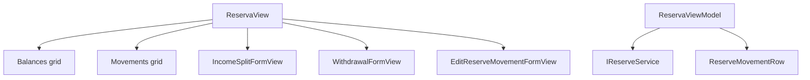

# F04. WPF Reserva View — Technical Specification

## 1. Technical Overview

**What:** Adds a self-contained Reserva page to the WPF app's Cash Flow tab: a Balances grid (4 fixed buckets + Total), a Movements grid with same-date+description split groups visually subtotaled, an inline "New Income Split" form, an inline "New Withdrawal" form (with backend-driven overdraft confirmation), and inline per-movement editing — matching `Financial.Web`'s `ReservaPage.tsx`/`useReserva.ts`.

**Why:** F01–F03 cover the Monthly page only. Reserva is architecturally independent of Monthly (its own backend service, its own destination tab from F01's shell) and is the next of the 5 remaining CashFlow areas.

**Scope:**
- Included: Balances grid with Total row; Movements grid with split-group subtotal display; Income Split form (post + result panel); Withdrawal form (post + overdraft conflict confirmation); Edit Movement inline form; Delete Movement (split-aware confirmation wording).
- Excluded: everything owned by F01 (shell)/F02/F03 (Monthly) — untouched by this feature except for the `reservaTab` placeholder from F01's `MainWindow.xaml`.

## 2. Architecture Impact

**Affected components:**
- `Financial.App/ViewModels/CashFlow/ReservaViewModel.cs` — new, standalone page ViewModel (own `IReserveService`, does not extend `MonthlyViewModel` — Reserva is a separate destination with no shared state)
- `Financial.App/ViewModels/CashFlow/ReserveMovementRow.cs` — new, wraps a movement with its split-group subtotal/membership
- `Financial.App/ViewModels/CashFlow/IncomeSplitFormValidation.cs`, `WithdrawalFormValidation.cs`, `EditReserveMovementFormValidation.cs` — new, static validation classes
- `Financial.App/Views/CashFlow/ReservaView.xaml`(.cs) — new, page shell (toolbar + Balances grid + Movements grid + hosts the 3 inline forms)
- `Financial.App/Views/CashFlow/IncomeSplitFormView.xaml`(.cs), `WithdrawalFormView.xaml`(.cs), `EditReserveMovementFormView.xaml`(.cs) — new, inline forms (same recipe as F02/F03's forms)
- `Financial.App/MainWindow.xaml`(.cs) — modified, wires `ReservaView` into the existing `reservaTab` placeholder
- `Financial.App/App.xaml.cs` — modified, DI registration for `ReservaViewModel`/`ReservaView`

## 3. Technical Decisions

| Decision | Chosen Approach | Alternative Considered | Trade-off |
|----------|-----------------|-------------------------|-----------|
| ViewModel scope | New standalone `ReservaViewModel`, not an extension of `MonthlyViewModel` | Add Reserva state onto `MonthlyViewModel` (as F03 did for Banks/Cards) | Reserva is a distinct top-level destination (its own tab, own service, zero shared state with Monthly) — F03's extension only made sense because Banks/Cards render *inside* Monthly's Summary sub-tab |
| Split-group subtotal display | `DataGrid.RowDetailsTemplate` shown automatically (bound to `GroupTotal.HasValue`, not a manual toggle) on the group's last row — reuses the exact `RowDetailsTemplate` mechanism from F03's bank history, but always-visible instead of click-to-expand | A synthetic "total" row object inserted into the `ObservableCollection` after each group | Confirmed with the user: `RowDetailsTemplate` reuses a proven pattern and avoids conditional per-row-type column templating that a mixed-row-type collection would require |
| Split-group detection | `ReserveMovementRow` computed client-side by grouping `Movements` on `(Date, Description)`; `GroupTotal` (nullable `decimal`) set only on the last row of a 2+ group, `IsPartOfGroup` (bool) set on every row of such a group — mirrors `useReserva.ts`'s `buildMovementRows` exactly | Ask the backend for a `GroupId`/split marker | The backend's own `DeleteMovementAsync` already re-derives the group the same way (by Date+Description match) — no server-side group identity exists to consume, so client-side grouping is the only option and matches the reference implementation |
| Overdraft confirmation flow | `ReservaViewModel.SubmitWithdrawalAsync` catches `OverdraftConfirmationRequiredException` specifically (not generic `Exception`), invokes the existing injected `Func<string,bool> confirm` delegate with `"{ex.Message}\n\nProceed anyway?"`, and on `true` resubmits with `Confirmed = true`; on `false` (or any other exception) sets `WithdrawalSaveError` and keeps the form open with entered values | Show a generic error and require the user to manually re-check "confirm" and resubmit | Mirrors the web's `ApiError.status === 409` + `window.confirm` flow exactly; reuses the same `MessageBox.Show(..., MessageBoxButton.YesNo, ...)` confirm delegate already wired in `App.xaml.cs` for delete confirmations, so no new confirmation plumbing is introduced |
| Bucket source for ComboBoxes | Hardcoded `static readonly string[] Buckets = ["Investimento", "HouseTreats", "Ariana", "Gleison"]` on `ReservaViewModel` (mirrors web's `RESERVE_BUCKETS` const) | Derive the list from `GetBucketBalances()`'s returned bucket names at runtime | The bucket set is a fixed domain concept (`ReserveBucket` enum), not data — a static list avoids depending on balances having loaded before a form can render its ComboBox |
| Mutual exclusion of the 3 forms | Opening any one of Income Split / Withdrawal / Edit Movement closes the other two (matches PRD: "only one form panel is open at a time") | Allow independent open/close per form | Directly required by the PRD's Experience block; a shared `CloseAllForms()` helper is called at the start of each `ShowXForm` method |
| Delete confirmation wording | `DeleteMovementCommand` picks between the "part of a split" and standalone message based on the target row's `IsPartOfGroup`, mirrors F03's `DeleteHistoryEntryCommand` per-kind message selection | Always show the same generic delete warning | Directly required by the PRD's Experience block (two distinct warning strings) |

## 4. Component Overview

**New:**

| File Path | New/Modified | Purpose | Key Responsibilities |
|-----------|--------------|---------|------------------------|
| `Financial.App/ViewModels/CashFlow/ReservaViewModel.cs` | New | Page ViewModel | `RefreshAsync` (request-guard pattern per F02/F03 precedent) loading balances+movements; `Balances`, `TotalBalance`, `Movements` (`ObservableCollection<ReserveMovementRow>`); Income Split form state+commands+result panel; Withdrawal form state+commands+overdraft confirm flow; Edit Movement form state+commands; Delete Movement command with split-aware confirm wording |
| `Financial.App/ViewModels/CashFlow/ReserveMovementRow.cs` | New | Movements grid row | Wraps `ReserveMovementDTO` fields plus computed `GroupTotal` (`decimal?`) and `IsPartOfGroup` (bool) |
| `Financial.App/ViewModels/CashFlow/IncomeSplitFormValidation.cs` | New | Split validation | Static `BuildValidationMessage(date, amount, description)`: required Date, Amount > 0, required Description |
| `Financial.App/ViewModels/CashFlow/WithdrawalFormValidation.cs` | New | Withdrawal validation | Static `BuildValidationMessage(bucket, amount, date, description)`: required Bucket, Amount > 0, required Date, required Description |
| `Financial.App/ViewModels/CashFlow/EditReserveMovementFormValidation.cs` | New | Edit validation | Static `BuildValidationMessage(bucket, amount, date, description)`: required Bucket, Amount is a number, required Date, required Description (matches backend: amount may be negative for withdrawals) |
| `Financial.App/Views/CashFlow/ReservaView.xaml`(.cs) | New | Page shell | Toolbar ("New Income Split"/"New Withdrawal" buttons), Balances `DataGrid` + Total row, Movements `DataGrid` with `RowDetailsTemplate`, hosts the 3 inline form `UserControl`s and the split-result panel |
| `Financial.App/Views/CashFlow/IncomeSplitFormView.xaml`(.cs) | New | Income Split form | Date/Amount/Description, `DecimalInputHelper` on Amount, post-save result panel (Investimento/HouseTreats/Ariana/Gleison/Total) with a dismiss action |
| `Financial.App/Views/CashFlow/WithdrawalFormView.xaml`(.cs) | New | Withdrawal form | Bucket ComboBox (defaults to Investimento)/Amount/Date/Description, `DecimalInputHelper` on Amount |
| `Financial.App/Views/CashFlow/EditReserveMovementFormView.xaml`(.cs) | New | Edit Movement form | Bucket/Amount/Date/Description, `DecimalInputHelper` on Amount, pre-filled from the selected row |

**Modified:**

| File Path | New/Modified | Purpose | Key Responsibilities |
|-----------|--------------|---------|------------------------|
| `Financial.App/MainWindow.xaml` | Modified | Shell | `reservaTab` gains `x:Name="reservaTab"` (currently header-only) |
| `Financial.App/MainWindow.xaml.cs` | Modified | Shell wiring | Constructor gains a `ReservaView reservaView` parameter; `reservaTab.Content = reservaView;` |
| `Financial.App/App.xaml.cs` | Modified | DI composition root | Registers `ReservaViewModel` (with `IReserveService` and the existing `confirm` delegate) and `ReservaView` |

**Tests:**

| File Path | Purpose |
|-----------|---------|
| `Tests/Financial.Presentation.Tests/ViewModels/CashFlow/ReservaViewModelTests.cs` | Balances/Total, movement grouping, Income Split, Withdrawal (incl. overdraft confirm/decline), Edit Movement, Delete Movement (split-aware) |
| `Tests/Financial.Presentation.Tests/ViewModels/CashFlow/IncomeSplitFormValidationTests.cs` | All validation branches |
| `Tests/Financial.Presentation.Tests/ViewModels/CashFlow/WithdrawalFormValidationTests.cs` | All validation branches |
| `Tests/Financial.Presentation.Tests/ViewModels/CashFlow/EditReserveMovementFormValidationTests.cs` | All validation branches |
| `Tests/Financial.Presentation.Tests/ViewModels/CashFlow/TestStubs.cs` | Modified — adds `StubReserveService` alongside the existing CashFlow stubs |

## 5. API Contracts

N/A — no HTTP API. In-process service methods this feature calls (all already implemented on `IReserveService`):

| Method | Signature | Used for |
|--------|-----------|----------|
| `GetBucketBalances` | `() -> IReadOnlyList<ReserveBucketBalanceDTO>` | Balances grid (4 fixed buckets, enum-declared order) |
| `GetMovementHistory` | `() -> IReadOnlyList<ReserveMovementDTO>` | Movements grid |
| `PostIncomeSplitAsync` | `(IncomeSplitRequestDTO) -> Task<IncomeSplitResultDTO>` | Income Split submit + result panel |
| `PostWithdrawalAsync` | `(WithdrawalRequestDTO) -> Task<ReserveMovementDTO>` | Withdrawal submit; throws `OverdraftConfirmationRequiredException` when `Confirmed = false` and the bucket would go negative |
| `UpdateMovementAsync` | `(Guid id, UpdateReserveMovementDTO) -> Task<ReserveMovementDTO>` | Edit Movement submit |
| `DeleteMovementAsync` | `(Guid id) -> Task` | Delete Movement — backend deletes the whole same-Date+Description group, including standalone (group-of-1) movements |

`GetBucketBalances`/`GetMovementHistory` are synchronous (no `Async` suffix, no `Task`) on the interface — `ReservaViewModel.RefreshAsync` wraps them in `Task.Run` only if needed to stay off the UI thread, otherwise calls them directly, matching how `MonthlyViewModel` calls `IBankService.GetBankBalancesByMonth` (also synchronous) today.

## 6. Data Model

N/A — no schema change. All DTOs (`ReserveBucketBalanceDTO`, `ReserveMovementDTO`, `IncomeSplitRequestDTO`/`ResultDTO`, `WithdrawalRequestDTO`, `UpdateReserveMovementDTO`) already exist, unchanged by this feature.

## 7. Testing Strategy

| Test File | Test Type | Target |
|-----------|-----------|--------|
| `ReservaViewModelTests.cs` | Unit | `ReservaViewModel` |
| `IncomeSplitFormValidationTests.cs` | Unit | `IncomeSplitFormValidation` |
| `WithdrawalFormValidationTests.cs` | Unit | `WithdrawalFormValidation` |
| `EditReserveMovementFormValidationTests.cs` | Unit | `EditReserveMovementFormValidation` |

| Test Function | Description | Assertions |
|----------------|--------------|------------|
| `Balances_ShowsFourBucketsAndCorrectTotal` | Stub 4 bucket balances | `Balances` has 4 rows in enum order; `TotalBalance` equals their sum |
| `Movements_GroupsSameDateDescriptionSplitWithCorrectSubtotal` | Stub 4 movements sharing Date+Description (an income split) plus 1 standalone | The 4 grouped rows all have `IsPartOfGroup = true`; only the last has `GroupTotal` set, equal to the group's sum; the standalone row has `IsPartOfGroup = false` and `GroupTotal = null` |
| `SubmitIncomeSplit_ValidForm_CallsServiceAndShowsResultPanel` | Fill Date/Amount/Description | `PostIncomeSplitAsync` called with matching request; form closes; `LastSplitResult` populated; movements/balances refreshed |
| `SubmitIncomeSplit_InvalidForm_BlocksSaveWithoutServiceCall` (`[Theory]`) | Missing Date / non-positive Amount / empty Description | Validation error shown, service not called |
| `SubmitWithdrawal_ValidFormNoOverdraft_CallsServiceAndRefreshes` | Amount within balance | `PostWithdrawalAsync` called with `Confirmed = false`; form closes; refreshed |
| `SubmitWithdrawal_Overdraft_ConfirmedTrue_ResubmitsWithConfirmedFlag` | Stub throws `OverdraftConfirmationRequiredException` on first call | `confirm` delegate invoked with the exception message; second call made with `Confirmed = true`; form closes |
| `SubmitWithdrawal_Overdraft_ConfirmedFalse_KeepsFormOpenWithError` | Same stub, confirm delegate returns false | Only one service call made; `WithdrawalSaveError` set to the server message; form stays open with entered values |
| `EditMovement_ValidForm_CallsUpdateServiceWithCorrectId` | Open edit on a row, change Amount | `UpdateMovementAsync` called with correct id/fields |
| `DeleteMovement_SplitGroupMember_ShowsSplitWarningAndCallsService` | Target a grouped row, confirm | Confirm message contains "part of a split"; `DeleteMovementAsync` called |
| `DeleteMovement_Standalone_ShowsStandardWarningAndCallsService` | Target a standalone row, confirm | Confirm message uses the standard wording; `DeleteMovementAsync` called |
| `ShowIncomeSplitForm_ClosesOtherOpenForms` | Open Withdrawal form, then Income Split form | `IsWithdrawalFormOpen` becomes false, `IsSplitFormOpen` becomes true |
| `SubmitWithdrawal_BackendRejects_KeepsFormOpenWithValuesAndShowsServerError` | Stub throws a generic exception | Form stays open, entered values intact, error message shown |
| `IncomeSplitFormValidation_*` / `WithdrawalFormValidation_*` / `EditReserveMovementFormValidation_*` (`[Theory]`) | All required-field/range branches | Correct error text or empty |

**Acceptance criteria traceability (PRD Section 9, F04):** all 8 F04 criteria map to a test above except the purely visual grid-rendering criteria (Balances grid columns, split-group visual grouping itself beyond the row-flags), consistent with F01–F03 precedent — verified manually per the plan's final phase.

**Manual verification (acceptance-level, not automated):**
- `dotnet build` succeeds for the whole solution; `dotnet test` passes for `Financial.Presentation.Tests`.
- Launching `Financial.App` against a temporary copy of `data-cashflow.json` (never the live file): post an Income Split, post a Withdrawal that overdraws a bucket, decline then confirm the overdraft prompt, edit a movement, delete a split-group movement and a standalone movement.
