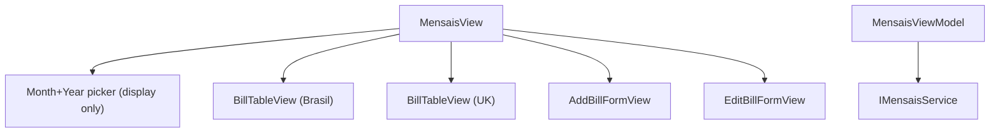

# F05. WPF Mensais View — Technical Specification

## 1. Technical Overview

**What:** Adds a standalone Mensais page to the WPF app's Cash Flow tab: two bill tables (Brasil, showing NIT/Min. Wage columns; UK, without them), an inline Add Bill form, an inline Edit Bill form (Value/Status only), row delete, and a "Reset All to Unset" toolbar action — matching `Financial.Web`'s `MensaisPage.tsx`/`useMensais.ts`.

**Why:** F01–F04 cover Monthly and Reserva. Mensais is architecturally independent (its own backend service, its own destination tab from F01's shell) and is the next of the remaining CashFlow areas.

**Scope:**
- Included: Brasil/UK bill tables; Add Bill inline form; Edit Bill inline form (Value/Status); delete with confirmation; Reset All to Unset with confirmation; the display-only Month+Year picker.
- Excluded: everything owned by F01 (shell)/F02–F04 (Monthly, Reserva) — untouched by this feature except for the `mensaisTab` placeholder from F01's `MainWindow.xaml`.

## 2. Architecture Impact

**Affected components:**
- `Financial.App/ViewModels/CashFlow/MensaisViewModel.cs` — new, standalone page ViewModel (own `IMensaisService`, no shared state with Monthly/Reserva)
- `Financial.App/ViewModels/CashFlow/AddBillFormValidation.cs`, `EditBillFormValidation.cs` — new, static validation classes
- `Financial.App/Views/CashFlow/MensaisView.xaml`(.cs) — new, page shell (display-only month picker + toolbar + hosts the 2 bill tables + 2 inline forms)
- `Financial.App/Views/CashFlow/BillTableView.xaml`(.cs) — new, reusable `DataGrid` for one Area's bills, NIT/Min. Wage columns toggled by a `ShowBrasilFields` dependency property
- `Financial.App/Views/CashFlow/AddBillFormView.xaml`(.cs), `EditBillFormView.xaml`(.cs) — new, inline forms (same recipe as F02–F04's forms)
- `Financial.App/MainWindow.xaml`(.cs) — modified, wires `MensaisView` into the existing `mensaisTab` placeholder
- `Financial.App/App.xaml.cs` — modified, DI registration for `MensaisViewModel`/`MensaisView`

## 3. Technical Decisions

| Decision | Chosen Approach | Alternative Considered | Trade-off |
|----------|-----------------|-------------------------|-----------|
| Month+Year picker functionality | Reuse the existing `Components/MonthYearPicker` purely as a display label bound to local `ViewModel.DisplayYear`/`DisplayMonth` properties (defaulting to `DateTime.Today`) — it does NOT filter `GetBills()` or any other call | Omit the picker since it has no functional effect | Confirmed with the user: `RecurringBillDTO` has no year/month field at all, and the web's own `useMensais.ts` treats the picker as a pure display label (`monthInputValue`) with zero effect on the fetched data — matching that 1:1 preserves PRD parity and avoids surprising a user who compares the two apps |
| Brasil/UK split | `MensaisViewModel.RefreshAsync` fetches the full bill list once via `GetBills()` and exposes two computed `ObservableCollection`s (`BrasilBills`, `UkBills`) filtered client-side by `Area`, refreshed together — mirrors `useMensais.ts`'s `brasilBills`/`ukBills` `useMemo` filters | Two separate service calls per Area | The service has no Area-filtered overload; a single fetch + client-side split matches the web and avoids an unnecessary second round-trip (cheap in-process, no network either way, but keeps the two collections trivially in sync) |
| Bill table reuse | One `BillTableView` `UserControl` with a `ShowBrasilFields` `bool` `DependencyProperty` toggling the NIT/Min. Wage columns' visibility, instantiated twice (once per Area) bound to `BrasilBills`/`UkBills` respectively | Two separate, near-duplicate views (`BrasilBillTableView`, `UkBillTableView`) | Avoids duplicating the 8-column `DataGrid` definition twice; matches the web's own single `BillTable` component parameterized by `showBrasilFields` |
| Due Day input masking | Plain `TextBox` (not the shared `DecimalInputHelper`, which is decimal-oriented) with `AddBillFormValidation` checking it's an integer in [1, 31] — mirrors the web's `type="number" min="1" max="31"` with no client-side masking beyond native browser input | Build a new integer-only input mask helper | Due Day is the only integer field in the whole CashFlow WPF surface so far; a dedicated masking helper is unwarranted complexity for one field, and server-side validation (`MensaisService.CreateBillAsync`'s day-range check) is authoritative regardless |
| Reset All to Unset confirmation | Reuses the same injected `Func<string, bool> confirm` delegate already wired for delete confirmations elsewhere (`MessageBox.Show(..., MessageBoxButton.YesNo, ...)`), with the PRD's exact prompt text | N/A — this is the established pattern from F02–F04 | Consistent with every other destructive/bulk action in the app |

## 4. Component Overview

**New:**

| File Path | New/Modified | Purpose | Key Responsibilities |
|-----------|--------------|---------|------------------------|
| `Financial.App/ViewModels/CashFlow/MensaisViewModel.cs` | New | Page ViewModel | `RefreshAsync` (request-guard pattern per F02–F04 precedent) loading all bills via `GetBills()`; `BrasilBills`/`UkBills` collections; `DisplayYear`/`DisplayMonth` (display-only); Add Bill form state+commands; Edit Bill form state+commands; Delete command with confirmation; Reset All to Unset command with confirmation |
| `Financial.App/ViewModels/CashFlow/AddBillFormValidation.cs` | New | Add validation | Static `BuildValidationMessage(description, dueDay, value, area)`: required Description, Due Day integer in [1,31], Value is a number |
| `Financial.App/ViewModels/CashFlow/EditBillFormValidation.cs` | New | Edit validation | Static `BuildValidationMessage(value, status)`: Value is a number, Status required |
| `Financial.App/Views/CashFlow/MensaisView.xaml`(.cs) | New | Page shell | Display-only `MonthYearPicker`, "Add Bill"/"Reset All to Unset" toolbar buttons, hosts `AddBillFormView`/`EditBillFormView` and two `BillTableView` instances |
| `Financial.App/Views/CashFlow/BillTableView.xaml`(.cs) | New | Reusable bill table | `DataGrid` with edit/delete icon columns, Due Day/Description/Note/[NIT/Min. Wage]/Value/Status columns; `ShowBrasilFields` `DependencyProperty` toggles the 2 Brasil-only columns |
| `Financial.App/Views/CashFlow/AddBillFormView.xaml`(.cs) | New | Add Bill form | Description/Due Day/Value/Area (ComboBox)/Note, plain `TextBox` for Due Day, `DecimalInputHelper` on Value |
| `Financial.App/Views/CashFlow/EditBillFormView.xaml`(.cs) | New | Edit Bill form | Value/Status (ComboBox) only, `DecimalInputHelper` on Value |

**Modified:**

| File Path | New/Modified | Purpose | Key Responsibilities |
|-----------|--------------|---------|------------------------|
| `Financial.App/MainWindow.xaml` | Modified | Shell | `mensaisTab` gains `x:Name="mensaisTab"` (currently header-only) |
| `Financial.App/MainWindow.xaml.cs` | Modified | Shell wiring | Constructor gains a `MensaisView mensaisView` parameter; `mensaisTab.Content = mensaisView;` |
| `Financial.App/App.xaml.cs` | Modified | DI composition root | Registers `MensaisViewModel` (with `IMensaisService` and the existing `confirm` delegate) and `MensaisView` |

**Tests:**

| File Path | Purpose |
|-----------|---------|
| `Tests/Financial.Presentation.Tests/ViewModels/CashFlow/MensaisViewModelTests.cs` | Brasil/UK split, Add Bill, Edit Bill, Delete (confirmed/declined), Reset All to Unset |
| `Tests/Financial.Presentation.Tests/ViewModels/CashFlow/AddBillFormValidationTests.cs` | All validation branches |
| `Tests/Financial.Presentation.Tests/ViewModels/CashFlow/EditBillFormValidationTests.cs` | All validation branches |
| `Tests/Financial.Presentation.Tests/ViewModels/CashFlow/TestStubs.cs` | Modified — adds `StubMensaisService` alongside the existing CashFlow stubs |

## 5. API Contracts

N/A — no HTTP API. In-process service methods this feature calls (all already implemented on `IMensaisService`):

| Method | Signature | Used for |
|--------|-----------|----------|
| `GetBills` | `() -> IReadOnlyList<RecurringBillDTO>` | Both bill tables (client-side split by `Area`) |
| `CreateBillAsync` | `(CreateRecurringBillDTO) -> Task<RecurringBillDTO>` | Add Bill submit |
| `UpdateBillAsync` | `(Guid id, UpdateRecurringBillDTO) -> Task<RecurringBillDTO>` | Edit Bill submit (Value/Status only) |
| `DeleteBillAsync` | `(Guid id) -> Task` | Delete |
| `ResetAllToUnsetAsync` | `() -> Task<IReadOnlyList<RecurringBillDTO>>` | Reset All to Unset |

`GetBills` is synchronous (no `Async` suffix) on the interface, matching `IReserveService.GetBucketBalances` — wrapped in `Task.Run` inside `RefreshAsync` to stay off the UI thread, per F04 precedent. `CreateRecurringBillDTO` has no `NitNumber`/`MinimumWageValue` fields — those are INSS-specific and only ever populated by the spreadsheet import, never by this form (confirmed in `MensaisService.CreateBillAsync`'s comment).

## 6. Data Model

N/A — no schema change. All DTOs (`RecurringBillDTO`, `CreateRecurringBillDTO`, `UpdateRecurringBillDTO`) already exist, unchanged by this feature.

## 7. Testing Strategy

| Test File | Test Type | Target |
|-----------|-----------|--------|
| `MensaisViewModelTests.cs` | Unit | `MensaisViewModel` |
| `AddBillFormValidationTests.cs` | Unit | `AddBillFormValidation` |
| `EditBillFormValidationTests.cs` | Unit | `EditBillFormValidation` |

| Test Function | Description | Assertions |
|----------------|--------------|------------|
| `RefreshAsync_SplitsBillsIntoBrasilAndUkByArea` | Stub bills with mixed `Area` values | `BrasilBills`/`UkBills` contain only their matching Area, correct counts |
| `AddBill_ValidForm_CallsServiceWithCorrectAreaAndClosesForm` (`[Theory]` Brasil/UK) | Fill Description/DueDay/Value/Area | `CreateBillAsync` called with matching request; form closes; bills refreshed |
| `AddBill_InvalidForm_BlocksSaveWithoutServiceCall` (`[Theory]`) | Missing description / out-of-range due day / non-numeric value | Validation error shown, service not called |
| `EditBill_ValidForm_CallsUpdateServiceWithCorrectId` | Open edit on a row, change Value/Status | `UpdateBillAsync` called with correct id/fields; form closes; refreshed |
| `EditBill_InvalidForm_BlocksSaveWithoutServiceCall` | Non-numeric value | Validation error shown, service not called |
| `DeleteBill_ConfirmedAndDeclined_CallsOrSkipsService` (`[Theory]`) | Confirm true/false | Service called only when confirmed |
| `ResetAllToUnset_Confirmed_CallsServiceAndRefreshesBills` | Confirm true | `ResetAllToUnsetAsync` called; bills collection reflects the reset (all `Status == "Unset"`) |
| `ResetAllToUnset_Declined_DoesNotCallService` | Confirm false | Service not called |
| `AddBillFormValidation_*` / `EditBillFormValidation_*` (`[Theory]`) | All required-field/range branches | Correct error text or empty |

**Acceptance criteria traceability (PRD Section 9, F05):** all 6 F05 criteria map to a test above except the purely visual grid-rendering criterion (Brasil showing NIT/Min. Wage columns and UK not showing them), consistent with F01–F04 precedent — verified manually per the plan's final phase.

**Manual verification (acceptance-level, not automated):**
- `dotnet build` succeeds for the whole solution; `dotnet test` passes for `Financial.Presentation.Tests`.
- Launching `Financial.App` against a temporary copy of `data-cashflow.json` (never the live file): add a Brasil bill and a UK bill, confirm NIT/Min. Wage columns show only on the Brasil table, edit a bill's Value/Status, delete a bill, run Reset All to Unset.
