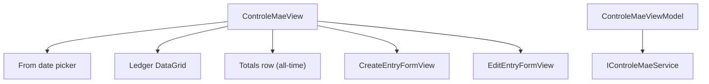

# F06. WPF Controle Mãe View — Technical Specification

## 1. Technical Overview

**What:** Adds a standalone Controle Mãe page to the WPF app's Cash Flow tab: a "From" date filter, a BRL/GBP ledger grid with an all-time totals row, an inline Create Entry form (single-currency input, backend FX conversion), and an inline Edit Entry form (direct BRL/GBP override) — matching `Financial.Web`'s `ControleMaePage.tsx`/`useControleMae.ts`.

**Why:** F01–F05 cover Monthly, Reserva, and Mensais. Controle Mãe is architecturally independent (its own backend service, its own destination tab from F01's shell) and is the next of the remaining CashFlow areas.

**Scope:**
- Included: "From" date filter; ledger grid (Date/Description/Note/BRL/GBP with "—" for null) with edit/delete actions; all-time totals row; Create Entry inline form (Date/Description/Note/Currency/Value → backend FX conversion); Edit Entry inline form (direct BRL/GBP override, nullable).
- Excluded: everything owned by F01 (shell)/F02–F05 (Monthly, Reserva, Mensais) — untouched by this feature except for the `controleMaeTab` placeholder from F01's `MainWindow.xaml`.

## 2. Architecture Impact

**Affected components:**
- `Financial.App/ViewModels/CashFlow/ControleMaeViewModel.cs` — new, standalone page ViewModel (own `IControleMaeService`, no shared state with Monthly/Reserva/Mensais)
- `Financial.App/ViewModels/CashFlow/CreateEntryFormValidation.cs`, `EditEntryFormValidation.cs` — new, static validation classes
- `Financial.App/Views/CashFlow/ControleMaeView.xaml`(.cs) — new, page shell (From date picker + toolbar + ledger grid + totals row + hosts the 2 inline forms)
- `Financial.App/Views/CashFlow/CreateEntryFormView.xaml`(.cs), `EditEntryFormView.xaml`(.cs) — new, inline forms (same recipe as F02–F05's forms)
- `Financial.App/MainWindow.xaml`(.cs) — modified, wires `ControleMaeView` into the existing `controleMaeTab` placeholder
- `Financial.App/App.xaml.cs` — modified, DI registration for `ControleMaeViewModel`/`ControleMaeView`

## 3. Technical Decisions

| Decision | Chosen Approach | Alternative Considered | Trade-off |
|----------|-----------------|-------------------------|-----------|
| Totals row scope | Bind the totals row to `IControleMaeService.GetTotals()` — the backend's all-time, unfiltered BRL/GBP sum — fetched once at load and re-fetched after any create/edit/delete, but NOT when the "From" date changes | Compute totals client-side as a sum of the currently-filtered (on/after From date) entries | Confirmed with the user: the PRD's Experience wording ("changing the From date refetches... and totals") doesn't match the actual web reference, whose totals row is explicitly labeled "Total (all entries)" and sourced from a separate `getMaeLedgerTotals()` call with no date dependency in its `useEffect`. Matching the shipped web behavior (not the PRD's imprecise wording) preserves 1:1 parity with the app users already know |
| "From" date change behavior | Setting `FromDate` triggers `RefreshEntriesAsync()` (re-fetches `GetEntriesFromDate` only); totals are untouched by this call | Re-fetch both entries and totals on date change | Consistent with the totals-scope decision above — totals genuinely don't depend on the date filter |
| Create Entry Value / Edit Entry BRL,GBP input masking | Plain `TextBox`es (not the shared `DecimalInputHelper`, which blocks a leading minus sign) with lost-focus separator normalization only | Use `DecimalInputHelper` and forbid negative ledger entries | `CreateEntryAsync` only rejects zero (`SourceValue == 0`), not negative values, and `UpdateEntryValuesAsync` accepts any decimal or `null` — negative Controle Mãe entries are valid (e.g., a debit), so the field must accept a minus sign, same reasoning as F04's Edit Movement Amount field |
| Edit Entry blank-field semantics | An empty BRL or GBP `TextBox` on submit maps to `null` in `UpdateEntryValuesDTO` (matches the backend's nullable fields and the web's `trim() === '' ? null : Number(...)`); a non-empty but non-numeric value is a validation error | Treat blank as "leave unchanged" | The backend's `UpdateEntryValuesAsync` always overwrites both `BrlValue`/`GbpValue` with whatever the request carries (including `null`) — there's no "unchanged" concept server-side, so the WPF field must mirror that explicit null-vs-value semantics exactly |

## 4. Component Overview

**New:**

| File Path | New/Modified | Purpose | Key Responsibilities |
|-----------|--------------|---------|------------------------|
| `Financial.App/ViewModels/CashFlow/ControleMaeViewModel.cs` | New | Page ViewModel | `FromDate` (defaults to Jan 1 of the previous year, matching `previousYearJanuaryFirst()`) triggering `RefreshEntriesAsync`; `Entries` collection; `Totals` (fetched independently, request-guard pattern per F02–F05 precedent); Create Entry form state+commands; Edit Entry form state+commands; Delete command with confirmation |
| `Financial.App/ViewModels/CashFlow/CreateEntryFormValidation.cs` | New | Create validation | Static `BuildValidationMessage(date, description, value)`: required Date, required Description, Value is a non-zero number |
| `Financial.App/ViewModels/CashFlow/EditEntryFormValidation.cs` | New | Edit validation | Static `BuildValidationMessage(brlValue, gbpValue)`: each field, if non-empty, must parse as a number (blank is valid → null) |
| `Financial.App/Views/CashFlow/ControleMaeView.xaml`(.cs) | New | Page shell | "From" `DatePicker`, "New Entry" toolbar button, ledger `DataGrid` with edit/delete icon columns and "—" for null BRL/GBP, all-time totals row, hosts `CreateEntryFormView`/`EditEntryFormView` |
| `Financial.App/Views/CashFlow/CreateEntryFormView.xaml`(.cs) | New | Create Entry form | Date/Description/Note/Currency (ComboBox: BRL, GBP)/Value, plain `TextBox` for Value |
| `Financial.App/Views/CashFlow/EditEntryFormView.xaml`(.cs) | New | Edit Entry form | BRL Value/GBP Value, both plain `TextBox`es (nullable-on-blank semantics) |

**Modified:**

| File Path | New/Modified | Purpose | Key Responsibilities |
|-----------|--------------|---------|------------------------|
| `Financial.App/MainWindow.xaml` | Modified | Shell | `controleMaeTab` gains `x:Name="controleMaeTab"` (currently header-only) |
| `Financial.App/MainWindow.xaml.cs` | Modified | Shell wiring | Constructor gains a `ControleMaeView controleMaeView` parameter; `controleMaeTab.Content = controleMaeView;` |
| `Financial.App/App.xaml.cs` | Modified | DI composition root | Registers `ControleMaeViewModel` (with `IControleMaeService` and the existing `confirm` delegate) and `ControleMaeView` |

**Tests:**

| File Path | Purpose |
|-----------|---------|
| `Tests/Financial.Presentation.Tests/ViewModels/CashFlow/ControleMaeViewModelTests.cs` | Entry loading/filtering, totals independence from FromDate, Create (BRL/GBP), Edit (incl. blank-to-null), Delete (confirmed/declined) |
| `Tests/Financial.Presentation.Tests/ViewModels/CashFlow/CreateEntryFormValidationTests.cs` | All validation branches |
| `Tests/Financial.Presentation.Tests/ViewModels/CashFlow/EditEntryFormValidationTests.cs` | All validation branches |
| `Tests/Financial.Presentation.Tests/ViewModels/CashFlow/TestStubs.cs` | Modified — adds `StubControleMaeService` alongside the existing CashFlow stubs |

## 5. API Contracts

N/A — no HTTP API. In-process service methods this feature calls (all already implemented on `IControleMaeService`):

| Method | Signature | Used for |
|--------|-----------|----------|
| `GetEntriesFromDate` | `(DateOnly fromDate) -> IReadOnlyList<MaeLedgerEntryDTO>` | Ledger grid, re-fetched whenever `FromDate` changes |
| `GetTotals` | `() -> MaeLedgerTotalsDTO` | All-time totals row, fetched at load and after any mutation — never re-fetched on `FromDate` change |
| `CreateEntryAsync` | `(CreateMaeLedgerEntryDTO) -> Task<MaeLedgerEntryDTO>` | Create Entry submit — backend performs the FX conversion via `IExchangeRateProvider`; a missing rate silently leaves the converted side `null` (no exception), so the PRD's "FX conversion fails" error path is only reached for a genuine provider exception, already covered by the standard try/catch-and-show-message pattern used throughout F02–F05 |
| `UpdateEntryValuesAsync` | `(Guid id, UpdateMaeLedgerEntryValuesDTO) -> Task<MaeLedgerEntryDTO>` | Edit Entry submit |
| `DeleteEntryAsync` | `(Guid id) -> Task` | Delete |

Both `GetEntriesFromDate` and `GetTotals` are synchronous (no `Async` suffix) on the interface — wrapped in `Task.Run` inside the ViewModel's refresh methods to stay off the UI thread, per F04/F05 precedent.

## 6. Data Model

N/A — no schema change. All DTOs (`MaeLedgerEntryDTO`, `MaeLedgerTotalsDTO`, `CreateMaeLedgerEntryDTO`, `UpdateMaeLedgerEntryValuesDTO`) already exist, unchanged by this feature.

## 7. Testing Strategy

| Test File | Test Type | Target |
|-----------|-----------|--------|
| `ControleMaeViewModelTests.cs` | Unit | `ControleMaeViewModel` |
| `CreateEntryFormValidationTests.cs` | Unit | `CreateEntryFormValidation` |
| `EditEntryFormValidationTests.cs` | Unit | `EditEntryFormValidation` |

| Test Function | Description | Assertions |
|----------------|--------------|------------|
| `RefreshEntriesAsync_LoadsEntriesFromDate` | Stub entries; set `FromDate` | `GetEntriesFromDate` called with the current `FromDate`; `Entries` populated |
| `SettingFromDate_RefetchesEntriesButNotTotals` | Track call counts on the stub | Changing `FromDate` increments the entries-fetch call count but leaves the totals-fetch call count unchanged |
| `CreateEntry_ValidFormBrl_CallsServiceAndClosesForm` | Fill Date/Description/Value, Currency=BRL | `CreateEntryAsync` called with `SourceCurrency = "BRL"`; form closes; entries+totals refreshed |
| `CreateEntry_ValidFormGbp_CallsServiceWithGbpCurrency` | Currency=GBP | `CreateEntryAsync` called with `SourceCurrency = "GBP"` |
| `CreateEntry_InvalidForm_BlocksSaveWithoutServiceCall` (`[Theory]`) | Missing date / empty description / zero value | Validation error shown, service not called |
| `EditEntry_ValidFormBothValues_CallsUpdateServiceWithParsedValues` | Fill BRL and GBP | `UpdateEntryValuesAsync` called with both non-null values |
| `EditEntry_BlankField_MapsToNull` | Leave GBP blank | `UpdateEntryValuesAsync` called with `GbpValue = null` |
| `EditEntry_InvalidForm_BlocksSaveWithoutServiceCall` | Non-numeric BRL | Validation error shown, service not called |
| `DeleteEntry_ConfirmedAndDeclined_CallsOrSkipsService` (`[Theory]`) | Confirm true/false | Service called only when confirmed |
| `CreateEntryFormValidation_*` / `EditEntryFormValidation_*` (`[Theory]`) | All required-field/range branches | Correct error text or empty |

**Acceptance criteria traceability (PRD Section 9, F06):** all 6 F06 criteria map to a test above except the purely visual grid-rendering criterion ("—" display for null values), consistent with F01–F05 precedent — verified manually per the plan's final phase. The "correct totals row" and "changing From date refetches the grid and totals" criteria are covered per the Technical Decisions section's clarified scope (totals are all-time and independent of `FromDate`, confirmed with the user).

**Manual verification (acceptance-level, not automated):**
- `dotnet build` succeeds for the whole solution; `dotnet test` passes for `Financial.Presentation.Tests`.
- Launching `Financial.App` against a temporary copy of `data-cashflow.json` (never the live file): change the From date and confirm the grid re-filters, create a BRL entry and confirm a GBP value appears, edit an entry's values directly, delete an entry.
