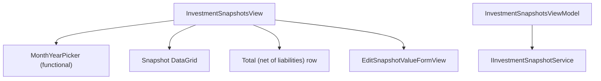

# F07. WPF Investment Snapshots View — Technical Specification

## 1. Technical Overview

**What:** Adds a standalone Investment Snapshots page to the WPF app's Cash Flow tab: a functional Month+Year picker (unlike F05's Mensais picker, this one genuinely filters the data since `GetSnapshotsForMonthAsync` takes year/month), a snapshot grid (one row per account, liability accounts suffixed "(liability)") with an inline Value-only edit form, and a client-computed "Total (net of liabilities)" row — matching `Financial.Web`'s `InvestmentSnapshotsPage.tsx`/`useInvestmentSnapshots.ts`.

**Why:** F01–F06 cover Monthly, Reserva, Mensais, and Controle Mãe. Investment Snapshots is architecturally independent (its own backend service, its own destination tab from F01's shell) and is the next of the remaining CashFlow areas.

**Scope:**
- Included: functional Month+Year picker; snapshot grid (Account with liability suffix, Value) with edit action; inline Edit Value form; client-computed net-of-liabilities totals row.
- Excluded: everything owned by F01 (shell)/F02–F06 — untouched by this feature except for the `investmentSnapshotsTab` placeholder from F01's `MainWindow.xaml`.

## 2. Architecture Impact

**Affected components:**
- `Financial.App/ViewModels/CashFlow/InvestmentSnapshotsViewModel.cs` — new, standalone page ViewModel (own `IInvestmentSnapshotService`, no shared state with other CashFlow ViewModels)
- `Financial.App/ViewModels/CashFlow/EditSnapshotValueFormValidation.cs` — new, static validation class
- `Financial.App/Views/CashFlow/InvestmentSnapshotsView.xaml`(.cs) — new, page shell (functional `MonthYearPicker` + snapshot grid + totals row + hosts the inline edit form)
- `Financial.App/Views/CashFlow/EditSnapshotValueFormView.xaml`(.cs) — new, inline form (same recipe as F02–F06's forms)
- `Financial.App/MainWindow.xaml`(.cs) — modified, wires `InvestmentSnapshotsView` into the existing `investmentSnapshotsTab` placeholder
- `Financial.App/App.xaml.cs` — modified, DI registration for `InvestmentSnapshotsViewModel`/`InvestmentSnapshotsView`

## 3. Technical Decisions

| Decision | Chosen Approach | Alternative Considered | Trade-off |
|----------|-----------------|-------------------------|-----------|
| Month+Year picker functionality | Reuse the existing `Components/MonthYearPicker` bound to `Year`/`Month` properties whose setters trigger `RefreshAsync()` — genuinely functional here, unlike F05's Mensais picker, since `GetSnapshotsForMonthAsync(year, month)` actually filters | N/A — this is the same component F02 already established, used in its functional mode this time | Consistent with F02's precedent; the picker component itself is identical, only its wiring differs (display-only in F05 vs. functional here and in F02) |
| Totals computation | Client-side in the ViewModel: `Snapshots.Sum(s => s.IsLiability ? -s.Value : s.Value)`, exposed as a computed `NetTotal` property re-raised whenever `Snapshots` is replaced — mirrors `useInvestmentSnapshots.ts`'s `totalValue` `useMemo` exactly | Ask the backend for a totals endpoint | No such endpoint exists on `IInvestmentSnapshotService`; the web reference itself computes this client-side from the already-fetched snapshot list, so replicating that is both simpler and matches the reference 1:1 |
| Value input masking | Reuses the shared `DecimalInputHelper` (unlike F04/F06's negative-value fields) since snapshot values must be ≥ 0 — the standard masked `TextBox` recipe from F02–F03 applies unmodified | Plain `TextBox` like the negative-allowing fields elsewhere | `UpdateSnapshotValueAsync` rejects negative values server-side, and the web's own `min="0"` input matches — no reason to deviate from the established masked-input recipe here |
| Liability label rendering | A computed `DisplayLabel` property on a thin `SnapshotRow` wrapper (or directly via a `IValueConverter`/`DataTrigger` in XAML) appending " (liability)" when `IsLiability` is true | Two separate `DataGridTextColumn`s toggled by visibility | A single computed label string is simpler than F05's two-column-toggle pattern (which existed because Brasil/UK genuinely have different column sets) — here it's just one column's text varying, so a computed string property is the minimal correct approach |

## 4. Component Overview

**New:**

| File Path | New/Modified | Purpose | Key Responsibilities |
|-----------|--------------|---------|------------------------|
| `Financial.App/ViewModels/CashFlow/InvestmentSnapshotsViewModel.cs` | New | Page ViewModel | `Year`/`Month` (setters trigger `RefreshAsync`, request-guard pattern per F02–F06 precedent); `Snapshots` collection wrapped in a `SnapshotRow` (adds `DisplayLabel`); `NetTotal` computed property; Edit Value form state+commands calling `UpdateSnapshotValueAsync` |
| `Financial.App/ViewModels/CashFlow/SnapshotRow.cs` | New | Grid row wrapper | Wraps `InvestmentSnapshotDTO` fields plus a computed `DisplayLabel` (`"{Account} (liability)"` when `IsLiability`, else `Account`) |
| `Financial.App/ViewModels/CashFlow/EditSnapshotValueFormValidation.cs` | New | Edit validation | Static `BuildValidationMessage(value)`: Value is a number and ≥ 0 |
| `Financial.App/Views/CashFlow/InvestmentSnapshotsView.xaml`(.cs) | New | Page shell | `MonthYearPicker` bound TwoWay to `Year`/`Month`, snapshot `DataGrid` with edit icon column, "Total (net of liabilities)" row, hosts `EditSnapshotValueFormView` |
| `Financial.App/Views/CashFlow/EditSnapshotValueFormView.xaml`(.cs) | New | Edit Value form | Single Value field with `DecimalInputHelper` masking |

**Modified:**

| File Path | New/Modified | Purpose | Key Responsibilities |
|-----------|--------------|---------|------------------------|
| `Financial.App/MainWindow.xaml` | Modified | Shell | `investmentSnapshotsTab` gains `x:Name="investmentSnapshotsTab"` (currently header-only) |
| `Financial.App/MainWindow.xaml.cs` | Modified | Shell wiring | Constructor gains an `InvestmentSnapshotsView investmentSnapshotsView` parameter; `investmentSnapshotsTab.Content = investmentSnapshotsView;` |
| `Financial.App/App.xaml.cs` | Modified | DI composition root | Registers `InvestmentSnapshotsViewModel` (with `IInvestmentSnapshotService`) and `InvestmentSnapshotsView` — no `confirm` delegate needed, this feature has no delete/destructive action |

**Tests:**

| File Path | Purpose |
|-----------|---------|
| `Tests/Financial.Presentation.Tests/ViewModels/CashFlow/InvestmentSnapshotsViewModelTests.cs` | Loading/refetch on Year/Month change, liability label, net total computation, Edit Value (valid/invalid/failed) |
| `Tests/Financial.Presentation.Tests/ViewModels/CashFlow/EditSnapshotValueFormValidationTests.cs` | All validation branches |
| `Tests/Financial.Presentation.Tests/ViewModels/CashFlow/TestStubs.cs` | Modified — adds `StubInvestmentSnapshotService` alongside the existing CashFlow stubs |

## 5. API Contracts

N/A — no HTTP API. In-process service methods this feature calls (all already implemented on `IInvestmentSnapshotService`):

| Method | Signature | Used for |
|--------|-----------|----------|
| `GetSnapshotsForMonthAsync` | `(int year, int month) -> Task<IReadOnlyList<InvestmentSnapshotDTO>>` | Snapshot grid, re-fetched whenever `Year`/`Month` changes |
| `UpdateSnapshotValueAsync` | `(Guid id, UpdateInvestmentSnapshotValueDTO) -> Task<InvestmentSnapshotDTO>` | Edit Value submit; throws `ArgumentException` server-side for a negative value (defense-in-depth behind the client-side check) |

## 6. Data Model

N/A — no schema change. All DTOs (`InvestmentSnapshotDTO`, `UpdateInvestmentSnapshotValueDTO`) already exist, unchanged by this feature.

## 7. Testing Strategy

| Test File | Test Type | Target |
|-----------|-----------|--------|
| `InvestmentSnapshotsViewModelTests.cs` | Unit | `InvestmentSnapshotsViewModel` |
| `EditSnapshotValueFormValidationTests.cs` | Unit | `EditSnapshotValueFormValidation` |

| Test Function | Description | Assertions |
|----------------|--------------|------------|
| `RefreshAsync_LoadsSnapshotsForSelectedYearMonth` | Stub snapshots; set Year/Month | `GetSnapshotsForMonthAsync` called with matching year/month; `Snapshots` populated |
| `SettingYearOrMonth_RefetchesSnapshots` (`[Theory]`) | Change Year, then Month | Each change increments the fetch call count |
| `SnapshotRow_LiabilityAccount_ShowsSuffixedLabel` | Stub a liability + a non-liability account | Liability row's `DisplayLabel` ends with " (liability)"; non-liability row's does not |
| `NetTotal_SubtractsLiabilityValues` | Stub 2 asset accounts + 1 liability account with known values | `NetTotal` equals assets sum minus liability value |
| `EditSnapshot_ValidForm_CallsUpdateServiceAndClosesForm` | Open edit on a row, change Value | `UpdateSnapshotValueAsync` called with correct id/value; form closes; snapshots refreshed |
| `EditSnapshot_InvalidForm_BlocksSaveWithoutServiceCall` (`[Theory]`) | Negative / non-numeric value | Validation error shown, service not called |
| `EditSnapshot_BackendRejects_KeepsFormOpenWithValueIntactAndShowsServerError` | Stub throws | Form stays open, entered value intact, error message shown |
| `EditSnapshotValueFormValidation_*` (`[Theory]`) | All required-field/range branches | Correct error text or empty |

**Acceptance criteria traceability (PRD Section 9, F07):** all 4 F07 criteria map to a test above except the purely visual grid-rendering aspect (the label suffix is tested at the data level via `SnapshotRow.DisplayLabel`, not the XAML rendering itself), consistent with F01–F06 precedent — verified manually per the plan's final phase.

**Manual verification (acceptance-level, not automated):**
- `dotnet build` succeeds for the whole solution; `dotnet test` passes for `Financial.Presentation.Tests`.
- Launching `Financial.App` against a temporary copy of `data-cashflow.json` (never the live file): change the Month/Year picker and confirm the grid refetches, confirm liability accounts show the "(liability)" suffix, edit a snapshot's value and confirm the grid and total update.
