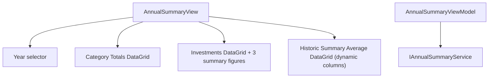

# F08. WPF Annual Summary View — Technical Specification

## 1. Technical Overview

**What:** Adds the final standalone CashFlow page to the WPF app: a Year selector driving 3 read-only sub-tabs (Category Totals, Investments, Historic Summary Average), each rendering the exact row/column layout, spacer rows, and emphasized rows of `Financial.Web`'s `AnnualSummaryPage.tsx`/`useAnnualSummary.ts`.

**Why:** F01–F07 cover Monthly, Reserva, Mensais, Controle Mãe, and Investment Snapshots. Annual Summary is the last of F01's 6 reserved Cash Flow destinations and completes WPF/Web CashFlow parity.

**Scope:**
- Included: functional Year selector (all 3 sub-tabs load together per year, no per-tab-switch re-fetch); Category Totals sub-tab (income rows, per-category rows, spacers, emphasized Resultado/Total despesas); Investments sub-tab (per-account rows with liability suffix, Total/Month Result rows, 3 summary figures); Historic Summary Average sub-tab (dynamic per-year columns, spacers, emphasized rows).
- Excluded: everything owned by F01 (shell)/F02–F07 — untouched by this feature except for the `annualSummaryTab` placeholder from F01's `MainWindow.xaml`. No charts (the web itself is tables-only for CashFlow).

## 2. Architecture Impact

**Affected components:**
- `Financial.App/ViewModels/CashFlow/AnnualSummaryViewModel.cs` — new, standalone page ViewModel (own `IAnnualSummaryService`, no shared state with other CashFlow ViewModels)
- `Financial.App/ViewModels/CashFlow/AnnualSummaryRow.cs` — new, unified row type for the Category Totals sub-tab (fixed income rows + dynamic category rows + spacers, one row shape)
- `Financial.App/ViewModels/CashFlow/InvestmentAnnualRow.cs` — new, row type for the Investments sub-tab (nullable monthly values, no Average/Annual Total)
- `Financial.App/ViewModels/CashFlow/HistoricSummaryRow.cs` — new, row type for the Historic Summary Average sub-tab (`Dictionary<int, decimal> ValuesByYear`, spacer/emphasis flags)
- `Financial.App/Views/CashFlow/AnnualSummaryView.xaml`(.cs) — new, page shell (Year `TextBox`/numeric input + nested `TabControl` with 3 sub-tab `DataGrid`s); code-behind dynamically builds the Historic Summary Average `DataGrid`'s per-year columns
- `Financial.App/MainWindow.xaml`(.cs) — modified, wires `AnnualSummaryView` into the existing `annualSummaryTab` placeholder
- `Financial.App/App.xaml.cs` — modified, DI registration for `AnnualSummaryViewModel`/`AnnualSummaryView`

## 3. Technical Decisions

| Decision | Chosen Approach | Alternative Considered | Trade-off |
|----------|-----------------|-------------------------|-----------|
| Tab-switch-without-refetch | All 3 service calls happen together in one `RefreshAsync()` triggered only by the `Year` setter; the nested `TabControl`'s tab switch is pure UI state with no ViewModel involvement, so switching tabs never touches the already-loaded collections | Fetch each sub-tab's data lazily on first activation | Directly required by the PRD's Experience block ("Switching sub-tabs... without re-fetching if the year hasn't changed") — matches `useAnnualSummary.ts`'s single combined `Promise.all` fetch exactly |
| Category Totals row modeling | One unified `AnnualSummaryRow` type (`Label`, `MonthlyValues[12]`, `Average`, `AnnualTotal`, `IsSpacer`, `IsEmphasized`) built by `RefreshAsync` as a flat list: Salary, Salary after taxes, Tax difference, spacer, Dividendo/Juros, spacer, one row per `CategoryTotals` entry, spacer, Resultado (emphasized), Total despesas (emphasized) | Separate typed sections in XAML (fixed income rows hardcoded, category rows in a nested `ItemsControl`) | A single flat row list bound to one `DataGrid` is simpler than mixing multiple bound collections in one table and mirrors the web's own flat JSX row sequence; a `DataTrigger` on `IsSpacer`/`IsEmphasized` handles the visual distinction, matching the `RowStyle` pattern already used for F03's history rows |
| Investments row modeling | `InvestmentAnnualRow` (`Label`, `MonthlyValues` as `decimal?[12]`, `IsEmphasized`) — one row per account (label suffixed `" (-)"` when liability) plus a Total row and a Month Result row (both from `NetPosition`, both emphasized); null cells render blank (matches the web's `v === null ? null : ...`) | Reuse `AnnualSummaryRow` with unused Average/AnnualTotal fields | The Investments table structurally has no Average/Annual Total columns at all (unlike Category Totals) and needs nullable cells for the first-month diff — a distinct, purpose-built row type is clearer than repurposing a row shape with irrelevant fields |
| Historic Summary Average dynamic columns | Per user confirmation: `HistoricSummaryRow` exposes `Dictionary<int, decimal> ValuesByYear`; the View's code-behind builds one `DataGridTextColumn` per year returned by the ViewModel (`Binding = new Binding($"ValuesByYear[{year}]")`, `StringFormat=N2`), rebuilding the column set whenever `Year` changes and the returned year list differs from the previous one | `AutoGenerateColumns=true` with dynamic (`ExpandoObject`/`DataTable`) rows | Confirmed with the user: explicit code-behind column generation stays consistent with every other grid in the app being statically typed, and is the standard WPF technique for a column count only known after data loads |
| Historic Summary Average row set | Rows come from `historicSummaryAverage[0].AnnualAverages` (assumes every year shares the same category list, matching the web's identical assumption) — spacer inserted after rows named "Tax difference", "Dividendo/Juros", "Reserva"; "Resultado (R-D-Inv)" and "Total despesas" rows are emphasized, both sets matched by exact category-name string comparison | Ask the backend for spacer/emphasis metadata | No such metadata exists on `CategoryAnnualGroupValueDTO` — the web itself hardcodes these category-name sets (`HISTORIC_SUMMARY_AVERAGE_SPACER_AFTER`/`_EMPHASIZED`), so replicating the same hardcoded sets is the correct 1:1 port, not a shortcut |

## 4. Component Overview

**New:**

| File Path | New/Modified | Purpose | Key Responsibilities |
|-----------|--------------|---------|------------------------|
| `Financial.App/ViewModels/CashFlow/AnnualSummaryViewModel.cs` | New | Page ViewModel | `Year` (setter triggers `RefreshAsync`, request-guard pattern per F02–F07 precedent); `CategoryTotalRows`, `InvestmentRows`, `HistoricSummaryRows`, `AvailableYears` (int list, drives dynamic columns) collections; `NetPosition` summary figures (`YearProgress`, `AverageMonthResult`, `SumOfMonthResults`) |
| `Financial.App/ViewModels/CashFlow/AnnualSummaryRow.cs` | New | Category Totals row | `Label`, `MonthlyValues` (`decimal[12]`), `Average`, `AnnualTotal`, `IsSpacer`, `IsEmphasized` |
| `Financial.App/ViewModels/CashFlow/InvestmentAnnualRow.cs` | New | Investments row | `Label`, `MonthlyValues` (`decimal?[12]`), `IsEmphasized` |
| `Financial.App/ViewModels/CashFlow/HistoricSummaryRow.cs` | New | Historic Summary Average row | `Category`, `ValuesByYear` (`Dictionary<int, decimal>`), `IsSpacer`, `IsEmphasized` |
| `Financial.App/Views/CashFlow/AnnualSummaryView.xaml`(.cs) | New | Page shell | Year numeric input, nested `TabControl` (Category Totals / Investments / Historic Summary Average), 3 `DataGrid`s (2 static XAML-declared, 1 with code-behind-generated columns), 3 investment summary figures |

**Modified:**

| File Path | New/Modified | Purpose | Key Responsibilities |
|-----------|--------------|---------|------------------------|
| `Financial.App/MainWindow.xaml` | Modified | Shell | `annualSummaryTab` gains `x:Name="annualSummaryTab"` (currently header-only) |
| `Financial.App/MainWindow.xaml.cs` | Modified | Shell wiring | Constructor gains an `AnnualSummaryView annualSummaryView` parameter; `annualSummaryTab.Content = annualSummaryView;` |
| `Financial.App/App.xaml.cs` | Modified | DI composition root | Registers `AnnualSummaryViewModel` (with `IAnnualSummaryService`) and `AnnualSummaryView` — no `confirm` delegate needed, this feature is entirely read-only |

**Tests:**

| File Path | Purpose |
|-----------|---------|
| `Tests/Financial.Presentation.Tests/ViewModels/CashFlow/AnnualSummaryViewModelTests.cs` | Row-building for all 3 sub-tabs (spacers, emphasis, liability suffix, nullable investment cells), Year-change refetch, no-refetch on tab switch (implicit — no command exists for it) |
| `Tests/Financial.Presentation.Tests/ViewModels/CashFlow/TestStubs.cs` | Modified — adds `StubAnnualSummaryService` alongside the existing CashFlow stubs |

## 5. API Contracts

N/A — no HTTP API. In-process service methods this feature calls (all already implemented on `IAnnualSummaryService`, all synchronous — wrapped in `Task.Run` inside `RefreshAsync`, per F04–F07 precedent):

| Method | Signature | Used for |
|--------|-----------|----------|
| `GetCategoryTotalsAnnualForYear` | `(int year) -> CategoryTotalsAnnualDTO` | Category Totals sub-tab (income rows, category rows, Resultado, Total despesas) |
| `GetInvestmentAnnualResultForYear` | `(int year) -> InvestmentAnnualResultDTO` | Investments sub-tab (per-account rows, Total, Month Result, 3 summary figures) |
| `GetHistoricSummaryAverageFromYear` | `(int year) -> IReadOnlyList<CategoryAnnualGroupValueDTO>` | Historic Summary Average sub-tab (one entry per available year, each with the full category list) |

All 3 are called together (via `Task.WhenAll`-style parallel `Task.Run` calls) inside a single `RefreshAsync()`, matching `useAnnualSummary.ts`'s combined `Promise.all`.

## 6. Data Model

N/A — no schema change. All DTOs (`CategoryTotalsAnnualDTO`, `CategoryAnnualTotalDTO`, `IncomeAnnualSummaryDTO`, `InvestmentAnnualResultDTO`, `InvestmentAccountAnnualDiffDTO`, `NetPositionAnnualDiffDTO`, `CategoryAnnualGroupValueDTO`, `CategoryGroupValueDTO`) already exist, unchanged by this feature.

## 7. Testing Strategy

| Test File | Test Type | Target |
|-----------|-----------|--------|
| `AnnualSummaryViewModelTests.cs` | Unit | `AnnualSummaryViewModel` |

| Test Function | Description | Assertions |
|----------------|--------------|------------|
| `RefreshAsync_BuildsCategoryTotalsRowsInCorrectOrderWithSpacersAndEmphasis` | Stub a full `CategoryTotalsAnnualDTO` (income summary + 2 categories) | `CategoryTotalRows` has the exact expected sequence: Salary, Salary after taxes, Tax difference, spacer, Dividendo/Juros, spacer, 2 category rows, spacer, Resultado (emphasized), Total despesas (emphasized) |
| `RefreshAsync_BuildsInvestmentRowsWithLiabilitySuffixAndNullableCells` | Stub 1 asset account, 1 liability account, `NetPosition` with a null first-month diff | Liability row's `Label` ends with " (-)"; Total/Month Result rows present and emphasized; `MonthlyValues[0]` is null on the Month Result row when the DTO's diff is null |
| `RefreshAsync_ExposesNetPositionSummaryFigures` | Stub `NetPosition` with known `FullYearNetChange`/`AverageMonthResult`/`SumOfMonthResults` | `YearProgress`/`AverageMonthResult`/`SumOfMonthResults` match the stubbed values |
| `RefreshAsync_BuildsHistoricSummaryRowsWithSpacersAndEmphasis` | Stub 2 years, each with the same category set including "Tax difference", "Reserva", "Resultado (R-D-Inv)" | `HistoricSummaryRows` has a spacer immediately after "Tax difference" and after "Reserva"; "Resultado (R-D-Inv)" row is emphasized; each row's `ValuesByYear` has an entry per stubbed year with the correct value |
| `RefreshAsync_ExposesAvailableYearsFromHistoricSummaryResponse` | Stub 3 years | `AvailableYears` contains exactly those 3 years, in the order returned |
| `SettingYear_RefetchesAllThreeSubTabs` | Track call counts on the stub for all 3 methods | Changing `Year` increments all 3 call counts |

**Acceptance criteria traceability (PRD Section 9, F08):** all 5 F08 criteria map to a test above except the purely visual rendering aspects (right-alignment, bold styling itself — the row-level `IsEmphasized`/`IsSpacer` flags that drive that styling are tested at the data level), consistent with F01–F07 precedent — verified manually per the plan's final phase. The Cross-Feature Integration criterion (F01 hosting F02/F04/F05/F06/F07/F08 together) becomes checkable in the PRD once this feature merges, since all 6 will then be implemented — verified by the existing `MainWindow` wiring plus this feature's own smoke test.

**Manual verification (acceptance-level, not automated):**
- `dotnet build` succeeds for the whole solution; `dotnet test` passes for `Financial.Presentation.Tests`.
- Launching `Financial.App` against a temporary copy of `data-cashflow.json` (never the live file): change the Year selector and confirm all 3 sub-tabs update; switch sub-tabs and confirm no reload flicker; confirm spacer rows and bold Resultado/Total despesas/Total/Month Result rows render correctly; confirm the Historic Summary Average tab shows one column per year.
