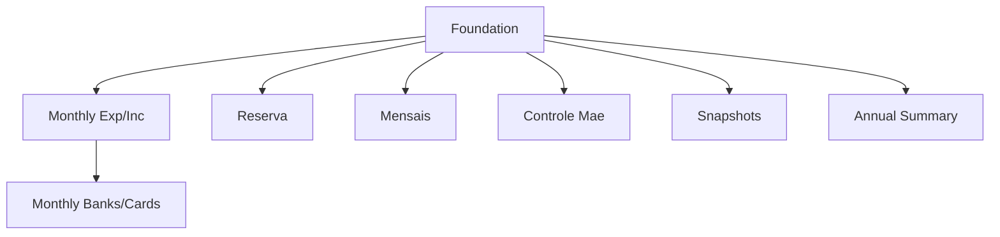

# WPF CashFlow Parity

## 1. Executive Summary

Financial is a personal finance application, installed as a private copy per user, covering two domains: Investments and CashFlow (household expenses, income, bank balances, recurring bills, and a family ledger). The `Financial.CashFlow` domain was built with a complete backend and a React web frontend (`Financial.Web`), but the WPF desktop application (`Financial.App`) only ever implemented the Investments domain. Users who prefer the desktop app — or who use it alongside the web app on a shared machine — currently have no way to record an expense, log income, move money between banks, correct a balance, track the family reserve fund, manage recurring bills, keep the Controle Mãe (BRL/GBP) ledger, or review the annual summary without switching to the browser.

WPF CashFlow Parity closes this gap by bringing `Financial.App` to full functional parity with `Financial.Web` for the CashFlow domain. It adds a new "Cash Flow" section to the existing desktop app, structured as six views — Monthly, Reserva, Mensais, Controle Mãe, Investment Snapshots, and Annual Summary — that mirror the web app's pages, forms, and grids field-for-field. The desktop app already calls the Investments backend services in-process via dependency injection rather than over HTTP; this project extends that same pattern to the already-complete `Financial.CashFlow.Application` services, so no backend, domain, or Investments-area changes are required. The result is a single desktop app where a user can manage their entire financial picture — investments and cash flow — without needing the browser.

## 2. Problem and Opportunity

**The Problem**

- **Feature gap forces a tool switch.** A user actively managing cash flow (expenses, bank balances, bills) must leave the desktop app and open a browser to `Financial.Web` for every CashFlow task — 100% of CashFlow functionality (6 pages, 12 backend services) is unavailable in `Financial.App`.
- **Inconsistent experience across domains.** Investments already has a polished desktop-native workflow (tree navigation, modal dialogs, keyboard-friendly numeric entry); CashFlow has none, so the user's two financial domains live in two different applications with two different interaction models.
- **Underused backend investment.** All 12 CashFlow Application services (`IExpenseService`, `IIncomeService`, `IBankService`, `ITransferService`, `IBalanceAdjustmentService`, `ICardStatementService`, `IReserveService`, `IMensaisService`, `IControleMaeService`, `IInvestmentSnapshotService`, `IAnnualSummaryService`, `ITitheService`) are fully built and exercised by the web app and API, yet a second, already-supported consumption path (in-process desktop) sits unused.
- **No offline/lightweight desktop path for daily entry.** Recording a single expense or checking a bank balance currently requires starting the API server and a browser session even when the user is already running the desktop app for investments.

**The Opportunity**

- Mirroring `Financial.Web`'s CashFlow pages in `Financial.App`, using the exact same backend contracts, turns the desktop app into a complete financial command center — no data-model or workflow redesign needed, since the source of truth (the Application services) doesn't change.
- Reusing the Investments area's proven WPF patterns (`ViewModelBase`, `RelayCommand`, modal dialog + validation-class recipe, `DecimalInputHelper`) means CashFlow's WPF views arrive with the same look, feel, and code quality as the rest of the app with minimal new infrastructure.
- Because WPF talks to CashFlow services in-process (no HTTP layer to build), this is a pure presentation-layer effort — lower risk, faster to ship, and fully aligned with the project's "avoid over-engineering" guidance for a single-installation personal tool.

## 3. Target Audience

### Primary Users

**The Household Finance Owner**
- Runs a personal installation of Financial and is the sole user of both the web and desktop apps against the same `data-cashflow.json`/`data.json` data files.
- Already uses `Financial.App` daily for Investments (checking asset prices, dividends, portfolio tree) and wants to do CashFlow entry (expenses, income, bank moves) in the same session without switching to a browser.
- Is comfortable with desktop data-entry conventions (modal dialogs, DataGrids, dropdowns) established by the existing Investments views and expects the same conventions in the new CashFlow views.

## 4. Objectives

- **Achieve full CashFlow feature parity** between `Financial.App` and `Financial.Web` — every page, form, and grid interaction available on the web must be available in WPF. *Metric: all 8 features' acceptance criteria (Section 9) pass manual verification against the equivalent web page, one-to-one.*
- **Reuse existing backend services with zero new business logic in the frontend.** *Metric: `Financial.App.csproj` gains only project references and DI registration for `Financial.CashFlow.Application`/`Infrastructure` — no new methods added to those layers; architecture review confirms no domain logic in `Financial.App`.*
- **Match the Investments area's UX conventions** so CashFlow feels native to the existing desktop app rather than bolted on. *Metric: every new dialog follows the Add/Update/Delete `Mode` enum + static Validation class + `DecimalInputHelper` recipe; every new grid uses `StringFormat=N2` and right-aligned numeric columns per the app-wide convention.*
- **Ship incrementally with test coverage at each step.** *Metric: each of the 8 features lands as its own PR with `dotnet build`/`dotnet test` green and new unit tests for every new ViewModel and validation class, mirroring existing `Financial.Presentation.Tests` coverage of the Investments dialogs.*

## 5. User Stories

### F01. WPF CashFlow Foundation & Navigation Shell
- As a user, I want a "Cash Flow" tab in the main window so that I can access CashFlow features without leaving the desktop app
- As a user, I want the Cash Flow tab to show sub-navigation to Monthly, Reserva, Mensais, Controle Mãe, Investment Snapshots, and Annual Summary so that I can move between CashFlow areas the same way I do on the web
- As the system, I want the CashFlow Application/Infrastructure services registered in the app's dependency container so that every CashFlow view can resolve the service it needs

### F02. WPF Monthly View — Expenses & Income
- As a user, I want to see Summary, Expense, and Incoming sub-tabs within Monthly so that expenses, income, and totals are organized the same way as on the web
- As a user, I want to add an expense with a date, description, category, value, and payment method (pay immediately from a bank, or charge to a card) so that I can record spending
- As a user, I want a round-up amount field to appear only when I pick a bank that has round-up enabled so that I only see it when it's relevant
- As a user, I want to edit or delete an existing expense so that I can correct mistakes
- As a user, I want a settled expense (paid via a credit card statement that's already marked paid) to show as read-only with an explanation so that I don't accidentally edit data that's no longer editable
- As a user, I want to add, edit, or delete an income entry with a date, source, value(s), and receiving bank so that I can record money coming in
- As a user, I want a gross value field to appear only for salaried income sources (Gleison, Ariana) so that the form matches how that income is actually reported
- As a user, I want to see category totals and the tithe balance for the selected month so that I understand my spending and giving at a glance

### F03. WPF Monthly View — Banks, Cards, Transfers & Balance Adjustments
- As a user, I want to see each bank's current balance and round-up total in a grid so that I know where my money is
- As a user, I want to expand a bank's row to see its transfer/adjustment history for the month so that I can audit why its balance changed
- As a user, I want to move money between two banks with a date, source, destination, amount, and note so that I can record a transfer
- As a user, I want to correct a bank's balance to a target value with a note so that I can reconcile against my real-world bank statement
- As a user, I want to edit or delete a transfer or balance adjustment from the bank's history so that I can fix a mistake
- As a user, I want to see each card's outstanding statement total and mark it paid by picking the bank that paid it (or unmark it) so that I can track credit card settlement

### F04. WPF Reserva View
- As a user, I want to see each reserve bucket's balance and the total across all buckets so that I know how much reserve money I have
- As a user, I want to post a monthly income split that distributes an amount across all 4 buckets so that I can allocate money the same way I do on the web
- As a user, I want to record a withdrawal from a specific bucket with an amount, date, and description so that I can spend reserve money
- As a user, I want to be warned and asked to confirm when a withdrawal would take a bucket negative so that I don't accidentally overdraw it
- As a user, I want to edit or delete a reserve movement, with a warning that deleting one line of a split removes the whole split, so that I understand the consequence before I confirm

### F05. WPF Mensais View
- As a user, I want to see recurring bills split into Brasil and UK tables so that I can manage both areas separately
- As a user, I want the Brasil table to show NIT and Minimum Wage columns that the UK table doesn't so that region-specific fields aren't shown where they don't apply
- As a user, I want to add a bill with a due day, description, value, area, and note so that I can register a new recurring bill
- As a user, I want to edit a bill's value and status (Unset/Scheduled/Paid) so that I can track its payment progress each month
- As a user, I want to delete a bill so that I can remove one that no longer applies
- As a user, I want to reset every bill back to Unset in one action, with a confirmation prompt, so that I can start a new month cleanly

### F06. WPF Controle Mãe View
- As a user, I want to see the ledger filtered from a chosen date, with BRL and GBP columns, so that I can review the family ledger for a period
- As a user, I want to create an entry by picking a currency (BRL or GBP) and entering one value so that the system converts and stores both currency values for me
- As a user, I want to edit an entry's BRL and GBP values directly so that I can correct a conversion after the fact
- As a user, I want to delete an entry so that I can remove a mistaken one
- As a user, I want to see the total BRL and GBP across all visible entries so that I know the ledger's overall balance

### F07. WPF Investment Snapshots View
- As a user, I want to see each investment account's value for a selected month, with liability accounts clearly labeled, so that I can review my monthly snapshot
- As a user, I want to edit a snapshot's value so that I can correct an entry
- As a user, I want to see the total net of liabilities so that I know my overall position for that month

### F08. WPF Annual Summary View
- As a user, I want to pick a year and see Category Totals, Investments, and Historic Summary Average sub-tabs so that I can review my finances across the whole year
- As a user, I want the Category Totals tab to show income rows (Salary, Salary after taxes, Tax difference, Dividendo/Juros), all expense categories, and Resultado/Total despesas rows with monthly values, an average, and an annual total so that I get the same year-at-a-glance view as on the web
- As a user, I want the Investments tab to show each account's monthly value, a Total row, a Month Result row, and Year Progress/Average Month Result/Sum of Month Results figures so that I can track investment growth across the year
- As a user, I want the Historic Summary Average tab to show one column per year so that I can compare averages across multiple years

## 6. Functionalities

### F01. WPF CashFlow Foundation & Navigation Shell

**Provides:**
- Cash Flow tab host with 6 empty destination containers — Monthly, Reserva, Mensais, Controle Mãe, Investment Snapshots, Annual Summary (used by F02, F04, F05, F06, F07, F08)

**Capabilities:**
- Adds project references from `Financial.App.csproj` to `Financial.CashFlow.Application` and `Financial.CashFlow.Infrastructure` (mirrors the existing `Financial.Investment.*` references).
- Registers all 12 CashFlow Application services in `App.xaml.cs`'s DI container via the same `AddFinancialApplication()`/`AddFinancialInfrastructure()`-style extension methods the CashFlow projects already expose for `Financial.Api`.
- Adds one new top-level `TabItem` ("Cash Flow") to `MainWindow.xaml`'s existing `TabControl`, positioned after the current Investments tabs.
- The Cash Flow tab's content is a nested `TabControl` with 6 `TabItem`s in this order: Monthly, Reserva, Mensais, Controle Mãe, Investment Snapshots, Annual Summary — matching `CashFlowLayout.tsx`'s nav order on the web.
- Each nested tab's content is resolved from the DI container and assigned in `MainWindow.xaml.cs`'s constructor, the same way `DividendCheckView`/`AssetPriceView` are wired today.

**Experience:**
- On app launch, the Cash Flow tab is visible and selectable alongside the existing Investments tabs without affecting their behavior.
- Selecting the Cash Flow tab shows the nested tab strip; selecting any of its 6 tabs shows that feature's view (populated by F02–F08 as they land — until then, an empty/placeholder `TabItem`).
- No data loading happens at the Foundation level — each nested view is responsible for its own data fetch when selected, same as Investments' `Loaded`-triggered `LoadNavigationTreeAsync()`.

### F02. WPF Monthly View — Expenses & Income

**Consumes:**
- F01: Cash Flow tab host's Monthly destination container

**Provides:**
- Monthly view's Summary sub-tab container, for hosting the Banks/Cards grids and Move Money/Correct Balance actions (used by F03)

**Core Scope:**
- Expense CRUD (add/edit/delete), Income CRUD (add/edit/delete), category totals grid, tithe display, Summary/Expense/Incoming sub-tab shell.

**Full Scope additions:**
- Settled-expense read-only presentation and explanatory message.

**Capabilities:**
- Monthly view has 3 sub-tabs: Summary, Expense, Incoming — each with a Month + Year ComboBox pair to pick the period, defaulting to the current month.
- Expense fields: Date, Description (free text), Category (fixed 14-item list: Ariana, Carro, Casa, Estudo, Extras, Familia, Gleison, Mercado, Samuel, Saude, Viagem, Dizimo, Investimento, Reserva), Value (decimal, 2dp), Payment mode (radio choice: "Pay immediately" from a bank, or "Charge to card").
- When Payment mode is "Pay immediately": Payment Source is a bank ComboBox (populated from `IBankService`); a Round-Up field appears only if the selected bank has round-up enabled, constrained to £0.00–£0.99.
- When Payment mode is "Charge to card": Card is a ComboBox with a fixed 5-item list (BarclaysPlatinumVisa8003, BarclaysPlatinumVisa6007, ChaseMaster4023, BaAmex, PaypalCredit).
- An expense that has been settled via a paid card statement is shown read-only with the text "Paid by {bank} via card {card}. Settled via its card statement — unmark the statement paid to change these fields." and no editable payment fields.
- Income fields: Date, Source (fixed 4-item list: Gleison, Ariana, Lottery, DividendoJuros), Gross Value (decimal, 2dp, shown only when Source is Gleison or Ariana), Net Value (decimal, 2dp, always shown), Bank (ComboBox from `IBankService`).
- Category Totals grid shows one row per category with the month's total, right-aligned numeric.
- Tithe display shows the computed tithe amount/balance for the selected month from `ITitheService`.

**Experience:**
- Selecting the Expense sub-tab shows the expense grid for the selected month plus an "Add Expense" action; clicking a row's edit icon opens the same form pre-filled inline (not a separate dialog, matching the web's inline form-panel pattern) with a "Save"/"Cancel" pair; delete shows a confirmation prompt ("Delete this expense? This removes it for good.") before calling the service.
- Changing Payment mode swaps the visible fields (Payment Source + optional Round-Up vs. Card) live, without losing already-entered Date/Description/Category/Value.
- Selecting a bank without round-up enabled hides the Round-Up field entirely; selecting one with it enabled shows it with the current suggested round-up value pre-filled (as computed by the corresponding service call), editable by the user.
- Selecting the Incoming sub-tab shows the income grid, an "Add Income" action, and the same inline edit/delete pattern as expenses; changing Source to/from Gleison/Ariana shows/hides the Gross Value field live.
- Selecting the Summary sub-tab shows Category Totals and the tithe figure (Banks/Cards grids are added here by F03).
- All monetary values render with `StringFormat=N2`, right-aligned, using the existing `DecimalInputHelper` for entry masking and separator normalization in every currency `TextBox`.

**Error Handling:**
- Saving with a missing/invalid required field (Date, Description, Category, Value, Payment Source or Card, Gross/Net Value, Bank) blocks the save and shows a field-level or form-level message before calling the backend, mirroring the web's pre-submit checks.
- If the backend service call fails (e.g., validation rejected server-side, data file locked), the form stays open with the entered values intact and shows the server's error message; nothing is cleared or partially saved.
- Attempting to edit or delete an expense that is settled is blocked in the UI with the explanatory read-only message; no delete action is offered for settled expenses.
- If a background service call throws while the grid is loading (e.g., the CashFlow data file is temporarily unavailable), the view shows a retry-capable error state instead of a blank/crashed grid.

### F03. WPF Monthly View — Banks, Cards, Transfers & Balance Adjustments

**Consumes:**
- F02: Monthly view's Summary sub-tab container

**Core Scope:**
- Banks grid with balances/round-up totals and expandable history, Transfer ("Move Money") dialog, Balance Adjustment ("Correct Balance") dialog.

**Full Scope additions:**
- Cards grid mark-paid/unmark-paid workflow.

**Capabilities:**
- Banks grid: one row per bank with Bank name, Bank Balance (N2), Round-Up total (N2), and "Move Money"/"Correct Balance" action buttons; an expand toggle per row reveals that bank's transfer/adjustment history for the selected month (Date, Type, Counterpart bank or Delta amount, Note); a footer row shows the summed Bank Balance and Round-Up total across all banks.
- Transfer dialog fields: Date, From (source bank ComboBox), To (destination bank ComboBox, excluding whichever bank is selected as From), Amount (decimal, 2dp, > 0), Note (free text, optional). Source and destination must differ.
- Balance Adjustment dialog shows the bank's current calculated balance as read-only reference text, then Date, Target Balance (decimal, 2dp), Note (optional); on save it shows the resulting delta ("Adjustment of £X.XX recorded") before closing.
- Cards grid: one row per card with Card name, Outstanding total (N2), Status (Paid/Unpaid), and either an "Unmark Paid" button (if paid) or a bank ComboBox + "Mark Paid" button (if unpaid, button disabled until a bank is picked); a footer shows the combined adjustment figure.

**Experience:**
- "Move Money" and "Correct Balance" buttons on a bank row open their respective modal dialog (following the `TransactionDialog`/`CreditDialog` Window recipe: two-column Grid, `DecimalInputHelper` on the Amount/Target Balance TextBox, static Validation class driving a bottom error message and Confirm-button enable state).
- Editing a transfer or adjustment from a bank's expanded history opens the same dialog pre-filled in edit mode; deleting either prompts a confirmation before calling the service and refreshing the bank's balance/history.
- Marking a card paid requires selecting a bank first (Mark Paid stays disabled until one is chosen); unmarking is a single click with no extra input.
- After any transfer, adjustment, or card-paid change, the Banks/Cards grids refresh so balances stay current without a manual reload.

**Error Handling:**
- Selecting the same bank for From and To shows "Source and destination must be different banks." and disables the Move Money confirm button.
- A non-positive or non-numeric Amount/Target Balance blocks save with an inline field error.
- If the backend rejects a transfer/adjustment/mark-paid call (e.g., insufficient context, concurrent edit), the dialog stays open with entered values intact and shows the server's error message mapped to the offending field when possible, otherwise as a general form error.
- Deleting a transfer or adjustment that fails server-side leaves the row in place and shows an error message near the grid rather than silently doing nothing.

### F04. WPF Reserva View

**Consumes:**
- F01: Cash Flow tab host's Reserva destination container

**Capabilities:**
- Balances grid: one row per bucket (fixed 4: Investimento, HouseTreats, Ariana, Gleison) with its current balance, plus a Total row summing all 4.
- Movements grid: Date, Bucket, Description, Amount per movement, with edit/delete actions; movements that belong to the same date+description split (2+ rows) are visually grouped with a "Total split for {description}" subtotal row after the last one.
- Income Split form: Date, Amount to Split (decimal, > 0), Description — posts one split transaction that distributes the amount across all 4 buckets per the backend's tithe-then-split rule, then displays a result panel (Investimento/HouseTreats/Ariana/Gleison amounts + Total) that the user dismisses.
- Withdrawal form: Bucket (ComboBox, defaults to Investimento), Amount (decimal, > 0), Date, Description — all four required.
- Edit Movement form: Bucket, Amount, Date, Description, editable inline for a single movement.

**Experience:**
- "New Income Split" and "New Withdrawal" toolbar buttons open their respective inline form panel (matching the web's non-modal form-panel pattern); only one form panel is open at a time.
- Submitting a withdrawal that the backend flags as taking a bucket negative (HTTP 409-equivalent conflict) shows a confirmation prompt with the server's warning message and a "Proceed anyway" choice; declining leaves the form open with the error shown, confirming resubmits with the override flag set.
- Clicking a movement's delete icon shows a warning: for split-group movements, "Delete \"{description}\"? This is part of a split and will delete all 4 lines."; for standalone movements, "Delete \"{description}\"? This removes it for good." — confirming calls the delete service and refreshes balances/movements.
- After any split post, withdrawal, edit, or delete, the balances and movements grids refresh automatically.

**Error Handling:**
- Missing/invalid Date, non-positive Amount, or empty Description on the Income Split or Withdrawal forms blocks submission with an inline message before any service call.
- A withdrawal that would overdraw a bucket is not silently rejected or silently allowed — it always surfaces the backend's conflict message and requires explicit user confirmation to override.
- A failed edit or delete of a movement leaves the grid unchanged and shows the server's error message near the affected row.
- If the initial balances/movements fetch fails, the view shows a retry-capable error state instead of an empty grid.

### F05. WPF Mensais View

**Consumes:**
- F01: Cash Flow tab host's Mensais destination container

**Capabilities:**
- Month + Year ComboBox pair to pick the period.
- Two grids: Brasil bills (columns: Due Day, Description, Note, NIT, Min. Wage, Value, Status) and UK bills (same columns minus NIT and Min. Wage), each row with edit/delete actions.
- Add Bill form: Description, Due Day (integer 1–31), Value (decimal, 2dp), Area (Brasil or UK), Note (optional).
- Edit Bill form: Value (decimal, 2dp) and Status (Unset, Scheduled, Paid) only — other fields are not editable after creation, matching the web.
- "Reset All to Unset" toolbar action resets every bill's Status to Unset in one call.

**Experience:**
- "Add Bill" opens an inline form panel; submitting adds the bill to the appropriate table (Brasil or UK) based on the chosen Area.
- Clicking a row's edit icon opens the inline Value/Status form pre-filled for that bill; Save updates and closes the form, refreshing both tables.
- Clicking delete shows "Delete \"{description}\"? This removes it for good." before calling the service.
- "Reset All to Unset" shows a confirmation ("Reset every bill back to Unset for the new month?") before resetting; the grids refresh with every bill's Status shown as Unset afterward.

**Error Handling:**
- Missing Description, non-numeric Due Day, or non-numeric Value on Add blocks submission with an inline message.
- Non-numeric Value on Edit blocks save with an inline message; Status is always one of the 3 fixed values via ComboBox so it cannot be invalid.
- A failed add/edit/delete/reset leaves prior state intact and surfaces the server's error message near the affected control.
- If the initial bills fetch fails, the view shows a retry-capable error state instead of empty tables.

### F06. WPF Controle Mãe View

**Consumes:**
- F01: Cash Flow tab host's Controle Mãe destination container

**Capabilities:**
- "From" date picker filters the ledger to entries on/after that date.
- Ledger grid: Date, Description, Note, BRL value (N2 or "—" if null), GBP value (N2 or "—" if null), with edit/delete actions; a totals row sums BRL and GBP across the filtered entries.
- Create Entry form: Date, Description, Note (optional), Currency (BRL or GBP), Value (decimal, 2dp) — the backend converts the single entered value into both BRL and GBP using its FX lookup.
- Edit Entry form: BRL Value and GBP Value, both directly editable (no currency/conversion step on edit).

**Experience:**
- "New Entry" opens the create form inline; picking Currency determines which value the user enters, with the backend computing the other currency's value on save.
- Clicking a row's edit icon switches the form to the BRL/GBP-direct-edit variant, pre-filled with that entry's current values.
- Clicking delete shows "Delete \"{description}\"? This removes it for good." before calling the service.
- Changing the "From" date immediately refetches and re-filters the ledger grid and totals.

**Error Handling:**
- Missing Date, Description, or Value on create blocks submission with an inline message.
- Non-numeric BRL/GBP Value on edit blocks save with an inline message.
- A failed create/edit/delete leaves the grid unchanged and shows the server's error message.
- If the FX conversion fails server-side (e.g., no rate available for the date), the create form stays open with the entered values intact and shows the server's error.

### F07. WPF Investment Snapshots View

**Consumes:**
- F01: Cash Flow tab host's Investment Snapshots destination container

**Capabilities:**
- Month + Year ComboBox pair to pick the period.
- Snapshot grid: one row per account (label suffixed with " (liability)" when the account is a liability) and its Value (N2), with an edit action per row.
- Edit form: Value only (decimal, 2dp, ≥ 0).
- Totals row: "Total (net of liabilities)" summing all account values with liabilities subtracted.

**Experience:**
- Clicking a row's edit icon opens the inline Value form pre-filled with that account's current value; Save updates and refreshes the grid and total.
- Liability accounts are visually distinguishable (label suffix) but edited the same way as asset accounts.

**Error Handling:**
- A negative or non-numeric Value blocks save with an inline message.
- A failed save leaves the prior value displayed and shows the server's error message.
- If the initial snapshot fetch fails, the view shows a retry-capable error state instead of an empty grid.

### F08. WPF Annual Summary View

**Consumes:**
- F01: Cash Flow tab host's Annual Summary destination container

**Capabilities:**
- Year numeric selector at the top, driving all 3 sub-tabs.
- Category Totals sub-tab: 12 month columns + Average + Annual Total, with rows for Salary, Salary after taxes, Tax difference, a spacer, Dividendo/Juros, a spacer, one row per expense category (from `category-totals`), a spacer, then emphasized Resultado (R-D-Inv) and Total despesas rows.
- Investments sub-tab: 12 month columns (no Average/Annual Total columns), one row per investment account (liability accounts suffixed " (-)"), an emphasized Total row, an emphasized Month Result row, plus 3 summary figures below the table: Year Progress, Average Month Result, Sum of Month Results.
- Historic Summary Average sub-tab: one column per available year, one row per category; rows for "Tax difference", "Dividendo/Juros", and "Reserva" are followed by a spacer row; "Resultado (R-D-Inv)" and "Total despesas" rows are emphasized.

**Experience:**
- Changing the Year selector refetches all 3 sub-tabs' data for the new year.
- Switching sub-tabs (Category Totals / Investments / Historic Summary Average) shows/hides the corresponding table without re-fetching if the year hasn't changed.
- All monetary values render with `StringFormat=N2`, right-aligned; emphasized rows render bold.

## 7. Out of Scope

**Backend and domain**
- No changes to `Financial.CashFlow.Domain`, `Financial.CashFlow.Application`, or `Financial.CashFlow.Infrastructure` — all 12 services and their validation rules are consumed as-is.
- No new API endpoints — `Financial.App` does not use `Financial.Api`/HTTP for CashFlow, consistent with how it already consumes Investments in-process.

**Other frontends and domains**
- No changes to `Financial.Web` (the React app remains the reference implementation, unmodified).
- No changes to the Investments area in either `Financial.App` or `Financial.Web`.
- No changes to historical spreadsheet import/migration tooling.

**Explicitly deferred CashFlow capabilities**
- No charts/graphs for CashFlow data in WPF (the web app itself renders CashFlow as tables only — `recharts` is Investments-only).
- No offline mode, multi-user support, or concurrent-editing conflict resolution beyond what the backend services already provide (e.g., the Reserva withdrawal 409-confirm flow).
- No new keyboard shortcuts, printing, or export functionality beyond what already exists elsewhere in `Financial.App`.
- No accessibility work beyond what the existing Investments views already establish as the app's baseline.

## 8. Dependency Graph

| # | Feature | Priority | Dependencies |
|---|---------|----------|--------------|
| F01 | WPF CashFlow Foundation & Navigation Shell | 1 | None |
| F02 | WPF Monthly View — Expenses & Income | 1 | F01 |
| F04 | WPF Reserva View | 2 | F01 |
| F05 | WPF Mensais View | 2 | F01 |
| F06 | WPF Controle Mãe View | 2 | F01 |
| F07 | WPF Investment Snapshots View | 2 | F01 |
| F08 | WPF Annual Summary View | 2 | F01 |
| F03 | WPF Monthly View — Banks, Cards, Transfers & Balance Adjustments | 1 | F02 |

### Foundation Features
These features set up shared project infrastructure. In a greenfield project they must be implemented sequentially before or alongside any feature that depends on them:
- **F01 WPF CashFlow Foundation & Navigation Shell** — adds the `Financial.CashFlow.*` project references, registers all 12 CashFlow services in the DI container, and scaffolds the Cash Flow tab + nested 6-tab navigation shell that every other feature attaches its view to.

### Execution Waves
Features within the same wave can be built in parallel. A wave starts only after every feature in earlier waves is complete.

**Note:** Foundation features (see "Foundation Features" above) cannot run in parallel in a greenfield project even if they appear together in a wave — they share scaffolding files and must be implemented sequentially until the base is in place.

- **Wave 1**: F01
- **Wave 2**: F02, F04, F05, F06, F07, F08
- **Wave 3**: F03

### Priority levels
- **1** = Essential — product does not work without it
- **2** = Important — significant value addition

## 9. Acceptance Criteria

### F01. WPF CashFlow Foundation & Navigation Shell
- [x] `Financial.App.csproj` references `Financial.CashFlow.Application` and `Financial.CashFlow.Infrastructure`
- [x] All 12 CashFlow services resolve successfully from the DI container at app startup
- [ ] MainWindow shows a "Cash Flow" tab alongside the existing Investments tabs
- [ ] The Cash Flow tab contains a nested tab strip with exactly 6 tabs in order: Monthly, Reserva, Mensais, Controle Mãe, Investment Snapshots, Annual Summary
- [ ] Selecting the Cash Flow tab and its nested tabs does not affect the state or behavior of the existing Investments tabs
- [x] `dotnet build` succeeds for `Financial.App` and `Financial.Presentation.Tests` with the new references

### F02. WPF Monthly View — Expenses & Income
- [ ] Monthly view shows Summary, Expense, and Incoming sub-tabs with a Month+Year selector
- [ ] Adding an expense with valid Date/Description/Category/Value/Payment fields creates it and it appears in the Expense grid for that month
- [ ] Selecting "Charge to card" shows the 5-item Card ComboBox and hides Payment Source/Round-Up
- [ ] Selecting "Pay immediately" with a round-up-enabled bank shows the Round-Up field constrained to £0.00–£0.99; an out-of-range value blocks save
- [ ] Selecting "Pay immediately" with a non-round-up bank hides the Round-Up field
- [ ] A settled expense renders read-only with the settlement explanation and offers no edit/delete controls
- [ ] Editing an expense updates it and the grid reflects the change; deleting it removes it after confirmation
- [ ] Adding an income entry with Source = Gleison or Ariana shows the Gross Value field; other sources hide it
- [ ] Editing/deleting an income entry updates/removes it from the Incoming grid
- [ ] Category Totals grid shows one row per category with the correct month total; tithe figure matches `ITitheService`'s computed value for the month
- [ ] Missing required fields on any form block submission with a visible error and no service call is made

### F03. WPF Monthly View — Banks, Cards, Transfers & Balance Adjustments
- [ ] Banks grid shows one row per bank with correct Bank Balance and Round-Up total, plus a correct footer sum
- [ ] Expanding a bank row shows its transfer/adjustment history for the selected month; collapsing hides it
- [ ] "Move Money" opens a dialog; selecting the same bank for From/To disables Confirm and shows the same-bank error
- [ ] Submitting a valid transfer creates it, refreshes both banks' balances, and appears in both banks' history
- [ ] "Correct Balance" opens a dialog showing the current calculated balance; submitting a valid target balance creates an adjustment and shows the resulting delta
- [ ] Editing or deleting a transfer/adjustment from history updates/removes it and refreshes balances
- [ ] Cards grid shows correct Outstanding totals and Status per card, and a correct combined adjustment footer figure
- [ ] "Mark Paid" is disabled until a bank is selected; confirming it marks the statement paid and switches the row to show "Unmark Paid"
- [ ] "Unmark Paid" reverts a paid statement to Unpaid with the bank picker shown again
- [ ] A backend rejection on any of the above (transfer, adjustment, mark/unmark paid, edit, delete) keeps the form/dialog open with entered values intact and displays the server's error message

### F04. WPF Reserva View
- [ ] Balances grid shows the 4 fixed buckets with correct balances and a correct Total row
- [ ] Posting a valid Income Split distributes the amount across the 4 buckets per the backend's calculation and shows the result panel with matching figures
- [ ] Posting a valid Withdrawal that doesn't overdraw a bucket succeeds and refreshes balances/movements
- [ ] Posting a Withdrawal that would overdraw a bucket shows the backend's conflict warning and requires explicit confirmation before proceeding; declining leaves the bucket unchanged
- [ ] Movements from the same date+description split render grouped with a correct "Total split for {description}" row
- [ ] Deleting a split-group movement shows the "part of a split" warning; deleting a standalone movement shows the standard warning; confirming either calls delete and refreshes the grids
- [ ] Editing a movement's Bucket/Amount/Date/Description saves correctly and refreshes balances/movements
- [ ] Missing/invalid fields on Income Split, Withdrawal, or Edit Movement forms block submission with a visible error

### F05. WPF Mensais View
- [ ] Brasil and UK bill tables show the correct rows for the selected month, with Brasil showing NIT/Min. Wage columns and UK not showing them
- [ ] Adding a bill with valid fields creates it in the correct table based on Area
- [ ] Editing a bill's Value/Status saves correctly and both tables reflect the change
- [ ] Deleting a bill removes it after confirmation
- [ ] "Reset All to Unset" resets every bill's Status to Unset after confirmation, and the grids reflect it
- [ ] Missing/invalid fields on Add or Edit block submission with a visible error

### F06. WPF Controle Mãe View
- [ ] Ledger grid shows entries on/after the selected "From" date with correct BRL/GBP values (or "—" for null) and a correct totals row
- [ ] Creating an entry in BRL converts and stores a matching GBP value (and vice versa) per the backend's FX lookup
- [ ] Editing an entry's BRL/GBP values directly saves correctly and the grid/totals reflect the change
- [ ] Deleting an entry removes it after confirmation and totals recompute
- [ ] Changing the "From" date refetches and re-filters the grid and totals
- [ ] Missing/invalid fields on Create or Edit block submission with a visible error

### F07. WPF Investment Snapshots View
- [ ] Snapshot grid shows one row per account for the selected month, with liability accounts labeled "(liability)"
- [ ] Editing a snapshot's Value saves correctly and the grid and Total (net of liabilities) row reflect the change
- [ ] A negative or non-numeric Value blocks save with a visible error
- [ ] Changing the Month/Year selector refetches the correct month's snapshots

### F08. WPF Annual Summary View
- [ ] Changing the Year selector refetches and correctly displays all 3 sub-tabs for that year
- [ ] Category Totals sub-tab shows correct monthly values, Average, and Annual Total for every income row, expense category row, Resultado, and Total despesas, matching the backend's `category-totals` response
- [ ] Investments sub-tab shows correct monthly values per account (liabilities suffixed "(-)"), a correct Total row, Month Result row, and the 3 summary figures, matching the backend's `investment-annual-result` response
- [ ] Historic Summary Average sub-tab shows one column per year with correct values per category, matching the backend's `historic-summary-averages` response
- [ ] Spacer rows and emphasized rows (Resultado, Total despesas) render in the correct positions and styling on both applicable sub-tabs

### Cross-Feature Integration
- [ ] The Cash Flow tab created by F01 correctly hosts and displays each of F02, F04, F05, F06, F07, F08's views in their respective nested tab, with no layout or data bleed between tabs
- [ ] F03's Banks/Cards grids and Move Money/Correct Balance actions render correctly inside the Summary sub-tab container established by F02, without disrupting F02's Category Totals/tithe display already on that sub-tab
