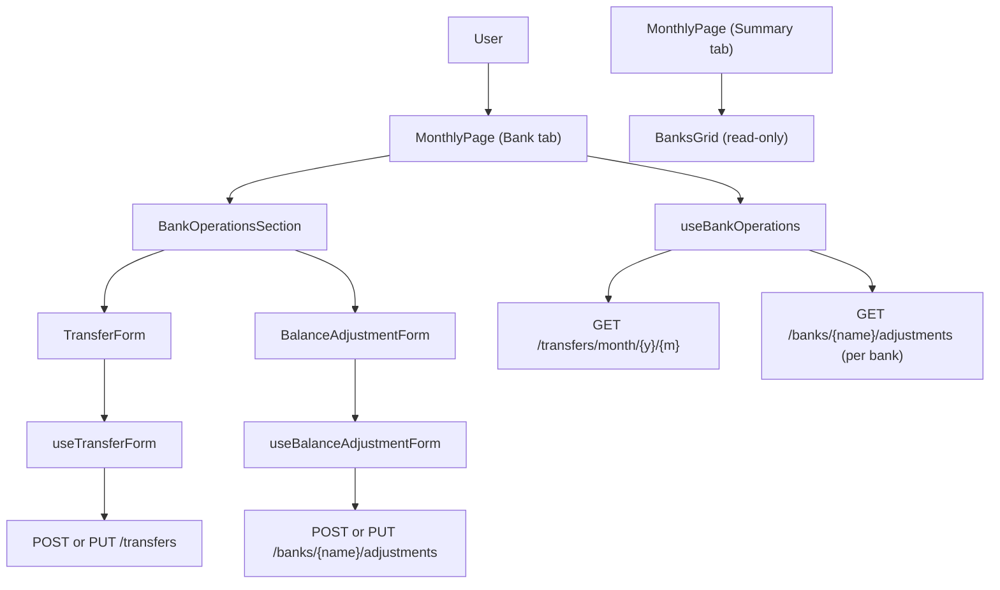

# Spec: F01. Web Bank Operations Tab

**Complexity:** medium

## 1. Technical Overview

**What:** Split the Monthly page's Banks concern in two. The Summary tab's `BanksGrid` becomes a plain, read-only Bank/Balance/Round-Up table (no expand affordance, no per-row actions). A new "Bank" tab is added to `MonthlyPage`'s tab strip, hosting two generic entry-point buttons ("+ New Transfer", "+ New Balance Correction"), a bank-filter dropdown, and a single flat, month-scoped, newest-first list combining every Transfer and Balance Adjustment across all banks, with working inline Edit/Delete per row.

**Why:** Today's `BanksGrid` mixes a balance overview with an expand-to-see-history-per-bank interaction, so there is no cross-bank view of "what moved this month" and no way to filter activity without collapsing/expanding rows one at a time. Reshaping the existing per-bank grouped fetch (`useBankHistory`) into a flat, filterable array removes that friction using the exact same two endpoints already in use, with zero new backend surface.

**Scope:**

**Included:**
- Simplify `BanksGrid.tsx` to 3 data columns (Bank, Balance, Round-Up) + totals row; remove expand/collapse, the nested history table, and the two per-row action buttons.
- Add a 4th tab ("Bank") to `MonthlyPage`'s tab strip, after Summary/Expense/Income.
- Two generic top-level entry-point buttons on the Bank tab: "+ New Transfer" and "+ New Balance Correction" (bank not pre-selected).
- A new hook (`useBankOperations`) that fetches and combines the month's transfers (all banks, one call) and each bank's adjustments (one call per bank, filtered to the selected month client-side) into a single flat, sorted, filterable list — reusing the exact fetch shape of the hook it replaces.
- A bank-filter dropdown ("All Banks" default + one entry per configured bank) that filters the already-fetched list client-side, no extra network request.
- A new `BankOperationsSection` component rendering the two buttons, the filter, and the operations list (or its empty state), with per-row Edit/Delete.
- `BalanceAdjustmentForm` gains a Bank dropdown as its first field; the rest of the form (current balance reference line, date, target balance, note) is revealed only once a bank is chosen. `useBalanceAdjustmentForm` gains the ability to open with no bank pre-selected and to resolve a bank's current balance client-side from already-fetched data as the user picks one.
- `TransferForm` / `useTransferForm` are reused unchanged (already support inline bank selection via `openCreateForm()`).
- Tab-switch-away-cancels-open-form behavior, extended to the new Bank tab, matching the existing Expense/Income pattern.

**Excluded (Out of Scope, per PRD Section 7):**
- Any new API endpoint, controller, query parameter, or change to the Transfer/Balance Adjustment domain entities or balance-calculation engine.
- An "all-time" history view — the list stays scoped to the selected month.
- Bulk edit/delete, CSV export.
- Any WPF change (covered independently by F02).
- Bank management (add/remove/rename banks).

## 2. Architecture Impact

**Affected components:**
- `Financial.Web/src/components/BanksGrid.tsx` — simplified (Modified)
- `Financial.Web/src/components/BanksGrid.css` — pruned (Modified)
- `Financial.Web/src/hooks/useBankHistory.ts` — removed, replaced by `useBankOperations.ts` (Deleted)
- `Financial.Web/src/hooks/useBankOperations.ts` — new flat/filterable operations hook (New)
- `Financial.Web/src/components/BankOperationsSection.tsx` — new Bank tab body (New)
- `Financial.Web/src/components/BankOperationsSection.css` — new styles (New)
- `Financial.Web/src/components/BalanceAdjustmentForm.tsx` — Bank dropdown added (Modified)
- `Financial.Web/src/hooks/useBalanceAdjustmentForm.ts` — deferred bank selection + client-side balance lookup (Modified)
- `Financial.Web/src/pages/MonthlyPage.tsx` — Bank tab wired in (Modified)
- `Financial.Web/src/pages/MonthlyPage.css` — minor additions for the new tab's controls (Modified)
- `Financial.Web/src/components/TransferForm.tsx`, `Financial.Web/src/hooks/useTransferForm.ts` — reused unchanged



## 3. Technical Decisions

| Decision | Chosen Approach | Alternative Considered | Trade-off |
|----------|----------------|----------------------|-----------|
| Data-layer reshape from per-bank grouping to flat list | Replace `useBankHistory.ts` with a new `useBankOperations.ts` file/hook (delete the old one) | Mutate `useBankHistory` in place, keeping its name | The hook's contract changes materially (`Record<bank, entries[]>` → flat filterable array with one entry per transfer, not two); a new name keeps it self-describing and avoids a misleading "History" label for what is now an operations list with actions |
| Balance Correction's per-bank current-balance lookup | Resolve client-side from the already-fetched `BankTotal[]` (Summary tab's `bankTotals`, passed down into `useBalanceAdjustmentForm`) whenever the bank field changes | Add a `GET /banks/{name}/balance` fetch triggered on bank selection | PRD explicitly forbids new endpoints; the balance is already fetched every render cycle via `useMonthly`, so a lookup is free and keeps the "no additional network request" behavior consistent with the existing filter dropdown |
| Bank-filter state ownership | Own `bankFilter` state and the filtering predicate inside `useBankOperations` | Keep filter as local `useState` in `MonthlyPage`/`BankOperationsSection` | The source/destination-OR-adjustment-equality matching rule is a small piece of business logic belonging with the data it filters, not the view; keeps the component purely presentational |
| Balance Correction form's field reveal | Conditionally render (hide) the reference line + date/target-balance/note fields until a bank is chosen | Render all fields always, only toggling `disabled` | Matches the existing `savedDelta`-gated conditional-view pattern already used in this exact component; avoids an extra "half-disabled form" visual state not used elsewhere in the app |
| Edit-time bank field for adjustments | Render the bank as static text (not a `<select>`) when editing | Render a `<select>` with a single option, disabled | A disabled dropdown with one option is misleading UI (looks browsable); static text is simpler and unambiguous, and this is a single-user, no-over-engineering app |

## 4. Requirements

### Business Rules (from PRD Capabilities)
- Summary Banks grid: exactly Bank, Balance, Round-Up columns + totals row; no expand control, no action buttons, no per-row click behavior.
- Bank tab is the 4th tab, after Summary/Expense/Income.
- Operations list combines Transfers + Balance Adjustments dated within the selected month, across all banks, sorted newest-date-first.
- Bank filter: single-select, "All Banks" (default) + one entry per bank from `GET /banks`; changing it re-filters the already-fetched array client-side, no new request.
- Filter matching: a Transfer row matches when the selected bank equals `sourceBank` OR `destinationBank`; an Adjustment row matches when the selected bank equals its `bank`.
- Row content: Date, Type ("Transfer" | "Adjustment"), Bank(s) — `"{sourceBank} → {destinationBank}"` for transfers, the bank name for adjustments — Amount/Delta (delta signed for adjustments), Note (or blank), Edit/Delete controls.
- No new API endpoints: reuses `GET /transfers/month/{year}/{month}` (all banks) and `GET /banks/{name}/adjustments` (one call per known bank), combined and filtered client-side.

### UX Flows (from PRD Experience)
- Summary tab renders the simplified Banks grid as a static table; the only interactive control on the page remains the month picker.
- Bank tab layout, top to bottom: the two action buttons, the bank filter dropdown, the operations list (or empty state).
- "+ New Transfer" opens the existing `TransferForm` inline (source/destination dropdowns, amount, date defaulted to today, note); saving creates the transfer, closes the form, and refreshes both Summary balances and the Bank tab's list.
- "+ New Balance Correction" opens `BalanceAdjustmentForm` with only the Bank dropdown enabled; choosing a bank reveals "Current calculated balance for {bank}: £{amount}" plus date (defaulted to today), target balance, and note; saving shows the existing "Balance Corrected" confirmation with the resulting delta, then closes and refreshes.
- Selecting a bank in the filter instantly narrows the visible rows (no loading state, data already fetched); "All Banks" restores the full list.
- Clicking a row's edit icon opens the corresponding form pre-filled; for adjustments, the bank is fixed (static text, not re-selectable).
- Clicking a row's delete icon prompts for confirmation (`window.confirm`, matching existing delete flows), then removes the entry and refreshes the list + Summary balances.
- Switching away from the Bank tab while a create/edit form is open cancels the open form, matching the existing Expense/Income tab-switch behavior.

## 5. Component Overview

**Frontend:**

| File Path | New/Modified | Purpose | Key Responsibilities |
|-----------|--------------|---------|---------------------|
| `Financial.Web/src/components/BanksGrid.tsx` | Modified | Read-only Summary balances table | Render Bank/Balance/Round-Up rows + totals; no interaction |
| `Financial.Web/src/components/BanksGrid.css` | Modified | Styles for the trimmed grid | Drop `expand-btn`/`action-btn`/history-table classes |
| `Financial.Web/src/hooks/useBankOperations.ts` | New | Fetch, combine, filter, and mutate the month's operations | Fetch transfers + per-bank adjustments; build one flat sorted array; own `bankFilter` + filtering predicate; expose delete actions and retry |
| `Financial.Web/src/components/BankOperationsSection.tsx` | New | Bank tab body | Render the two entry buttons, the filter dropdown, the list (or empty state) with Edit/Delete per row |
| `Financial.Web/src/components/BankOperationsSection.css` | New | Bank tab layout/styling | Header, filter control, table styling reusing `data-table` conventions |
| `Financial.Web/src/components/BalanceAdjustmentForm.tsx` | Modified | Balance correction form | Render Bank dropdown first; gate the rest of the form on a bank being chosen; render bank as static text while editing |
| `Financial.Web/src/hooks/useBalanceAdjustmentForm.ts` | Modified | Balance correction form state/orchestration | Support `openCreateForm()` with no pre-selected bank; resolve `currentBalance` from `BankTotal[]` on bank selection; keep Save disabled until a bank is set |
| `Financial.Web/src/pages/MonthlyPage.tsx` | Modified | Page composition | Add the Bank tab; mount `BankOperationsSection`, `TransferForm`, `BalanceAdjustmentForm` under it; wire `useBankOperations`; extend tab-switch-cancels-form behavior |
| `Financial.Web/src/pages/MonthlyPage.css` | Modified | Minor layout additions | Styling hooks for the Bank tab's loading/error gate if not already covered by existing classes |

**Backend:** No changes — Presentation layer only (PRD Section 7, "Out of Scope: Backend / API").

**Database:** No changes — no new tables, columns, or migrations.

## 6. API Contracts

No new endpoints are introduced. F01 consumes the following already-existing endpoints (unchanged contracts):

| Method | Path | Used By | Purpose |
|--------|------|---------|---------|
| GET | `/banks` | `useMonthly` (existing) | List of configured banks for the filter dropdown and both forms |
| GET | `/banks/month/{year}/{month}/balances` | `useMonthly` (existing) | Per-bank calculated balance, source for Balance Correction's reference line |
| GET | `/transfers/month/{year}/{month}` | `useBankOperations` (new caller, same call `useBankHistory` made) | All transfers dated in the selected month, across banks |
| GET | `/banks/{bankName}/adjustments` | `useBankOperations` (new caller, same call `useBankHistory` made, once per known bank) | All adjustments for a bank; filtered to the selected month client-side |
| POST / PUT | `/transfers` / `/transfers/{id}` | `useTransferForm` (existing, unchanged) | Create/update a transfer |
| DELETE | `/transfers/{id}` | `useBankOperations` (new caller) | Delete a transfer |
| POST / PUT | `/banks/{bankName}/adjustments` / `/banks/{bankName}/adjustments/{id}` | `useBalanceAdjustmentForm` (existing, unchanged) | Create/update a balance adjustment |
| DELETE | `/banks/{bankName}/adjustments/{id}` | `useBankOperations` (new caller) | Delete a balance adjustment |

**Example response — `GET /transfers/month/2026/7`:**
```json
[
  {
    "id": "t1",
    "date": "2026-07-10",
    "sourceBank": "Barclays",
    "destinationBank": "Trading212",
    "amount": 100,
    "note": "Top-up"
  }
]
```

**Example response — `GET /banks/Barclays/adjustments`:**
```json
[
  {
    "id": "a1",
    "date": "2026-07-12",
    "bank": "Barclays",
    "targetBalance": 42.5,
    "delta": 5,
    "note": "Matched statement"
  }
]
```

`useBankOperations` combines these two responses (adjustments filtered client-side to the selected `year`/`month`, since the adjustments endpoint is not itself month-scoped) into one flat, sorted, filterable array — no response shape changes on the wire.

## 7. Data Model

No new database tables, columns, or migrations. No new DTOs are required — `TransferDto`, `BalanceAdjustmentDto`, `BankDto`, and `BankBalanceDto` (`Financial.Web/src/api/types.ts`) are reused as-is. The new flat-list shape (`BankOperationEntry`) is a frontend-only, presentation-layer type defined in `useBankOperations.ts` (not persisted, not sent over the wire), mirroring how `BankHistoryEntry` was previously defined in `useBankHistory.ts`.

## 8. Error Handling

(Mapped from PRD Section 6, F01 Error Handling.)

- **Fetch failure (`useBankOperations`):** the Bank tab renders an error state with a retry action (reusing the existing `ErrorState` component and its `retry` callback pattern from `useBankHistory`); no partial or stale list is shown while retrying.
- **Save failure (Transfer or Balance Correction):** the open form shows the existing inline field-level error (via `saveErrorField`) or general error message, stays open, and retains entered values — unchanged behavior from `useTransferForm`/`useBalanceAdjustmentForm`.
- **Balance Correction without a bank chosen:** the Save button is disabled client-side; no request is sent. No error message needed since the action is unreachable.
- **Delete failure (Transfer or Adjustment):** an inline error message appears above the list (new `ACTION_ERROR`-style state in `useBankOperations`, following the same reducer pattern already used in `useBankHistory`), and the list is refreshed via retry to reflect actual server state.

## 9. Testing Strategy

**Cross-Feature Integration note:** PRD Section 9 states F01 and F02 are independent, parallel implementations with no Consumes dependency on each other, so no Cross-Feature Integration test cases apply to this spec (confirmed against PRD Section 9, "Cross-Feature Integration").

| Test File | Test Type | Target | Coverage Goal |
|-----------|-----------|--------|---------------|
| `Financial.Web/src/components/__tests__/BanksGrid.test.tsx` | Unit | `BanksGrid` | Read-only rendering only |
| `Financial.Web/src/hooks/useBankOperations.test.ts` | Unit | `useBankOperations` | Combine/sort/filter/delete/error logic |
| `Financial.Web/src/components/__tests__/BalanceAdjustmentForm.test.tsx` | Unit | `BalanceAdjustmentForm` | Bank-first gating + edit-time static bank |
| `Financial.Web/src/hooks/useBalanceAdjustmentForm.test.ts` | Unit | `useBalanceAdjustmentForm` | Deferred bank selection + balance lookup |
| `Financial.Web/src/components/__tests__/BankOperationsSection.test.tsx` | Unit | `BankOperationsSection` | Buttons, filter, row rendering, empty states |
| `Financial.Web/src/pages/__tests__/MonthlyPage.test.tsx` | Integration | `MonthlyPage` | End-to-end Bank tab flows, tab-switch behavior, Summary/Bank tab interplay |

**Key test functions/cases:**

| Test Function/Case | Description | Assertions |
|---|---|---|
| `renders a row per bank with balance and round-up columns, plus footer totals` (updated) | `BanksGrid` renders only 3 data columns | No expand button, no "Move Money"/"Correct Balance" buttons rendered anywhere |
| `combines transfers and adjustments into one flat list sorted newest-first` | `useBankOperations` fetch/combine logic | Result array interleaves both kinds correctly ordered by date desc |
| `filters adjustments to the selected month only` | `useBankOperations` adjustment month-scoping | Adjustments outside `year`/`month` excluded, transfers unaffected (already server-scoped) |
| `matches a transfer by source or destination bank` | Filter predicate | Selecting a bank keeps transfers where it's either side |
| `matches an adjustment by its bank only` | Filter predicate | Selecting a bank keeps only that bank's adjustments |
| `"All Banks" restores the full list with no additional fetch` | Filter behavior + network call count | `getTransfersByMonth`/`getAdjustmentsByBank` call counts unchanged after a filter change |
| `deletes a transfer/adjustment and refreshes` | Delete actions | Confirms via `window.confirm`, calls the right API method, triggers retry + `onChanged` |
| `surfaces a fetch error with retry` | Error path | `error` set, `retry()` re-triggers the fetch |
| `surfaces a delete error inline without discarding the list` | Delete error path | `error` set on failed delete, list state otherwise unchanged until retry |
| `only the Bank dropdown is enabled before a bank is chosen` | `BalanceAdjustmentForm` gating | Reference line, date, target balance, note not present in the DOM until `bankName` is set |
| `reveals the reference line and fields once a bank is chosen` | `BalanceAdjustmentForm` gating | Fields appear with `Current calculated balance for {bank}: £{amount}` |
| `Save stays disabled until a bank is chosen` | `BalanceAdjustmentForm` gating | Submit button `disabled` while `bankName === ''` |
| `renders the bank as static text (not a dropdown) when editing` | `BalanceAdjustmentForm` edit mode | No `<select>` for bank present, fixed bank name displayed |
| `openCreateForm resolves currentBalance from bankTotals on bank selection` | `useBalanceAdjustmentForm` | Setting `bankName` updates `currentBalance` from the matching `BankTotal` entry, `0` if not found |
| `renders both entry-point buttons and the filter dropdown with All Banks default` | `BankOperationsSection` | Buttons call `onNewTransfer`/`onNewBalanceCorrection`; filter defaults to "All Banks" |
| `renders a row per operation with the correct columns` | `BankOperationsSection` | Date, Type, Bank(s) string, signed/unsigned amount, Note, Edit/Delete buttons present |
| `shows the unfiltered vs filtered-by-bank empty state text` | `BankOperationsSection` | Correct message per PRD AC depending on `bankFilter` |
| `A "Bank" tab appears in the Monthly page's tab strip after Summary/Expense/Income` | `MonthlyPage` | Tab order and label |
| `Summary tab's Banks grid renders only Bank/Balance/Round-Up, with no expand/action controls` | `MonthlyPage` | Integration-level assertion mirroring the PRD AC wording |
| `"+ New Transfer" creates a transfer, refreshes Summary balances and the Bank tab list` | `MonthlyPage` | `createTransfer` called; both `getBankBalancesByMonth` and the operations fetch re-triggered |
| `"+ New Balance Correction" gates on bank selection and shows the resulting delta` | `MonthlyPage` | End-to-end flow through the generic entry point, matching today's confirmation behavior |
| `filter dropdown narrows the list without an extra network request` | `MonthlyPage` | Fetch call counts unchanged after selecting a bank |
| `edit/delete both types of rows from the flat list` | `MonthlyPage` | Pre-filled forms, correct API calls, list + balances refresh |
| `a failed fetch of the month's operations shows an error state with working retry` | `MonthlyPage` | `ErrorState`-equivalent rendered scoped to the Bank tab |
| `switching away from the Bank tab cancels an open create/edit form` | `MonthlyPage` | Mirrors the existing Expense/Income tab-switch test pattern |

## Assumptions and Decisions (Batch Mode Auto-Accept)

This spec was generated in Batch Mode (no interactive interview). The following defaults were auto-accepted per the spec-writer skill's Auto-Accept Policy and should be reviewed:

1. **Scope:** F01's PRD entry has neither a `Core Scope` nor a `Full Scope additions` block — full feature scope assumed (Auto-Accept Policy: "PRD without Core/Full split" → no scope question needed).
2. **`useBankHistory.ts` → `useBankOperations.ts` rename/replace** (Section 3, Decision 1): the hook's contract changes materially enough to warrant a new, more accurate name rather than mutating the existing file in place. `useBankHistory.test.ts` is deleted alongside it; `BanksGrid.test.tsx`'s existing import of `BankHistoryEntry` (used only for fixture typing) is removed as part of the `BanksGrid` simplification.
3. **Client-side balance lookup for Balance Correction** (Section 3, Decision 2): resolves the bank's current balance from `BankTotal[]` already fetched by `useMonthly`, passed down into `useBalanceAdjustmentForm`, rather than adding any new fetch — required to honor the PRD's "no new endpoints" constraint.
4. **Bank-filter state lives inside `useBankOperations`**, not as page-level `useState` (Section 3, Decision 3) — keeps the filtering business rule (source/destination-OR / bank-equality matching) colocated with the data it operates on.
5. **Balance Correction field reveal is hide/show, not disable/enable** (Section 3, Decision 4) — the PRD's "activate" wording is compatible with either; hide/show was chosen to match the component's existing `savedDelta`-gated conditional-render pattern.
6. **Edit-time bank field renders as static text, not a disabled `<select>`** (Section 3, Decision 5) — simpler and avoids a disabled-but-visually-browsable control; consistent with this app's no-over-engineering guidance (`CLAUDE.md`).
7. **Delete confirmation uses `window.confirm`**, matching every existing delete flow in this codebase (`useBankHistory`, `useMonthly`'s `deleteExpense`/`deleteIncome`) — no PRD or interview guidance suggested otherwise.
8. **Bank filter selection is not reset on month change or tab switch** — PRD is silent on this; persisting the filter across those actions is the simplest behavior and avoids surprising the user mid-review. This can be revisited if real usage suggests otherwise.
9. **"All Banks" sentinel value:** modeled as a named constant (not a magic string) in `useBankOperations.ts`, per `CLAUDE.md`'s "no magic strings" rule.
