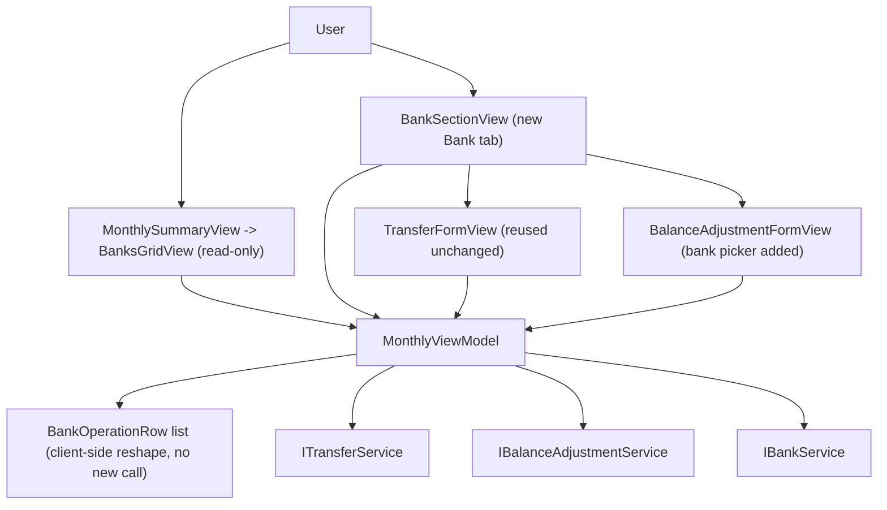

## Complexity Level

**medium** — multiple Presentation-layer components change together (one shared ViewModel, three views, two supporting model types), with client-side reshaping/filtering logic and a reworked form flow, but no new API endpoints, no database changes, and no external integrations. Consistent with CLAUDE.md's instruction not to over-engineer a single-user personal app.

---

## 1. Technical Overview

**What:** Replace the WPF Monthly view's embedded, expandable-per-bank transfer/adjustment UI with (a) a trimmed, read-only Banks grid on the Summary sub-tab and (b) a new "Bank" sibling tab holding two generic action buttons, a bank filter, and a flat, month-scoped, newest-first list combining every Transfer and Balance Adjustment. This is a wholesale rebuild of that slice of the Presentation layer, not a patch of the currently broken embedded UI.

**Why:** The existing `BanksGridView` mixes a balance overview with per-row expand/history/action affordances, which is both reportedly broken and structurally mismatched to the "view balances vs. operate on balances" split this PRD wants. Rebuilding fresh — reusing the same `MonthlyViewModel`, the same `ITransferService`/`IBalanceAdjustmentService`/`IBankService` calls, and the already-working `TransferFormView` — avoids diagnosing the old bug while restoring parity with the Web app's equivalent redesign (F01).

**Scope:**
- Included: trimmed Summary Banks grid (Bank/Balance/Round-Up + totals, no expand/actions); new "Bank" `TabItem` and its view; two generic entry-point commands ("Move Money", "Correct Balance") with no per-row context; a bank-picker-first Balance Adjustment form; a flat, filterable, month-scoped operations collection built client-side from already-fetched data; Edit/Delete on each flat-list row; empty-state and error-state handling reusing existing patterns.
- Excluded (per PRD Section 7 and dependency-free Section 8): any new API endpoint, service method, or domain/entity change; an "all-time" history view; bulk edit/delete; export; bank management (add/remove/rename); changes to Expense/Income sub-tabs beyond removing the Banks grid's action columns; any Web (F01) code — F01 and F02 share zero code.

This spec covers F02's full functionality; the PRD's Section 6 F02 block has no separate Core Scope / Full Scope split, so there is no scope question to resolve (per spec-writer Edge Cases: "PRD has no Core Scope / Full Scope blocks for the feature — assume full feature scope").

---

## 2. Architecture Impact

**Affected components** (all within `Financial.App`, the WPF Presentation project — no other layer changes):

- `Financial.App/Views/CashFlow/MonthlyView.xaml` — add the 4th `TabItem`.
- `Financial.App/Views/CashFlow/BanksGridView.xaml` — simplified to a read-only grid.
- `Financial.App/Views/CashFlow/BankSectionView.xaml` (+ `.xaml.cs`) — new Bank tab content.
- `Financial.App/Views/CashFlow/BalanceAdjustmentFormView.xaml` — bank-picker field added.
- `Financial.App/Views/CashFlow/TransferFormView.xaml(.cs)` — unchanged, reused as-is.
- `Financial.App/ViewModels/CashFlow/MonthlyViewModel.cs` — extended (per Decision D1: extend, don't fork).
- `Financial.App/ViewModels/CashFlow/BankTotalRow.cs` — simplified.
- `Financial.App/ViewModels/CashFlow/BankOperationRow.cs` — new.
- `Financial.App/ViewModels/CashFlow/BankHistoryEntry.cs` — removed (dead once the expandable per-bank history UI is gone).

---

## 3. Technical Decisions

| Decision | Chosen Approach | Alternative Considered | Trade-off |
|---|---|---|---|
| D1. Extend vs. fork the ViewModel | Extend the existing `MonthlyViewModel` with new members for the flat operations list, filter, and reworked adjustment-form flow | A dedicated `BankSectionViewModel` | Matches the established project pattern (one shared VM per Monthly sub-tab set, per the class's own doc comment) and avoids re-fetching/duplicating month state; accepts a larger single file |
| D2. Flat-list model type | New `BankOperationRow` type (Kind, Date, display label, filter fields, DTO refs) replacing `BankHistoryEntry` | Keep `BankHistoryEntry` and adapt it | `BankHistoryEntry` is shaped for a *per-bank* view (`TransferIn`/`TransferOut`, single `CounterpartBank`) and can't express "source → destination" for a cross-bank flat row without hacks; a clean new type avoids duplicating/overloading a type designed for a UI that no longer exists |
| D3. Correct Balance's current-balance source | Look up the already-loaded `BankTotals` row for the picked bank (same figure the Summary grid shows) | Call `IBankService.GetBankBalanceAsOf` for the picked bank | No extra service round-trip on bank selection; keeps the figure consistent with what Summary displays for the month, matching PRD wording ("the same balance-calculation logic the Summary grid uses") |
| D4. Amount/Delta column | Single `DisplayAmount` computed property on `BankOperationRow` (Transfer → Amount, Adjustment → signed Delta) bound to one numeric grid column | Two columns, one hidden per row via Kind-based visibility (mirrors the old `CounterpartBank`-style dual-button pattern) | One column matches the PRD's literal "Amount/Delta" single-column description and is simpler; loses the ability to style Transfer/Adjustment amounts differently later, which nothing currently requires |
| D5. Fetch-failure UI for the Bank tab | Reuse the existing top-level `HasError`/`Retry` block that already gates the whole `TabControl` in `MonthlyView.xaml` | A second, Bank-tab-scoped error+retry region | Bank tab data comes from the same `RefreshAsync` call as Summary/Expense/Income; a second error UI would be redundant and this matches the AC wording "consistent with the existing WPF Monthly view error handling" |

---

## 4. Component Overview

**Presentation (`Financial.App`):**

| File Path | New/Modified | Purpose | Key Responsibilities |
|---|---|---|---|
| `Financial.App/Views/CashFlow/MonthlyView.xaml` | Modified | Monthly tab strip | Add `TabItem Header="Bank"` after Income, hosting `BankSectionView` |
| `Financial.App/Views/CashFlow/BanksGridView.xaml` | Modified | Summary Banks grid | Render only Bank/Balance/Round-Up columns + totals row; remove expand column, per-row action columns, embedded forms, row-details template |
| `Financial.App/Views/CashFlow/BanksGridView.xaml.cs` | Unmodified | Code-behind | No change — already contains only `InitializeComponent()` |
| `Financial.App/Views/CashFlow/BankSectionView.xaml` | New | Bank tab content | Two entry-point buttons; embedded `TransferFormView`/`BalanceAdjustmentFormView`; bank filter `ComboBox`; flat operations `DataGrid` with Edit/Delete per row; empty-state text |
| `Financial.App/Views/CashFlow/BankSectionView.xaml.cs` | New | Code-behind | `InitializeComponent()` only, mirroring `ExpenseSectionView.xaml.cs` |
| `Financial.App/Views/CashFlow/BalanceAdjustmentFormView.xaml` | Modified | Correct Balance form | Add bank-selection `ComboBox` as the first field (row 1, before Current Balance); gate the remaining fields/current-balance text/Save button behind `IsAdjustmentBankSelected`; disable the `ComboBox` while `IsEditingAdjustment` |
| `Financial.App/Views/CashFlow/BalanceAdjustmentFormView.xaml.cs` | Unmodified | Code-behind | Existing decimal-input handlers reused unchanged |
| `Financial.App/Views/CashFlow/TransferFormView.xaml(.cs)` | Unmodified | Move Money form | Reused as-is; entry point changes (no `CommandParameter`), form itself does not |
| `Financial.App/ViewModels/CashFlow/MonthlyViewModel.cs` | Modified | Shared Monthly VM | See below: new flat-list state/commands, reworked adjustment-form flow, generic entry points, removed per-bank-expand members |
| `Financial.App/ViewModels/CashFlow/BankTotalRow.cs` | Modified | Summary grid row | Remove `IsExpanded` and `History`; keep `Bank`, `Balance`, `RoundUpTotal` only |
| `Financial.App/ViewModels/CashFlow/BankOperationRow.cs` | New | Flat operations row | See field table below |
| `Financial.App/ViewModels/CashFlow/BankHistoryEntry.cs` | Deleted | — | Superseded by `BankOperationRow` (D2); no other consumer remains once `BanksGridView`'s row-details template is removed |
| `Financial.App/ViewModels/CashFlow/TransferFormValidation.cs` | Unmodified | Validator | Reused as-is |
| `Financial.App/ViewModels/CashFlow/BalanceAdjustmentFormValidation.cs` | Unmodified | Validator | Reused as-is (validates date + target balance; bank-selection is a separate `CanExecute` gate, not a validation message, per D-adjacent reasoning: an unselected bank disables Save rather than producing a field error, matching the "Save is disabled until a bank is chosen" AC) |

**`BankOperationRow` field shape** (in-memory view model, not persisted — no database involved):

| Property | Type | Populated for | Purpose |
|---|---|---|---|
| `Kind` | `BankOperationKind` (`Transfer`/`Adjustment`, new enum) | both | Drives Type column text and which Edit button/command applies |
| `Date` | `DateOnly` | both | Sort key and Date column |
| `BankLabel` | `string` | both | Display text: `"{SourceBank} → {DestinationBank}"` for transfers, the bank name for adjustments |
| `SourceBank` | `string?` | Transfer | Filter matching |
| `DestinationBank` | `string?` | Transfer | Filter matching |
| `Bank` | `string?` | Adjustment | Filter matching |
| `Amount` | `decimal?` | Transfer | Underlying amount (always positive) |
| `Delta` | `decimal?` | Adjustment | Underlying signed delta |
| `DisplayAmount` | `decimal` (computed) | both | Single Amount/Delta grid column value (D4) |
| `Note` | `string?` | both | Note column |
| `Transfer` | `TransferDTO?` | Transfer | Passed to the existing `EditTransferCommand`/used by delete |
| `Adjustment` | `BalanceAdjustmentDTO?` | Adjustment | Passed to `EditAdjustmentCommand`/used by delete |

**`MonthlyViewModel` additions/changes** (grouped by concern; no code, structural description only):

- *State:* `ObservableCollection<BankOperationRow> BankOperations` (unfiltered, month-scoped, newest-first — populated in `RefreshAsync`, replacing the retired `BuildBankHistory` per-bank pass with a `BuildBankOperations` pass over the same already-fetched `transfers`/`adjustmentsByBank`); `ObservableCollection<BankOperationRow> FilteredBankOperations` (bound to the grid, recomputed client-side on refresh and on filter change — no new service call, satisfying the "no additional network request on filter change" requirement); `string SelectedBankFilter` (defaults to the `"All Banks"` constant, preserved across month changes the same way `IsExpanded` was previously preserved); `IReadOnlyList<string> BankFilterOptions` (`"All Banks"` + each `Banks` name, refreshed alongside `Banks`); `bool HasBankOperations`; `string BankOperationsEmptyMessage` (unfiltered vs. filtered-by-bank wording, D-Assumption A2 below); `string? BankOperationsError` (rename of `BankHistoryError` — now covers delete failures from the flat list).
- *Removed state:* `BankHistoryError` (renamed), `ToggleBankExpandCommand`, `BankTotalRow.IsExpanded`/`History`, `BuildBankHistory`.
- *Balance Adjustment form rework:* `AdjustmentFormBankName` setter becomes public (was `private set`) and, on change, looks up the picked bank's balance from `BankTotals` (D3) into `AdjustmentFormCurrentBalance`; new `bool IsAdjustmentBankSelected` gates the rest of the form (Visibility in XAML) and `SaveAdjustmentCommand`'s `CanExecute`; `ShowCorrectBalanceFormCommand` changes from `RelayCommand<BankTotalRow>` to a parameterless `RelayCommand` that opens the form with `AdjustmentFormBankName = string.Empty` (generic entry point, no pre-selection); `ShowEditAdjustmentForm` keeps the bank fixed (already does, via `_editingAdjustmentBank`) and the `ComboBox` is disabled while editing.
- *Generic Move Money entry point:* `ShowMoveMoneyFormCommand` keeps its existing `RelayCommand<string>` signature and `ShowCreateTransferForm` fallback-to-first-bank behavior (Assumption A1 below); the Bank tab's button binds it without a `CommandParameter`.
- *Edit/Delete on the flat list:* `EditTransferCommand` keeps its `RelayCommand<TransferDTO>` signature (now bound to `row.Transfer`). `EditAdjustmentCommand` changes from `RelayCommand<BankHistoryEntry>` to `RelayCommand<BalanceAdjustmentDTO>` (bound to `row.Adjustment` directly — removes the now-pointless indirection through `BankHistoryEntry`). `DeleteHistoryEntryCommand` is renamed to `DeleteBankOperationCommand` (`RelayCommand<BankOperationRow>`), keeping its existing confirm-then-delete-then-refresh logic, branching on `row.Transfer`/`row.Adjustment` exactly as the old code branched on `entry.Transfer`/`entry.Adjustment`.

---

## 5. Service Contracts Reused (No New API)

Per PRD Section 6/7, F02 introduces zero new endpoints, service methods, or domain changes. The feature consumes exactly the interfaces `MonthlyViewModel` already depends on:

| Interface · Method | Used for |
|---|---|
| `ITransferService.GetTransfersByMonth(year, month)` | Already called in `RefreshAsync`; now also feeds `BuildBankOperations` |
| `ITransferService.AddTransferAsync` / `UpdateTransferAsync` / `DeleteTransferAsync` | Move Money save/edit/delete — unchanged calls, new entry points |
| `IBalanceAdjustmentService.GetAdjustmentsByBank(bankName)` (per bank, already looped) | Feeds `BuildBankOperations`, month-filtered client-side exactly as `BuildBankHistory` did |
| `IBalanceAdjustmentService.AddAdjustmentAsync` / `UpdateAdjustmentAsync` / `DeleteAdjustmentAsync` | Correct Balance save/edit/delete — unchanged calls |
| `IBankService.GetBanks()` / `GetBankBalancesByMonth(year, month)` | Already called; balance figures reused for `BankTotals` and, via D3, for the adjustment form's current-balance display |

No `IBankService.GetBankBalanceAsOf` call is added (see D3).

---

## 6. Data Model

Not applicable — no database, migration, or persisted schema changes. `BankOperationRow` and `BankTotalRow` are in-memory Presentation-layer view models only (see Section 4 for their shape); this satisfies CLAUDE.md's Domain/Application/Infrastructure boundaries by touching none of those layers.

---

## 7. Testing Strategy

Consistent with this codebase's existing convention (`Tests/Financial.Presentation.Tests`), only ViewModels and validators are unit-tested — there is no WPF UI-automation harness in the repo, so `.xaml` layout changes (grid columns, form gating, tab addition) are verified manually during implementation rather than by an automated test.

| Test File | Test Type | Target | Coverage Goal |
|---|---|---|---|
| `Tests/Financial.Presentation.Tests/ViewModels/CashFlow/MonthlyViewModelBanksCardsTests.cs` | Unit | `MonthlyViewModel` (Banks/Cards concerns) | Update in place: remove obsolete `BankTotals_ComputesBalanceAndRoundUpTotalPerBank` variants tied to removed `IsExpanded`/`History` (`ToggleBankExpand_ExpandsThenCollapses`, `BankHistory_MergesTransfersAndAdjustmentsSortedByDateDescending`, `BankHistory_TransferAppearsInBothSourceAndDestinationBankHistory`); adapt `AddTransfer_*`, `EditTransfer_*`, `DeleteTransfer_*`, `AddBalanceAdjustment_*`, `EditAdjustment_*`, `DeleteAdjustment_*` to the new command signatures (`ShowCorrectBalanceFormCommand` parameterless, `EditAdjustmentCommand` takes `BalanceAdjustmentDTO`, `DeleteBankOperationCommand` replaces `DeleteHistoryEntryCommand`); leave Card tests untouched |
| `Tests/Financial.Presentation.Tests/ViewModels/CashFlow/MonthlyViewModelBankOperationsTests.cs` | Unit (new file) | `MonthlyViewModel` flat operations list, filter, and bank-picker-first adjustment flow | Comprehensive — new behavior introduced by this feature |

**Functions in `MonthlyViewModelBankOperationsTests.cs`:**

| Test Function | Description | Assertions |
|---|---|---|
| `BuildBankOperations_CombinesTransfersAndAdjustments_SortedNewestFirst` | Month has both a transfer and an adjustment on different dates | `BankOperations` has 2 rows, newest date first |
| `BuildBankOperations_TransferRow_ShowsSourceArrowDestinationLabel` | One transfer Barclays → Chase | Row's `BankLabel` is `"Barclays → Chase"`, `Kind` is `Transfer`, `DisplayAmount` equals the transfer amount |
| `BuildBankOperations_AdjustmentRow_ShowsSingleBankLabelAndSignedDelta` | One adjustment on Barclays with a negative delta | Row's `BankLabel` is `"Barclays"`, `Kind` is `Adjustment`, `DisplayAmount` equals the signed delta |
| `BuildBankOperations_AdjustmentOutsideSelectedMonth_Excluded` | Adjustment dated in a different month than selected | Row absent from `BankOperations` (mirrors old `BuildBankHistory` month filter) |
| `BankFilter_DefaultsToAllBanks_ShowsEveryRow` | No filter interaction | `SelectedBankFilter` is `"All Banks"`, `FilteredBankOperations.Count` equals `BankOperations.Count` |
| `BankFilter_SelectingBank_MatchesTransferAsSourceOrDestination` | Transfers where the picked bank is source, destination, or neither | Only matching rows remain |
| `BankFilter_SelectingBank_MatchesAdjustmentExactBankOnly` | Adjustments for two different banks | Only the picked bank's adjustment remains |
| `BankFilter_SelectingAllBanks_RestoresFullList` | Filter set then reset to `"All Banks"` | Full list restored |
| `BankFilter_ChangingSelection_DoesNotRefetchData` | Filter changed after initial load | Stub service call counters unchanged (mirrors `GetExpensesByMonthCallCount`-style counters already in `TestStubs.cs`) |
| `MoveMoneyCommand_GenericEntryPoint_OpensFormWithNoRowContext` | `ShowMoveMoneyFormCommand.Execute(null)` | Form opens; source bank defaults per Assumption A1 |
| `CorrectBalanceCommand_GenericEntryPoint_OpensFormWithNoBankSelected` | `ShowCorrectBalanceFormCommand.Execute()` | `AdjustmentFormBankName` is empty, `IsAdjustmentBankSelected` is `false`, `SaveAdjustmentCommand.CanExecute(null)` is `false` |
| `CorrectBalanceForm_SelectingBank_RevealsFieldsAndCurrentBalance` | Set `AdjustmentFormBankName` to a known bank after generic open | `IsAdjustmentBankSelected` becomes `true`, `AdjustmentFormCurrentBalance` matches that bank's `BankTotals` row, `SaveAdjustmentCommand.CanExecute(null)` becomes `true` |
| `CorrectBalanceForm_EditingExistingAdjustment_LocksBankSelection` | `EditAdjustmentCommand.Execute(adjustment)` | `AdjustmentFormBankName` is pre-filled and `IsEditingAdjustment` is `true` (view binds `ComboBox.IsEnabled` off this) |
| `EditBankOperation_Transfer_OpensTransferFormPrefilled` | `EditTransferCommand.Execute(row.Transfer)` from a flat row | Form pre-filled, `IsEditingTransfer` true |
| `DeleteBankOperation_Transfer_ConfirmedCallsTransferDelete` | `DeleteBankOperationCommand.Execute(transferRow)`, confirm true | `StubTransferService.LastDeletedId` set, list refreshed |
| `DeleteBankOperation_Adjustment_ConfirmedCallsAdjustmentDelete` | `DeleteBankOperationCommand.Execute(adjustmentRow)`, confirm true | `StubBalanceAdjustmentService.LastDeleted` set to `(Bank, Id)` |
| `DeleteBankOperation_Declined_SkipsService` | Confirm false | Neither stub records a delete |
| `BankOperationsEmptyMessage_Unfiltered_ShowsGenericMessage` | No operations for the month, `SelectedBankFilter` = `"All Banks"` | `BankOperationsEmptyMessage` is the generic message (Assumption A2) |
| `BankOperationsEmptyMessage_Filtered_IncludesSelectedBankName` | No operations match the picked bank | `BankOperationsEmptyMessage` mentions the selected bank |

**Acceptance-criteria traceability (PRD Section 9, F02):** every checkbox in the F02 list maps to at least one test above or to a manual-verification item noted for the corresponding `.xaml` change in Section 4 (grid columns, tab presence, form gating, error/retry reuse). The Cross-Feature Integration subsection states no criteria apply between F01 and F02, so no integration tests are required beyond this feature's own suite.

---

## Assumptions / Decisions (Batch Mode Auto-Accept)

Generated in Batch Mode — no interactive interview was run. Each item below applies an Auto-Accept Policy default for a decision the PRD left open, per the spec-writer skill's documentation requirement.

| # | Decision | Auto-Accept row applied | Detail |
|---|---|---|---|
| A1 | Move Money's source bank still defaults to the first configured bank when opened generically (no `CommandParameter`) | "Technical decisions with a clear recommendation from spec-writer" | The PRD says the Transfer form "is reused unchanged"; its existing `ShowCreateTransferForm(sourceBank ?? Banks[0])` fallback is that unchanged behavior. The PRD's "opens with no bank pre-selected" line is read as being about the *entry point* (no row-specific context passed in), not a mandate to alter the reused form's default-selection UX |
| A2 | Exact empty-state wording: `"No transfers or balance corrections this month."` (unfiltered) and a filtered variant naming the selected bank | "Partial PRD specifications... apply an industry-standard default... document it as an explicit assumption" | PRD only specifies this at the F01 (Web) level verbatim and tells F02 to be "equivalent," while explicitly requiring zero shared code between F01/F02; exact WPF wording is therefore an open detail, resolved by reusing the spirit of F01's message |
| A3 | No tab-switch-cancels-open-form behavior added for the Bank tab | "Multiple conflicting patterns in the codebase" / best-practice default | This behavior appears only in F01's (Web) Experience section, not in F02's own Capabilities/Experience list; no existing WPF pattern for it was found for the Expense/Income tabs to mirror (`MonthlyView.xaml`'s `TabControl` has no `SelectionChanged` handler today). Leaving an open form's state intact across a tab switch is acceptable, low-risk desktop-app behavior and avoids introducing new infrastructure not asked for by F02 itself |
| A4 | `BankOperationRow` is a brand-new type rather than an adapted `BankHistoryEntry` | "Multiple conflicting patterns... pick the most frequent/recent; document the choice" (applied as: neither existing shape fits, so a new minimal type is introduced rather than overloading an existing one) | See Decision D2 |
| A5 | Balance-filter selection persists across month navigation | Best-practice default (no PRD guidance either way) | Mirrors the pre-existing `IsExpanded`-preservation idiom in `RefreshAsync`; avoids surprising the user by silently resetting their filter on every month change |

**PRD traceability:** Capabilities and Experience bullets in PRD Section 6 (F02) map to Sections 2–4 above; Error Handling (F02) maps to Section 4's `BankOperationsError`/reused top-level error block (D5) and the Correct Balance save-gating description; Section 9's F02 acceptance criteria map to Section 7's test table as described in its final paragraph.
