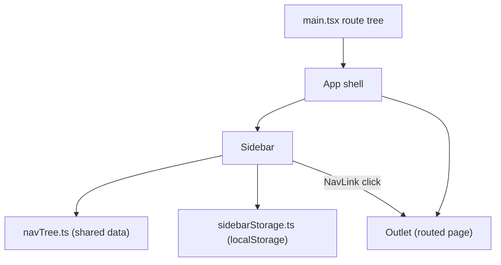

# Spec: F01. Web Sidebar Navigation Shell

## 1. Technical Overview

**What:** Replace `Financial.Web`'s current top navigation chrome — the two-pill domain switcher in `App.tsx` and the separate per-domain `NavLink` bars in `InvestmentsLayout.tsx`/`CashFlowLayout.tsx` — with a single collapsible left sidebar rendered once in the app shell. The sidebar renders two static categories (Investments, CashFlow) each with their ordered children, in two fixed states (Expanded 240px, Collapsed 56px), with state persisted to `localStorage` and applied synchronously before first paint.

**Why:** The current nav chrome permanently consumes a fixed horizontal strip and gives no way to reclaim that width for dense financial grids/charts. This feature establishes the navigation tree as a single source of truth (consumed later by F02's flyouts and F03's breadcrumb) and is the foundational shell every routed page will render inside of.

**Scope:**
- Included: sidebar component with Expanded/Collapsed states, toggle button, `localStorage` persistence read synchronously at mount, active-route highlighting, shared navigation tree data module, removal of the old domain switcher and per-domain nav bars.
- Excluded (deferred to later features per PRD): collapsed-mode flyouts/tooltips (F02), breadcrumb header (F03). This spec's Collapsed state renders icons only, with no flyout — that's F02's job.

## 2. Architecture Impact

**Affected components:**
- `Financial.Web/src/App.tsx` — rewritten to render `Sidebar` + content outlet instead of the domain-switcher `<nav>`.
- `Financial.Web/src/App.css` — domain-switcher rules removed; new `.app__content` sits beside the sidebar in a row flex layout.
- `Financial.Web/src/components/Sidebar.tsx` — new. Renders the two categories, their children, and the toggle button; reads/writes collapsed state.
- `Financial.Web/src/components/Sidebar.css` — new. Expanded/Collapsed width rule with the 150ms transition, active-highlight styling, icon layout.
- `Financial.Web/src/navigation/navTree.ts` — new. Single source of truth: typed nav tree data (2 categories × their ordered children), consumed by `Sidebar` now and by F02/F03 later.
- `Financial.Web/src/utils/sidebarStorage.ts` — new. `getStoredSidebarCollapsed()` / `setStoredSidebarCollapsed()`, mirroring `domainStorage.ts`'s try/catch `localStorage` pattern.
- `Financial.Web/src/components/InvestmentsLayout.tsx`, `.css`, and `__tests__/InvestmentsLayout.test.tsx` — deleted (nav bar superseded by `Sidebar`; the file had no other responsibility).
- `Financial.Web/src/components/CashFlowLayout.tsx`, `.css`, and `__tests__/CashFlowLayout.test.tsx` — deleted (same reason).
- `Financial.Web/src/main.tsx` — route tree flattened: the 10 leaf routes move one level up, directly under the `App` shell route, since there is no more per-domain layout wrapper.

**Data flow:**



## 3. Technical Decisions

| Decision | Chosen Approach | Alternative Considered | Trade-off |
|----------|----------------|----------------------|-----------|
| Fate of `InvestmentsLayout`/`CashFlowLayout` | Delete both; routes render page components directly under the new shell | Keep as empty content-only wrappers | Simpler tree, matches "no over-engineering" project guidance; if a domain ever needs layout-only logic again, the file can be reintroduced then |
| Nav tree data location | Dedicated `src/navigation/navTree.ts` module (pure data + types, no JSX) | Inline the tree inside `Sidebar.tsx` | Slightly more files now, but F02 (flyouts) and F03 (breadcrumb) in Wave 2 import the same constant without depending on the Sidebar component itself |
| Sidebar collapsed-state persistence | New `src/utils/sidebarStorage.ts`, `localStorage`, try/catch read/write, mirroring `domainStorage.ts`'s shape exactly (key `financial.sidebarCollapsed`, boolean) | Reuse `domainStorage.ts` or a generic storage helper | `domainStorage.ts` is `sessionStorage`-specific and typed to `Domain`; a boolean sidebar flag doesn't fit that shape, and PRD explicitly calls for `localStorage` (state must survive across sessions, not just the tab) |
| Read-before-first-paint | `useState(() => getStoredSidebarCollapsed())` lazy initializer in `Sidebar`, mirroring `RootRedirect.tsx`'s synchronous-read-in-render pattern | `useEffect` after mount | A `useEffect` would render Expanded first and flip after mount, producing exactly the visible flash the PRD forbids; the lazy initializer runs during the first render, before paint |
| Width transition mechanism | CSS class toggle (`Sidebar.css` always declares `transition: width 150ms ease`; a `.sidebar--collapsed` BEM modifier flips `width`) | Inline `style` attribute | Matches the project's plain-CSS-file, BEM, no-CSS-Modules convention used by every other component |
| Icons | 3 hand-rolled inline SVG components (`InvestmentsIcon`, `CashFlowIcon`, `ToggleIcon`) defined in `Sidebar.tsx`, feather-style stroke icons (`fill="none" stroke="currentColor" strokeWidth="2"`, 24×24 viewBox), each `aria-hidden="true"` | New icon library dependency | PRD explicitly forbids a new icon library; matches the existing hand-rolled-SVG convention used elsewhere in the codebase (e.g. the repeated delete icon) |
| Route flattening in `main.tsx` | The 10 leaf `<Route>` elements move to be direct children of the `App` shell route (no intermediate domain `<Route>` layer) | Keep `path="investments"`/`path="cashflow"` as pathless layout routes | Deleting the layout components removes the reason for that nesting level; route *paths* (`/investments/...`, `/cashflow/...`) are unchanged — only the JSX route-tree nesting is flattened, so no URL changes and `RootRedirect`/`setStoredDomain` logic in `App.tsx` keeps working unmodified |

## 4. Component Overview

**Frontend:**

| File Path | New/Modified | Purpose | Key Responsibilities |
|-----------|--------------|---------|---------------------|
| `src/navigation/navTree.ts` | New | Single source of truth for the nav tree | Export `NavChild`/`NavCategory` types and a `NAV_TREE: NavCategory[]` constant (2 categories, 4 + 6 ordered children, each with `id`, `label`, `route`) |
| `src/utils/sidebarStorage.ts` | New | `localStorage` persistence for collapsed state | `getStoredSidebarCollapsed(): boolean`, `setStoredSidebarCollapsed(collapsed: boolean): void`, both try/catch-wrapped and silently degrading (default `false`/no-op) on storage failure |
| `src/utils/sidebarStorage.test.ts` | New | Unit tests for the storage helper | Covers default-false-when-unset, round-trip persistence, and the storage-throws error path (mirrors `domainStorage.test.ts`) |
| `src/components/Sidebar.tsx` | New | Renders the sidebar shell | Reads/writes collapsed state, renders toggle button + 2 category sections + their children from `NAV_TREE`, applies active-route highlighting, houses the 3 inline SVG icon components |
| `src/components/Sidebar.css` | New | Sidebar visual styling | Expanded/Collapsed width + 150ms transition, `--accent` active-item highlight, parent-icon accent tint when a child is active, icon-only layout in Collapsed state |
| `src/components/__tests__/Sidebar.test.tsx` | New | Component tests | Default Expanded on first visit, toggle flips state + persists to `localStorage`, reload restores persisted state with no intermediate Expanded render, active-route highlighting, category headers don't navigate, all 10 children navigate to their routes |
| `src/App.tsx` | Modified | App shell | Renders `Sidebar` beside `<Outlet />` in a row-flex container; keeps the existing `RootRedirect`-adjacent domain-tracking `useEffect` untouched |
| `src/App.css` | Modified | Shell layout | Remove `.app__domain-switcher` rules; add row-flex container rule so `Sidebar` (fixed width) sits beside `.app__content` (`flex: 1; min-height: 0`) |
| `src/App.test.tsx` | Modified | Shell tests | Update assertions that reference the old domain-switcher pills to instead reference the new `Sidebar`; keep the domain-tracking behavior assertions |
| `src/main.tsx` | Modified | Route table | Flatten the 10 leaf routes to be direct children of the `App` route element (remove the `InvestmentsLayout`/`CashFlowLayout` route-nesting level); route paths unchanged |
| `src/components/InvestmentsLayout.tsx`, `.css` | Deleted | — | Superseded by `Sidebar` |
| `src/components/CashFlowLayout.tsx`, `.css` | Deleted | — | Superseded by `Sidebar` |
| `src/components/__tests__/InvestmentsLayout.test.tsx` | Deleted | — | Component removed |
| `src/components/__tests__/CashFlowLayout.test.tsx` | Deleted | — | Component removed |

No backend, API, or database changes — this feature is frontend navigation chrome only.

## 5. API Contracts

Not applicable — no API changes.

## 6. Data Model

Not applicable — no database changes. The only "schema" is the client-side `NAV_TREE` shape:

```ts
interface NavChild {
  id: string
  label: string
  route: string
}

interface NavCategory {
  id: string
  label: string
  children: NavChild[]
}
```

`NAV_TREE` contains exactly 2 `NavCategory` entries:
- `investments`: label "Investments", 4 children — Active Investments (`/investments/active-investments`), Historic Investments (`/investments/historic-investments`), Shares Dividend Check (`/investments/dividend-check`), Read Assets Current Values (`/investments/current-values`).
- `cashflow`: label "CashFlow", 6 children, in the current `CashFlowLayout` nav order — Monthly (`/cashflow/monthly`), Investment Snapshots (`/cashflow/investment-snapshots`), Annual Summary (`/cashflow/annual-summary`), Reserva (`/cashflow/reserva`), Mensais (`/cashflow/mensais`), Controle Mae (`/cashflow/controle-mae`).

## 7. Testing Strategy

**Test File Structure:**

| Test File | Test Type | Target | Coverage Goal |
|-----------|-----------|--------|---------------|
| `src/utils/sidebarStorage.test.ts` | Unit | `sidebarStorage.ts` | All branches (default, round-trip, storage-throws) |
| `src/components/__tests__/Sidebar.test.tsx` | Unit/Component | `Sidebar.tsx` | All acceptance criteria below |
| `src/App.test.tsx` | Component | `App.tsx` shell | Sidebar renders inside the shell; existing domain-tracking behavior still passes |

**`sidebarStorage.test.ts` functions:**

| Test Function | Description | Assertions |
|---------------|-------------|------------|
| `returns false when no key is stored` | Fresh `localStorage` | `getStoredSidebarCollapsed()` returns `false` |
| `round-trips a stored value` | `setStoredSidebarCollapsed(true)` then read | `getStoredSidebarCollapsed()` returns `true`; `localStorage.getItem('financial.sidebarCollapsed')` reflects it |
| `returns false and does not throw when localStorage read fails` | `window.localStorage` reassigned to a throwing stub | `getStoredSidebarCollapsed()` returns `false` |
| `does not throw when localStorage write fails` | `window.localStorage` reassigned to a throwing stub | `setStoredSidebarCollapsed(true)` completes without throwing |

**`Sidebar.test.tsx` functions (mapped to PRD Section 9 F01 acceptance criteria):**

| Test Function | Description | Assertions |
|---------------|-------------|------------|
| `renders Expanded by default with no stored preference` | Fresh `localStorage`, mount `Sidebar` | Both category labels and all 10 child labels are visible; sidebar has no `sidebar--collapsed` class |
| `toggling collapses and expands the sidebar` | Click toggle button twice | After 1st click: `sidebar--collapsed` class present, child labels not rendered; after 2nd click: class removed, labels restored |
| `persists collapsed state to localStorage on toggle` | Click toggle | `localStorage.getItem('financial.sidebarCollapsed')` becomes `'true'`/`'false'` |
| `renders already Collapsed on mount when localStorage has a stored true value` | Pre-seed `localStorage` before mount | First render already has `sidebar--collapsed`; no Expanded-then-Collapsed re-render observed |
| `highlights only the nav item matching the current route` | Mount with `MemoryRouter initialEntries={['/cashflow/monthly']}` | The Monthly link has the active class; no other link does |
| `category headers do not navigate` | Click "Investments"/"CashFlow" header text | No `NavLink`/anchor role on the header; location unchanged |
| `all ten children navigate to their routes` | Click each child link in turn (Expanded state) | Each click updates the route to that child's expected path |

**`App.test.tsx` updates:** replace assertions on `.app__domain-switcher` links with assertions that `Sidebar`'s category labels are present; keep the existing domain-tracking (`setStoredDomain`) test cases unchanged since that logic is untouched.

**Acceptance criteria traceability (PRD Section 9, F01):**
- First-visit Expanded default → `renders Expanded by default with no stored preference`
- Toggle collapses/expands, content reflows → `toggling collapses and expands the sidebar` (content reflow is a CSS `flex:1` consequence, not independently testable in jsdom; verified visually per the project's UI-testing convention)
- `localStorage` write on every toggle → `persists collapsed state to localStorage on toggle`
- No flash on reload → `renders already Collapsed on mount when localStorage has a stored true value`
- Active-route highlight, exactly one item → `highlights only the nav item matching the current route`
- Category headers don't navigate → `category headers do not navigate`
- All ten routes reachable → `all ten children navigate to their routes`
