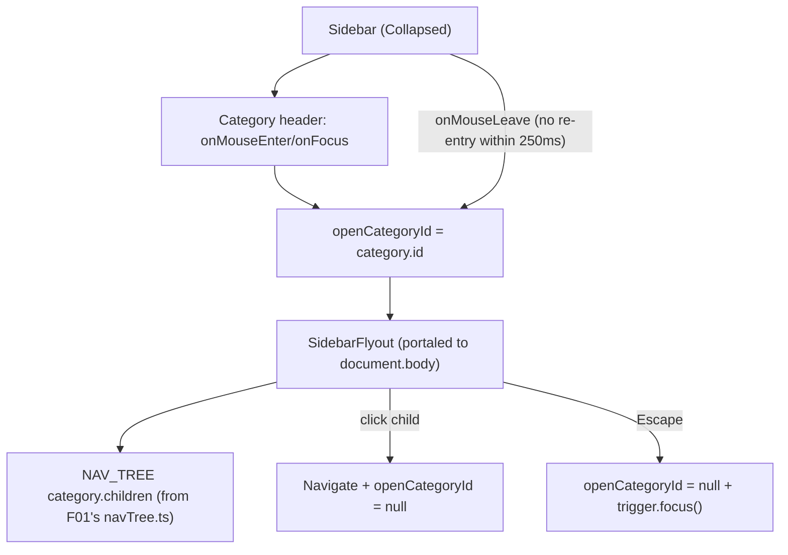

# Spec: F02. Web Collapsed-Mode Flyouts & Tooltips

## 1. Technical Overview

**What:** When the Web sidebar (F01) is Collapsed, hovering or keyboard-focusing a category icon opens a flyout listing that category's children as clickable links. The flyout stays open for ~250ms after the pointer leaves both the icon and the flyout (tolerating small mouse movements), closes immediately on Escape (returning focus to the trigger icon) or on blur to somewhere outside both elements, and closes synchronously when a child link is clicked.

**Why:** F01's Collapsed state hides all children — without this feature, a collapsed sidebar has no way to reach any page except by re-expanding. The flyout restores full navigability without permanently consuming width.

**Scope:**
- Included: hover/focus-triggered flyout anchored to a category icon, 250ms mouse-leave close delay, Escape-to-close with focus restoration, click-to-navigate-and-close, a new `SidebarFlyout` component portaled to `document.body` (since `Sidebar.css`'s `overflow-x: hidden` would otherwise clip a flyout extending past the 56px collapsed rail).
- Excluded: nothing deferred — F02 has no Core/Full scope split in the PRD. The toggle button's own tooltip (native `title` attribute) was already implemented in F01, satisfying that part of this feature's PRD text ahead of schedule.

## 2. Architecture Impact

**Affected components:**
- `Financial.Web/src/components/Sidebar.tsx` — adds `openCategoryId` state, hover/focus handlers on each category header, a ref to the currently-open trigger element (for Escape focus-restoration), and renders `SidebarFlyout` when a category is open and the sidebar is Collapsed.
- `Financial.Web/src/components/SidebarFlyout.tsx` — new. Renders the portaled flyout panel: category label (non-clickable title) + its children as links, positioned via the trigger's `getBoundingClientRect()`, manages the 250ms close-delay timer and the Escape key handler.
- `Financial.Web/src/components/SidebarFlyout.css` — new. Floating-panel styling (fixed position, `--shadow`, `--border`, z-index above the app shell).
- `Financial.Web/src/components/__tests__/SidebarFlyout.test.tsx` — new. Unit tests for the flyout's own rendering/behavior.
- `Financial.Web/src/components/__tests__/Sidebar.test.tsx` — modified. Adds integration tests for the hover/focus trigger wiring in Collapsed mode.

No changes to `navTree.ts` — `NavCategory`/`NavChild` already carry everything the flyout needs (`id`, `label`, `route`).

**Data flow:**

## 3. Technical Decisions

| Decision | Chosen Approach | Alternative Considered | Trade-off |
|----------|----------------|----------------------|-----------|
| Component split | New `SidebarFlyout.tsx`, receiving `category`, the trigger element's bounding rect, and `onClose` as props | Inline the portal/timer/escape logic inside `Sidebar.tsx` | Keeps `Sidebar.tsx` focused on the tree/toggle; the flyout's positioning and timer logic is a self-contained concern or |
| Rendering target | `createPortal` into `document.body` | CSS-only `position: absolute` inside `.sidebar__category` | `Sidebar.css` sets `overflow-x: hidden` on `.sidebar` itself, which would clip a flyout extending past the 56px collapsed rail; portaling avoids that clipping entirely and is the first portal usage in this codebase (there's no existing dropdown escaping an `overflow:hidden` ancestor to model instead) |
| Open-state model | Single `openCategoryId: string \| null` state on `Sidebar`, since only one flyout can be open at a time | Per-category local `isOpen` state | Simpler; the PRD's IA has only 2 categories and never shows two flyouts simultaneously |
| Close-delay mechanism | `useRef<number \| null>` holding a `setTimeout` id, started on `mouseleave` from both the trigger and the flyout, cleared on re-entry to either | A single shared debounce hook | No existing timer/debounce pattern exists in this codebase to reuse; a plain ref-held timeout id is the standard, dependency-free React idiom for this |
| Keyboard blur behavior | Blur to anything outside both the trigger and the flyout closes immediately (no delay) | Apply the same 250ms delay to blur | The delay's stated purpose (tolerating imprecise pointer movement) doesn't apply to keyboard focus, which moves to an exact element; Escape already has its own explicit immediate-close-and-refocus behavior |
| Escape focus restoration | `Sidebar` keeps a `triggerRefs` map (`Record<string, HTMLDivElement \| null>`) of each category header's DOM node, keyed by category id, and calls `.focus()` on the open one when `SidebarFlyout` reports an Escape close | Store only the single currently-open trigger node ref | A small ref map keyed by category id is barely more code than a single ref and avoids re-deriving "which category is open" from state during the escape handler |
| Flyout content styling | Reuse the existing `.sidebar__link` class and `--accent`/`--accent-bg` tokens for child links, plus the app's one existing floating-panel convention (`--shadow`, `--border`, `border-radius: 6px`) from `TickerCombobox.css` | Introduce new flyout-specific link styling | Visual consistency with the Expanded sidebar's own children list, and reuse of the only existing "floating panel" convention in the app |
| Z-index | `1000` | Match `TickerCombobox`'s `z-index: 100` | The flyout is portaled to `document.body`, outside the sidebar's own stacking context, so it must clear every existing z-index in the app (currently capped at 100) with headroom |

## 4. Component Overview

**Frontend:**

| File Path | New/Modified | Purpose | Key Responsibilities |
|-----------|--------------|---------|---------------------|
| `src/components/SidebarFlyout.tsx` | New | Portaled flyout panel | Renders category label + children links via `createPortal(..., document.body)`; positions itself from a passed-in `DOMRect`; owns the 250ms close-delay timer (`onMouseEnter`/`onMouseLeave` on its own root) and the `keydown` Escape handler; calls `onClose(shouldRefocus)` |
| `src/components/SidebarFlyout.css` | New | Flyout visual styling | Fixed position (`top`/`left` via inline style from the passed rect), `--shadow`, `--border`, `z-index: 1000`, reuses `.sidebar__link`-equivalent hover/active styling |
| `src/components/Sidebar.tsx` | Modified | Sidebar shell | Adds `openCategoryId` state, a `triggerRefs` map, `handleMouseEnter`/`handleMouseLeave`/`handleFocus`/`handleBlur` per category header, a shared close-delay timer ref, and conditionally renders `<SidebarFlyout>` when `collapsed && openCategoryId === category.id` |
| `src/components/__tests__/SidebarFlyout.test.tsx` | New | Flyout unit tests | Renders children in category order, click navigates + calls `onClose`, Escape calls `onClose(true)` |
| `src/components/__tests__/Sidebar.test.tsx` | Modified | Integration tests | Full hover/focus/delay/escape/expanded-mode-suppression matrix per the testing strategy below |

No backend, API, or database changes.

## 5. API Contracts

Not applicable — no API changes.

## 6. Data Model

Not applicable — no database changes; reuses F01's `NavCategory`/`NavChild` shape from `src/navigation/navTree.ts` unchanged.

## 7. Testing Strategy

**Test File Structure:**

| Test File | Test Type | Target | Coverage Goal |
|-----------|-----------|--------|---------------|
| `src/components/__tests__/SidebarFlyout.test.tsx` | Unit | `SidebarFlyout.tsx` | Rendering, click, Escape |
| `src/components/__tests__/Sidebar.test.tsx` | Integration | `Sidebar.tsx` + `SidebarFlyout.tsx` | All acceptance criteria below |

**`SidebarFlyout.test.tsx` functions:**

| Test Function | Description | Assertions |
|---------------|-------------|------------|
| `renders the category label as a non-clickable title` | Mount with a sample category | Label text present, not inside an `<a>`/`<button>` |
| `renders all children as links in category order` | Mount with a 6-child category | All 6 `NavLink`s present, in declared order |
| `clicking a child link calls onClose` | `fireEvent.click` a child link | `onClose` called; navigation occurs via the existing route mechanism |
| `pressing Escape calls onClose with refocus requested` | `fireEvent.keyDown(container, { key: 'Escape' })` | `onClose(true)` called (or equivalent refocus signal) |

**`Sidebar.test.tsx` new functions (mapped to PRD Section 9 F02 acceptance criteria):**

| Test Function | Description | Assertions |
|---------------|-------------|------------|
| `collapsed sidebar opens a flyout listing exactly that category's children on hover` | Collapse, `fireEvent.mouseEnter` the Investments header | Flyout renders Active/Historic/Dividend/Current-values links, in the same order as Expanded |
| `clicking a flyout child navigates and closes the flyout` | Open flyout, click a child | Location updates to that route; flyout unmounts |
| `moving the pointer off both the icon and flyout closes it after ~250ms unless re-entered` | `vi.useFakeTimers()`; `mouseLeave` icon, advance 100ms, `mouseEnter` flyout (cancels), then `mouseLeave` flyout, advance 250ms | Flyout stays open after the 100ms partial advance + re-entry; closes only after a full uninterrupted 250ms |
| `tab-focusing a category icon opens the identical flyout as hovering does` | `fireEvent.focus` the header | Same flyout content renders as the hover case |
| `pressing Escape while a flyout is open closes it and returns focus to the triggering icon` | Open via focus, `keyDown` Escape | Flyout unmounts; `document.activeElement` is the category header |
| `blurring to an element outside the trigger and flyout closes immediately` | Open via focus, `fireEvent.blur` to an unrelated element | Flyout unmounts without waiting for the timer |
| `expanded sidebar shows no flyout on hover or focus` | Do not collapse; `mouseEnter`/`focus` a header | No flyout renders |
| `toggle button still shows only its native tooltip, no flyout` | Hover the toggle button | `title` attribute present (from F01); no flyout-related element renders |

**Acceptance criteria traceability (PRD Section 9, F02):**
- Hover opens flyout with exact children/order → `collapsed sidebar opens a flyout listing exactly that category's children on hover`
- Click navigates and closes → `clicking a flyout child navigates and closes the flyout`
- ~250ms close tolerance → `moving the pointer off both the icon and flyout closes it after ~250ms unless re-entered`
- Tab-focus opens identical flyout → `tab-focusing a category icon opens the identical flyout as hovering does`
- Escape closes + refocuses trigger → `pressing Escape while a flyout is open closes it and returns focus to the triggering icon`
- No flyout when Expanded → `expanded sidebar shows no flyout on hover or focus`
- Toggle button keeps native tooltip only → `toggle button still shows only its native tooltip, no flyout`

**Cross-Feature Integration (PRD Section 9):**
- "F02's flyout content is generated from the same navigation tree definition F01 uses" → covered by `collapsed sidebar opens a flyout listing exactly that category's children on hover`, which asserts the flyout's children against the same `NAV_TREE` constant F01's `Sidebar` renders from — no separate/duplicated data source exists.
