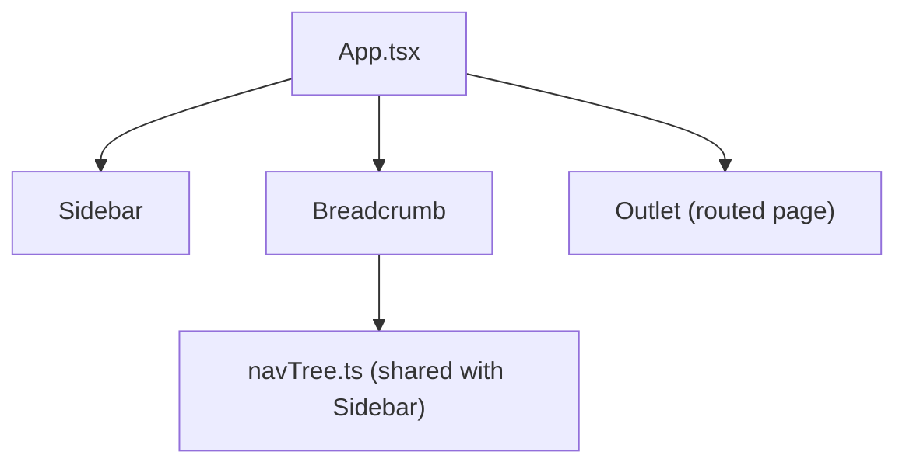

# Spec: F03. Web Breadcrumb Header

## 1. Technical Overview

**What:** A fixed-height (44px) breadcrumb bar spanning the content area's width, positioned above the routed page content, showing "{Category Label} › {Child Label}" for the current route — or an em dash if the route doesn't match any known leaf.

**Why:** With F01's Collapsed sidebar hiding labels entirely, the breadcrumb is the only always-visible wayfinding signal regardless of sidebar state.

**Scope:**
- Included: `Breadcrumb` component reading the current route via `useLocation`, resolving it against `NAV_TREE` (the same data F01's `Sidebar` renders from), rendered above `<Outlet />` in the app shell.
- Excluded: nothing deferred — F03 has no Core/Full scope split in the PRD.

## 2. Architecture Impact

**Affected components:**
- `Financial.Web/src/components/Breadcrumb.tsx` — new. Resolves `location.pathname` to a `{category, child}` pair from `NAV_TREE` and renders the two-segment text.
- `Financial.Web/src/components/Breadcrumb.css` — new. Fixed 44px height bar styling.
- `Financial.Web/src/App.tsx` — modified. Renders `<Breadcrumb />` above `<Outlet />`, inside `.app__content`.
- `Financial.Web/src/components/__tests__/Breadcrumb.test.tsx` — new.
- `Financial.Web/src/App.test.tsx` — modified. Confirms the shell still renders correctly with the breadcrumb present.

**Data flow:**

## 3. Technical Decisions

| Decision | Chosen Approach | Alternative Considered | Trade-off |
|----------|----------------|----------------------|-----------|
| Route-to-label resolution | Linear search over `NAV_TREE` matching `child.route === location.pathname`, same technique `Sidebar.tsx` already uses for active-item highlighting | A route-to-label lookup `Map` built once at module load | 10 entries total; a linear scan is simpler and matches the exact pattern already established in `Sidebar.tsx`, avoiding a second, subtly different data structure for the same 10-item tree |
| Placement | Rendered as a sibling of `<Outlet />` inside `.app__content` (which is already `display:flex; flex-direction:column`) | A new wrapping div requiring layout changes | `.app__content`'s existing flex-column layout accommodates a fixed-height sibling before the flex:1 page content with no structural changes; page root elements already set their own `flex:1; min-height:0` (e.g. `MonthlyPage.css`), so they keep sizing correctly with the breadcrumb taking a fixed 44px slot above them |
| Unmatched-route fallback | Render "—" (em dash) as plain text, per PRD | Render nothing (blank) | PRD explicitly specifies the em-dash fallback over blank space |

## 4. Component Overview

**Frontend:**

| File Path | New/Modified | Purpose | Key Responsibilities |
|-----------|--------------|---------|---------------------|
| `src/components/Breadcrumb.tsx` | New | Renders the "{Category} › {Child}" text | Resolves current route against `NAV_TREE`; renders "—" when unmatched |
| `src/components/Breadcrumb.css` | New | Bar styling | Fixed 44px height, full width, border-bottom, no interactive styling |
| `src/components/__tests__/Breadcrumb.test.tsx` | New | Unit tests | All acceptance criteria below |
| `src/App.tsx` | Modified | App shell | Renders `<Breadcrumb />` above `<Outlet />` |
| `src/App.test.tsx` | Modified | Shell tests | Confirms breadcrumb text present alongside existing sidebar assertions |

No backend, API, or database changes.

## 5. API Contracts

Not applicable.

## 6. Data Model

Not applicable — reuses F01's `NAV_TREE` unchanged.

## 7. Testing Strategy

**Test File Structure:**

| Test File | Test Type | Target | Coverage Goal |
|-----------|-----------|--------|---------------|
| `src/components/__tests__/Breadcrumb.test.tsx` | Unit | `Breadcrumb.tsx` | All acceptance criteria |
| `src/App.test.tsx` | Component | `App.tsx` shell | Breadcrumb renders in the shell |

**`Breadcrumb.test.tsx` functions (mapped to PRD Section 9 F03 acceptance criteria):**

| Test Function | Description | Assertions |
|---------------|-------------|------------|
| `renders "Category › Child" for every one of the ten leaf routes` | Render at each of the 10 routes in turn | Text matches `${category.label} › ${child.label}` for every route, sourced from `NAV_TREE` |
| `renders an em dash for an unmatched route` | Render at `/unknown` | Text is exactly "—" |
| `breadcrumb text is not a link and has no interactive role` | Render at any known route | No `link`/`button` role present in the breadcrumb container |
| `renders regardless of sidebar collapsed state` | Render with `financial.sidebarCollapsed` set to `'true'` in `localStorage` before mount | Breadcrumb text still present |

**Acceptance criteria traceability (PRD Section 9, F03):**
- Visible in both Expanded and Collapsed states → `renders regardless of sidebar collapsed state`
- Updates to "{Category} › {Child}" for all ten routes → `renders "Category › Child" for every one of the ten leaf routes`
- Not clickable, no hover/active styling → `breadcrumb text is not a link and has no interactive role` (CSS absence of hover/active rules verified by not defining any, per Technical Decisions)
- Labels exactly match the sidebar's labels for that route → covered by sourcing from the same `NAV_TREE` constant `Sidebar.tsx` renders from, asserted in `renders "Category › Child" for every one of the ten leaf routes`

**Cross-Feature Integration (PRD Section 9):**
- "F03's breadcrumb labels are generated from the same navigation tree definition F01 uses for the sidebar — for every one of the ten routes, the breadcrumb's two segments exactly match the sidebar's category and child labels for that route" → covered by `renders "Category › Child" for every one of the ten leaf routes`, which asserts against `NAV_TREE` directly (the same constant `Sidebar.tsx` imports) rather than a duplicated/hardcoded label list.
