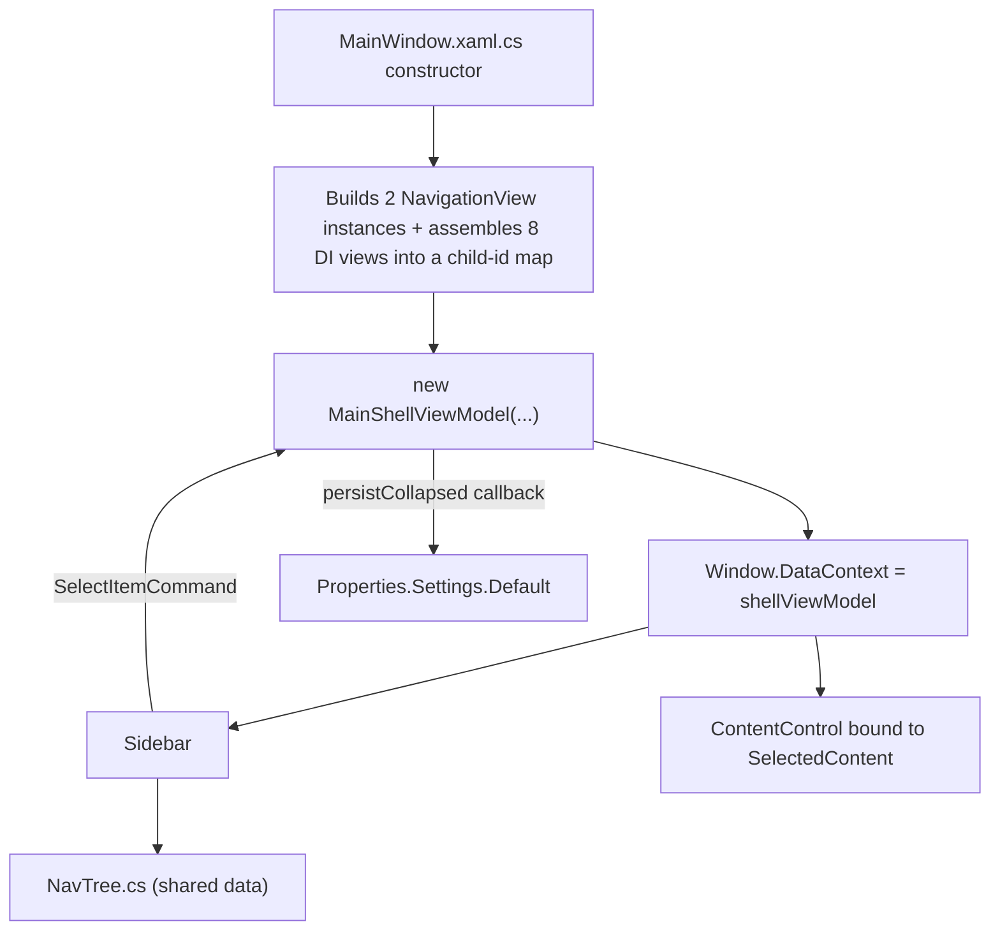

# Spec: F04. WPF Sidebar Navigation Shell

## 1. Technical Overview

**What:** Replace `Financial.App`'s `MainWindow.xaml` two nested `TabControl`s (top-level Investments/Cash Flow, then per-domain sub-tabs) with a fixed-width collapsible left `Sidebar` `UserControl`, a `ContentControl` bound to the currently selected destination view, and (in a later feature, F06) a breadcrumb bar above the content. State — collapsed/expanded and the currently selected item — is centralized in a new `MainShellViewModel`, matching the project's existing `ViewModelBase`/`RelayCommand` MVVM convention.

**Why:** The two nested `TabControl`s permanently consume a fixed strip of the window and cannot be shrunk. This feature establishes the WPF navigation tree as a single source of truth (consumed later by F05's flyouts and F06's breadcrumb) and is the foundational shell every WPF view will render inside of, mirroring the Web app's F01 shell for cross-platform parity.

**Scope:**
- Included: `Sidebar` `UserControl` with Expanded (240px)/Collapsed (56px) states, toggle button, `Properties.Settings`-backed persistence read before `Loaded`, active-item highlighting, a new `MainShellViewModel` owning the selected-content/collapsed state, a shared WPF navigation tree data module, and the `MainWindow.xaml`/`.cs` restructuring needed to host them.
- Excluded (deferred to later features per PRD): collapsed-mode popups/tooltips (F05), breadcrumb header (F06). This spec's Collapsed state renders icons only, with no popup — that's F05's job.

## 2. Architecture Impact

**Affected components:**
- `Financial.App/MainWindow.xaml` — the two nested `TabControl`s are replaced with a two-column `Grid`: column 0 hosts `Sidebar`, column 1 hosts a `ContentControl` bound to `MainShellViewModel.SelectedContent`.
- `Financial.App/MainWindow.xaml.cs` — constructor keeps its existing 8 DI-injected views + 2 nav ViewModels, additionally builds the two `NavigationView` instances (previously placed inline in XAML) explicitly in code, assembles the child-id → view-instance map, constructs `MainShellViewModel`, and sets `Window.DataContext`.
- `Financial.App/ViewModels/MainShellViewModel.cs` — new. Owns `IsCollapsed`, `SelectedChildId`, `SelectedContent`, exposes the nav tree, and the `ToggleCollapsedCommand`/`SelectItemCommand`.
- `Financial.App/Navigation/NavTree.cs` — new. Static data: 2 categories × their ordered children (id, label, icon glyph for categories; id, label, view key for children), consumed by `MainShellViewModel` now and by F05/F06 later.
- `Financial.App/Components/Sidebar.xaml` / `.xaml.cs` — new. Renders the toggle button, the two categories, and their children; inherits `DataContext` from `MainWindow` (same pattern-family as the rest of the shell).
- `Financial.App/Converters/BoolToSidebarWidthConverter.cs` — new. Converts `IsCollapsed` to a `GridLength` (56 or 240), following the existing `DoubleToGridLengthConverter` pattern.
- `Financial.App/Converters/CategoryHasSelectedChildConverter.cs` — new. `IMultiValueConverter` used to tint a category's icon when one of its children is selected.
- `Financial.App/Properties/Settings.settings` (+ generated `Settings.Designer.cs`) — new. Adds the user-scoped `IsNavigationSidebarCollapsed` boolean setting (default `false`), mirroring the empty scaffold already present in `Integrations/ImportGoogleSpreadSheets/Properties/Settings.settings`.
- `Financial.App/App.xaml` — adds the two new converters as application-level resources, alongside the existing converter registrations.
- No DI registration changes: `MainWindow`'s constructor signature (the 8 views + 2 nav ViewModels) is unchanged, so `App.xaml.cs`'s `AddTransient<MainWindow>()` and the other existing registrations keep working as-is. `MainShellViewModel` is not DI-registered — `MainWindow` (the composition root) constructs it directly, since it needs the view-instance map that only `MainWindow` can assemble.

**Data flow:**



## 3. Technical Decisions

| Decision | Chosen Approach | Alternative Considered | Trade-off |
|----------|----------------|----------------------|-----------|
| Where selected-content state lives | New `MainShellViewModel` with a `SelectedContent` (`object`) property, bound via `ContentControl.Content="{Binding SelectedContent}"` | Keep code-behind `TabItem.Content =` style assignment, Sidebar raises an event `MainWindow` handles | Matches the PRD's explicit "bound `SelectedContent`/`CurrentView`" requirement and lets F06's breadcrumb bind to the same property with plain XAML binding instead of a new event-plumbing mechanism |
| `NavigationView` (Active/Historic Investments) wiring | `MainWindow`'s constructor builds `new NavigationView { DataContext = _navigationViewModel }` explicitly in code for both, uniformly alongside the 8 DI-injected views | Register `NavigationView` itself in DI and inject two named instances into `MainWindow` | Avoids DI registration changes; `MainWindow` already needs to be the place that assembles the full 10-item view map, so building these two there — where their view-models are already private fields — is the natural fit |
| Nav tree data location | Dedicated `Financial.App/Navigation/NavTree.cs`, plain static data (no view instances, no WPF types beyond simple records) | Inline the tree inside `MainShellViewModel` | F05 (popups) and F06 (breadcrumb) in Wave 2 import the same static data without depending on the shell ViewModel or any pre-built view instances |
| Child → view instance mapping | Nav tree children hold a string `ViewKey`; `MainShellViewModel` receives a separate `IReadOnlyDictionary<string, object>` (view key → pre-built view instance) via its constructor and resolves `SelectedContent` by key lookup on selection | Nav tree children hold a direct reference to the view type or instance | Keeps `NavTree.cs` a pure, view-instance-free data source reusable by F05/F06 without pulling WPF `UserControl` objects into a shared data module |
| Collapsed-state persistence from the ViewModel | `MainShellViewModel` takes `bool initialCollapsed` and an `Action<bool> persistCollapsed` callback via its constructor; it never references `Properties.Settings` directly | `MainShellViewModel` reads/writes `Properties.Settings.Default.IsNavigationSidebarCollapsed` directly | Matches the project's existing pattern of injecting UI/infra callbacks into ViewModel constructors (e.g. the `msg => MessageBox.Show(...)` callbacks already used for `MonthlyViewModel`, `ReservaViewModel`, etc.) and keeps `MainShellViewModel` unit-testable without touching real `ApplicationSettingsBase` state |
| `MainShellViewModel` registration | Constructed directly by `MainWindow` (`new MainShellViewModel(...)`), not DI-registered | `services.AddTransient<MainShellViewModel>()` | It needs the view-instance map only `MainWindow` can assemble (2 code-built `NavigationView`s + 8 DI views); registering it in DI would require restructuring how those 10 views are constructed for no benefit, since only `MainWindow` ever creates one |
| Sidebar width | New `Financial.App/Converters/BoolToSidebarWidthConverter.cs`, mirroring the existing `DoubleToGridLengthConverter` pattern already registered in `App.xaml` | Reuse `DoubleToGridLengthConverter` with a bound `double` | A dedicated bool→`GridLength` converter is simpler at the call site (`Width="{Binding IsCollapsed, Converter={StaticResource BoolToSidebarWidthConverter}}"`) than routing a boolean through a double-typed converter |
| Active-child highlighting inside the sidebar's `ItemsControl` | `MultiBinding` + a converter comparing the item's `Id` against `MainShellViewModel.SelectedChildId` (reached via `RelativeSource AncestorType=UserControl` from inside the `DataTemplate`) | A `Style.Triggers`/`DataTrigger` per item | `MultiBinding` is the standard WPF technique for comparing two independently-bound values from inside an `ItemsControl`'s `DataTemplate`; no existing `DataTrigger`-based highlight-by-comparison pattern exists in the codebase to extend instead |
| Category icon tint when a child is active | New `CategoryHasSelectedChildConverter` (`IMultiValueConverter`), taking the category's children collection and `SelectedChildId` | Compute an `IsActive` flag per category inside `MainShellViewModel` | Keeps `MainShellViewModel` free of per-category derived-state bookkeeping; the category data plus the current selection is everything the converter needs |
| `Settings.settings` scaffold | Add `Financial.App/Properties/Settings.settings` (+ generated `Settings.Designer.cs`) defining `IsNavigationSidebarCollapsed` (bool, user scope, default `false`) | Use `Microsoft.Extensions.Configuration`'s existing `appsettings.json` (already used elsewhere in `Financial.App`) | The PRD explicitly calls for a "user-scoped setting" saved via `Settings.Default.Save()`, which requires `ApplicationSettingsBase`; `appsettings.json` is read-only app configuration in this codebase, not a place user preferences are written back to |
| `MainWindow.NavigationViewModel`/`NavigationViewModelHistoric` public properties | Removed — no longer needed once `NavigationView` instances are built directly in code-behind instead of via `{Binding ElementName=root, ...}` in XAML | Keep them for backward compatibility | Confirmed unused outside `MainWindow.xaml.cs` itself (no test or other file references them); keeping unused public surface would be dead code |

## 4. Component Overview

**Frontend (WPF):**

| File Path | New/Modified | Purpose | Key Responsibilities |
|-----------|--------------|---------|---------------------|
| `Financial.App/Navigation/NavTree.cs` | New | Single source of truth for the nav tree | Static `NavCategory`/`NavChild` records and a `NavTree.Categories` list (2 categories, 4 + 6 ordered children), each child carrying a `ViewKey` string used for content lookup |
| `Financial.App/ViewModels/MainShellViewModel.cs` | New | Owns shell state | `IsCollapsed`, `SelectedChildId`, `SelectedContent` (`object?`) properties; `ToggleCollapsedCommand` (`RelayCommand`); `SelectItemCommand` (`RelayCommand<string>`) resolving the view by `ViewKey`; exposes `NavTree.Categories` for binding |
| `Tests/Financial.Presentation.Tests/ViewModels/MainShellViewModelTests.cs` | New | Unit tests | Default selection, toggle persists via callback, `SelectItemCommand` updates `SelectedContent`/`SelectedChildId`, `PropertyChanged` raised for each mutated property |
| `Tests/Financial.Presentation.Tests/Navigation/NavTreeTests.cs` | New | Data-shape tests | Exactly 2 categories; Investments has 4 children, CashFlow has 6, in the existing tab order; every `ViewKey` is unique |
| `Financial.App/Components/Sidebar.xaml` / `.xaml.cs` | New | Sidebar UI | Toggle button; two category sections with icon + label (Expanded) or icon-only (Collapsed); children as clickable items bound to `SelectItemCommand`; active-item and active-category-icon highlighting |
| `Financial.App/Converters/BoolToSidebarWidthConverter.cs` | New | Sidebar column width | Converts `IsCollapsed` (`bool`) to `GridLength` (56 or 240) |
| `Financial.App/Converters/CategoryHasSelectedChildConverter.cs` | New | Category icon tint | `IMultiValueConverter`: given a category's children and `SelectedChildId`, returns whether to apply the `#007ACC` tint |
| `Financial.App/Properties/Settings.settings` (+ `Settings.Designer.cs`) | New | Persisted collapsed state | Defines `IsNavigationSidebarCollapsed` (bool, User scope, default `false`) |
| `Financial.App/MainWindow.xaml` | Modified | Shell layout | Two-column `Grid` (`Sidebar` + `ContentControl` bound to `SelectedContent`), replacing the two nested `TabControl`s |
| `Financial.App/MainWindow.xaml.cs` | Modified | Composition root wiring | Builds the two `NavigationView` instances, assembles the 10-entry view map, reads `Properties.Settings.Default.IsNavigationSidebarCollapsed`, constructs `MainShellViewModel` with a `persistCollapsed` callback that calls `Properties.Settings.Default.IsNavigationSidebarCollapsed = v; Properties.Settings.Default.Save();`, sets `DataContext`; keeps the existing `Loaded` handler loading both nav trees |
| `Financial.App/App.xaml` | Modified | Resource registration | Registers `BoolToSidebarWidthConverter` and `CategoryHasSelectedChildConverter` as application resources |

No backend, API, or database changes — this feature is WPF navigation chrome only.

## 5. API Contracts

Not applicable — no API changes.

## 6. Data Model

Not applicable — no database changes. The only "schema" is the shared nav tree shape and the new user setting:

```csharp
public sealed record NavChild(string Id, string Label, string ViewKey);
public sealed record NavCategory(string Id, string Label, string IconGlyph, IReadOnlyList<NavChild> Children);
```

`NavTree.Categories` contains exactly 2 `NavCategory` entries, matching `MainWindow.xaml`'s current tab order:
- `investments`: label "Investments", 4 children — Active Investments (`ViewKey: "active-investments"`), Historic Investments (`"historic-investments"`), Shares Dividend Check (`"dividend-check"`), Read Assets Current Values (`"current-values"`).
- `cashflow`: label "CashFlow", 6 children, in the current Cash Flow tab order — Monthly (`"monthly"`), Reserva (`"reserva"`), Mensais (`"mensais"`), Controle Mae (`"controle-mae"`), Investment Snapshots (`"investment-snapshots"`), Annual Summary (`"annual-summary"`).

**`Settings.settings`:**

| Setting | Type | Scope | Default | Description |
|---------|------|-------|---------|-------------|
| `IsNavigationSidebarCollapsed` | `bool` | User | `false` | Persisted sidebar collapsed/expanded state, read on `MainWindow` construction and saved on every toggle |

## 7. Testing Strategy

**Test File Structure:**

| Test File | Test Type | Target | Coverage Goal |
|-----------|-----------|--------|---------------|
| `Tests/Financial.Presentation.Tests/Navigation/NavTreeTests.cs` | Unit | `NavTree.cs` | Full shape validation |
| `Tests/Financial.Presentation.Tests/ViewModels/MainShellViewModelTests.cs` | Unit | `MainShellViewModel.cs` | All acceptance criteria below |

**`NavTreeTests.cs` functions:**

| Test Function | Description | Assertions |
|---------------|-------------|------------|
| `Categories_HasExactlyTwoCategories` | Shape check | `NavTree.Categories.Count == 2`, ids are `investments`/`cashflow` in that order |
| `InvestmentsCategory_HasFourChildrenInExistingTabOrder` | Order/content check | 4 children, labels/`ViewKey`s match the current `MainWindow.xaml` tab order |
| `CashFlowCategory_HasSixChildrenInExistingTabOrder` | Order/content check | 6 children, labels/`ViewKey`s match the current `MainWindow.xaml` tab order |
| `AllChildViewKeys_AreUnique` | Integrity check | No duplicate `ViewKey` across both categories |

**`MainShellViewModelTests.cs` functions (mapped to PRD Section 9 F04 acceptance criteria):**

| Test Function | Description | Assertions |
|---------------|-------------|------------|
| `Constructor_DefaultsToExpandedWhenInitialCollapsedIsFalse` | Construct with `initialCollapsed: false` | `IsCollapsed` is `false`; `SelectedContent` is the view registered for the default child (`active-investments`) |
| `Constructor_HonorsStoredCollapsedState` | Construct with `initialCollapsed: true` | `IsCollapsed` is `true` on first read, with no intermediate `false` state observed |
| `ToggleCollapsedCommand_FlipsStateAndInvokesPersistCallback` | Execute the command twice | `IsCollapsed` flips both times; the injected `persistCollapsed` callback receives `true` then `false` |
| `SelectItemCommand_UpdatesSelectedContentAndChildId` | Execute for each of the 10 `ViewKey`s | `SelectedChildId` and `SelectedContent` update to the matching pre-registered stub view instance for every entry |
| `SelectItemCommand_UnknownViewKey_DoesNotThrowOrChangeSelection` | Execute with an unregistered key | No exception; `SelectedContent`/`SelectedChildId` remain unchanged |
| `PropertyChanged_RaisedForIsCollapsedSelectedChildIdAndSelectedContent` | Subscribe to `PropertyChanged`, mutate each property | Event fires with the correct property name for each mutation |

**Acceptance criteria traceability (PRD Section 9, F04):**
- First-launch Expanded default (no prior setting) → `Constructor_DefaultsToExpandedWhenInitialCollapsedIsFalse`
- Toggle collapses/expands, content column reflows → `ToggleCollapsedCommand_FlipsStateAndInvokesPersistCallback` (column reflow is a `Grid` `*`-column consequence of the bound `Auto`/converted width, not independently unit-testable; verified visually by running the app, per the project's UI-testing convention)
- Setting written and saved on every toggle → `ToggleCollapsedCommand_FlipsStateAndInvokesPersistCallback` (callback invocation stands in for the real `Settings.Default.Save()` call, which lives in `MainWindow.xaml.cs` and is verified by manual/visual restart-persistence check)
- Restart shows already-Collapsed on first frame → `Constructor_HonorsStoredCollapsedState`, plus a manual restart-persistence check (no automated WPF window-restart test exists in this codebase)
- Active item highlighted with `#007ACC`, no other item → `SelectItemCommand_UpdatesSelectedContentAndChildId` (state correctness); the actual `#007ACC` rendering is a XAML/converter concern verified visually
- Category headers don't change the selected view → by construction, category headers are plain, non-interactive `TextBlock`/`Border` elements with no bound `Command` — nothing to wire up, hence nothing to break; verified visually that clicking one has no effect
- All ten destination views remain reachable → `SelectItemCommand_UpdatesSelectedContentAndChildId` covering every `ViewKey`, plus a manual smoke check that the app launches and every sidebar item shows its expected pre-existing view content unchanged
