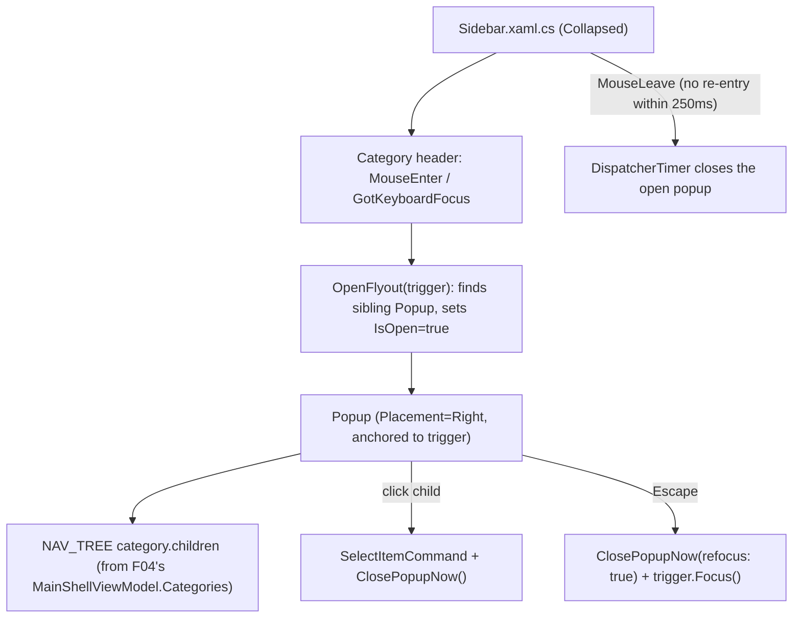

# Spec: F05. WPF Collapsed-Mode Flyouts & Tooltips

## 1. Technical Overview

**What:** When the WPF sidebar (F04) is Collapsed, hovering or keyboard-focusing a category icon opens a WPF `Popup` (`Placement="Right"`) anchored to that icon, listing the category's children. The popup stays open for ~250ms after the pointer leaves both the icon and the popup, closes immediately on Escape (returning keyboard focus to the triggering icon) or on focus moving elsewhere, and closes synchronously when a child item is clicked.

**Why:** F04's Collapsed state hides all children — without this feature there is no way to reach any destination view except by re-expanding. Mirrors the Web app's F02 for cross-platform parity.

**Scope:**
- Included: hover/focus-triggered `Popup` per category, 250ms `DispatcherTimer`-based close delay, Escape-to-close with focus restoration, click-to-select-and-close, category headers becoming keyboard-focusable only in Collapsed mode.
- Excluded: nothing deferred — F05 has no Core/Full scope split in the PRD. The toggle button's native `ToolTip` was already implemented in F04, satisfying that part of this feature's PRD text ahead of schedule.

## 2. Architecture Impact

**Affected components:**
- `Financial.App/Components/Sidebar.xaml` — adds `x:Name` to each category header panel, a `Popup` per category (one per `DataTemplate` instance, `PlacementTarget` bound to its own header via `ElementName`), `Focusable` bound to `IsCollapsed`, and mouse/keyboard event wiring.
- `Financial.App/Components/Sidebar.xaml.cs` — adds the popup open/close state machine: which popup is currently open, a shared `DispatcherTimer` for the close delay, and the focus-suppression flag needed to prevent the Escape-triggered refocus from immediately reopening the popup (the same feedback loop identified and fixed in the Web F02 implementation).

No changes to `MainShellViewModel` or `NavTree.cs` — this is purely view-layer interaction state, consistent with the Web F02 decision to keep flyout open/closed state as local component state rather than shared ViewModel state.

**Data flow:**

## 3. Technical Decisions

| Decision | Chosen Approach | Alternative Considered | Trade-off |
|----------|----------------|----------------------|-----------|
| Popup state ownership | `Sidebar.xaml.cs` code-behind fields (currently-open `Popup`/trigger references, a shared `DispatcherTimer`, a focus-suppression flag) | New properties on `MainShellViewModel` | Mirrors the Web F02 decision (flyout open state is local component state, not shared ViewModel state) and this codebase's existing convention of handling UI-only interaction in code-behind (`NavigationView.xaml.cs`'s plot-resize handlers); keeps `MainShellViewModel` free of transient view-only state |
| Popup positioning | One `Popup` per category, declared inside the same `DataTemplate` as its header, with `PlacementTarget="{Binding ElementName=CategoryHeaderPanel}"` (each `DataTemplate` instance has its own XAML name scope, so this resolves to that instance's own header) | A single shared `Popup` reparented/repositioned per category on open | Per-category popups avoid manual reparenting logic; WPF's `ElementName` binding inside a repeated `DataTemplate` correctly scopes to the current instance, so this is a standard, simple technique |
| Locating the sibling `Popup` from an event handler | `((FrameworkElement)sender).Parent` cast to the template's root `Panel`, then `.Children.OfType<Popup>().Single()` | Store a `Dictionary<string, Popup>` keyed by category id, populated via `Loaded` handlers | The template structure is fixed and known at compile time (header panel, children list, popup are always siblings under the same root `StackPanel`), so a direct sibling lookup needs no extra bookkeeping |
| Close-delay mechanism | A single shared `DispatcherTimer` (`Interval = 250ms`), `Start()`ed on `MouseLeave` from both the header and the popup content, `Stop()`ped on re-entry to either | A `DispatcherTimer` per category | Only one popup is ever open at a time, so one shared timer is sufficient and matches the Web F02 decision (single shared timer, not per-category) |
| Escape-triggered refocus feedback loop | A `_suppressFocusOpen` flag set right before calling `trigger.Focus()`, checked and cleared at the top of the `GotKeyboardFocus` handler before it would otherwise reopen the popup | Track "is this focus programmatic" via a separate WPF API | WPF has no built-in way to distinguish programmatic `.Focus()` calls from user-initiated ones in the `GotKeyboardFocus` handler; a simple suppress flag is the same fix already proven necessary and applied in the Web F02 implementation (`Sidebar.tsx`'s `suppressFocusOpenRef`) |
| Keyboard focusability of category headers | `Focusable` bound directly to `IsCollapsed` (`Focusable="{Binding DataContext.IsCollapsed, RelativeSource={RelativeSource AncestorType=UserControl}}"`) — both are plain booleans, no converter needed | Always `Focusable="True"` | Matches the Web F02 decision (`tabIndex={collapsed ? 0 : -1}`): a header that opens nothing in Expanded mode shouldn't be a keyboard tab stop there |
| Blur/focus-outside handling | `LostKeyboardFocus` on the header checks `e.NewFocus`; if it's neither the popup's content nor the trigger itself, close immediately (no delay) | Apply the same 250ms delay to keyboard focus loss | Matches the Web F02 decision: the delay's purpose (tolerating imprecise pointer movement) doesn't apply to keyboard focus, which moves to an exact element |

## 4. Component Overview

**Frontend (WPF):**

| File Path | New/Modified | Purpose | Key Responsibilities |
|-----------|--------------|---------|---------------------|
| `Financial.App/Components/Sidebar.xaml` | Modified | Popup UI | Names each category header panel; adds a `Popup` (`Placement="Right"`, `StaysOpen="True"`) per category listing its children as clickable items; binds header `Focusable` to `IsCollapsed`; wires `MouseEnter`/`MouseLeave`/`GotKeyboardFocus`/`LostKeyboardFocus` on headers and `MouseEnter`/`MouseLeave`/`PreviewKeyDown` on popup content |
| `Financial.App/Components/Sidebar.xaml.cs` | Modified | Popup state machine | `OpenFlyout(FrameworkElement trigger)`, `ScheduleClose()`, `CancelCloseTimer()`, `ClosePopupNow(bool refocus)`, backed by a shared `DispatcherTimer` and the focus-suppression flag |

No backend, API, database, or `MainShellViewModel` changes — this feature is WPF navigation chrome only, layered entirely on top of F04's existing `Sidebar`/`MainShellViewModel`.

## 5. API Contracts

Not applicable.

## 6. Data Model

Not applicable — no new data; reuses F04's `NavTree.Categories` (via `MainShellViewModel.Categories`) unchanged.

## 7. Testing Strategy

This feature is almost entirely WPF-event-driven code-behind interaction logic (mouse/keyboard events, a `DispatcherTimer`, `Popup.IsOpen` toggling) with no new `MainShellViewModel` properties, commands, or data model — there is nothing here that fits the codebase's existing testing boundary (per F04's own finding: "no UI-automation/interaction test exists for `MainWindow` or `NavigationView` ... all existing Presentation tests are pure ViewModel/converter/DI unit tests"). Consistent with that established boundary, and with how F04 itself relied on manual/visual verification for its own runtime-only behaviors (width reflow, restart persistence, visual highlighting), F05's interaction behaviors are verified manually rather than via new automated tests.

**Manual verification checklist (mapped to PRD Section 9 F05 acceptance criteria):**

| Check | Description |
|-------|-------------|
| Popup lists exact children on hover | With the sidebar Collapsed, hover a category icon; popup shows exactly that category's children, in the same order as Expanded |
| Click selects and closes | Clicking a child item in the popup sets the selected view and closes the popup |
| ~250ms close tolerance | Moving the mouse off both the icon and the popup closes it after ~250ms unless the pointer re-enters within that window |
| Tab-focus opens identical popup | Tab-focusing a category icon opens the same popup as hovering does |
| Escape closes + refocuses | Pressing Escape while a popup is open closes it and returns keyboard focus to the triggering icon, without the popup immediately reopening |
| No popup when Expanded | With the sidebar Expanded, no popup appears on hover or focus |
| Toggle button keeps native tooltip only | Hovering the toggle button shows its native WPF tooltip; no popup appears for it |

**Acceptance criteria traceability (PRD Section 9, F05):** all seven criteria map 1:1 to the manual verification checks above — none has an automated test, consistent with this codebase's existing WPF interaction-testing boundary.

**Cross-Feature Integration (PRD Section 9):**
- "F05's popup content (category label, child labels, child order) is generated from the same navigation tree definition F04 uses for the Expanded sidebar" — satisfied by construction: the popup's `ItemsSource` binds to the same `category.Children` (from `MainShellViewModel.Categories`, backed by `NavTree.Categories`) that the Expanded sidebar's own children list already binds to; there is no second/duplicated data source. Verified visually alongside the manual checks above.
