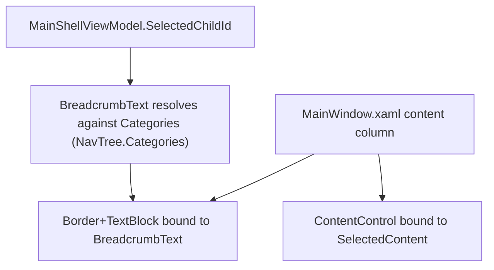

# Spec: F06. WPF Breadcrumb Header

## 1. Technical Overview

**What:** A fixed-height (32px) `Border`+`TextBlock` spanning the content column's width, positioned above the `ContentControl`, showing "{Category Label} › {Child Label}" for the currently selected view — or an em dash if unmatched.

**Why:** With F04's Collapsed sidebar hiding labels entirely, the breadcrumb is the only always-visible wayfinding signal regardless of sidebar state, mirroring the Web app's F03 for cross-platform parity.

**Scope:**
- Included: a `BreadcrumbText` computed property on `MainShellViewModel` (resolved from `SelectedChildId` against the same `Categories`/`NavTree.Categories` F04's `Sidebar` renders from), and the `MainWindow.xaml` layout change to display it above the content.
- Excluded: nothing deferred — F06 has no Core/Full scope split in the PRD.

## 2. Architecture Impact

**Affected components:**
- `Financial.App/ViewModels/MainShellViewModel.cs` — adds a `BreadcrumbText` computed property, re-raising `PropertyChanged` for it whenever `SelectedChildId` changes.
- `Financial.App/MainWindow.xaml` — the content column becomes a two-row `Grid`: a 32px `Border`/`TextBlock` row bound to `BreadcrumbText`, then the existing `ContentControl` row.

No new `UserControl` — the breadcrumb is a single bound `TextBlock` inside a `Border`, directly in `MainWindow.xaml`, consistent with not introducing a component for a single bound string with no reuse elsewhere.

**Data flow:**

## 3. Technical Decisions

| Decision | Chosen Approach | Alternative Considered | Trade-off |
|----------|----------------|----------------------|-----------|
| Where the breadcrumb text is computed | `MainShellViewModel.BreadcrumbText`, a computed property resolved against the same `Categories` the sidebar binds to | A separate `BreadcrumbViewModel` | `MainShellViewModel` already owns `SelectedChildId` and `Categories`; a second ViewModel would need to observe the first for no benefit |
| Change notification | `SelectedChildId`'s private setter also raises `PropertyChanged` for `BreadcrumbText` after a successful `SetProperty` | A `DependencyProperty`-style computed binding | Matches the existing `ViewModelBase`/`SetProperty` convention already used throughout this codebase; no new binding infrastructure needed |
| Markup structure | Inline `Border`+`TextBlock` directly in `MainWindow.xaml`, no new `UserControl` | A new `Breadcrumb.xaml` component (mirroring Web's `Breadcrumb.tsx`) | A single bound string with no interaction and no reuse elsewhere doesn't justify a dedicated component; matches the project's "avoid over-engineering" guidance for a personal-use app |

## 4. Component Overview

**Frontend (WPF):**

| File Path | New/Modified | Purpose | Key Responsibilities |
|-----------|--------------|---------|---------------------|
| `Financial.App/ViewModels/MainShellViewModel.cs` | Modified | Breadcrumb text | `BreadcrumbText` get-only property resolving `SelectedChildId` against `Categories`, returning "—" when unmatched; `SelectedChildId`'s setter notifies `BreadcrumbText` changed |
| `Financial.App/MainWindow.xaml` | Modified | Shell layout | Two-row content-column `Grid`: 32px breadcrumb bar, then the existing `ContentControl` |
| `Tests/Financial.Presentation.Tests/ViewModels/MainShellViewModelTests.cs` | Modified | Unit tests | New tests covering `BreadcrumbText` per the testing strategy below |

No backend, API, or database changes.

## 5. API Contracts

Not applicable.

## 6. Data Model

Not applicable — reuses F04's `NavTree.Categories` unchanged.

## 7. Testing Strategy

**Test File Structure:**

| Test File | Test Type | Target | Coverage Goal |
|-----------|-----------|--------|---------------|
| `Tests/Financial.Presentation.Tests/ViewModels/MainShellViewModelTests.cs` | Unit | `MainShellViewModel.BreadcrumbText` | All acceptance criteria below |

**New test functions (mapped to PRD Section 9 F06 acceptance criteria):**

| Test Function | Description | Assertions |
|---------------|-------------|------------|
| `BreadcrumbText_DefaultsToFirstCategoryAndChild` | Construct with default selection | `BreadcrumbText` is `"Investments › Active Investments"` |
| `BreadcrumbText_UpdatesWhenSelectedItemChanges` | Execute `SelectItemCommand` for each of the 10 view keys | `BreadcrumbText` equals `"{category.Label} › {child.Label}"` for every entry, matching the same `Categories` the sidebar renders from |
| `BreadcrumbText_FallsBackToEmDashForUnmatchedSelection` | Register a view under a key not present in any category's children, then select it | `BreadcrumbText` is `"—"` |
| `PropertyChanged_RaisedForBreadcrumbTextOnSelectionChange` | Subscribe to `PropertyChanged`, execute `SelectItemCommand` | Event fires with `nameof(BreadcrumbText)` |

**Acceptance criteria traceability (PRD Section 9, F06):**
- Visible above content in both Expanded and Collapsed states → satisfied by construction (the breadcrumb row is a sibling of the `ContentControl`, unaffected by the sidebar's own column width); verified visually
- Selecting any of the ten views updates to "{Category} › {Child}" → `BreadcrumbText_UpdatesWhenSelectedItemChanges`
- Not clickable, no hover/active styling, no `Command` binding → satisfied by construction (plain `TextBlock`, no `Button`/`Command`); verified visually
- Labels exactly match the sidebar's labels for that view → covered by `BreadcrumbText_UpdatesWhenSelectedItemChanges`, which asserts against the same `Categories` property the sidebar binds to

**Cross-Feature Integration (PRD Section 9):**
- "F06's breadcrumb labels are generated from the same navigation tree definition F04 uses for the sidebar" → covered by `BreadcrumbText_UpdatesWhenSelectedItemChanges`, which resolves against `MainShellViewModel.Categories` (backed by `NavTree.Categories`) — the same source `Sidebar.xaml` binds to, not a duplicated list.
