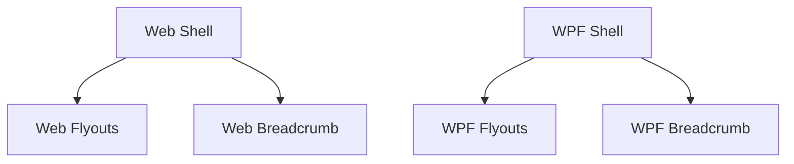

# Sidebar Navigation Redesign

## 1. Executive Summary

This product replaces the top-of-screen navigation chrome in both the Web Frontend and the WPF Desktop Application with a collapsible left vertical sidebar and a persistent top breadcrumb header. It is built for the single owner-user of this personal financial tool, who moves between the Web app and the WPF app depending on device and context, and who currently loses horizontal screen space to fixed-width tab rows and nested `TabControl`s that cannot be minimized.

The core value is reclaiming content width on demand: the sidebar can be collapsed to a narrow icon-only strip, expanding the primary workspace panel where dense financial grids, breakdown charts, and DataGrids live, while a hover/keyboard-triggered flyout keeps every navigation destination one interaction away even when collapsed. A breadcrumb trail at the top of the screen replaces the wayfinding cues that tabs used to provide, remaining visible no matter which sidebar state is active.

At a high level, both platforms render the exact same two-category, ten-item navigation tree (Investments and CashFlow, each with their existing sub-pages) inside a sidebar component with two states — Expanded and Collapsed — whose choice is remembered independently per platform across sessions, defaulting to Expanded on first use.

## 2. Problem and Opportunity

### The Problem

**Wasted horizontal screen space**
- Top-tab and nested-tab navigation permanently consumes a fixed strip of screen real estate that cannot be reduced, even when the user just wants more room for a wide DataGrid or chart.
- WPF's `MainWindow` nests two `TabControl`s (top-level Investments/Cash Flow, then per-section sub-tabs), and Web stacks a domain-switcher bar directly above a second per-domain sub-nav bar — both permanently visible, both non-collapsible.
- Data-dense views (e.g. the Portfolio Summary DataGrid with 16 columns, or per-portfolio breakdown pie grids) already require horizontal scrolling or truncation on smaller windows; fixed nav chrome makes this worse.

**Shallow, ambiguous wayfinding**
- Once a user is inside a sub-tab (e.g. an asset's own "Summary" tab inside Active Investments), the only "where am I" signal is the highlighted top tab, which is often scrolled out of view or visually distant from the content being viewed.
- Neither platform currently has a persistent, always-visible location indicator independent of which nav level is scrolled into view.

**Inconsistent navigation model between platforms**
- Web uses a two-pill domain switcher plus a separate per-domain `NavLink` bar; WPF uses two levels of nested `TabControl`. Visually and interactionally, they share no common pattern, so the same user has to relearn "how do I get around" when switching devices.

**No user control over navigation chrome size**
- Neither platform lets the user shrink the nav chrome. The tab rows' footprint is fixed regardless of window size or user preference.

### The Opportunity

- A collapsible sidebar directly solves wasted space: collapsing it to a narrow icon strip (56px) reclaims the width that a full 240px expanded panel would otherwise hold, on demand, on both platforms.
- A persistent breadcrumb, decoupled from the collapsible sidebar, gives constant "Category > Page" wayfinding regardless of scroll position or sidebar state.
- Building the same sidebar shape (two static categories, ten leaf items, two states, same flyout/tooltip triggers) on both Web and WPF removes the relearning cost between platforms.
- A user-controlled toggle (not a fixed layout) puts the space/label trade-off in the user's hands rather than the app's.

## 3. Target Audience

### Primary Users

**The Owner-User**
- The sole user of this personal installation of the app, who uses it to track their own investments and cash flow across UK and Brazil accounts.
- Switches between the Web app (browser, any device) and the WPF Desktop app (their own Windows machine) depending on context, and expects the two to feel like the same product.
- Frequently works with dense financial grids and charts and values maximizing visible data over decorative chrome, but also wants to always know which section of the app they're in.

## 4. Objectives

**Product Objectives**

- **Maximize** content viewport width for data-dense financial views by collapsing nav chrome to an icon-only strip.
  - *Metric:* Collapsing the sidebar reclaims exactly 184px of horizontal content width (240px expanded − 56px collapsed) on both platforms, measured at a standard 1280px window width.
- **Preserve** the user's chosen sidebar state across sessions on each platform.
  - *Metric:* 100% of Web page reloads and WPF app restarts reopen with the last toggled state; Web shows zero visible flash of the opposite state on load (verified by inspecting the first rendered frame).
- **Unify** the navigation interaction model across Web and WPF.
  - *Metric:* Identical two-category/ten-item IA, identical Expanded/Collapsed states, identical flyout trigger (hover/focus) and 250ms close delay, and identical breadcrumb format on both platforms — zero behavioral divergences against the parity checklist in Section 9.
- **Maintain** full keyboard operability of the new navigation.
  - *Metric:* Every navigation action (toggle sidebar, open a category flyout, activate a child item, dismiss a flyout) is reachable and operable via Tab, Enter, and Escape alone, with no mouse, on both platforms.

## 5. User Stories

### F01. Web Sidebar Navigation Shell
- As a user, I want to collapse the sidebar to an icon-only strip so that I can see more of my portfolio grid.
- As a user, I want to expand the sidebar back to full labels so that I can be sure which section I'm navigating into.
- As a user, I want my last chosen sidebar state remembered when I reload the page so that I don't have to re-collapse it every time.
- As a user, I want the currently active page highlighted in the sidebar so that I always know where I am.
- As the system, I want to apply the saved sidebar state before the first paint so that the user never sees a flash of the wrong layout.

### F02. Web Collapsed-Mode Flyouts & Tooltips
- As a user, I want hovering a category icon in the collapsed sidebar to show its child pages so that I can navigate without expanding the whole sidebar.
- As a user, I want the flyout to stay open briefly when I move my mouse toward it so that a small hand tremor doesn't dismiss it.
- As a keyboard user, I want tabbing to a category icon to reveal the same flyout so that I can navigate without a mouse.
- As a user, I want clicking a child item in the flyout to navigate immediately and close the flyout so that I land on the page without an extra click.
- As a keyboard user, I want pressing Escape to close an open flyout so that I can back out without activating a link.

### F03. Web Breadcrumb Header
- As a user, I want to see my current location as "Category > Page" at the top of the screen so that I always have wayfinding context regardless of sidebar state.

### F04. WPF Sidebar Navigation Shell
- As a user, I want to collapse the sidebar to an icon-only strip so that I can see more of my portfolio grid on smaller windows.
- As a user, I want to expand the sidebar back to full labels so that I can be sure which section I'm navigating into.
- As a user, I want my last chosen sidebar state remembered across app restarts so that I don't have to re-collapse it every time I open the app.
- As a user, I want the currently active page highlighted in the sidebar so that I always know where I am.

### F05. WPF Collapsed-Mode Flyouts & Tooltips
- As a user, I want hovering a category icon in the collapsed sidebar to show its child pages so that I can navigate without expanding the whole sidebar.
- As a user, I want the flyout to stay open briefly when I move my mouse toward it so that a small hand tremor doesn't dismiss it.
- As a keyboard user, I want tabbing to a category icon to reveal the same flyout so that I can navigate without a mouse.
- As a user, I want clicking a child item in the flyout to navigate immediately and close the flyout so that I land on the page without an extra click.
- As a keyboard user, I want pressing Escape to close an open flyout so that I can back out without activating a link.

### F06. WPF Breadcrumb Header
- As a user, I want to see my current location as "Category > Page" at the top of the window so that I always have wayfinding context regardless of sidebar state.

## 6. Functionalities

### F01. Web Sidebar Navigation Shell

**Provides:**
- Navigation tree definition — 2 categories (Investments, CashFlow), each with an id, label, and icon, and an ordered list of children (id, label, route) — and the current sidebar expanded/collapsed state (used by F02, F03)

**Capabilities:**
- Replaces `App.tsx`'s two-pill domain switcher and each layout's separate `NavLink` bar (`InvestmentsLayout.tsx`, `CashFlowLayout.tsx`) with a single left sidebar rendered once in the app shell.
- Two fixed states: Expanded (240px wide, category icon + label, children indented as text-only links beneath their category) and Collapsed (56px wide, category icons only, no labels, no visible children).
- Category headers ("Investments", "CashFlow") are static, non-interactive section labels — they never navigate and are always shown with all of their children beneath them (no per-category accordion collapse).
- A toggle button is always rendered at the top of the sidebar, above the nav tree, in both states, and switches between the two states on click.
- Sidebar width transitions with a 150ms ease CSS transition on toggle; the content area (flex `1`, `min-height: 0`) reflows in sync via the existing flexbox shell — no layout jump beyond the transition itself.
- The nav item matching the current route is highlighted using the existing `--accent` CSS custom property (same token already used for the current domain-switcher's active state); when a child is active, its parent category icon also receives a subtle accent tint.
- State is persisted to `localStorage` under the key `financial.sidebarCollapsed` (boolean) on every toggle, and read synchronously before the first render (in `main.tsx`, before mount) so the correct state is present in the very first painted frame — no expanded-then-collapse flash.
- Default state on first visit (no stored key yet) is Expanded.
- 2 category icons (Investments, CashFlow) plus 1 toggle icon are implemented as hand-rolled inline SVG components — no new icon library dependency is introduced.

**Experience:**
- On load, the shell reads the persisted `localStorage` value synchronously and renders the sidebar already in that state; if no value exists, it renders Expanded.
- Clicking the toggle button immediately flips the sidebar's width and icon/label visibility, updates `localStorage`, and reflows the content area — no confirmation, no page reload.
- In Expanded state, the sidebar shows both category headers (icon + label) with their children listed as indented text links below each; clicking a child link navigates via the existing React Router `NavLink` mechanism and highlights that link.
- In Collapsed state, only the two category icons and the toggle icon are visible; child links are not rendered until a flyout is opened (F02).
- Keyboard users can Tab through: toggle button → category 1 icon → category 2 icon (Collapsed), or toggle button → category 1 header → its children → category 2 header → its children (Expanded), matching visual order.

### F02. Web Collapsed-Mode Flyouts & Tooltips

**Consumes:**
- F01: navigation tree definition (category id, label, icon, ordered child id/label/route) and current sidebar collapsed state

**Capabilities:**
- Only active when the sidebar is Collapsed; Expanded state never shows flyouts (children are already visible inline).
- Hovering or keyboard-focusing a category icon opens a flyout anchored to the right edge of the sidebar, top-aligned to that icon.
- The flyout shows the category's label as a non-clickable title at the top, followed by its full ordered list of children (4 items for Investments, 6 for CashFlow) as clickable links — no scrolling needed at either count.
- Clicking a child link navigates immediately (same route mechanism as F01) and closes the flyout synchronously.
- The flyout stays open for 250ms after the pointer leaves both the trigger icon and the flyout itself, to tolerate small mouse movements; it closes immediately if the pointer re-enters within that window.
- Pressing Escape while a flyout is open closes it and returns focus to the triggering category icon.
- The sidebar's single Toggle button (the only standalone, non-category icon in this IA) shows a plain tooltip with its action name ("Collapse sidebar" / "Expand sidebar") using the native HTML `title` attribute — no custom tooltip component is built for a single target.

**Experience:**
- Mouse users: hovering a category icon in Collapsed state reveals the flyout within the same frame (no artificial open-delay); moving into the flyout keeps it open; moving away from both starts the 250ms close timer.
- Keyboard users: Tab-focusing a category icon reveals the identical flyout (same content, same position); Tab continues into the flyout's child links in order; Shift+Tab or Escape closes it.
- The flyout never causes a layout shift in the underlying content — it renders as an overlay (`position: fixed` or portal) above the content area.

### F03. Web Breadcrumb Header

**Consumes:**
- F01: navigation tree definition (each category's label, each child's label and route), used to resolve the current route to a "Category > Page" label pair

**Capabilities:**
- A fixed-height (44px) horizontal bar spans the full width of the content area (not the sidebar), positioned above the routed page content.
- Always rendered regardless of sidebar Expanded/Collapsed state.
- Displays exactly two segments separated by a "›" glyph: the current route's category label and its child label (e.g. "Investments › Active Investments") — the IA is two levels deep, so no deeper nesting is supported.
- Plain static text — not a link, not clickable, no hover state.

**Experience:**
- The breadcrumb updates immediately on every route change, derived from the same navigation tree definition F01 uses to render the sidebar, so its labels always match the sidebar's labels for that route exactly.
- If the current route does not match any known leaf in the tree (unexpected state), the breadcrumb renders an em dash ("—") rather than blank space.

### F04. WPF Sidebar Navigation Shell

**Provides:**
- Navigation tree definition — 2 categories (Investments, CashFlow), each with an id, label, and icon glyph, and an ordered list of children (id, label, target view) — and the current sidebar expanded/collapsed state (used by F05, F06)

**Capabilities:**
- Replaces `MainWindow.xaml`'s two nested `TabControl`s with: a fixed-width collapsible sidebar `UserControl` on the left, a breadcrumb bar (F06) above the content, and a `ContentControl` on the right bound to the currently selected view.
- Two fixed states: Expanded (240px wide, category icon + label, children indented as text-only items beneath their category) and Collapsed (56px wide, category icons only).
- Category headers ("Investments", "CashFlow") are static, non-interactive section labels — they never navigate and always show all their children beneath them (no per-category accordion collapse), mirroring F01.
- A toggle button is always rendered at the top of the sidebar, above the nav tree, in both states.
- All 10 destination views (`DividendCheckView`, `AssetPriceView`, `MonthlyView`, `ReservaView`, `MensaisView`, `ControleMaeView`, `InvestmentSnapshotsView`, `AnnualSummaryView`, plus the two `NavigationView` instances for Active/Historic Investments) continue to be constructed via DI in `MainWindow`'s constructor exactly as today — this feature only changes which single constructed view is bound to the `ContentControl.Content` at a time; no view is constructed lazily.
- The active nav item is highlighted using the `#007ACC` brush already used for `TreeView` selection in `NavigationView.xaml`, keeping the accent color consistent with existing WPF selection styling; the active leaf's parent category icon also receives the same accent tint.
- State is persisted as a new boolean user-scoped setting, `IsNavigationSidebarCollapsed`, in `Financial.App`'s `Properties.Settings`; it is saved immediately (`Settings.Default.Save()`) on every toggle and read on `MainWindow` construction, before `Loaded` fires, so the sidebar already reflects the saved state in its first rendered frame.
- Default state when no prior setting exists is Expanded.
- Category and toggle icons reuse the existing Segoe MDL2 Assets glyph-font pattern already used in `NavigationView.xaml` (e.g. the copy-icon `TextBlock` with `FontFamily="Segoe MDL2 Assets"`) — no new icon asset pipeline is introduced.

**Experience:**
- On `MainWindow` construction, the sidebar view model reads `Properties.Settings.Default.IsNavigationSidebarCollapsed` and initializes its state accordingly before the window is shown.
- Clicking the toggle button immediately flips the sidebar's width (`GridLength` / `Width` binding) and icon/label visibility, persists the setting, and the `ContentControl` column reflows to fill the freed space.
- In Expanded state, both category headers (icon + label) show their children as an indented, clickable list beneath them; clicking a child sets the bound `SelectedContent`/`CurrentView` property on the navigation view model, which the `ContentControl` displays.
- In Collapsed state, only the two category icons and the toggle icon are visible; children are not shown until a flyout is opened (F05).
- Keyboard users can Tab through the same logical order as F01: toggle → category icons (Collapsed) or toggle → category header → its children → next category header (Expanded).

### F05. WPF Collapsed-Mode Flyouts & Tooltips

**Consumes:**
- F04: navigation tree definition (category id, label, icon, ordered child id/label/target view) and current sidebar collapsed state

**Capabilities:**
- Only active when the sidebar is Collapsed.
- Hovering (`MouseEnter`) or keyboard-focusing (`GotKeyboardFocus`) a category icon opens a WPF `Popup` anchored to the right edge of the sidebar, top-aligned to that icon, using `Placement="Right"`.
- The popup shows the category's label as a non-clickable title, followed by its full ordered list of children (4 for Investments, 6 for CashFlow) as clickable items — no scrolling needed at either count.
- Clicking a child item sets the bound `SelectedContent`/`CurrentView` property (same mechanism as F04) and closes the popup synchronously.
- The popup remains open for 250ms after `MouseLeave` fires on both the trigger icon and the popup content, implemented via a `DispatcherTimer`, tolerating small mouse movements between the icon and the popup; the timer is cancelled if the pointer re-enters within that window.
- Pressing Escape while the popup is open closes it (`Popup.IsOpen = false`) and returns keyboard focus to the triggering category icon.
- The sidebar's single Toggle button (the only standalone, non-category icon) shows a native WPF `ToolTip` with its action name ("Collapse sidebar" / "Expand sidebar") — the same pattern already used for the "Copy asset name" button in `NavigationView.xaml`.

**Experience:**
- Mouse users: hovering a category icon in Collapsed state reveals the popup without an artificial open-delay; moving into the popup keeps it open; moving away from both starts the 250ms close timer.
- Keyboard users: Tab-focusing a category icon reveals the identical popup; Tab continues into its child items in order; Shift+Tab or Escape closes it and restores focus to the icon.
- The popup renders above all window content (`Popup` default topmost behavior) and never shifts the underlying layout.

### F06. WPF Breadcrumb Header

**Consumes:**
- F04: navigation tree definition (each category's label, each child's label and target view), used to resolve the currently selected view to a "Category > Page" label pair

**Capabilities:**
- A fixed-height (32px) horizontal `Border` with a `TextBlock` spans the full width of the content column (not the sidebar), positioned above the `ContentControl`.
- Always rendered regardless of sidebar Expanded/Collapsed state.
- Displays exactly two segments separated by a "›" glyph: the current selection's category label and child label (e.g. "CashFlow › Monthly") — matching F03's format for cross-platform parity.
- Plain static text — not a link, not clickable, no hover state, no `Command` binding.

**Experience:**
- The breadcrumb's bound text updates immediately whenever `SelectedContent`/`CurrentView` changes, derived from the same navigation tree definition F04 uses to render the sidebar, so its labels always match the sidebar's labels for that view exactly.
- If the currently selected view does not match any known leaf in the tree (unexpected state), the breadcrumb renders an em dash ("—") rather than blank space.

## 7. Out of Scope

**Layout and responsiveness**
- Mobile or touch-responsive breakpoints, hamburger menus, or off-canvas sidebar behavior — both apps are desktop-only.
- Resizable or drag-to-resize sidebar width — only the two fixed states (Expanded 240px / Collapsed 56px) are supported.

**Navigation content and personalization**
- A real Settings page or destination — none exists today and none is added by this PRD; it was illustrative only for the tooltip-fallback requirement.
- Role-based, permission-driven, or otherwise user-configurable menu items — this is a single-user personal installation with a fixed, build-time nav tree.
- Reordering, pinning, hiding, or otherwise customizing which nav items appear or their order.
- Breadcrumbs deeper than 2 levels, or breadcrumb support for any hypothetical future 3rd-level page.

**Cross-platform behavior**
- Synchronizing sidebar collapse state between the Web app and the WPF app — each platform persists and restores its own state independently, with no shared account or cloud settings sync.

**Unrelated changes**
- Any change to the content, data, calculations, or behavior of the destination pages themselves (Active Investments, Monthly, etc.) — this PRD is navigation chrome only.
- Any backend, API, or data-layer changes.

## 8. Dependency Graph

| # | Feature | Priority | Dependencies |
|---|---------|----------|--------------|
| F01 | Web Sidebar Navigation Shell | 1 | None |
| F02 | Web Collapsed-Mode Flyouts & Tooltips | 2 | F01 |
| F03 | Web Breadcrumb Header | 2 | F01 |
| F04 | WPF Sidebar Navigation Shell | 1 | None |
| F05 | WPF Collapsed-Mode Flyouts & Tooltips | 2 | F04 |
| F06 | WPF Breadcrumb Header | 2 | F04 |

### Foundation Features
These features set up shared project infrastructure. In a greenfield project they must be implemented sequentially before or alongside any feature that depends on them:
- **F01 Web Sidebar Navigation Shell** — replaces the Web app's top-level shell layout (`App.tsx`, `App.css`, global nav) that every routed page renders inside of
- **F04 WPF Sidebar Navigation Shell** — replaces the WPF app's top-level shell layout (`MainWindow.xaml`) that every view renders inside of

### Execution Waves
Features within the same wave can be built in parallel. A wave starts only after every feature in earlier waves is complete.

**Note:** Foundation features (see "Foundation Features" above) cannot run in parallel in a greenfield project even if they appear together in a wave — they share scaffolding files and must be implemented sequentially until the base is in place. F01 and F04 sit in different codebases (Web vs. WPF), so in practice they can proceed independently of each other despite sharing a wave.

- **Wave 1**: F01, F04
- **Wave 2**: F02, F03, F05, F06

### Priority levels
- **1** = Essential — product does not work without it
- **2** = Important — significant value addition
- **3** = Desirable — incremental improvement

## 9. Acceptance Criteria

### F01. Web Sidebar Navigation Shell
- [x] On first visit with no stored preference, the sidebar renders Expanded (240px, icons + labels)
- [x] Clicking the toggle button switches the sidebar to Collapsed (56px, icons only) and the content area immediately grows to fill the freed width
- [x] Clicking the toggle button again restores Expanded state
- [x] The sidebar state is written to `localStorage` under `financial.sidebarCollapsed` on every toggle
- [x] Reloading the page after collapsing renders the sidebar already Collapsed in the first frame, with no visible flash of the Expanded state
- [x] The nav item matching the current route is visually highlighted with the `--accent` color; no other item is highlighted
- [x] Category headers ("Investments", "CashFlow") do not navigate when clicked
- [x] All ten child routes remain reachable and navigate correctly via the sidebar

### F02. Web Collapsed-Mode Flyouts & Tooltips
- [x] With the sidebar Collapsed, hovering a category icon opens a flyout listing exactly that category's children, in the same order as the Expanded sidebar
- [x] Clicking a child link inside the flyout navigates to that route and closes the flyout
- [x] Moving the mouse off both the trigger icon and the flyout closes it after approximately 250ms, unless the pointer re-enters within that window
- [x] Tab-focusing a category icon opens the identical flyout as hovering does
- [x] Pressing Escape while a flyout is open closes it and returns focus to the triggering icon
- [x] With the sidebar Expanded, no flyout appears on hover or focus
- [x] Hovering the toggle button shows a native tooltip naming its action; no flyout appears for it

### F03. Web Breadcrumb Header
- [x] The breadcrumb bar is visible at the top of the content area in both Expanded and Collapsed sidebar states
- [x] Navigating to any of the ten leaf routes updates the breadcrumb to "{Category Label} › {Child Label}" matching that route
- [x] The breadcrumb text is not clickable and has no hover/active styling
- [x] The breadcrumb's category and child labels exactly match the labels shown for that route in the sidebar

### F04. WPF Sidebar Navigation Shell
- [x] On first launch with no prior setting, the sidebar renders Expanded (240px, icons + labels)
- [x] Clicking the toggle button switches the sidebar to Collapsed (56px, icons only) and the content column immediately grows to fill the freed width
- [x] Clicking the toggle button again restores Expanded state
- [x] The sidebar state is written to `Properties.Settings.Default.IsNavigationSidebarCollapsed` and saved on every toggle
- [x] Restarting the app after collapsing shows the sidebar already Collapsed on the first rendered frame
- [x] The nav item matching the currently selected view is highlighted with the `#007ACC` accent brush; no other item is highlighted
- [x] Category headers ("Investments", "CashFlow") do not change the selected view when clicked
- [x] All ten destination views remain reachable and display correctly via the sidebar, with no change to their internal content or behavior

### F05. WPF Collapsed-Mode Flyouts & Tooltips
- [x] With the sidebar Collapsed, hovering a category icon opens a popup listing exactly that category's children, in the same order as the Expanded sidebar
- [x] Clicking a child item inside the popup selects that view and closes the popup
- [x] Moving the mouse off both the trigger icon and the popup closes it after approximately 250ms, unless the pointer re-enters within that window
- [x] Tab-focusing a category icon opens the identical popup as hovering does
- [x] Pressing Escape while a popup is open closes it and returns keyboard focus to the triggering icon
- [x] With the sidebar Expanded, no popup appears on hover or focus
- [x] Hovering the toggle button shows a native WPF tooltip naming its action; no popup appears for it

### F06. WPF Breadcrumb Header
- [ ] The breadcrumb bar is visible above the content area in both Expanded and Collapsed sidebar states
- [ ] Selecting any of the ten destination views updates the breadcrumb to "{Category Label} › {Child Label}" matching that view
- [ ] The breadcrumb text is not clickable and has no hover/active styling
- [ ] The breadcrumb's category and child labels exactly match the labels shown for that view in the sidebar

### Cross-Feature Integration
- [x] F02's flyout content (category label, child labels, child order) is generated from the same navigation tree definition F01 uses for the Expanded sidebar — changing a label in one place changes it in both
- [x] F03's breadcrumb labels are generated from the same navigation tree definition F01 uses for the sidebar — for every one of the ten routes, the breadcrumb's two segments exactly match the sidebar's category and child labels for that route
- [x] F05's popup content (category label, child labels, child order) is generated from the same navigation tree definition F04 uses for the Expanded sidebar — changing a label in one place changes it in both
- [ ] F06's breadcrumb labels are generated from the same navigation tree definition F04 uses for the sidebar — for every one of the ten views, the breadcrumb's two segments exactly match the sidebar's category and child labels for that view
