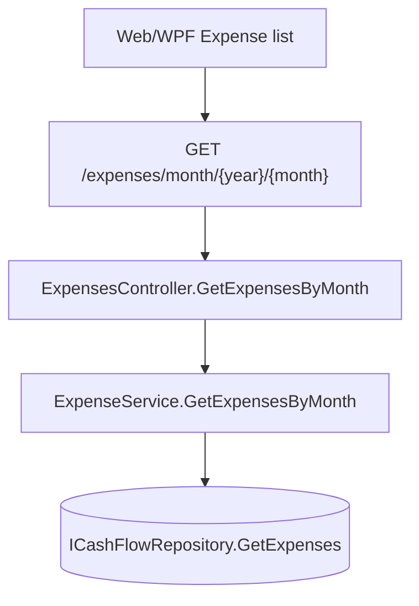

# Spec: F01. Exclude Unpaid Card Charges from Expense List

## 1. Technical Overview

**What:** Modify `ExpenseService.GetExpensesByMonth` (`Financial.CashFlow.Application/Services/ExpenseService.cs`) so it excludes expenses whose computed `PaymentStatus` is `CreditCardCharge` from the returned list.

**Why:** The query currently returns every expense in the month regardless of settlement state, so an unpaid credit card charge (a `CardTag` set, no `PaymentSource`, `SettledAt` null) is indistinguishable in the list from money that has actually left a bank account. `Expense.PaymentStatus` (`Financial.CashFlow.Domain/Entities/Expense.cs:22-25`) already computes the three-way state (`ImmediatePayment` / `CreditCardCharge` / `CreditCardSettled`) from the existing `CardTag`, `PaymentSource`, and `SettledAt` fields, and `CardStatementService.MarkStatementPaidAsync`/`UnmarkStatementPaidAsync` already flips that state via `Expense.Settle`/`Unsettle`. No new field, entity method, or migration is needed — only a predicate added to an existing LINQ query.

**Scope:**
- **Included:** filtering `GetExpensesByMonth` by `PaymentStatus != ExpensePaymentStatus.CreditCardCharge`.
- **Excluded:** `GetCategoryTotalsByMonth` (category-totals reporting fix is explicitly out of scope — PRD Section 7 "Reporting and category totals"); any change to `Expense`, `CardStatement`, `CardStatementService`, or the `card-statements` API; any UI change (Web `ExpenseSectionView`/hooks and WPF `ExpenseSectionView`/`MonthlyViewModel` already render whatever the API returns, unchanged).

## 2. Architecture Impact

**Affected components:**

| Component | Path | Change |
|---|---|---|
| `ExpenseService.GetExpensesByMonth` | `Financial.CashFlow.Application/Services/ExpenseService.cs` | Add a `PaymentStatus` predicate to the existing `Where` clause |

No new node is introduced — the change is entirely inside the existing `D` box (the filter predicate).

## 3. Technical Decisions

| Decision | Chosen Approach | Alternative Considered | Trade-off |
|---|---|---|---|
| Where to filter | Add the predicate to `ExpenseService.GetExpensesByMonth` (Application layer), so both the Web and WPF clients get the filtered list for free through the shared `ExpensesController` endpoint | Filtering client-side in each UI (Web `useMonthly`, WPF `MonthlyViewModel`) | Application-layer filtering is a single change point and can't drift between clients; client-side filtering would require duplicating the same `PaymentStatus` check twice and risks the two clients disagreeing |

## 4. Component Overview

**Backend:**

| File Path | New/Modified | Purpose | Key Responsibilities |
|---|---|---|---|
| `Financial.CashFlow.Application/Services/ExpenseService.cs` | Modified | Monthly expense query | Exclude expenses with `PaymentStatus == ExpensePaymentStatus.CreditCardCharge` from `GetExpensesByMonth`; `GetCategoryTotalsByMonth` and all other methods stay untouched |

**Tests:**

| File Path | New/Modified | Purpose |
|---|---|---|
| `Tests/Financial.CashFlow.Application.Tests/Services/ExpenseServiceTests.cs` | Modified | Unit-test the new filtering behavior directly against `ExpenseService` |
| `Tests/Financial.Api.Tests/ExpenseEndpointsTests.cs` | Modified | Integration-test the filtered behavior end-to-end through the `GET /expenses/month/{year}/{month}` endpoint, including the reappear-after-settle flow via the existing `card-statements` endpoints |

## 5. API Contracts

Skipped — trivial complexity, no request/response shape change. `GET /api/v1/financial/expenses/month/{year}/{month}` keeps its existing `ExpenseDTO[]` response shape; only which rows are included changes.

## 6. Data Model

Skipped — trivial complexity, no schema or entity change. `Expense.CardTag`, `Expense.PaymentSource`, `Expense.SettledAt`, and the computed `Expense.PaymentStatus` already exist and are unchanged.

## 7. Testing Strategy

**Test File Structure:**

| Test File | Test Type | Target | Coverage Goal |
|---|---|---|---|
| `Tests/Financial.CashFlow.Application.Tests/Services/ExpenseServiceTests.cs` | Unit | `ExpenseService.GetExpensesByMonth` | Every `PaymentStatus` branch (`ImmediatePayment`, `CreditCardCharge`, `CreditCardSettled`) covered |
| `Tests/Financial.Api.Tests/ExpenseEndpointsTests.cs` | Integration | `GET /expenses/month/{year}/{month}` combined with `POST /card-statements/{id}/mark-paid` and `/unmark-paid` | End-to-end exclude/reappear/re-exclude cycle through the real HTTP pipeline |

**Test functions (Application layer — traces to PRD F01 acceptance criteria 1, 2):**

| Test Function | Description | Assertions |
|---|---|---|
| `GetExpensesByMonth_UnsettledCreditCardCharge_IsExcluded` | Add an expense with `CardTag` set and no `PaymentSource` (unsettled charge) for the target month | Result does not contain the expense |
| `GetExpensesByMonth_ImmediatePayment_IsIncluded` | Add a bank-paid expense (no `CardTag`) for the target month | Result contains the expense |
| `GetExpensesByMonth_MixOfStatuses_OnlyExcludesUnsettledCharge` | Add one of each: immediate payment, unsettled card charge, and (via repository seeding) a settled card charge, all in the same month | Result contains exactly the immediate-payment and settled expenses; excludes only the unsettled charge |

**Test functions (API layer — traces to PRD F01 acceptance criteria 1, 2, 3, 4):**

| Test Function | Description | Assertions |
|---|---|---|
| `GetExpensesByMonth_UnpaidCardCharge_IsExcludedFromResponse` | POST an expense with a `CardTag` and no `PaymentSource` for a month, then GET the month's expense list | Response does not contain the card-charge expense |
| `GetExpensesByMonth_BankPaidExpense_StillIncludedInResponse` | POST a bank-paid expense for a month, then GET the month's list | Response contains the expense (regression guard — bank expenses behave as today, PRD acceptance criterion 2) |
| `GetExpensesByMonth_AfterMarkStatementPaid_CardChargeReappears` | POST a card-charge expense for a month, GET `/card-statements/{year}/{month}` to find its statement, POST `/card-statements/{id}/mark-paid` with a valid bank payment source, then GET the month's expense list again | Response now contains the expense, with no duplicate record created (single row, same `Id` as originally returned by the POST) |
| `GetExpensesByMonth_AfterUnmarkStatementPaid_CardChargeIsExcludedAgain` | Continue from the previous scenario: POST `/card-statements/{id}/unmark-paid`, then GET the month's expense list once more | Response no longer contains the expense |

These four API-layer scenarios map directly to the four acceptance criteria checkboxes under PRD Section 9 → "F01. Exclude Unpaid Card Charges from Expense List".
