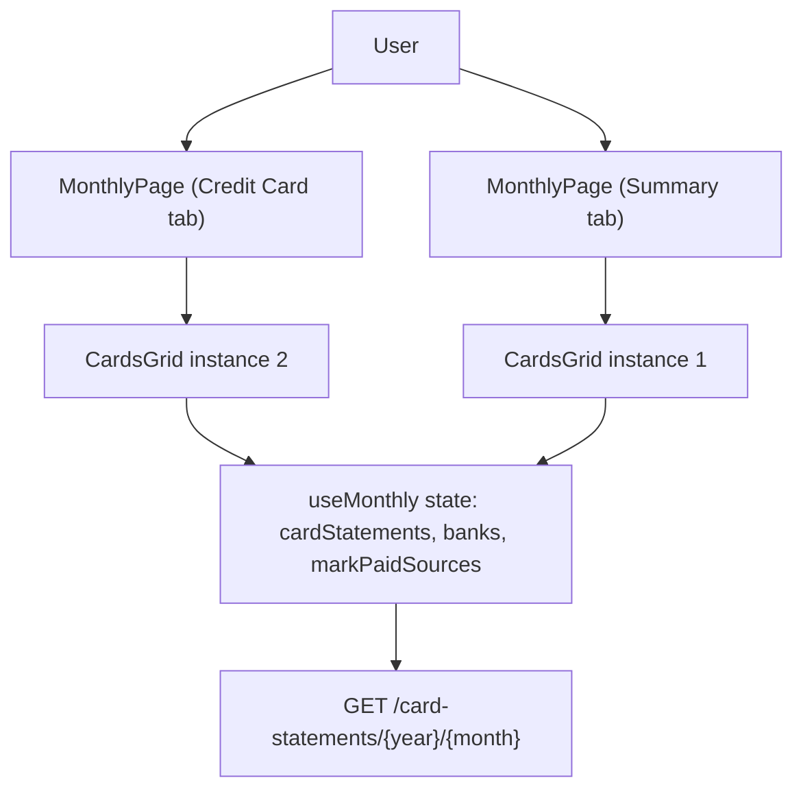

# Spec: F02. Web: Dedicated Credit Card Tab

**Complexity:** trivial

## 1. Technical Overview

**What:** Add a 5th tab ("Credit Card") to `MonthlyPage`'s tab strip, positioned immediately after "Expense", and render a second instance of the existing `CardsGrid` component inside it — reading from the exact same `useMonthly()` state (`cardStatements`, `banks`, `markPaidSources`, `markStatementPaid`, `unmarkStatementPaid`) that the Summary tab's `CardsGrid` instance already uses.

**Why:** `CardsGrid` (per-card outstanding totals with Mark Paid / Unmark Paid controls) already exists and is fully wired, but only inside the Summary tab, mixed in with category totals, bank balances, and incoming totals. This PRD explicitly requires Summary to stay unchanged while a focused "Credit Card" tab is added alongside it — so the correct move is to render `CardsGrid` a second time, not relocate it. Because both renderings read the same `useMonthly()` state object, they are trivially always in sync: no new data-fetching, no new hook, no new component.

**Scope:**

**Included:**
- New `card` entry in `MONTHLY_TABS`, positioned between `expense` and `incoming`, labeled "Credit Card".
- A second `<CardsGrid />` render, mounted under the new `activeTab === 'card'` block, with props identical to the existing Summary instance.
- Summary tab's existing `<CardsGrid />` render, JSX structure, and layout are untouched.

**Excluded (Out of Scope, per PRD Section 7):**
- Any change to `CardsGrid.tsx` itself (props, markup, styling).
- Any change to `useMonthly.ts`'s data fetching, state shape, or the `markStatementPaid`/`unmarkStatementPaid` cascade.
- Expense-level drill-down per statement, paid-invoice history, category-totals reporting fixes (deferred to future PRDs per PRD Section 7).
- Any WPF change (covered independently by F03).

## 2. Architecture Impact

**Affected components:**
- `Financial.Web/src/pages/MonthlyPage.tsx` — tab list + new tab render block (Modified)
- `Financial.Web/src/pages/__tests__/MonthlyPage.test.tsx` — tab-order and new-tab coverage (Modified)

No new node beyond the existing `useMonthly` → `CardsGrid` relationship — the diagram shows the same state object feeding two render sites.

## 3. Technical Decisions

| Decision | Chosen Approach | Alternative Considered | Trade-off |
|----------|----------------|----------------------|-----------|
| How to give the Credit Card tab its content | Render a second `<CardsGrid />` instance directly, passing the same props already destructured from `useMonthly()` in `MonthlyPage` | Extract a shared `<CreditCardSection>` wrapper component around `CardsGrid` | `CardsGrid` already is the entire content of the tab (no extra header/controls needed here, unlike the Bank tab's `BankOperationsSection`); an extra wrapper would be a pass-through component with no behavior of its own, which is unnecessary indirection for a single child (per `CLAUDE.md`'s no-over-engineering guidance) |
| Tab id naming | `'card'` (matches the PRD Capabilities wording: "`MONTHLY_TABS` gains a 5th entry (`card` / "Credit Card")") | `'creditCard'` | `'card'` is shorter and matches the existing `CardsGrid` component name; the visible label ("Credit Card") is what the user sees, so the internal id's exact spelling has no UX impact |
| Tab-switch-cancels-open-form behavior | Not extended to the `card` tab in `handleTabClick` | Add a no-op branch for symmetry | `CardsGrid` has no create/edit form to cancel (only inline Mark Paid controls tied to state, not an open/close form flow like Expense/Income/Bank) — an empty branch would be dead code |

## 4. Component Overview

**Frontend:**

| File Path | New/Modified | Purpose | Key Responsibilities |
|-----------|--------------|---------|---------------------|
| `Financial.Web/src/pages/MonthlyPage.tsx` | Modified | Page composition | Add `'card'` to the `MonthlyTabId` union and `MONTHLY_TABS` (after `'expense'`, before `'incoming'`); render `<CardsGrid />` a second time under `activeTab === 'card'`, with the same props as the Summary instance |
| `Financial.Web/src/pages/__tests__/MonthlyPage.test.tsx` | Modified | Test coverage | Update the tab-order assertion to include "Credit Card"; add coverage for the new tab's rendering and its shared-state sync with Summary |

**Backend:** No changes — Presentation layer only (PRD Section 7, deferred reporting/backend work is explicitly out of scope for this feature).

**Database:** No changes.

## 5. API Contracts

No new endpoints. F02 reuses the already-existing `GET /card-statements/{year}/{month}` call made once by `useMonthly()` (via `getCardStatementsByMonth`), whose result (`cardStatements`) is passed to both `CardsGrid` instances. `markCardStatementPaid` / `unmarkCardStatementPaid` (`POST /card-statements/{id}/mark-paid` / `/unmark-paid`) are likewise reused unchanged, callable from either tab's rendering of `CardsGrid`.

## 6. Data Model

No new database tables, columns, migrations, or DTOs. `CardStatementDto` and `BankDto` (`Financial.Web/src/api/types.ts`) are reused as-is.

## 7. Testing Strategy

| Test File | Test Type | Target | Coverage Goal |
|-----------|-----------|--------|---------------|
| `Financial.Web/src/pages/__tests__/MonthlyPage.test.tsx` | Integration | `MonthlyPage` | Tab presence/order, Credit Card tab content, Summary-tab regression guard, cross-tab state sync, no extra fetch on tab switch |

No changes needed to `Financial.Web/src/components/__tests__/CardsGrid.test.tsx` — the component itself is unchanged; its existing unit tests already cover rendering and the Mark Paid / Unmark Paid interactions regardless of which parent renders it.

**Key test functions/cases:**

| Test Function/Case | Description | Assertions |
|---|---|---|
| `lists Summary, Expense, Credit Card, Income, Bank in order in the tab strip` (updates the existing `lists Summary, Expense, Income, Bank...` test) | Tab strip order | `getAllByRole('button', {...}).map(b => b.textContent)` equals `['Summary', 'Expense', 'Credit Card', 'Income', 'Bank']` |
| `shows the same card statements on the Credit Card tab as on Summary` | New tab renders `CardsGrid` content | After clicking "Credit Card", the same card/outstanding/status rows from `CARD_STATEMENTS` (e.g. `BaAmex`, `ChaseMaster4023`) are present |
| `still renders the card statements on the Summary tab unchanged` (regression guard, extends the existing `defaults to the Summary tab...` test) | Summary tab keeps its `CardsGrid` | `BaAmex` cell and "Combined adjustment figure" text still present on Summary after this change |
| `does not refetch card statements when switching to the Credit Card tab` (extends the existing `does not refetch data when switching tabs` test) | No extra network call | `getCardStatementsByMonthMock.mock.calls.length` unchanged after clicking "Credit Card" |
| `marking a statement paid from the Credit Card tab updates the Summary tab's grid too` | Cross-tab sync via shared `useMonthly` state | From the Credit Card tab, pick a bank and click "Mark Paid" for the unpaid `BaAmex` row; after the mocked `markCardStatementPaid`/refetch resolves, switch to Summary and assert the same row now shows "Paid" |
| `marks Credit Card as the active tab button after clicking it` | Active-tab styling | `getByRole('button', {name: 'Credit Card'})` has `monthly-page__tab--active`; `Summary`/`Expense` do not |
