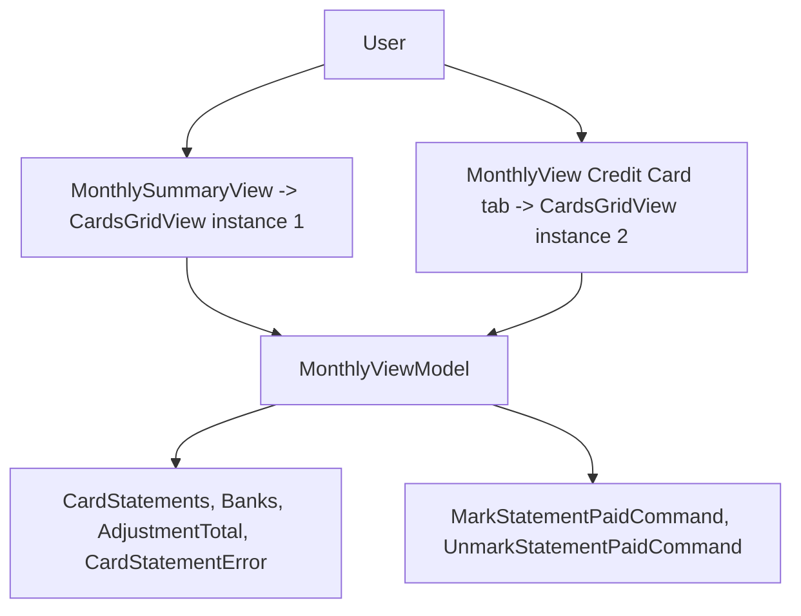

# Spec: F03. WPF: Dedicated Credit Card Tab

**Complexity:** trivial

## 1. Technical Overview

**What:** Add a 5th `TabItem` ("Credit Card") to `MonthlyView.xaml`'s `TabControl`, positioned immediately after "Expense", hosting a second instance of the existing `CardsGridView` user control. `CardsGridView` already binds directly to `MonthlyViewModel` (inherited `DataContext`, no explicit binding needed) via `CardStatements`, `Banks`, `AdjustmentTotal`, `CardStatementError`, `MarkStatementPaidCommand`, and `UnmarkStatementPaidCommand` — all of which already exist and are populated today for the Summary tab's instance.

**Why:** This is the WPF counterpart to F02 (Web). `CardsGridView` is fully built and wired (per-card outstanding totals, Mark Paid / Unmark Paid) but only reachable inside the Summary tab, mixed with `CategoryTotals`, `BanksGridView`, and `IncomeTotalsGridView`. The PRD requires Summary to stay unchanged while a focused "Credit Card" tab is added — so, exactly like F02, the correct move is a second rendering of the existing view, not a relocation. Because WPF resolves `{Binding}` against the inherited `DataContext` (the single `MonthlyViewModel` instance owned by `MonthlyView`), both `CardsGridView` instances read and write the exact same view-model state and are trivially always in sync — no ViewModel change of any kind is required.

**Scope:**

**Included:**
- New `TabItem Header="Credit Card"` in `MonthlyView.xaml`, positioned between "Expense" and "Income", hosting `<local:CardsGridView/>`.
- Summary tab's existing `<local:CardsGridView/>` reference inside `MonthlySummaryView.xaml` is untouched.

**Excluded (Out of Scope, per PRD Section 7):**
- Any change to `CardsGridView.xaml`/`.xaml.cs` (markup, bindings, code-behind) — the existing type is reused verbatim.
- Any change to `MonthlyViewModel.cs` — no new property, command, or field is needed since every binding `CardsGridView` uses is already populated for the Summary tab today.
- Expense-level drill-down per statement, paid-invoice history, category-totals reporting fixes (deferred to future PRDs per PRD Section 7).
- Any Web change (covered independently by F02, already shipped — F02 and F03 share zero code, matching the project's established Web/WPF split, e.g. P22-F01/F02).

## 2. Architecture Impact

**Affected components** (all within `Financial.App`, the WPF Presentation project — no other layer changes):
- `Financial.App/Views/CashFlow/MonthlyView.xaml` — add the 5th `TabItem` (Modified)

No new node beyond the existing `MonthlyViewModel` → `CardsGridView` relationship — both tab instances inherit the same `DataContext`.

## 3. Technical Decisions

| Decision | Chosen Approach | Alternative Considered | Trade-off |
|---|---|---|---|
| How to give the Credit Card tab its content | Reference `<local:CardsGridView/>` directly as the new `TabItem`'s content, no wrapper view | A new `CreditCardTabView.xaml` wrapping `CardsGridView` (mirroring `BankSectionView`'s pattern for the Bank tab) | Unlike the Bank tab, this tab needs zero extra controls, buttons, or filters around the grid — `CardsGridView` already is the entire desired content, and its own root `Grid` already carries the `Margin="0,12,0,0"` top-spacing every other tab's root view uses, so an extra pass-through wrapper would add a file with no behavior of its own (`CLAUDE.md`'s no-over-engineering guidance); mirrors the identical decision already made for F02 (Web) |
| ViewModel changes | None — reuse every existing `MonthlyViewModel` member `CardsGridView` already binds to | Extend `MonthlyViewModel` with Credit-Card-tab-specific state | There is no new data or behavior to expose; the second view instance reads the identical `CardStatements`/`Banks`/`AdjustmentTotal` state and invokes the identical commands the Summary instance already uses today |
| Tab position | Between "Expense" and "Income" (matches F02's Web tab order: Summary, Expense, Credit Card, Income, Bank) | End of the tab strip (after "Bank") | PRD F03 explicitly requires this exact order, matching F02 for consistency between the two clients |

## 4. Component Overview

**Presentation (`Financial.App`):**

| File Path | New/Modified | Purpose | Key Responsibilities |
|---|---|---|---|
| `Financial.App/Views/CashFlow/MonthlyView.xaml` | Modified | Monthly tab strip | Add `TabItem Header="Credit Card"` after "Expense", before "Income", hosting a second `<local:CardsGridView/>` |

No other file changes. `CardsGridView.xaml`/`.xaml.cs` and `MonthlyViewModel.cs` are reused completely unmodified.

## 5. Service Contracts Reused (No New API)

None introduced. `CardsGridView`'s bindings resolve against `MonthlyViewModel`'s already-existing `CardStatements`, `Banks`, `AdjustmentTotal`, `CardStatementError`, `MarkStatementPaidCommand`, and `UnmarkStatementPaidCommand` — all populated by the same `RefreshAsync` call the Summary tab already relies on. No new call to `ICardStatementService` or any other interface.

## 6. Data Model

Not applicable — no database, migration, or persisted schema changes, and no new in-memory view-model types (unlike F02's WPF sibling precedent P22-F02, this feature adds zero new C# types).

## 7. Testing Strategy

Consistent with this codebase's existing convention (`Tests/Financial.Presentation.Tests`) and the precedent set by the previous WPF tab addition (P22-F02, "WPF Bank Operations Tab"): only ViewModels and validators are unit-tested — there is no WPF UI-automation harness in this repo, so `.xaml` layout changes (tab addition) are verified manually during implementation rather than by an automated test.

No new or modified test file is required for this feature: `MonthlyViewModel` is not touched, so its existing test coverage (`Tests/Financial.Presentation.Tests/ViewModels/CashFlow/MonthlyViewModelTests.cs` and any Card-related test cases within it) already fully covers `CardStatements`/`MarkStatementPaidCommand`/`UnmarkStatementPaidCommand` behavior, and continuing to pass unmodified is itself the regression guard proving the second `CardsGridView` instance has nothing new to break.

**Manual verification checklist (performed during implementation, per the P22-F02 precedent):**

| Check | Expected Result |
|---|---|
| Launch the app, open Monthly, observe the tab strip | Order is Summary, Expense, Credit Card, Income, Bank |
| Click the "Credit Card" tab | Same per-card rows, outstanding totals, and Mark Paid/Unmark Paid controls as the Summary tab's grid, for the selected month |
| Click "Summary" | Its `CardsGridView` still renders exactly as before — no visual or behavioral change |
| Pick a bank and click "Mark Paid" from the Credit Card tab, then switch to Summary | Summary's grid reflects the same now-paid status (both instances share `MonthlyViewModel` state, refreshed via the same `RefreshAsync` call `MarkStatementPaidCommand` already triggers) |

**Acceptance-criteria traceability (PRD Section 9, F03):** every checkbox in the F03 list maps to a manual-verification row above, since the entire feature is a `.xaml` tab addition with no new or changed C# logic to unit-test — consistent with how P22-F02's tab-presence/layout criteria were traced to manual verification rather than automated tests.

## Assumptions / Decisions

| # | Decision | Detail |
|---|---|---|
| A1 | No `TabControl.SelectionChanged` handling added for the Credit Card tab | `CardsGridView` has no open create/edit form to cancel on tab switch (only inline Mark Paid controls tied to persistent state), matching the same reasoning already applied to the Bank tab in P22-F02 (Assumption A3) — no existing WPF pattern in this codebase cancels forms on tab switch, and there is no form here regardless |
