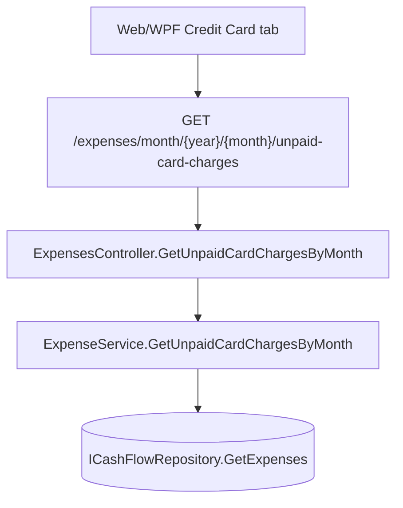

# Spec: F04. Backend: Expose Unpaid Card Charge Expenses

**Complexity:** simple

## 1. Technical Overview

**What:** Add a new read-only query — `IExpenseService.GetUnpaidCardChargesByMonth(year, month)` — and its API endpoint, returning every expense for a given month whose computed `PaymentStatus` is `CreditCardCharge`. This is the exact inverse of the filter F01 added to `GetExpensesByMonth` (which excludes these same expenses).

**Why:** F01 made unpaid credit card charges invisible to the normal Expense list. Nothing currently exposes them as individual line items — `CardStatementDTO` (returned by `GET /card-statements/{year}/{month}`) only carries an aggregate `OutstandingTotal` per card, not the underlying expenses. F05 (Web) and F06 (WPF) need a data source to render "what makes up this total" as a flat list in the Credit Card tab, so this feature adds exactly that: a mirror-image query and endpoint, reusing the existing `ExpenseDTO` shape unchanged.

**Scope:**

**Included:**
- `ExpenseService.GetUnpaidCardChargesByMonth(int year, int month)`: same date-scoping as `GetExpensesByMonth`, filtered to `PaymentStatus == ExpensePaymentStatus.CreditCardCharge`, same descending-by-date ordering, reusing the existing private `ToDto` mapper (same `ExpenseDTO` shape `GetExpensesByMonth` already returns — no new DTO).
- New endpoint `GET /expenses/month/{year}/{month}/unpaid-card-charges` on `ExpensesController`, returning `IReadOnlyList<ExpenseDTO>`.

**Excluded (Out of Scope, per PRD Section 7):**
- Any write operation — editing/deleting an unpaid card charge already works via the existing `PUT`/`DELETE /expenses/{id}` endpoints, unaffected by payment status.
- Any change to `GetExpensesByMonth`, `GetCategoryTotalsByMonth`, `Expense`, `CardStatement`, or the settlement cascade.
- Grouping the result by card or by statement — this returns one flat list across all cards; per-statement grouping is out of scope for the whole PRD (Section 7).
- Any Web/WPF UI change — covered independently by F05/F06, which consume this endpoint.

## 2. Architecture Impact

**Affected components:**
- `Financial.CashFlow.Application/Interfaces/IExpenseService.cs` — new method signature (Modified)
- `Financial.CashFlow.Application/Services/ExpenseService.cs` — new method implementation (Modified)
- `Financial.Api/Controllers/ExpensesController.cs` — new endpoint (Modified)



## 3. Technical Decisions

| Decision | Chosen Approach | Alternative Considered | Trade-off |
|----------|----------------|----------------------|-----------|
| Where the query lives | New method on `IExpenseService`/`ExpenseService`, alongside `GetExpensesByMonth` | New method on `ICardStatementService`, grouped per statement | The PRD explicitly wants a flat, all-cards-together list (not grouped by statement — that's out of scope), so this is fundamentally an `Expense` query with a `PaymentStatus` filter, exactly mirroring `GetExpensesByMonth`'s existing shape; keeping it on `ExpenseService` avoids `CardStatementService` taking on a responsibility (flat expense listing) that isn't about statements |
| Response shape | Reuse the existing `ExpenseDTO` unchanged | A new, narrower DTO (e.g. only Date/Description/Value/Category/CardTag) | `ExpenseDTO` already carries every field F05/F06 need (including `Id` for edit/delete `CommandParameter`/route param) plus fields they don't (e.g. `SuggestedRoundUpAmount`, always `null` for a card charge) — introducing a second DTO for the same entity shape would be needless duplication for a single-user app (`CLAUDE.md`'s no-over-engineering guidance) |
| Endpoint route | `GET /expenses/month/{year}/{month}/unpaid-card-charges`, nested under the existing `expenses` resource | A new top-level route/controller | Matches the existing sibling route `GET /expenses/month/{year}/{month}/category-totals` — same resource, same year/month scoping pattern, no new controller needed |

## 4. Component Overview

**Backend:**

| File Path | New/Modified | Purpose | Key Responsibilities |
|---|---|---|---|
| `Financial.CashFlow.Application/Interfaces/IExpenseService.cs` | Modified | Service contract | Add `IReadOnlyList<ExpenseDTO> GetUnpaidCardChargesByMonth(int year, int month)` |
| `Financial.CashFlow.Application/Services/ExpenseService.cs` | Modified | Monthly expense queries | Implement the new method: same `Where(Date.Year/Month)` scoping as `GetExpensesByMonth`, add `.Where(e => e.PaymentStatus == ExpensePaymentStatus.CreditCardCharge)`, same `OrderByDescending(Date)`, reuse the existing private `ToDto` |
| `Financial.Api/Controllers/ExpensesController.cs` | Modified | HTTP surface | Add `[HttpGet("month/{year:int}/{month:int}/unpaid-card-charges")]` calling the new service method |

**Tests:**

| File Path | New/Modified | Purpose |
|---|---|---|
| `Tests/Financial.CashFlow.Application.Tests/Services/ExpenseServiceTests.cs` | Modified | Unit-test the new method directly against `ExpenseService` |
| `Tests/Financial.Api.Tests/ExpenseEndpointsTests.cs` | Modified | Integration-test the new endpoint end-to-end |

**Database:** No changes.

## 5. API Contracts

**Endpoint: List Unpaid Card Charges for a Month**
- **Method:** GET
- **Path:** `/api/v1/financial/expenses/month/{year}/{month}/unpaid-card-charges`
- **Authentication:** None (matches every other endpoint in this single-user app)

**Request:**

| Field | Type | Required | Validation | Description |
|-------|------|----------|------------|--------------|
| `year` | `int` (route) | Yes | — | Calendar year |
| `month` | `int` (route) | Yes | 1–12 (route constraint `{month:int}`, same as sibling endpoints — no additional range validation, matching existing `GetExpensesByMonth`) | Calendar month |

**Response (200 OK):** `ExpenseDTO[]` — identical shape to `GET /expenses/month/{year}/{month}`, filtered to unpaid card charges only.

**Response Example:**
```json
[
  {
    "id": "3fa85f64-5717-4562-b3fc-2c963f66afa6",
    "date": "2026-07-10",
    "description": "Card charge",
    "value": 45.00,
    "category": "Mercado",
    "paymentSource": null,
    "cardTag": "BarclaysPlatinumVisa8003",
    "settledAt": null,
    "paymentStatus": "CreditCardCharge",
    "roundUpAmount": null,
    "suggestedRoundUpAmount": null
  }
]
```

No error responses beyond the framework default (malformed route parameters) — same as the existing `GetExpensesByMonth`/`GetCategoryTotalsByMonth` siblings, which have no `[ProducesResponseType]` beyond 200 OK.

## 6. Data Model

No new database tables, columns, migrations, or DTOs. Reuses `Expense`'s existing `PaymentStatus` computed property and the existing `ExpenseDTO`.

## 7. Testing Strategy

| Test File | Test Type | Target | Coverage Goal |
|---|---|---|---|
| `Tests/Financial.CashFlow.Application.Tests/Services/ExpenseServiceTests.cs` | Unit | `ExpenseService.GetUnpaidCardChargesByMonth` | Correct inclusion/exclusion per `PaymentStatus`, correct month scoping |
| `Tests/Financial.Api.Tests/ExpenseEndpointsTests.cs` | Integration | `GET /expenses/month/{year}/{month}/unpaid-card-charges` | End-to-end shape and filtering through the real HTTP pipeline |

**Test functions (Application layer):**

| Test Function | Description | Assertions |
|---|---|---|
| `GetUnpaidCardChargesByMonth_UnsettledCharge_IsIncluded` | Add a card-tagged expense with no `PaymentSource` (unsettled charge) | Result contains it |
| `GetUnpaidCardChargesByMonth_ImmediatePaymentAndSettledCharge_AreExcluded` | Add one bank-paid expense and one settled card charge (via `Expense.Settle`, mirroring the pattern already used in `ExpenseServiceTests`) in the same month | Result excludes both, contains only the unsettled charge |
| `GetUnpaidCardChargesByMonth_OutsideMonth_IsExcluded` | Add an unsettled charge dated in a different month | Result for the target month excludes it |

**Test functions (API layer — traces to PRD F04 acceptance criteria):**

| Test Function | Description | Assertions |
|---|---|---|
| `GetUnpaidCardChargesByMonth_ReturnsOnlyUnsettledCardCharges` | POST one bank-paid expense and one card-tagged (unsettled) expense for the same month, GET the new endpoint | Response contains only the card-charge expense, with its `cardTag`, `date`, `description`, `value`, `category` |
| `GetUnpaidCardChargesByMonth_AfterMarkStatementPaid_ExcludesSettledCharge` | POST a card-charge expense, mark its statement paid via the existing `card-statements` endpoints, GET the new endpoint again | Response no longer contains that expense (now `CreditCardSettled`, matching F01's reappear-in-normal-list behavior) |
