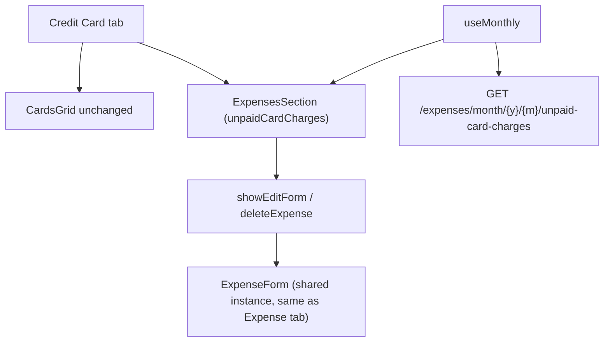

# Spec: F05. Web: Show Unpaid Card Expenses in Credit Card Tab

**Complexity:** simple

## 1. Technical Overview

**What:** Fetch F04's new `unpaid-card-charges` endpoint alongside `useMonthly`'s existing month-scoped fetches, and render the result as a second, reused `ExpensesSection` list under the Credit Card tab, below the existing `CardsGrid`. Edit and Delete reuse the exact same `showEditForm`/`deleteExpense` handlers and `ExpenseForm` already wired for the Expense tab — both operate on an expense by its `ExpenseDto`/`id`, with no dependency on which list it came from.

**Why:** F01 hid unpaid card charges from the Expense list; F02 added a Credit Card tab but only showed per-card totals. Nothing in the UI shows the actual line items anymore, and there's no way to edit or delete one. `useMonthly`'s edit/delete plumbing is already generic (`showEditForm(expense: ExpenseDto)`, `deleteExpense(id: string)`) and `ExpensesSection` already renders a `Card` column (`expense.cardTag ?? '—'`) — so this feature is almost entirely wiring, not new UI.

**Scope:**

**Included:**
- `getUnpaidCardChargesByMonth(year, month)` added to `FinancialApiClient`, calling F04's `GET /expenses/month/{year}/{month}/unpaid-card-charges`.
- `useMonthly` fetches it alongside its existing `Promise.all` calls, stores it as `unpaidCardCharges: ExpenseDto[]`, and re-fetches it on every `RETRY` (mark-paid/unmark-paid, save, delete) exactly like `expenses`/`cardStatements` already do.
- Credit Card tab renders `<ExpensesSection expenses={unpaidCardCharges} .../>` below the existing `CardsGrid`, reusing `showEditForm`/`deleteExpense`/`showCreateForm` unchanged.
- The existing create/edit `ExpenseForm` (shown when `isFormVisible`) is also rendered under the Credit Card tab, so editing a row there opens the form in place — identical block to the Expense tab's, extracted into one shared JSX value to avoid duplicating the same 20+ lines twice.
- Tab-switch-cancels-open-form behavior (`handleTabClick`) extended to fire when leaving the Credit Card tab too, matching the existing Expense tab behavior.

**Excluded (Out of Scope, per PRD Section 7):**
- Grouping the list by card/statement — one flat list across all cards, per the PRD's explicit choice.
- Any change to `ExpensesSection`, `ExpenseForm`, `CardsGrid`, or their existing props/markup.
- Any WPF change — covered independently by F06.

## 2. Architecture Impact

**Affected components:**
- `Financial.Web/src/api/financialApiClient.ts` — new client method (Modified)
- `Financial.Web/src/hooks/useMonthly.ts` — new fetch, state field, exposed value (Modified)
- `Financial.Web/src/pages/MonthlyPage.tsx` — render the list + form under the Credit Card tab (Modified)



## 3. Technical Decisions

| Decision | Chosen Approach | Alternative Considered | Trade-off |
|----------|----------------|----------------------|-----------|
| Edit/delete wiring | Reuse `showEditForm`/`deleteExpense`/`ExpenseForm` verbatim | A second, Credit-Card-tab-scoped edit form/state | `showEditForm` already takes a full `ExpenseDto` (not an id looked up from `state.expenses`) and `deleteExpense` already takes a bare `id` — both are already list-agnostic, so a second copy would duplicate working logic for no behavioral gain (`CLAUDE.md`'s no-over-engineering guidance) |
| Form JSX duplication | Extract the `{isFormVisible && <ExpenseForm ... />}` block into one local JSX value, rendered under both the Expense and Credit Card tab blocks | Copy-paste the same ~20-line block into the Credit Card tab | Avoids duplicating the same props wiring twice in one file while keeping the two tabs' conditional-render structure otherwise identical |
| New Expense button on the Credit Card tab's list | Keep `ExpensesSection`'s built-in "New Expense" button wired to the same `showCreateForm` as the Expense tab (no prop changes) | Fork `ExpensesSection` into a variant without the button | `ExpensesSection` isn't being changed at all (see Section 1); hiding the button would require a new prop/variant for a capability the PRD doesn't ask to remove, and creating an expense from either tab already behaves identically today |

## 4. Component Overview

**Frontend:**

| File Path | New/Modified | Purpose | Key Responsibilities |
|---|---|---|---|
| `Financial.Web/src/api/financialApiClient.ts` | Modified | API client | Add `getUnpaidCardChargesByMonth(year, month): Promise<ExpenseDto[]>` calling `GET /expenses/month/{year}/{month}/unpaid-card-charges`, same pattern as `getExpensesByMonth` |
| `Financial.Web/src/hooks/useMonthly.ts` | Modified | Monthly state/data hook | Add `unpaidCardCharges: ExpenseDto[]` to state and `FETCH_SUCCESS` payload; add the new client call to the existing `Promise.all` fetch (and therefore to every `RETRY`); expose `unpaidCardCharges` on the returned `MonthlyData` |
| `Financial.Web/src/pages/MonthlyPage.tsx` | Modified | Page composition | Render `<ExpensesSection expenses={unpaidCardCharges} onEdit={showEditForm} onDelete={deleteExpense} onNewExpense={showCreateForm} />` under `activeTab === 'card'`, below the existing `CardsGrid`; render the shared create/edit form JSX under both the Expense and Credit Card tab blocks; extend `handleTabClick`'s form-cancel-on-tab-switch condition to include `'card'` |

**Backend:** No changes — this feature only consumes F04's already-implemented endpoint.

**Database:** No changes.

## 5. API Contracts

Consumes the endpoint F04 already implemented — no new backend work.

| Method | Path | Used By | Purpose |
|--------|------|---------|---------|
| GET | `/expenses/month/{year}/{month}/unpaid-card-charges` | `useMonthly` (new caller) | Every unsettled credit-card-charge expense for the month, across all cards |

**Response Example** (identical `ExpenseDto[]` shape to the existing `getExpensesByMonth`):
```json
[
  {
    "id": "3fa85f64-5717-4562-b3fc-2c963f66afa6",
    "date": "2026-07-10",
    "description": "Card charge",
    "value": 45.00,
    "category": "Mercado",
    "paymentSource": null,
    "cardTag": "BarclaysPlatinumVisa8003",
    "settledAt": null,
    "paymentStatus": "CreditCardCharge",
    "roundUpAmount": null,
    "suggestedRoundUpAmount": null
  }
]
```

`PUT /expenses/{id}` and `DELETE /expenses/{id}` (already consumed by `useMonthly`'s `saveEdit`/`deleteExpense`) are reused unchanged for editing/deleting rows in this list.

## 6. Data Model

No new database tables, columns, migrations, or DTOs. `ExpenseDto` (`Financial.Web/src/api/types.ts`) is reused as-is.

## 7. Testing Strategy

**Cross-Feature Integration:** PRD Section 9 requires a test proving F04's data (date, description, value, category, card tag) is correctly received and rendered by F05's list — covered below.

| Test File | Test Type | Target | Coverage Goal |
|-----------|-----------|--------|---------------|
| `Financial.Web/src/pages/__tests__/MonthlyPage.test.tsx` | Integration | `MonthlyPage` | Credit Card tab's expense list rendering, edit/delete wiring, cross-tab form-cancel, no regression to the Expense tab |

No changes needed to `Financial.Web/src/components/__tests__/ExpensesSection.test.tsx` — the component itself is unchanged; its existing tests already cover row rendering and edit/delete callbacks regardless of which parent supplies the `expenses` array.

**Key test functions/cases:**

| Test Function/Case | Description | Assertions |
|---|---|---|
| `shows the unpaid card charge list on the Credit Card tab below the totals grid` | New list renders with F04's data | After clicking "Credit Card", a row with the mocked unpaid charge's description/value/category/card tag is present, below the `CardsGrid` table (traces to PRD Cross-Feature Integration: F04 → F05) |
| `editing a row from the Credit Card tab's list opens the shared edit form and saves` | Edit wiring reuse | Clicking the row's edit icon opens `ExpenseForm` pre-filled; saving calls `updateExpense` with that row's id |
| `deleting a row from the Credit Card tab's list calls delete and refreshes` | Delete wiring reuse | Clicking the row's delete icon (after `window.confirm`) calls `deleteExpense`; the unpaid-card-charges fetch is re-triggered |
| `switching away from the Credit Card tab cancels an open edit form` | Tab-switch-cancels-form, extended | Mirrors the existing Expense-tab test: open edit from the Credit Card list, switch tabs, form is gone |
| `does not duplicate or omit rows already covered by the Expense tab` (regression guard) | F01/F05 boundary | An immediate-payment expense appears only in the Expense tab's list; an unpaid card charge appears only in the Credit Card tab's list, never both |
