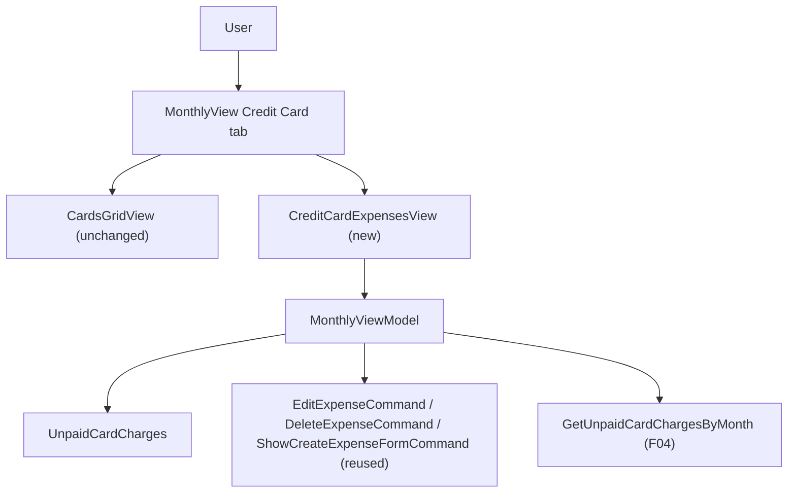

# Spec: F06. WPF: Show Unpaid Card Expenses in Credit Card Tab

**Complexity:** simple

## 1. Technical Overview

**What:** Add `MonthlyViewModel.UnpaidCardCharges` (fetched via F04's `IExpenseService.GetUnpaidCardChargesByMonth`, added to the existing `RefreshAsync` pass) and a new `CreditCardExpensesView` — a near-duplicate of `ExpenseSectionView`'s markup bound to this new collection instead of `Expenses` — placed below `CardsGridView` in the Credit Card tab. Edit and Delete reuse `EditExpenseCommand`/`DeleteExpenseCommand`/`ShowCreateExpenseFormCommand` verbatim: both already take the `ExpenseDTO` passed via `CommandParameter="{Binding}"`, with no dependency on which collection the row came from.

**Why:** This is the WPF counterpart to F05 (Web). F01 hid unpaid card charges from the Expense tab; F03 added a Credit Card tab but only the per-card totals grid. `MonthlyViewModel`'s expense edit/delete commands are already list-agnostic (`ShowEditExpenseForm(ExpenseDTO?)`, `DeleteExpenseAsync(ExpenseDTO?)`), and `ExpenseSectionView`'s `DataGrid` already has a `Card` column (`CardTag`) — so, like F05, this is mostly wiring plus one small, focused new view, matching this codebase's established "one dedicated view per tab section" convention (`ExpenseSectionView`, `IncomeSectionView`, `BankSectionView`, `CardsGridView` are each their own file).

**Scope:**

**Included:**
- `MonthlyViewModel.UnpaidCardCharges`: `ObservableCollection<ExpenseDTO>`, populated in `RefreshAsync` from `_expenseService.GetUnpaidCardChargesByMonth(year, month)`, refreshed on every `RefreshAsync` call exactly like `Expenses` already is.
- New `Financial.App/Views/CashFlow/CreditCardExpensesView.xaml` (+ `.xaml.cs`): New Expense button, the existing `ExpenseFormView` (shared, same `IsExpenseFormOpen` visibility binding), the `DeletingExpenseError` text, and a `DataGrid` bound to `UnpaidCardCharges` with the same Edit/Delete/Date/Description/Category/Value/PaymentSource/Card columns as `ExpenseSectionView`'s grid.
- `MonthlyView.xaml`'s Credit Card `TabItem` content becomes a two-row `Grid`: `CardsGridView` (Auto row, unchanged) above `CreditCardExpensesView` (star row, new).

**Excluded (Out of Scope, per PRD Section 7):**
- Grouping the list by card/statement — one flat list across all cards, per the PRD's explicit choice (matches F05).
- Any change to `ExpenseSectionView`, `ExpenseFormView`, `CardsGridView`, or their existing bindings/commands.
- Any change to `IExpenseService`/`ICardStatementService` or the API — F04 already exposes everything needed.
- Any Web change — covered independently by F05 (already shipped).

## 2. Architecture Impact

**Affected components** (all within `Financial.App`, the WPF Presentation project — no other layer changes):
- `Financial.App/Views/CashFlow/MonthlyView.xaml` — Credit Card tab content becomes a 2-row Grid (Modified)
- `Financial.App/Views/CashFlow/CreditCardExpensesView.xaml` (+ `.xaml.cs`) — new unpaid-charges list view (New)
- `Financial.App/ViewModels/CashFlow/MonthlyViewModel.cs` — new `UnpaidCardCharges` collection + `RefreshAsync` fetch (Modified)

## 3. Technical Decisions

| Decision | Chosen Approach | Alternative Considered | Trade-off |
|----------|----------------|----------------------|-----------|
| New view vs. parameterizing `ExpenseSectionView` | Create `CreditCardExpensesView.xaml` as a focused near-duplicate of `ExpenseSectionView`'s markup, bound to `UnpaidCardCharges` | Add a bindable `ItemsSource` dependency property to `ExpenseSectionView` and reuse it in both places | No existing view in this codebase is parameterized via a custom dependency property — every tab section is its own small, directly-bound view (mirrors the exact reasoning already applied for F03's `CardsGridView` duplication and F05's Web `ExpensesSection` reuse-as-is decision); a DP-based reusable view would be new infrastructure this app's scale doesn't need (`CLAUDE.md`'s no-over-engineering guidance) |
| Edit/delete/create wiring | Reuse `EditExpenseCommand`, `DeleteExpenseCommand`, `ShowCreateExpenseFormCommand`, and `ExpenseFormView` verbatim | A second set of Credit-Card-tab-scoped commands/form | All three commands already operate on the `ExpenseDTO`/nothing passed via `CommandParameter`/no parameter at all — none look up state from the `Expenses` collection by id — so a second copy would duplicate working, list-agnostic logic for no behavioral gain |
| Credit Card tab layout | Two-row `Grid` (`CardsGridView` Auto, `CreditCardExpensesView` `*`) directly in `MonthlyView.xaml`'s `TabItem`, matching how `MonthlySummaryView.xaml` already composes multiple child views via `Grid` | Wrap both in a further nested view | `MonthlyView.xaml`'s existing role is thin tab composition (each `TabItem` hosts one or more child views directly) — adding one more composition point is consistent, not a new pattern |

## 4. Component Overview

**Presentation (`Financial.App`):**

| File Path | New/Modified | Purpose | Key Responsibilities |
|---|---|---|---|
| `Financial.App/Views/CashFlow/MonthlyView.xaml` | Modified | Monthly tab strip | Credit Card `TabItem` content becomes a 2-row `Grid` hosting `CardsGridView` (Auto) then `CreditCardExpensesView` (`*`) |
| `Financial.App/Views/CashFlow/CreditCardExpensesView.xaml` | New | Credit Card tab's expense list | New Expense button (`ShowCreateExpenseFormCommand`), `ExpenseFormView` (shared, `IsExpenseFormOpen`), `DeletingExpenseError` text, `DataGrid` on `UnpaidCardCharges` with Edit/Delete (`EditExpenseCommand`/`DeleteExpenseCommand`) + Date/Description/Category/Value/PaymentSource/Card columns |
| `Financial.App/Views/CashFlow/CreditCardExpensesView.xaml.cs` | New | Code-behind | `InitializeComponent()` only, mirroring `ExpenseSectionView.xaml.cs` |
| `Financial.App/ViewModels/CashFlow/MonthlyViewModel.cs` | Modified | Shared Monthly VM | Add `ObservableCollection<ExpenseDTO> UnpaidCardCharges { get; } = [];`; in `RefreshAsync`, fetch `_expenseService.GetUnpaidCardChargesByMonth(year, month)` alongside the existing `GetExpensesByMonth` call and `ReplaceAll(UnpaidCardCharges, unpaidCardCharges)` |

## 5. Service Contracts Reused (No New API)

None introduced. Consumes `IExpenseService.GetUnpaidCardChargesByMonth` — added to the interface by F04 (already merged) — plus the already-existing `AddExpenseAsync`/`UpdateExpenseAsync`/`DeleteExpenseAsync`, all unchanged.

## 6. Data Model

Not applicable — no database, migration, or persisted schema changes, and no new C# types (`ExpenseDTO` is reused as-is, same as F04/F05).

## 7. Testing Strategy

Consistent with this codebase's existing convention (`Tests/Financial.Presentation.Tests`) and the precedent set by F03 (WPF Credit Card tab, P24): ViewModel behavior is unit-tested; `.xaml` layout (the new view's markup, the tab's 2-row grid) is verified manually during implementation, since there is no WPF UI-automation harness in this repo.

| Test File | Test Type | Target | Coverage Goal |
|---|---|---|---|
| `Tests/Financial.Presentation.Tests/ViewModels/CashFlow/MonthlyViewModelTests.cs` | Unit | `MonthlyViewModel.UnpaidCardCharges` + refresh/edit/delete reuse | New behavior introduced by this feature |

**Test functions:**

| Test Function | Description | Assertions |
|---|---|---|
| `RefreshAsync_PopulatesUnpaidCardCharges` | `StubExpenseService.UnpaidCardCharges` seeded with one entry | `viewModel.UnpaidCardCharges` contains that entry after `RefreshAsync()` |
| `ChangingYearOrMonth_RefetchesUnpaidCardCharges` | Change `Year`, call `RefreshAsync()` again | `expenses.GetUnpaidCardChargesByMonthCallCount` increases (mirrors the existing `ChangingYearOrMonth_RefetchesAllFour` pattern for `Expenses`) |
| `EditExpenseCommand_FromUnpaidCardCharges_OpensFormPrefilled` | `EditExpenseCommand.Execute(unpaidCharge)` where `unpaidCharge` came from `UnpaidCardCharges`, not `Expenses` | `IsExpenseFormOpen` true, form fields match the charge, `IsEditingExpense` true — proves the command doesn't require the row to exist in `Expenses` |
| `DeleteExpenseCommand_FromUnpaidCardCharges_ConfirmedCallsDeleteAndRefreshes` | `DeleteExpenseCommand.Execute(unpaidCharge)`, confirm true | `StubExpenseService`'s delete is called with that id, `RefreshAsync` re-runs (both `Expenses` and `UnpaidCardCharges` refetch counts increase) |

**Manual verification checklist (performed during implementation, per the P22-F02/P24-F03 precedent):**

| Check | Expected Result |
|---|---|
| Open Monthly → Credit Card tab | Per-card totals grid on top, unpaid card charges list below it, same columns as the Expense tab plus Card |
| Click "New Expense" from this list | Same form as the Expense tab opens; saving a card-tagged expense makes it appear in this list (and nowhere in the Expense tab, per F01) |
| Edit / Delete a row here | Same form/confirmation behavior as the Expense tab |
| Mark a statement paid from either the Summary or Credit Card tab's `CardsGridView` | The now-settled expenses disappear from `UnpaidCardCharges` and reappear in the Expense tab, without a manual refresh |

**Acceptance-criteria traceability (PRD Section 9, F06):** the two data-shape/list-membership criteria and the cross-feature integration criterion (F04 → F06) map to `RefreshAsync_PopulatesUnpaidCardCharges`; edit/delete criteria map to their respective new tests above; the mark-paid-removes-from-list criterion has no dedicated unit test (it's an emergent property of the shared `RefreshAsync` pass, same as it was for `CardsGridView` sync in F03) and is covered by the manual verification checklist instead.
