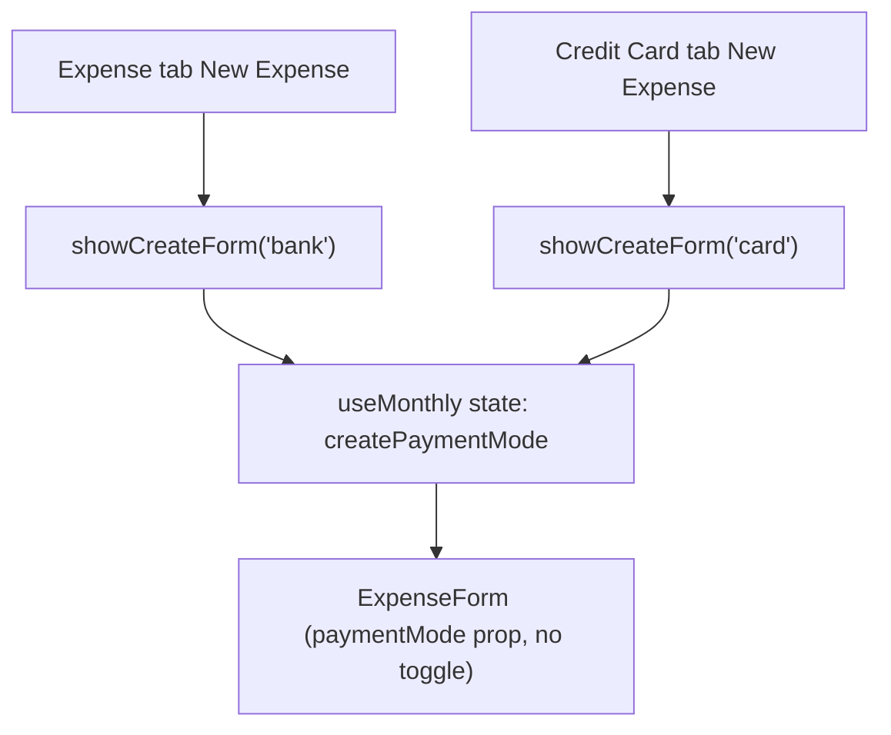

# Spec: F07. Web: Lock Payment Mode by Tab Context

**Complexity:** simple

## 1. Technical Overview

**What:** Remove `ExpenseForm`'s payment-mode radio toggle entirely. The form always renders exactly one field group — bank (Payment Source + Round-Up) or card (Card) — based on a `paymentMode` prop the caller now fully controls; `MonthlyPage` decides that mode from which tab the form was opened in (`'bank'` for the Expense tab, `'card'` for the Credit Card tab) and passes it down through `useMonthly`'s `showCreateForm(mode)`.

**Why:** F01 already guarantees the Expense tab only ever shows `ImmediatePayment`/`CreditCardSettled` expenses and the Credit Card tab only ever shows unsettled `CreditCardCharge` expenses. Today's shared `ExpenseForm` still lets a user toggle either tab's create/edit form into the *other* mode, producing an expense that immediately vanishes from the tab they were just looking at (a bank-mode expense created from the Credit Card tab wouldn't appear there since F05 filters to `UnpaidCardCharges`; a card-mode expense created from the Expense tab wouldn't appear there since F01 excludes it). Removing the toggle and fixing the mode by tab context eliminates that confusing dead end.

**Scope:**

**Included:**
- `ExpenseForm.tsx`: remove the "Payment" radio toggle block and the `onModeChange` prop; keep `paymentMode` as a required prop that selects which single field group renders.
- `useMonthly.ts`: `showCreateForm` takes a required `mode: PaymentMode` argument; `SHOW_CREATE_FORM` resets `createPaymentSource`/`createCardTag`/`createRoundUpAmount` to the correct defaults for that mode (same computation `SET_CREATE_MODE` used to do, now applied once at open).
- `useMonthly.ts`: remove `setCreatePaymentMode`, `setEditPaymentMode`, and the `SET_CREATE_MODE`/`SET_EDIT_MODE` reducer actions — their only caller (the toggle) no longer exists.
- `MonthlyPage.tsx`: Expense tab's "New Expense" calls `showCreateForm('bank')`; Credit Card tab's calls `showCreateForm('card')`; the shared `expenseFormElement` no longer passes `onModeChange`.

**Excluded (Out of Scope, per PRD Section 7):**
- Any change to editing's mode-derivation logic — `showEditForm` already sets `editPaymentMode` from the expense's own `cardTag`/`paymentSource`, which is already correct per-tab (see Why). Untouched.
- Any change to the settled-expense note/branch in `ExpenseForm` — untouched.
- Any WPF change — covered independently by F08.
- Reintroducing any form of mode switch (PRD Section 7, "Payment mode toggle").

## 2. Architecture Impact

**Affected components:**
- `Financial.Web/src/components/ExpenseForm.tsx` — remove toggle, drop `onModeChange` prop (Modified)
- `Financial.Web/src/hooks/useMonthly.ts` — `showCreateForm(mode)`, remove dead mode-setters/actions (Modified)
- `Financial.Web/src/pages/MonthlyPage.tsx` — pass explicit mode per tab (Modified)

## 3. Technical Decisions

| Decision | Chosen Approach | Alternative Considered | Trade-off |
|----------|----------------|----------------------|-----------|
| How the form learns its mode | Caller-supplied, via `showCreateForm(mode)` for create and the already-existing per-expense derivation for edit | A `lockedPaymentMode` prop layered on top of the existing toggleable `paymentMode`/`onModeChange` | Since every remaining call site is now locked (no unlocked case survives), keeping the toggle code path around would be permanently dead — removing it outright matches `CLAUDE.md`'s no-over-engineering guidance and avoids an unreachable branch |
| Where the mode-dependent field reset happens | Once, in the `SHOW_CREATE_FORM` reducer case, using the same computation `SET_CREATE_MODE` used | Keep `SET_CREATE_MODE`/`SET_EDIT_MODE` as internal-only helpers, calling them from `SHOW_CREATE_FORM` | Folding the logic directly into `SHOW_CREATE_FORM` avoids keeping two actions alive for one call site each; the computation itself (default bank name, round-up suggestion, blank card tag) is small enough to inline without hurting readability |
| `setEditPaymentMode`/`SET_EDIT_MODE` removal | Removed — edit's mode was never caller-supplied at open time (it's derived from the expense being edited in `SHOW_EDIT_FORM`, which is untouched), so these only ever existed to serve the toggle | Keep them for a hypothetical future "change an expense's payment mode while editing" feature | Not requested by this PRD and `CLAUDE.md` explicitly warns against designing for hypothetical future requirements |

## 4. Component Overview

**Frontend:**

| File Path | New/Modified | Purpose | Key Responsibilities |
|---|---|---|---|
| `Financial.Web/src/components/ExpenseForm.tsx` | Modified | Expense create/edit form | Remove the radio-toggle block and `onModeChange` prop; render exactly one of the bank/card field groups based on `paymentMode`, unchanged otherwise (settled note, round-up eligibility, save/cancel) |
| `Financial.Web/src/hooks/useMonthly.ts` | Modified | Monthly state/data hook | `showCreateForm(mode: PaymentMode)`; `SHOW_CREATE_FORM` sets `createPaymentMode` and resets `createPaymentSource`/`createCardTag`/`createRoundUpAmount` per mode; remove `setCreatePaymentMode`, `setEditPaymentMode`, `SET_CREATE_MODE`, `SET_EDIT_MODE` from the action union, reducer, and returned `MonthlyData` |
| `Financial.Web/src/pages/MonthlyPage.tsx` | Modified | Page composition | Expense tab: `onNewExpense={() => showCreateForm('bank')}`; Credit Card tab: `onNewExpense={() => showCreateForm('card')}`; `expenseFormElement` drops the `onModeChange` prop passed to `ExpenseForm` |

**Backend:** No changes.

**Database:** No changes.

## 5. API Contracts

No changes. `createExpense`/`updateExpense` (`POST`/`PUT /expenses`) already send whichever of `paymentSource`/`cardTag` is non-null based on the form's mode — that logic in `submitCreate`/`saveEdit` is unchanged; only how the mode gets set changes.

## 6. Data Model

No new database tables, columns, migrations, or DTOs.

## 7. Testing Strategy

| Test File | Test Type | Target | Coverage Goal |
|-----------|-----------|--------|---------------|
| `Financial.Web/src/components/__tests__/ExpenseForm.test.tsx` | Unit | `ExpenseForm` | No toggle rendered ever; correct single field group per `paymentMode` (existing tests already assert this per-prop, just need `onModeChange` dropped from fixtures) |
| `Financial.Web/src/hooks/useMonthly.test.ts` | Unit | `useMonthly` | `showCreateForm('bank')`/`showCreateForm('card')` set the right initial mode and field defaults; removed setters/actions have no remaining test |
| `Financial.Web/src/pages/__tests__/MonthlyPage.test.tsx` | Integration | `MonthlyPage` | Each tab's "New Expense" opens the form already locked to that tab's mode, with no toggle in the DOM |

**Key test functions/cases:**

| Test Function/Case | Description | Assertions |
|---|---|---|
| `renders no payment-mode toggle in bank mode` / `... in card mode` (replaces `shows the bank picker in bank mode and the card picker in card mode`) | `ExpenseForm` rendered with each `paymentMode` | `screen.queryByRole('radio')` is absent in both; correct single field (`Payment Source` vs `Card`) present, matching the existing per-mode assertions |
| `showCreateForm('bank')` / `showCreateForm('card')` set the initial mode and default fields | Call each variant fresh | `createPaymentMode` matches; `createPaymentSource` defaults to the first bank (bank mode) or empty (card mode); `createCardTag` empty; round-up suggestion behaves as `SET_CREATE_MODE` used to (mirrors the removed `switching create mode clears the field...` test's assertions, now checked at open time instead of at toggle time) |
| `opens the New Expense form on the Expense tab locked to bank mode, no toggle` | `MonthlyPage`, click "New Expense" on Expense tab | `Payment Source` field present, `Card` field absent, no `radio` role in the DOM |
| `opens the New Expense form on the Credit Card tab locked to card mode, no toggle` | `MonthlyPage`, click "New Expense" on Credit Card tab | `Card` field present, `Payment Source` field absent, no `radio` role in the DOM |
| `creates a bank expense from the Expense tab with a null card tag` (regression guard) | Fill and submit from Expense tab | `createExpense` called with a non-null `paymentSource` and `cardTag: null` |
| `creates a card expense from the Credit Card tab with a null payment source` (regression guard) | Fill and submit from Credit Card tab | `createExpense` called with `paymentSource: null` and a non-null `cardTag` |
| `editing a non-settled expense from either tab shows no toggle` | Edit an Expense-tab row and a Credit-Card-tab row in turn | Neither shows a `radio` role; each shows only its own tab-appropriate field |

**Acceptance-criteria traceability (PRD Section 9, F07):** the five F07 criteria map directly to the `MonthlyPage`-level tests above (toggle-free open per tab, correct submit payload per tab, toggle-free edit).
