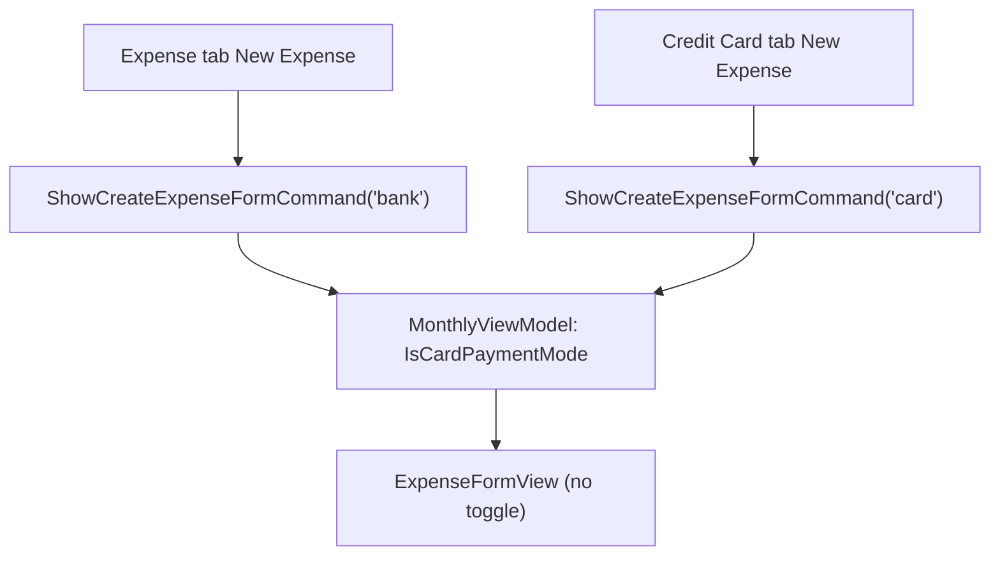

# Spec: F08. WPF: Lock Payment Mode by Tab Context

**Complexity:** simple

## 1. Technical Overview

**What:** Remove `ExpenseFormView.xaml`'s payment-mode `RadioButton` toggle. `MonthlyViewModel.ShowCreateExpenseFormCommand` becomes `RelayCommand<string>`, taking `"bank"` or `"card"` as its `CommandParameter`; the Expense tab's "New Expense" button (`ExpenseSectionView.xaml`) passes `"bank"`, the Credit Card tab's (`CreditCardExpensesView.xaml`) passes `"card"`. Opening the form sets `IsCardPaymentMode` from that parameter and resets the mode-dependent fields, exactly mirroring F07's Web design.

**Why:** This is the WPF counterpart to F07. F01 already guarantees the Expense tab only ever shows bank-paid/settled expenses and the Credit Card tab only ever shows unsettled card charges, so the existing toggle let a user create/edit into a mode that would immediately make the expense vanish from the tab they were looking at (per F01's exclusion and F06's `UnpaidCardCharges` filter). Removing the toggle and fixing the mode by tab context — same reasoning, same fix, different platform — eliminates that dead end here too.

**Scope:**

**Included:**
- `ExpenseFormView.xaml`: remove the `RadioButton` toggle `StackPanel` ("Pay immediately" / "Charge to card"). The Card field grid and the Payment Source/Round-Up section stay, still each gated by `IsCardPaymentMode`/`IsBankPaymentMode`, now fixed instead of user-togglable.
- `MonthlyViewModel.cs`: `ShowCreateExpenseFormCommand` becomes `RelayCommand<string>`; `ShowCreateExpenseForm(string? mode)` sets `IsCardPaymentMode = mode == "card"` (was hardcoded `false`) and resets `ExpenseFormPaymentSource`/`ExpenseFormCardTag`/`ExpenseFormRoundUpAmount` per mode, mirroring the existing bank-default logic.
- `MonthlyViewModel.cs`: remove `SetBankPaymentModeCommand` and `SetCardPaymentModeCommand` — their only caller (the toggle) no longer exists.
- `ExpenseSectionView.xaml`: "New Expense" button gets `CommandParameter="bank"`.
- `CreditCardExpensesView.xaml`: "New Expense" button gets `CommandParameter="card"`.

**Excluded (Out of Scope, per PRD Section 7):**
- Any change to editing's mode-derivation — `ShowEditExpenseForm` already sets `IsCardPaymentMode` from the expense's own `CardTag`, which is already correct per-tab (see Why). Untouched.
- Any change to the settled-expense note/branch (`ExpenseFormIsSettled`/`ShowPaymentModeFields`) — untouched.
- Any Web change — covered independently by F07 (already shipped).
- Reintroducing any form of mode switch (PRD Section 7, "Payment mode toggle").

## 2. Architecture Impact

**Affected components** (all within `Financial.App`, the WPF Presentation project — no other layer changes):
- `Financial.App/Views/CashFlow/ExpenseFormView.xaml` — remove toggle (Modified)
- `Financial.App/Views/CashFlow/ExpenseSectionView.xaml` — `CommandParameter="bank"` (Modified)
- `Financial.App/Views/CashFlow/CreditCardExpensesView.xaml` — `CommandParameter="card"` (Modified)
- `Financial.App/ViewModels/CashFlow/MonthlyViewModel.cs` — command signature + mode handling (Modified)

## 3. Technical Decisions

| Decision | Chosen Approach | Alternative Considered | Trade-off |
|----------|----------------|----------------------|-----------|
| Command parameter type | `RelayCommand<string>` with `"bank"`/`"card"` | A dedicated enum, or two separate commands (`ShowCreateExpenseFormBankCommand`/`...CardCommand`) | `RelayCommand<string>` already has a precedent in this exact class (`ShowMoveMoneyFormCommand`), so this stays consistent with the established WPF codebase idiom instead of introducing a new command-parameter pattern for one feature |
| How the form learns its mode | Caller-supplied via the command parameter for create; already-existing per-expense derivation for edit | Keep a `SetCardPaymentModeCommand`-style setter reachable for a hypothetical future mode-change feature | Every remaining call site is now locked (no unlocked case survives), so keeping the setter/toggle infrastructure around would be permanently dead code — matches `CLAUDE.md`'s no-over-engineering guidance, and mirrors the same call made in F07 for Web |
| `SetBankPaymentModeCommand`/`SetCardPaymentModeCommand` removal | Removed | Keep them as internal-only helpers called from `ShowCreateExpenseForm` | The mode-setting logic they perform (`IsCardPaymentMode = ...`) is a single field assignment — inlining it directly into `ShowCreateExpenseForm` is simpler than keeping two now-purposeless public commands alive |

## 4. Component Overview

**Presentation (`Financial.App`):**

| File Path | New/Modified | Purpose | Key Responsibilities |
|---|---|---|---|
| `Financial.App/Views/CashFlow/ExpenseFormView.xaml` | Modified | Expense create/edit form | Remove the `RadioButton` toggle `StackPanel`; Card grid and Payment Source/Round-Up section unchanged otherwise |
| `Financial.App/Views/CashFlow/ExpenseSectionView.xaml` | Modified | Expense tab's New Expense button | Add `CommandParameter="bank"` to the existing `Command="{Binding ShowCreateExpenseFormCommand}"` button |
| `Financial.App/Views/CashFlow/CreditCardExpensesView.xaml` | Modified | Credit Card tab's New Expense button | Add `CommandParameter="card"` to the existing `Command="{Binding ShowCreateExpenseFormCommand}"` button |
| `Financial.App/ViewModels/CashFlow/MonthlyViewModel.cs` | Modified | Shared Monthly VM | `ShowCreateExpenseFormCommand` becomes `RelayCommand<string>`; `ShowCreateExpenseForm(string? mode)` sets `IsCardPaymentMode` and resets payment-source/card-tag/round-up per mode; remove `SetBankPaymentModeCommand`/`SetCardPaymentModeCommand` |

**Backend:** No changes. **Database:** No changes.

## 5. Service Contracts Reused (No New API)

None. No `IExpenseService` change — only how `IsCardPaymentMode` gets set before `SaveExpenseAsync` reads it.

## 6. Data Model

Not applicable — no database, migration, or persisted schema changes, and no new C# types.

## 7. Testing Strategy

Consistent with this codebase's existing convention (`Tests/Financial.Presentation.Tests`) and F07's precedent: ViewModel behavior is unit-tested; the `.xaml` toggle removal itself is verified manually during implementation, since there is no WPF UI-automation harness in this repo.

| Test File | Test Type | Target | Coverage Goal |
|---|---|---|---|
| `Tests/Financial.Presentation.Tests/ViewModels/CashFlow/MonthlyViewModelTests.cs` | Unit | `MonthlyViewModel` create-form mode handling | Update existing tests whose call sites use the removed setters/parameterless command; new tests for the parameterized command's defaults |

**Test changes:**

| Test Function | Description | Assertions |
|---|---|---|
| `AddExpense_BankMode_CallsServiceWithPaymentSourceAndRefreshes` (updated) | `ShowCreateExpenseFormCommand.Execute(null)` → `Execute("bank")` | Same assertions as today — explicit bank mode instead of the removed implicit default |
| `AddExpense_CardMode_CallsServiceWithCardTag` (updated) | `ShowCreateExpenseFormCommand.Execute("card")` replaces `Execute(null)` + `SetCardPaymentModeCommand.Execute(null)` | Same assertions as today |
| `SettingCardPaymentMode_TogglesIsCardPaymentModeAndExposesFiveCards` (replaced by `ShowCreateExpenseFormCommand_CardMode_SetsIsCardPaymentModeAndExposesFiveCards`) | `ShowCreateExpenseFormCommand.Execute("card")` | `IsCardPaymentMode` true, `IsBankPaymentMode` false, `MonthlyViewModel.Cards` has 5 entries (the "toggle back to bank" half of the old test is dropped — there is no toggle-back path anymore) |
| `SelectingRoundUpEnabledBank_ShowsRoundUpField` / `SelectingNonRoundUpBank_HidesRoundUpField` / `NegativeValue_SelectingRoundUpEnabledBank_DoesNotSuggestRoundUp` (updated) | `Execute(null)` → `Execute("bank")` | Same assertions as today |
| `EditExpense_SettledExpense_HidesPaymentModeFieldsAndSaveButton`, `EditExpense_ValidForm_CallsUpdateServiceAndRefreshes` | Unchanged — these use `EditExpenseCommand`, not `ShowCreateExpenseFormCommand` | No change needed |
| `ShowCreateExpenseFormCommand_BankMode_DefaultsToFirstBankAndEmptyCardTag` (new) | `Execute("bank")` fresh | `ExpenseFormPaymentSource` is the first bank, `ExpenseFormCardTag` empty, `IsCardPaymentMode` false |
| `ShowCreateExpenseFormCommand_CardMode_DefaultsToEmptyPaymentSourceAndCardTag` (new) | `Execute("card")` fresh | `ExpenseFormPaymentSource` empty, `ExpenseFormCardTag` empty, `IsCardPaymentMode` true |

**Manual verification checklist (performed during implementation, per the P24-F03/F06 precedent):**

| Check | Expected Result |
|---|---|
| Click "New Expense" on the Expense tab | Form opens with only the Payment Source field (and Round-Up when eligible); no "Payment" toggle, no Card field |
| Click "New Expense" on the Credit Card tab | Form opens with only the Card field; no "Payment" toggle, no Payment Source/Round-Up field |
| Edit a non-settled row on either tab | Same single tab-appropriate field group, no toggle |

**Acceptance-criteria traceability (PRD Section 9, F08):** the submit-payload criteria map to the updated `AddExpense_BankMode_*`/`AddExpense_CardMode_*` tests; the "no toggle" criteria have no dedicated unit test (WPF `.xaml` layout, no UI-automation harness) and are covered by the manual verification checklist instead — consistent with how F03/F06 traced their layout-only criteria.
