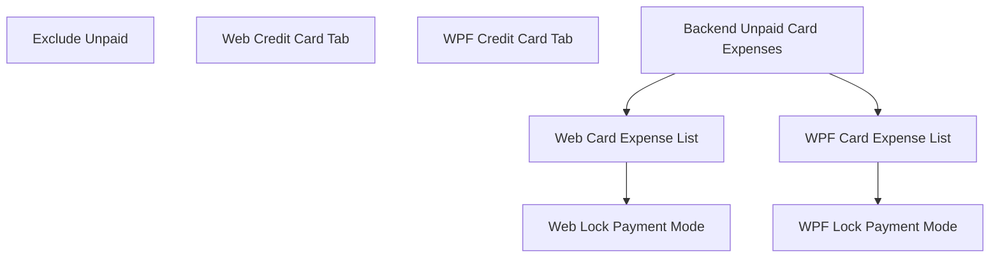

# Credit Card Tab

## 1. Executive Summary

Credit Card Tab is a focused UI change to the Financial app's CashFlow → Monthly page. It gives credit card invoices their own "Credit Card" tab, in addition to Summary, and stops unpaid credit card charges from cluttering the normal Expense list. The person using the app is the app's sole user, managing their own bank accounts and credit cards.

Today, the Monthly page's Summary tab embeds a "Cards grid" (per-card outstanding totals with mark-paid/unmark-paid actions) alongside category totals, bank balances, and incoming totals. At the same time, the Expense list shows every expense regardless of whether it was paid immediately from a bank or charged to a credit card and not yet settled, so unpaid card charges appear as if they were already-paid spend.

This feature adds a second, identical rendering of the existing Cards grid inside a new dedicated "Credit Card" tab (positioned right after the Expense tab) on both the Web and WPF clients — the Summary tab keeps its Cards grid exactly as it is today, unchanged. It also excludes unpaid card charges from the normal Expense list so each expense is visible in exactly one place: the Expense list while paid from a bank (or once a card charge is settled), or the Card tab while an unpaid card charge. Because that exclusion means unpaid card charges are no longer visible anywhere as individual line items, the Credit Card tab also gains its own expense list — a flat, read/edit/delete-capable list of every unpaid card charge for the selected month, across all cards, positioned below the per-card totals grid — so nothing that used to be visible in the Expense list becomes invisible after this change, just relocated. The mark-paid/unmark-paid workflow, statement grouping, and settlement cascade already shipped in a prior feature and are reused unchanged, and all grids/lists read from the same underlying data so they always agree.

## 2. Problem and Opportunity

**The Problem**

- **Ambiguous expense list**: The Expense list shows unpaid credit card charges next to bank-paid expenses with no distinction in list membership, making it unclear which expenses have actually left a bank account.
- **No dedicated card workspace**: There's no single place to focus on "what do I owe on my cards this month" without also looking at bank balances and income totals — and the user still wants the existing Summary overview left exactly as it is, since it's already relied on for a quick at-a-glance check.

**The Opportunity**

- Adding a "Credit Card" tab with its own copy of the Cards grid (mirroring how Bank operations already got their own tab) gives card invoices a focused screen for anyone who wants to work only with cards — without touching the Summary tab's existing at-a-glance view, directly solving the dedicated-workspace problem without any regression risk to Summary.
- Filtering unpaid card charges out of the Expense list makes the list accurately reflect money that has actually left a bank account — directly solves the ambiguous expense list problem.
- Because the underlying settlement data model, mark-paid/unmark-paid actions, and API already exist, this is a low-risk, presentation-only change that can ship quickly and be validated independently of any future reporting changes.

## 3. Target Audience

### Primary Users

**Personal Finance Owner**
- Uses the Financial app as a single-user personal install to track their own bank accounts and credit cards across the month.
- Reviews the Monthly page regularly to see what's been spent, what's owed on cards, and what bank balances look like.
- Wants a clear, uncluttered view of outstanding card invoices without unrelated summary data in the way.

## 4. Objectives

**Product Objectives**

- **Add** a dedicated Card tab that gives credit card invoice tracking its own focused screen.
- **Preserve** the Summary tab exactly as it is today, including its existing Cards grid.
- **Clarify** the Expense list so it only shows expenses that have actually settled against a bank (directly or via card payment).
- **Preserve** all existing mark-paid/unmark-paid functionality without any behavioral change, in both places it now appears.

**Success Metrics**

- The Summary tab's layout and content are pixel-for-pixel unchanged after the change (still 4 grids: category totals, cards, bank balances, incoming totals) — verified visually and via unmodified existing Summary tests.
- The new Card tab's totals match the Summary tab's Cards grid totals exactly for every month, since both read the same underlying data — verified by comparing values side by side.
- 0 unpaid credit card charges appear in the Expense list for any month with outstanding card statements — verified by comparing Expense list contents against known unpaid `CardStatement` data.
- 100% of existing Cards grid interactions (mark paid, unmark paid, bank picker) continue to work identically from both the Summary and Card tab instances, verified by existing/updated automated tests passing.

## 5. User Stories

### F01. Exclude Unpaid Card Charges from Expense List
- As the system, I want to exclude expenses charged to a credit card and not yet settled from the monthly expense list so that the list only shows expenses that have left a bank account
- As a user, I want an unpaid credit card charge to reappear in the Expense list automatically once its invoice is marked paid so that I don't have to re-enter or move it manually

### F02. Web: Dedicated Credit Card Tab
- As a user, I want a "Credit Card" tab on the Monthly page, right after the Expense tab, so that I can view and manage credit card invoices in a focused screen
- As a user, I want the Credit Card tab to show the same per-card outstanding totals and mark-paid/unmark-paid controls I already have today in Summary, as its own copy
- As a user, I want the Summary tab's Cards grid to remain exactly as it is today, so my existing at-a-glance view isn't disrupted

### F03. WPF: Dedicated Credit Card Tab
- As a user, I want a "Credit Card" tab on the WPF Monthly view, right after the Expense tab, so that I can view and manage credit card invoices in a focused screen
- As a user, I want the Credit Card tab to show the same per-card outstanding totals and mark-paid/unmark-paid controls I already have today in Summary, as its own copy
- As a user, I want the Summary tab's Cards grid to remain exactly as it is today, so my existing at-a-glance view isn't disrupted

### F04. Backend: Expose Unpaid Card Charge Expenses
- As the system, I want to expose the list of unsettled credit card charge expenses for a given month so that both clients can display them without duplicating the filtering logic

### F05. Web: Show Unpaid Card Expenses in Credit Card Tab
- As a user, I want to see the actual list of unpaid credit card charges for the selected month in the Credit Card tab so that I know what makes up each card's outstanding total
- As a user, I want to edit or delete an unpaid card charge from the Credit Card tab so that I keep the same correction ability I had before it was hidden from the Expense list

### F06. WPF: Show Unpaid Card Expenses in Credit Card Tab
- As a user, I want to see the actual list of unpaid credit card charges for the selected month in the WPF Credit Card tab so that I know what makes up each card's outstanding total
- As a user, I want to edit or delete an unpaid card charge from the WPF Credit Card tab so that I keep the same correction ability I had before it was hidden from the Expense list

### F07. Web: Lock Payment Mode by Tab Context
- As a user, I want the expense form opened from the Expense tab to always be in bank-payment mode, with no toggle to switch to card, so that I can't accidentally add a card charge where it wouldn't belong
- As a user, I want the expense form opened from the Credit Card tab to always be in card-payment mode, with no toggle to switch to bank, so that I can't accidentally add a bank expense where it wouldn't belong

### F08. WPF: Lock Payment Mode by Tab Context
- As a user, I want the expense form opened from the Expense tab to always be in bank-payment mode, with no toggle to switch to card, so that I can't accidentally add a card charge where it wouldn't belong
- As a user, I want the expense form opened from the Credit Card tab to always be in card-payment mode, with no toggle to switch to bank, so that I can't accidentally add a bank expense where it wouldn't belong

## 6. Functionalities

### F01. Exclude Unpaid Card Charges from Expense List

**Capabilities:**
- Applies to the monthly expense query used by both the Web and WPF Expense list views (single shared Application-layer change, no per-client logic).
- An expense is excluded from the list when its computed payment status is `CreditCardCharge` (has a `CardTag` set and `SettledAt` is null).
- An expense remains in the list when its computed payment status is `ImmediatePayment` (paid directly from a bank, no card tag) or `CreditCardSettled` (card-tagged but already settled, i.e. `SettledAt` is set).
- No change to expense ordering (still descending by date) or to any other field returned for expenses that remain in the list.
- No change to the underlying `Expense` entity, `CardStatement` entity, or the mark-paid/unmark-paid workflow — this feature only changes which expenses the monthly list query returns.

**Experience:**
- User opens the Expense tab for a month that has one or more unpaid credit card charges: those charges do not appear in the list; only bank-paid and already-settled card expenses are shown.
- User (or the system, via the existing mark-paid action in the Card tab) marks a card statement as paid: on next load of the Expense tab for that statement's month, the previously-hidden expenses now appear in the list, since their computed status changed to `CreditCardSettled`.
- No new UI states, loading indicators, or error messages are introduced — this is a filtering change on data that was already being fetched.

### F02. Web: Dedicated Credit Card Tab

**Capabilities:**
- `MONTHLY_TABS` gains a 5th entry (`card` / "Credit Card"), positioned right after the existing `expense` tab (new order: Summary, Expense, Credit Card, Incoming, Bank).
- The existing `CardsGrid` component (props, internal logic, and its data source in `useMonthly`) is unchanged. It is rendered a second time inside the new `activeTab === 'card'` block, in addition to its existing rendering inside the `activeTab === 'summary'` block — the Summary tab's JSX and layout are untouched.
- Both renderings are bound to the same `useMonthly` state (`cardStatements`, `banks`, `markPaidSources`, etc.), so a mark-paid/unmark-paid action taken from either tab updates both instantly — there is no separate data fetch or state to keep in sync.
- Each rendering needs a distinct React `key`/DOM context (e.g. wrapping element) only if required to avoid duplicate-id concerns in tests or styling; no change to `CardsGrid`'s internal markup is otherwise needed.

**Experience:**
- User clicks the "Credit Card" tab (between Expense and Incoming): sees a copy of the same per-card outstanding totals, bank-picker dropdown, and Mark Paid / Unmark Paid buttons shown in Summary.
- User clicks the "Summary" tab: still sees the Cards grid exactly as before, alongside category totals, bank balances, and incoming totals — no visual or behavioral change.
- Marking a statement paid from either tab is reflected immediately in the other tab's grid too, since both read the same state.
- Switching tabs, month navigation, and loading/error states behave exactly as they do for the existing Bank tab (same tab-switching pattern already in place).

### F03. WPF: Dedicated Credit Card Tab

**Capabilities:**
- `MonthlyView.xaml` gains a new `TabItem` ("Credit Card") alongside the existing Summary, Expense, Incoming, and Bank tabs, positioned right after Expense (new order: Summary, Expense, Credit Card, Incoming, Bank).
- The existing `CardsGridView` (and its bindings to `MonthlyViewModel`'s `MarkStatementPaidCommand` / `UnmarkStatementPaidCommand`) is unchanged. A second `CardsGridView` instance is added as the new tab's content, bound to the same `MonthlyViewModel` — `MonthlySummaryView.xaml` keeps its existing `CardsGridView` untouched.
- WPF supports multiple views bound to the same view-model instance/properties without conflict, so both `CardsGridView` instances stay in sync automatically when a mark-paid/unmark-paid command executes from either one.

**Experience:**
- User selects the "Credit Card" tab (between Expense and Incoming): sees a copy of the same per-card outstanding totals and Mark Paid / Unmark Paid controls shown in Summary.
- User selects the "Summary" tab: still sees the Cards grid exactly as before, alongside category totals, bank balances, and incoming totals — no visual or behavioral change.
- Marking a statement paid from either tab is reflected immediately in the other tab's grid too, since both bind to the same view-model state.
- Tab switching and month navigation behave exactly as they do for the existing Bank tab (same `TabControl` pattern already in place).

### F04. Backend: Expose Unpaid Card Charge Expenses

**Provides:**
- List of unsettled credit card charge expenses for a month — expense id, date, description, value, category, and card tag (used by F05, F06)

**Capabilities:**
- New read-only query returning expenses for a given year/month whose computed `PaymentStatus` is `CreditCardCharge` — the exact inverse of F01's filter, reusing the same computed property, applied at the Application layer so both clients share one implementation.
- Category on each returned expense is the original purchase category, unchanged by settlement state (matches existing `Expense.Category` behavior — settlement never rewrites it).
- No new write operations, no new domain method, and no change to `Expense`, `CardStatement`, or the settlement cascade — purely an additive read query alongside the existing `GetExpensesByMonth`.
- Existing edit (`PUT /expenses/{id}`) and delete (`DELETE /expenses/{id}`) endpoints already operate on any expense by id regardless of payment status, so no new write endpoint is needed for F05/F06 to support editing or deleting an unpaid card charge.

**Experience:**
- Not user-facing directly — this is the shared data source F05 and F06 render.

### F05. Web: Show Unpaid Card Expenses in Credit Card Tab

**Consumes:**
- F04: unsettled credit card charge expenses for the month (date, description, value, category, card tag)

**Capabilities:**
- The Credit Card tab renders a flat expense list below the existing per-card totals grid, showing every unpaid card charge for the selected month across all cards — same columns as the existing Expense list (Date, Description, Value, Category) plus a Card column, reusing the existing expense list/edit/delete UI pattern.
- Edit and Delete controls per row reuse the existing expense edit form and delete flow unchanged (same `PUT`/`DELETE /expenses/{id}` calls the Expense tab already uses) — editing an unpaid card charge's category tag, value, or description works exactly as it did before F01 hid it from the Expense list.
- The list re-fetches whenever the Credit Card tab's other data does (month change, mark-paid/unmark-paid) so it always matches the per-card totals grid above it.

**Experience:**
- User opens the Credit Card tab: sees the per-card totals grid (unchanged from F02) followed by a list of every unpaid card charge for the month, newest first.
- User clicks Edit on a row: the same expense edit form used on the Expense tab opens, pre-filled; saving updates the row in place.
- User clicks Delete on a row: same confirmation and removal behavior as the Expense tab; the per-card totals grid above updates to reflect the smaller outstanding total.
- Marking a statement paid removes its expenses from this list (they move to the normal Expense list, per F01) without a page reload, matching F02's existing cross-grid sync.

### F06. WPF: Show Unpaid Card Expenses in Credit Card Tab

**Consumes:**
- F04: unsettled credit card charge expenses for the month (date, description, value, category, card tag)

**Capabilities:**
- The Credit Card tab renders a flat expense list below the existing per-card totals grid (`CardsGridView`), showing every unpaid card charge for the selected month across all cards — same columns as the existing WPF Expense list (Date, Description, Value, Category) plus a Card column, reusing the existing expense list/edit/delete UI pattern.
- Edit and Delete controls per row reuse the existing `MonthlyViewModel` expense edit/delete commands unchanged — editing an unpaid card charge works exactly as it did before F01 hid it from the Expense tab.
- The list refreshes alongside the tab's other data (month change, mark-paid/unmark-paid) so it always matches the per-card totals grid above it.

**Experience:**
- User selects the Credit Card tab: sees the per-card totals grid (unchanged from F03) followed by a list of every unpaid card charge for the month.
- User edits or deletes a row: same form/confirmation behavior as the WPF Expense tab.
- Marking a statement paid removes its expenses from this list without a manual refresh, matching F03's existing cross-grid sync.

### F07. Web: Lock Payment Mode by Tab Context

**Capabilities:**
- `ExpenseForm`'s payment-mode radio toggle ("Pay immediately" / "Charge to card") is removed entirely. The component always renders exactly one field group — bank (Payment Source + Round-Up, when eligible) or card (Card) — based on its `paymentMode` prop; the prop is no longer user-changeable from within the form (the `onModeChange` prop is removed).
- `useMonthly`'s `showCreateForm` takes a required `mode: 'bank' | 'card'` argument. The Expense tab's "New Expense" button calls it with `'bank'`; the Credit Card tab's calls it with `'card'`. Opening the form resets the payment-source/card-tag/round-up fields to the correct defaults for that mode (the same reset logic previously triggered by toggling, now applied once at open, per mode).
- Editing is unaffected in mechanism: payment mode is already derived from the expense's own `CardTag`/`PaymentSource` when the edit form opens, and — because F01 already excludes unpaid card charges from the Expense tab — the Expense tab only ever contains bank-paid/settled expenses and the Credit Card tab only ever contains unsettled card charges. Removing the toggle only stops offering a switch that could never have produced a valid combination for that tab.
- `setCreatePaymentMode`, `setEditPaymentMode`, and the `SET_CREATE_MODE`/`SET_EDIT_MODE` reducer actions are removed — they existed only to serve the now-removed toggle and have no other caller.

**Experience:**
- User clicks "New Expense" on the Expense tab: the form opens with only the Payment Source field (and Round-Up, if the selected bank supports it) — no "Payment" toggle, no Card field.
- User clicks "New Expense" on the Credit Card tab: the form opens with only the Card field — no "Payment" toggle, no Payment Source or Round-Up field.
- User clicks Edit on a row in either tab: the form shows the same tab-appropriate single field group (or, for a settled expense on the Expense tab, the existing frozen-payment-fields note — unchanged).

### F08. WPF: Lock Payment Mode by Tab Context

**Capabilities:**
- `ExpenseFormView.xaml`'s `RadioButton` payment-mode toggle ("Pay immediately" / "Charge to card") is removed entirely. The Card field grid and the Payment Source/Round-Up section remain, each still shown based on `IsCardPaymentMode`/`IsBankPaymentMode` — but that value is now fixed for the form's lifetime rather than user-togglable.
- `MonthlyViewModel.ShowCreateExpenseFormCommand` becomes `RelayCommand<string>`, taking `"bank"` or `"card"` as its `CommandParameter`. The Expense tab's "New Expense" button (`ExpenseSectionView.xaml`) passes `"bank"`; the Credit Card tab's (`CreditCardExpensesView.xaml`) passes `"card"`. Opening the form sets `IsCardPaymentMode` and resets the payment-source/card-tag/round-up fields to the correct defaults for that mode, mirroring F07's reset logic.
- Editing is unaffected in mechanism, for the same reason as F07: the Expense tab only ever contains bank-paid/settled expenses and the Credit Card tab only ever contains unsettled card charges (per F01), so the mode a row edits into was already fixed by which tab it came from.
- `SetBankPaymentModeCommand` and `SetCardPaymentModeCommand` are removed — they existed only to serve the now-removed toggle and have no other caller.

**Experience:**
- User clicks "New Expense" on the Expense tab: the form opens with only the Payment Source field (and Round-Up, if eligible) — no "Payment" toggle, no Card field.
- User clicks "New Expense" on the Credit Card tab: the form opens with only the Card field — no "Payment" toggle, no Payment Source or Round-Up field.
- User clicks the edit button on a row in either tab: the form shows the same tab-appropriate single field group (or, for a settled expense, the existing frozen-payment-fields note — unchanged).

## 7. Out of Scope

**Reporting and category totals**
- Excluding unsettled credit card charges from category totals, or counting settled card expenses in the month/year they were paid rather than charged. Category totals behavior is unchanged in this PRD.

**Invoice detail**
- Grouping the unpaid-charges list by individual card/statement (e.g., a collapsible section per card, or a list scoped to one statement at a time). F05/F06 add a single flat list covering all cards together; per-statement grouping is deferred.

**Paid invoice history**
- A history section listing past paid invoices across months. The Card tab shows only the current month's statements, as it does today.

**Settlement business logic**
- Any change to how mark-paid/unmark-paid works, how statements are created, how the settlement cascade sets `SettledAt`/`PaymentSource` on expenses, or the API contract. All reused as-is.

**Credit card management**
- Adding, editing, or removing credit cards. The fixed set of supported cards is unchanged.

**Payment mode toggle**
- Reintroducing a payment-mode switch in either expense form. F07/F08 make the mode permanently determined by which tab the form was opened from — this is not a configurable preference.

## 8. Dependency Graph

### Part 1: Dependency Table

| # | Feature | Priority | Dependencies |
|---|---------|----------|--------------|
| F01 | Exclude Unpaid Card Charges from Expense List | 1 | None |
| F02 | Web: Dedicated Credit Card Tab | 1 | None |
| F03 | WPF: Dedicated Credit Card Tab | 1 | None |
| F04 | Backend: Expose Unpaid Card Charge Expenses | 1 | None |
| F05 | Web: Show Unpaid Card Expenses in Credit Card Tab | 1 | F04 |
| F06 | WPF: Show Unpaid Card Expenses in Credit Card Tab | 1 | F04 |
| F07 | Web: Lock Payment Mode by Tab Context | 2 | F05 |
| F08 | WPF: Lock Payment Mode by Tab Context | 2 | F06 |

### Execution Waves
Features within the same wave can be built in parallel. A wave starts only after every feature in earlier waves is complete.

- **Wave 1**: F01, F02, F03, F04
- **Wave 2**: F05, F06
- **Wave 3**: F07, F08

### Priority levels
- **1** = Essential — product does not work without it
- **2** = Important — significant value addition
- **3** = Desirable — incremental improvement

## 9. Acceptance Criteria

### F01. Exclude Unpaid Card Charges from Expense List
- [x] For a month with an unpaid credit card statement, expenses charged to that card and not yet settled do not appear in the monthly Expense list (Web and WPF).
- [x] For the same month, expenses paid directly from a bank still appear in the Expense list, unchanged.
- [x] After a card statement is marked paid, its expenses appear in the Expense list for that month on next load, without creating any new expense record.
- [x] After an unmark-paid action reverses a settlement, the affected expenses are excluded from the Expense list again.

### F02. Web: Dedicated Credit Card Tab
- [x] The Monthly page shows a "Credit Card" tab positioned immediately after the Expense tab (order: Summary, Expense, Credit Card, Incoming, Bank).
- [x] The Credit Card tab displays the same per-card outstanding totals shown in Summary, for the selected month.
- [x] The Summary tab continues to display its Cards grid unchanged — same content, same position, no regression.
- [x] Mark Paid and Unmark Paid actions work identically from the Credit Card tab and from Summary (same bank-picker requirement, same resulting state).
- [x] Marking a statement paid from one tab is reflected in the other tab's grid without a page reload.

### F03. WPF: Dedicated Credit Card Tab
- [x] The Monthly view shows a "Credit Card" tab positioned immediately after the Expense tab (order: Summary, Expense, Credit Card, Incoming, Bank).
- [x] The Credit Card tab displays the same per-card outstanding totals shown in Summary, for the selected month.
- [x] The Summary tab continues to display its Cards grid unchanged — same content, same position, no regression.
- [x] Mark Paid and Unmark Paid actions work identically from the Credit Card tab and from Summary (same bank-picker requirement, same resulting state).
- [x] Marking a statement paid from one tab is reflected in the other tab's grid without a manual refresh.

### F04. Backend: Expose Unpaid Card Charge Expenses
- [x] For a given month, the new query returns every expense whose `PaymentStatus` is `CreditCardCharge` for that month, with date, description, value, category, and card tag.
- [x] Expenses that are `ImmediatePayment` or `CreditCardSettled` for that month are not included.
- [ ] Existing edit and delete endpoints continue to operate on an unpaid card charge by id without any change.

### F05. Web: Show Unpaid Card Expenses in Credit Card Tab
- [x] The Credit Card tab shows a list of every unpaid card charge for the selected month, across all cards, below the per-card totals grid.
- [x] Each row shows Date, Description, Value, Category, and Card.
- [x] Editing a row updates the underlying expense and is reflected in the list without a page reload.
- [x] Deleting a row removes it from the list and updates the per-card totals grid above.
- [x] After a statement is marked paid, its expenses disappear from this list without a page reload.

### F06. WPF: Show Unpaid Card Expenses in Credit Card Tab
- [x] The Credit Card tab shows a list of every unpaid card charge for the selected month, across all cards, below the per-card totals grid.
- [x] Each row shows Date, Description, Value, Category, and Card.
- [x] Editing a row updates the underlying expense and is reflected in the list without a manual refresh.
- [x] Deleting a row removes it from the list and updates the per-card totals grid above.
- [ ] After a statement is marked paid, its expenses disappear from this list without a manual refresh.

### F07. Web: Lock Payment Mode by Tab Context
- [x] Opening "New Expense" from the Expense tab shows the create form with no payment-mode toggle and only the bank Payment Source field (plus Round-Up when the selected bank is eligible).
- [x] Opening "New Expense" from the Credit Card tab shows the create form with no payment-mode toggle and only the Card field.
- [x] Submitting a new expense from the Expense tab always sends a bank payment source and a null card tag.
- [x] Submitting a new expense from the Credit Card tab always sends a card tag and a null payment source.
- [x] Editing a non-settled expense from either tab shows the same tab-appropriate single field group, with no toggle.

### F08. WPF: Lock Payment Mode by Tab Context
- [x] Opening "New Expense" from the Expense tab shows the create form with no payment-mode toggle and only the Payment Source field (plus Round-Up when the selected bank is eligible).
- [x] Opening "New Expense" from the Credit Card tab shows the create form with no payment-mode toggle and only the Card field.
- [x] Submitting a new expense from the Expense tab always sends a bank payment source and a null card tag.
- [x] Submitting a new expense from the Credit Card tab always sends a card tag and a null payment source.
- [x] Editing a non-settled expense from either tab shows the same tab-appropriate single field group, with no toggle.

### Cross-Feature Integration
- [ ] No cross-feature integration criteria apply between F01, F02, and F03 (no Consumes/Provides declared in Section 6 for those three).
- [x] Unsettled credit card charge expenses provided by F04 (date, description, value, category, card tag) are correctly received and rendered by the Web Credit Card tab's expense list (F05).
- [x] Unsettled credit card charge expenses provided by F04 (date, description, value, category, card tag) are correctly received and rendered by the WPF Credit Card tab's expense list (F06).
- [ ] No cross-feature integration criteria apply between F07/F08 and other features (no Consumes/Provides declared in Section 6 for either — they modify existing UI, not a data flow between features).
