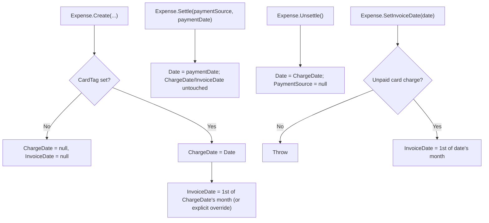

# Spec: F01. Expense Payment-Date Domain Model Rework

## 1. Technical Overview

**What:** Rework the `Expense` domain entity's date/settlement model. Introduce `ChargeDate` (the immutable original purchase day) and `InvoiceDate` (an explicit, editable invoice-period assignment, month/year only) as new fields on any credit-card expense. Change `Settle()`/`Unsettle()` so `Date` itself becomes the authoritative "payment/position date" — equal to `ChargeDate` while unpaid, overwritten with the payment date on settle, reverted to `ChargeDate` on unsettle. Remove the now-redundant `SettledAt` field entirely, from the entity, the JSON-persisted shape, and every dependent reference across the codebase.

**Why:** Today `Expense.Date` means "charge date" for an unpaid card expense but is never updated at settlement, while `SettledAt` independently tracks the real payment date — two fields answering "when was this paid?" with no single source of truth, and no field anywhere represents which invoice period (billing-cycle month) a charge belongs to. F02 (settlement matching) and F03 (category totals) both depend on `InvoiceDate`/`ChargeDate` existing and behaving correctly; this feature is the foundation wave (Wave 1) all of them build on.

**Scope:**
- **Included:**
  - `Expense.ChargeDate` and `Expense.InvoiceDate` fields (`DateOnly?`, private setters).
  - `Expense.Create` populating both fields for any expense with a non-null `CardTag` (null for bank-only expenses).
  - `Expense.Settle()` / `Expense.Unsettle()` rewritten to swap `Date` instead of writing/clearing `SettledAt`.
  - A new `Expense.SetInvoiceDate(DateOnly)` method enforcing "editable only while unpaid".
  - Removal of `SettledAt` from `Expense`, `ExpenseDTO`, `ExpenseService`, and the `CardStatementService` rollback snapshot that read it.
  - Retirement of the now-obsolete `ExpensePaymentStateMigrator` (P12) and its test file, since the legacy shape it reconciled can no longer exist once `SettledAt` is gone.
  - Every test file referencing `SettledAt` updated or removed so the full solution builds and all suites pass.
- **Excluded (later waves/features):**
  - Changing `CardStatementService`'s settlement **matching key** to `InvoiceDate.Year/Month` for billing-cutoff correctness (F02) — F01 only re-anchors the existing key from the now-mutable `Date` to the stable `ChargeDate`, to avoid shipping a regression (see §3).
  - Changing `AnnualSummaryService`'s category-total grouping to use `InvoiceDate` for unpaid charges (F03).
  - Exposing `ChargeDate`/`InvoiceDate` through the API DTOs consumed by Web/WPF, or wiring `SetInvoiceDate` into the update use case (F04).
  - Any Web or WPF UI change (F05, F06).
  - Backfilling `ChargeDate`/`InvoiceDate` on pre-existing `data-cashflow.json` records (F07) — until F07 ships, existing persisted expenses will simply deserialize with `ChargeDate`/`InvoiceDate` both null (the JSON resolver silently skips absent properties), matching their pre-migration state.
  - Spreadsheet import changes (F08).

## 2. Architecture Impact

**Affected components:**

| Layer | Component | Change |
|---|---|---|
| Domain | `Financial.CashFlow.Domain/Entities/Expense.cs` | Core rework: remove `SettledAt`, add `ChargeDate`/`InvoiceDate`, rewrite `Create`/`Settle`/`Unsettle`, add `SetInvoiceDate` |
| Domain Tests | `Tests/Financial.CashFlow.Domain.Tests/Entities/ExpenseTests.cs` | Rewrite settle/unsettle cases, add new field coverage |
| Application | `Financial.CashFlow.Application/DTOs/ExpenseDTO.cs` | Remove `SettledAt` property |
| Application | `Financial.CashFlow.Application/Services/ExpenseService.cs` | Remove `SettledAt` mapping in `ToDto` |
| Application | `Financial.CashFlow.Application/Services/CardStatementService.cs` | Rollback snapshot in `UnmarkStatementPaidAsync` reads `Date` instead of the removed `SettledAt`; `GetStatementExpenses`'s matching key re-anchored from `Date` to `ChargeDate` |
| Application Tests | `Tests/Financial.CashFlow.Application.Tests/Services/ExpenseServiceTests.cs` | Remove `SettledAt` assertions |
| Application Tests | `Tests/Financial.CashFlow.Application.Tests/Services/CardStatementServiceTests.cs` | Update rollback-related assertions |
| Infrastructure Tests | `Tests/Financial.CashFlow.Infrastructure.Tests/Persistence/CashFlowSerializerAdapterTests.cs` | Round-trip assertion swapped from `SettledAt` to `ChargeDate`/`InvoiceDate` |
| Presentation Tests | `Tests/Financial.Api.Tests/ExpenseEndpointsTests.cs`, `CardStatementsEndpointsTests.cs` | Remove `SettledAt` references |
| Integrations | `Integrations/CashFlowSpreadsheetImport/Migrations/PaymentState/ExpensePaymentStateMigrator.cs` (+ `PaymentStateMigrationSummary`) | Removed — obsolete |
| Integrations | `Integrations/CashFlowSpreadsheetImport/Program.cs` | Remove the migrator's invocation and console summary output |
| Integrations Tests | `Tests/Financial.CashFlowSpreadsheetImport.Tests/Migrations/PaymentState/ExpensePaymentStateMigratorTests.cs` | Removed |
| Integrations Tests | `Tests/Financial.CashFlowSpreadsheetImport.Tests/SheetImporters/MonthlyExpenseSheetImporterTests.cs` | Fix one stray `SettledAt` reference so the project compiles |

**Data flow:**

## 3. Technical Decisions

| Decision | Chosen Approach | Alternative Considered | Trade-off |
|---|---|---|---|
| `ChargeDate`/`InvoiceDate` representation | Plain `public DateOnly? { get; private set; }` properties on `Expense`, mirroring the removed `SettledAt` precedent | A dedicated `InvoicePeriod` value object wrapping year/month | Two extra properties are simpler and consistent with the one-field-per-concept style already used everywhere else on this entity; a value object is unwarranted ceremony for a personal, non-scaling project |
| `InvoiceDate` editability | New dedicated `Expense.SetInvoiceDate(DateOnly)` method | Thread `invoiceDate` through the existing `UpdateDetails(...)` signature | Editing invoice period end-to-end (API contract shape, WPF/Web form wiring) is F04/F05/F06's job; a narrow, single-purpose entry point keeps F01 self-contained and avoids pre-committing a DTO/update-contract shape those features haven't specified yet |
| Month-only normalization | Normalize any provided `InvoiceDate` value to the 1st of its month **inside the entity** (both `Create` and `SetInvoiceDate`) | Trust callers (Create-time defaulting logic, future F04/F08 wiring) to always pass day = 1 | Single source of truth for the "day is meaningless" invariant; prevents drift once F04 wires in a month/year picker value and F08 wires in an imported row's actual day |
| `CardStatementService.UnmarkStatementPaidAsync` rollback snapshot | Capture `Date` (now the payment date, since `Settle()` writes it there) instead of the removed `SettledAt` | Leave the method broken/non-compiling until F02 touches this file | F01 must not break the existing build or its passing test suite; this is a mechanical adjustment only |
| `CardStatementService.GetStatementExpenses` matching key | Change from `Date.Year/Month` to `ChargeDate.Year/Month` (verified necessary by running the existing test suite — see below) | Leave the matching key on `Date.Year/Month` as originally planned, deferring the whole fix to F02 | Once `Settle()` overwrites `Date` with the payment date, a `Date`-keyed lookup silently stops finding a settled charge whenever it's unmarked in a different calendar month than it was charged — this reproduced as an actual failing test (`UnmarkStatementPaidAsync_RevertsEverySettledExpenseForTheCardMonth`), not a hypothetical, since "today" and the statement's charge month differ in ordinary use. `ChargeDate` is the immutable stand-in for what `Date` used to mean pre-F01 (stable, never changes across settle/unsettle), so keying on it restores exact pre-F01 matching behavior with zero functional change in the same-month case. F02 will change this same key from `ChargeDate` to `InvoiceDate` for billing-cutoff correctness — a distinct, later change; this fix only prevents F01 from shipping a regression on its own. |
| `ExpenseService.GetExpensesByMonth` / `GetUnpaidCardChargesByMonth` / `GetCategoryTotalsByMonth` month filter | Filter by `(ChargeDate ?? Date)` instead of bare `Date` | Leave filtering on `Date`, deferring to F03 | Same class of regression as above, caught by two more failing tests (`GetExpensesByMonth_AfterMarkStatementPaid_CardChargeReappears`, `MarkStatementPaid_WithPaymentSource_SettlesChargesAndZeroesOutstandingTotal`): once settled, `Date` becomes the payment date, so a settled card expense silently "moves" out of its original month in these generic month-list endpoints. `ChargeDate ?? Date` reconstructs exactly what `Date` meant pre-F01 for every expense shape (card or bank), restoring stable month membership. This is distinct from F03's scope, which specifically reworks `AnnualSummaryService`'s category-total *grouping* to intentionally split unpaid (by `InvoiceDate`) from settled/bank (by `Date`) for correct invoice-period reporting — a deliberate behavior change, not a stability fix. |
| Obsolete P12 migrator (`ExpensePaymentStateMigrator`) | Retire entirely: delete the migrator class, its companion summary type, its `Program.cs` invocation/console output, and its test file | Patch it to compile without `SettledAt` by inventing a substitute signal | Its sole purpose was reconciling a pre-P12 data shape ("bank + card tag both set, but no real settlement date") that can only be produced by writing private fields directly — `Settle()` has always written a real payment-date field, so that shape has been structurally unreachable since P12 shipped, and the migrator's own test suite already demonstrates it is a permanent no-op against current data (`Migrate_SecondRunOverFirstRunsOutput_ChangesNothing`). Patching it to compile would mean inventing a proxy for a state that cannot occur — needless complexity flagged here for the reviewer's visibility. |

## 4. Component Overview

**Domain:**

| File Path | New/Modified | Purpose | Key Responsibilities |
|---|---|---|---|
| `Financial.CashFlow.Domain/Entities/Expense.cs` | Modified | Core entity rework | Remove `SettledAt`; add `ChargeDate`/`InvoiceDate`; update `Create` to populate both for card expenses and default `InvoiceDate` to the 1st of the charge month when not explicitly provided; rewrite `Settle`/`Unsettle` to swap `Date`; add `SetInvoiceDate` guarded to unpaid card charges only |

**Application:**

| File Path | New/Modified | Purpose | Key Responsibilities |
|---|---|---|---|
| `Financial.CashFlow.Application/DTOs/ExpenseDTO.cs` | Modified | Read model | Remove the `SettledAt` property (no replacement in this feature — F04 adds `ChargeDate`/`InvoiceDate` to this DTO) |
| `Financial.CashFlow.Application/Services/ExpenseService.cs` | Modified | Expense use cases | Remove `SettledAt` from the `ToDto` mapping; re-anchor `GetExpensesByMonth`/`GetUnpaidCardChargesByMonth`/`GetCategoryTotalsByMonth`'s month filter to `ChargeDate ?? Date` so a settled expense doesn't silently move month |
| `Financial.CashFlow.Application/Services/CardStatementService.cs` | Modified | Statement settlement orchestration | `UnmarkStatementPaidAsync`'s rollback snapshot now captures `Date` instead of `SettledAt`, so a failed re-settle after a rolled-back unsettle can restore the exact prior payment date |

**Integrations (retirement):**

| File Path | New/Modified | Purpose | Key Responsibilities |
|---|---|---|---|
| `Integrations/CashFlowSpreadsheetImport/Migrations/PaymentState/ExpensePaymentStateMigrator.cs` | Removed | Obsolete P12 migrator | N/A |
| `Integrations/CashFlowSpreadsheetImport/Migrations/PaymentState/PaymentStateMigrationSummary.cs` (or wherever the summary type lives) | Removed | Companion summary type | N/A — remove only if not referenced elsewhere; confirm no other caller before deleting |
| `Integrations/CashFlowSpreadsheetImport/Program.cs` | Modified | Migration chain entry point | Remove the `ExpensePaymentStateMigrator.Migrate(data)` call and its `Console.WriteLine(paymentStateSummary.Render())` output line |

**Tests:**

| File Path | New/Modified | Purpose | Key Responsibilities |
|---|---|---|---|
| `Tests/Financial.CashFlow.Domain.Tests/Entities/ExpenseTests.cs` | Modified | Domain unit tests | Rewrite `Settle`/`Unsettle` tests for the `Date`-swap behavior; add `ChargeDate`/`InvoiceDate` creation-default, normalization, and `SetInvoiceDate` guard tests |
| `Tests/Financial.CashFlow.Application.Tests/Services/ExpenseServiceTests.cs` | Modified | Application unit tests | Drop `SettledAt` assertions |
| `Tests/Financial.CashFlow.Application.Tests/Services/CardStatementServiceTests.cs` | Modified | Application unit tests | Update rollback-path assertions to the `Date`-based snapshot |
| `Tests/Financial.CashFlow.Infrastructure.Tests/Persistence/CashFlowSerializerAdapterTests.cs` | Modified | JSON round-trip test | Replace the `SettledAt` round-trip assertion with `ChargeDate`/`InvoiceDate` |
| `Tests/Financial.Api.Tests/ExpenseEndpointsTests.cs` | Modified | API integration tests | Remove `SettledAt` references |
| `Tests/Financial.Api.Tests/CardStatementsEndpointsTests.cs` | Modified | API integration tests | Remove `SettledAt` reference |
| `Tests/Financial.CashFlowSpreadsheetImport.Tests/Migrations/PaymentState/ExpensePaymentStateMigratorTests.cs` | Removed | Tests for the retired migrator | N/A |
| `Tests/Financial.CashFlowSpreadsheetImport.Tests/SheetImporters/MonthlyExpenseSheetImporterTests.cs` | Modified | Import tests | Fix the one stray `SettledAt` reference so the project compiles (no new `ChargeDate`/`InvoiceDate` import assertions — that's F08) |

## 5. API Contracts

No API contract changes in this feature. `ChargeDate`/`InvoiceDate` are not yet exposed through any HTTP endpoint or DTO consumed by a client — that is F04's explicit scope ("Backend Exposure of Charge/Invoice Fields"). This feature only touches the domain entity and the internal Application-layer read model (`ExpenseDTO`), from which it *removes* a field rather than adding one.

## 6. Data Model

There is no SQL schema/migration in this project — `Expense` persists as a plain POCO serialized via reflection-based `System.Text.Json` binding (`CashFlowTypeInfoResolver`), so the "schema" is implicitly whatever public properties exist on the entity. No changes to the serializer or resolver are needed: any new public property on `Expense` is picked up automatically, exactly as `SettledAt` itself was.

**`Expense` persisted-shape change:**

| Property | Type | Before | After |
|---|---|---|---|
| `SettledAt` | `DateOnly?` | Present | **Removed** |
| `ChargeDate` | `DateOnly?` | — | **Added** — non-null for any expense with `CardTag` set, null otherwise; set once at creation, never modified after (until F07's migration path, out of scope here) |
| `InvoiceDate` | `DateOnly?` | — | **Added** — non-null for any expense with `CardTag` set, null otherwise; day component always normalized to `1`; mutable only via `SetInvoiceDate` while the expense is an unpaid card charge |

**Migration/compatibility note:** Existing records in `data-cashflow.json` predate `ChargeDate`/`InvoiceDate`. On deserialization, the JSON resolver simply leaves properties absent from the JSON at their default (`null`) — no exception, no data loss. Populating these fields for existing records is F07's explicit responsibility; F01 does not touch `data-cashflow.json` or attempt any backfill.

## 7. Testing Strategy

**Test File Structure:**

| Test File | Test Type | Target | Coverage Goal |
|---|---|---|---|
| `Tests/Financial.CashFlow.Domain.Tests/Entities/ExpenseTests.cs` | Unit | `Expense` | All new/changed behavior on the happy path and every guard-clause throw case |
| `Tests/Financial.CashFlow.Application.Tests/Services/ExpenseServiceTests.cs` | Unit | `ExpenseService.ToDto` | DTO no longer surfaces `SettledAt` |
| `Tests/Financial.CashFlow.Application.Tests/Services/CardStatementServiceTests.cs` | Unit | `CardStatementService` | Rollback path restores the correct pre-unsettle `Date` |
| `Tests/Financial.CashFlow.Infrastructure.Tests/Persistence/CashFlowSerializerAdapterTests.cs` | Unit/Integration | JSON round-trip | `ChargeDate`/`InvoiceDate` round-trip; `SettledAt` no longer round-trips (removed) |
| `Tests/Financial.Api.Tests/ExpenseEndpointsTests.cs`, `CardStatementsEndpointsTests.cs` | Integration | API endpoints | Compiles and passes without any `SettledAt` reference |
| `Tests/Financial.CashFlowSpreadsheetImport.Tests/SheetImporters/MonthlyExpenseSheetImporterTests.cs` | Unit | Import tool | Compiles without the stray `SettledAt` reference |

**For `ExpenseTests.cs`, functions to add or rewrite:**

| Test Function | Description | Assertions |
|---|---|---|
| `Create_ForCreditCardExpense_SetsChargeDateEqualToDate` | Creating a card expense | `ChargeDate == Date`, both non-null |
| `Create_ForCreditCardExpense_DefaultsInvoiceDateToFirstOfChargeMonth` | No explicit `invoiceDate` passed | `InvoiceDate == new DateOnly(chargeDate.Year, chargeDate.Month, 1)` |
| `Create_ForCreditCardExpense_WithExplicitInvoiceDateOverride_NormalizesToFirstOfThatMonth` | Explicit override passed with a non-1 day | `InvoiceDate.Day == 1`, year/month match the override, not the charge date |
| `Create_ForBankExpense_ChargeDateAndInvoiceDateAreNull` | No `CardTag` | Both fields null |
| `Settle_OnCardCharge_SetsDateToPaymentDate_LeavesChargeDateAndInvoiceDateUnchanged` | Replaces old `Settle_OnCardCharge_SetsPaymentSourceAndSettledAt` | `Date == paymentDate`, `ChargeDate`/`InvoiceDate` unchanged, `PaymentSource` set |
| `Unsettle_OnSettledExpense_RevertsDateToChargeDate_ClearsPaymentSource` | Replaces old `Unsettle_OnSettledExpense_ClearsPaymentSourceAndSettledAt` | `Date == ChargeDate`, `PaymentSource == null` |
| `SetInvoiceDate_WhileUnpaidCardCharge_UpdatesAndNormalizesToFirstOfMonth` | Happy path | `InvoiceDate` updated, day forced to 1 |
| `SetInvoiceDate_WhenSettled_Throws` | Guard | Throws `ArgumentException` |
| `SetInvoiceDate_OnBankExpense_Throws` | Guard (no `CardTag`) | Throws `ArgumentException` |

**Acceptance criteria covered (PRD Section 9, F01):**
- New credit card expense has `ChargeDate == Date` at creation, both non-null — `Create_ForCreditCardExpense_SetsChargeDateEqualToDate`.
- `InvoiceDate` defaults to the 1st of the charge date's month/year when not explicitly provided — `Create_ForCreditCardExpense_DefaultsInvoiceDateToFirstOfChargeMonth`.
- `Settle()` updates `Date` to the payment date, leaves `ChargeDate`/`InvoiceDate` unchanged — `Settle_OnCardCharge_SetsDateToPaymentDate_LeavesChargeDateAndInvoiceDateUnchanged`.
- `Unsettle()` reverts `Date` to `ChargeDate`, clears `PaymentSource` — `Unsettle_OnSettledExpense_RevertsDateToChargeDate_ClearsPaymentSource`.
- `SettledAt` no longer exists on the entity or serialized schema — verified by the full removal across §2/§4 plus the updated `CashFlowSerializerAdapterTests` round-trip.
- Bank-only expenses have both fields null, unaffected — `Create_ForBankExpense_ChargeDateAndInvoiceDateAreNull`.

**Cross-Feature Integration criteria this feature must satisfy for F02/F03 to build on:**
- `ChargeDate`/`InvoiceDate`/`Settle()`/`Unsettle()` are correctly shaped for F02's statement matching to consume in the next wave — covered by the `Settle`/`Unsettle` tests above, which lock in the exact swap semantics F02's matching/rollback logic depends on.
- F01's fields are correctly shaped for F03's category-total grouping to consume — covered by the `Create` default tests above, which lock in that every unpaid card charge has a non-null `InvoiceDate` to group by.

## Assumptions / Decisions Flagged for Review

1. `SetInvoiceDate` is a new, narrowly-scoped domain method not explicitly named in the PRD's F01 capability list; it exists so the "editable while unpaid, read-only once settled" rule has a single domain-level enforcement point, ready for F04 to call once the update contract is wired up.
2. `ExpensePaymentStateMigrator` (P12) and its test file are deleted as part of this feature rather than patched — see Technical Decisions §3 for the full reasoning. Recommend the reviewer confirm this is acceptable before merge, since it is a call made without a live interview.
3. Until F07 ships, existing `data-cashflow.json` records will have `ChargeDate`/`InvoiceDate` both null even for credit-card expenses. This is an accepted transitional state; no F01 code path (`Settle`/`Unsettle`) is exercised against un-migrated legacy data before F07 runs in practice, since F02 (which will call `Settle`/`Unsettle` from the statement-matching flow) hasn't shipped yet either.
